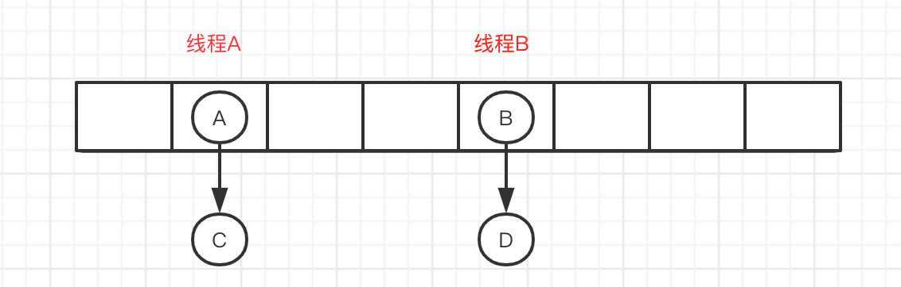

正则表达式

# 1、异常

在 Java 中，所有的异常都有一个共同的祖先 `Throwable`。Throwable中包含两个重要的子类：`Exception`（异常）和 `Error`（错误），二者都是 Java 异常处理的重要子类，各自都包含大量子类。

可分为**运行时异常**和**编译异常**

* **运行时异常**：包括`RuntimeException`类及其子类和`Error`类及其子类(不受检查异常，发生在运行时)。如`NullPointerException`(空指针异常)、`IndexOutOfBoundsException`(下标越界异常)等。程序中可以选择捕获处理，也可以不处理,这些异常一般是***由程序逻辑错误引起***的，程序应该从逻辑角度尽可能避免这类异常的发生
* **编译异常**：`RuntimeException`以外的异常(受检查异常，发生在编译期)。从程序语法角度讲是必须进行处理的异常，如果***不处理，程序就不能编译通过***。如`IOException`、`SQLException`等以及用户自定义的Exception异常，一般情况下不自定义检查异常。

# 2、注解

> 框架=注解 + 反射 + 设计模式

**注解其实就是代码里的特殊标记，这些标记可以在编译，类加载，运行时被读取，并执行相应的处理。**

**元注解**：修饰其他注解的注解

* `@Retention` : SOURCE(被编译器忽略)\CLASS(默认行为,保留在Class文件中，但不会被JVM保留) \RUNTIME (保留至运行时,可以通过**反射**获取注解)
* `@Target`：用于指定被修饰的Annotation能用于修饰哪些程序结构元素
* `@Documented`:表示所修饰的注解在被javadoc解析时，保留下来
* `@Inherited`：被它修饰的Annotation将具有继承性

```java
@Documented
@Target(ElementType.TYPE)
@Retention(RetentionPolicy.RUNTIME)
public @interface MyAnnotation1 {
}
```

JDK8增加的两个：

* `@Repeatable`: Java 8 开始支持，**标识某注解**可以在同一个声明上使用多次。[点击查看详情](https://blog.csdn.net/weixin_42245133/article/details/99678509) 
* `@FunctionalInterface`：Java 8 开始支持，标识一个匿名函数或函数式接口。
* `@SuppressWarnings`: 抑制警告。常用@SuppressWarnings(“unchecked”) //抑制未检查的转换、@SuppressWarnings("all") //抑制所有警告

# 3、反射

> 框架=注解 + 反射 + 设计模式

反射就是把Java类中的各个成分映射为一个个对象，在运行状态中，可以动态获取的一种技术手段。

```bash
获取Class对象
	- .class
	- getClass()
	- Class.forName("全限定名")
反射机制的类
    - Class类：代表一个类，位于java.lang包下
    - Field类：代表类的成员变量，位于java.lang.reflect包下
    - Method类：代表类的方法，位于java.lang.reflect包下
    - Constructor类：代表类的构造方法，位于java.lang.reflect包下
    - Modifier类：代表类和成员访问修饰符，位于java.lang.reflect包下
    - AccessibleObject类：Field，Method和Constructor对象的基类，提供了可改变访问权限
获取Class的方法
    1.类.class	2.实例.getClass()		3.Class.forName("类的全限定名")
常用方法：
	- getName():获取类的类名（包括包名） getSuperClass()获取父类名   
    - getConstructor(Class... param) 得到无参或有参公共构造方法(参数的类型)
    - getFiled(String) 得到指定名字段
    - getFileds()、getMethods()、getConstructors():获取公共的这些属性
    - getDeclaredFields()、getDeclaredMethods()、getDeclaredConstructors()：获取类中声明的所有这些属性
    - getModifiers():获取类的访问权限符

- 具体原理
	首先 JVM 会将我们的代码编译成一个 .class 字节码文件，然后被类加载器（ClassLoader）加载进 JVM 的内存中，同时会创建这个类的 Class 对象存到堆中（注意这个不是 new 出来的对象，而是类的类型对象）。JVM 在创建这个类对象前，会先检查其类是否加载，没有加载过则会加载并分配内存。
```

**优化**

* 反射方式调用效率比用实例调用慢不少，如果经常用反射最好**关闭检测** - `setAccessible(true)`

**优点：**

* 反射提高了Java程序的灵活性和扩展性，降低耦合性
* 它允许程序创建或控制任何类的对象，这是其他常用语言所不具备的

**缺点：**

* 效率问题，使用反射调用方法效率要比实例调用慢不少
* 反射破坏了java的安全性和封装性，模糊了程序内部逻辑，带来维护问题。

## 3.1 静态代理

**静态代理中，我们对目标对象的每个方法的增强都是手动完成的（后面会具体演示代码），非常不灵活**

JVM层面：**静态代理在编译时就将接口、实现类、代理类这些都变成了一个个实际的 class 文件**

```java
// 1.定义发送短信的接口
public interface SmsService {
    String send(String message);
}
// 2.实现发送短信的接口
public class SmsServiceImpl implements SmsService {
    public String send(String message) {
        System.out.println("send message:" + message);
        return message;
    }
}
// 3.创建代理类并同样实现发送短信的接口
public class SmsProxy implements SmsService {

    private final SmsService smsService;

    public SmsProxy(SmsService smsService) {
        this.smsService = smsService;
    }

    @Override
    public String send(String message) {
        //调用方法之前，我们可以添加自己的操作
        System.out.println("before method send()");
        smsService.send(message);
        //调用方法之后，我们同样可以添加自己的操作
        System.out.println("after method send()");
        return null;
    }
}
// 4.实际使用
public class Main {
    public static void main(String[] args) {
        SmsService smsService = new SmsServiceImpl();
        SmsProxy smsProxy = new SmsProxy(smsService);
        smsProxy.send("java");
    }
}
// 输出
before method send()
send message:java
after method send()
```

## 3.2 动态代理

> 🎯**从 JVM 角度来说，动态代理是==在运行时==动态生成==类字节码==，并加载到 JVM 中的。**

**JDK动态代理**

在 Java 动态代理机制中 `InvocationHandler` 接口和 `Proxy` 类是核心。

使用步骤：

* 定义一个接口及其实现类
* 定义 `InvocationHandler` 并重写`invoke`方法，在 `invoke` 方法中我们会调用原生方法（被代理类的方法）并自定义一些处理逻辑
* 通过 `Proxy.newProxyInstance(ClassLoader loader,Class<?>[] interfaces,InvocationHandler h)` 方法创建代理对象

```java
// 核心接口
public interface InvocationHandler {

    /**
     * 当你使用代理对象调用方法的时候实际会调用到这个方法
     * proxy :动态生成的代理类；method : 与代理类对象调用的方法相对应；args : 当前 method 方法的参数
     */
    public Object invoke(Object proxy, Method method, Object[] args)
        throws Throwable;
}

// 1.定义发送短信的接口
public interface SmsService {
    String send(String message);
}
// 2.实现发送短信的接口
public class SmsServiceImpl implements SmsService {
    public String send(String message) {
        System.out.println("send message:" + message);
        return message;
    }
}
// 3.定义一个 JDK 动态代理类
public class DebugInvocationHandler implements InvocationHandler {
    /**
     * 代理类中的真实对象
     */
    private final Object target;

    public DebugInvocationHandler(Object target) {
        this.target = target;
    }

    public Object invoke(Object proxy, Method method, Object[] args) throws InvocationTargetException, IllegalAccessException {
        //调用方法之前，我们可以添加自己的操作
        System.out.println("before method " + method.getName());
        Object result = method.invoke(target, args);
        //调用方法之后，我们同样可以添加自己的操作
        System.out.println("after method " + method.getName());
        return result;
    }
}
// 4.获取代理对象的工厂类
public class JdkProxyFactory {
    public static Object getProxy(Object target) {
        return Proxy.newProxyInstance(
                target.getClass().getClassLoader(), // 目标类的类加载
                target.getClass().getInterfaces(),  // 代理需要实现的接口，可指定多个
                new DebugInvocationHandler(target)   // 代理对象对应的自定义 InvocationHandler
        );
    }
}
// 5.实际使用
SmsService smsService = (SmsService) JdkProxyFactory.getProxy(new SmsServiceImpl());
smsService.send("java");
// 输出
before method send
send message:java
after method send
```

**CGLIB动态代理**

由于JDK动态代理有一个最致命的问题是其只能代理实现了接口的类。CGLIB 通过继承方式实现代理。很多知名的开源框架都使用到了CGLIB。例如 Spring 中的 AOP 模块中：如果目标对象实现了接口，则默认采用 JDK 动态代理，否则采用 CGLIB 动态代理。

CGLIB包的底层是通过使用一个小而快的字节码处理框架`ASM`，来转换字节码并生成新的类

**在 CGLIB 动态代理机制中 `MethodInterceptor` 接口和 `Enhancer` 类是核心。**

使用步骤：

* 定义一个类；
* 自定义 `MethodInterceptor` 并重写 `intercept` 方法，`intercept` 用于拦截增强被代理类的方法，和 JDK 动态代理中的 `invoke` 方法类似
* 通过 `Enhancer` 类的 `create()`创建代理类

```java
// 核心接口
public interface MethodInterceptor extends Callback{
    // 拦截被代理类中的方法
    // obj :被代理的对象（需要增强的对象）;method :被拦截的方法（需要增强的方法）;args :方法入参;proxy :用于调用原始方法
    public Object intercept(Object obj, java.lang.reflect.Method method, Object[] args,MethodProxy proxy) throws Throwable;
}

// 不同于JDK动态代理，CGLIB实际是属于一个开源项目,所以必须手动添加相关依赖
/**
<dependency>
  <groupId>cglib</groupId>
  <artifactId>cglib</artifactId>
  <version>3.3.0</version>
</dependency>
**/
// 1.实现一个使用阿里云发送短信的类
public class AliSmsService {
    public String send(String message) {
        System.out.println("send message:" + message);
        return message;
    }
}
// 2.自定义 MethodInterceptor（方法拦截器）
public class DebugMethodInterceptor implements MethodInterceptor {
    /**
     * @param o           代理对象（增强的对象）
     * @param method      被拦截的方法（需要增强的方法）
     * @param args        方法入参
     * @param methodProxy 用于调用原始方法
     */
    @Override
    public Object intercept(Object o, Method method, Object[] args, MethodProxy methodProxy) throws Throwable {
        //调用方法之前，我们可以添加自己的操作
        System.out.println("before method " + method.getName());
        Object object = methodProxy.invokeSuper(o, args);
        //调用方法之后，我们同样可以添加自己的操作
        System.out.println("after method " + method.getName());
        return object;
    }
}
// 3.获取代理类
public class CglibProxyFactory {

    public static Object getProxy(Class<?> clazz) {
        // 创建动态代理增强类
        Enhancer enhancer = new Enhancer();
        // 设置类加载器
        enhancer.setClassLoader(clazz.getClassLoader());
        // 设置被代理类
        enhancer.setSuperclass(clazz);
        // 设置方法拦截器
        enhancer.setCallback(new DebugMethodInterceptor());
        // 创建代理类
        return enhancer.create();
    }
}
// 4.实际使用
AliSmsService aliSmsService = (AliSmsService) CglibProxyFactory.getProxy(AliSmsService.class);
aliSmsService.send("java");
// 输出
before method send
send message:java
after method send
```

**对比**

* **JDK 动态代理只能代理实现了接口的类或者直接代理接口，而 CGLIB 可以代理未实现任何接口的类。** 另外， CGLIB 动态代理是通过生成一个被代理类的子类来拦截被代理类的方法调用，因此不能代理声明为 final 类型的类和方法。
* 就二者的效率来说，大部分情况都是 JDK 动态代理更优秀，随着 JDK 版本的升级，这个优势更加明显

**总结**

* 灵活性：动态代理更加灵活，不需要必须实现接口，可以直接代理实现类，并且可以不需要针对每个目标类都创建一个代理类。另外，静态代理中，接口一旦新增加方法，目标对象和代理对象都要进行修改，这是非常麻烦的！
* **JVM 层面** ：静态代理在编译时就将接口、实现类、代理类这些都变成了一个个实际的 class 文件。而动态代理是在运行时动态生成类字节码，并加载到 JVM 中的。

# 4、枚举

当需要定义一组常量时，强烈建议使用枚举类型

* 枚举类型的父类是java.lang.Enum。java.lang.Enum的父类是java.lang.Object

```java
enum Season{
    // 1. 多个枚举类型，分割
    SPRING("春天"),
    SUMMER("夏天"),
    AUTUMN("秋天"),
    WINTER("冬天");
    
    // 2.声明Season对象的属性: private final
    private final String seasonName;
    
    // 3.私有构造函数
    private Season(String seasonName){
        this.seasonName = seasonName;
    }
}

//枚举和接口
public enum RoleEnum implements RoleOperation {
    // 系统管理员(有A操作权限)
    ROLE_ROOT_ADMIN {
        @Override
        public String op() {
            return"ROLE_ROOT_ADMIN:" + " has AAA permission";
        }
    },
    // 订单管理员(有B操作权限)
    ROLE_ORDER_ADMIN {
        @Override
        public String op() {
            return"ROLE_ORDER_ADMIN:" + " has BBB permission";
        }
    },
}
```

* 枚举天生自带**单例模式**，且不能被反射破坏 

```java
Constructor的newInstance() =>
if ((clazz.getModifiers() & Modifier.ENUM) != 0)
            throw new IllegalArgumentException("Cannot reflectively create enum objects");
```

* EnumSet\<T\>和EnumMap\<T\>可以用来存放Enum实例。EnumMap可以用来统计某个枚举实例有多少个

# 5、文件输入输出流

## 字节流

基类是InputStream --- OutputStream 。以byte为基本单位

**FileInputStream --- FileOutputStream**

```bash
read(byte b[]) --- write(byte b[]) # 一般循环读取或写入
```

**数据流**

```bash
特点：不用关心数值是几个字节(和随机流很像)
构造：DataInputStream(InputStream in)、DataOutputSteam(OutputStream out)
和随机流区别：可以操作网络数据流
可以发送特定的类型也可以接收特定的类型，而且其他流输出的他接收不到，且他发出的其他流接收不到
```

**对象流**

```bash
特点：将对象序列化写入文件中，或从文件反序列化成对象.其成员对象也必须是序列化的(序列号别忘记serialVersionUID)
构造：ObjectInputStream(InputStream in) 对象输入流      ObjectOutputStream(OutputStream out) 对象输入流
方法：readObject():读取一个对象    writeObject(obj):将对象序列化写入文件

- 序列化内涵：
	序列化： 将数据结构或对象转换成二进制字节流的过程
	反序列化：将在序列化过程中所生成的二进制字节流转换成数据结构或者对象的过程
- 主要目的
	序列化的主要目的是通过网络传输对象或者说是将对象存储到文件系统、数据库、内存中。
- 注意点
	1.注意添加serialVersionUID。如果序列化的类中没有，编译器会自动添加一个。反序列化时会检查两者的serialVersionUID是否一样。不一样会反序列化失败。
	2.不想序列化可以使用transient修饰。另外static修饰的也不会序列化。
```

**数组流**

```java
// 特点：流的源除了文件外，还可以是计算机内存。
// 构造：ByteArrayInputStream(byte[] buf) ByteArrayOutputStream()
// 用途：可用于对象的序列化和反序列化
@SuppressWarnings("unchecked")
private static <T> T cloneInstance(T t) throws IOException, ClassNotFoundException {
    ByteArrayOutputStream baos = new ByteArrayOutputStream();
    ObjectOutputStream oos = new ObjectOutputStream(baos);
    oos.writeObject(t);
    ByteArrayInputStream bais = new ByteArrayInputStream(baos.toByteArray());
    ObjectInputStream ois = new ObjectInputStream(bais);
    return (T)ois.readObject();
}
```

## 字符流

基类是Reader --- Writer 。以字符char为基本单位。字符流首先会将数据写入缓存区，缓存区溢出或流关闭数据才会发送，通过**flush()**可以立刻冲洗到缓存区中发送。

**FileReader --- FileWriter**

```bash
read(char[] c) --- write(char[] c, int start, int len)  # 一般循环读取或写入
```

**缓冲流**

```bash
特点：可以读取一行readLine()  写入回车newLine()或"\n"
构造：BufferedReader(Reader in)、BufferedWriter(Writer out)
一般用于一行一行的读取数值，且可以缓存到内存中，一起发送
```

## 随机流

```bash
特点：即可作为输入流也可作为输出流(操作文件)
构造：RandomAccessFile(String filename,String mode) RandomAccessFile(File file,String mode)
```

## 序列化和反序列化

**基本意图**
	希望Java对象变成字节序列，这样一来方便持久化存储到磁盘，避免程序运行结束后对象就从内存里消失，另外变换成字节序列也更便于网络运输和传播

```java
public static void serialize(  ) throws IOException {
    ObjectOutputStream objectOutputStream = 
        new ObjectOutputStream( new FileOutputStream( new File("student.txt") ) );
    objectOutputStream.writeObject( student );
    objectOutputStream.close();
    
    System.out.println("序列化成功！已经生成student.txt文件");
    System.out.println("==============================================");
}
```

```bash
- Serializable接口有什么用处？
	其实只是起到了一个标记作用，实际的序列化动作不需要靠它完成。
- SerialVersionUID有何用？
	1.serialVersionUID是序列化前后的唯一标识符
	2.默认如果没有人为显式定义过serialVersionUID，那编译器会为它自动声明一个！
	3.如果序列化前后，serialVersionUID不一样则会报错InvalidClassException
- 两种特殊情况
 	1.凡是被static修饰的字段是不会被序列化的(因为序列化的是实例并不是类)
 	2.凡是被transient修饰符修饰的字段也是不会被序列化的(可以将隐私字段用它修饰)
- 序列化的受控和加强
	如果被别人拿到了中间字节流，然后加以伪造或者篡改，那反序列化出来的对象就会有一定风险了。
	毕竟反序列化也相当于一种 “隐式的”对象构造 ，因此我们希望在反序列化时，进行受控的对象反序列化动作。
	解决方法：在需要(反)序列化的类中编写readObject()函数。(也可以类中编写writeObject()函数，对序列化时的字段进行操作)
	private void readObject( ObjectInputStream objectInputStream ) throws IOException, ClassNotFoundException {
    // 调用默认的反序列化函数
    objectInputStream.defaultReadObject();
    // 手工检查反序列化后学生成绩的有效性，若发现有问题，即终止操作！
    if( 0 > score || 100 < score ) {
        throw new IllegalArgumentException("学生分数只能在0到100之间！");
    }
}
- 单例模式增强
	序列化和反序列化作用到一个单例模式的类时，得到的两个实例并不是单例的，所以不符合我们的预期。
	解决方法：在单例类中手写readResolve()函数，直接返回单例对象，来规避之
	private Object readResolve(){
		//返回单例模式的实例属性
	}
		
```

# 6、抽象、泛型

**抽象**

```bash
抽象与接口的共同点和区别？
  相同点：
  	- 不能实例化，都必须被继承或实现才行
  不同点:
  	- 抽象类有构造器，接口没有
  	- 抽象类单继承、接口多继承
  	- 抽象类能实现实例方法，接口不能
```

**泛型**

即`参数化类型`，顾名思义，就是将类型由原来的具体类型参数化。

```java
// 泛型类
public class Generic<T>{ 
    //key这个成员变量的类型为T,T的类型由外部指定  
    private T key;
}
// 泛型接口
public interface Generator<T> {
    public T next();
}
// 泛型方法
// 只有声明了<T>的方法才是泛型方法，泛型类中的使用了泛型的成员方法并不是泛型方法。
public <T> T genericMethod(Class<T> tClass)throws InstantiationException ,IllegalAccessException{
    T instance = tClass.newInstance();
    return instance;
}
```

* 泛型<T>在编译后会被编译器**擦除**成Object。
* 泛型T本质上是Object类型，所以不能用int、boolean等基本类型接收，但可以用其包装类Integer，Boolean接收。
* 常见的通配符：T(type java类型),E(elment 元素),K,V(键值对),?(不确定的java类型)
* ==**PECS原则**==: extend(上界，只能get)和super(下界,只能add)泛型限定符。< ? extends Fruits>指定了内容都是Fruits的子类，但是不知道是哪个子类，所以add操作哪个子类都不能添加，但是get操作可以用Fruits来接收；< ? super Apple>指定了都是Apple的父类，但是不知道是哪个父类，get操作不知道用谁来接收，但是add操作可以用Apple来使用。所以编辑器支持向上转型，不支持向下转型。要重点看 **？**，**？**是对应容器的类型。用于对外暴露端口，使得只能读或者只能写。

# 7、集合框架

在 Java 中除了以 Map 结尾的类之外， 其他类都实现了 Collection 接⼝，以 Map 结尾的类都实现了 Map 接⼝。


**List、Set、Map区别？**

* List储存的元素是有序、可重复的
* Set储存的元素是无序，不可重复的
* Map的key是无序的，不可重复，value是无序的，可重复的。

**List**

* ArrayList： Object[]数组 
* Vector： Object[]数组
* LinkedList ： 双向链表

**Set**

* HashSet （⽆序，唯⼀）: 基于 HashMap 实现的，底层采⽤ HashMap 的key来保存元素
* LinkedHashSet ： LinkedHashSet 是 HashSet 的⼦类，并且其内部是通过LinkedHashMap 来实现的。
* TreeSet (（有序，唯⼀)：红⿊树(⾃平衡的排序⼆叉树)

**Map**

* HashMap ：数组是主体(Node<K,V>[] table)，当遇见哈希冲突时会采用拉链法解决冲突，当当链表⻓度⼤于阈值（默认为 8）(将链表转换成红⿊树前会判断，如果当前数组的⻓度⼩于 64，那么会选择先进⾏数组扩容，⽽不是转换为红⿊树）时，将链表转化为红⿊树，以减少搜索时间
* LinkedHashMap ：LinkedHashMap 继承⾃ HashMap ，所以底层仍然是基于拉链式散列结构即由数组和链表或红⿊树组成。然后在添加元素时，维护了一个双向链表。在HashMap中有三个空方法，是为了给LinkedHashMap 回调，可以来维持链表的顺序。其实就是HashMap+双向链表=LinkedHashMap
* HashTable：数组+链表组成的，数组是 HashMap 的主体，链表则是主要为了解决哈希冲突
  ⽽存在的
* TreeMap ： 红⿊树（⾃平衡的排序⼆叉树）。必须实现Comparable接口。

**无序性和不可重复性**

集合框架说的有序是**指在插入元素时，插入的顺序是否保持，当遍历集合时它是否会按照插入顺序展示**。常见的有序集合有ArrayList，LinkedList，LinkedHashSet，LinkedHashMap等，无序集合有HashSet，HashMap，HashTable，TreeSet，TreeMap等，于此同时TressSet和TressMap又是**可排序**的。

不可重复性，不可重复性是指添加的元素按照 equals()判断时 ，返回 false，需要同时重写 equals()⽅法和 HashCode()⽅法。

## 1.单链表

```bash
与双向链表的区别
	1.无法获取当前节点的前驱节点。所以需要迭代遍历获取
与双向链表的相同点：
	1.可以储存多个value为null的节点
	2.都允许有重复元素，只操作第一个出现的(equlas()判断相同)
函数方法：
	addAll(Collection<? extends E> c); // 添加集合框架的所有元素
	linkLast(E e); // 链接新元素到最后的节点
	unlinkFirst(Node<E> f) // 取消首结点的链接关系，即删除首结点
	unlinkLast(Node<E> l)  //取消尾结点的链接关系，即删除尾结点
	unlink(Node<E> x)  //取消某个节点的链接关系，默认该节点存在
	getFirst() // 获取首结点
	getLast() // 获取尾节点
	remove(int index) // 移除该位置的节点	
	iterator() // 迭代器 实现链表的迭代器(next)
节点：
private static class Node<E>{
    E item;
    Node<E> next;
    Node(E item, Node<E> next) {
        this.item = item;
        this.next = next;
    }
}	
主要属性：
	private transient int size = 0;	// 容量
	private transient Node<E> head;	// 头结点
	private transient Node<E> last; // 尾节点
	protected transient int modCount = 0; //修改次数
```

## 2.双链表(LinkedList)

```
与单链表结构基本一样，唯一区别是存在前驱节点，在进行操作时要考虑前驱节点的变更。
```

## 3.顺序列表(ArrayList)

```bash
重要参数：
	DEFAULT_CAPACITY=10 	// 默认容量
	EMPTY_ELEMENTDATA={} 	//空数组，在指定容量为0时赋予列表
	DEFAULTCAPACITY_EMPTY_ELEMENTDATA={} 	//默认容量的空数组，调用空构造函数赋予
	Object[] elementData; 					// 主要存储单元，扩容时扩的是这个数组的长度
	size; 					// 数组元素个数,只在实际添加元素时+1，扩容时并不增加
	int modCount = 0; 		// 修改次数，与快速失败有关
构造函数：
	1.public MyArrayList() {...}
	2.public MyArrayList(int initialCapacity) {...}
	3.public MyArrayList(Collection<? extends E> c) {...}
扩容机制：
	1.如果采用构造函数1初始化，则在add()前,elementData长度为0；add时，才创建一个容量为10数组，进而继续增加
	2.如果采用构造函数2初始化，不能触发默认容量10，则容量从1开始，如果后续添加元素超过数组容量，则每次扩容1.5倍！
	3.详细流程:add前，检查size+1位置是否已经初始化-->检查最小容量(如果数组为空，则返回10，否则返回size+1)-->modCount++ --> 判断elementData长度是否包括即将添加的位置 -->不包括则扩容1.5倍，通过Arrays.copyOf()实现。包括则不扩容
	
- 1.与链表的区别：
	1.是否保证线程安全：ArrayList 和 LinkedList 都是不同步的，也就是不保证线程安全
	2.底层数据结构：Arraylist 底层使⽤的是 Object 数组； LinkedList 底层使⽤的是 双向链表 数据结构
	3.插⼊和删除是否受元素位置的影响： ArrayList 采⽤数组存储，所以插⼊和删除元素的时间复杂度受元素位置的影响,由于在增加时增加的位置不在数组的初始化范围内，此时需要通过Arrays.copyOf()扩容1.5倍，然后在进行赋值； LinkedList 采⽤链表存储，所以对于 add(E e) ⽅法的插⼊，删除元素时间复杂度不受元素位置的影响，近似 O(1)，如果是在指定位置添加的话，则会判断离首部或尾部进然后挨个查找，复杂度O(n)
	4.是否⽀持快速随机访问：LinkedList 不⽀持⾼效的随机元素访问，⽽ ArrayList ⽀持。因为ArrayList是顺序存储，链表是链式储存
	5.内存占用。由于ArrayList需要动态1.5倍扩容，所以内存浪费就体现在列表尾部预留的一定空间；LinkedList则是每个元素占用空间都比ArrayList多，因为要包含前后节点的引用。
	
- 插入方面的对别
	头插：ArrayList需要对数据原句移位，还能需要扩容。而LinkedList则只需要创建头节点然后放在首位即可。 比较：LinkedList比ArrayList更快
	尾插：ArrayList和LinkedList都是需要放入尾部，只是ArrayList可能需要扩容。 比较：ArrayList在数量比较大的时候，效率要比LinkedList高不少
	中间插：那肯定LinkedList效率

- 2.Arraylist 和 Vector 的区别? 
	ArrayList 底层使⽤ Object[ ]存储，适⽤于频繁的查找⼯作，线程不安全 
	Vector 是 List 的古⽼实现类，底层使⽤ Object[ ]存储，线程安全的
```

## 4.Set

```bash
- 比较 HashSet、LinkedHashSet 和 TreeSet 三者的异同
	1.HashSet 是 Set 接⼝的主要实现类 ，HashSet 的底层是 HashMap，线程不安全的
	2.LinkedHashSet 是 HashSet 的⼦类，能够按照添加的顺序遍历
	3.TreeSet 底层使⽤红⿊树，能够按照元素大小的顺序进⾏遍历，排序的⽅式有⾃然排序和定制排序。
```

## 5.Map

```bash
键值对的数据结构称之为Map
- HashMap 和 Hashtable 的区别
	1. 线程是否安全： HashMap 是⾮线程安全的，HashTable 是线程安全的,因为 HashTable 内部的⽅法基本都经过 synchronized 修饰
	2. 效率：HashMap效率更高。
	3.HashMap只允许有一个null的key值和多个null的value值，HashTable不允许有null值。
	4.底层数据结构：HashMap是数组+链表+红黑树。HashTable是数组+链表
	5.扩容方式不同，hashmap是2*n，而hashtable是2*n+1
	
- HashMap和TreeMap 区别
	1.底层数据结构：HashMap是数组+链表+红黑树，TreeMap是链式存储的二叉树(红黑树)
	2.TreeMap实现了NavigableMap 接⼝和 SortedMap 接⼝，NavigableMap 接⼝让TreeMap有了搜索的能力， SortedMap让TreeMap有了排序的能力。
	3.TreeMap不需要扩容。

- HashSet如何检查重复
	当你把对象加⼊ HashSet 时，HashSet 会先计算对象的 hashcode 值来判断对象加⼊的位置，同时也会与其他加⼊的对象的 hashcode 值作⽐较，如果没有相符的 hashcode，HashSet 会假设对象没有重复出现。但是如果发现有相同 hashcode 值的对象，这时会调⽤ equals() ⽅法来检查 hashcode 相等的对象是否真的相同。如果两者相同，HashSet 就不会让加⼊操作成功。

- ConcurrentHashMap 和 Hashtable 的区别
	1.底层数据结构：JDK1.8 采⽤的ConcurrentHashMap数据结构跟 HashMap1.8 的结构⼀样，数组+链表/红⿊⼆叉树，Hashtable 的底层数据结构类似都是采⽤ 数组+链表
	2：实现线程安全的⽅式：`Hashtable`(同⼀把锁) :使⽤ synchronized 来保证线程安全，使用的是同一把锁，效率⾮常低下。当⼀个线程访问同步⽅法时，其他线程也访问同步⽅法，可能会进⼊阻塞或轮询状态，如使⽤ put 添加元素，另⼀个线程不能使⽤ put 添加元素，也不能使⽤get，竞争会越来越激烈效率越低；`ConcurrentHashMap`使用volatile的node数组，防止指令重排序和保证内存可见，因为指令重排序也会在极端情况下造成不安全，并发控制使⽤synchronized 和 CAS 来操作，synchronized 只锁定当前链表或红⿊⼆叉树的⾸节点，这样只要 hash 不冲突，就不会产⽣并发，效率⼜提升 N 倍。线程A锁住A节点所在链表，线程B锁住B节点所在链表，操作互不干涉。
```

### 5.1 TreeMap

```bash
// NavigableMap 接⼝让TreeMap有了搜索的能力
// SortedMap让TreeMap有了排序的能力
public class TreeMap<K,V>
    extends AbstractMap<K,V>
    implements NavigableMap<K,V>, Cloneable, java.io.Serializable
{
	private transient Entry<K,V> root; // 底层数据结构
	
	public TreeMap() { // 默认的是递增
        comparator = null;
    }
	
	public TreeMap(Comparator<? super K> comparator) { // 自定义比较器
        this.comparator = comparator;
    }

	static final class Entry<K,V> implements Map.Entry<K,V> {
        K key;
        V value;
        Entry<K,V> left;   // 左子树
        Entry<K,V> right;  // 右子树
        Entry<K,V> parent; //父节点
        boolean color = BLACK; // 黑节点
        
        ...
	}
}

// 自定义排序比较器
TreeMap<Person, String> treeMap = new TreeMap<>((person1, person2) -> {
 	int num = person1.getAge() - person2.getAge();
 	return Integer.compare(num, 0);
});
```

### 5.2 HashMap

```bash
public class HashMap<K,V> extends AbstractMap<K,V> implements Map<K,V>, Cloneable, Serializable {
	
	static final int DEFAULT_INITIAL_CAPACITY = 1 << 4; // 默认容量16
    static final float DEFAULT_LOAD_FACTOR = 0.75f;     // 默认装载因子0.75
    static final int TREEIFY_THRESHOLD = 8;				// 树化阈值8
    static final int UNTREEIFY_THRESHOLD = 6;			// 退化链表阈值6

    static class Node<K,V> implements Map.Entry<K,V> {
        final int hash;
        final K key;
        V value;
        Node<K,V> next;
	}
}
1.HashMap初始化只会赋值负载因子和阈值(Object[]容量却不初始化)
```

**1、那你跟我讲讲HashMap的内部数据结构？**

目前我用的是JDK1.8版本的，内部使用数组 + 单链表+红黑树；


当链表长度>8&数组大小>=64则转为红黑树，否则继续扩容；如果红黑树节点个数<6，则转为链表，6和8不一样，是为了避免红黑树和链表频繁转换。

**2、那你清楚HashMap的数据插入原理吗？**


```bash
1、对HashMap集合进行判空此操作，空容量会使用resize()初始化，默认长度为16，装载因子是0.75，即阈值为12
2.对key的hashcode做扰乱函数处理过后得到hash值，在通过(n-1)&hash确定当前元素需要存在的位置(n指数组长度)
3.如果指定的位置不存在其他元素，则直接存放节点；如果存在其他元素，则使用hash对比和equals对比，都一样则直接替换；否则进行下一个元素的比较。
4.如果是红黑树的实例，则采用红黑树的方式遍历比较；如果是链表则采用链表的方法遍历比较，直到找到并返回并进行值的覆盖；否则添加在末端，如果是链表的话还需要判断是否需要树化操作(链表节点数>8)
5.添加完毕后，判断数组的节点个数是否大于阈值，大于则扩容，否则不扩容。
```

**3、那它的扰乱函数是什么**

```java
static final int hash(Object key) {
    int h;
    return (key == null) ? 0 : (h = key.hashCode()) ^ (h >>> 16);
}
// 扰乱函数是将hashcode的低16位与高16位异或操作，高16位不变，得到的32位整形数作为扰乱后的hash值。
// 将处理后的hash值 & (table数组长度-1)  ---à 得到此key下的应该处的数组位置

// 1.尽可能降低hash碰撞，越分散越好
// 2.hash值需要经常获取，所以算法一定越高效越好，采用为运算很快。
```

**4、hashmap是如何进行初始化的**

如果什么都不传的构造方法，在添加元素时会将默认大小设为16，负载因子是0.75；如果自己传了负载因子则用自己传的负载因子；如果自己传了初始化大小x，则会采用比>=x的2的整数次方作为数组长度。例如传入10，大小为16

```java
static final int tableSizeFor(int cap) {
  int n = cap - 1; 
  n |= n >>> 1; // >>>是无符号右移  表示以2为单位的相邻两个位置值一样
  n |= n >>> 2;	// 表示以4为单位的相邻两个位置值一样
  n |= n >>> 4; // 表示以8为单位的相邻两个位置值一样
  n |= n >>> 8; // 表示以16为单位的相邻两个位置值一样
  n |= n >>> 16; // 表示以32为单位的相邻两个位置值一样
  return (n < 0) ? 1 : (n >= MAXIMUM_CAPACITY) ? MAXIMUM_CAPACITY : n + 1;
}
```

**5、为什么采用hashcode的高16位和低16位异或能降低hash碰撞？hash函数能不能直接用key的hashcode？**

```bash
首先哈希码是32位的int类型，大约有40亿的映射空间，直接用hashcode来定位的话，大部分只会用到低位的随机性，会丢失很多高位的随机性。所以是为了混合原始哈希码的高位和低位，以此来加大低位的随机性，而且混合后的低位掺杂了高位的部分特征，这样高位的信息也被变相保留下来。另外在1.7版本，做了4次移位和4次异或，1.8为了效率问题，就只做了一次扰动。
```

**6、还要别的优化嘛**

```bash
1.数组+链表改成了数组+链表或红黑树；
2.链表的插入方式从头插法改成了尾插法，简单说就是插入时，如果数组位置上已经有元素，1.7将新元素放到数组中，原始节点作为新节点的后继节点，1.8遍历链表，将元素放置到链表的最后；
3.扩容的时候1.7需要对原数组中的元素进行重新hash定位在新数组的位置，1.8采用更简单的判断逻辑，位置不变或索引+旧容量大小；
```

**7、为什么要做这几点优化**

```bash
1.由于链表是查找复杂度是O(n)，二叉排序树是时间复杂度是O(logn)，红黑树是为了解决二叉排序树在插入有序数据时导致退化成链表，进而查找效率低的问题，所以改进了红黑树进行查找。
2.因为1.7头插法扩容时，头插法会使链表发生反转，多线程环境下会产生环
3.jdk1.8的扰乱函数更快
```

**8、那你平常怎么解决这个线程不安全的问题？**

Java中有HashTable、Collections.synchronizedMap、以及ConcurrentHashMap可以实现线程安全的Map。

```bash
HashTable是直接在操作方法上加synchronized关键字，锁住整个数组，粒度比较大，Collections.synchronizedMap是使用Collections集合工具的内部类，通过传入Map封装出一个SynchronizedMap对象，内部定义了一个对象锁，方法内通过对象锁实现；
ConcurrentHashMap使用分段锁，降低了锁粒度，让并发度大大提高。
```

**9、那你知道ConcurrentHashMap的分段锁的实现原理吗**

ConcurrentHashMap成员变量使用**volatile** 修饰，免除了指令重排序，同时保证内存可见性，另外使用**CAS操作和synchronized**结合实现赋值操作，多线程操作只会锁住当前操作索引的节点。

如下图，线程A锁住A节点所在链表，线程B锁住B节点所在链表，操作互不干涉。

**10、你前面提到链表转红黑树是链表长度达到阈值，这个阈值是多少？**

```bash
阈值是8且数组>=64，红黑树转链表阈值为6

- 为什么是8，不是16，32甚至是7 ？又为什么红黑树转链表的阈值是6，不是8了呢？
	因为经过计算，在hash函数设计合理的情况下，发生hash碰撞8次的几率为百万分之6，概率说话。。因为8够用了，至于为什么转回来是6，因为如果hash碰撞次数在8附近徘徊，会一直发生链表和红黑树的互相转化，为了预防这种情况的发生
```

https://github.com/Snailclimb/JavaGuide/blob/main/docs/java/collection/hashmap-source-code.md

**12.跟我讲讲LinkedHashMap怎么实现有序的？**

LinkedHashMap继承⾃ HashMap ，它内部维护了一个双向链表，有头尾节点，同时LinkedHashMap节点Entry内部除了继承HashMap的Node属性，还有before 和 after用于标识前置节点和后置节点。可以实现按插入的顺序或访问顺序排序。

**13、请你介绍一下HasMap的扩容**

```bash
- 何时扩容
	HashMap中元素的数量越来越多，发生碰撞的概率将越来越大。为了保证HashMap的效率，系统必须要在某个临界点进行扩容处理，该临界点就是HashMap中元素的数量在数值上等于threshold（table数组长度*加载因子）

- 在插入一个临界节点时，HashMap是先扩容后插入还是先插入后扩容？
	先插入后扩容。因为HashMap是先插入完一个元素后，才对++size进行判断，进而扩容的。而ArrayList则是先扩容在添加元素。Arraylist会对即将插入的位置进行判断，如果即将插入的位置不在数组范围内，就会选择先Arrays.copyOf()扩容在将元素进行插入。
```

```java
// 扩容resize()
final Node<K,V>[] resize() {
        Node<K,V>[] oldTab = table;	//赋值Node数组给oldTab
        int oldCap = (oldTab == null) ? 0 : oldTab.length;	//容量赋给oldCap
        int oldThr = threshold;	// 阈值赋给oldThr
        int newCap, newThr = 0;
        if (oldCap > 0) {	// 2参数初始化 初始化时对阈值和负载因为都初始化了 并且适用于后续扩容
            if (oldCap >= MAXIMUM_CAPACITY) {
                threshold = Integer.MAX_VALUE;
                return oldTab;
            }
            else if ((newCap = oldCap << 1) < MAXIMUM_CAPACITY &&
                     oldCap >= DEFAULT_INITIAL_CAPACITY)
                newThr = oldThr << 1; // double threshold
        }
        else if (oldThr > 0) // 1参数初始化，初始化时只初始化阈值容量的情况
            newCap = oldThr;
        else {               // 零参数初始化，new HashMap(),阈值和负载因为都为0
            newCap = DEFAULT_INITIAL_CAPACITY;
            newThr = (int)(DEFAULT_LOAD_FACTOR * DEFAULT_INITIAL_CAPACITY);
        }
        if (newThr == 0) {
            float ft = (float)newCap * loadFactor;
            newThr = (newCap < MAXIMUM_CAPACITY && ft < (float)MAXIMUM_CAPACITY ?
                      (int)ft : Integer.MAX_VALUE);
        }
        threshold = newThr;	// 更新最新阈值
        @SuppressWarnings({"rawtypes","unchecked"})
        Node<K,V>[] newTab = (Node<K,V>[])new Node[newCap];	// 先定义最新容量的数组，此时Node还没有转移过来
        table = newTab;	// 引用赋值，此时还是是空数组，Node并没有转移
        if (oldTab != null) {
            for (int j = 0; j < oldCap; ++j) {
                Node<K,V> e;
                if ((e = oldTab[j]) != null) {	// Node数组上不为null的才进行转移操作
                    oldTab[j] = null;	//将老数组的引用消除，后续可以垃圾回收
                    if (e.next == null)	// 1.如果此节点是单独的一个节点
                        newTab[e.hash & (newCap - 1)] = e;	//在老数组插入此元素时就将hash值进行了存储，此时位于数组上的节点直接与newCap - 1进行&运算获得新位置，并赋值
                    else if (e instanceof TreeNode)	// 2.如果此节点是红黑树
                        ((TreeNode<K,V>)e).split(this, newTab, j, oldCap);	
                    else { // preserve order	此节点是链表
                        Node<K,V> loHead = null, loTail = null;
                        Node<K,V> hiHead = null, hiTail = null;
                        Node<K,V> next;
                        do {
                            next = e.next;
                            if ((e.hash & oldCap) == 0) {	//由于新容量比老容量左移了一位，而且一定是2的n次方。注意之前添加的时候索引位置是hash&(n-1)，而oldCap比n-1多了1，n-1是地位全是1，而oldCap则是高位一位为1，所以e.hash & oldCap如果是0，则位置不变，如果不为0，则变为索引位+旧容量位置。
                                if (loTail == null)
                                    loHead = e;
                                else
                                    loTail.next = e;
                                loTail = e;
                            }
                            else {
                                if (hiTail == null)
                                    hiHead = e;
                                else
                                    hiTail.next = e;
                                hiTail = e;
                            }
                        } while ((e = next) != null);
                        // 使用两个链表，然后结束后分别赋值到对应位置j和j+oldCap
                        if (loTail != null) {
                            loTail.next = null;
                            newTab[j] = loHead;
                        }
                        if (hiTail != null) {
                            hiTail.next = null;
                            newTab[j + oldCap] = hiHead;
                        }
                    }
                }
            }
        }
        return newTab;
    }
```

**14.请你说一下为什么引入红黑树而不是AVL树**

首先二叉查找树BST，在极端境况下会退化为链表，导致查找复杂度退化为O(n)。为了解决这个问题，引入了二叉平衡树，其任意节点的左右子树的高度差不能超过1，如果超过就进行左旋和右旋操作，解决了BST退化为链表的问题，且查找效率达到了O(logn)，不过因为其要求太过严格，在插入删除节点时，几乎都会破坏平衡规则，导致不断左旋右旋，在插入频繁时这种转变会很影响效率，所以引入了红黑树，为节点增加了颜色，红色黑色相间分布，且并非严格的平衡条件，使它在**任何不平衡都会在三次旋转之内解决**，相对于AVL树维持平衡的开销要小很多。

在插入效率上红黑树比AVL要高，但是查找效率因为AVL是严格平衡的，所以查找效率要比红黑树高一些。HashMap这种数据结构，明显搜索、插入、删除频率都差不多，所以选择红黑树。

### 5.3 LinkedHashMap

```bash
- 特点
	虽然LinkedHashMap增加了时间和空间上的开销，但是它通过维护一个额外的双向链表保证了迭代顺序==。特别地，==该迭代顺序可以是插入顺序，也可以是访问顺序。特别需要注意的是，next用于维护HashMap各个Node的连接顺序，before、after用于维护Entry插入的先后顺序
	

- 基本单位
	static class Entry<K,V> extends HashMap.Node<K,V> {
        Entry<K,V> before, after;
        Entry(int hash, K key, V value, Node<K,V> next) {
            super(hash, key, value, next);
        }
    }

- 基本属性
	# 头节点引用
	transient LinkedHashMap.Entry<K,V> head;
	# 尾节点引用
	transient LinkedHashMap.Entry<K,V> tail;
	# true表示按照访问顺序迭代，false时表示按照插入顺序
	# 为true时，put的元素放入双向链表的尾部，get的元素也放入双向链表的尾部
	# 为fales时，put的元素放入双向链表的尾部，get不变化
	final boolean accessOrder;

- 引申
	可以用LinkedHashMap实现LRU，此时accessOrder标志位需要设置为true，以便开启按访问顺序排序的模式。这样无论是put还是get都会将元素放入双向链表的尾部，实现了最近访问的Entry放入双向链表的后面，那么在节点个数满的时候，就可以删除最前面的Entry，因为他是最近最少没有使用的
```

## 6.Collections工具类

**排序操作**

```bash
void reverse(List list)//反转
void shuffle(List list)//随机排序
void sort(List list)//按⾃然排序的升序排序
void sort(List list, Comparator c)//定制排序，由Comparator控制排序逻辑
void swap(List list, int i , int j)//交换两个索引位置的元素
```

**同步控制**

最好不要⽤下⾯这些⽅法，效率⾮常低，需要线程安全的集合类型时请考虑使⽤ JUC 包下的并发集
合。

```bash
synchronizedCollection(Collection<T> c) //返回指定 collection ⽀持的同步（线程安全的）collection。
synchronizedList(List<T> list)//返回指定列表⽀持的同步（线程安全的）List。
synchronizedMap(Map<K,V> m) //返回由指定映射⽀持的同步（线程安全的）Map。
synchronizedSet(Set<T> s) //返回指定 set ⽀持的同步（线程安全的）set。
```

## 七.其他

**快速失败**

快速失败(fail-fast) 是 Java 集合的⼀种错误检测机制。在使⽤迭代器对集合进⾏遍历的时候，我们在多线程下操作⾮安全失败(fail-safe)的集合类可能就会触发 fail-fast 机制，导致抛出ConcurrentModificationException 异常。 另外，在单线程下，如果在遍历过程中对集合对象的内容进⾏了修改的话也会触发 fail-fast 机制。

原因是每当迭代器使⽤ hashNext() / next() 遍历下⼀个元素之前，都会检测 modCount 变量是否expectedModCount 值，是的话就返回遍历；否则抛出异常，终⽌遍历。如果遍历时使用list增删改后，就会改变 modCount 的值，进⽽导致 modCount != expectedModCount ，进而抛出 ConcurrentModificationException 异常。

```bash
final void checkForComodification() {
 	if (modCount != expectedModCount)
 	throw new ConcurrentModificationException();
}
// 迭代器遍历时，不能使用list来remove，需要用iterator来remove，不然会抛异常。
// 但是CopyOnWriteList在迭代器遍历时list用remove删除元素，任然不会出现快速失败。原因是复制，他会将原数组进行复制一份，然后在复制那份的数组上进行操作，然后在改变引用。缺点是：消耗空间。
```

**安全失败**

采⽤安全失败机制的集合容器，在遍历时不是直接在集合内容上访问的，⽽是先复制原有集合内容，在拷⻉的集合上进⾏遍历。所以，在遍历过程中对原集合所作的修改并不能被迭代器检测到，故不会抛Concurrent ModificationException异常。

**Arrays.asList()避坑指南**

Arrays.asList()转换的List集合，其实是Arrays的一个内部类，并不是ArrayList，所以add() 、remove() 、clear()都会抛异常，只能查看和改值，还是具有数组的性质。

# 8、动态代理

**静态代理**：若代理类在**程序运行期前**就存在，那么这种代理方式被成为 静态代理 。

**缺点：**1.如果被代理类的方法较多，则需要实现很多方法 

```java
/**
 * 委托类和代理类都实现了Sell接口
 */
public interface Sell { 
    void sell(); 
    void ad(); 
} 
//被代理类(略)
/**
 * 代理类
 */
public class BusinessAgent implements Sell {
    private Sell vendor;
    
    public BusinessAgent(Sell vendor){
        this.vendor = vendor;
    }
    public void sell() { 
        vendor.sell();
    }  
    public void ad() {
        vendor.ad();
    }
} 
```

**JDK动态代理**:利用拦截器（必须实现InvocationHandler接口）加上**反射机制**生成一个代理接口的匿名类，在调用具体方法前调用InvokeHandler来处理。必须实现接口，否则不能使用。

```java
//InvocationHandler
public class DynamicProxy implements InvocationHandler { 
    //obj为委托类对象; 
    private Object obj; 
 
    public DynamicProxy(Object obj) {
        this.obj = obj;
    } 
 
    @Override 
    public Object invoke(Object proxy, Method method, Object[] args) throws Throwable { 
        System.out.println("before"); 
        Object result = method.invoke(obj, args); 
        System.out.println("after"); 
        return result; 
    }
} 
```

**Cglib动态代理**：利用ASM框架，对代理对象类生成的class文件加载进来，通过**修改其字节码生成子类来进行代理**。那么代理类不能使用final修饰类和方法。

```java
public class UserServiceCGlib implements MethodInterceptor {
    ////obj为委托类对象; 
    private Object target;

    public UserServiceCGlib() {
    }

    public UserServiceCGlib(Object target) {
        this.target = target;
    }

    //返回一个代理对象:    是 target对象的代理对象
    public Object getProxyInstance() {
        //1. 创建一个工具类
        Enhancer enhancer = new Enhancer();
        //2. 设置父类
        enhancer.setSuperclass(target.getClass());
        //3. 设置回调函数
        enhancer.setCallback(this);
        //4. 创建子类对象，即代理对象
        return enhancer.create();
    }

    @Override
    public Object intercept(Object o, Method method, Object[] objects, MethodProxy methodProxy) throws Throwable {
        System.out.println("增强开始~~~");
        Object result = methodProxy.invokeSuper(o, objects);
        System.out.println("增强结束~~~");
        return result;
    }

}
```

# 9、新特性

## 9.1 JDK8

**Optional**

`Optional`本质是个容器，你可以将你的变量交由它进行封装，这样我们就不用显式对原变量进行 `null`值检测，防止出现各种空指针异常。

```java
publicn Integer getScore( Student student ) {
    return Optional.ofNullable(student)           
				.map(Student::getSubject)
				.map(Subject::getScore)            
    			.orElse(null);
}  
```

```bash
方法解释：
- ofNullable()：获取某个对象，如果为空则返回空值，不为空则value为此对象
- isPresent():value值是否为null
- map(Function接口)：得到Function处理后的值(由Optional包装)
- orElse(default):如果value为null，则返回default，否则返回value值
```

**Stream流式计算**

```java
String result = list.steam() 	// 首先将列表转化为Stream流
    .filter(i -> !isNum(i))		// 首先筛选出字母型字符串
    .filter(i -> i.length() >= 5)// 其次筛选出疮毒>=5的字符串
    .map(i -> i.toLowCase()) 	// 字符串统一转小写
    .distinct()					// 去重操作一下
    .sorted(Comparator.naturalOrder())	// 字符串排序一下
    .collect(Collectors.joining("❤"));	// 连词成句来一下

1.int转换为List
    int[] arr = {1,2,3,4,5};
	List<Integer> list = Arrays.stream(a).boxed().collect(Collectors.toList());
2.List转换为int[]
    int[] arr = list.stream().mapToInt(Integer::valueOf).toArray();


```

```java
// Stream接口方法
// 比较接口
@FunctionalInterface
public interface Comparator<T> {
    int compare(T o1, T o2);	// 负数、0、正数代表小于、等于、大于
}
// 预测接口，符合条件返回true
@FunctionalInterface
public interface Predicate<T> {
    boolean test(T t);
}
// 函数接口 而ToIntFunction接口是R默认为int类型
@FunctionalInterface
public interface Function<T, R> {
    R apply(T t);
}
// 消费者接口
@FunctionalInterface
public interface Consumer<T> {
    void accept(T t);
}
1.过滤操作
    过滤操作： filter() 根据条件过滤元素
    方法原型：Stream<T> filter(Predicate<? super T> predicate);
	用法：IntStream.of(2, 4, 8).filter(e -> e >= 5).forEach(System.out::println);
2.转换操作
    转换操作： map()、mapToInt()、mapToDouble()
    方法原型：<R> Stream<R> map(Function<? super T, ? extends R> mapper);
			IntStream mapToInt(ToIntFunction<? super T> mapper);//R默认为int类型
	用法：IntStream.of(1, 2, 3).map(e -> e * 2).forEach(System.out::println);
		 IntStream.of(nums).boxed().mapToInt(Integer::intValue).toArray();
3.去重操作
    去重操作： distinct()
    方法原型：Stream<T> distinct()
    用法：IntStream.of(1, 2, 2, 3).distinct()
4. 排序操作
    排序操作： sorted()
    方法原型：Stream<T> sorted();
    		 Stream<T> sorted(Comparator<? super T> comparator);
	用法：.sorted()	// 默认从小到达排序(正序)。
5.限流操作
    限流操作： limit()
    用法：IntStream.range(0, 100000).limit(15) // 截取前15个
6.遍历操作
    遍历操作： foreach()
    方法原型： void forEach(Consumer<? super T> action);
	用法：IntStream.of(1,5,-9,0,-5,2,5,8).forEach(System.out::println);
7.数组操作
    数组操作： toArray()
8.收集操作
    收集操作： collect()
    用法：Arrays.stream(arr).boxed().collect(Collectors.toList());
9.数学操作
    数学操作： sum()、max()、min()、count()、average()
10.装箱操作：将基本类型状态包装类类型，诸如int->Integer
    装箱操作： boxed() 
    用法：Arrays.stream(arr).boxed().collect(Collectors.toList());
```

**方法引用**

方法引用通过方法的名字来指向一个方法。方法引用使用一对冒号 **::** 

# 10、遗漏点

* import java.util.\*  只能访问java.util包下的所有类，不能访问java.util子包下的所有类。例如java.lang.\*不能访问java.lang.reflect.\*的类

* int i = -5; i = ++(i++);这段代码会报错。因为先执行括号中的i++ 在执行i++的时候 Java会将i先存放到一个临时变量中去 **并返回该临时变量的值（假设为temp）**；  所以 这句可以拆成 temp = i （值为-5） 并返回temp的值 然后 i自加1 此时 i 的值为-4 但是之后 执行就会出现问题 由于返回了temp的值 继续执行的表达式为 **i = ++(-5)**; 单目运算符无法后跟一个**字面量** 所以在IDEA编辑器中提示Variable expected（此处应为变量） 

* **byte类型**的变量在做运算时被会**自动转换**为**int类型**的值 ；**+=**会**自动强转**（自动装箱功能） 

* try{}catch{}finally{}

  ```bash
  1. 如果try语句中有return语句，则finally语句是在try的return语句执行之后，return语句返回之前执行的。
  2. finally块中的return语句会覆盖try块的return语句
  3. 如果finally中没有返回值，那么原来的返回值可能会因为finally的修改而改变。ps:传的地址的拷贝对其中的内容修改可以改变，如果是基本类型的值拷贝，则修改无效。
  4. 发生异常后，try的return不会执行。catch{}里的return情况和try{}一样。
  ```

* String和对象的默认值是null，基本数据类型的默认值是0。

* 程序执行顺序：（1）类加载之后，按从上到下（从父类到子类）执行被static修饰的语句（2）当static语句执行完之后,再执行main方法；（3）如果有语句new了自身的对象，将从上到下分别执行构造代码块、构造器。

  ```java
  class HelloA{
      public HelloA(){
          System.out.println("HelloA");
      }
      { System.out.println("I'm A class"); }
      static{ System.out.println("static A"); }
  }
  public class HelloB extends HelloA{
      public HelloB(){
          System.out.println("HelloB");
      }
      { System.out.println("I'm B class"); }
      static{ System.out.println("static B"); }
      public static void main(String[] args){
          System.out.println("-------main start---------");
          new HelloB();
          System.out.println("-------main end---------");
      }
  }
  //结果
  //1. static A 、static B
  //2.-------main start---------
  //3. I'm A class 、HelloA
  //4. I'm B class 、HelloB
  //5.-------main end---------                         
  ```

* ==**java是值传递而不是引用传递**==。在方法中传递对象或者基本数据类型时，传递的都是该东西的一个==**副本**==，所以传递对象时，无法通过改变引用(地址)而改变原对象的值，只能通过改变地址上的值进行改变；传递基本数据类型时一样，改变的值只是方法内的，外部的此值不会受到影响。对象数据和基本类型数组一样的道理。

* **访问修饰符**：不同包下，实例只可以访问public权限，同包下实例实例可以访问非private权限。

  不同包下，子类只可以继承public和protected，同包下子类可以继承到public/default/protected。所以default为包的限定范围。

  
  
* 如果两个对象equals()返回true，则他们的hashCode()一定也是true;如果他们的equals()返回false则hashCode()可能是true也可能是false。

* List锦集

  ```bash
   1.Arrays.asList返回的ArrayList实例，并不是java.util.ArrayList，而是Arrays的一个内部类，所以不能进行增改操作。
   2.切记不要随便在foreach增加和删除元素(只能通过迭代器删除)。平常删除可以使用removeIf()方法
  ```

* Map集锦

  ```bash
  1.HashMap可以存null的key和value,ConcurrentHashMap不可以，会抛出NullPointException。建议在Map 中加入元素之前，主动进行空指针判断
  2.HashMap的key存入自定义对象时，必须重写equals和hashcode方法。
  3.ConcurrentHashMap 是线程安全的容器，但是不要思维定势，不要片面认为使用 ConcurrentHashMap 就会线程安全。组合操作也会导致其不安全。
  4.keySet()、values()、entrySet()返回的集合不支持增改，只支持删和清空。
  ```

* **重载和重写**：重载发生在编译期多态，重写发生运行期多态，编译器只根据参数类型和长度来确定调用哪个方法，运行时则根据子类是否重写来动态变化。重写遵循“**两同两小一大**”：“两同”即方法名相同、形参列表相同；“两小”指的是子类方法返回值类型应比父类方法返回值类型更小或相等，子类方法声明抛出的异常类应比父类方法声明抛出的异常类更小或相等；“一大”指的是子类方法的访问权限应比父类方法的访问权限更大或相等。重载要求方法名相同，参数类型个数顺序要求不同，方法返回值和访问修饰符可以不同。

* **包装类型的常量池技术**：`Byte`,`Short`,`Integer`,`Long` 这 4 种包装类默认创建了数值 **[-128，127]** 的相应类型的缓存数据，`Character` 创建了数值在 **[0,127]** 范围的缓存数据，`Boolean` 直接返回 `True` or `False`。两种浮点数类型的包装类 `Float`,`Double` 并没有实现常量池技术。

  ```java
  Integer i1 = 33;
  Integer i2 = 33;
  System.out.println(i1 == i2);// 输出 true
  
  Integer i1 = 40;
  Integer i2 = new Integer(40); // 因此，i1 直接使用的是常量池中的对象。而Integer i1 = new Integer(40) 会直接创建新的对象。
  System.out.println(i1==i2); // false
  
  Double i3 = 1.2;
  Double i4 = 1.2;
  System.out.println(i3 == i4);// 输出 false
  
  !!!:所有包装类之间值的比较，全部使用equals方法比较!!!
  ```

* OracleJDK是OpenJDK的一个实现，但拥有更多的类，而且性能更佳。

* 标识符由数字、字母、$、_组成。第一个符号不能是数字。

* 构造函数不能被重写，没有返回值，名字和类型相等。

* Object有哪些方法

  ```bash
  getClass()  clone()	wait()	notify()	notifyAll()	hashcode()	equals()	toString()反射
  ```

* try-with-resources写法:自动释放声明的资源。且在执行catch/finally之前释放资源

  ```java
  try (Scanner scanner = new Scanner(new File("test.txt"))) {
      while (scanner.hasNext()) {
          System.out.println(scanner.nextLine());
      }
  } catch (FileNotFoundException fnfe) {
      fnfe.printStackTrace();
  }
  ```

* final可以修饰类、方法、属性。修饰的类不能被继承，final类的方法隐式变为final方法，final类的属性可以为finall也可以为非final；final方法不能被重写；final变量，如果是基本类型，值不能改变，如果是引用类型引用不能被改变，值可以改变。final成员变量声明时必须初始化。在匿名类中所有变量都必须是final变量。final方法在编译阶段绑定，称为静态绑定

* 为什么不建议使用a.equals(b)判断对象相等？如果a==null，会抛出NullPointException异常；建议使用Objects.equals(a,b)来判断两个对象的相等

* toString()、String.valueOf()、(String)强转区别？toString()可能会抛出异常，所以使用前需要判空操作。推荐使用String.valueOf()，遇见null会返回"null"。强转(String)不推荐，如果不是String的实例，会抛出异常，使用前需要进行类型检查

# 11、提升点

## 11.1 替代for循环

用函数式编程 -> 流计算

```java
// List<Integer> -> int[]
List<Integer> ans = new ArrayList<>();
int[] ints = ans.stream().mapToInt(v -> v).toArray();
// int[] -> List<Integer>

```

## 11.2 替代if/else

* 实现接口的**枚举类**
* 工厂模式
* 策略模式

```java
// 枚举类
public enum RoleEnum implements RoleOperation{
    // 系统管理员(有A操作权限)
    ROLE_ROOT_ADMIN {
        @Override       
        public String op() {   
            return "ROLE_ROOT_ADMIN" + "has AAA permission";
        }
	}
}
// 工厂类
public class RoleFactory {
    static Map<String, RoleOperation> roleOperationMap = new HashMap<>();
    // 在静态块中先把初始化工作全部做完
	static {
        roleOperationMap.put( "ROLE_ROOT_ADMIN", new RootAdminRole("ROLE_ROOT_ADMIN") );
        roleOperationMap.put( "ROLE_ORDER_ADMIN", new OrderAdminRole("ROLE_ORDER_ADMIN"));
    }   
	public static RoleOperation getOp( String roleName ) {        
		return roleOperationMap.get( roleName );    
	}
}
//策略模式

```

## 11.3 Date ->LocalDateTime

Date不是线程安全的，LocalDateTime是线程安全的。所以以后要将Date和SimpleDateFormat更换为`LocalDateTime`和`DateTimeFormatter`

```bash
- 时间戳准换日期时间


- 获取当前此刻时间
    LocalDateTime rightNow = LocalDateTime.now();
    System.out.println("当前时刻：" + rightNow);
    System.out.println("当前年份：" + rightNow.getYear());
    # 输出结果
    # 当前时刻：2021-12-18T19:22:01.180
    # 当前年份：2021

- 构造一个指定年、月、日的时间
    LocalDateTime beforeDate = LocalDateTime.of(2019, Month.JANUARY, 12, 12, 30);
   
- 修改日期
	LocalDateTime rightNow = LocalDateTime.now();
    rightNow = rightNow.minusYears(2);  //减少2年
    rightNow = rightNow.plusMonths(3);  //增加3个月
    rightNow = rightNow.withYear(2008); // 直接修改年份到2018年
    rightNow = rightNow.witHour(13); 	// 直接修改小时到13时

- 格式化日期
	LocalDateTime rightNow = LocalDateTime.now();

    String result1 = rightNow.format(DateTimeFormatter.ISO_DATE);
    String result2 = rightNow.format(DateTimeFormatter.BASIC_ISO_DATE);
    String result3 = rightNow.format(DateTimeFormatter.ofPattern("yyyy/MM/dd"));
	# 格式化后的日期(基本样式一举例)2021-12-18
	# 格式化后的日期(基本样式一举例)20211218
	# 格式化后的日期(基本样式一举例)2021/12/18
- 时间反解析
	LocalDateTime time = LocalDateTime.parse("2021--01--02 11:21", DateTimeFormatter.ofPattern("yyyy--MM--dd HH:mm"));
	# 字符串反解析后的时间为：2021-01-02T11:21
```

## 11.4 String

```java
// 1.final表示String类不能继承
// 2.Serializable代表String可以序列化
// 3.Comparable表示String可以比较大小，好处：在比较时不需要额外操作，可以直接使用TreeMap数据结构
public final class String
    implements java.io.Serializable, Comparable<String>, CharSequence {
    // private 防止被外部修改；final防止数组引用被修改，值可以修改
    // 在JDK1.9之后，使用byte[]作为底层结构，能够使String对象占用的内存减少
    private final char value[];
    
    // 根据字符串的每个字符对应的int值，经过简单变换得到的
    // 注意一个字符串的hash值只在第一次获取时确定，后面如果通过反射方法改变char[]的值，hashcode也不会改变
    public int hashCode() { ... }
    
    // 如果字符串常量池中存在此字符串则返回字符串常量池中的引用，如果不存在则将此字符串的引用放入字符串常量池后返回。
    public native String intern();
}
```


* **改变字符串的编码方式：**tempStr = new String(str.getBytes(“ISO-8859-1″), “GBK”)
* Java中String的内置编码方式是UTF8，UTF8是不定长编码，ASCII字符都是1个字节，而汉字是3个字节。
* Java采用的Unicode字符集，所以char类型，统一采用2字节，英文字符和汉字都是2字节。JDK8的String底层采用char[]来储存，JDK9的String类底层采用byte[]储存，这样节省了空间。

### 1、奇怪的nullnull

```bash
public class Test1 {
    private static String s1;
    private static String s2;

    public static void main(String[] args) {
        String s= s1+s2;
        System.out.println(s); // 会输出什么
    }
}

+两边都是变量，编译器会把这一过程转化为StringBuilder的append方法。append一个null时，在append的过程中如果碰到是null的字符串，那么就会以"null"的形式被添加进字符数组，这也就导致了两个为空null的字符串相加后会打印为"nullnull"
```

### 2、改变String的值

```bash
private final char value[];
```

可以看出String的本质就是char类型的数组，然后再看两个关键字。`fianl`表示数组地址的引用不能改变，但是数组本身的值可以被修改；`private`防止从外部修改；另外String类本身就添加了final关键字，防止了被继承。

```bash
final char[] one={'a','b','c'};
char[] two={'d','e','f'};
one=two; // 编译报错，final数组引用不能修改
```

如果想改变String的值又不改变char[]数组的引用，如何操作？**利用反射修改char数组的值**

```bash
Field field = String.class.getDeclaredField("value");
field.setAccessible(true);
field.set(s,new char[]{'T','r','u','n','k','s'});
System.out.println(s+": "+s.hashCode());
```

### 3、创建了几个对象

```bash
String s = new String("Hydra");
答案是创建了一个或两个对象。1.如果常量池中有"Hydra"创建一个2.如果没有创建

- 3个常量池
	1.class文件常量池：在class文件中保存了一份常量池（Constant Pool），主要存储编译时确定的数据，包括代码中的字面量(literal)和符号引用
	2.运行时常量池：位于`方法区`中，全局共享，class文件常量池中的内容会在类加载后存放到方法区的运行时常量池中。除此之外，在运行期间可以将新的常量放入运行时常量池中，相对class文件常量池而言运行时常量池更具备动态性
	3.字符串常量池：位于`堆`中，全局共享，这里可以先粗略的认为它存储的是String对象的直接引用，而不是直接存放的对象，具体的实例对象是在堆中存放。 `JVM 为了提升性能和减少内存消耗针对字符串（String 类）专门开辟的一块区域，主要目的是为了避免字符串的重复创建`

- StringTable
	字符串常量池其实就是一个HashTable，由数组和链表组成，拉链式方法处理哈希冲突。HashTable也是由键值对构成，其value储存了堆上对象的引用。其实字符串常量池就是起到了`缓存`的作用。
	- 储存引用的时机
		1.“”包括一个字面量时，在堆上创建对象，并将引用放入字符串常量池中
		2.调用intern(),如果字符串常量池中没有相等的字符串时，会保存改字符串的引用。
- 几个例子
	1.String s = "Hydra";  如果字符串常量池中有这个字符直接返回那个引用；如果没有，则在堆中分配好空间，创建对象，然后将对象的引用放入字符串常量池中，并将这个引用返回。
	2.String s = new String("Hydra"); 先在堆中创建一个空String对象；然后在堆中再创建一个“Hydra”对象，将其引用放入字符串常量池，然后调用构造方法将这个引用复制到空String对象引用中。所以这两个实例除了实例地址不一样，属性地址都一样。
	3.String s = "Hydra";String s2 = new String("Hydra");  只要使用new就需要创建新的对象。唯一不同的是第二个new String()语句值创建了一个对象。
	new创建对象的方式：在堆中创建一个字符串对象；检查常量池中是否存在和new的字符串一样的字符串常量；如果没有创建两个实例；如果有则直接返回堆中的字符串实例对象地址。(换句话说s和s2除了实例对象地址不一样之外，属性对象地址都一样。)
```


### 4、烧脑的intern()

```bash
public static void main(String[] args) {
    String s1 = new String("Hydra");
    String s2 = s1.intern();
    System.out.println(s1 == s2);
    System.out.println(s1 == "Hydra");
    System.out.println(s2 == "Hydra");
}
输出：
false
false
true

// 由于new String("Hydra")会创建两个String实例，先是一个空String实例，后是一个将引用放入常量池的String实例，并将其属性的引用都复制给空String实例。s1是空String实例那个，s2是常量池中的引用赋值给的，所以第一个由于实例的地址不一样为false，第二个由于和常量池的实例地址不一样为false，第三个由于是常量池引用赋值的，所以一样。

public static void main(String[] args) {
    String s1 = new String("Hy") + new String("dra");
    s1.intern();
    String s2 = "Hydra";
    System.out.println(s1 == s2);
}
输出：
true

//首先常量池中会依次生成"Hy"和"dra"两个实例，然后+变量操作会被编译器优化为StringBuilder的append操作，所以然后StringBuilder调用toString()的方法返回一个String对象，此时常量池中并没有"Hydra"引用，s1.intern()完后字符串常量池中则有了s1的引用，所以s2和s1是同一个引用，所以结果为true。
```


### 5、还是创建了几个对象？

```bash
String s="a"+"b"+"c";
String变量+，编译器会优化为StringBuilder的append()操作，所以结果为创建了一个String对象。

编译器常量：被声明为final、基本类型或者字符串类型、声明时就已经初始化、使用常量表达式进行初始化

public static void main(String[] args) {
    final String h1 = "hello";
    String h2 = "hello";
    String s1 = h1 + "Hydra";
    String s2 = h2 + "Hydra";
    System.out.println((s1 == "helloHydra"));
    System.out.println((s2 == "helloHydra"));
}
输出：
true
false
// 代码中字符串h1和h2都使用常量赋值，区别在于是否使用了final进行修饰，对比编译后的代码，s1进行了折叠而s2没有(常量折叠)，可以印证上面的理论，final修饰的字符串变量才有可能是编译期常量。
// 引用赋值给final变量，同样不会进行常量折叠。只有咋子编译时就知道它的值的情况，双方都是常量才可以常量折叠。
// 在编译过程中，Javac 编译器（下文中统称为编译器）会进行一个叫做 常量折叠(Constant Folding) 的代码优化。

实例1：
public static void main(String[] args) {
    String h ="hello";
    final String h2 = h;
    String s = h2 + "Hydra";
    System.out.println(s=="helloHydra");
}
输出：
false
// 因为虽然这里字符串h2被final修饰，但是初始化时没有使用常量表达式，因此它也不是编译期常量。

实例2：
final String str1 = "str";
final String str2 = getStr();
String c = "str" + "ing";// 常量池中的对象
String d = str1 + str2; // 在堆上创建的新的对象
System.out.println(c == d);// false
public static String getStr() {
      return "ing";
}

true true false false true true
- 扩展
	Java 基本类型的包装类的大部分都实现了常量池技术。 Byte,Short,Integer,Long 这 4 种包装类默认创建了数值 [-128，127] 的相应类型的缓存数据，Character 创建了数值在 [0,127] 范围的缓存数据，Boolean 直接返回 True Or False。 两种浮点数类型的包装类 Float,Double 并没有实现常量池技术。
	`所有整型包装类对象之间值的比较，全部使用 equals 方法比较。`
	包装类的常量池情况和String常量池的方式是一样的。所以按照String常量池方式可以判断是否相等。除了一点，StringBuilder涉及的+问题。在Integer中+会进行拆箱操作

例子1：
Integer i1 = 40; // 会进行拆箱操作，Integer i1=Integer.valueOf(40)
Integer i2 = new Integer(40);
System.out.println(i1==i2);
结果：false。原因和String常量池一样。区分基本类型和引用类型常量池技术的区别。

例子2：
Integer i1 = 40;
Integer i2 = 40;
Integer i3 = 0;
Integer i4 = new Integer(40);
Integer i5 = new Integer(40);
Integer i6 = new Integer(0);

System.out.println(i1 == i2);// true
System.out.println(i1 == i2 + i3);//true
System.out.println(i1 == i4);// false
System.out.println(i4 == i5);// false
System.out.println(i4 == i5 + i6);// true
System.out.println(40 == i5 + i6);// true

答案：i1 , i2 , i3 都是常量池中的对象，i4 , i5 , i6 是堆中的对象。
	i4 == i5 + i6 为什么是 true 呢？因为， i5 和 i6 会进行自动拆箱操作，进行数值相加，即 i4 == 40 。 Integer 对象无法与数值进行直接比较，所以 i4 自动拆箱转为 int 值 40，最终这条语句转为 40 == 40 进行数值比较。
	40 == i5 + i6道理一样。
```

## 11.5 Comparable和 Comparator 

* Comparable 接⼝实际上是出⾃ java.lang 包 它有⼀个 compareTo(Object obj) ⽅法⽤来排序。**常用来实现类。**
* Comparator 接⼝实际上是出⾃ java.util 包它有⼀个 compare(Object obj1, Objectobj2) ⽅法⽤来排序。**常用来匿名类，**Collections.sort(a,Comparator<T>(){});

```bash
// 集合排序
ArrayList<Integer> arrayList = new ArrayList<Integer>();
Collections.sort(arrayList);  // 按⾃然排序的升序排序，集合的泛型必须实现Comparable接口
//  定制排序的⽤法
Collections.sort(arrayList, new Comparator<Integer>() { // 泛型类可以不实现Comparable接口，自定义比较的大小方式
 	@Override
 	public int compare(Integer o1, Integer o2) {
 		return o2.compareTo(o1);
 	}
 });
 // 实现Comparable
 public class Person implements Comparable<Person> {
 	private int age;
 	
 	 /**
 	  * T重写compareTo⽅法实现按年龄来排序
     */
 	@Override
 	public int compareTo(Person o) {
 		if (this.age > o.getAge()) {
 			return 1;
		}
 		if (this.age < o.getAge()) {
 			return -1;
 		}
 		return 0;
 	}
 }
```

## 11.6 随机数

### java.util.Random

* Random 类使用线性同余法 linear congruential formula 来生成伪随机数。
* 两个 Random 实例，如果使用相同的种子 seed，那他们产生的随机数序列也是一样的。
* Random 是线程安全的，你的程序如果对性能要求比较高的话，推荐使用 ThreadLocalRandom
* **Random 不是密码学安全的，加密相关的推荐使用 SecureRandom**

Random的基本用法

```java
Random random = new Random();
int r = random.nextInt(); // 生成一个随机数
```

Random 的默认使用当前系统时钟(System.currentTimeMillis())来生成种子 seed。

这种方式是不安全的

### java.Security.SecureRandom

* 该类提供了能满足加密要求的强随机数生成器
* 传递给 SecureRandom 种子必须是不可预测的

SecureRandom的基本用法

```java
SecureRandom random = new SecureRandom();
byte[] data = random.nextBytes(16);
```

内置两种随机数算法，NativePRNG和SHA1PRNG。 默认使用NativePRNG算法

**如何得到一个近似随机的种子**收集计算机的各种信息，如键盘输入时间，CPU时钟，内存使用状态，硬盘空闲空间，IO延时，进程数量，线程数量等信息，来得到一个近似随机的种子

## 11.7 进制转换

```bash
1.负二进制转换为整数
	Integer.parseInt(binary, 2) 只能解析-2^31到2^31-1之间的数
	Integer.parseUnsignedInt(binary, 2)	可以解析无符号的整形类型
	另外一种：转为long，在强转为int : (int)Long.parseLong(binary, 2);

```

## 11.8 正则表达式

数据验证、替换文本、提取字符串。

```bash
- 元字符
`\d`	# 匹配一个数字字符。等价于 [0-9]。
`\D`	# 匹配一个非数字字符。等价于 [^0-9]。
`\s`	# 匹配任何空白字符
`\S`	# 匹配任何非空白字符
`\w`	# 匹配字母、数字、下划线。等价于'[A-Za-z0-9_]'
`/W`	# 匹配非字母、数字、下划线。等价于 '[^A-Za-z0-9_]'

- 普通字符
`[abc]` 	# 可以匹配abc的字符,[abc]代表一个字符
`[^abc]`	# 可以匹配除abc的所有字符
`[a-z]`		# 可以匹配a-z的所有字符
`[\s\S]`	# 匹配所有 \s匹配所有空白符，包括换行 \S 非空白符，不包括换行
`[\w]`		# 匹配字符、数字、下划线 等价于[A-Za-z0-9_]
`[a|b|c]`	# 匹配a或b或

- 特殊字符
`?`		# 匹配0个或1个字符	
`*`		# 匹配零个或多个字符
`+`		# 匹配一个或者多个
`$`		# 匹配字符串结束位置. 匹配 $ 字符本身，请使用 \$ 	...abc$	以abc结尾
`^`		# 匹配字符串的开始位置. 要匹配 ^ 字符本身，请使用 \^.在[]使用表示不接受[]中的内容
`()`	# 标记一个表达式开始和结束的位置。子表达式可供以后使用	 \( 和 \)
`.`		# 匹配除换行符 \n 之外的任何单字符
`[`		# 标记一个[]的开始
`\`		# 转义字符	\\匹配字符\ \(匹配字符(
`{`		# 标记限定符表达式的开始
`|`		# 指明两项之间的一个选择

- 限定符
`*`		# 匹配前面的子表达式零次或多次
`+`		# 匹配前面的子表达式一次或多次
`?`		# 匹配前面的子表达式零次或一次
`{n}`		# n 是一个非负整数。匹配确定的 n 次 	'o{2}' 不能匹配 "Bob" 中的 'o'，但是能匹配 "food" 中的两个 o
`{n,}`		# n 是一个非负整数。至少匹配n 次
`{n,m}`		# m 和 n 均为非负整数，其中n <= m。最少匹配 n 次且最多匹配 m 次

- 定位符 
`^`		# 匹配输入字符串开始的位置
`$`		# 匹配输入字符串结尾的位置
`\b`		# 匹配一个单词边界
`\B`		# 非单词边界匹配。

`(?:pattern)`		# 匹配 pattern 但不获取匹配结果，也就是说这是一个非获取匹配，不进行存储供以后使用。
`(?=pattern)`		# exp1(?=exp2)：查找 exp2 前面的 exp1 非获取匹配
`(?!pattern)`		# exp1(?!exp2)：查找后面不是 exp2 的 exp1。 非获取匹配
`(?<=pattern)`		# (?<=exp2)exp1：查找 exp2 后面的 exp1。 
`(?<!pattern)`		# (?<!exp2)exp1：查找前面不是 exp2 的 exp1。

```

## 11.9 InetAddress和InetSocketAddress

**InetAddress**类提供了操作 IP 地址的各种方法。

```bash
-1. getLocalHost()
	静态方法，返回本地主机的InetAddress对象
-2. getByName()
	根据ip或域名获得对应的InetAddress对象
-3. getHostName()
	返回此 IP 地址的主机名
-4. getHostAddress()
	返回 IP 地址字符串（以文本表现形式）
```

**InetSocketAddress**类实现了IP套接字地址(IP 地址 + 端口号)

```bash
-1. public InetSocketAddress(InetAddress addr,  int port)  
	根据 IP 地址和端口号创建套接字地址。端口有效值介于 0 和 65535 之间
-2. public final int getPort() 
	获取端口号
-3 	public final InetAddress getAddress() 
	获取 InetAddress。如果未解析，则返回 null
-4. public final String getHostName()
	获取 hostname。即地址的主机名部分
-5. public String toString()
	构造此 InetSocketAddress 的字符串表示形式。 结果如”/127.0.0.1:12345“
```

## 11.10定时任务

### Timer

```bash
schedule(TimeTask task, Date time);   # 在指定的时间执行任务
schedule(TimeTask task, long delay);  # 指定时间启动任务，执行后间隔指定时间重复执行任务
schedule(TimeTask task, long delay);  # 启动任务之后，延迟多久时间执行
schedule(TimeTask task, long delay, long period) # 启动任务之后，延迟多久时间执行，执行之后指定间隔多久重复执行任务
```

* 创建一个Timer相当于新启动了一个线程，但是这个新启动的线程，并不是守护线程。它一直在后台运行，通过如下代码将新启动的 Timer 线程设置为守护线程
* 提前：当计划时间早于当前时间，则任务立即被运行
* TimerTask 是以队列的方式一个一个被顺序运行的，所以执行的时间和你预期的时间可能不一致，因为前面的任务可能消耗的时间较长，则后面的任务运行的时间会被延迟。

### ScheduledThreadPool


### DelayQueue


### 时间轮


# 12、扩展点

## 12.1 Base64编码

Base64是网络上最常见的用于传输**8bit字节码**的编码方式之一，Base64就是一种基于64个可打印字符来表示二进制数据的方法。

 Base64用来设计为一种不易被人直接识别的形式 ，是一种简单的**编码方式**，并不是加密算法，这种方式主要是 “防君子不防小人”。


**编码规则：**

①、把3个8bit字节变成4个8bit字节。即取6bit数据，最前面2位补零

②、每**76个字符**加一个换行符

③、最后的结束符也要处理

```bash
转换前 10101101,10111010,01110110
转换后 00101011, 00011011 ,00101001 ,00110110
十进制 43 27 41 54
对应码表中的值 r b p 2
所以上面的24位编码，编码后的Base64值为 rbp2
```

**作用**:

* 由于某些系统只能使用Ascii字符。Base64就是一种将非Ascii转为Ascii字符的一种方式
* base64特别适合在http，mime协议下快速传输数据。
* 邮件由于历史原因，通过base64编码的

**拓展**

* get请求通过对图片进行base64编码传输，所以get请求是可以传输图片的。但是由于get传参只能在url上带参数，所以长度有限制，注定不能传太大的图片，只能传一些小图片。

## 12.2 端口

```bash
HTTP:80     			//超文本传输协议
HTTPS:443/tcp 443/udp	//超文本传输安全协议
FTP:21/tcp  			//交互式文件传输
SSH(安全登陆)：22/tcp	 //安全登陆

mysql:3306				
oracle:1521
tomcat:8080
zookeeper:2181
```

# 13、面试题

> java中创建对象的方式有哪些

```bash
1.new一个对象
	具体流程：
		- 首先，new一个对象时，比如Sheep sheep = new Sheep()，JVM会检查Sheep类是否被加载过，如果没有则执行对应的加载过程
		- 第一步加载完成了，对象所需的内存大小就确定了，接下来在堆中分配空间
		- 对应的属性进行“0”值初始化，即int赋为0，对象赋为null
		- 接下来JVM会进行对象头设置，比如(Hash码，分代年龄、类型指针等)
		- 属性显式初始化，private String name = "codesheep"; 
		- 最后调用类的构造方法进行构造方法内的初始化动作
2.反射一个对象
	- .class
	- getClass()
	- Class.forName("全限定名")
3.克隆一个对象
4.序列化反序列化一个对象
5.Unsafe通过反射也可以创建一个对象，里面有很多native方法，可以操作内存。
6.对象是隐式创建[String name = "ljl"][String s = s1 + s2]等
```

> 浮点数转二进制

浮点数在计算机中储存方式遵循IEEE 754浮点数计数标准。==**$1.M...\times2^E$**== 采用**尾数** + **阶码**方式，类似于科学计数法：有效数字+指数位！只要给出**符号位(S)、阶码部分(E)、尾数部分(M)**这三个维度的信息，一个浮点数就完全确定下来了。


```bash
1.符号部分
	0代表正数 1代表负数
2.阶码部分（E）（指数部分）
	对于float型浮点数，指数部分8位，考虑可正可负，因此可以表示的指数范围为-127 ~ 128
	对于double型浮点数，指数部分11位，考虑可正可负，因此可以表示的指数范围为-1023 ~ 1024
3.尾数部分（M）
	浮点数的精度是由尾数的位数来决定的
	对于float型浮点数，尾数部分23位，换算成十进制就是 2^23=8388608，所以十进制精度只有6 ~ 7位；
	对于double型浮点数，尾数部分52位，换算成十进制就是 2^52 = 4503599627370496，所以十进制精度只有15 ~ 16位	
```

所以，浮点数交给计算机储存的时候，可能会有**精度丢失**的问题！！！

```bash
进制转换实例
整数部分是采用 除2取余法，小数部分采用 “乘2取整法”。
```

**把6.36转换成二进制**


```bash
所以采用 尾数 + 阶码 可表示为1.1001011100...x(2^2)
解释：
 - 符号位：0
 - 阶码部分（E）：若以float为例，应为 127 +（2）= 129，因此二进制表示为：10000001(注意正负数是以127为界限的)
 - 尾数部分（M）：1001011100...，其实它本身无限不循环，但若以float型精度来截取23位，则可以表示为10010111000010100011111
因此最终结果：
01000000110010111000010100011111(float:32位)
```

**精度问题**

```bash
1.条件判断超预期
System.out.println( 1f == 0.9999999f );   // 打印：false
System.out.println( 1f == 0.99999999f );  // 打印：true    纳尼？
2.数据转换超预期
0x3F8CCCCD = 00111111 10001100 11001100 11001101
3.基本运算超预期
System.out.println( 0.2 + 0.7 ); 
4.数据自增超预期
float f2 = 84552631f;
for (int i = 0; i < 12; i++) {
    System.out.println(f2);
    f2++;
}
//    打印：8.4552632E7   纳尼？不是 +1了吗？
//    打印：8.4552632E7   纳尼？不是 +1了吗？
```

**精度解决方法**


```bash
1.采用字符换或数组解决多位数问题
	考虑进位、借位和符号问题
2.采用Java大数类
	不过效率比原生要低不少
```

> BigDecimal如何解决浮点数运算精度丢失问题

浮点数没有办法用二进制精确表示，因此存在精度丢失的风险。

我们在使用 `BigDecimal` 时，为了防止精度丢失，推荐使用它的`BigDecimal(String val)`构造方法或者 `BigDecimal.valueOf(double val)` 静态方法来创建对象。

```java
// 问题
float a = 1.0f - 0.9f;
float b = 0.9f - 0.8f;
System.out.println(a);// 0.100000024
System.out.println(b);// 0.099999964
System.out.println(a == b);// false
```

> hashCode()和equals()

之间的关系

* hashcode不一样，equlas一定不一样

* hashcode一样，equlas不一定一样
* equlas一样，hashcode一定一样

`hashCode()` 的作用是获取哈希码（`int` 整数），所以主要作用是用在哈希表的索引位置上。在添加元素时，首先会判断hashcode()，在判断equals()，所以可以减少equals比较的次数，提高效率。他们是用来标识两个对象是相同的，所以需要同时重写这两个元素。

----------------

> ==与 equals 的区别

对于基本类型来说，== ⽐较的是值是否相等；
对于引⽤类型来说，== ⽐较的是两个引⽤是否指向同⼀个对象地址（两者在内存中存放的地址（堆内
存地址）是否指向同⼀个地⽅）；                                                                                                                         对于引⽤类型（包括包装类型）来说，equals 如果没有被重写，对⽐它们的地址是否相等；如果equals()⽅法被重写（例如 String），则⽐较的是地址⾥的内容。

> Comparable和Comparator区别是什么？

* Comparable可作为一个类的内部排序实现，Java中一些普通类型如String、Integer等都实现了该接口，我们直接使用即可。Comparator是外部排序接口，供该类采用。可用于Collections.sort()、Arrays.sort()等
* Comparator位于包java.util下，而Comparable位于包java.lang下
* Comparator接口的比較方法compare(A,B)有兩個參數，Comparable的比較方法compareTo(A)只有1個參數

> String StringBuilder StringBuffer区别

1.String是不可变的，类和char数组都有final进行修饰，所以其数组引用不可变，且不能有子类。这就导致每次对String的操作都会产生新的String对象。这样不仅效率低下，还浪费空间

2.StringBuilder和StringBuffer则能够被多次修改而不产生新的对象。数据结构是char数组，保证不产生新对象的原因是，其数组的扩展采用的c语言，所以可以保证引用不变，其内容改变的效果。

StringBuffer是线程安全的，大部分方法由synchronized修饰，但速度慢。StringBuilder 是线程不安全的，方法没有关键词修饰，但速度快。

使用场景：如果要操作少量的数据用 String；单线程操作字符串缓冲区下操作大量数据 StringBuilder；多线程下操作字符串数据时使用StringBuffer

> 为什么设置String为不可变的？

1.安全。String被许多java类作为参数，类装载机制通过传递的参数来加载类，如果String不是固定的，则会带来很大的安全隐患

2.性能。字符串常量池中会缓存大量的String对象引用，不可变的string可以带来更好的性能。另外String对象缓存的hashcode在使用时可以直接使用，如果可以变，hashcode就要重新计算。

> 深拷贝和浅拷贝的区别

**浅拷贝：**是按位拷贝对象，它会创建一个新对象，这个对象有着原始对象属性值的一份精确拷贝。如果属性是基本类型，拷贝的就是基本类型的值；如果属性是引用类型，就拷贝引用的地址。

**深拷贝：**深拷贝会拷贝所有的属性,并拷贝属性指向的动态分配的内存。当对象和它所引用的对象一起拷贝时即发生深拷贝。深拷贝相比于浅拷贝速度较慢并且花销较大。

**实现深拷贝方式**： 要在clone对象时进行深拷贝， 那么就要实现Clonable接口，覆盖并实现clone方法，除了调用父类中的clone方法得到新的对象， 还要将该类中的引用变量也clone出来。如果只是用Object中默认的clone方法，是浅拷贝的。

对象的 clone 方法默认是浅拷贝，若想实现深拷贝需要重写 clone 方法实现属性对象的拷贝。

> java语言的三大特性

```bash
- 封装
	封装是指对象属性的私有化，提供一些可以访问属性的方法，我们通过访问这些方法得到对象的属性。
- 继承
	继承是指某新类继承已经存在的类，该新类拥有被继承的类的所有属性和方法，并且新类可以根据自己的情况拓展属性或方法。其中新类被称为子类，被继承的类称作父类。
	1.子类拥有父类对象所有的属性和方法（包括私有属性和私有方法），但是父类中的私有属性和方法子类无法访问，只是拥有。
    2.子类可以拥有自己属性和方法，即子类可以对父类进行扩展。
    3.子类可以用自己的方式实现父类的方法。
- 多态
	多态是同一行为具有多个不同表现形式或形态的能力。多态就是同一个接口，使用不同的实例而执行不同操作。
	在java中由两种形式可以实现多态：继承（多个子类对同一个方法的重写）和接口（实现接口并覆盖接口中的同一方法）
```


