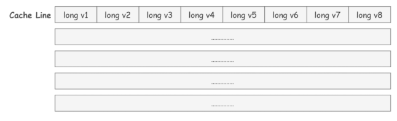

**注意点**

* 线程的创建和启动比主线程的下一条代码的执行要慢，所以要延时才行。

# 一、进程和线程

## 1.1 基本内容

> 1、进程和线程

1、**主要区别：**进程是操作系统进行资源分配(CPU、内存等等)的基本单位。线程是操作系统调度的基本单位。(好比包工头有地(资源)，工人干活(调度))

2、**共享和同步**：进程单独占有一定的内存空间，所以进程之间存在内存隔离，数据是分开的，数据共享复杂，但是同步简单；线程共享进程所占的内存地址和资源，所以共享简单，但同步复杂。

3、**异常：**一个进程出问题了，并不会影响其他进程的执行；但如果一个线程出问题了，可能导致整个进程的崩溃。

4、**开销：**进程在创建和销毁时，由于存在资源的创建和回收，所以开销要比线程大。

5、**包含：**一个操作系统中包括了很多个进程，一个进程中可以包括很多的线程。

协程：**协程是一种用户态的轻量级线程**，协程的调度完全由用户控制，操作系统并不知道有协程的存在。协程由程序员在协程的代码里显示调度，协程拥有自己的寄存器上下文和栈，直接操作栈则基本没有内核切换的开销，可以不加锁的访问全局变量，所以上下文的切换非常快

> 线程的有哪些状态

```java
// java.lang.Thread内部类
public enum Thread.State{
    NEW, // 创建
    RUNNABLE, // 就绪和运行
    BLOCKED, // 阻塞，比如等待锁的释放以进入同步去
    WAITING, // 等待状态，调用了wait()、join()，需要其他线程来唤醒
    TIMED_WAITING, // 等待超时，时间到了自动唤醒。sleep、wait(time)、join(time)一调用就是这个状态
    TERMINATED; // 终止
}
```

另外：**interrupt**()并不是真正的中断了线程，而是仅仅把中断标志位设置成了true。仅此而已，线程的状态也没有发生变化。

> sleep和wait区别：

1.**所属类不一样** 2.**关于释放锁** wait释放 sleep不释放 3.使用范围不同 wait必须在同步代码块中 sleep可以在任何地方 4.**是否需要捕获异常** wait不需要 sleep需要

> 为什么wait方法在Object类中

所谓的释放锁资源实际是通知对象内置的monitor对象进行释放，而只有所有对象都有内置的monitor对象才能实现任何对象的锁资源都可以释放。又因为所有类都继承自Object，所以wait(）就成了Object方法，也就是通过wait()来通知对象内置的monitor对象释放，而且事实上因为这涉及对硬件底层的操作，所以wait()方法是native方法，底层是用C写的

> java.util.concurrent java.util.concurrent.automic java.util.concurrent.locks

这些是JUC的三个包

> 锁分类

1、乐观锁：假设每次读数据都不会受到其他线程干扰，所以不会上锁，但是在更新的时候会判断一下在此期间别人是否去更新这个数据，可以使用版本号机制和CAS算法实现。**适用于读多写少的情况**。java.util.concurrent.atomic的原子类的**CAS**和数据库的版本号机制就是乐观锁的实现。

2、悲观锁：假设最坏的情况，每次读取数据时都默认其他线程会更改数据，因此需要进行加锁操作，当其他线程想要访问数据时，都需要阻塞挂起。(**共享资源每次只能给一个线程使用，其他线程阻塞，用完之后再把资源转给其他线程**)**适用于写多读少**[**syncronized**/**ReentranLock**]

3、公平锁：非常公平，不能插队，必须先来后到

4、非公平锁：非常不公平，可以插队(默认非公平)，谁抢到就是谁的

5、独占锁：也叫排他锁，是指该锁一次只能被一个线程所持有。JDK中的**syncronized**和**lock**

6、共享锁：该锁可被多个线程同时持有。加了共享锁后，其他线程也只能加共享锁，且只能读数据，不能写数据。**ReentrantReadWriteLock**

7、可重入锁：也可以叫递归锁，拿到了外面的锁，也可以拿到里面的锁或再次获取同一样的锁而不会产生死锁，加锁和解锁次数要一样。**syncronized**和**ReentrantLock**

8、自旋锁：当一个线程获取锁时，如果锁已经被其他线程获取了，那么该线程就会循环等待下去。比如CAS的while循环。

9、死锁：两个线程获取了各自资源之后，还想再获取对方的资源，就会产生死锁。

**分段锁**： 是一种锁的设计，并不是具体的一种锁。分段锁设计目的是将锁的粒度进一步细化，当操作不需要更新整个数组的时候，就仅仅针对数组中的一项进行加锁操作。在 Java 语言中 CurrentHashMap 底层就用了分段锁，使用Segment，就可以进行并发使用了。

> 锁升级

为了提升性能减少获得锁和释放锁所带来的消耗，引入了4种锁的状态：`无锁`、`偏向锁`、`轻量级锁`和`重量级锁`，它会随着多线程的竞争情况逐渐升级，但不能降级。

* **无锁**：就是乐观锁

* **偏向锁**：Java偏向锁(Biased Locking)是指它会偏向于第一个访问锁的线程，如果在运行过程中，只有一个线程访问加锁的资源，不存在多线程竞争的情况，那么线程是不需要重复获取锁的，这种情况下，就会给线程加一个偏向锁。

* **轻量级锁**：当线程竞争变得比较激烈时，偏向锁就会升级为`轻量级锁`，轻量级锁认为虽然竞争是存在的，但是理想情况下竞争的程度很低，通过`自旋方式`等待上一个线程释放锁。

* **重量级锁**：如果线程并发进一步加剧，轻量级锁就会膨胀为`重量级锁`，重量级锁会使除了此时拥有锁的线程以外的线程都阻塞。


synchronized 关键字内部实现原理就是锁升级的过程：无锁 --> 偏向锁 --> 轻量级锁 --> 重量级锁，是对的syncronized的优化。

## 1.2 ThreadLocal

**用于保存当前线程私有的线程变量。**

Thread中有一个表示线程的本地变量threadLocals，类型为**ThreadLocal.ThreadLocalMap**

```java
public class Thread implements Runnable{
    /* ThreadLocal values pertaining to this thread. This map is maintained
     * by the ThreadLocal class. */
    // ThreadLocal值附属于这个线程，map由ThreadLocal类维护
    ThreadLocal.ThreadLocalMap threadLocals = null;	//实例变量，即每个线程都有的实例变量
}
```

`ThreadLocalMap`是`ThreadLocal`的内部类,它是HashMap结构，也是存储 `K-V`结构数据，并用 `Entry`封装 `K-V`。

ThreadLocalMap的初始化和取值赋值操作都是其外部类`ThreadLocal`中。

```java
public void set(T value) {
    // 获取当前线程
    Thread t = Thread.currentThread();
    // 获取当前线程的ThreadLocalMap
    ThreadLocalMap map = getMap(t);
    if (map != null)
        //存入当前ThreadLocal当做key
        map.set(this, value);
    else
        // 如果不存在，则创建
        createMap(t, value);
}
void createMap(Thread t, T firstValue) {
    // 指定当前线程的threadLocals的key和value
    t.threadLocals = new ThreadLocalMap(this, firstValue);
}
ThreadLocalMap getMap(Thread t) {
    return t.threadLocals;
}
```

* 所以一个线程中可以声明多个ThreadLocal，通过set、get方法可以初始化ThreadLocalMap进行存值取值。

```bash
- 使用方法
	如果要使用这个类，就必须创建new ThreadLocal<>(),此时就存在了实例，通过set方法即可以设置值了。
- set方法
	首先线程会声明多个ThreadLocal(new ThreadLocal<>())，每个ThreadLocal实例是不同的，当通过set方法进行设置值时，首先会获得当前线程t，然后获取线程t的ThreadLocalMap，如果有Map，则根据key的threadlocalhashcode & n-1值来寻找位置，如果不存在则直接写入，如果存在元素，说明存在hash冲突，它没有链表的结构，所以采用线性探测法解决hash冲突，即向后继续寻找直到找到空的位为止;如果没有则创建以此ThreadLocal实例为key，值为value的ThreadLocalMap赋值给当前线程的threadLocals。
	1.通过hash计算的槽位对应的Entry数据为空，直接将数据放入槽位
	2.槽位不为空，如果槽位的元素的地址与作为key的ThreadLocal地址一样，则直接更新该槽位的数据
	3.如果槽位不为空，且地址不一样，往后遍历寻找直到找到Entry为null的槽位，然后写入；如果中途遇见地址相同的会覆盖
	4.如果槽位不为空，往后遍历过程中，找到Entry的key为null(key过期的Entry)，表示此数据的key已经被垃圾回收掉了，就会以该位置向后清理掉过期元素，然后存入数据。
- get方法
	首先获取当前线程，获取当前线程的ThreadLocalMap，然后开始查找
```

内存泄漏问题：`ThreadLocalMap` 中使用的 key 为 `ThreadLocal` 的弱引用,而 value 是强引用，在垃圾回收的时候，key 会被清理掉，而 value 不会被清理掉。这样一来，`ThreadLocalMap` 中就会出现 key 为 null 的 Entry，如果不处理就会造成内存泄漏。ThreadLocalMap 实现中已经考虑了这种情况，在调用 `set()`、`get()`、`remove()` 方法的时候，会清理掉 key 为 null 的记录。

与HashMap不同的是 `ThreadLocalMap`的 `Entry`的 `Key`只能是 `ThreadLocal`类型对象，并且是一个弱引用。

```java
static class Entry extends WeakReference<ThreadLocal<?>> {
    /** The value associated with this ThreadLocal. */
    //这个值和当前的ThreadLocal实例有关
    Object value;

    Entry(ThreadLocal<?> k, Object v) {
        super(k);
        value = v;
    }
}
```

# 二、线程同步

并发编程的三个特征：原子性、可见性、有序性

> 线程同步：多个线程有顺序的访问一个可见性的资源

**1、实现原子性，即同时只有一个线程可以更改值或只有一个线程能成功**

* 有锁机制
  * syncronized(关键字)
    * 是悲观锁、可重入锁、独占锁、非公平锁。可以实现自动上锁和解锁。
  * lock(JUC的类)
    * 是悲观锁、可重入锁、独占锁、非公平锁(默认，可以公平)。手动上锁和解锁。
* 无锁机制
  * atomic
    * 乐观锁的实现、自旋锁。CAS机制。无锁机制。

**2、实现可见性**

* volatile
  * 保证可见性、不保证原子性、禁止指令重排

**3、实现顺序性**

* syncronized版本的wait() notifyAll()
* lock版本的await() signal()

## 2.1 原子性

```bash
只有读取和赋值操作才是原子操作(a = 1以及b = a在读a的时候是原子操作)
```

一个操作或多个操作，要么全部执行，且执行期间不会被任何因素打断，要么都不执行或执行失败。

### 2.1.1 syncronized

**`synchronized` 关键字解决的是多个线程之间访问资源的同步性，`synchronized`关键字可以保证被它修饰的方法或者代码块在任意时刻只能有一个线程执行。**

```java
/**
* 1.可以锁方法、对象实例、class
* 2.8锁线程解释
*	2.1 一个对象 两个线程 两个同步方法 谁先获取到锁，锁谁先运行。 
*	2.2 一个对象 两个线程 两个同步方法 一个同步方法sleep()2s 谁先获取到锁，锁谁先运行
*	2.3 一个对象 两个线程 一个同步方法，一个实例方法，同步方法睡一会。 结果：实例方法先执行
*	2.4 两个对象 两个线程 两个同步方法 一个同步方法睡2s，其二个线程在1s后启动。
*	2.5 一个对象 两个线程 两个静态同步方法 线程间睡1s，其中一个静态同步方法睡2s
*	2.6 两个对象 两个线程 两个静态同步方法 线程间睡1s，其中一个静态同步方法睡2s
*	2.7 一个对象 两个线程 一个静态同步方法 一个同步方法 
*	2.8 两个对象 两个线程 一个静态同步方法 一个同步方法 
*/	
/**
* 1. 谁先获得锁，谁执行。运行在前面的线程首先获得锁。
* 2. 由于都是普通同步方法，所以谁先获得锁，谁执行
* 3. 实例方法直接执行，同步方法等会执行
* 4. 两个锁的是两个对象实例，所以互不影响
* 5. 静态同步是锁的类，所以是相互影响的，第一个执行完才执行第二个
* 6. 即便两个实例，静态同步方法锁的也是类，所以相互影响，第一个执行完才执行第二个
* 7. 锁类和锁实例是两把锁，所以互不影响
* 8. 两个实例，和7一样

* 1.synchronized 关键字加到 static 静态方法和 synchronized(class) 代码块上都是是给 Class 类上锁。
* 2.synchronized 关键字加到实例方法和 synchronized(实例)上是给对象实例上锁。
* 3.尽量不要使用 synchronized(String a) 因为 JVM 中，字符串常量池具有缓存功能

* 1.syncronized(this) 锁的是本实例。各锁各的。
* 2.syncronized(Object) 锁的是某个变量或对象
* 3.syncronized static method / syncronized(object.class) 锁的是类
* 4.syncronized方法和普通方法互不影响
*/

syncronized底层原理
    1.修饰同步语句块：syncronized使用的是 monitorenter 和 monitorexit 指令，其中 monitorenter 指令指向同步代码块的开始位置，monitorexit 指令则指明同步代码块的结束位置，当执行 monitorenter 指令时，线程试图获取锁也就是获取 对象监视器 monitor 的持有权，如果锁的计数器为 0 则表示锁可以被获取，获取后将锁计数器设为 1 也就是加 1。对象锁的的拥有者线程可以执行 monitorexit 指令来释放锁。锁计数器设为0.
    2.修饰同步方法，取而代之采用的是 ACC_SYNCHRONIZED 标识，该标识指明了该方法是一个同步方法，如果是实例方法，JVM会尝试获取实例对象的锁，如果是静态方法，JVM 会尝试获取当前 class 的锁。
```

### 2.1.2 lock

```bash
1.基本方法
 - lock()	获取锁
 - tryLock()	只有在调用时才可以获得锁
 - tryLock(long time,TimeUnit time)	等待都长时间去获取锁
 - unlock()	释放锁返回一个新的Condition实例
 - newCondition()	
2.基本用法
    1.lock = new ReentrantLock(); 
    2.lock.lock() 
      try{业务代码}
      catch(){}
      finally{lock.unlock()}
3.实现类
	- ReentrantLock 可重入锁 默认为非公平锁
	- ReentrantReadWriteLock 可以获取读锁和写锁。读写锁：读读共享、写写互斥、读写互斥、写读互斥
4.和syncronized区别
	- syncronized是关键字，lock是一个java类
	- syncronized无法判断锁的状态，lock可以判断是否获取到了锁没有 tryLock()
	- syncronized会自动释放锁，lock必须手动释放锁！ unlock()
	- syncronized线程1获取锁，线程2(等待，阻塞状态)。lock锁不一样要等待下去 trylock(t)
	- syncronized非公平锁，可重入锁；lock可重入锁，非公平锁(可以自己设置) ReentrantLock()
	- syncronized适用于少量的代码同步问题，Lock适用于大量的代码同步问题
5.独特的特点(生产者消费者模式)  
	通过lock.newCondition()获取多个监视器condition1/condition2，可以通过精准通知和唤醒线程。
	
6.syncronized和ReentrantLock区别
	相同点：都是可重入锁，自己可以再次获取自己的内部锁。比如一个线程获得了某个对象的锁，此时这个对象锁还没有释放，当其再次想要获取这个对象的锁的时候还是可以获取的。
	区别：
	1.synchronized 是依赖于 JVM 实现的，对synchronized的优化都是在虚拟机层面的，ReentrantLock是 JDK 层面实现的，需要 lock() 和 unlock() 方法配合 try/finally 语句块来完成。
	2.ReentrantLock可实现公平锁，而synchronized只能是非公平锁，所谓的公平锁就是先等待的线程先获得锁，ReentrantLock(boolean fair)可以设定是否公平。
	3.ReentrantLock可实现选择性通知，synchronized与wait/notify结合可以实现等待/通知机制，ReentrantLock可以利用Condition监视器来进行选择行唤醒。
	
```

## 2.2 可见性

可见性指的是当一个线程修改了共享变量后，其他线程能够立即得知这个修改。**缓存** 导致的可见性问题

### 2.2.1 JMM
```bash
- 内存模型相关概念
	由于指令都是在CPU中执行的，而临时数据都是存放在主存(物理内存)中，但是CPU执行速度很快，而从内存读取数据和向内存中写入数据过程跟CPU执行指令的速度比起来要慢很多，如果任何时候对数据的操作都要通过对内存交互的话，会降低执行的速度，所以在CPU中就有了高速缓存。CPU 缓存则是为了解决 CPU 处理速度和内存处理速度不对等的问题
	程序运行过程中，会将运算需要的数据从主存复制一份到CPU高速缓存当中，当CPU运算结束后向其中写入数据，当运算结束会将高速缓存中的数据刷新到主存中。
- 缓存一致性问题
	可能存在下面一种情况：初始时，两个线程分别读取i的值存入各自所在的 CPU 的高速缓存当中，然后线程 1 进行加 1 操作，然后把i的最新值 1 写入到内存。此时线程 2 的高速缓存当中 i 的值还是 0，进行加 1 操作之后，i 的值为1，然后线程 2 把 i 的值写入内存。
	最终结果 i 的值是 1，而不是 2。这就是著名的缓存一致性问题。通常称这种被多个线程访问的变量为共享变量。
	如果一个变量在多个CPU中都存在缓存（一般在多线程编程时才会出现），那么就可能存在缓存不一致的问题。
- 解决缓存一致性问题，通常有两种方式
	1. 通过在总线加 LOCK# 锁的方式
	2.通过缓存一致性协议
1.CPU和其他部件进行通信都是通过总线来进行的，如果总线上加LOCK# 锁,也就是说阻塞了其他 CPU 对其他部件访问（如内存）,从而只有一个CPU能够使用这个变量的内存，但是由于在锁住总线期间，其他 CPU 无法访问内存，导致效率低下。
2.缓存一致性协议：当 CPU 写数据时，如果发现操作的变量是共享变量，即在其他 CPU 中也存在该变量的副本，会发出信号通知其他 CPU 将该变量的缓存行置为无效状态，因此当其他 CPU 需要读取这个变量时，发现自己缓存中缓存该变量的缓存行是无效的，那么它就会从内存重新读取。
```

>  JMM  Java内存模型【子线程和主线程之间】

Java 内存模型抽象了线程和主内存之间的关系。Java 内存模型主要目的是为了屏蔽系统和硬件的差异，避免一套代码在不同的平台下产生的效果不一致

Java 内存模型规定所有的变量都是存在主存当中（类似于前面说的物理内存），每个线程都有自己的工作内存（类似于前面的高速缓存）。线程对变量的所有操作都必须在工作内存中进行，而不能直接对主存进行操作。并且每个线程不能访问其他线程的工作内存

线程解锁前，必须把共享变量立刻刷回主存；线程加锁前，必须读取主存中的最新值到工作内存中；加锁和解锁是同一把锁。每个线程都有一个本地内存，线程的本地内存之间是隔离的，所有共享变量存在与主内存中，本地内存中存有主内存共享变量的副本。**线程对共享变量的所有操作都必须在自己的本地内存中进行，不能直接从主内存中读取**。**线程A无法直接访问线程B的工作内存，线程间通信必须经过主内存**

**关于JMM的一些同步的约定：**

- 所有的变量都存储在主内存（Main Memory）中。
- 每个线程都有一个私有的本地内存（Local Memory），本地内存中存储了该线程以读/写共享变量的拷贝副本。
- 线程对变量的所有操作都必须在本地内存中进行，而不能直接读写主内存。
- 不同的线程之间无法直接访问对方本地内存中的变量。


为了更好的控制主内存和本地内存的交互，Java 内存模型定义了八种操作来实现：

- lock：锁定。作用于主内存的变量，把一个变量标识为一条线程独占状态。
- unlock：解锁。作用于主内存变量，把一个处于锁定状态的变量释放出来，释放后的变量才可以被其他线程锁定。
- read：读取。作用于主内存变量，把一个变量值从主内存传输到线程的工作内存中，以便随后的load动作使用
- load：载入。作用于工作内存的变量，它把read操作从主内存中得到的变量值放入工作内存的变量副本中。
- use：使用。作用于工作内存的变量，把工作内存中的一个变量值传递给执行引擎，每当虚拟机遇到一个需要使用变量的值的字节码指令时将会执行这个操作。
- assign：赋值。作用于工作内存的变量，它把一个从执行引擎接收到的值赋值给工作内存的变量，每当虚拟机遇到一个给变量赋值的字节码指令时执行这个操作。
- store：存储。作用于工作内存的变量，把工作内存中的一个变量的值传送到主内存中，以便随后的write的操作。
- write：写入。作用于主内存的变量，它把store操作从工作内存中一个变量的值传送到主内存的变量中。

八种操作可以用主存、高速缓存、寄存器(CPU)层面思考。

参考网址：https://mp.weixin.qq.com/s/lEgHPertXyguZIkv61LlKQ

> **主内存** ：所有线程创建的实例对象都存放在主内存中，不管该实例对象是成员变量还是方法中的本地变量(也称局部变量)
>
> **本地内存** ：每个线程都有一个私有的本地内存来存储共享变量的副本，并且，每个线程只能访问自己的本地内存，无法访问其他线程的本地内存。本地内存是 JMM 抽象出来的一个概念，存储了主内存中的共享变量副本。

### 2.2.2 volatile

```bash
# 可见性 修饰基本变量保证可变性，修饰数组或对象只能保证数组或对象的引用可见性
# 不保证原子性
# 禁止指令重排序

# 如果不加lock和syncronized如何保证原子性。使用原子类，解决原子性问题
AtomicBoolean AtomicInteger AtomicReference等

# 问题：voliate 关键字为什么可以解决可见性和指令重排？
	1.首先，volatile 关键字修饰的共享变量可以提供这种可见性规范，也叫做读写可见。
	2.被 volatile 关键字修饰的共享变量在转换成汇编语言时，会加上一个以 lock 为前缀的指令，当CPU发现这个指令时，立即将当前内核高速缓存行的数据回写到内存，同时使在其他内核里缓存了该内存地址的数据无效。
	3.另外，在早期的 CPU 中，是通过在总线加 LOCK# 锁的方式实现的，但这种方式开销较大。所以Intel开发了缓存一致性协议，也就是 MESI 协议，该解决缓存一致性。
	4.volatile 的好处，volatile 是一种非锁机制，这种机制可以避免锁机制引起的线程上下文切换和调度问题。所以，volatile 的执行成本比 synchronized 更低。
	5.volatile 的不足，volatile 关键字只能保证可见性，不能保证原子性操作。
	6.另外，jdk中也提供了防止指令重排的方法。比如Unsafe中的loadFence()禁止读操作指令重排，storeFence禁止写操作指令重排，fullFence禁止读写操作指令重排
	


```

> 指令重排序

什么是 指令重排：**你写的程序，计算机并不是按照你写的那样去执行的**。一般来说，处理器为了提高程序运行效率，可能会对输入代码进行优化，它不保证程序中各个语句的执行先后顺序同代码中的顺序一致，但是它会保证程序最终执行结果和代码顺序执行的结果是一致的。因为处理器在进行重排序时是会考虑指令之间的数据依赖性，所以不会导致结果的错误性。

源代码-->编译器优化的重排--> 指令并行也可能会重排--> 内存系统也会重排---> 执行

==**处理器在进行指令重排的时候，考虑：数据之间的依赖性！**==

**volatile可以避免指令重排：**内存屏障。CPU指令。**观察加入 volatile 关键字和没有加入 volatile 关键字时所生成的汇编代码发现，加入 volatile 关键字时，会多出一个 lock 前缀指令**

```bash
lock 前缀指令实际上相当于一个内存屏障（也称内存栅栏），内存屏障会提供 3 个功能：
1.它确保指令重排序时不会把其后面的指令排到内存屏障之前的位置，也不会把前面的指令排到内存屏障的后面；即在执行到内存屏障这句指令时，在它前面的操作已经全部完成；
2.它会强制将对缓存的修改操作立即写入主存；
3.如果是写操作，它会导致其他 CPU 中对应的缓存行无效。

代码层意思：volatile Object instance; # 即在instance前后加入内存屏障，内存屏障之间的指令不会发生指令重排。DCL单例模式下，保证了instance = new Object()，一定在return instance之前执行完。 new Object()分为3个指令：在堆中分配空间、初始化、将引用指向分配的空间上
```

作用：

1、保证特定的操作的执行顺序！
2、可以保证某些变量的内存可见性 （利用这些特性volatile实现了可见性）

**Volatile 是可以保持 可见性。不能保证原子性，由于内存屏障，可以保证避免指令重排的现象产生！**


> 应用场景

```java
// 单例模式
// 注意：构造私有。
// 1.饿汉式 开始就加载 可能会浪费空间 线程安全
// 2.普通懒汉式 线程不安全
// 3.DCL懒汉式(double checked locking双端检验锁) 线程安全 为了防止多线程问题下返回未初始化好的对象，所以需要volatile防止指令重排。主要是new分三步：分配内存、初始化对象、指向分配的地址	 但是反射的存在导致DCL懒汉式还是不安全。另外需要注意的是方法上没有syncronized，而是方法内有syncronized
// 4.静态内部类 类似于懒加载的模式 线程安全 可以达到和DCL懒汉式同样的效果
// 5.枚举类 线程安全 可以防止反射攻击
public enum EnumSingle {
	INSTANCE;
	public EnumSingle getInstance(){
		return INSTANCE;
	}
}

// 状态标记量
volatile boolean inited = false;
//线程1:
context = loadContext();  
inited = true;            
 
//线程2:
while(!inited ){
sleep()
}
doSomethingwithconfig(context);
```

> 伪共享问题

```bash
越靠近 CPU 的缓存，速度越快，容量也越小。所以 L1 缓存容量最小但是速度最快；L3 缓存容量最大同时速度也最慢
	* L1 和 L2 都是只能被一个单独的 CPU 核心使用
	* L3 可以被单个插槽上的所有 CPU 核心共享
- 1.问题：三级缓存空间中的数据是如何组织起来的呢？
	伪共享问题其实是由于高速缓存的特性引起的，三级高速缓存中的数据并不是一个变量一个变量单独存放的，它的基本存储单元是 Cache Line，一般一个 Cache Line 的大小是 64 字节，也就是说，一个 Cache Line 中可以存下 8 个 8 字节的 long 类型变量。所以，缓存从内存中一次读取的数据就是 64 字节，即 cpu 要读取一个 long 类型的数组，读取其中一个元素的同时也会把接下来的其他相邻地址的七个元素也加载到 Cache Line 中来。
	举个例子，由于一个缓存行可以放8个long变量，定义了两个 long 类型的变量 a 和 b，他们在内存中的地址是紧挨着的，如果一个 CPU 核心的线程 T1 在对 a 进行修改，另一个 CPU 核心的线程 T2 却在对 b 进行读取，那么T1修改a的时候，除了把a加载到cache line中，还会把b也加载到cache line中，那么修改完a后，根据缓存一致性协议，那么其他包含a的缓存行就都会无效，这样当T2读取b的时候，他就会发现，b所处的缓存航是无效的，就需要花费很多时间去内存中重新加载。虽然b和a没有任何关系，却要因为a的更新导致它需要从内存中重新读取，拖慢速度。
	解决办法：
	1.padding：就是增大数组元素之间的间隔，使得不同线程存取的元素位于不同的缓存行上，以空间换时间。比如在 a 和 b 之间再定义 7 个 long 类型的变量，使得 a 和 b 不在一个 Cache Line 上，这样当修改 a 的时候 b 所处的 Cache Line 就不会受到影响了
	2.JDK 1.8 提供了 @Contended 注解，就是把我们手动 padding 的操作封装到这个注解里面了，把这个注解加在字段 a 或者 b 的上面就可以了。需要注意的是，默认使用这个注解是无效的，需要在 JVM 启动参数加上 XX:-RestrictContended 才会生效
	
- 2.什么样的变量生效
	被volatile修饰的变量会收到伪共享问题影响
```




## 2.3 有序性

有序性指的是程序按照代码的先后顺序执行，**编译优化**会带来的有序性问题

> 线程同步 -> 生产者消费者问题 【线程和线程之间】

如果容器里是空的，则生产者生产一个东西，消费者等待；如果容器里不为空，则消费者在消费，生产者等待。等待用wait()，**优化**通知时，notifyAll则会通知所有的等待线程，此时只需要通知特定Condition即可。

* syncronized版本的wait() notifyAll()
* lock版本的await()和signalAll()

**注意点**

* 防止**虚假唤醒**。用if条件作为wait()的条件容易造成虚假唤醒，所以需要用while作为wait()的条件判断。

### 2.3.1生产者消费者模式

```java
// 生产者消费者模式
public class ProducerConsumer {

    public static void main(String[] args) {
        Data2 data2 = new Data2();
        new Thread(()->{
            for (int i = 0; i < 10; i++) {
                data2.increment();
            }
        },"A").start();
        new Thread(()->{
            for (int i = 0; i < 10; i++) {
                data2.increment();
            }
        },"B").start();
        new Thread(()->{
            for (int i = 0; i < 10; i++) {
                data2.decrement();
            }
        },"C").start();
        new Thread(()->{
            for (int i = 0; i < 10; i++) {
                data2.decrement();
            }
        },"D").start();
    }
}
// syncronized版本的生产者消费者模式
class Data1{
    private int number = 0;
    public synchronized void increment() throws InterruptedException {
        while (number != 0){    //如果使用if判断则会虚假唤醒，必须使用while
            this.wait();
        }
        number++;
        System.out.println(Thread.currentThread().getName() + "=>" + number);
        this.notifyAll();
    }

    public synchronized void decrement() throws InterruptedException {
        while(number == 0){
            this.wait();
        }
        number--;
        System.out.println(Thread.currentThread().getName() + "=>" + number);
        this.notifyAll();
    }
}
// JUC版本的生产者消费者模式
class Data2{
    private int number = 0;
    Lock lock = new ReentrantLock();
    Condition condition = lock.newCondition();
    public void increment(){
        lock.lock();
        try {
            while (number != 0){    //if判断则会虚假唤醒
                condition.await();
            }
            number++;
            System.out.println(Thread.currentThread().getName() + "=>" + number);
            condition.signalAll();
        } catch (InterruptedException e) {
            e.printStackTrace();
        } finally {
            lock.unlock();
        }
    }
    public void decrement(){
        lock.lock();
        try {
            while (number == 0){    //if判断则会虚假唤醒
                condition.await();
            }
            number--;
            System.out.println(Thread.currentThread().getName() + "=>" + number);
            condition.signalAll();
        } catch (InterruptedException e) {
            e.printStackTrace();
        } finally {
            lock.unlock();
        }
    }
}
```

# 三、JDK多线程框架

## 3.1集合不安全类

> List不安全

```java
// 多个线程调用list的时候，写入会存在覆盖问题
// 在写入的时候避免覆盖，造成数据问题！
// Vector的方法是syncronized
// CopyOnWriteArrayList则是上锁，然后复制一份再替换即可，在解锁。与ReentrantReadWriteLock 读写锁的思想非常类似，也就是读读共享、写写互斥、读写互斥、写读互斥；但是CopyOnWriteArrayList则是读读共享，读写共享，写写互斥
// Collections.synchronizedList(new ArrayList<>())
public boolean add(E e) {
        final ReentrantLock lock = this.lock; // lock锁
        lock.lock();
        try {
            Object[] elements = getArray();
            int len = elements.length;
            Object[] newElements = Arrays.copyOf(elements, len + 1);
            newElements[len] = e;
            setArray(newElements);
            return true;
        } finally {
            lock.unlock(); //解锁
        }
    }
```

 >Set不安全

```java
1. Set<String> set = Collections.synchronizedSet(new HashSet<>());
2. Set<String> set = new CopyOnWriteArraySet<>();
```

> Map不安全

```java
1. Map<String,String> map = Collections.synchronizedMap(new HashMap<>());
2. Map<String, String> map = new ConcurrentHashMap<>();
```

**有哪些线程安全的集合** concurrent包下有很多并发容器可供使用。

* ConcurrentHashMap：可以看作是线程安全的 HashMap.在进行读操作时(几乎)不需要加锁，而在写操作时通过锁分段技术只对所操作的段加锁而不影响客户端对其它段的访问。

  在jdk1.8的时候摒弃了 Segment的概念，而是直接用 Node 数组+链表+红黑树的数据结构来实现，并发控制使用 **synchronized** 和 **CAS** 来操作。synchronized只锁定当前链表或红黑二叉树的首节点。

* CopyOnWriteArrayList:可以看作是线程安全的 ArrayList ，在读多写少的场合性能⾮常好，远远好于 Vector .

* CopyOnWriteArraySet：底层使用的是CopyOnWriteArrayList，通过indexOf(元素)位置是否>=0判断是否存在

* ConcurrentLinkedQueue :⾼效的并发队列，使⽤链表实现。可以看做⼀个线程安全的LinkedList ，这是⼀个⾮阻塞队列。**非阻塞队列可以通过 CAS 操作实现**

* BlockingQueue : 这是⼀个接⼝，JDK 内部通过链表、数组等⽅式实现了这个接⼝。表示阻塞
  队列，⾮常适合⽤于作为数据共享的通道。
  
* ConcurrentSkipListMap :跳表的实现。这是⼀个 Map ，使⽤跳表的数据结构进⾏快速查
  找。(ConcurrentSkipListSet)

**ConcurrentHashMap**

```bash
- 散列函数
	(h ^ (h >>> 16)) & HASH_BITS; // 前面和HashMap一样，都是将原本的hash值和右移16位后的值进行^异或操作，在和一个最高位bit是0的int值&操作得到最终的散列值，与数组长度&操作得到位置。
	HASH_BITS = 0x7fffffff;

- 插入数据流程
	1. 首先获得散列值，(h ^ (h >>> 16)) & HASH_BITS
	2. 判断数组是否初始化，如果没有则进行初始化操作
	3.将散列函数得到的值与数组长度进行&操作得到位置，判断当前位置是否为null，如果是null，则使用CAS方式进行更新数据
	4.如果不是null，则锁住数组对应位置节点，然后如果是链表则以此查找，通过hashcode和equals查找；如果是红黑树则查找红黑树。插入后如果节点大于8则进行树化操作。
```

## 3.2 线程池

```bash
ThreadPoolExecutor、`ThreadPoolTaskExecutor`
```

### 3.2.1 阻塞队列

BlockingQueue\<E\> (接口) 、ArrayBlockingQueue (实现类)、LinkedBlockQueue(实现类)


| 方式         | 抛出异常 | 有返回值，不抛出异常 | 阻塞 等待 | 超时等待  |
| ------------ | -------- | -------------------- | --------- | --------- |
| 添加         | add      | offer()              | put()     | offer(,,) |
| 移除         | remove   | poll()               | take()    | poll(,)   |
| 检测队首元素 | element  | peek                 | -         | -         |

### 3.2.2 同步队列

SynchronousQueue。容量为1，所以放入一个元素后，必须等待取出才行。

方法: put()、take()

```java
public static void main(String[] args){
    BlockingQueue<String> blockingQueue = new SynchronousQueue<>(); // 同步队列

        new Thread(()->{
            try {
                System.out.println(Thread.currentThread().getName()+" put 1");
                blockingQueue.put("1");
                System.out.println(Thread.currentThread().getName()+" put 2");
                blockingQueue.put("2");
                System.out.println(Thread.currentThread().getName()+" put 3");
                blockingQueue.put("3");
            } catch (InterruptedException e) {
                e.printStackTrace();
            }
        },"T1").start();
        new Thread(()->{
            try {
                TimeUnit.SECONDS.sleep(3);
                System.out.println(Thread.currentThread().getName()+"=>"+blockingQueue.take());
                TimeUnit.SECONDS.sleep(3);
                System.out.println(Thread.currentThread().getName()+"=>"+blockingQueue.take());
                TimeUnit.SECONDS.sleep(3);
                System.out.println(Thread.currentThread().getName()+"=>"+blockingQueue.take());
            } catch (InterruptedException e) {
                e.printStackTrace();
            }
        },"T2").start();
}
// 现象：放入一个、取出一个
```

### 3.2.3 Executor

1)任务(Runnable/Callable)

执行任务需要实现的 **Runnable 接口** 或 **Callable接口**

2)任务执行

ThreadPoolExecutor。

3）异步计算的结果

**`Future`** 接口以及 `Future` 接口的实现类 **`FutureTask`** 类都可以代表异步计算的结果(调用submit方法会返回一个FutureTask对象)


**方法一：通过`ThreadPoolExecutor`构造函数实现（推荐）**

**方法二：通过 `Executor` 框架的工具类 `Executors` 来实现：FixedThreadPool、SingleThreadExecutor、CachedThreadPool**

```
- 为什么使用线程池
	为每个请求创建一个新线程的开销很大；为每个请求创建新线程的服务器在创建和销毁线程上花费的时间和消耗的系统资源要比花在处理实际的用户请求的时间和资源更多。容易引起资源不足，造成浪费。为解决单个任务处理时间很短而请求的数目巨大的问题，引出线程池

- 线程池的好处
	1.降低资源的消耗：通过重复利用已创建的线程降低线程创建和销毁造成的消耗
	2.提高响应的速度：当任务到达时，任务可以不需要等到线程创建就能立即执行
	3.方便管理：线程是稀缺资源，如果无限制的创建，不仅会消耗系统资源，还会降低系统的稳定性，使用线程池可以进行统一的分配，调优和监控

- 使用线程池的风险
	死锁、资源不足和线程泄漏。
	1.死锁：当一个进程获得了自己的资源后，还想要获取另外一个线程持有的资源，就会造成死锁。另外，线程池还引入了另一种死锁可能：池中线程都在执行已阻塞的等待队列中另一任务执行结果的任务，但这一任务却因为没有未被占用的线程而不能运行，造成死锁。
	2.资源不足：如果线程池太大，那么被那些线程消耗的资源可能严重地影响系统性能。会造成资源不足。
	3.线程泄漏：当从池中除去一个线程以执行一项任务，而在任务完成后该线程却没有返回池时，会发生这种情况。发生线程泄漏的一种情形出现在任务抛出一个 RuntimeException 或一个 Error 时。如果池类没有捕捉到它们，那么线程只会退出而线程池的大小将会永久减少一个。当这种情况发生的次数足够多时，线程池最终就为空，而且系统将停止，因为没有可用的线程来处理任务。

- 使用线程池的准则
	1.不要对那些同步等待其它任务结果的任务排队
	2.在为时间可能很长的操作使用合用的线程时要小心
	3.理解任务。(CPU密集型和IO密集型)
	最佳线程数目 = （线程等待时间与线程CPU时间之比 + 1）* CPU数目
```

### 3.2.4 线程池参数

池化技术：**主要是为了减少每次获取资源的消耗，提高对资源的利用率**，实现准备好一些资源，有人要用，就来我这里拿，用完之后还给我。

**线程池的好处：**

1.降低资源的消耗：通过重复利用已创建的线程降低线程创建和销毁造成的消耗。

2.提高响应的速度：当任务到达时，任务可以不需要等到线程创建就能立即执行

3.方便管理：线程是稀缺资源，如果无限制的创建，不仅会消耗系统资源，还会降低系统的稳定性，使用线程池可以进行统一的分配，调优和监控。

==**线程复用、可以控制最大并发数，管理线程**==


> 三大方法

Executors.newSingleThreadExecutor();Executors.newFixedThreadPool(5);Executors.newCachedThreadPool(); 

**`FixedThreadPool` 和 `SingleThreadExecutor`** ： 允许请求的队列长度为 `Integer.MAX_VALUE`,可能堆积大量的请求，从而导致 OOM。

**`CachedThreadPool` 和 `ScheduledThreadPool`** ： 允许创建的线程数量为 `Integer.MAX_VALUE` ，可能会创建大量线程，从而导致 OOM。

**1.FixedThreadPool** 称为可重用固定线程的线程池。

```java
public static ExecutorService newFixedThreadPool(int nThreads) {
    return new ThreadPoolExecutor(nThreads, nThreads,  // 因为队列为无线长，所以不需要创建其他线程
                              0L, TimeUnit.MILLISECONDS, 
                              new LinkedBlockingQueue<Runnable>()); // 允许请求的队列长度为Integer.MAX_VALUE，可能会堆积大量请求，造成OOM
}

/*
为什么不推荐使用FixedThreadPool？
	1.当线程池中的线程数达到 corePoolSize 后，新任务将在无界队列中等待，因此线程池中的线程数不会超过 corePoolSize
	2.由于使用无界队列时 maximumPoolSize和keepAliveTime 将是一个无效参数
	3.不会拒绝任务，堆积大量请求，造成OOM
*/
```

**2.SingleThreadExecutor 是只有一个线程的线程池**

```java
public static ExecutorService newSingleThreadExecutor() {
   return new FinalizableDelegatedExecutorService
        (new ThreadPoolExecutor(1, 1,
                            0L, TimeUnit.MILLISECONDS,
                            new LinkedBlockingQueue<Runnable>()));
}

/*
为什么不推荐？
	1.因为使用了无界队列，可能会导致OOM
*/
```

**3.CachedThreadPool 是一个会根据需要创建新线程的线程池 ** 

```java
public static ExecutorService newCachedThreadPool() {
        return new ThreadPoolExecutor(0, Integer.MAX_VALUE,
                                      60L, TimeUnit.SECONDS,
                                      new SynchronousQueue<Runnable>());
    }

/*
为什么不推荐？
	1.这也就意味着如果主线程提交任务的速度高于 maximumPool 中线程处理任务的速度时，而且CachedThreadPool允许创建的线程数量为 Integer.MAX_VALUE ，可能会创建大量线程，从而导致 OOM
*/
```


```java
public class ThreadPoolTest {
    public static void main(String[] args) {
//        ExecutorService threadPool = Executors.newSingleThreadExecutor();// 单个线程
//        ExecutorService threadPool = Executors.newFixedThreadPool(5);// 固定的线程池大小
        ExecutorService threadPool = Executors.newCachedThreadPool();// 可以伸缩的，遇强则强，遇弱则弱

        try {
            for (int i = 0; i < 100; i++) {
                threadPool.execute(()-> {
                    System.out.println(Thread.currentThread().getName() + "-ok");
                });
            }
        } catch (Exception e) {
            e.printStackTrace();
        } finally {
            threadPool.shutdown();
        }
    }
}
```

> 7大参数

核心线程池大小、最大核心线程池大小、超时了没有人调用就会释放、超时单位、阻塞队列、线程工厂、拒绝策略

```java
// 本质ThreadPoolExecutor（）
public ThreadPoolExecutor(int corePoolSize, // 核心线程池大小
						  int maximumPoolSize, // 最大核心线程池大小
						  long keepAliveTime, // 超时了没有人调用就会释放
                          TimeUnit unit, // 超时单位
                          BlockingQueue<Runnable> workQueue, // 阻塞队列。使用有界队列，控制线程创建数量
                          ThreadFactory threadFactory, // 线程工厂：创建线程的，一般不用动
                          RejectedExecutionHandler handle // 拒绝策略) 
                          {...}
/*
- 监测线程池状态
	- taskCount	线程池需要执行的任务数量，包括已经执行完的、未执行的和正在执行的
	- completedTaskCount 线程池在运行过程中已完成的任务数量
	- getPoolSize() 获得线程数
	- getActiveCount() 获得活跃的线程数
	- getCompletedTaskCount() 获得已完成的任务数量
	- getQueue().size()  获得任务队列中的数量 
	
-不同类型的业务用不同的线程池
	如果存在上下级关系的线程，极端情况下会造成死锁。
- 给线程池命名，否则为pool-1-thread-n 
ThreadFactory threadFactory = new ThreadFactoryBuilder()
                        .setNameFormat(threadNamePrefix + "-%d")
                        .setDaemon(true).build();
ExecutorService threadPool = new ThreadPoolExecutor(corePoolSize, maximumPoolSize, keepAliveTime, TimeUnit.MINUTES, workQueue, threadFactory)
*/                          
```

> 4种拒绝策略

```java
/**
* new ThreadPoolExecutor.AbortPolicy() // 银行满了，还有人进来，不处理这个人的，抛出异常
* new ThreadPoolExecutor.CallerRunsPolicy() // 哪来的去哪里！
* new ThreadPoolExecutor.DiscardPolicy() //队列满了，丢掉任务，不会抛出异常！
* new ThreadPoolExecutor.DiscardOldestPolicy() //队列满了，将最老的任务丢掉
*/
```

> IO密集型和计算密集型确定线程池线程数的大小

```java
// 定义
// CPU密集型：也叫计算密集型，指的是系统的硬盘、内存性能相对CPU要好很多，此时，系统运作大部分的状况是CPU Loading 100%，CPU要读/写I/O(硬盘/内存)，I/O在很短的时间就可以完成，而CPU还有许多运算要处理，CPU Loading很高。比如计算圆周率小数点后一千位，这时绝大多数在做逻辑运算，不太存在IO任务，这就是CPU-bound。
// IO密集型：系统的CPU性能相对硬盘、内存要好很多，此时，系统运作，大部分的状况是CPU在等I/O (硬盘/内存) 的读/写操作，此时CPU Loading并不高。

// 最大线程到底该如何定义
// 1、CPU 密集型，几核，就是几，可以保持CPu的效率最高！可以将线程数设为N+1
// 2、IO 密集型 > 判断你程序中十分耗IO的线程，比如网络读取，文件读取， 可以两倍关系。线程数设为2N
// 程序 15个大型任务 io十分占用资源！ 

// 获取CPU的核数
System.out.println(Runtime.getRuntime().availableProcessors());
```

> 对比

**1、Runnable vs Callable**

**`Runnable` 接口**不会返回结果或抛出检查异常，但是 **`Callable` 接口**可以

工具类 **Executors**可以实现将 Runnable 对象转换成 Callable 对象。（Executors.callable(Runnable task) 或 Executors.callable(Runnable task, Object result)）

**2、execute() vs submit()**

* `execute()`方法用于提交不需要返回值的任务，所以无法判断任务是否被线程池执行成功与否；
* `submit()`方法用于提交需要返回值的任务。线程池会返回一个 `Future` 类型的对象，通过这个 `Future` 对象可以判断任务是否执行成功，并且可以通过 `Future` 的 `get()`方法来获取返回值，`get()`方法会阻塞当前线程直到任务完成，而使用 `get（long timeout，TimeUnit unit）`方法的话，如果在 `timeout` 时间内任务还没有执行完，就会抛出 java.util.concurrent.TimeoutException

**3、shutdown() VS shutdownNow()**

* **`shutdown（）`** :关闭线程池，线程池的状态变为 `SHUTDOWN`。线程池不再接受新任务了，但是队列里的任务得执行完毕。
* **`shutdownNow（）`** :关闭线程池，线程的状态变为 `STOP`。线程池会终止当前正在运行的任务，并停止处理排队的任务并返回正在等待执行的 List。

**4、isTerminated() VS isShutdown()**

* **`isShutDown`** 当调用 `shutdown()` 方法后返回为 true。
* **`isTerminated`** 当调用 `shutdown()` 方法后，并且所有提交的任务完成后返回为 true

### 3.2.5 几种常见的线程池

**`FixedThreadPool` 和 `SingleThreadExecutor`** ： 允许请求的队列长度为 `Integer.MAX_VALUE`,可能堆积大量的请求，从而导致 OOM。

**`CachedThreadPool` 和 `ScheduledThreadPool`** ： 允许创建的线程数量为 `Integer.MAX_VALUE` ，可能会创建大量线程，从而导致 OOM。

**1.FixedThreadPool** 称为可重用固定线程的线程池。

```java
public static ExecutorService newFixedThreadPool(int nThreads) {
    return new ThreadPoolExecutor(nThreads, nThreads,  // 因为队列为无线长，所以不需要创建其他线程
                              0L, TimeUnit.MILLISECONDS, 
                              new LinkedBlockingQueue<Runnable>()); // 允许请求的队列长度为Integer.MAX_VALUE，可能会堆积大量请求，造成OOM
}

/*
为什么不推荐使用FixedThreadPool？
	1.当线程池中的线程数达到 corePoolSize 后，新任务将在无界队列中等待，因此线程池中的线程数不会超过 corePoolSize
	2.由于使用无界队列时 maximumPoolSize和keepAliveTime 将是一个无效参数
	3.不会拒绝任务，堆积大量请求，造成OOM
*/
```

**2.SingleThreadExecutor 是只有一个线程的线程池**

```java
public static ExecutorService newSingleThreadExecutor() {
   return new FinalizableDelegatedExecutorService
        (new ThreadPoolExecutor(1, 1,
                            0L, TimeUnit.MILLISECONDS,
                            new LinkedBlockingQueue<Runnable>()));
}

/*
为什么不推荐？
	1.因为使用了无界队列，可能会导致OOM
*/
```

**3.CachedThreadPool 是一个会根据需要创建新线程的线程池 ** 

```java
public static ExecutorService newCachedThreadPool() {
        return new ThreadPoolExecutor(0, Integer.MAX_VALUE,
                                      60L, TimeUnit.SECONDS,
                                      new SynchronousQueue<Runnable>());
    }

/*
为什么不推荐？
	1.这也就意味着如果主线程提交任务的速度高于 maximumPool 中线程处理任务的速度时，而且CachedThreadPool允许创建的线程数量为 Integer.MAX_VALUE ，可能会创建大量线程，从而导致 OOM
*/
```


## 3.3 Callable、Future

callable 函数式接口 异步回调

### 3.3.1 Callable\<V\>


1.可以有返回值 2.可以抛出异常 3.方法不同，run()/call()

**使用FutureTask来启动！**

```java
public static void main(String[] args) throws ParseException, UnsupportedEncodingException, ExecutionException, InterruptedException {
        MyThread thread = new MyThread();
        FutureTask<Integer> futureTask = new FutureTask<>(thread); // 适配类
        new Thread(futureTask,"A").start();
        new Thread(futureTask,"B").start(); // 结果会被缓存，效率高
        Integer o = (Integer) futureTask.get(); //这个get 方法可能会产生阻塞！把他放到最后
        // 或者使用异步通信来处理！
        System.out.println(o);

    }

    static class MyThread implements Callable<Integer> {
        @Override
        public Integer call() {
            System.out.println("call()"); // 会打印几个call
            // 耗时的操作
            return 1024;
        }
    }
}
```

**注意**

* 有缓存，为了加快执行速度
* 结果可能需要等待，会阻塞！

### 3.3.2 Future\<V\>

> Future 设计的初衷： 对将来的某个事件的结果进行处理

```java
Future <V>
	v	- 未来的 get方法返回的结果类型 
api:
	- boolean cancel(boolean mayInterruptIfRunning)  尝试取消执行此任务。 
    - boolean isCancelled()      如果此任务在正常完成之前被取消，则返回 true 。 
	- V get()	 等待计算完成，然后检索其结果。 
	- V get(long timeout, TimeUnit unit)	如果需要等待最多在给定的时间计算完成，然后检索其结果（如果可用）。 
	- boolean isDone()	返回true如果任务已完成。 完成可能是由于正常终止，异常或取消 - 在所有这些情况下，此方法将返回true 
	
实现类：
	FutureTask<V>: 是Futrue的一个实现类，关联了Callable和Runnable，通过new Thread(*).start()启动它。
	CompletableFuture<V>: 提供了可以有返回值(supplyAsync)和没有返回值的(runAsync)方法 提供异步回调
	ForkJoinTask<V>: 是由ForkJoin框架的实现抽象类，由ForkJoinPool内运行，其重量比普通线程轻得多。 大量任务和子任务可能由ForkJoinPool中的少量实际线程托管。
	RecursiveAction：递归事件，ForkJoinTask的子类，没有返回值
	RecursiveTask<V>：递归任务，ForkJoinTask的子类，有返回值
```

```bash
四大函数式接口:
	1.public interface Function<T, R> {R applay(T t)}   传入参数T,传出参数R
	2.public interface Predicate<T> {boolean test(T t)} 传入参数T
	3.public interface Consumer<T> {void accept(T t)} 只有输入，没有返回值。消费者
	4.public interface Supplier<T> {T get()} 没有参数，只有返回值
```

#### CompletableFuture 

异步回调 =》有返回值supplyAsync    无返回值runAsync。用于将一个任务进行异步处理，并可以对其进行异步回调，完成调用某方法、失败调用某方法。

```java
public static void main(String[] args) throws ExecutionException, InterruptedException {
        // 没有返回值的runAsync 异步回调
//        Future<Void> future = CompletableFuture.runAsync(() -> {
//            try {
//                TimeUnit.SECONDS.sleep(2);
//            } catch (InterruptedException e) {
//                e.printStackTrace();
//            }
//            System.out.println(Thread.currentThread().getName() + "runAsync=>void");
//        });
//        System.out.println("1111");
//        future.get();  // 阻塞
//        System.out.println("2222");

        // 有返回值的supplyAsync 异步回调
        CompletableFuture<Integer> completableFuture = CompletableFuture.supplyAsync(()->{
            System.out.println(Thread.currentThread().getName()+"supplyAsync=>Integer");
//            int i = 10/0;
            return 1024;
        });
        System.out.println(completableFuture.whenComplete((t,u) -> {
            System.out.println("t=>" + t); // 正常的返回结果
            System.out.println("u=>" + u); // 错误信息：
            //java.util.concurrent.CompletionException: java.lang.ArithmeticException: / by zero
        }).exceptionally((e) -> {
            System.out.println(e.getMessage());
            return 233;
        }).get());
    }
```

```bash
- 创建CompletableFuture对象
	1.new关键字
	2.静态工厂
		static <U> CompletableFuture<U> supplyAsync(Supplier<U> supplier);  // 有返回结果
		// 使用自定义线程池(推荐)
		static <U> CompletableFuture<U> supplyAsync(Supplier<U> supplier, Executor executor); // 不能传递参数进去，即只是一个不需要传参的任务，有返回值
		static CompletableFuture<Void> runAsync(Runnable runnable);			// 没有返回结果
		// 使用自定义线程池(推荐)
		static CompletableFuture<Void> runAsync(Runnable runnable, Executor executor); //是一个可以传参的任务，但是没有返回值
		

- 处理异步结算结果
	thenApply()  这样的就是有入参有返回值类型的。
	thenAccept() 这样的就是有入参，但是没有返回值的
	thenRun() 这个任务运行完，再运行下一个任务。感觉像是join了一下
	whenComplete() 当任务完成时，会有结果和异常，其中有一个是null。当调用whenComplete中途发生了其他事情，就会使用主线程调用。如果没有发生其他任务，就会用completableFuture 这个任务所用的线程执行。
	whenCompleteAsync 一定是异步执行，不会出现阻塞主线程的情况。
	
- 异常处理
	handle()
	exceptionally() 处理异常
	
- 组合 CompletableFuture
	thenCompose()  
	thenCombine() 
	
- 并行运行多个 CompletableFuture
	allOf() 所有任务都完成时返回。但是是个Void的返回值
	anyOf() 有一个任务执行完毕就返回。返回结果是第一个完成的任务的结果

- 获取结果
	get() 会阻塞当前线程，知道获取到结果
	getNow() 任务执行完就返回任务结果，否则返回入参结果

	
1.需要注意，completableFuture这套异步任务的操作都是创建了守护线程，所以主线程执行完了守护线程并不会继续执行下去，会立刻停止
2.completableFuture如果没有指定线程池，默认就是ForkJoinPool线程池来执行。
```

#### ForkJoin

ForkJoin在JDK1.7，并行执行任务！提高效率。（把大任务拆分为小任务）


**ForkJoin特点：工作窃取**

这个里面维护的都是双端队列。当一个队列执行完后，会从另外一个队列中拿去任务，提高效率。

```java
/**
 * 求和计算的任务！
 * 3000 6000（ForkJoin） 9000（Stream并行流）
 * // 如何使用 forkjoin
 * // 1、forkjoinPool 通过它来执行
 * // 2、计算任务 forkjoinPool.execute(ForkJoinTask task)
 * // 3. 计算类要继承 ForkJoinTask
 */
public class ForkJoinDemo extends RecursiveTask<Long> {
    private Long start; // 1
    private Long end; // 1990900000

    // 临界值
    private Long temp = 10000L;

    public ForkJoinDemo(Long start, Long end) {
        this.start = start;
        this.end = end;
    }

    @Override
    protected Long compute() {
        if ((end - start) <temp){
            Long sum = 0L;
            for (Long i = start; i <= end; i++) {
                sum += i;
            }
            return sum;
        }else {
            long middle = (start + end) / 2; // 中间值
            ForkJoinDemo task1 = new ForkJoinDemo(start, middle);
            task1.fork();
            ForkJoinDemo task2 = new ForkJoinDemo(start, middle);
            task2.fork();
            return task1.join() + task2.join();
        }
    }
}

class ForkJoinTest{
    public static void main(String[] args) throws ExecutionException, InterruptedException {
        long start = System.currentTimeMillis();
        ForkJoinPool forkJoinPool = new ForkJoinPool();
        ForkJoinTask<Long> task = new ForkJoinDemo(0L, 10_0000_0000L);
        ForkJoinTask<Long> submit = forkJoinPool.submit(task);// 提交任务
        Long sum = submit.get();
        long end = System.currentTimeMillis();
        System.out.println("sum="+sum+" 时间："+(end-start)); //sum=3814802718720 时间：3337ms
    }
}
```


## 3.4 四大函数式接口

> Function函数式接口


```java
public static void main(String[] args) {
    Function<String, String> function = (str) -> str;
    System.out.println(function.apply("asd"));
}

```

> 断定型接口：有一个输入参数，返回值只能是 布尔值！


> Consumer 消费型接口


```java
Consumer c = System.out::println;
c.accept("hello world"); 		//打印hello world
c.andThen(c).("hello world"); 	//打印两次hello world
```

> Supplier 供给型接口


## 3.3 原子实现类

对应思想：乐观锁。CAS 

```
CAS:compare and swap CAS指令有三个操作数，分别是内存位置,旧的预期值和准备设置的新值.如果达到了预期值则更新，否则不更新。比较当前工作内存中的值和主内存的值是否一样，如果这个值是期望的，那么则执行操作！如果不是就一直循环！
原理：CAS是一种系统原语。CPU对总线加锁。
ABA问题：如果另一个线程修改V值假设原来是A，先修改成B，再修改回成A。当前线程的CAS操作无法分辨当前V值是否发生过变化。
缺点：ABA问题、如果不成功，会循环等待，给CPU带来很大的开销、只能保证一个共享变量的原子操作(AtomicRefrence解决)
解决ABA问题：使用版本号。AtomicStampedReference来解决ABA问题。
解决一个共享变量：AtomicReference类可以把多个变量放在一个对象里来进行CAS操作。

类：AtomicInteger、AtomicStampedReference、AtomicReference

- 基本类型
	1.AtomicInteger：整形原子类
	2.AtomicLong：长整型原子类
	3.AtomicBoolean：布尔型原子类
	
- 数组类型
	1.AtomicIntegerArray：整形数组原子类
	2.AtomicReferenceArray：引用类型数组原子类

- 引用类型
	1.AtomicReference：引用类型原子类
	2.AtomicStampedReference：原子更新带有版本号的引用类型。该类将整数值与引用关联起来，可用于解决原子的更新数据和数据的版本号，可以解决使用 CAS 进行原子更新时可能出现的 ABA 问题。

- AtomicInteger原理
	AtomicInteger 类主要利用 CAS (compare and swap) + volatile 和 native 方法来保证原子操作，从而避免 synchronized 的高开销，执行效率大为提升。
	CAS 的原理是拿期望的值和原本的一个值作比较，如果相同则更新成新的值。UnSafe 类是可以直接操作内存地址的一个类。 value 是一个 volatile 变量，在内存中可见，因此 JVM 可以保证任何时刻任何线程总能拿到该变量的最新值。

```

## 3.4 Stream流式计算

集合储存，流用作计算。计算都应该交给**流**来处理

```java
/**
* 题目要求：一分钟内完成此题，只能用一行代码实现！
* 现在有5个用户！筛选：
* 1、ID 必须是偶数
* 2、年龄必须大于23岁
* 3、用户名转为大写字母
* 4、用户名字母倒着排序
* 5、只输出一个用户！
*/
public class Test {
    public static void main(String[] args) {
        User u1 = new User(1,"a",21);
        User u2 = new User(2,"b",22);
        User u3 = new User(3,"c",23);
        User u4 = new User(4,"d",24);
        User u5 = new User(6,"e",25);
        // 集合就是存储
        List<User> list = Arrays.asList(u1, u2, u3, u4, u5);
        // 计算交给Stream流
        // lambda表达式、链式编程、函数式接口、Stream流式计算
        list.stream()
            .filter(u->{return u.getId()%2==0;})
            .filter(u->{return u.getAge()>23;})
            .map(u->{return u.getName().toUpperCase();})
            .sorted((uu1,uu2)->{return uu2.compareTo(uu1);})
            .limit(1)
            .forEach(System.out::println);
    }
}
```


## 3.5 常用的辅助类

```bash
CountDownLatch:减法器。 初始化时设置初始值，等到线程中将初始值减为0后，从countDownLatch.await()位置开始向下执行(可以使用异步操作进行)
	- CountDownLatch countDownLatch = new CountDownLatch(6); 初始化
	- countDownLatch.countDown(); -1
	- countDownLatch.await(); 等待计数器归零，然后再向下执行
	用途：可以用于任务处理
	
CyclicBarrier：加法器。 初始化时设置目标值和目标事件Runnable，通过cyclicBarrier.await()实现+1，达到目标值执行目标事件。
	- CyclicBarrier cyclicBarrier = new CyclicBarrier(7,()->{}); 初始化
	- cyclicBarrier.await(); // 等待 可以理解+1	
	
Semaphore：信号量，可以用来限流！可以类比抢车位。只有初始化的位置，位置满了需要等待位置空出，继续占用。作用： 多个共享资源互斥的使用！并发限流，控制最大的线程数！
	- Semaphore semaphore = new Semaphore(3); 初始化
	- semaphore.acquire();  得到一个位置。假设如果已经满了，等待，等待被释放为止！
	- semaphore.release();  释放一个位置。会将当前的信号量释放 + 1，然后唤醒等待的线程！
	用途：可以用来限流。
```

```java
package com.kuang.add;
import java.util.concurrent.CountDownLatch;
// 计数器
public class CountDownLatchDemo {
public static void main(String[] args) throws InterruptedException {
    // 总数是6，必须要执行任务的时候，再使用！
    CountDownLatch countDownLatch = new CountDownLatch(6);
    for (int i = 1; i <=6 ; i++) {
        new Thread(()->{
            System.out.println(Thread.currentThread().getName()+" Go out");
            countDownLatch.countDown(); // 数量-1
        },String.valueOf(i)).start();
    }
    countDownLatch.await(); // 等待计数器归零，然后再向下执行
    System.out.println("Close Door");
    }
}

package com.kuang.add;
import java.util.concurrent.BrokenBarrierException;
import java.util.concurrent.CyclicBarrier;
public class CyclicBarrierDemo {
    public static void main(String[] args) {
        /**
        * 集齐7颗龙珠召唤神龙
        */
        // 召唤龙珠的线程
        CyclicBarrier cyclicBarrier = new CyclicBarrier(7,()->{
            System.out.println("召唤神龙成功！");
        });
        for (int i = 1; i <=7 ; i++) {
            final int temp = i;
            // lambda能操作到 i 吗
            new Thread(()->{
                System.out.println(Thread.currentThread().getName()+"收集"+temp+"个龙珠");
                try {
                	cyclicBarrier.await(); // 等待
                } catch (InterruptedException e) {
                	e.printStackTrace();
                } catch (BrokenBarrierException e) {
                	e.printStackTrace();
                }
            }).start();
        }
    }
}

package com.kuang.add;
import java.util.concurrent.Semaphore;
import java.util.concurrent.TimeUnit;
public class SemaphoreDemo {
	public static void main(String[] args) {
        // 线程数量：停车位! 限流！
        Semaphore semaphore = new Semaphore(3);
        for (int i = 1; i <=6 ; i++) {
            new Thread(()->{
                // acquire() 得到
                try {
                    semaphore.acquire();
                    System.out.println(Thread.currentThread().getName()+"抢到车
                    位");
                    TimeUnit.SECONDS.sleep(2);
                    System.out.println(Thread.currentThread().getName()+"离开车
                    位");
                } catch (InterruptedException e) {
                	e.printStackTrace();
                } finally {
                	semaphore.release(); // release() 释放
                }
            },String.valueOf(i)).start();
        }
    }
}
```

**AQS** 是一个用来构建锁和同步器的框架，使用 AQS 能简单且高效地构造出大量应用广泛的同步器.

# 四、汇总

> 什么是上下文切换

线程在执行过程中会有自己的运行条件和状态（也称上下文），比如上文所说到过的程序计数器，栈信息等。线程切换意味着需要保存当前线程的上下文，留待线程下次占用 CPU 的时候恢复现场。并加载下一个将要占用 CPU 的线程上下文。这就是所谓的 **上下文切换**。

>  start()方法和run()方法的区别

只有调用了start()方法，才会表现出多线程的特性，启动线程并使线程进入就绪状态。直接调用run()，代码还是同步执行的，和在程序中跑没有区别，不会以多线程的方式执行。

> 两个线程之间共享数据

通过在线程之间共享对象就可以了，然后通过wait/notify/notifyAll、await/signal/signalAll进行唤起和等待，比方说阻塞队列BlockingQueue就是为线程之间共享数据而设计的

> ThreadLocal有什么用

简单说ThreadLocal就是一种以**空间换时间**的做法，在每个Thread里面维护了一个ThreadLocal.ThreadLocalMap，把数据进行隔离，数据不共享，自然就没有线程安全方面的问题了

> ReadWriteLock是什么

首先明确一下，不是说ReentrantLock不好，只是ReentrantLock某些时候有局限。如果使用ReentrantLock，可能本身是为了防止线程A在写数据、线程B在读数据造成的数据不一致，但这样，如果线程C在读数据、线程D也在读数据，读数据是不会改变数据的，没有必要加锁，但是还是加锁了，降低了程序的性能。

因为这个，才诞生了读写锁ReadWriteLock。ReadWriteLock是一个读写锁接口，ReentrantReadWriteLock是ReadWriteLock接口的一个具体实现，实现了读写的分离，**读锁是共享的，写锁是独占的**，读和读之间不会互斥，读和写、写和读、写和写之间才会互斥，提升了读写的性能。

> Java中用到的线程调度算法是什么

抢占式。一个线程用完CPU之后，操作系统会根据线程优先级、线程饥饿情况等数据算出一个总的优先级并分配下一个时间片给某个线程执行。

> 什么是CAS

CAS，全称为Compare and Swap，即比较-替换。假设有三个操作数：**内存值V、旧的预期值A、要修改的值B，当且仅当预期值A和内存值V相同时，才会将内存值修改为B并返回true，否则什么都不做并返回false**。当然CAS一定要volatile变量配合，这样才能保证每次拿到的变量是主内存中最新的那个值，否则旧的预期值A对某条线程来说，永远是一个不会变的值A，只要某次CAS操作失败，永远都不可能成功。

> 锁粗化

虽说同步的范围越少越好，但是在Java虚拟机中还是存在着一种叫做**锁粗化**的优化方法，这种方法就是把同步范围变大。这是有用的，比方说StringBuffer，它是一个线程安全的类，自然最常用的append()方法是一个同步方法，我们写代码的时候会反复append字符串，这意味着要进行反复的加锁->解锁，这对性能不利，因为这意味着Java虚拟机在这条线程上要反复地在内核态和用户态之间进行切换，因此Java虚拟机会将多次append方法调用的代码进行一个锁粗化的操作，将多次的append的操作扩展到append方法的头尾，变成一个大的同步块，这样就减少了加锁-->解锁的次数，有效地提升了代码执行的效率。

> 👨‍💻**面试官** ：**你知道什么是死锁吗?**

🙋 **我** ：两个线程获取了各自资源之后，还想再获取对方的资源，就会产生死锁。

> 👨‍💻**面试官** ：**产生死锁的四个必要条件是什么?**

🙋 **我** ：这四个条件是

* **互斥：**一个资源只能被一个线程使用(占有)时，那么其他线程必须等待该线程资源释放为止
* **非抢占：**一个在被一个线程使用是，不能被其他线程强行抢占
* **占有并保持**：一个线程占有一个资源后再请求其他资源时同时保持对原有资源的占有，不释放
* **循环等待**：两个线程获取了各自资源之后，还想再获取对方的资源，进而形成死锁。

如何避免死锁：只需要破坏四个条件中的任何一个就可以了

* 在线程执行前，拷贝资源副本到每一个线程
* 顺序加锁：线程按照一定顺序加锁
* 加锁限时：线程获取锁时加上一定的时限，超过时限则放弃对该锁的请求
* 规定必须释放自己的资源才可以请求另一个资源师


