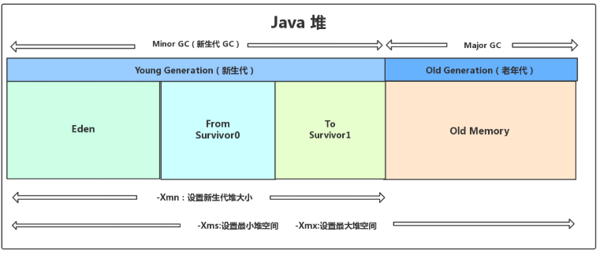

# 一、JVM与Java体系结构


.java-->编译器-->.class-->类加载系统-->java运行时数据区

**虚拟机**

* 系统虚拟机
  * VMware:完全对物理计算机的仿真
* 程序虚拟机
  * 专门执行单个计算机程序，JVM:执行java字节码指令

**JVM的优点**

* 跨平台，一次编译，到处执行
* 自动垃圾回收功能
* 即时编译器JIT

**JVM架构模型**

* 基于栈式(虚拟机栈)
  * 设计和实现简单，适用于资源受限的系统
  * 避开了寄存器的分配难题：使用**零地址**指令方式分配
  * 可移植性更好，可以实现跨平台
* 缺点
  * 性能下降，实现同样的功能需要更多的指令，毕竟还要入栈出栈等操作

# 二、类加载系统

类文件大概结构：Class 文件版本号、常量池、访问标志、[当前类、父类、接口索引集合]、字段表集合、 方法表集合、属性表集合

所有的类都由类加载器加载，加载的作用就是将 `.class`文件加载到jvm的运行时数据区的内存中，是一个java运行时的一个动作过程

**类加载过程：加载、链接、初始化**

* 加载
  * 双亲委派机制：**启动类加载器、扩展类加载器、系统类加载器**。首先从底层向上层委托，向上开始加载class文件，如果上层能找到就加载，上层找不到再让底层加载。
  * **通过一个类的全限定名获取此类的二进制字节流，并将其转换为运行时数据结构，在内存中生成一个class对象，作为访问这些数据的入口**
    * 本地系统获取
    * 运行时计算生成(动态代理)
    * 网络获取
* 链接
  * 验证：确保Class文件的字节流中包含信息符合当前虚拟机要求，保证被加载类的正确性，不会危害虚拟机自身安全(文件格式验证、元数据验证、字节码验证、符号引用验证)
  * 准备
    * 仅为类变量(静态变量)分配内存，并且设置该类变量的初始值，即**零值** (0 false null)
    * 不会为实例变量分配初始化(**内部类不初始化**)，类变量会分配在方法区中，实例变量会随着对象一起分配到Java堆中
    * 另外public static int value=111在准备阶段也是初始值为0，在初始化阶段才会赋为111；只有被final修饰，public static final int value=111，在准备阶段才赋值为111
  * 解析：将常量池内的符号引用转换为直接引用的过程。也就是得到类或者字段、方法在内存中的指针或者偏移量
* 初始化：执行类构造方法的过程。，这一步 JVM 才开始真正执行类中定义的 Java 程序代码(我理解的是初始化的是class实例？)
  * 对于初始化阶段，虚拟机严格规范了以下情况下，必须对类进行初始化
    * 比如 `new` 一个类，读取一个静态字段(未被 final 修饰)、或调用一个类的静态方法时。
    * 使用 `java.lang.reflect` 包的方法对类进行反射调用时如 `Class.forname("...")`, `newInstance()` 等等。如果类没初始化，需要触发其初始化
    * 初始化一个类，如果其父类还未初始化，则先触发该父类的初始化

**四种类加载器**

* 启动类加载器(Bootstrap ClassLoader)：用来加载java核心类库，无法被java程序直接引用
* 扩展类加载器(extensions class loader)：它用来加载 Java 的扩展库。JVM的实现会提供一个扩展库目录。该类加载器在此目录里面查找并加载 Java 类
* 系统类加载器（system class loader）：它根据 Java 应用的类路径（CLASSPATH）来加载 Java 类。一般来说，javac、javadoc都是由它来完成加载的。可以通过 ClassLoader.getSystemClassLoader()来获取它。
* 用户自定义类加载器，通过继承 java.lang.ClassLoader类的方式实现


```java
// 获取系统类加载器
ClassLoader systemClassLoader = ClassLoader.getSystemClassLoader();
System.out.println(systemClassLoader);

// 获取扩展类加载器
ClassLoader extClassLoader = systemClassLoader.getParent();
System.out.println(extClassLoader);

// 获取bootstrap加载器
ClassLoader bootstrapClassLoader = extClassLoader.getParent();
System.out.println(bootstrapClassLoader);

// 用户自定义类加载器 需要继承ClassLoader
```

* 用户编写的代码，默认使用系统类加载器加载
* java的核心库，默认使用引导类(bootstrap)加载器加载

# 三、JVM运行时数据区

JVM运行时数据区包括：虚拟机栈、程序计数器、本地方法栈(线程私有)、方法区或元空间、java堆(线程共有)

* 虚拟机栈：储存局部变量、方法返回地址等信息
* 本地方法栈：调用本地方法
* 程序计数器：记录下一条字节码执行指令，实现线程恢复等功能
* 堆：几乎所有实例对象都在java堆中分配内存
* 方法区：用于储存已被虚拟机加载的类信息、常量、静态变量等数据

## 3.1 虚拟机栈

**基本内容**

* 为每个线程创建一个栈，内部保存**栈帧**(虚拟机栈的基本单位)，对应着一次次的方法调用
* **生命周期**和线程一致
* 主管java程序的运行，保存方法的**局部变量**(8种基本数据类型、对象的引用地址)，部分结果，并参与方法的**调用和返回**
* 指令：==**-Xss**== 设置线程的最大栈空间(max stack size)

**优点**

* 快速有效的储存方式，访问速度仅次于程序计数器
* JVM对其操作简单：调用方法则进栈、执行结束则出栈
* 栈不存在垃圾回收，但会存在溢出，==**StackOverFlow**==

**异常**

* 若 Java 虚拟机栈的内存大小不允许动态扩展，那么当线程请求栈的深度超过当前 Java 虚拟机栈的最大深度的时候，就抛出 StackOverFlowError 错误
* Java 虚拟机栈的内存大小可以动态扩展， 如果虚拟机在动态扩展栈时无法申请到足够的内存空间，则抛出OutOfMemoryError异常

**运行原理**

* 不同线程中包含的栈帧不允许存在相互引用。
* Java方法有两种返回方式
  * return语句
  * 另外一种是抛出异常，不管哪种方式，都会导致栈帧被弹出

**内部结构**：局部变量表、操作数栈、动态链接、方法返回地址


* 局部变量表
  * 局部变量表存放编译期可知的各种基本数据类型(8种)，引用类型(reference)，return address类型
* 操作数栈
  * 在方法执行的过程中，根据字节码指令，往栈中写入数据或提取数据，即入栈/出栈
  * **i++和++i的区别**
    * i++：先将 i 的值加载到操作数栈，再将 i 的值加 1
    * ++i：先将 i 的值加 1，在将 i 的值加载到操作数栈
* 动态链接
* 方法返回地址
  * 存放调用该方法的pc计数器的值
* 为什么私有
  * 为了**保证线程中的局部变量不被别的线程访问到**，虚拟机栈和本地方法栈是线程私有的

## 3.2 本地方法栈

* java虚拟机栈：java方法调用。本地方法栈：本地方法调用
* 线程私有
* 本地方法被执行的时候，在本地方法栈也会创建一个栈帧，用于存放该本地方法的局部变量表、操作数栈、动态链接、出口信息。方法执行完后也会出栈并释放空间。也会出现StackOverFlowError 和 OutOfMemoryError 两种错误

## 3.3 程序计数器

* 运行时数据区唯一不会出现OOM的区域，没有垃圾回收。**它的生命周期随着线程的创建而创建，随着线程的结束而死亡**
* 每个线程私有，线程之间互不影响
* 程序计数器会储存当前线程正在执行的java方法的JVM指令地址
* PC计数器为什么设定为私有的？
  * CPU为每一个线程分配时间片，多线程在一个特定的时间段内只会执行一个线程方法，线程需要中断和恢复
  * 各个线程，程序计数器记录JVM指令地址，使它们之间可以独立计算，防止相互干扰。程序计数器私有主要是为了**线程的中断和恢复，使线程切换后能恢复到正确的执行位置**
* 两个作用
  * 字节码解释器通过改变程序计数器来依次读取指令，从而实现代码的流程控制，如：顺序执行、选择、循环
  * 在多线程的情况下，程序计数器用于记录当前线程执行的位置，从而当线程被切换回来的时候能够知道该线程上次运行到哪儿了。

## 3.4 堆

**基本内容**

* 堆是jvm内存管理的**核心区域**，且只有一个堆内存。需要注意的是，**堆的内存地址并不是连续的**，且所有实例和数组在运行时都会在堆上分配空间。
* 栈帧的局部变量表中保存的也是对象引用，引用指向的是对象或数组在堆中的位置
* 指令：==**-Xms**==：堆内存的起始内存  **==-Xmx==**：堆内存的最大内存 ==**-XX:+PrintGCDetails**==：开启打印详细信息
* 超过内存会报==**OOM(OutOfMemory)**==
* MinorGC(YoungGC)、MajorGC(OldGC)、MixedGC( G1 收集器特有的，指的是收集整个年轻代和部分老年代的 GC)、FullGC(包括年轻代、老年代的回收)

**组成部分**：

* 新生代
  * 伊甸园区(Eden区)
  * 存活区(survivor0 survivor1) from to
* 老年代
* 永久代(元空间)


```bash
三个问题
- 为什么划分出新生代和老年代？
	是为了优化GC的性能。如果不分代，GC就需要扫描整个堆空间；分代之后，可以对具体某一个区域进行合适的垃圾回收算法，可以提高回收的效率(分代收集算法)
- 为什么新生区被划分为Eden和survivor？
	survivor存在意义是为了增加进入老年代的筛选条件，减少送到老年代的对象，减少FullGC的次数
- 为什么要设置两个survivor区
	如果是一个survivor区，会由于内存不连续的问题，导致存放的对象不多，造成资源浪费；如果是3到4个survivor区，每个survivor区的内存又太小，很快会被填满；设置两个survivor区，在MinorGC时可以将Eden区和S0存活的对象以连续存储的方式存入S1区，减少碎片化。（清除阶段的复制算法）
```

```bash
几个极限情况：
- 如果对象太大，Eden区放不下，则直接进入老年代
- Eden区满了的时候，才会触发MinorGC；suivivor区如果满了，不会触发MinorGC,但是MinorGC时会清理Eden区和Survivor区。老年区满了，会触发MajorGC。
- suivivor区如果满了，survivor区的对象可能直接晋升到老年代
- survivor区对象的生命周期默认为15，超过则会移到老年代
```

```bash
堆空间的分配过程
1.new的对象先放Eden区，放得下直接放入（此区有大小限制 参数-Xmn 一般默认）(1.对象优先在 eden 区分配)
2.当创建新对象，Eden空间填满，会触发一次Minor GC/Young GC，将Eden不再被其他对象引用的对象进行销毁。将Eden中未销毁的对象移到survive0区。survive0区每个对象都有一个年龄计数器，一次回收还存在的对象，年龄加1
3.如果Eden有空间，加载的新对象放到Eden区（2.大对象直接进入老年代）
4.再次eden区满，触发垃圾回收，回收eden＋survive0，幸存下来的放在survive1区，年龄加1(长期存活的对象将进入老年代)
5.以此循环，分代年龄超过15岁进入老年代
6.老年代满了，则触发Full GC/Major GC，老年代的垃圾回收

小结：
- 针对suivivor区，复制之后会有交换，谁空谁是to
- 新生代采用复制算法的目的：为了减少内存碎片
- 频繁在新生区收集，很少在养老区收集，几乎不在元空间搜集
```

```bash
其他问题：
- 那些原因导致Full GC？
	1.JVM参数设置堆内存太小 -Xms -Xmx
	2.系统一次性加载过多的数据在内存中(sql未做分页处理)
	3.内存泄漏：频繁创建对象，但不回收(IO流不close释放资源)
	4.显示调用gc
- 什么情况下，GC会对程序产生影响？
	1.FullGC过于频繁或时间过长
	2.YoungGC过于频繁或时间过长
```

## 3.5 方法区


* 方法区用于存放Class的相关信息
* Person 类的 .class 信息存放在方法区中，真正的 person 对象存放在 Java 堆中，person 变量存放在 Java 栈的局部变量表中
* 指令：==**-XX:MetaspaceSize**==:设置初始大小

```bash
- 方法区和堆的异同
	1.方法区主要存放Class，堆中主要存放实例化对象
	2.方法区大小决定了系统可以保存多少个类，如果类定义太多，导致方法区溢出，JVM同样抛出内存溢出异常 OOM

- 举例说明方法区OOM
	1.加载大量的第三方的jar包

- 方法区的演进
	1.jdk7以前，存在永久代，静态变量存放在永久代上。使用jvm虚拟机内存
	2.jdk7，有永久代，但已经逐步失去永久代，字符串常量池，静态变量移除，保存在堆中
	3.jdk8开始，取消永久代，用元空间实现方法区(保存类信息，字段，方法，常量，静态)
	4.元空间不在虚拟机上设置内存，使用本地内存(堆外内存)
- 储存的内容
	1.类信息(class interface Enum Annotation)(public private final)(全限定名)
	2.域信息(public private abstract)(域类型)(域名)
	3.方法信息((public private)(返回类型)(方法名)(参数类型和数量)
	4.常量池
	5.静态变量
```

# 四、执行引擎


**执行引擎**是java虚拟机核心的组成部分之一。让程序跑起来的引擎。

**工作过程**

* 1.执行引擎在执行的过程中究竟需要执行什么样的字节码指令完全依赖于PC计数器
* 2.每当执行完一项指令操作后，PC寄存器就会更新下一条需要被执行的指令地址
* 3.当前方法在执行的过程中，执行引擎会通过存储在局部变量表中的对象引用准确定位到存储在Java堆区中的对象实例信息，以及通过**对象头**中的元数据指针定位到目标对象的类型信息

**机器码、指令、汇编**

* 机器码和CPU有关，不同的CPU对应的机器指令不同，即一组相同的01机器码，不同CPU执行的操作不一样
* 指令和硬件平台有关，不同的硬件平台，同一个指令对应的机器码也可能不一样，即使一样，不同的CPU也可能导致执行结果不一样。
* 指令集是每个硬件平台所支持的指令的集合。
* 汇编语言是为了达到更好的可读性。还是要通过汇编->指令->机器码

**解释器**

* 解析器真正意义上所承担的角色就是一个**运行时翻译者**，将字节码文件中的内容翻译为对应的平台的本地机器指令执行
* 当一条字节码指令被解释执行完成后，接着在根据PC寄存器中的记录下一条需要被执行的字节码执行解释执行

**JIT编译器(just in time)**

* 就是虚拟机将源代码直接编译成和本地机器平台相关的机器语言
* JVM平台支持一种叫做即时编译的技术，目的是避免解释执行，而是将整个函数体编译成机器码，每次函数执行时，只执行编译后的机器码即可。使执行效率大幅提升

```bash
- 为什么说Java是半编译半解释型语言?
	JVM在执行Java代码的时候，通常会将解释执行与编译执行二者结合起来进行.
- 为什么两条腿走路？
	首先程序启动后，解释器可以马上发挥作用，省去编译时间，立即执行；编译器要想发挥作用，把代码编译成本地代码，需要一定的执行时间。但编译为本地代码后执行效率更高；当Java虚拟机启动时，解释器可以首先发挥作用，而不是等待即时编译器全部编译完成后再执行，这样可以省去很多不必要的编译时间，随着时间的推移，编译器发挥作用，把越来越多的代码编译成本地代码，获得更高的执行效率
```

# 五、直接内存

* 直接内存（Direct Memory）并不是虚拟机运行时数据区的一部分，也不是 Java 虚拟机规范中定义的内存区域，是在java堆外的，直接向系统申请的内存区间。但是这部分内存也被频繁地使用，而且也可能导致 OutOfMemoryError 异常出现。
* 通常，**访问直接内存的速度会优于Java堆，即读写性能高**

  * 因此出于性能考虑，读写频繁的场合可能会考虑使用直接内存
  * Java的NIO库允许Java程序使用直接内存，用于数据缓冲区
* 缺点
  * 分配回收成本较高
  * 不受JVM内存回收管理
* 直接内存大小可以通过==**MaxDirectMemorySize**==设置
* 如果不指定，默认与堆的最大值-Xmx参数值一致
* 本机直接内存的分配不会受到 Java 堆的限制，但是，既然是内存就会受到本机总内存大小以及处理器寻址空间的限制。

# 六、虚拟机对象探究

```bash
- 对象的创建
	1.类加载检查
		虚拟机遇见一条new指令时，首先将去检查这个指令的参数是否能在常量池中定位到这个类的符号引用，并且检查这个符号引用代表的类是否已被加载过、链接和初始化过。如果没有，需要先执行相应类的类加载过程
	2.分配内存
    	在类加载检查后，接下来将为新生对象分配内存。对象所需内存大小在类加载完成后便可确认，为对象分配空间的任务等同于把一块确定大小的内存从java堆中划分出来。分配方式：指`针碰碰撞`和`空闲列表`两种
    	而这两种分配方式的选择取决于java堆内存是否规整。而java堆内存是否规整取决于GC收集器的算法是“标记清除”还是“标记整理”。指针碰撞适用于堆内存规整（即没有内存碎片），原理是用过的内存整合到一边，没有用过的整合到另一边，中间有个分界值指针，只需要向着没有用过的方向移动对象大小的位置即可。空闲列表适用于内存不规整的情况下，虚拟机会维护一个列表，记录了那些内存是可用的，在分配时，找一块足够大的内存进行分配。
    	- 补充问题：内存分配并发问题
    		在创建对象的时候有一个很重要的问题，就是线程安全，因为在实际开发过程中，创建对象是很频繁的事情，作为虚拟机必须保证线程安全。通常虚拟机有两种方式保证线程安全：
    		(1)CAS+失败重试： CAS 是乐观锁的一种实现方式。所谓乐观锁就是，每次不加锁而是假设没有冲突而去完成某项操作，如果因为冲突失败就重试，直到成功为止。虚拟机采用 CAS 配上失败重试的方式保证更新操作的原子性
    		(2)TLAB(Thread Local AllocationBuffer,线程本地分配缓冲区)： 为每一个线程预先在 Eden 区分配一块儿内存，JVM 在给线程中的对象分配内存时，首先在 TLAB 分配，当对象大于 TLAB 中的剩余内存或 TLAB 的内存已用尽时，再采用上述的 CAS 进行内存分配
	3.初始化零值
		内存分配完成后，虚拟机需要将分配到的内存空间都初始化为零值，这一步操作保证了对象的实例字段在 Java 代码中可以不赋初始值就直接使用，程序能访问到这些字段的数据类型所对应的零值
	4.设置对象头
		初始化零值完成之后，虚拟机要对对象进行必要的设置，例如[这个对象是哪个类的实例]、[对象的哈希码、对象的 GC 分代年龄等]信息。这些信息存放在对象头中。
	5.执行 init 方法
		以上工作都完成之后，一个新的对象已经产生了。但从java程序视角，对象创建才刚开始，<init>方法还没执行，所有字段都还为0，所以执行new指令之后，会调用构造函数把对象按照程序员的意愿进行初始化，这样一个可用的对象才算完全产生了。

- 对象内存布局
	在Hotspot虚拟机中，对象的内存布局分为3部分：对象头、实例数据、对齐填充
	`对象头`包括两部分信息：第一部分是类型指针，表示自己是属于哪个类的实例；第二部分是储存对象自身的运行时数据(哈希码、gc分代年龄)
	`实例数据`部分是对象真正储存的有效信息。也是程序中定义字段的具体内容
	`对象填充`不是必然的，仅仅是起到占位的作用。Hotspot 虚拟机要求对象的起止地址必须是8字节的整数倍，对象实例数据没有对齐的地方需要对齐填充补齐。

- 对象访问定位
	1.句柄：reference 中存储的就是对象的句柄地址，句柄中包含了对象实例数据和数据各自的具体地址。
	2.直接指针：reference 中存储的直接就是对象的地址
	使用句柄的好处是reference中储存的稳定句柄，在对象被移动时只改变句柄中的实例数据指针；直接指针最大好处就是速度快，节省了一次指针定位的时间开销。
	
----------------另一版本
new 一个对象在堆中的过程主要分为五个步骤：

1）类加载检查：具体来说，当 Java 虚拟机遇到一条字节码 new 指令时，它会首先检查根据 class 文件中的常量池表（Constant Pool Table）能否找到这个类对应的符号引用，然后去方法区中的运行时常量池中查找该符号引用所指向的类是否已被 JVM 加载、解析和初始化过

* 如果没有，那就先执行相应的类加载过程
* 如果有，那么进入下一步，为新生对象分配内存
2）分配内存：就是在堆中给划分一块内存空间分配给这个新生对象用。具体的分配方式根据堆内存是否规整有两种方式：

* 堆内存规整的话采用的分配方式就是指针碰撞：所有被使用过的内存都被放在一边，空闲的内存被放在另一边，中间放着一个指针作为分界点的指示器，分配内存就是把这个指针向空闲空间方向挪动一段与对象大小相等的距离
*堆内存不规整的话采用的分配方式就是空闲列表：所谓内存不规整就是已被使用的内存和空闲的内存相互交错在一起，那就没有办法简单地进行指针碰撞了，JVM 就必须维护一个列表，记录哪些内存块是可用的，在分配的时候从列表中找到一块足够大的连续空间划分给这个对象，并更新列表上的记录，这就是空闲列表的方式
3）初始化零值：对象在内存中的布局可以分为 3 块区域：对象头、实例数据和对齐填充，对齐填充仅仅起占位作用，没啥特殊意义，初始化零值这个操作就是初始化实例数据这个部分，比如 boolean 字段初始化为 false 之类的

4）设置对象头：这个步骤就是设置对象头中的一些信息

5）执行 init 方法：最后就是执行构造函数，构造函数即 Class 文件中的 <init>() 方法，一般来说，new 指令之后会接着执行 <init>() 方法，按照构造函数的意图对这个对象进行初始化，这样一个真正可用的对象才算完全地被构造出来了
```

对象实例化

* new
* Constructor的newInstance
* 使用clone
* 使用反序列化

**对象访问定位方式**

* 主流的方式：句柄和直接指针
* 直接指针：指向对象，代表一个对象在内存中的起始地址
* 句柄：可以理解为指向指针的指针，维护者对象的指针。句柄不直接指向对象，而是指向对象的指针(句柄不发生变化，指向固定内存地址)，再由对象的指针指向对象的真实内存地址
  * 【句柄】如果使用句柄访问的话，那么 Java 堆中将会划分出一块内存来作为句柄池，reference 中存储的就是对象的句柄地址，而句柄中包含了对象实例数据和类型数据各自的具体地址信息。(保守性GC)
  * 
  * 【直接指针】reference中存储：对象地址，如果访问对象本身，不需要多一次的间接访问的开销。(准确性GC)
  * 【直接指针】
* 优势
  * 使用句柄最大好处：reference中存放稳定句柄地址，在对象被移动时（垃圾收集）只改变句柄中实例数据指针，reference本身不改变。
  * 使用指针最大好处：速度快，节省了一次指针定位的时间开销，由于对象访问在Java中非常频繁，所以积少成多也是一项可观的执行成本。(HotSpot采用的这个)

# 七、StringTable

**基本内容**

* 使8种基本数据类型和一些特殊的String类型在运行过程中速度更快，更节省内存，采用了常量池技术
* Jdk8中，字符串常量池在堆，运行时常量池在元空间

**String不可变**

* 当字符串重新赋值，需要重写指定内存区域赋值，不能使用原有的value进行赋值
* 当调用String的replace方法修改指定字符或字符串时，也需要重新指定内存区域赋值，不能使用原有的value进行赋值。
* 当对现有的字符串进行连接操作时，也需要重新指定内存区域赋值，不能对使用原有的value进行赋值

**常量池**

* 常量池也叫Class常量池。<u>Java文件被编译成为Class文件后，Class文件除了包含类的版本、字段、方法、接口等描述信息外，还有一项常量池</u>。常量池就是Class文件被Java虚拟机加载进来后存放在方法区**各种字面量**和**符号引用**。
* 字面量：1.文本字符串 2.八种基本类型的值 3.被声明为final的常量等;
* 符号引用：1.类和方法的全限定名 2.字段的名称和描述符 3.方法的名称和描述符。
* **Java 基本类型的包装类的大部分都实现了常量池技术**。`Byte`,`Short`,`Integer`,`Long` 这 4 种包装类默认创建了数值 **[-128，127]** 的相应类型的缓存数据，`Character` 创建了数值在 **[0,127]** 范围的缓存数据，`Boolean` 直接返回 `True` Or `False`

```bash
区分普通类型和常量池技术(和String类似)
Integer i1 = 40;
Integer i2 = new Integer(40);
System.out.println(i1==i2);
另外所有整形包装类对象之间值的比较。全部使用 equals 方法比较。
```

**运行时常量池**

* 所在位置：元空间。
* 运行时常量池是当Class文件被加载到内存后，Java虚拟机会 **将Class文件常量池里的内容转移到运行时常量池里(运行时常量池也是每个类都有一个)**
* 具有**动态性**，并没只有预置在Class文件中的常量池再能进入元空间的运行时常量池，运行期间也可能将新的常量放入池中

**字符串常量池**

* 在工作中，String类是我们使用频率非常高的一种对象类型。JVM为了提升性能和减少内存开销，**避免字符串的重复创建**，其维护了一块特殊的内存空间，这就是我们今天要讨论的核心：字符串常量池在堆中存放。只存在字符串。
* 创建字符串的方式：采用字面量的方式赋值；采用new关键字创建字符串对象。
* 为什么String对象是不可变的：**因为这样可以保证多个引用可以同时指向字符串池中的同一个对象。如果字符串是可变的，那么一个引用操作改变了对象的值，对其他引用会有影响，这样显然是不合理的。*
* 优缺点：
  * 避免了相容内容的字符串的创建，节省了内存，省去了创建相同字符串的时间，同时提升了性能
  * 牺牲了JVM在常量池中遍历对象所需要的时间，不过其时间成本相对而言比较低

**字符串拼接操作**

* 如果+两边都是常量，常量与常量的拼接结果在常量池，原理是编译期优化
* 如果+两边存在变量，则拼接结果就在除常量池的堆外，变量的拼接原理是StringBuilder
* 如果字符串用final修饰，则+拼接的结果也是使用编译期优化的方式。
* 
* 对比+和append操作
  * +的性能不如append，原因每一次+都会产生一个新的stringBuilder对象，append一下，然后toString()一个新String。产生大量对象，需要GC花费额外的时间。StringBuilder则是一个默认长度比较大的char数组。
  * 体会执行效率：通过StringBuilder的append()的方式添加字符串的效率要远高于使用String的字符串拼接方式（+）

**intern总结**

* jdk1.6中，s.intern()  将这个字符串对象放入常量池
  * 如果常量池中有，则并不会放入，返回已有常量池中的对象的地址，
  * 如果没有，会把对象复制一份，放入常量池，并返回常量池中的对象地址
* jdk1.7起，s.intern()  将这个字符串对象尝试放入常量池
  * 如果常量池中有，则并不会放入，返回已有的常量池中的对象的地址
  * 如果没有，则会把对象的引用地址复制一份，放入常量池，并返回常量池中的引用地址
* intern效率比new String()高。建议使用！！！


```bash
- String常量池的使用方法
	1.直接使用双引号，声明出来的String对象会直接存储在常量池中
	2.如果不是双引号声明的String对象，可以使用String提供的intern()方法
```

# 八、垃圾回收概述



大部分情况，对象都会首先在 Eden 区域分配，在一次新生代垃圾回收后，如果对象还存活，则会进入 s0 或者 s1，并且对象的年龄还会加 1(Eden 区->Survivor 区后对象的初始年龄变为 1)，当它的年龄增加到一定程度（默认为大于 15 岁），就会被晋升到老年代中。 

* 关于垃圾收集

  * Java和C++语言的区别，垃圾收集技术、内存动态分配	
  * 三个经典问题
    * 哪些内存需要回收？
    * 什么时候回收？
    * 如何回收？
  * 简述Java垃圾回收机制（基本原理）
    * 在java中，我们**不需要手动**释放对象的内存，由JVM的**垃圾回收线程**自动对**没有引用**的对象进行回收
    * 创建对象时，GC开始监控这个对象的地址、大小以及使用情况。
    * GC采用**有向图**的方式记录和管理堆(heap)中的所有对象。通过这种方式确定哪些对象是"**可达的**"，哪些对象是"**不可达的**"。当GC确定一些对象为"不可达"时，GC就有责任回收这些内存空间
  * 垃圾回收机制
    * 分代复制垃圾回收
    * 标记垃圾回收
    * 增量垃圾回收
  * 什么是Grabage？
    * 垃圾是指在运行程序中没有任何指针指向的对象，这个对象就是需要被回收的垃圾。
    * 如果不及时对内存中的垃圾进行清理，那么，这些垃圾对象所占的内存空间会一直保留到应用程序结束，被保留的空间无法被其他对象使用。甚至可能导致内存溢出。
  * 为什么需要垃圾回收？
    * 不进行垃圾回收，内存会很快消耗完。进行垃圾回收，**释放内存空间**。
    * **碎片整理**，令新对象获得连续的内存空间。
  * 垃圾回收器
    * 优点
      * 无需手动分配回收内存，降低内存泄漏、内存溢出的风险
      * **自动内存管理机制**~~，将程序员从繁重的内存管理中释放出来，可以更专注于业务开发~~
    * 担忧
      * 对于Java开发人员而言，自动内存管理就像是一个黑匣子，如果过度依赖于“自动”，那么这将会是一场灾难，最严重的就会弱化Java开发人员在程序出现内存溢出时定位问题和解决问题的能力。

* 垃圾回收算法

  * **1、如何标记对象是否存活？**

    * 引用计数法

      * 每个对象上保存整形的引用计数属性，有对象引用计数器+1，减少引用计数器-1.计数器为0，垃圾回收。

      * 缺点：**循环引用**

      * 代码证明java不是使用的引用计数法

        

        结果：垃圾回收日志，Eden区占用率为1%,说明进行了垃圾回收(未用：引用计数)

    * 标记阶段：可达性分析法

      * 解决循环依赖引用问题，防止内存溢出
        * 
        * 根对象集合为起点，向下搜索直接或间接连接的对象为存活对象
        * 无法建立连接，即不可达对象标记为可回收对象
        * 总结为：通过一系列的称为 **“GC Roots”** 的对象作为起点，从这些节点开始向下搜索，节点所走过的路径称为引用链，当一个对象到 GC Roots 没有任何引用链相连的话，则证明此对象是不可用的，需要被回收
      * **GC Roots可以是哪些元素？**
        * 
        * 1**.虚拟机栈**(栈帧中的局部变量表)中引用的对象，比如：各个线程被调用的方法中使用到的参数、局部变量等。
        * 2.本地方法栈**中JNI(native方法)中引用的对象
        * 3.**方法区**中常量池引用的对象，比如：字符串常量池（StringTable）里的引用
        * 4.**方法区**中类静态属性引用的对象(static)
        * 5.JVM 内部的引用，如基本数据类型对应的 Class 对象，一些常驻的异常对象，还有系统类加载器等
        * 6.所有被同步锁（synchronized 关键字）持有的对象
      * GC Roots的总结
        * 总结一句话，除了堆空间外的一些结构，比如：虚拟机栈、本地方法栈、方法区、字符串常量池等地方对堆空间进行引用的，都可以作为GC Roots进行可达性分析

  * **2、什么时候进行垃圾回收？**

    * 当Eden区满了的时候会进行Young GC操作。

  * **3、如何进行垃圾回收**

    * 说一下JVM有哪些垃圾回收算法
      * 标记-清除算法
      * 复制算法
      * 标记-整理算法
      * 分代算法
    * 标记清除算法
      * 标记：从引用根节点开始遍历，标记所有被引用的对象
      * 清除：对堆内存从头到尾进行线性遍历，如果发现某个对象在其Header中没有标记为可达对象，则将其回收
      * 缺点：效率不高，进行GC时，需要停止整个应用程序，用户体验差。空闲内存不连续，产生内存碎片
    * 复制算法
      * 在垃圾回收时将正在使用的内存中的存活对象复制到未被使用的内存块中，之后清除正在使用的内存块中的所有对象，交换两个内存的角色，进而完成垃圾回收
      * 优点：没有标记和清除过程，实现简单，运行高效。保证空间的连续性，不会出现碎片问题
      * 缺点：需要两倍内存空间；
      * 综上：适用于垃圾对象很多，存活对象很少的场景。例如：Young区的Survivor0和Survivor1区
    * 标记-整理算法
      * 第一阶段和标记清除算法一样，从根节点开始标记所有被引用对象
      * 第二阶段将所有的存活对象压缩到内存一端，按顺序排放。之后，清理边界外所有空间。
      * 优点：消除了标记-清除算法当中，内存区域分散的缺点；消除了复制算法当中，内存减半的高额代价。
      * 缺点：从效率上来说，标记-整理算法要低于复制算法；移动对象的同时，如果对象被其他对象引用，则还需要调整引用的地址；移动过程中，需要全程暂停用户应用程序。即STW.Stop the World
    * **对比**
      * 
    * 分代收集算法
      * 新生代：复制算法。因为复制算法效率最高，其这里的垃圾较多，存活对象较少，回收频繁。
      * 老年代：标记整理或标记清除算法混合实现。这里存在大量存活率较高的对象。
      * 比如在新生代中，每次收集都会有大量对象死去，所以可以选择”标记-复制“算法，只需要付出少量对象的复制成本就可以完成每次垃圾收集。而老年代的对象存活几率是比较高的，而且没有额外的空间对它进行分配担保，所以我们必须选择“标记-清除”或“标记-整理”算法进行垃圾收集
    * 增量收集算法
      * 解决标记整理和标记清除在垃圾回收时，导致的STW问题。即对实时垃圾收集算法的研究直接导致了增量收集（Incremental Collecting）算法的诞生。
      * 基本思想：
        * 如果一次性将所有的垃圾进行处理，需要造成系统长时间的停顿，那么就可以让垃圾收集线程和应用程序线程交替执行。每次，垃圾收集线程只收集一小片区域的内存空间，接着切换到应用程序线程。依次反复，直到垃圾收集完成。
        * 总的来说，增量收集算法的基础仍是传统的标记-清除和复制算法。增量收集算法通过对线程间冲突的妥善处理，允许垃圾收集线程以分阶段的方式完成标记、清理或复制工作
      * 优点：使用这种方式，由于在垃圾回收过程中，间断性地还执行了应用程序代码，所以能减少系统的停顿时间。
      * 缺点：因为线程切换和上下文转换的消耗，会使得垃圾回收的总体成本上升，造成系统吞吐量的下降。
    * 分区算法
      * 
      * 一般来说，在相同条件下，堆空间越大，一次GC时所需要的时间就越长，有关GC产生的停顿也越长。
      * 为了更好的控制GC的停顿时间，将一块大内存分割为多个小块，合理的回收若干个小区间，而不是整个堆空间。

* 垃圾回收相关概念

  * System.gc() 的理解
    * 垃圾回收器可以马上回收内存？有什么办法主动通知虚拟机进行垃圾回收？
      * 可以。手动执行System.gc()。通知GC运行，但Java语言规范并不保证GC一定会执行
    * 内存溢出（OutofMemoryError）
      * **应用程序占用的内存增长速度非常快，造成垃圾回收已经跟不上内存消耗的速度**
      * GC年轻代老年代的垃圾回收-->内存不足-->独占式Full GC操作-->回收大量内存，供应用程序继续使用
      * Javadoc中对OOM的解释：没有空闲内存，并且垃圾收集器也无法提供更多内存。
        * 调整参数-Xms 、-Xmx
      * 永久代是在哪个版本去掉的？MetaSpace 是什么时候出现的？MetaSpace 大小一般建议设置为多少？它有可能会爆吗？
        * JDK8版本去掉；JDK8版本出现；一般建议设置**512M**。由于元空间存有类的元信息，所以加载第三方库足够多的情况下会爆掉。**-XX:MetaspaceSize=N**和 **-XX:MaxMetaspaceSize=N**一般设置成一样。
      * 如果物理机有 11G 内存，堆设置了 10G，MetaSpace 设置了 128M，它有可能发生 OOM 吗？什么情况会发生？？？？
    * 内存泄漏
      * **不再被使用的对象或变量一直占据在内存中，但GC又不能回收**
      * 内存泄漏，程序不会立刻崩溃，耗尽内存，最终出现OutofMemory异常，导致程序崩溃。
      * 原因：
        * **长生命周期对象持有短生命周期对象的引用**(句柄的方式容易导致内存泄漏，一个类的static属性持有另一个引用)
      * 单例模式
        * 单例的生命周期和应用程序一样长，所以在单例程序中，若持有对外部对象的引用，那么这个外部对象不能被回收，导致内存泄漏。
      * **一些提供close()的资源未关闭导致内存泄漏**
        * 数据库连接 dataSourse.getConnection()，网络连接socket和io连接必须手动close，否则不能被回收。try-with-resources
      * 其他语言的内存泄漏，由于没有自动垃圾回收机制，所以栈中的引用用完了，对应堆中的空间并没有释放，最终造成内存泄漏。
    * 开发中不要用System.gc() ，会导致Stop-the-World的发生。GC事件发生过程中，会产生应用程序的停顿。停顿产生时整个应用程序线程都会被暂停，没有任何响应，有点像卡死的感觉，这个停顿称为STW。
    * 强引用、弱引用、虚引用、弱引用
      * **强引用（StrongReference）：发生 gc 的时候不会被回收**
        * 类似“object obj=new Object()”这种引用关系为强引用。
        * 对于一个普通的对象，如果没有其他引用关系，引用赋值为null，就可以当做垃圾回收掉。
      * **软引用（SoftReference）：内存不足即回收**
        * **用来描述一些还有用，但非必需的对象**。第一次回收是不可达的对象，第二次回收是软引用的对象，如果内存还不足，才会抛出内存溢出异常。软引用通常用来实现内存敏感的缓存。
        * **概述：内存足够：不会回收软引用可达对象。内存不够：会回收软引用可达对象**
      * **弱引用（WeakReference）：发现即回收**
        * 弱引用也是用来描述那些非必需对象，只被弱引用关联的对象只能生存到下一次垃圾收集发生为止。在系统GC时，只要发现弱引用，不管系统堆空间使用是否充足，都会回收掉只被弱引用关联的对象。
        * **软引用、弱引用都非常适合来保存那些可有可无的缓存数据**。如果这么做，当系统内存不足时，这些缓存数据会被回收，不会导致内存溢出。而当内存资源充足时，这些缓存数据又可以存在相当长的时间，从而起到加速系统的作用。
        * 弱引用对象与软引用对象的最大不同就在于，当GC在进行回收时，需要通过算法检查是否回收软引用对象，而对于弱引用对象，GC总是进行回收。**弱引用对象更容易、更快被GC回收**。
        * 面试题：你开发中使用过WeakHashMap吗？**WeakHashMap用来存储图片信息，可以在内存不足时，及时回收，避免OOM**
      * **虚引用（PhantomReference）：对象回收跟踪**
        * 为一个对象设置虚引用关联的唯一目的在于**跟踪垃圾回收过程。比如：能在这个对象被收集器回收时收到一个系统通知。**
        * 虚引用必须和引用队列一起使用。虚引用在创建时必须提供一个引用队列作为参数。当垃圾回收器准备回收一个对象时，如果发现它还有虚引用，就会在回收对象后，将这个虚引用加入引用队列，以通知应用程序对象的回收情况。
      * 特别注意，在程序设计中一般很少使用弱引用与虚引用，使用软引用的情况较多，这是因为**软引用可以加速 JVM 对垃圾内存的回收速度，可以维护系统的运行安全，防止内存溢出（OutOfMemory）等问题的产生**。

* 垃圾回收器分类

  * 分类
    * 按线程数分（垃圾回收线程数），可以分为串行垃圾回收器和并行垃圾回收器
    * 按照工作模式分，可以分为并发式垃圾回收器和独占式垃圾回收器
    * 按碎片处理方式分，可分为压缩式垃圾回收器和非压缩式垃圾回收器。
  * **说一下 JVM 有哪些垃圾回收器？**
    * 串行回收器：Serial、Serial old
    * 并行回收器：ParNew、Parallel Scavenge、Parallel old
    * 并发回收器：CMS、G1
    * 分代
    * **新生代垃圾回收器和老年代垃圾回收器都有哪些？有什么区别？**
      * 新生代回收器：Serial、ParNew、Parallel Scavenge
        * 采用：复制算法，优点：效率高，缺点：内存利用率低（to区永远是空）；适用生命周期短的对象收集
      * 老年代回收器：Serial Old、Parallel Old、CMS(Concurrent Mark Sweep)
        * 采用：标记-清除-压缩算法
      * 整堆回收器：G1
      * 
      * 简单介绍两个
        * ParNew（并行回收器），将串行回收器多线程化，适合多CPU场景，需要搭配老年代CMS回收器一起使用。
        * CMS收集器：**CMS（Concurrent Mark Sweep）收集器是 HotSpot 虚拟机第一款真正意义上的并发收集器，它第一次实现了让垃圾收集线程与用户线程（基本上）同时工作**。CMS 收集器是一种 **“标记-清除”算法**实现的。主要优点：**并发收集、低停顿**。缺点：**它使用的回收算法-“标记-清除”算法会导致收集结束时会有大量空间碎片产生；对 CPU 资源敏感**
        * **G1 (Garbage-First) 是一款面向服务器的垃圾收集器,主要针对配备多颗处理器及大容量内存的机器. 以极高概率满足 GC 停顿时间要求的同时,还具备高吞吐量性能特征.**特点：**并行与并发**：G1 能充分利用 CPU、多核环境下的硬件优势，使用多个 CPU（CPU 或者 CPU 核心）来缩短 Stop-The-World 停顿时间；**分代收集**：虽然 G1 可以不需要其他收集器配合就能独立管理整个 GC 堆，但是还是保留了分代的概念；**空间整合**：与 CMS 的“标记-清理”算法不同，G1 从整体来看是基于“标记-整理”算法实现的收集器；从局部上来看是基于“标记-复制”算法实现的。


* 日志打印
  * -XX:+PrintGC ：输出GC日志
  * -XX:+PrintGCDetails ：输出GC的详细日志
  * -XX:+PrintGCTimestamps ：输出GC的时间戳（以基准时间的形式
  * -XX:+PrintGCDatestamps ：输出GC的时间戳
  * -XX:+PrintHeapAtGC ：在进行GC的前后打印出堆的信息

# 面试题

> 面试题

**1. 说一下JVM的主要组成部分及其作用？**

* 类加载子系统：加载字节码文件到运行数据区的方法区
* 执行引擎：执行字节码文件中的指令
* 本地方法接口：java调动其他语言的接口，与本地资源交互
* 运行时数据区：JVM的内存

* 执行流程
  * 首先通过编译器把java代码转换成字节码，类加载器(classLoader)再把字节码加载到内存中，将其放在运行时数据区的方法区内，而字节码文件只是JVM的一套指令集规范，并不能直接交给底层操作系统去执行，因此需要特定的命令解释器执行引擎(Execution Engine)，将字节码翻译成底层系统指令，再交给CPU去执行，而这个过程需要调用其他语言的本地库接口(Native Interface)来实现整个程序的功能。

**2.说一下类装载的执行过程？**

* 加载：根据查找路径找到相对应的class文件然后导入
* 验证：检查加载的class文件的正确性
* 准备：给类中的静态变量分配内存
* 解析：虚拟机将变量池中的符号引用替换成直接引用的过程。
* 初始化：对静态变量和静态代码块执行初始化工作

**3.java类加载机制**

* JVM把描述类的数据从Class文件加载到内存（方法区），并对数据进行校验，解析和初始化，最终形成可以被JVM直接使用的java类型。

**4.什么是双亲委派模型**

* 原理

  * Java虚拟机对Class文件采用的是按需加载，而且加载class文件时，java虚拟机使用的是双亲委派模型，即把请求交由父类处理，它是异种任务委派模型

    

  * 1、如果一个类加载器收到类加载请求，他并不会自己先去加载，而是把这个请求委托给父类的加载器去执行

  * 2、如果父类加载器还存在其父类加载器，则进一步向上委托，依次递归，请求最终将到达顶层的启动类加载器

  * 3、如果父类的加载器可以完成类加载任务，则成功返回，倘若父类加载器无法完成加载任务，子加载器才会尝试自己去加载，这就是双亲委派模型

* 优势

  * 避免类的重复加载
  * 保护程序安全，防止核心API被篡改

* 沙箱安全机制

  * 保证对Java核心源代码的保护
  * 例子：比如我定义一个类名为String所在的包为java.lang，因为这个类本来是属于jdk的，如果没有沙箱安全机制，这个类就会污染所有String，由于沙箱安全机制，所以就委托顶层bootstrap加载器查找这个类，由于String是jdk的源代码，所以在bootstrap那里就可以加载到了，保证了不被恶意代码污染。

  **5.说一下堆和栈的区别？**

* 物理地址

  * 堆：对象分配物理地址不连续，性能相对较弱
    * GC考虑分配不连续，产生算法提升性能：标记-消除，复制，标记-压缩，分代
  * 栈：先进先出，物理地址连续，性能相对堆好些

* 内存分配

  * 堆：在运行时分配，大小不固定
  * 栈：在编译时分配，大小固定

* 存放内容

  * 堆：对象的实例和数据
  * 栈：局部变量，方法返回地址

* 程序可见性

  * 堆：所有线程共享，可见
  * 栈：线程私有，只对线程可见，生命周期和线程相同

**6.使用PC(程序计数器)寄存器储存字节码地址有什么作用**

* 首先，线程是一个个的顺序执行，CPU需要不停的切换某个线程，这时候切换回来，需要知道从哪个地方继续执行
* 然后，记录下一条字节码执行的指令，实现分支循环跳转、异常处理、线程恢复等功能

**7.为什么设置两个survivor区**

* 只有一个survivor区，在第一次Eden区满进行MinorGC，存活对象放到survivor区；第二次Eden区满MinorGC-->survivor区，会产生不连续的内存，无法存放更多的对象。
* 设置三个四个survivor区，则每个被分配的survivor空间相对较小，很快被填满。
* 设置两个survivor区，在MinorGC时可以将Eden区和S0存活的对象以连续存储的方式存入S1区。减少碎片化。（清除阶段的复制算法）

**8.简述分代垃圾回收器是怎么工作的**

* 老年代：新生代 = 2:1
* Eden区：from区：to区 = 8:1:1
  * Eden区满，进行GC，将Eden+from区存活的对象移动到to区(复制算法)
  * 清空 Eden 和 From Survivor 分区，from/to调换名称
  * 对象到to区后，对象头的GC分代年龄加一，到达年龄阈值后进入老年代；to区满eden区的对象可能直接进入老年代；大对象可能直接进入老年代
  * 老年代达到一定阈值时，进行老年代的垃圾回收（标记-压缩算法）

**9.常见的gc调优参数有哪些？**

* -Xms2g 初始化堆大小为2g
* -Xmx2g 最大堆内存为2g
* -Xmn 设置新生区内存大小
* -XX:NewRatio=2 设置新生代与老年代内存比例为1:2
* -XX:SurviveRatio=8 设置eden区与survivor区内存比例为8:1:1
* -XX:+PrintGCDetails：打印 gc 详细信息

**10.堆是分配对象的唯一选择么？**

* 不是。除了可以分配到堆上，还可能分配到栈上。如果经过逃逸分析（Escape Analysis)后发现，一个对象并没有逃逸出方法的话，那么就可能被优化成栈上分配。


* 没有发生逃逸的对象，则可以分配到栈上。1.随着方法执行的结束，栈空间就被移除。2.虚拟机栈空间是线程私有的，不会被共享。

**11.永久代为什么被元空间替代**

* 永久代设置空间大小很难确定
* 对永久代进行调优很困难
  * 方法区的垃圾收集主要回收两部分内容：常量池中废弃的常量和不再用的类型，方法区的调优主要是为了减少Full GC次数
* 存储在本地内存，仅受本地内存限制

**12.为什么String对象是不可变的**

* 因为这样可以保证多个引用可以同时指向字符串池中的同一个对象。如果字符串是可变的，那么一个引用操作改变了对象的值，对其他引用会有影响，这样显然是不合理的

**13.探究intern()引发的问题(jdk6和jdk7以上的区别)**

```java
// 涉及区域： 栈 堆 永久代 字符串常量池
// jdk6及以上 案例1
String s1 = new String("1");    
s1.intern();        
String s2 = "1";
System.out.println(s1 == s2);    // false

//jdk6 案例2
String s1 = new String("1") + new String("1");
System.out.println(s1+"->"+System.identityHashCode(s1));//11->272890728
String s11 = s1.intern();  		
System.out.println(s11+"->"+System.identityHashCode(s11));//11->1596879151
String s2 = "11";
System.out.println(s2+"->"+System.identityHashCode(s2));//11->1596879151
System.out.println(s1 == s2);    //fals

// jdk7及以上
String s1 = new String("1") + new String("1");
System.out.println(s1+"->"+System.identityHashCode(s1));//11->272890728
String s11 = s1.intern();  		
System.out.println(s11+"->"+System.identityHashCode(s11));//11->272890728
String s2 = "11";
System.out.println(s2+"->"+System.identityHashCode(s2));//11->272890728
System.out.println(s1 == s2);    //true

// jdk6: 字符串常量池在永久代中。 jdk7以上：字符串常量池在堆中。
// 案例1，String s1 = new String("1");首先，字符串常量池中生成"1"的字符串，然后在堆中开辟字符串"1"的内存空间，这两个"1"的地址不一样。s1.intern()之后，由于常量池中存在"1",所以返回常量池中"1"的地址，所以s1和s2地址不一样。
// 案例2:	jdk6版本：由于常量池在永久区，不在堆中。new String("1") + new String("1");实际上调用了StringBuilder的append()方法，toString()的新对象，赋值给s1，所以时在堆中的空间地址，然后s1.intern(),由于产量池中没有"11"，所以常量池生成"11"的常量，所以jdk6是s1和s2地址不一样。
//	jdk7版本：字符串常量池位于堆中，new String("1") + new String("1")，执行完，常量池中存在"1"，堆中存在"11",调用s1.intern()之后，由于堆中存在"1"，所以常量池中直接将堆中的"11"地址放入产量池中，所以s1.intern()返回值其实就是s1的地址，所以s1和s2地址一样。
```


**14.四个基础的JVM面试题**

* 垃圾收集的算法有哪些？
* 如何判断一个对象是否可以回收？
* 垃圾收集器工作的基本流程
* 垃圾回收器各种常用参数

>  如何判断一个常量是废弃常量 如何判断一个类是无用的类

假如在字符串常量池中存在字符串 "abc"，如果当前没有任何 String 对象引用该字符串常量的话，就说明常量 "abc" 就是废弃常量，如果这时发生内存回收的话而且有必要的话，"abc" 就会被系统清理出常量池了。

类需要同时满足下面 3 个条件才能算是 **“无用的类”** ：

- 该类所有的实例都已经被回收，也就是 Java 堆中不存在该类的任何实例。
- 加载该类的 `ClassLoader` 已经被回收。
- 该类对应的 `java.lang.Class` 对象没有在任何地方被引用，无法在任何地方通过反射访问该类的方法。

> 请你介绍一下四种引用

```bash
	根据引用的强度由强到弱以次是强引用、软引用、弱引用、虚引用。引用强度越强，则越不容易被垃圾回收期回收
1）强引用
	通过 new 进行的引用赋值，只要还有强引用指向一个对象，就能表明对象还 “活着”，垃圾收集器永远不会碰这种对象
2）软引用
	软引用就是，如果内存空间足够，那么软引用就不会被回收掉，但是如果快要发生 OOM 了，那么 JVM 就会对这些软引用进行回收释放空间，如果对这些软引用回收完了之后还是没有足够的内存，才会抛出 OOM。
	应用场景：sql语句查询数据期间，如果查询的结果集占用内存很大，JVM内存不足以填充，很有可能会抛出异常。这时，就可以用软引用指向这个结果集对象。如果空间不足，就会被垃圾回收器回收掉，从而避免异常发生。
# 用一个软引用指向最终要返回的查询结果集，即对应上面代码的results
SoftRefence<List<List<Object>>> ref = new SoftReference<List<List<Object>>>(new LinkedList<List<Object>>());
while(rslt.next()){
	rowCount++;
	List<List<Object>> results = ref.get();
	if(results == null){
		# 为null 说明软引用指向的对象被GC标记清理，可以选择抛出自定义异常
		throw new TooManyResultException(rowCount);
	}else{
		results.add(row);
	}
}
3）弱引用 WeakReference
	弱引用就是，你创建了一个仅持有弱引用的对象，那么下一次垃圾收集发生的时候，无论当前内存是否足够，这个对象都会被回收掉。被弱引用关联的对象只能生存到下一次垃圾收集发生为止。
	弱引用经典的引用就是ThreadLocal的ThreadLocalMap实现。
static class ThreadLocalMap{
	static class Entry extends WeakReference<ThreadLocal<?>>{
		Object value;
		
		Entry(ThreadLocal<?> k, Object v){
			super(k);
			value = v;
		}
	}
}
4）虚引用 Phantom Reference
	如果一个对象仅持有虚引用，那么它就和没有任何引用一样，对其生存时间没有任何影响，我们也无法通过幻像引用来取得一个对象实例。
	所谓引用队列，当某个被引用的对象被回收的时候，JVM 会将指向它的引用加入到引用队列的队列末尾。我们就可以通过 ReferenceQueue 中的元素（引用）来知道哪些对象（被引用的对象）被回收掉了，我们就可以在对象被回收掉之后，来做一些我们自己想做的事情。
	虚引用的经典引用就是数据库连接池，数据库连接池应该具备的一个优点就是能够有效的避免连接资源泄露，同时能够对连接资源进行回收，我们可以用幻像引用来声明数据库的连接对象，这样，如果引用队列中能够拿到引用，就说明对应的连接对象被 GC 掉了，此时就应该对连接池执行相应的清理逻辑，防止我们忘记释放资源导致后续发生资源泄露。

```


