```
CASCADE:级联
```

```mysql
-- 查看表格定义的索引
show index from 'table_name';
```

# 1.创建函数出现错误

```
This function has none of DETERMINISTIC, NO SQL, or READS SQL DATA in its declaration and binary logging is enabled (you *might* want to use the less safe log_bin_trust_function_creators variable)
解决方法：
set global log_bin_trust_function_creators=TRUE;
```

# 2.用到的函数

```
# 单独的按照分数排名，并列也是不同的排名
DELIMITER $$
CREATE FUNCTION getRank(myid INT) RETURNS INT
BEGIN 
    DECLARE r INT;
    SELECT b.rank_num FROM (SELECT m.*,@rank_num := @rank_num+1 AS rank_num FROM myrank m,(SELECT @rank_num := 0) r ORDER BY m.user_score DESC) AS b WHERE b.id=myid INTO r;
    RETURN r;
END;
$$ DELIMITER ;

####################################
#同一分数是统一排名，下一个分数不一样则跳跃同分相应的排名 且同分下时间越靠近先显示
DELIMITER $$
CREATE FUNCTION getAdvancedRank(myid INT) RETURNS INT
BEGIN 
	DECLARE r INT;
	SELECT rankrow FROM 
	(SELECT m.*,
	@rank_num := IF(@preRank=user_score,@rank_num,@incRank) AS rankrow,
	@preRank := user_score,@incRank := @incRank+1 FROM myrank m,
	(SELECT @rank_num:=0,@preRank:=NULL,@incRank:=1) r ORDER BY user_score DESC,login_time DESC)s WHERE id = myid INTO r;
	RETURN r;
END
$$ DELIMITER ;

############################################
获取自己的总排名 不并列 按朝代 按分数、时间差
DELIMITER $$
CREATE FUNCTION getMyAllRank(dyid INT,myid INT) RETURNS INT
BEGIN 
	DECLARE r INT;
	SELECT rank_num FROM
	(SELECT m.*,TIMESTAMPDIFF(SECOND,print_time,login_time) AS time_diff , @rankrow :=@rankrow+1 AS rank_num FROM myrank m,(SELECT @rankrow:=0)r WHERE dy_id = dyid ORDER BY user_score DESC, time_diff ASC) r
	WHERE id = myid INTO r;
	RETURN r;
END
$$ DELIMITER ;
############################################
获取自己的月排名 不并列 按朝代 按分数、时间差
DELIMITER $$
CREATE FUNCTION getMyMonthRank(dyid INT,myid INT) RETURNS INT
BEGIN 
	DECLARE r INT;
	SELECT rank_num FROM (SELECT m.*,TIMESTAMPDIFF(SECOND,print_time,login_time) AS time_diff , @rankrow :=@rankrow+1 AS rank_num FROM myrank m,
	(SELECT @rankrow:=0)r WHERE DATE_FORMAT(m.login_time,'%Y%m') = DATE_FORMAT(CURDATE(),'%Y%m') AND dy_id = dyid ORDER BY user_score DESC, time_diff ASC
	)s WHERE id = myid INTO r;
	RETURN r;
END
$$ DELIMITER ;
```


```
SELECT TIMESTAMPDIFF(SECOND,'2020-12-17 09:46:49','2020-12-24 13:01:50') AS `timediff`;

SELECT id,user_name,user_score,rank_num FROM (SELECT m.*,@rankrow := IF(@preRank=user_score,@rankrow,@incRank) AS rank_num,
@preRank := user_score,@incRank := @incRank+1 FROM myrank m,(SELECT @rankrow:=0,@preRank:=NULL,@incRank:=1) r  WHERE dy_id = 1 ORDER BY user_score DESC,login_time DESC)s ;
/**总排行--不并列 按朝代 按分数 时间差**/
SELECT m.*,TIMESTAMPDIFF(SECOND,print_time,login_time) AS time_diff , @rankrow :=@rankrow+1 AS rank_num FROM myrank m,(SELECT @rankrow:=0)r WHERE dy_id = 1 ORDER BY user_score DESC, time_diff ASC ;
/**月排行--不并列 按朝代 按分数 时间差**/
SELECT m.*,TIMESTAMPDIFF(SECOND,print_time,login_time) AS time_diff , @rankrow :=@rankrow+1 AS rank_num FROM myrank m,(SELECT @rankrow:=0)r WHERE DATE_FORMAT(m.login_time,'%Y%m') = DATE_FORMAT(CURDATE(),'%Y%m') AND dy_id = 1 ORDER BY user_score DESC, time_diff ASC ;

SELECT getMyAllRank(1,8);

SELECT getMyMonthRank(1,3);

```

# 3.字段

```
java的String类型和mysql的timestamp可以对应
java的timestamp类型插入mysql的timestamp对应差8h  需要在mysql中设置mysql的时区

char  	固定长度 如果存入不够则以空格填补，所以取出时要trim() 存取更快 最多存255字符(多少字节要看是什么字符编码，按最大字节)
varchar	可变长度 存入字符+1~2字节	存取没char快 最多存65535字节。占用内存少。
timestamp 默认值可设CURRENT_TIMESTAMP，占用4字节如果是ON UPDATE CURRENT_TIMESTAMP则每次更新就变更时间，否则是创建时的时间      

datetime 以YYYY-MM-DD HH:MM:SS 格式存储日期时间,占用8字节

bigint/int(n) n表示表示显示宽度，实际还是使用4字节存储。位数不足补零 int(2) 插入1 显示01
char(n) n表示能存几个字符(字符和汉字一样) 
varchar(n) n也表示能存入几个字符 255字节以内用1个额外字节记录 即255字节(假设是ascii) 超过则用2个额外字节记录 即1000字符(共1002字节)
float(m,d) m表示总共有几位，d表示有几个小数点 如果超过了指定位数，则用可以表示的最大值表示
double(m,d) m表示总共有几位，d表示有几个小数点 如果超过了指定位数，则用可以表示的最大值表示
decimal 不指定位数时，m=10,d=0 建议decimal使用在精度高的地方

整形：
	tinyint：1个字节
	smallint：2个字节
	mediumint：3个字节
	int：4个字节
	bigint:8个字节
```

# 4.自定义函数

定义参数 @参数

例：SELECT user_name,@curRank := @curRank+1 AS ranknum FROM (SELECT @curRank:=0) q,myrank;

```
1、
自定义符号
	- delimiter $$    函数   $$ delimiter
创建函数：  
	- Create function function_name(参数列表) returns 返回值类型
例：
delimiter $$　　-- 如果函数体只有一条语句, begin和end可以省略, 同时delimiter也可以省略
　　create function 函数名(形参列表) returns 返回类型　　-- 注意是retruns
　　begin
　　　　函数体　　　　-- 函数内定义的变量如：set @x = 1; 变量x为全局变量，在函数外面也可以使用  
　　　　		    -- 局部变量： declare i int default 1;
　  　　返回值
　　end
$$
delimiter ;

2、查看函数
	- show create function 函数名;
3、删除函数
	- drop function 函数名;
	- drop function if exists function_name(参数列表);  ——推荐
4、调用函数
	- select 函数名(参数列表);
	
```

# 5、语法

 1、IF 条件语句

```sql
IF cj > 90 THEN     
	SET pf = '优秀' 
ELSEIF cj > 60 THEN     
	SET pf = '良好' 
THENELSE 
	SET pf = '不及格'END IF
```

   2、CASE 条件语句

```sql
CASE 	WHEN cj >= 60 THEN 		SET pf = '及格'; 	ELSE 		SET pf = '不及格'; END CASE ; 
```

------

   3、LEAVE 终止语句：LEAVE label ——跳出循环 类似java中的break

​      ITERATE 终止语句：ITERATE label ——结束此次循环，开始下次循环 类似java中的continue

   4、WHILE 循环语句：

```sql
WHILE sum<100 DOSET sum = sum + 1;END WHILE
```

   5、REPEAT 循环语句

```sql
REPEAT 	SET sum = sum + 1; UNTIL sum = 100 END REPEAT ;
```

# 6、自带时间函数

```mysql
-- CURDATE() 	返回当前日期	
SELECT CURDATE();-> 2018-09-19
-- DATE_FORMAT(d,f)	按表达式 f的要求显示日期 d	返回字符串	  
-- SELECT DATE_FORMAT('2011-11-11 11:11:11','%Y-%m-%d %H:%i:%s %r')-> 2011-11-11 11:11:11 AM
-- NOW()返回当前日期和时间SELECT NOW()-> 2018-09-19 20:57:43
-- TO_DAYS(d)计算日期d距离0000年1月1日(公元1年)的天数	 SELECT TO_DAYS('0001-01-01 01:01:01')-> 366 一般用来寻找前一天或者前几天的数据
-- DATEDIFF(date1,date2) 计算date1和date2的日期差。date1-date2即为返回值。如果date带有时间也只计算日期部分SELECT CASE WHEN MONTH(date)>=10 THEN YEAR(date) ELSE (YEAR(date)-1)END CASEAS ac_year,AVG(price_us)FROM coco_price GROUP BY ac_year
日期转字符串：date_format(date, format) 字符串转时间
str_to_date(str, format)  时间转字符串
```

# 7. 增删改查

```
insert into table(fild1,filed2) values('value1','value2');
insert ignore into table(fild1,filed2) values('value1','value2');  //忽略主键或唯一键报错，一样则不插入，否则插入   不列字段则会将所有字段都算进来。

delete from table where id = 1;
truncate table table1; //将表table1所有数据截断，速度更快

update table set filed1 = 'value1'

----------------------------select--------------------------------
- 普通查询
	select [all | distinct] {* | table.filed[as alias1]} from table_name [as table_alias]
		[left | right | inner join table_name2] -- 联合查询
		[where ...] -- 指定结果需满足的条件
		[group by ...] -- 指定结果按照哪几个字段来分组
		[having] -- 过滤分组的记录必须满足的次要条件
		[order by ...] -- 指定查询记录被一个或多个条件排序
		[limit {[offset,]row_count | row_countOFFSET offset}] -- 指定查询的记录从哪条至哪条  offset:偏移量 row_count:最大记录数
- 去重查询(发现重复的去重)
	select distinct filed from table; 
- select......for update
	1.如果查询条件用了索引/主键，那么select ..... for update就会进行行锁
	2.如果是普通字段(没有索引/主键)，那么select ..... for update就会进行锁表
------------------------------连接查询-------------------------------	
交叉连接也叫笛卡尔积，，它是指不使用任何条件，直接将一个表的所有记录和另一个表中的所有记录一一匹配。
- 内连接(交集)：将两个表的交集进行展示，展示了两个表的所有字段(可选) 数据：仅符合要求的数据。。
	select * from table1 join table2 on table1.id = table2.id ：
- 左连接：左表是主要的，左表的所有数据会显示，右表匹配不上则对应字段显示null。 字段两表全部显示。
select * from table1 left join table2 on table1.id = table2.id;
- 右连接：右表是主要的。右表的所有数据会显示，左表匹配不上则对应字段显示null。 字段两表全部显示
select * from table1 right join table2 on table1.id = table2.id;
- 全连接：类似select * from table1,table2 结果类似全连接
- 自连接：是一种用法。他的本质是把一张表当成两张表来使用 select b.* from table1 a,table1 b where...
问题：select * from A join B on A.name = B.name; 执行过程性能差，原因？
答案：连接查询性能差的原因可能是被驱动表 B(驱动表是主动发起查询的表) 没有建立 name 索引。由于没有添加索引，所以A中的每一行数据都会和B的每一行数据进行比较(具体步骤是一个嵌套查询。首先，遍历 A 表，一共需要扫描 100 行；然后，对这每一行都去 B 表中根据 name 字段进行搜索，满足 on 条件的，就作为结果集的一部分返回);如果B有索引的话，查询时就可以直接查询到，效率就会提高。如果A、B表都有100行，B没有索引就会判断100*100，B有索引就是100+100.
------------------------------联合查询-------------------------------
union 默认去重 union all 可以包含重复项
作用: 将多条查询语句的结果合并成一个结果  注意：查询字段内容和数量必须一致！
查询语句1
union
查询语句2
union
...

-------------------------------where---------------------------
where xxx and xxx ; where xxx or xxx; where not studentNo = 100;不为100的值

----------------------------模糊查询------------------------------- 
like
	- %(代表0到任意个字符) where studentName like '刘%'
	- _(代表一个字符) where studentName like '刘_'
in
	- where studentNO in (1,2,3)
between
	- where * between * and *  在两者之间
is null;is not null;	
------------------------------条件逻辑---------------------------
1.case when ... then ... else ... end
select s.name, (
	case 
		when (sc.score<60) then '不及格'
		else '及格'
	end	
) as pass
from sudent s,score sc where ...
2.IF(条件表达式, 为真返回值, 为假返回值)
select s.name if(sc.score<60, '不及格','及格') as pass from sudent s,score sc where ...
3.case column when value1 return ... when value2 return ... else return ...end
4.ELT(N,str1,str2,str3,...) 如果N = 1，返回 str1，如果N = 2，返回 str2，等等
```


```mysql
-- 函数
CONCAT(A,B) -- 连接两个字符
FORMAT(14500.2018, 2)	-- 格式化数字拥有有几位小数
YEAR() MONTH() -- 等等表示时间的函数
DATEDIFF(A，B) -– 确定两个日期之间的差异
SUBSTR(str,pos,len) -- str为字符串，pos为开始截取位置，len截取长度
BETWENN A AND B -- 如果A和B是数字,则直接比较；如果A和B是手写日期，则需要加'',如果是字段不需要加

-- 判断
-- 1、判断是否为奇偶数
select * from cinema where id & 1;  -- id & 1 奇数返回1 偶数返回0
select * from cinema where id=(id>>1)<<1;	-- id 偶数和原来相等，奇数不相等
```

```
查询时间：
SELECT * FROM cms_book_statistics WHERE update_time between '2017-09-27 00:00:00' and '2017-09-27 23:59:59' 
 
SELECT * FROM cms_book_statistics WHERE year(update_time ) = 2017 and month(update_time )= 09 and day(update_time ) = 27
 
SELECT * FROM cms_book_statistics WHERE update_time > '2017-09-27' and update_time < '2017-09-28'
 
SELECT * FROM cms_book_statistics WHERE ( datediff ( update_time , '2017-09-27' ) = 0 )

SELECT {CURRENT_DATE | CURDATE()}; -- 获取当前日期
SELECT {CURRENT_TIME | CURTIME()}; -- 获取当前时间
SELECT NOW(); -- 获取当前的日期+时间
SELECT {YEAR | MONTH | DAY | HOUR | MINUTE | SECOND}(


-------聚合函数---------
count(*) = count(1) > count(主键) > count('普通字段')
count(*)和count(1)是找到一条数据就+1 。 不会忽略NULL
count(‘主键’)找到一条还需要返回一下才+1。 不会忽略NULL
count('普通字段')找到一条还需要判断是否为NULL才+1。 会忽略NULL

-------实例-------
SELECT SubjectName, AVG(StudentResult) as avg 
	FROM result r
	INNER JOIN `subject` sub
	ON r.`SubjectName` = sub.`SubjectNo`
	GROUP BY r.SubjectNo
	HAVING avg > 80; -- 查询平均分大于80的数据
```

# 8.视图                                                                                                                                         

视图(view)是一种虚拟存在的表，作为**select语句**保存在数据库中，并以视图的方式展示出来部分数据。

**作用**：保障数据安全性、提高查询效率。1）简单，使用视图的用户不需要关心对应的表的结构等，对于用户来说是已经筛选好的结果集。2）安全，使用视图的用户可以只能访问他们被允许查询的结果集。3）数据独立，视图结构一旦确定，基表的字段增加不会影响视图的结构。

```
1、创建视图：	
- create or replace view view_name as select语句(任何select语句都可以) with check option
2、修改视图	
- alter view view_name as select语句(任何select语句都可以) with check option
3、删除视图	
- drop view if exists view_name;	

DML:database manipulation language 数据库操作语言
with check option：更新视图必须是在视图的权限范围内，也就是where条件允许才可以

- 视图可以更新数据嘛？
	有的可以，有的不可以，视图与表是两个概念，UPDATE视图，实际就是修改了视图对应的表中的数据。但如果视图中没有表（因为有的视图并不一定有表），则不能更新！
	如果是字段经过转换得到的新字段或者union all联合查询的结果等等都不能修改数据。其他的倒是可以修改数据。
```

# 9.临时表

Mysql临时表是用来保存一些临时数据的。

**临时表只对当前连接可见，当连接关闭时，Mysql会自动将临时表删掉**

对于php脚本来创建临时表，当php脚本执行完成后，该临时表就没了；对于客户端登陆mysql，则关闭客户端后该临时表就会销毁。

```
create temporary table table_name (	#以下和创建普通数据库一样);
```

# 10.外键

 是另一表的主键, 外键可以有重复的, 可以是空值，用来和其他表建立联系用的。所以说，如果谈到了外键，一定是至少涉及到两张表。 **主键表**是只含有主键的表，**外键表**是含有外键的表。

设置时可以设置delete和update时的状态，分别可以设置为cascade、set null、restrict、no action。

* **cascade**:级联，含义是对主键表进行的delete和update会影响到外键表的内容。delete则将外键表相应的数据也删掉，更新一样。            
* **set null**:设置为null. 对主键表的删除和更新，外键表相应数据的外键字段设置null。
* **restrict、no action**:不允许对含有外键的数据进行delete和update,否则会报错。

```
创建时：
CREATE TABLE `user`.`Untitled`  (  
	`id` int NOT NULL DEFAULT '' AUTO_INCREMENT,  
	`depart_id` int NOT NULL,  
	PRIMARY KEY (`id`), 
    CONSTRAINT `depart_id` FOREIGN KEY (`depart_id`) REFERENCES `user`.`department` (`id`) ON DELETE CASCADE ON UPDATE RESTRICT);
    第一个depart_id是外键名，第二个depart_id是字段名修改时：
    ALTER TABLE `user`.`employee` ADD CONSTRAINT `dept_id` FOREIGN KEY (`dept_id`) REFERENCES `user`.`department` (`id`) ON DELETE RESTRICT ON UPDATE CASCADE;
```

**为什么不推荐使用外键和级联？**

阿里巴巴开发手册这样说：不得使用外键和级联，，一切外键概念必须在应用层解决。外键与级联更新适用于单机低并发，不适合分布式、高并发集群;级联更新是强阻塞，存在数据库更新风暴的风险; 外键影响数据库的插入速度。

一般来说，外键增加了复杂性，每次delete和update都必须考虑外键约束，会导致开发的时候很痛苦, 测试数据极为不方便；**对分库分表不友好** ：因为分库分表下外键是无法生效的。

客观来说，外键也有其适用之处。保证了数据库的一致性和完整性；级联操作减轻了程序代码量。所以在单机地并发的情况下还是可以考虑适用外键的。

# 11.触发器

触发器经常用于加强数据的完整性约束和业务规则等。不是手工启动，是由事件来触发，例如对一个表进行操作就会激活它执行。

1.监视地点(table) 2.监视事件(insert/update/delete) 3.触发时间(after/before) 4.触发事件(insert/update/delete)

```
基本语法：CREATE TRIGGER trigger_name after/before insert/update/delete on table_name for each rowbegin	sql语句end;
解释：其中：trigger_time是触发器的触发事件，可以为before（在检查约束前触发）或after（在检查约束后触发）；trigger_event是触发器的触发事件，包括insert、update和delete，需注意对同一个表相同触发时间的相同触发事件，只能定义一个触发器；可以使用old和new来引用触发器中发生变化的记录内容。
begin
create trigger ins_stu after insert on student for each row begin insert into cj( stu_id, stu_name) values( new.stuid, new.username); 
end; 
```

学习链接： https://blog.csdn.net/qq_36396104/article/details/80469997/ 

# 12.储存过程

储存过程和函数的语法很像

学习链接： https://www.runoob.com/w3cnote/mysql-stored-procedure.html 

```bash
为什么推荐使用储存过程而不是触发器？
1.存储过程和触发器二者是有很大的联系的，我的一般理解就是触发器是一个隐藏的存储过程，因为它不需要参数，不需要显示调用，往往在你不知情的情况下已经做了很多操作。从这个角度来说，由于是隐藏的，无形中增加了系统的复杂性，非DBA人员理解起来数据库就会有困难，因为它不执行根本感觉不到它的存在。
2.再有，涉及到复杂的逻辑的时候，触发器的嵌套是避免不了的，如果再涉及几个存储过程，再加上事务等等，很容易出现死锁现象，再调试的时候也会经常性的从一个触发器转到另外一个，级联关系的不断追溯，很容易使人头大。其实，从性能上，触发器并没有提升多少性能，只是从代码上来说，可能在coding的时候很容易实现业务，所以我的观点是：摒弃触发器！触发器的功能基本都可以用存储过程来实现。
3.在编码中存储过程显式调用很容易阅读代码，触发器隐式调用容易被忽略。存储过程也有他的致命伤
4.存储过程的致命伤在于移植性，存储过程不能跨库移植，比如事先是在mysql数据库的存储过程，考虑性能要移植到oracle上面那么所有的存储过程都需要被重写一遍。

储存过程和函数
- 相同点
	1.存储过程和函数都是为了可重复的执行操作数据库的 SQL语句的集合
	2.存储过程和函数都是一次编译后缓存起来，下次直接使用
- 不同点
	1.标识符不同，函数的标识符是 function，存储过程是 procedure
	2.函数返回单个值或者表对象，而存储过程没有返回值，但是可以通过OUT参数返回多个值。
	3.存储函数使用 select 调用，存储过程需要使用 call 调用
	
储存过程为什么不推荐使用？
	我们可以把存储过程看成是一些 SQL 语句的集合，中间加了点逻辑控制语句。储存过程在业务比较复杂的时候是非常实用的，比如很多时候我们完成一个操作可能需要写一大串 SQL 语句，这时候我们就可以写有一个存储过程，这样也方便了我们下一次的调用。使用存储过程比单纯 SQL 语句执行要快，因为存储过程是预编译过的。那为什么不推荐使用呢？因为储存过程难以`调试和扩展，而且没有移植性`。
```

# 13.事务

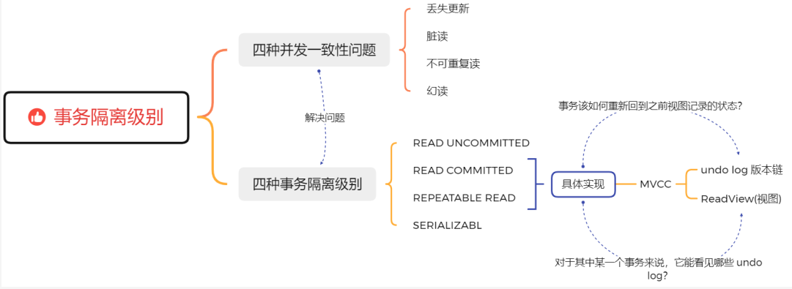

1. 数据库事务commit是很耗时的，大概要花费几十到100ms的时间，所以最好尽可能减少commit次数。

`ACID`很重要！！！幻读、脏读、重复读

悲观锁和乐观锁(version字段)

> 事务原则：ACID原则 原子性、一致性、隔离性、持久性 	（脏读、幻读、重复读）

**原子性(Atomicity)**

原子性是指事务是一个不可分割的工作单位，事务中操作要么都发生，要么都不发生。

**一致性（Consistency）**

事务前后数据的完整性必须保持一致。

**隔离性（Isolation）**

事务的隔离性是多个用户并发访问数据库时，数据库为每一个用户开启的事务，不能被其他事务的操作数据所干扰，多个并发事务之间要相互隔离。

**持久性（Durability）**

持久性是指一个事务一旦被提交，它对数据库中数据的改变就是永久性的，接下来即使数据库发生故障也不应该对其有任何影响

```bash
并发一致性问题：
	- 丢失更新	  事务期间，一个事务的更新操作被另一个事务的更新操作所覆盖
	- 脏读 		指一个事务读取到另一个事务未提交的数据	
	- 不可重复读   在一个事务内多次读取表的某条数据，读取结果不同。
	- 幻读 		在一个事务内多次读取表的某范围数据，读取结果数量不同。读取到了别的事务插入的数据，导致前后两次读取数量总量不一致	
	-可重复读 	在一个事务内多次读取表的某行数据，其他事务的增删改操作不影响该事务的读取，读取结果一样。读的是快照结果。

不可重复读和幻读区别：不可重复读更强调多次读取一条记录发现其中某些列的值被修改了，幻读重点是多次读取一条记录发现记录增多或减少了

读的时候互相不影响，插的时候互相影响

但在数据库层面，是可以帮助我们阻止丢失更新的，因为数据库对行进行修改时，需要对行或其他粗粒度级别的对象加锁，因此当事务 T1 修改行 r 但是没提交的时候，事务 T2 对行 r 进行更新操作的时候是会被阻塞住的，直到事务 T1 提交释放锁。
```

> 四种事务隔离机制

* read uncommited(读取未提交的内容) >>最低的隔离级别是读取未提交，一个事务还没提交时，它做的变更就能被别的事务看到：可以解决丢失更新问题（所谓丢失更新问题，就是指一个事务的更新操作会被另一个事务的更新操作所覆盖）
* read commited(读取提交内容、是快照读) >> 它满足了隔离的简单定义：一个事务只能看见已经提交事务所做出的的改变。这种隔离级别称之为**不可重复读**(一个事务实例在两次读取过程中的内容不一样)**可以阻止脏读，但是幻读或不可重复读仍有可能发生**。
* repeatable read(可重读、是快照读) >> 这是mysql的**默认事务隔离级别**。它确保同一事务在多次读取数据时，会看到同样的数据行。但又导致另一个问题**幻读**。**可以阻止脏读和不可重复读，但幻读仍有可能发生**。MVCC(Multiversion Concurrency Control+间隙锁)解决了该问题。注：其实多版本只是解决了不可重复读，间隙锁真正解决了幻读。InnoDB 的这个默认隔离级别，会通过 Next-Lock key 来解决幻读问题，所以其实是可以达到 SQL 标准的可串行化隔离级别的
* serializable(可串行化) >> 这是**最高**的隔离级别，他通过强制事务排序，使之不可能发生冲突，从而解决了幻读。**该级别可以防止脏读、不可重复读以及幻读**。(“写” 会加 “写锁”，“读” 会加 “读锁”，当出现读写锁冲突的时候，后访问的事务必须等前一个事务执行完成)

对于读取已提交和可重复读这两个隔离级别来说，其底层实现就是多版本并发控制 MVCC。

具体来说，对于这两个隔离级别，数据库会为每个事务创建一个视图 (ReadView)，访问的时候以视图的逻辑结果为准。通过 undo log 版本链使得事务可以回滚到视图记录的状态。

* 在 “读取已提交” 隔离级别下，这个视图是在每个 SQL 语句开始执行的时候创建的
* 在 “可重复读” 隔离级别下，这个视图是在事务启动时就创建的，整个事务存在期间都用这个视图

```mysql
-- 查看隔离等级SELECT @@transaction_isolation;
```

```bash
- 如何解决幻读
	产生幻读的原因是，行锁只能锁住行，但是新插入记录这个动作，操作的是锁住的行之间的 “间隙”。因此，为了解决幻读问题，InnoDB 只好引入新的锁，也就是间隙锁。
	幻读问题在 "当前读" 下才会出现。所谓当前读就是，读取的是最新版本的数据, 并且对读取的记录加锁, 阻塞其他事务同时改动相同记录，避免出现安全问题
	与之对应的，快照读，读取的是快照中的数据，不需要进行加锁。读取已提交和可重复读这俩隔离级别下的普通 select 操作就是快照读。其实就是 MVCC 机制，或者说，在快照读下，采用 MVCC 机制解决幻读
	然后，对于当前读这种情况，前面我们说，由于无法阻止新插入的数据，所以无法解决幻读问题，所以，我们考虑，不仅对扫描到的行进行加锁，还对行之间的间隙进行加锁，这样就能杜绝新数据的插入和更新。这个其实就是记录锁 Record Lock 和间隙锁 Gap Lock，也被称为临键锁 Next-Lock Key。
	当你执行 select * from user where name = 'Jack' for update 的时候，就不止是给数据库中已有的 n 个记录加上了行锁，还同时加了 n + 1 个间隙锁（这两个合起来也成为 Next-Key Lock 临键锁）。也就是说，在数据库一行行扫描的过程中，不仅扫描到的行加上了行锁，还给行两边的空隙也加上了锁。这样就确保了无法再插入新的记录

总结解决幻读的手段
	1.隔离级别：可重复读。快照读 MVCC + 当前读 Next-Lock Key(只在可重复读隔离级别下生效)
	2.隔离级别：SERIALIZABLE。在这个隔离级别下，事务在读操作时，先加表级别的共享锁，直到事务结束才释放；事务在写操作时，先加表级别的排它锁，直到事务结束才释放。也就是说，串行化锁定了整张表，幻读不存在的

- 4种隔离机制具体实现
	读取未提交和可串行化的实现没什么好说的，一个是啥也不干，一个是直接无脑加锁避开并行化 让你啥也干不成
	读已提交和可重复读，对于这两个隔离级别，数据库会为每个事务创建一个视图 (ReadView)，访问的时候以视图的逻辑结果为准
	* 在 “读取已提交” 隔离级别下，这个视图是在每个 SQL 语句开始执行的时候创建的？
	* 在 “可重复读” 隔离级别下，这个视图是在事务启动时就创建的

- undo log版本链(事务该如何重新回到之前视图记录的状态？)
	mysql每更新一条记录前都会记录一条回滚操作到undo log中，即可以通过回滚，得到前一个状态的值。
	简单理解，undo log 就是每次操作的反向操作，如果是插入语句，undo记录删除语句。
	B+ 索引树上对应的记录只会有一个最新版本，但是InnoDB根据undo log得到数据的历史版本。同一条记录在系统中可以存在多个版本，就是数据库的多版本并发控制（MVCC）
	如何通过这行记录找到它拥有的undo log呢？具体来说，InnoDB 存储引擎中每条行记录其实都拥有两个隐藏的字段：trx_id 和 roll_pointer
	* trx_id 就是最近更新这条行记录的事务 ID
	* roll_pointer 就是指向之前生成的 undo log 的指针
	每次修改就都会更新trx_id和roll_pointer这两个隐藏字段，之前的多个数据快照对应的 undo log 会通过 roll_pointer 指针串联起来，从而形成一个版本链。
	对于一个事务来说，他能看到哪些 undo log 执行回滚操作？ReadView 机制就是用来判断当前事务能够看见哪些版本的。
	m_ids：生成 ReadView 时有哪些事务在执行但是还没提交的（称为 “活跃事务”）
	min_trx_id：m_ids 里最小的值
	max_trx_id：生成 ReadView 时 InnoDB 将分配给下一个事务的 ID 的值（事务 ID 是递增分配的，越后面申请的事务 ID 越大）
	creator_trx_id：当前创建 ReadView 事务的 ID
	那么m_ids中存在的和大于等于max_trx_id的，当前事务都看不到，只能看到当前事务的修改和小于min_trx_id的事务的修改
```

# 14、查漏补缺

## 14.1 储存引擎

> 类型

```java
/*** INNODB 默认使用* MYISAM 早些年使用*/
```

|            | MYISAM       | INNODB                  |
| ---------- | ------------ | ----------------------- |
| 事务支持   | 不支持       | 支持                    |
| 数据行锁定 | 不支持(表锁) | 支持(行锁)              |
| 外键       | 不支持       | 支持                    |
| 全文索引   | 支持         | 不支持(版本5.6开始支持) |
| 读写速度   | 更快         | 更慢                    |

sqlite也是表锁，WAL模式支持读写同时->写的内容写外面，最后统一写入原数据文件中。

常规使用操作：

* MYISAM 节约空间，速度较快
* INNODB 安全性高，事务的处理，多表多用户操作

物理空间存在的位置：

* 所有的数据文件都存在data目录下，一个文件夹就对应一个数据库，本质还是文件的存储！
* InnoDB在数据库表中只有一个*.ibd文件，保存索引和数据
* MYISAM对应文件
  * *.MYD 数据文件 *.MYI 索引文件 *.sdi 表结构文件

两种存储引擎都是基于B+树数据结构存储表数据的，但是区别在于InnoDB存储引擎中的B+树即存储了索引又存储了所有数据，而MyISAM中的B+树中只存储了索引的Key值地址

> 锁

* 表级锁：开销小，加锁快；不会出现死锁，发生锁冲突的概率最低，并发最低
* 行级锁：开销大，加锁慢，会出现死锁，粒度最小，发生锁冲突的概率最低，并发高
* 页面锁：介于表级锁和行级锁之间

> MyISAM和InnoDB的区别

* MyISAM 只有表级锁，而 InnoDB 支持行级锁和表级锁,默认为行级锁。也就说，MyISAM 一锁就是锁住了整张表，而InnoDB 在并发的时候性能更佳。表级锁是mysql中**粒度最大** 的一种锁，实现简单，不会出现死锁。而行级锁是mysql中粒度最小的锁，可以大大减少数据库操作冲突，但可能会出现死锁。
* MyISAM 不提供事务支持，InnoDB 提供事务支持，具有提交(commit)和回滚(rollback)事务的能力。
* MyISAM 不支持外键，而 InnoDB 支持外键。
* MyISAM 不支持**数据库异常崩溃后的安全恢复**，InnoDB支持

**MyISAM**

* 不支持事务，但是每次查询都是原子性的，因为是表级锁，每次查询只有一个请求可以查询到
* 不支持外键
* 一个MyISAM表有三个文件：索引文件、表结构文件、数据文件
* 主键索引采用非聚集索引，索引文件的数据域储存指向数据文件的指针。

**InnoDB**

支持ACID的事务，支持事务的四种隔离级别；行级锁及外键约束，可以支持写并发。主键索引采用聚集索引，即索引的数据域储存数据文件本身。

采用多版本并发控制（MVCC，MultiVersion Concurrency Control）来支持高并发。并且实现了四个标准的隔离级别，通过间隙锁`next-key locking`策略防止幻读的出现。

**MyISAM为什么比InnoDB查询速度快**

* InnoDB在做SELECT的时候，要维护的东西比MYISAM引擎多很多，影响查询速度
* InnoDB要缓存数据块，MyISAM只缓存索引块，这中间还有换进换出的减少
* InnoDB寻址要映射到块，再到行，MyISAM记录的直接是文件的OFFSET，定位比InnoDB要快
* InnoDB还需要维护MVCC一致。MyISAM并不需要

> 字段的优先级

整形>date,time>enum,char>varchar>blob,text

> SQL语言 

```bash
数据定义：Create Table,Alter Table,Drop Table, Craete/Drop Index 等
```

> 数据库范式

**函数依赖**：若在一张表中，在属性X 的值确定的情况下，必定能确定属性 Y 的值，那么就可以说 Y 函数依赖于 X，写作X->Y

**部分函数依赖**：如果X->Y，表中存在另外一个字段Z，使得Z->Y，那么称Y对X部分函数依赖。（学号，**==身份证号==**）->（姓名）

**传递函数依赖**：设 X，Y，Z 是 U 的不同的属性子集，如果 X 确定 Y、Y 确定 Z。则称之为传递函数依赖。(学号 , 姓名, 系名，==**系主任**==)

第一范式：**属性的原子性，不可在分解**。电话->办公电话、移动电话

第二范式：在第一范式基础上消除了字段之间的部分函数依赖。

第三范式：在第二范式基础上增加了任何字段不能存在传递函数依赖的关系。

> :=和=区别

=只能在set、update语句赋值，:=可以在select语句赋值

> 手工数据同步

```sql
-- 将一个表内容更新到另一个表中
update book_borrow br,student st set br.student_name = st.name where `br.student_id = st.id;
```

> 为什么MyISAM比InnoDB快

1）NNODB要缓存数据块，MYISAM只缓存索引块， 这中间还有换进换出的减少；

2）innodb寻址要映射到块，再到行，MYISAM记录的直接是文件的OFFSET，定位比INNODB要快

3）INNODB还需要维护MVCC一致；虽然你的场景没有，但他还是需要去检查和维护

MVCC (Multi-Version Concurrency Control)多版本并发控制


> 为什么用了索引，sql查询还是很慢

```bash
- 索引下推
	当查询这句话时，SELECT * from user where  name like '陈%' and age=20，如果没有索引下推，则先从二级索引树中查找name符合要求并不忽略age字段找出对应的id，在去主键树中去查找对应的值，判断age是否等于20；如果有索引下推，则在二级索引查找name符合要求时，不忽略age字段，找出同时符合两个字段对应的id。
	优点：`索引下推在非主键索引上的优化，可以有效减少回表的次数，大大提升了查询的效率`

慢查询归纳起来大概有这么几种情况
	1.全表扫描
	2.索引过滤性不好
	3.频繁回表的开销

- 回表的代价
	select * from t_people where name='张三' and age=8
	假设t_people表上有一个索引是姓名和年龄的联合索引，那这个联合索引的过滤性应该不错。因此向右扫描的行数很少，查询效率就很高。
	
	select * from t_people where name like '张%' and age=8;
	低版本：根据最左前缀原则符合第一个满足条件的索引，就回表查找其主键值对应的信息是否符合年龄为8
	高版本：索引下推减少了不必要的回表操作，联合索引判断时，符合第一个条件后同时符合第二个索引才回表查询，否则直接丢弃。
	建立联合索引后，找到第1个年龄字段是张开头的记录，判断这个索引记录里面，年龄的值是不是8，如果是就回表，取出整行数据，作为结果集的一部分返回，如果不是就丢弃
	假设全国姓张的有8000万，其中100万个是8岁小朋友，则会在联合索引里遍历8000万次，而回表只需要100万次。
	
	select * from t_people where name_first='张' and age=8
	虚拟列方法
	可以考虑把名字的第一个字和age来做一个联合索引。虚拟列就是name字段的第一个字，虚拟列在插入数据的时候不能指定值，在更新的时候也不能主动修改，它的值会根据定义自动生成，在name字段修改的时候也会自动修改。
	有了这个新的联合索引，就只需要扫描联合索引的100万行，并回表100万次。

- 虚拟列生成方式
	1.alter table t_people add name_first varchar(2) generated (left(name,1)),add index(name_first,age);
	2.
	CREATE TABLE `t_people`(
		`id` int(11) DEFAULT NULL,
		`name` varchar(20) DEFAUT NULL,
		`name_first` varchar(2) GENERATED ALWAYS AS (left(`name`,1)) VIRTUAL,
		 KEY `name_first`(`name_first`,'age')
	) ENGINE=InnoDB DEFAULT CHARSET=utf8; 

- 写操作
	* `当 redo log 写满时就会进行刷脏页，此时写操作也会终止，那么 SQL 执行自然就会变慢`。
 	* `遇到所要修改的数据行或表加了锁时，需要等待锁释放后才能进行后续操作，SQL 执行也会变慢。

- 读操作
	* 读操作慢很常见的一个原因是未命中索引从而导致全表扫描，可以通过 explain 方式对 SQL 语句进行分析。
  	* 另一种原因是在读操作时，要读入的数据页不在内存中，需要通过淘汰脏页才能申请新的数据页从而导致执行变慢	
```

> 不同的数据库语言

**DML**：数据库操作语言（Data Manipulation Language）的缩写，是指对数据库中表记录的操作，主要包括表记录的插入（insert）、更新（update）、删除（delete）和查询（select），是开发人员日常使用最频繁的操作

**DDL**：（Data Definition Language）是数据定义语言的缩写，简单来说，就是对数据库内部的对象进行创建、删除、修改的操作语言

**DQL**：由于`select`不会对表进行破坏，所以有的地方也会把`select`单独区分开叫做数据库查询语言DQL（Data Query Language）


**联合索引的执行流程：**


**mysql常见的sql错误**

``` bash
- 3.使用Join代替嵌套子查询
	虽然mysql5.6引入了物化特性，但是针对查询语句，对于更新或删除需要手工重写成join。
- 4.Exists语句
	select * from table where exists('查询语句') 
	mysql对待EXISTS子句时，仍然采用嵌套子查询的执行方式。实际上每条记录都需要执行exists语句，并不是先执行

- 优化sql
	1.Limit语句
	SELECT * FROM   operation WHERE  type = 'SQLStats' AND name = 'SlowLog' ORDER  BY create_time LIMIT  1000000, 10; 
	由于数据库并不知道1000000的位置在哪里，所以即使有了索引也需要从头计算一次。解决方法：将上一页的最大值作为查询条件的
	解决：SELECT * FROM operation WHERE type = 'SQLStats' AND name = 'SlowLog' AND create_time > '2017-03-16 14:00:00' ORDER BY create_time limit 10;
	直接找到位置，并限制条数
	2.连接查询时如果可以缩小连接表的范围，则尽量缩小
	3.select不要使用*，而是使用那些字段写那些字段，在大数据时会增加返回时间
- 索引不生效
	1.隐式类型转换、隐式编码转换
	select * from people where age = 18;
	如果数据库age字段是varchar类型的，mysql策略会将字符串转换为数字进行比较。函数作用于表字段，索引失效。所以应该修改字段类型且进行避免此类情况。
	编码转换字段编码不一样，一个是utf8一个是utf8mb4，所以会导致utf8变为utf8mb4进行比较，索引失效。
	
```

**数据库和缓存更新时机**

```bash
1.cache aside：旁路缓存，是比较常用的缓存策略	
	读请求：应用首先会判断缓存是否有该数据，缓存命中直接返回数据，缓存未命中即缓存穿透到数据库，从数据库查询数据然后回写到缓存中，最后返回数据给客户端。
	写请求：首先更新数据库，然后从缓存中删除该数据。
	误区一：先更新数据库，再更新缓存。但是在高并发下更新缓存顺序是不可控的，所以最终缓存和数据库不一致。
	误区二：先删缓存，再更新数据库。在一个读请求和一个写请求并发场景下可能会出现数据不一致情况。在写请求到达，删除缓存；读请求未命中缓存读数据库，并回写缓存；写请求更新数据库。导致不一样。
	误区三：先更新数据库，再删除缓存，也会存在问题。在读请求未命中缓存读取数据库，返回数据；写请求更新数据库删除缓存，此时读请求才回写缓存。但是发生概率很低。保底方案：缓存设置过期时间，而且可以允许少量的数据段时间内不一致的情况。
2.Read/Write through
	一般是由一个 Cache Provider 对外提供读写操作，应用程序不用感知操作的是缓存还是数据库
3.Write behind
	说白了就是延迟写入，应用程序更新数据时只更新缓存， Cache Provider每隔一段时间将数据刷新到数据库中。

如果第二步执行失败，需要重试。由于同步重试会影响吞吐量，所以通常采用异步重试，可以配合消息队列来实现，保证数据一致性。
```

> 不小心删库应该怎么做

```bash
1.、
	-- 创建一个和原表一样的备份表（包含索引）
	create table t_user_bak like t_user;
	-- 拷贝数据到备份表
	INSERT into t_user_bak select * from t_user;
	-- 确认数据拷贝完成
	select * from t_user_bak;
2.运维人员应该设置数据库定期备份，研发人员应该提醒运维人员编写自动备份脚本
3.使用binlog完成数据恢复。
	3.1 查看binlog是否开启
		SHOW VARIABLES LIKE 'LOG_BIN%';
	3.2 根据路径位置，使用mysqlbinlog命令查看binlog文件
		mysqlbinlog -d=fusion bin-log.000001 -- 查看 fusion 数据库的日志
		mysqlbinlog  --start-datetime='2021-06-09 19:30:00' --stop-datetime='2021-06-09 19:50:00' bin-log.000001 -- 查看某个时间段内的日志
```


## 14.2 索引

索引是一种用于快速查询和检索数据的数据结构。常见的索引结构有B数、B+树和Hash。

**优点**

* 大大加快 数据的检索速度
  * 极大地减少扫描的行数
  * 可以帮助服务器避免排序和临时表
  * 索引可以将随机IO变为顺序IO

**缺点**

* 创建索引和维护索引需要耗费许多时间。会降低增删改的速度
* 索引需要使用物理文件储存，也会耗费一定空间

**索引底层数据结构**

**Hash表**

哈希表是键值对的集合，通过键(key)即可快速取出对应的值(value)，因此哈希表可以快速检索数据（接近 O（1））

**为何能够通过key快速取出value呢？**原因在于 **哈希算法**，通过散列算法，可以快速通过key的哈希值得到index，通过index可以快速得到value值。

**B树&B+树**

B 树也称 B-树,全称为 **多路平衡查找树** ，B+ 树是 B 树的一种变体。B 树和 B+树中的 B 是 `Balanced` （平衡）的意思。

**B树和B+树的异同？**

* B 树的所有节点既存放键(key) 也存放 数据(data)，而 B+树只有叶子节点存放 key 和 data，其他内节点只存放 key
* B 树的叶子节点都是独立的;B+树的叶子节点有一条引用链指向与它相邻的叶子节点

MyISAM引擎，B+Tree 叶节点的 data 域存放的是数据记录的地址。在索引检索时，首先按照B+树搜索索引，如果指定的 Key 存在，则取出其 data 域的值，然后以 data 域的值为地址读取相应的数据记录。这被称为**“非聚簇索引”**

InnoDB 引擎中，其数据文件本身就是索引文件，树的叶节点 data 域保存了完整的数据记录，因此 InnoDB 表数据文件本身就是主索引。这被称为“**聚集索引**”


**索引类型**

```bash
	索引就是为了加快对数据的访问速度，但是同时会降低插入、删除和更新的速度，由于执行写操作还要操作索引文件。
	* 普通索引: 允许索引的数据包含重复的值。
	* 唯一索引: 保证索引的数据不存在重复项
	* 主键索引: 是一种特殊的唯一索引，一张表只能定义一个主键索引。
	当然索引可以覆盖多个列，这就是联合索引，联合索引要符合最左前缀原则。
----------------------------- 根据索引和数据区分
- 聚集索引
	聚集索引即索引结构和数据一起存放的索引。主键索引属于聚集索引
	在 Mysql 中，InnoDB 引擎的表的 .ibd文件就包含了该表的索引和数据，对于 InnoDB 引擎表来说，该表的索引(B+树)的每个非叶子节点存储索引，叶子节点存储索引和索引对应的数据。
	- 优点
    	1.聚集索引的查询速度非常的快，定位到索引就相当于定位到数据
    - 缺点
    	1.依赖于有序的数据。因为B树是多路平衡树，如果索引的数据不是有序的，比如UUID或字符串，插入或查找的速度肯定比较慢
    	2.更新代价大。如果对索引列的数据被修改时，那么对应的索引也将会被修改， 而且况聚集索引的叶子节点还存放着数据，修改代价肯定是较大的
    - 查找过程
    	首先会判断查找条件where中的字段是否为索引字段，如果是就会先拿着这个字段去.ibd文件通过B+树快速定位，从根节点开始查找。找到后直接把这个索引及其记录的其他列数据返回。

- 非聚集索引
	非聚集索引即索引结构和数据分开存放的索引。`二级索引属于非聚集索引`.二级索引的叶子节点只指向了行的主键值，还需要通过主键B+树中去查找行。
	MYISAM引擎中.MYI文件包含了表的索引，该表的索引(B+树)的叶子节点储存了索引和索引对应数据的指针，指向.MYD 文件的数据。
	- 优点
		1.更新代价比聚集索引小。
	- 缺点
		1.跟聚集索引一样，非聚集索引也依赖于有序的数据
		2.可能会二次查询(回表) :这应该是非聚集索引最大的缺点了。当查到索引对应的指针或主键后，可能还需要根据指针或主键再到数据文件或表中查询。
	- 查找过程
    	1.首先会判断查找条件 where 中的字段是否是索引字段，如果是就会先拿着这字段去 .MYI 文件里通过 B+tree 快速定位，从根节点开始定位查找
    	2.找到后再把这个索引关键字存放的磁盘文件地址拿到 .MYD 文件里面找，从而定位到索引所在行的记录
----------------------------- 索引类型区分
- 主键索引
	数据表的主键列使用的就是主键索引
	在 MySQL 的 InnoDB 的表中，当没有显示的指定表的主键时，InnoDB 会自动先检查表中是否有唯一索引的字段，如果有，则选择该字段为默认的主键，否则 InnoDB 将会自动创建一个 6Byte 的自增主键

- 二级索引
	二级索引又称为辅助索引，是因为二级索引的叶子节点存储的数据是主键。也就是说，通过二级索引，可以定位主键的位置
	1.唯一索引(Unique Key)  唯一索引的属性列不能出现重复的数据，但是允许数据为 NULL，一张表允许创建多个唯一索引
	2.普通索引(Index) ：普通索引的唯一作用就是为了快速查询数据，一张表允许创建多个普通索引，并允许数据重复和 NULL。
	3.全文索引(Full Text)：全文索引主要是为了检索大文本数据中的关键字的信息

- 联合索引：
	当创建(col1,col2,col3)联合索引时，相当于创建了(col)单列索引，(clo1,clo2)联合索引以及(col1,col2,col3)联合索引想要索引生效，只能使用col1和col1,col2和col1,col2,col3三种组合；当然，col1,col3组合也可以，但实际上只用到了col1的索引，col3并没有用到！但是在插入时联合索引是一个索引进行判断，只有都不符合才会插入失败。
	联合索引：在查找时，遵循最左匹配原则；在插入时，只有所有索引都相同才会阻止。
	联合主键索引和联合唯一索引都是联合索引。只是联合唯一索引有主键不同，所以其他内容可以相同；联合唯一索引则是除去主键以外的列字段，所以可以保证内容全相同不可插入，部分相同存在不同就可插

- 前缀索引
	前缀索引就是选取字段的前几个字节建立索引。由于InnoDB限制了某列索引的长度，所以某些较长的字段如果确实有建立索引的必要，那么使用前缀索引可以避免索引超过限制，而且相对于普通索引占用空间和查询成本更小。
	不过前缀索引也有两个问题。第一个就是前缀索引可能会增加记录扫描次数和回表次数。第二个就是使用前缀索引，就用不上覆盖索引对查询性能的优化了，且无法做ORDER BY和GROUP BY。针对第一个问题，可以通过提高索引的选择性(不重复的索引值和数据表记录总数的比值)，来解决问题。
	select count(distinct city) / count(*) from city_demo;完整列的选择性
	select count(distinct left(city,5))/count(*) as sel5, 
		   count(distinct left(city,6))/count(*) as sel6 
		   from city_demo; // 不同前缀长度的选择性。先预定一个选择性损失比例为5%,那么只要前缀索引的选择性超过这个值，从中选择一个最短即可。
	那如果前缀索引区分度不高怎么办，那么可以对这个超长字段进行hash存入数据库，然后对hash值建立索引。由于hash可能会产生冲突，所以还需要另外一个条件来进行精确判断。
    select * from user where hash(input_a) = a_hash and input_a = a;
    建立前缀索引：alter table tb_name add key(goods_name(5));

- 覆盖索引		
	如果查询的字段正好是索引字段，那么就称之为“覆盖索引”。
	select id,email from user where email = 'zhangs2001'; 如果email是普通索引，这条语句就是覆盖索引对性能优化。

- 回表
	通过二级索引得到主键值后，再去主键树中查找正确的值。这个动作称为回表查询。

- 索引下推
	当查询这句话时，SELECT * from user where  name like '陈%' and age=20，如果没有索引下推，则先从二级索引树中查找name符合要求并不忽略age字段找出对应的id，在去主键树中去查找对应的值，判断age是否等于20；如果有索引下推，则在二级索引查找name符合要求时，不忽略age字段，找出同时符合两个字段对应的id。
	优点：`索引下推在非主键索引上的优化，可以有效减少回表的次数，大大提升了查询的效率`
---------------------------概念区分
- 唯一索引和普通索引区别，该如何选择
	唯一索引和普通索引的不同点就在于，普通索引查找到满足条件的第一个记录后，还会继续去查找下一个记录，直到碰到第一个不满足该条件的记录；而对于唯一索引来说，一旦找到一个满足条件的记录后，就会立即停止继续检索。从这一点来看，其性能是差不多的。
	真正影响普通索引和唯一索引效率的是Insert Buffer，且Insert Buffer只使用于普通索引。即当要执行操作操作时，当插入的索引页也不在buffer Pool中，就会将这个操作储存到Insert Buffer 中，等下次访问这个数据的时候(后者后台定期线程执行)，会将其合并(merge)到真正的辅助索引中(相当于将多个插入合并到一个操作，批处理)。
	那么对于普通索引，可以插入操作放入Insert/Change Buffer中，然后语句就可以结束了；对于唯一索引，必须要随机访问一次磁盘上的索引页来判断到没有冲突，随后插入这个值，语句执行结束。所以普通索引效率更高一点。
	tips：Insert/Change Buffer主要适用于写多读少的业务	

- 最左前缀和索引下推的关系
	B+数这种索引结构，可以根据联合索引的“最左前缀”来定位记录。即联合索引这棵B+树上，键值不止1个，而且是排序好的。
	这里的排序，意思是确定了第一个键，对于第一个键相同的记录来说，查询的结果是对第二个键进行了排序。
	所以联合索引（a，b，c），相当于有三个索引(a)、(a,b)、(a,b,c)
	
	《高性能 MySQL》 书中提到：对于联合索引，如果查询中有某个列的范围查询，则其右边所有列都无法使用索引进行快速定位。
	即最左前缀的特殊版本。联合索引（name, age）为例，select * from tuser where name like '张%' and age = 20 这条语句就是对name进行了范围查找。
	MySQL 5.6 之前，会将所有name第一个字是张的记录都取出来，然后回表到主键索引找到数据行，在判断其他条件是否满足。但在MySQL 5.6 ，引入了索引下推的概念，一种根据索引查询的优化方式，它在取出索引时，会根据 where 条件直接过滤掉不满足条件的记录，减少回表次数，即在取出第一个是张的记录时，会直接判断另外一个索引age是否符合，符合在回表，不符合不回表，减少了回表次数。

- 索引为什么用B+树，而不是红黑树或AVL树？

```

联合索引最左前缀：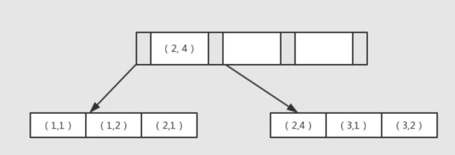


**回表操作**是通过辅助索引查询时，先查找二级索引树，得到对应的主键值，再到主键索引树上得到对应的行数据。

**索引对磁盘和内存的交互**

当计算机访问一个数据时，不仅会加载当前数据所在的数据页，还会将当前数据页相邻的数据页一同加载到内存，磁盘预读的长度一般为页的整数倍，从而有效降低磁盘的IO的次数。

mysql中磁盘的数据需要被交换到内存时，才完成一次sql交互。


* 扇区是硬盘的读写的基本单位，通常情况下每个扇区的大小是 512B
* 磁盘块文件系统读写数据的最小单位，相邻的扇区组合在一起形成一个块，一般是4KB
* 页是内存的最小存储单位，页的大小通常为磁盘块大小的 2^n 倍
* InnoDB页面的默认大小是16KB，是数倍个操作系统的数据页

随机IO就是数据并无物理连续的储存，这样的话查找数据就无法避免随机在磁盘上读取和写入数据。

一次磁盘访问由三个动作组成：

* 寻道：磁头移动定位到指定磁道
* 旋转：等待指定扇区从磁头下旋转经过
* 数据传输：数据在磁盘与内存之间的实际传输

所以对于储存引擎来说，降低随机IO是一个非常重要的问题

```bash
- 范围查询一定走索引嘛 > < >= <= between..and .. like..
	首先回答标题的问题，>,<,>=,<=不一定走索引，因为优化器会计算，符合条件的值的总和，与总数据量的比值，比值<=某个比例(0.3)，才会走索引。
	但我试下来都走索引了。。。
```


## 14.3 日志

事务日志`redo log`、归档日志`bin log`和回滚日志`undo log`

**redolog**

redolog是InnoDB储存引擎独有的，它让Mysql拥有了崩溃恢复的能力。比如Mysql宕机了，重启时，InnoDB储存引擎会使用redolog恢复数据，保证数据的完整性。


```bash
- 基本流程
	首先Mysql数据是以页为基本单位，当查询一条记录时，会把硬盘的一页数据加载出来，加载出来的数据为数据页，会放入Buffer Pool中，后续的`查询`会在Buffer Pool中找，没有命中再去硬盘中加载，减少了硬盘IO开销；`更新`数据时，如果Buffer Pool里存在更新的数据，就直接在Buffer Pool中更新，然后会将更新记录到redo log buffer中，接着刷盘到redo log文件中。

- 刷盘时机
	InnoDB引擎为redo log刷盘提供了innodb_flush_log_at_trx_commit 参数，包括三种策略：
	0：表示每次事务提交时不进行刷盘操作。如果Mysql挂了或宕机会有1s数据丢失
	1：表示每次事务提交时会调用`fsync`都将进行redo log刷盘操作（默认值）。只要事务成功，redo log记录就一定在硬盘里，即使事务执行期间mysql宕机了，由于事务没有提交，所以日志丢了也不会损失。
	2：表示每次事务提交时都只把 redo log buffer 内容写入 page cache。只要事务提交成功，就会存入文件系统缓存。仅仅mysql挂了不会有任何数据丢失，但是宕机可能会有1s数据丢失。
	- 后台刷盘条件
		1.InnoDB 存储引擎有一个后台线程，每隔1 秒，就会把 redo log buffer 中的内容write到文件系统缓存（page cache），然后调用 fsync 刷盘
		2.除了1s的轮询操作，还有当redo log buffer占用空间达到规定总容量的一半时，后台线程会主动刷盘

- 日志文件组
	硬盘上存储的 redo log 日志文件不只一个，而是以一个日志文件组的形式出现的，每个的redo日志文件大小都是一样的。
	如果一组为4个文件，则文件名为ib_logfile0、ib_logfile1、ib_logfile2、ib_logfile3
	写满再回写入下一个文件，并以循环写入的方式运行

- 问题：只要每次把修改后的数据页直接刷盘不就好了，还有 redo log 什么事？
	实际上数据页大小是16KB，可能就修改了几Byte数据，不仅刷盘比较耗时，而且没必要把整个数据页刷盘。而且数据页刷盘是随机写，因为一个数据页对应的位置可能在硬盘文件的随机位置，所以性能是很差。
	如果是写 redo log，一行记录可能就占几十 Byte，只包含表空间号、数据页号、磁盘文件偏移 量、更新值，再加上是顺序写，所以刷盘速度很快。
	
- 刷脏页到磁盘
	当内存数据页和磁盘数据页内容不一致的时候，这个数据页被称为“脏页”。一致时称之为“干净页”。不论脏页还是干净页，都存在内存里。
	触发时机：在redo log buffer写满时，mysql会停止所有的更新操作去刷盘。这时更新会阻塞；内存不足，需要新的内存页会淘汰一些数据页，空出内存，如果是脏页就会刷盘。
	影响性能：要淘汰的脏页太多，就会导致查询的响应事件明显变长；redo日志写满，整个系统不能在更新，更新数降为0。
	
- 	WAL策略
	为了避免发生数据丢失的问题，当前事务数据库系统(并非MYSQL独有)普遍采用了WAL(write ahead log，预写日志)策略，即事务提交时，先重做日志(redo log)，在修改页(先修改缓冲池，在刷新到磁盘)；当由于宕机而导致数据丢失时，通过redo log来完成数据恢复。

- CheckPoint技术
	所谓 CheckPoint 技术简单来说其实就是在 redo log file 中找到一个位置，将这个位置前的页都刷新到磁盘中去，这个位置就称为 CheckPoint（检查点）
	为了解决缓冲池不够用时，将脏页刷新到磁盘；redo log 不可用时，将脏页刷新到磁盘；缩短数据库的恢复时间
	缩短数据库的恢复时间：当数据库发生宕机时，只需对 Checkpoint 后的 redo log 进行恢复就行了
	缓冲池不够用：缓冲池不够用的意思就是缓冲池的空间无法存放新读取到的页，使用LRU算法。即最频繁使用的页在 LRU 列表（LRU List）的前端，最少使用的页在 LRU 列表的尾端，然后从尾部释放页，如果是脏页，就执行checkpoint，将脏页刷新到磁盘中去
	redo log 不可用时：redo log 不可用就是所有的 redo log file 都写满了。事实上，redo log中的数据并不是时时刻刻都有用的，checkpoint之前的数据都是已经刷盘操作了，所以是可以被覆盖重用的。
	有一种情况，因为redo log有4个文件，并且是循环写入的，而且redo log存在一个checkpoint(前面的都刷盘了)和write pos位置，没有刷盘的记录位置，当write pos追上checkpoint时，就表示 redo log file满了，此时不能在执行新的更新操作，得停下来先覆盖一些redo log，把checkpoint推进以下，即将脏页刷盘。
	
- Checkpoint有两种策略
	1.发生在数据库关闭时将所有的脏页都刷新回磁盘，这是默认的工作方式
	2.只刷新一部分脏页，而不是刷新所有的脏页回磁盘

- 有了bin log为什么还需要redo log(两者区别)
	1.binlog是用来归档的，成为归档日志，显然bin log是没有办法保证即使数据库发生异常重启，之前提交的事务都不会丢失的能力，所以称redo log为事务日志。
	2.bin log记录的是操作，redo log记录的是物理数据。
	3.bin log是追加写入，而redo log是循环写入。

- 问题：事务没有提交，redo log能不能持久化到磁盘呢？
	redo log具体落盘操作是这样的，在事务运行的过程中，MySQL 会先把日志写到 redolog buffer 中，等到符合一定的落盘策略，就会选择把 redolog buffer 中的数据写到 redolog 文件中。
	落盘策略：0每次事务提交都不刷盘操作，但是有一个后台线程每隔 1 秒就会将redo log buffer 中的内容写到文件系统缓存（page cache）中，然后调用 fsync 持久化到磁盘。所以此时没有提交的事务是有可能落盘的；1表示每次事务提交都fsync落盘，所以当另外一个事务B完成后，会将事务A未完成的redo log buffer落盘操作；第三种是redo log buffer 占用的空间达到 redolog buffer 大小一半时，后台线程会主动写盘，而此时也只是write到了page cache中。
```

**binlog**

redo log是物理日志，而binlog是逻辑日志，会记录所有涉及更新数据的逻辑操作，并且是顺序写记录内容是语句的原始逻辑，类似于“给 ID=2 这一行的 c 字段加 1”。是用来为数据库备份，主备，主主，主从都离不开binlog。**类似于记录更新的sql语句。**

```bash
- 日志格式
	1.statement ： 只是记录sql的原始语句
	2.row	： 会记录具体数据，包括了函数的返回值比如now()的当前值
	3.mixed	： 判断sql语句是否会引起数据不一致，从而在statement和row之间切换
	
- 问题
	同步数据时，sql语句中的update_time=now()会获得当前时间，如果在从数据库中执行，结果会和主数据库结果不一样，如何解决？
	为了解决需要将日志格式指定为row，此时不再是简单的sql语句了，还包括了具体数据。row格式记录内容看不到详细信息，需要通过mysqlbinlog工具解析出来。
	为了保证保证同步数据的一致性，通常情况下都是指定为row。

- 写入机制
	binlog的写入时机也非常简单，事务执行过程中，先把日志写到binlog cache，事务提交的时候，再把binlog cache写到binlog文件中。
	因为一个事务的binlog不能被拆开，所以系统会给每个线程分配一个块内存作为binlog cache。通过调整参数可以控制单个线程的binlog cache大小，如果储存内容超过会暂存磁盘。
	- write和fsync时机
	由参数sync_binlog控制，默认是0。
	0：表示每次提交事务都将binlog cache写入page cache，具体什么时候落盘由操作系统判断fync。虽然性能得到提升，但是机器宕机，page cache里面的 binglog 会丢失
	1:表示每次提交事务都会执行fsync，就如同binlog 日志刷盘流程一样。不会操作数据丢失
	N:每次提交事务都write，但累积N个事务后才fsync

- 两阶段提交
	redo log（重做日志）让InnoDB存储引擎拥有了崩溃恢复能力，binlog（归档日志）保证了MySQL集群架构的数据一致性。他们都是持久化的保证为侧重点不同。redolog是事务执行过程中可以不断写入，而binlog只有在提交事务时才写入，两者写入时机不同。
	1.如果两份日志之间的逻辑不一致，会出现什么问题？
		如果binlog写入异常，会导致主库的数据正常，而binlog有记录缺失，造成从库的数据存在和主库不一致的情况。
	2.为了解决这种两份日志之间的逻辑一致问题，提出了两阶段方案：
    	很简单，由于binlog是在事务提交后写入，为了保证binlog记录存在，所以需要用redolog来验证。将redo log的写入拆成了两个步骤prepare和commit。在事务期间，先记录redolog，不过状态设置为prepare，等事务提交，binlog记录完成，则将redolog状态设置为commit，至此结束。
    	此时，如果binlog写入异常，则mysql恢复数据时，发现redolog为prepare状态且对应的binlog日志不存在，则就会回滚改事务。
	如果redolog设置为commit阶段发生异常，是不会回滚事务的，因为通过事务id找到对应的binlog日志，所以MySQL认为是完整的，就会提交事务恢复数据。
```


* 上图的 write，是指把binlog cache写入到文件系统的 page cache，并没有把数据持久化到磁盘，所以速度比较快
* 上图的 fsync，才是将数据持久化到磁盘的操作

**undo log**

在 MySQL 中，恢复机制是通过 **回滚日志（undo log）** 实现的，所有事务进行的修改都会先记录到这个回滚日志中，然后再执行相关的操作。如果执行过程中遇到异常的话，我们直接利用 **回滚日志** 中的信息将数据回滚到修改之前的样子即可！

**总结**

MySQL InnoDB 引擎使用 **redo log(重做日志)** 保证事务的**持久性**，使用 **undo log(回滚日志)** 来保证事务的**原子性**。

## 14.4 锁

```bash
- 类型
	表级锁： 开销小，加锁快；不会出现死锁；锁定粒度大，发生锁冲突的概率最高,并发度最低
	行级锁： 开销大，加锁慢；会出现死锁；锁定粒度最小，发生锁冲突的概率最低,并发度也最高。
	页面锁： 开销和加锁时间界于表锁和行锁之间；会出现死锁；锁定粒度界于表锁和行锁之间，并发度一般
- 算法
	next KeyLocks锁，同时锁住记录(数据)，并且锁住记录前面的Gap
	Gap锁，不锁记录，仅仅记录前面的Gap
	Recordlock锁（锁数据，不锁Gap）
	所以其实 Next-KeyLocks=Gap锁+ Recordlock锁

- 死锁产生原因
	死锁的关键在于：两个(或以上)的Session加锁的顺序不一致
	解决死锁问题的关键就是：让不同的session加锁有次序
- 案例1
	需求：将投资的钱拆成几份随机分配给借款人
	起初想法：投资人投资后，将金额随机分为几份，然后随机从借款人表里面选几个，然后通过一条条select for update 去更新借款人表里面的余额等。
	起初操作：例如两个用户同时投资，A用户金额随机分为2份，分给借款人1，2；B用户金额随机分为2份，分给借款人2，1
	死锁原因：由于加锁的顺序不一样，死锁当然很快就出现了
	解决办法：对于这个问题的改进很简单，直接把所有分配到的借款人直接一次锁住就行了。Select * from xxx where id in (xx,xx,xx) for update。在in里面的列表值mysql是会自动从小到大排序，加锁也是一条条从小到大加的锁

- select......for update
	1.如果查询条件用了索引/主键，那么select ..... for update就会进行行锁
	2.如果是普通字段(没有索引/主键)，那么select ..... for update就会进行锁表
```

```bash
- 快照读和当前读
	快照读：读取快照中的数据，不需要进行加锁。MVCC 作用于读取已提交和可重复读（默认）这两个隔离级别，这俩隔离级别下的普通 select 操作就是快照读
	当前读：读取的是最新版本的数据, 并且对读取的记录加锁, 阻塞其他事务同时改动相同记录，避免出现安全问题	
```

## 14.5 坑

### count数据丢失

当某列存在NULL值时，使用count查询该列，就会出现数据“丢失”问题

```sql
select count(*),count(name) from person;
```

查询结构如下：

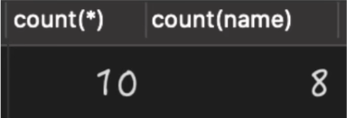

从上述结果可看出，当使用count(name)查询时，就丢失了两条值为null的数据

**解决方案**

如果某列存在NULL值，就是用count(*)或者count(id)进行数据统计

==**count(*)会统计值为NULL的行，而count(列名)不会统计此列为NULL值的行**==

## distinct数据丢失

当使用count(distinct col1,col2)查询时，如果其中一列为null，那么即使另一列有不同的值，那么查询的结果也会将数据丢失，如下SQL所示：

```sql
select count(distinct name,mobile) from person;
```

查询结果如下：为8。而原始数据中存在两条name为null的，而mobile是不一样的，这两条被忽略了

### select数据丢失

如果某列存在NULL值时，如果执行非等于查询(<>/!=)会导致NULL值的结果丢失。比如以下这个数据

```sql
select * from person where name <> 'java' order by id;
```

即使列中存在为NULL的数据，也查询不出来。

**解决方案**

```sql
select * from person where name <> 'java'  or isnull(name) order by id;
```

### 导致空指针异常

如果某列存在NULL值，可能会导致sum(column)的返回结果为NULL而非0，如果sum查询结果为NULL就可能导致程序执行时空指针异常(NPE)

表中原始数据如下：

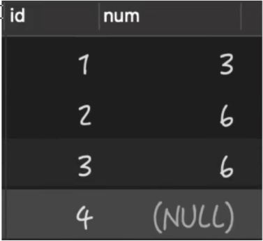

```sql
select sum(num) from goods where id > 4
```

查询结果为null，所以当查询结果为null而非0时就会导致空指针异常

**解决方案**

```sql
select ifnull(sum(num),0) from goods where id>4;
```

可以将查询结果为null的变为0返回

### 增加了查询难度

当某列中有NULL时，在进行NULL值或者非NULL值的查询难度就增加了

所谓的查询难度增加指的是当进行NULL值查询时，必须使用NULL值匹配的查询方法，比如ID NULL或者IS NOT NULL又或者IFNULL(column)这样的表达式进行查询，而传统的=、!=、<>等这些表达式就不能用了，就增加了查询难度

**查询为null的数据**

错误实例：

```sql
select * from person where name <> null   # 查出来为空，没有数据，连null都不是
select * from person where name != null
```

正确用法

```sql
select * from person where name is not null
```

**推荐用法：推荐使用ISNULL(column)来判断NULL值**

**NULL不影响索引**


# 15、优化

索引优化、sql语句优化、表优化

```bash
1.注意通配符中like的使用，百分号放在后面 √
2.避免在where子句中对字段进行函数或表达式操作 √
`3.在子查询当中，尽量用exists代替in 这个有待商榷`
select name from userinfo a where id in(select id from userinfo b)
可以改为
select name from userinfo a where exists(select 1 from userinfo b where id = a.id)
`4.避免在where子句使用or作为链接条件 这个有待商榷` 
select id from userinfo where name='xiaoming' or name='xiaowang'
可以改写为：
select id from userinfo where name = 'xiaoming' union all
select id from userinfo where name = 'xiaowang'
5. 避免在 where 子句中使用 != 或 <> 操作符  √
6. 避免在索引列上使用 IS NULL 和 IS NOT NULL √
7.不要用not in和not exists √
8.隐式类型转换、隐式编码转换 √
	select * from people where age = 18;
	如果数据库age字段是varchar类型的，mysql策略会将字符串转换为数字进行比较。函数作用于表字段，索引失效。所以应该修改字段类型且进行避免此类情况。
	编码转换字段编码不一样，一个是utf8一个是utf8mb4，所以会导致utf8变为utf8mb4进行比较，索引失效。
9.分页查询limit a,b
	可以想办法利用索引直接获取a，在偏移找出b个
	SELECT * FROM t WHERE a LIMIT b;
10.分组统计可以禁止排序
	如果查询包括GROUP BY，想要避免排序结果的消耗，则可以指定ORDER BY NULL禁止排序
	SELECT goods_id,count(*) FROM t GROUP BY goods_id ORDER BY NULL;
11.批量插入	
12.join连接时被驱动表对应on的字段要建立索引
	问题：select * from A join B on A.name = B.name; 执行过程性能差，原因？
	答案：连接查询性能差的原因可能是被驱动表 B(驱动表是主动发起查询的表) 没有建立 name 索引。由于没有添加索引，所以A中的每一行数据都会和B的每一行数据进行比较(具体步骤是一个嵌套查询。首先，遍历 A 表，一共需要扫描 100 行；然后，对这每一行都去 B 表中根据 name 字段进行搜索，满足 on 条件的，就作为结果集的一部分返回);如果B有索引的话，查询时就可以直接查询到，效率就会提高。如果A、B表都有100行，B没有索引就会判断100*100，B有索引就是100+100.
13.order by优化
	优化这条sql：select a, b, c from table where a = xxxx order by b
	通过建立联合索引，联合索引就是 a 是从小到大绝对有序的，如果 a 相同，再按 b 从小到大排序，这样就不需要排序了，直接避免了排序这个操作。

- in和exists
	in是先查询子查询，然后再将子查询结果和外表进行笛卡尔积。适用于外表大，内表小
	exsts是先查询外表，然后查询内表，判断外表数据是否在里面。适用于外表小，内表大
	但是测试下来in效率好像更好一点

- 性能优化
	1.选择合适的字段属性。比如邮政编码这个字段，用char或varchar都比较浪费空间，采用MEDIUMINT更节省空间
	2.尽量把字段都设置为not null。这样数据库不用去比较null值，另外储存null会需要额外的储存空间
	3.使用连接(join)来代替子查询(sub-query)。join不需要要在内存中创建临时表了。
	4.使用联合查询来替代多次查询不同表
	5.尽量避免子查询
```

# 16、规范

> 数据库命名规范

* 所有数据库对象名称必须使用小写字母并用下划线分割
* 临时库表必须以 tmp\_为前缀并以日期为后缀，备份表必须以 bak_为前缀并以日期 (时间戳) 为后缀

> 库设计规范

* 数据库和表统一采用utf-8。兼容性更好，统一字符集可以避免由于字符集转换产生的乱码，不同的字符集进行比较前需要进行转换会造成索引失效
* 所有表和字段都需要添加注释comment
* 尽量控制数据库数据量在500万以内。
* MySQL 限制每个表最多存储 4096 列，并且每一行数据的大小不能超过 65535 字节。且一个表的字段容量最多也只能保存65535字节。

> 表设计规范

* 优先使用储存需要最小的数据类型

  *  对于非负型的数据 (如自增 ID,整型 IP) 来说,要优先使用无符号整型来存储

    ```sql
    -- 设置无符号int 和 零填充
    ALTER TABLE `user`.`employee` 
    MODIFY COLUMN `id` int UNSIGNED ZEROFILL NOT NULL AUTO_INCREMENT FIRST;
    ```

* 避免使用Enum类型

  * **原因：**ENUM 类型的 ORDER BY 操作效率低，需要额外操作

* 尽可能所有列定义为NOT NULL

  * **原因：**索引 NULL 列需要额外的空间来保存，所以要占用更多的空间
  * 进行比较和计算时要对 NULL 值做特别的处理

* 使用TIMESTAMP(4个字节)和DATETIME(8个字节)来储存时间

  * **原因：**TIMESTAMP 存储的时间范围 1970-01-01 00:00:01 ~ 2038-01-19-03:14:07。和INT占用字节一样
  * 超出 TIMESTAMP 取值范围的使用 DATETIME 类型存储
  * 另外采用字符串储存时间的做法是不对的：无法用日期函数进行计算和比较、用字符串存储日期要占用更多的空间

* 同财务相关的金额类数据必须使用decimal类型

  * 非精准浮点：float,double；精准浮点：decimal
  * Decimal 类型为精准浮点数，在计算时不会丢失精度。可用于存储比 bigint 更大的整型数据

> 索引设计规范

* 限制单张表的索引数。建议单张表索引不超过5个
  * 索引并不是越多越好！索引可以提高效率同样可以降低效率。太多会增加了查询优化器生成执行计划的时间
  * 索引可以增加查询效率，但同样也会降低插入和更新的效率，甚至有些情况下会降低查询效率。
* 每一个InnoDB表必须有一个主键。
  * 不要使用 UUID,MD5,HASH,字符串列作为主键（无法保证数据的顺序增长）
  * 主键建议使用自增 ID 值
* 索引列建议
  * 频繁查询的字段和频繁作为where条件查询的字段,可以设置为单列索引或者联合索引
  * 包含在 ORDER BY、GROUP BY、DISTINCT 中的字段。尽量避免order by colulmn
  * 多表join的关联列
  * 被频繁更新的字段应该谨慎建立索引。**原因**：维护索引的成本不小的，如果一个字段不被经常查询，反而被经常修改，那么就更不应该在这种字段上建立索引了
* 对于频繁的查询优先考虑使用覆盖索引
  * **避免 Innodb 表进行索引的二次查询:** Innodb 是以聚集索引的顺序来存储的，对于 Innodb 来说，二级索引在叶子节点中所保存的是行的主键信息，如果是用二级索引查询数据的话，在查找到相应的键值后，还要通过主键进行二次查询才能获取我们真实所需要的数据。而在**覆盖索引**中，二级索引的键值中可以获取所有的数据，避免了对主键的二次查询 ，减少了 IO 操作，提升了查询效率。select 索引 from table where order by 索引 desc; 形成覆盖索引
  * **可以把随机 IO 变成顺序 IO 加快查询效率:** 由于覆盖索引是按键值的顺序存储的，对于 IO 密集型的范围查找来说，对比随机从磁盘读取每一行的数据 IO 要少的多，因此利用覆盖索引在访问时也可以把磁盘的随机读取的 IO 转变成索引查找的顺序 IO。

> 开发规范

* 禁止使用select * 必须使用select <字段> 

  * 避免消耗更多的 CPU 和 IO 以网络带宽资源

* where从句中禁止对列进行函数转换和计算，否则无法使用索引

  * ```bash
    - 不推荐
     	where date(create_time)='20190101'
    - 推荐
    	where create_time >= '20190101' and create_time < '20190102'
    ```

# 17、字符集

===**将字符对应的二进制的过程称之为“字符编码”，反之，二进制解码为字符的过程称之为“字符解码”**==

**Mysql字符编码有两套 UTF-8 编码实现**

* **`utf8`** ： `utf8`编码只支持`1-3`个字节 。 在 `utf8` 编码中，中文是占 3 个字节，其他数字、英文、符号占一个字节。但 emoji 符号占 4 个字节，一些较复杂的文字、繁体字也是 4 个字节。
* **`utf8mb4`** ： UTF-8 的完整实现，正版！最多支持使用 4 个字节表示字符，因此，可以用来存储 emoji 符号。

**扩展知识**

**字库表**：表示了此字符编码可以表示的字符范围

**编码字符集**：用一个编码值来表示一个字符在字库表中的位置

**字符编码**：将编码字符集和实际储存数值之间的转换关系

最初会有一个字符，然后有一个默认的编码方式A，然后按照默认的编码方式进行编码，得到多个字节(16进制，可能多个字节代表一个字符)，然后如果对方用acsii接收，会对这些字节(16进制)一个字节一个字节转换，并用自己编码的字库表进行解码，得到对应的字符(此时可能是乱码)，存下来；如果此时它将这个字符传出去，对方需要将这些字节转为对应的16进制字节接收，然后在用编码A解码就可以得到正确的字符。(字符(

**用什么编码就要用什么解码，中途用ascii编码做中转，信息不会丢失**

## 超集

字符集A,B ，B支持的所有字符A都支持,A 是B超集。

GBK字符集是GB2312字符集的超集，他们又都是ASCII字符集的超集

UTF-8字符集是ASCII的超集。

## 编码汇总

**分类：**

* 单字节编码：ASCII、ISO-8859-1
* 多字节编码：GB2312、GBK
* 宽字节(变长)编码:UTF-8,UTF-16

### 1、ASCII

ASCII将字母、数字和其它符号编号，并用**7比特**的二进制来表示这个字符，可以表示128个字符。扩充ASCII采用**8比特**进行编码，最多可以给256个字符。

### 2、ISO-8859-1

向下兼容ASCII，8位，其编码范围是0x00-0xFF，0x00-0x7F之间完全和ASCII一致，0x80-0x9F之间是控制字符，0xA0-0xFF之间是文字符号。表示256个字符。

### 3、GB2312

用**2字节**编码汉字,采用二位矩阵编码法。对每一行称为一个“区”，每一列称为一个“位”，区位码。

首先构造一个94行94列的方阵，对每一行称为一个“区”，每一列称为一个“位”，然后将所有字符依照下表的规律填写到方阵中。这样所有的字符在方阵中都有一个唯一的位置，这个位置可以用区号、位号合成表示，称为字符的区位码。

为避免同西文的存储发生冲突，GB2312字符在进行存储时，通过将原来的每个[字节](https://baike.baidu.com/item/字节)第8bit设置为1同西文加以区别，如果第8bit为0，则表示西文字符，否则表示GB2312中的字符。实际存储时，采用了将区位码的每个[字节](https://baike.baidu.com/item/字节)分别加上A0H（**160**）的方法例如汉字‘啊’的区位码为1601，其存储码为B0A1H，其转换过程为：


### 4、GBK

是GB2312的扩展，采用变长编码，采用**一字节**和双字节编码。

00–7F范围内是一位，和[ASCII](https://baike.baidu.com/item/ASCII)保持一致。之后的双[字节](https://baike.baidu.com/item/字节)中，前一字节是双字节的第一位。总体上说第一[字节](https://baike.baidu.com/item/字节)的范围是81–FE（也就是不含80和FF），第二字节的一部分领域在40–7E，其他领域在80–FE。

### 5、Unicode

包括了所有的符号作为字符集，采用4字节或2字节存储一个符号。Unicode固然统一了编码方式，但是它的效率不高，比如UCS-4(Unicode的标准之一)规定用4个[字节](https://baike.baidu.com/item/字节)[存储](https://baike.baidu.com/item/存储)一个符号，那么每个英文字母前都必然有三个字节是0，这对存储和传输来说都很耗资源。使用2字节的Unicode版本UCS-2,使用4字节的Unicode版本是UCS-4

### 6、UTF-8

变长编码，采用**1字节**到**4字节**变长编码。

* 如果一个字节的第一位为0，那么代表当前字节为单字节字符，占用一个字节控件，0后面的7bit代表Unicode序号(编码字符集)。
* 如果一个字节是以110开头，那么代表当前字符为双字节字符。占用2个字节的空间。110之后的所有部分（5个bit）加上后一个字节的除10外的部分（6个bit）代表在Unicode中的序号。且第二个字节以10开头
* 如果一个字节以1110开头，那么代表当前字符为三字节字符，占用3个字节的空间。1110之后的所有部分（4个bit）加上后两个字节的除10外的部分（12个bit）代表在Unicode中的序号。且第二、第三个字节以10开头
* 如果一个字节以11110开头，那么代表当前字符为四字节字符，占用4个字节的空间。11110之后的所有部分（3个bit）加上后三个字节的除10外的部分（18个bit）代表在Unicode中的序号。
* 如果一个字节以10开头，那么代表当前字节为多字节字符的第二个字节。10之后的所有部分（6个bit）和之前的部分一同组成在Unicode中的序号。

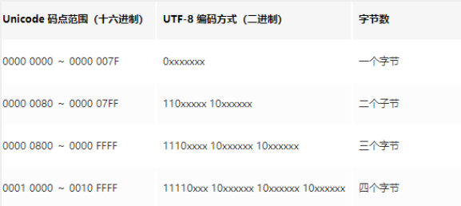

细心的读者不难从以上的简单介绍中得出以下规律：

* 4个字节的UTF-8十六进制编码一定是以`F`开头的

- 3个字节的UTF-8十六进制编码一定是以`E`开头的
- 2个字节的UTF-8十六进制编码一定是以`C`或`D`开头的
- 1个字节的UTF-8十六进制编码一定是以比`8`小的数字开头的

### 7、UTF-16

变长编码。2或4字节编码

### 8、UTF-32

定长编码。4字节编码

### 9、BASE64

常用于电子邮箱。有些电子邮箱不支持非英文字母的内容(认为只有美国会使用电子邮件?),因为一个英文字母使用ASCII储存，占用储存器一个字节，第一位为0，所以会认为所有第一位为1的字节都是错误的，会将其变为0，造成乱码。base64可以用来由其他编码储存的符号转换成ASCII码传输。

## 提问?

**字库表和编码字符集必不可少，既然储存内容也是编码字符集，为什么还要多此一举通过字符编码将序号转换为另一种储存格式呢？**

统一字库表是为了能够涵盖世界所有的字符，但实际使用过程中真正使用到的字符相对于整个字库表来说比例是非常低的。例如中文地区几乎不需要日语字符，而英语国家用ASCII就已足够。如果每个字符都用字库表的序号来储存，每个字符就需要4个字节(Unicode)，这样就给原本只用ASCII编码的国家造成了额外成本。直接一些，同样一块硬盘，如果用ASCII可以存2000篇文章，而用4字节的Unicode只能存500篇。

# 问题

## 1.什么是关系型数据库

关系型数据库就是一种建立在关系模型的基础上的数据库，其以行和列的形式储存数据。关系模型表明了数据库中所存储的数据之间的联系（一对一、一对多、多对多）。简单来说关系模型就是二维表格模型。

**优势**

* 易于理解：关系型二维表很贴近现实世界，容易理解
* 支持复杂查询：利用sql语句方便的在一个表以及多个表之间做很复杂的数据查询
* 支持事务：可靠的处理事务保证事务完整性，使得对于安全性很高的数据访问要求得以实现

什么是sql？结构化查询语言 (Structured Query Language) 简称SQL，是一种面向数据库的程序设计语言，用于对储存数据的查询、更新和管理。

## 2.为什么Mysql没有使用Hash表作为索引的数据结构

1.**Hash冲突问题**：因为Hash表存hash冲突问题，一个好的哈希函数应该“均匀地”将数据分布在整个可能的哈希值集合中

2.**Hash 索引不支持顺序和范围查询(Hash 索引不支持顺序和范围查询是它最大的缺点**：Hash索引无法通过排序或者进行范围查询。

## 3.一条SQL语句在MySQL中如何被执行


* **连接器**：身份认证和权限相关
* **查询缓存**：执行查询语句的时候，会先查询缓存(mysql8.0版本移除)
* **分析器**：没有命中缓存的话，SQL 语句就会经过分析器，分析器说白了就是要先看你的 SQL 语句要干嘛，再检查你的 SQL 语句语法是否正确。
* **优化器**：按照 MySQL 认为最优的方案去执行
* **执行器**：检查权限，通过后调用储存引擎的接口，返回接口执行的结果

**Server层：连接器、查询缓存、分析器、优化器、执行器**

**储存引擎：主要负责数据的存储和读取，支持InnoDB、MyISAM**

其实sql可以分为两种，一种是查询一种是更新(增删改)。

```bash
- 查询
select * from tb_student  A where A.age='18' and A.name=' 张三 ';

1.先检查该语句是否有权限，如果没有权限，直接返回错误信息，如果有权限，在 MySQL8.0 版本以前，会先查询缓存，以这条 sql 语句为 key 在内存中查询是否有结果，如果有直接缓存，如果没有，执行下一步
2.通过分析器进行词法分析(提取 sql 语句的关键元素)、预处理，生成合法的解析树。比如提取上面这个语句是查询 select，提取需要查询的表名为tb_student，需要查询所有的列，查询条件是这个表的 id='1'。然后判断这个 sql 语句是否有语法错误，比如关键词是否正确等等，如果检查没问题就执行下一步。
3.再由优化器生成对应的执行计划。上面的 sql 语句，可以有两种执行方案。先查学生在判断年龄或者先判断年龄在查学生
4.会调用数据库引擎接口，返回引擎的执行结果

- 更新
update tb_student A set A.age='19' where A.name=' 张三 ';


1.首先检查权限，执行器根据MYSQL的执行计划去查询数据，先从缓冲池中查询数据，如果没有会去磁盘上查询，如果查询到了就会将读取放入缓冲池中，然后在缓存池中更新
2.在更新之前，会将之前的值写入undo log日志文件
3.更新动作实在Buffer Pool中完成的，同时会将更新后的数据添加到redo log中，此时的redo log为prepare阶段
4.然后告知执行器执行完成了，随时可以提交事务，然后将本次操作记录写入binlog中，将binlog文件名字和更新内容在binlog位置记录到redo log中，同时将redolog添加commit标记。另外根据落盘策略，进行redo log buffer写入redo log文件操作。实现数据的落盘更新。
`注意：更新的buffer pool中的数据，所以此时缓存和数据库中的数据不一致，认为是脏数据，后台线程会完成处理`
```

## 4.为什么DBA建议表中一定有主键，而且推荐使用整形自增

1.查询速度。拿InnoDB举例，表里面必须有一个B+树来组织索引，维护表的所有数据，形成.ibd文件。

2.ROW_ID有限。如果InnoDB创建了一个没有主键的表，那么他可能没有任何索引，则Mysql会选择具有唯一性且不为null的第一个字段创建聚集索引。如果没有唯一性索引字段，InnoDB就会隐式创建一个6字节的整形列ROW_ID，而所有没有主键的表都会使用这个ROW_ID，所以为了避免ROW_ID用完，建议表中一定要单独建立一个主键字段。

3.整形好处。首先整形占用空间比较小，而且查询比字符串更快。如果使用自增的整形，在插入时也会提高效率。不使用自增，可能时不时会往 `B+tree` 的中间某一位置插入元素，当这个节点位置放满了的时候，节点就要进行分裂操作（效率低）再去维护，有可能树还要进行平衡，又是一个耗性能的操作。都用自增就会永远都往后面插入元素，这样索引节点分裂的概率就会小很多。

**如果自增ID上限用完了怎么办**

分为两种情况：

* 如果设置了主键，那么会报错主键冲突
* 如果没有设置主键，数据库则会帮我们自动生成一个全局的row_id.。用完了之后新数据会覆盖老数据。

解决方案：尽可能主键用bigint类型。int 上限时21亿，row_id是6字节。bigint是8字节。

## 5.为什么加了索引，为何却不生效

1. 索引列是表示式的一部分，或是函数的一部分
2. 隐式类型转换，int和字符串转换
3. 隐式编码转换。where后的索引字段编码方式不同，一个是utf8，一个是utf8mb4，, utf8mb4 是 utf8 的超集，所以会自动将 utf8 转成 utf8mb4。**where a.\`a\` = b.\`b\`**

## 6.SQL语句执行慢的原因

写操作

* 当 redo log 写满时就会进行刷脏页，此时写操作也会终止，那么 SQL 执行自然就会变慢；或者需要增加内存中的数据页时，需要淘汰一些脏页，这是要进行fsync刷盘操作
* 遇到所要修改的数据行或表加了锁时，需要等待锁释放后才能进行后续操作，SQL 执行也会变慢。

读操作

* 读操作慢很常见的一个原因是未命中索引从而导致全表扫描，可以通过 explain 方式对 SQL 语句进行分析。
* 另一种原因是在读操作时，要读入的数据页不在内存中，需要通过淘汰脏页才能申请新的数据页从而导致执行变慢

```bash
- 刷脏页到磁盘
	当内存数据页和磁盘数据页内容不一致的时候，这个数据页被称为“脏页”。一致时称之为“干净页”。不论脏页还是干净页，都存在内存里。
	触发时机：在redo log写满时，mysql会停止所有的更新操作去刷盘。这时更新会阻塞；内存不足，需要新的内存页会淘汰一些数据页，空出内存，如果是脏页就会刷盘。
	影响性能：要淘汰的脏页太多，就会导致查询的响应事件明显变长；redo日志写满，整个系统不能在更新，更新数降为0。
```

## 7.如何防止sql注入

**sql注入的原因**是程序员只是对sql语句的简单拼接，未对变量参数进行验证。

* **代码层防止sql注入攻击的最佳方案就是sql预编译**

  ```bash
  select id,course_id,student_id,status from course where student_id = ?
  ```

* **规定数据长度，能在一定程度上防止sql注入**

* **过滤参数中含有的一些数据库关键词**

## 8.MySQL数据库cpu飙升的话，要怎么处理呢？

1. 使用top命令观察确定是否是mysql导致的还是其他原因
2. 找出消耗资源高的sql，看看执行计划是否准确， 索引是否缺失，数据量是否太大
3. 如果每个sql消耗资源不多，但是突然之间有大量的 session 连进来导致 cpu 飙升，分析为何连接数突然激增，在作出响应调整，比如限制连接数等。

## 9.一般的分库分表策略有哪些？

有时候可以尽量从加从库读写分离、优化sql、优化索引、复用连接等方式优化，不必分库分表。

**垂直拆分**

* 把不同的业务数据拆分到各自的数据库中独立维护。将业务数据解耦，各管一事，满足微服务的效能最大化

**水平拆分**

* 分为多个表来储存同类型数据。设置路由规则。

**如何划分**

* hash取模：通过对唯一编号hash取模(%n)后得到n个表中某一个表。
  * 优点：经过hash取模后，分到表中的数据是均衡的，不会出现资源倾斜问题
  * 缺点：如果数据暴增没有再我们预估范围内，就涉及到数据迁移、重新hash、修改路由等
* range划分：64个表，每个表存100w数据，第一个表存0-100w编号之间的，第二表存100-200w之间，以此类推
  * 不需要数据迁移，后续数据即时增长很多也没问题
  * 数据倾斜严重，比如上图，很长一段时间，都会只用到1个库，几个表
* 一致性hash：同样是hash取值，经过处理得到一个数值。然后在对数值在某个区域内分配到某个表中。简单来说就是对range划分前进行了hash操作，增加了有序数据的随机性，减少了数据倾斜现象。
  * 更加均匀，并且在需要扩容时，数据迁移的量级更小
  * 路由算法要复杂

**拆分带来的新问题**

* **全局唯一主键ID**：分布式ID生成问题。比如订单号、UID等等。可以设置ID格式，利用时间戳，业务ID、序列号等组成。

  .webp)

  

* **数据迁移**

  * 停机发布：好处是简单，风险小；缺点是业务有损。
  * 平滑迁移：平滑迁移就像是高速上换轮胎，要非常小心谨慎，也更复杂。从某一点开始设置checkpoint , 然后执行数据双写，最后修改路由，删除旧数据，完成扩容。
    * 阶段一：数据双写，以老数据为准，通过对账补平差异
    * 阶段二：导入历史数据，继续双写，读切换到新数据
    * 阶段三：停掉双写，删除老数据完成迁移

* **事务问题**：之前一个本地事务就可以办到，现在数据分为多个库，那么本地事务无法完成。

  * 分布式事务：
  * 程序+业务逻辑：

* **查询问题**：之前一个库就能搞定的join，count等各种联合查询，将不复存在，老老实实调接口在代码层面实现吧

  * 如何分页查询
    * C端查询：客户端查询。首先查询可以根据订单号然后一致性hash得到数据所在的表。如果客户端通过用户ID怎么查。那么最简单的方法就是订单号ID中包含用户ID，这样按照用户ID进行分表，这样查询时可以根据用户ID得到所在的表中。
    * B端查询：需要根据卖家ID查询。此时的方法有
      * 数据双写：就是C端和B端各保留一份，C端用单号或者用户ID进行分库，B端用商家ID进行分库，都进行写数据。问题是数据双写会有稍微的延迟问题，但是问题不大，因为商家延迟个1、2s获得订单没有太大关系。
      * 利用ES，ES的查询数量级很大，完全可以胜任。

## 10.什么是ER图

ER图也称实体关系图，提供了表示实体类型、属性和联系的方法，是表示概念关系模型的一种方式。表示了实体关系之间是一对一还是一对多还是多对多的关系。

# 美团一面，四种事务隔离级别分别是怎么实现的？

## 引子

众所周知，事务就是要保证一组数据库操作，要么全部成功，要么全部失败。提到事务，你肯定立马脱口而出 ACID（原子性 Atomicity、一致性 Consistency、隔离性 Isolation、持久性 Durability）

本文的主旨，就是其中的 Isolation，也就是 “隔离性”。

当数据库上有多个事务同时执行的时候，就可能出现一些并发一致性问题：丢失更新（Last To Modify）、脏读（Dirty Read）、不可重复读（Unrepeatable Read）、幻读（Phantom Read）

那么为了解决这些问题，就有了 “隔离级别” 的概念。

万事终归有利有弊，隔离级别越高，隔离得越严实，并发一致性问题就越少，那么相应的数据库付出的性能代价也就越大。所以，很多时候，我们都要在这二者之间寻找一个平衡点。

## 四种并发一致性问题

### 丢失更新 Last To Modify

丢失更新非常好理解，简单来说其就是**一个事务的更新操作会被另一个事务的更新操作所覆盖**，从而导致数据的不一致。

举个例子：

1）事务 T1 将行记录 r 更新为 v1，但是事务 T1 并未提交

2）与此同时，事务 T2 将行记录 r 更新为 v2，事务 T2 未提交

3）事务 T1 提交

4）事务 T2 提交

如下图所示，显然，事务 T1 丢失了自己的修改。

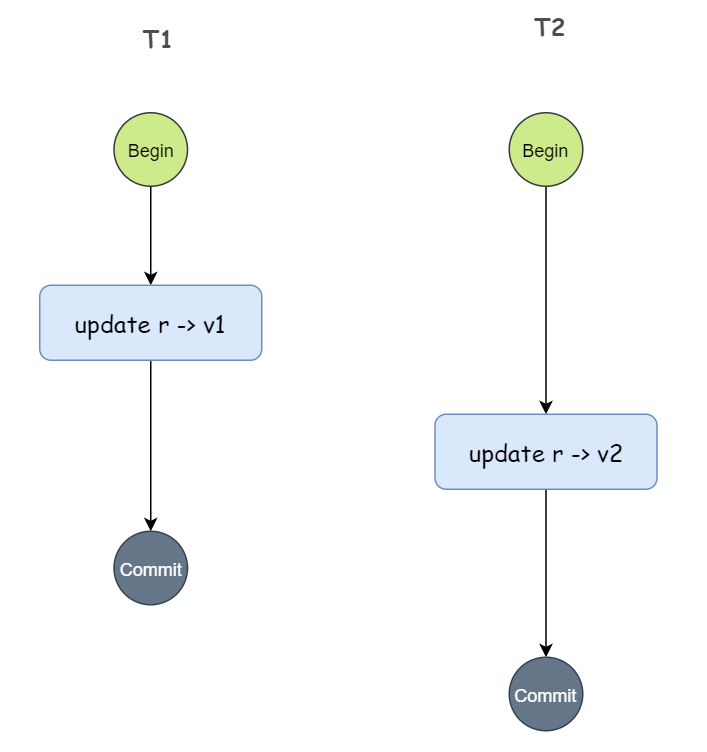

但是，事实上，这种情况准确来讲并不会发生。

因为我们说过对于行进行更新操作的时候，需要对行或其他粗粒度级别的对象加锁，因此当事务 T1 修改行 r 但是没提交的时候，事务 T2 对行 r 进行更新操作的时候是会被阻塞住的，直到事务 T1 提交释放锁。

所以，**从数据库层面来讲，数据库本身是可以帮助我们阻止丢失更新问题的发生的**。

不过，在真实的开发环境中，我们还经常会遇到**逻辑意义上的丢失更新**。举个例子：

1）事务 T1 查询一行数据 r，放入本地内存，并显示给一个用户 User1

2）事务 T2 也查询该行数据，并将取得的数据显示给另一个用户 User2

3）User1 修改了行记录 r 为 v1，更新数据库并提交

4）User2 修改了行记录 r 为 v2，更新数据库并提交

显然，最终这行记录的值是 v2，User1 的更新操作被 User2 覆盖掉了，丢失了他的修改。

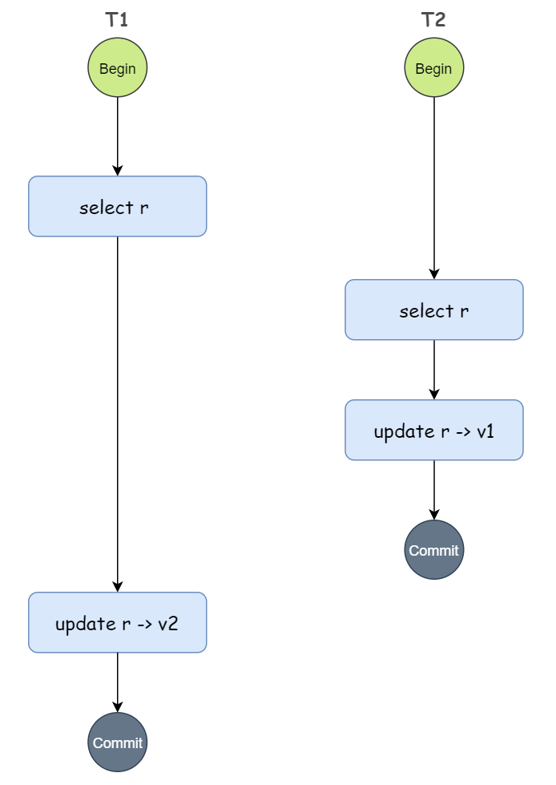

可能还是云里雾里，我来举个**更现实点的例子**吧，一个部门共同查看一个在线文档，员工 A 发现自己的性别信息有误，于是将其从 “女” 改成了 “男”，就在这时，HR 也发现了员工 A 的部门信息有误，于是将其从 ”测试“ 改成了 ”开发“，然后，员工 A 和 HR 同时点了提交，但是 HR 的网络稍微慢一点，再次刷新，员工 A 就会发现，擦，我的性别怎么还是 ”女“？

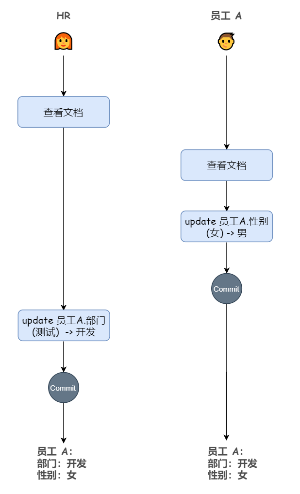

### 脏读 Dirty Read

所谓脏读，就是说**一个事务读到了另外一个事务中的 "脏数据"，脏数据就是指事务未提交的数据**

如下图所示，在事务并没有提交的前提下，事务 T1 中的两次 SELECT 操作取得了不同的结果：

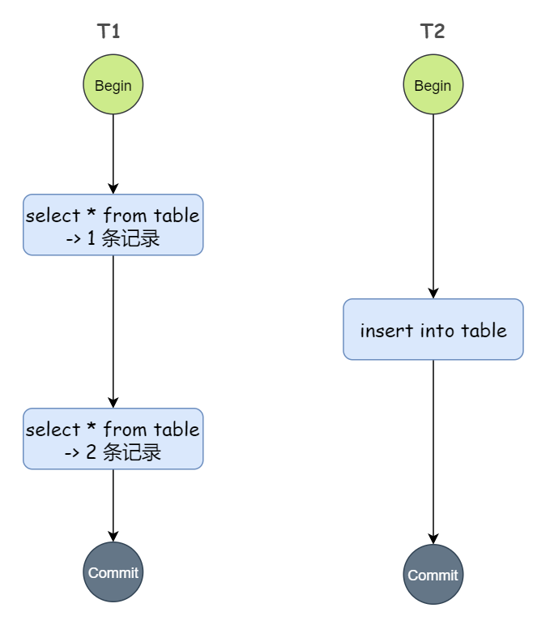

注意，如果想要再现脏读这种情况，需要把隔离级别调整在 Read UnCommitted（读取未提交）。所以事实上脏读这种情况基本不会发生，因为现在大部分数据库的隔离级别都至少设置成 READ COMMITTED

### 不可重复读 Unrepeatableread

不可重复读是指在一个事务内多次读取同一数据集合。在这个事务还没有结束时，另外一个事务也访问该同一数据集合，并做了一些修改操作。因此，**在第一个事务中的两次读数据之间，由于第二个事务的修改，那么第一个事务两次读到的数据可能是不一样的**。

举个例子：事务 T1 读取一行数据 r，T2 将该行数据修改成了 v1。如果 T1 再次读取这行数据，此时读取的结果和第一次读取的结果是不同的

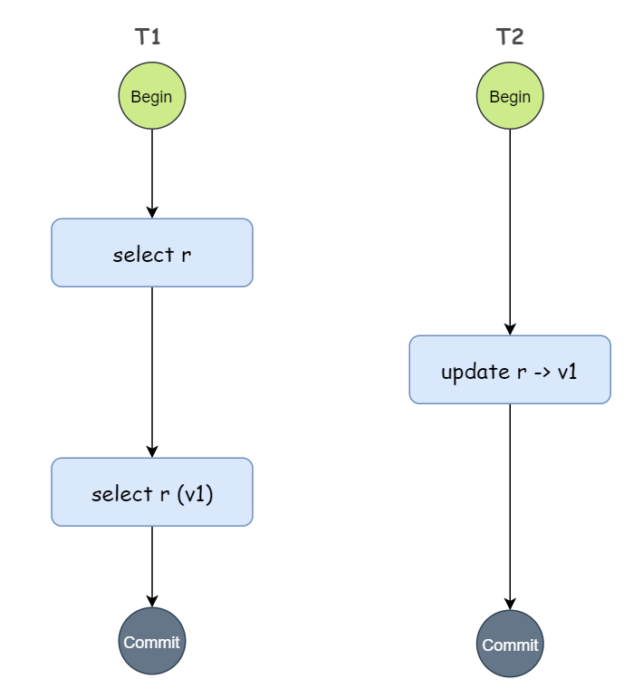

不可重复读和脏读的区别是：脏读是读到未提交的数据，而不可重复读读到的却是已经提交的数据，但是其违反了事务一致性的要求。

### 幻读 Phantom Read

幻读本质上是属于不可重复读的一种情况，区别在于，不可重复读主要是针对数据的更新（即事务的两次读取结果值不一样），而幻读主要是针对数据的增加或减少（即事务的两次读取结果返回的数量不一样）

举个例子：事务 T1 读取某个范围的数据，事务 T2 在这个范围内插入了一些新的数据，然后 T1 再次读取这个范围的数据，**此时读取的结果比第一次读取的结果返回的记录数要多**

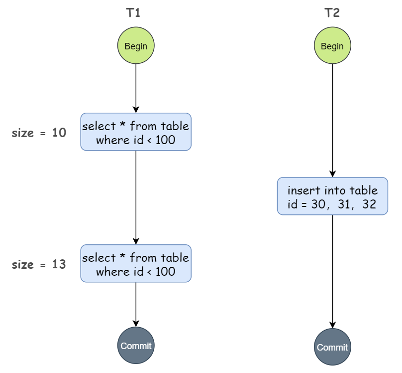

## 四种事务隔离级别

SQL 标准定义了四种越来越严格的事务隔离级别，用来解决我们上述所说的四种事务的并发一致性问题。

1）**READ UNCOMMITTED** 读取未提交：一个事务还没提交时，它做的变更就能被别的事务看到

上面提到过，数据库本身其实已经具备阻止丢失更新的能力，也就是说，即使是最低的隔离级别也可以阻止丢失更新问题。所以：

- 这个隔离级别可以阻止 丢失更新

2）**READ COMMITTED** 读取已提交：一个事务提交之后，它做的变更才会被其他事务看到。换句话说，一个事务所做的修改在提交之前对其它事务是不可见的。

- 这个隔离级别可以阻止 丢失更新 + 脏读

3）**REPEATABLE READ** 可重复读（InnoDB 存储引擎默认的隔离级别）：保证在同一个事务中多次读取同一数据的结果是一样的。当然了，在可重复读隔离级别下，未提交变更对其他事务也是不可见的。

> 书中就是这么解释的，好像也挺通俗易懂的，那为了方便下面的行文，我再给一个更简单的解释：
>
> 可重复读就是：一个事务执行过程中看到的数据，总是跟这个事务在启动时看到的数据是一致的。或者简单来说，事务在执行期间看到的数据前后是一致的。

- 这个隔离级别可以阻止 丢失更新 + 脏读 + 不可重复读

4）**SERIALIZABL** 可串行化：顾名思义，强制事务串行执行，对于同一行记录，“写” 会加 “写锁”，“读” 会加 “读锁”，当出现读写锁冲突的时候，后访问的事务必须等前一个事务执行完成，才能继续执行。这样多个事务互不干扰，不会出现并发一致性问题

- 这个隔离级别可以阻止 丢失更新 + 脏读 + 不可重复读 + 幻读

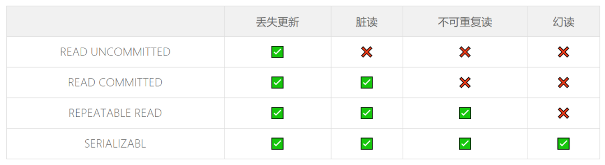

可以看到四种隔离级别能阻止的并发一致性问题越来越多，但并不代表越高的隔离级别就越好，因为事务隔离级别越高，数据库付出的性能代价也就相应地越大。

> 另外，多提一嘴，InnoDB 存储引擎在 REPEATABLE READ 可重复读的隔离级别下，使用 Next-Key Lock 锁的算法避免了幻读的产生, 具体可以看这篇文章 [幻读为什么会被 MySQL 单独拎出来解决？](https://mp.weixin.qq.com/s?__biz=MzI0NDc3ODE5OQ==&mid=2247489196&idx=1&sn=50ace2f83a16d898108e01039468cf40&scene=21#wechat_redirect)。也就是说，InnoDB 存储引擎在其默认的 REPEATABLE READ 事务隔离级别下就已经能完全保证事务的隔离性要求了，即达到了 SQL 标准的 SERIALIZABLE 隔离级别。

举个例子，看下图，我们来看看在不同的隔离级别下，事务 A 对同一个字段的查询会得到哪些不同的返回结果：

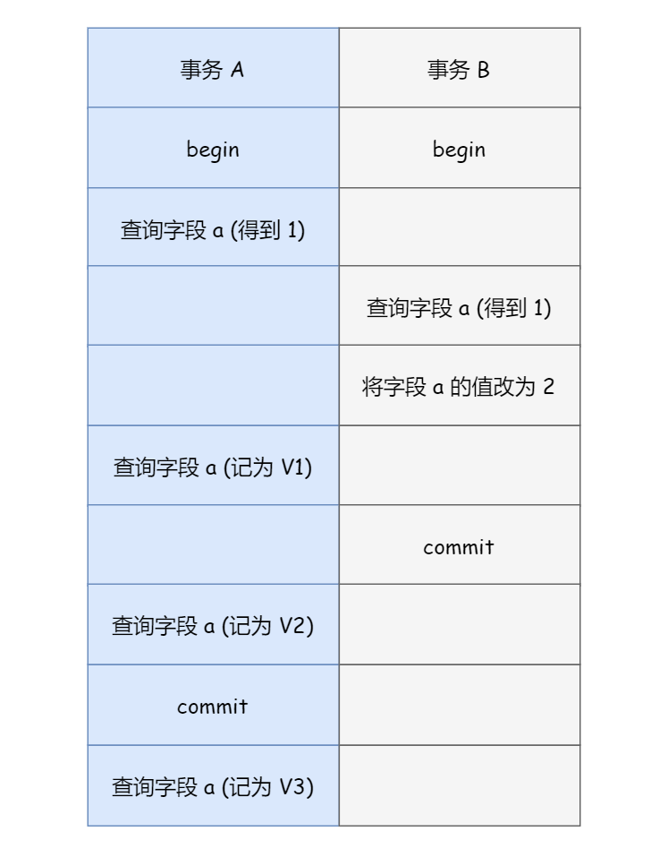image-20211209104207832

1）READ UNCOMMITTED 读取未提交：V1 V2、V3 都是 2。事务 B 虽然还没有提交，但是修改的结果结果已经被 A 看到了

2）READ COMMITTED 读取已提交：V1 是 1，然后事务 B 对字段的修改提交了，能被 A 看到，所以，V2 V3 的值都是 2

3）REPEATABLE READ 可重复读：V1 V2 是 1，V3 是 2。回想下这句话你就懂了：一个事务执行过程中看到的数据，总是跟这个事务在启动时看到的数据是一致的

4）SERIALIZABL 可串行化：事务 B 执行 “将字段 a 的值改为 2” 的时候会被锁住。直到事务 A 提交后，事务 B 才可以继续执行。所以从事务 A 的角度看， V1 V2 的值是 1，V3 的值是在事务 2 提交后的，所以 V3 是 2。

## 四种隔离级别的具体实现

读取未提交和可串行化的实现没什么好说的，一个是啥也不干，一个是直接无脑加锁避开并行化 让你啥也干不成。

重头戏就是读取已提交和可重复读是如何实现的。这就是我们要说的 MVCC 了，也就是面试中的超级高频题。

我先来简单说一下，对于这两个隔离级别，**数据库会为每个事务创建一个视图 (ReadView)，访问的时候以视图的逻辑结果为准**：

- 在 “读取已提交” 隔离级别下，这个视图是在每个 SQL 语句开始执行的时候创建的
- 在 “可重复读” 隔离级别下，这个视图是在事务启动时就创建的，整个事务存在期间都用这个视图（这就是为什么说在可重复读隔离级别下，一个事务执行过程中看到的数据，总是跟这个事务在启动时看到的数据是一致的）

那么问题了就来了，**已经执行了这么多的操作，事务该如何重新回到之前视图记录的状态**？**数据库会通过某种手段记录这之间执行的种种操作吗**？

这就是 undo log 版本链做的事 👇

### undo log 版本链

在 MySQL 中，每条记录在更新的时候都会同时记录一条回滚操作（也就是 undo log），当前记录上的最新值，通过回滚操作，都可以得到前一个状态的值。

简单理解，**undo log 就是每次操作的反向操作**，比如比如当前事务执行了一个插入 id = 100 的记录的操作，那么 undo log 中存储的就是删除 id = 100 的记录的操作。

也就是说，B+ 索引树上对应的记录只会有一个最新版本，但是 InnoDB 可以**根据 undo log 得到数据的历史版本**。**同一条记录在系统中可以存在多个版本**，就是数据库的**多版本并发控制**（MVCC）

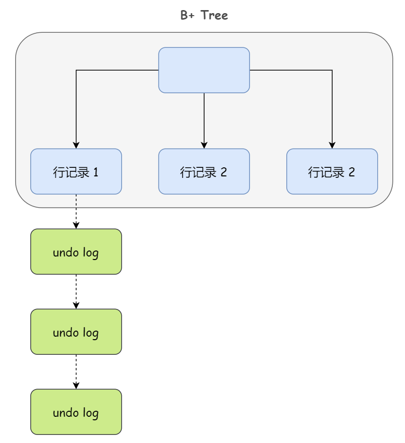

那么，还有个问题，undo log 是如何和某条行记录产生联系的呢？换句话说，我怎么能通过这条行记录找到它拥有的 undo log 呢？

具体来说，**InnoDB 存储引擎中每条行记录其实都拥有两个隐藏的字段：`trx_id` 和 `roll_pointer`**：

- `trx_id` 就是最近更新这条行记录的事务 ID
- `roll_pointer` 就是指向之前生成的 undo log 的指针

掏出我们的 user 表，来举个例子，假设 id = 100 的事务 A 插入一条行记录（id = 1, username = "Jack", age = 18），那么，这行记录的两个隐藏字段 `trx_id = 100` 和 `roll_pointer` 指向一个空的 undo log，因为在这之前并没有事务操作 id = 1 的这行记录。如图所示：

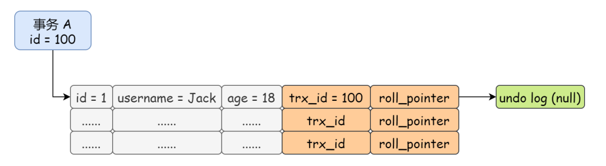

然后，id = 200 的事务 B 修改了这条行记录，把 age 从 18 修改成了 20，于是，这条行记录的 `trx_id` 就变成了 200，`rooll_pointer` 就指向事务 A 生成的 undo log ：

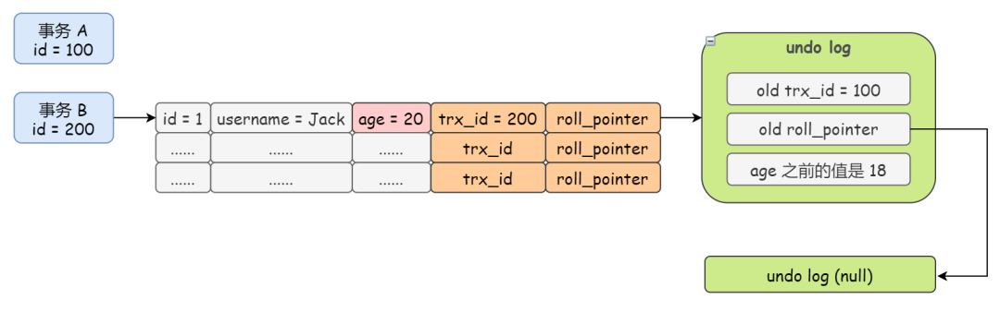

接着，id = 300 的事务 C 再次修改了这条行记录，把 age 从 20 修改成了 30，如下图：

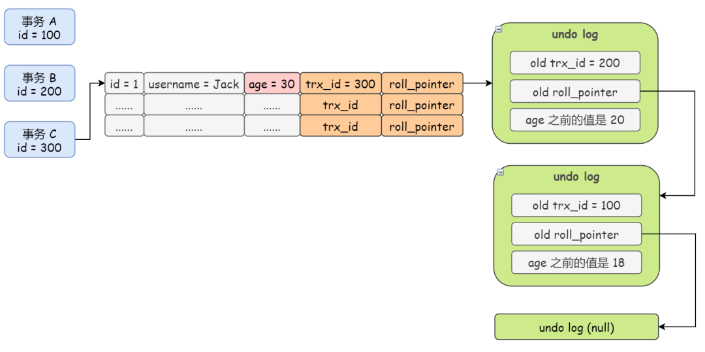

可以看到，每次修改行记录都会更新 trx_id 和 roll_pointer 这两个隐藏字段，之前的多个数据快照对应的 undo log 会通过 roll_pointer 指针串联起来，从而形成一个**版本链**。


那么问题又来了，一个记录会被一堆事务进行修改，一个记录上会存在许许多多的 undo log，**那么对于其中某一个事务来说，它能看见哪些 undo log**？或者说，**对于其中某一个事务来说，它能够根据哪些 undo log 执行回滚操作**？

让我们来详细解释一下这个视图（ReadView）机制 👇

### ReadView 机制

**ReadView 机制就是用来判断当前事务能够看见哪些版本的**，一个 ReadView 主要包含如下几个部分：

- `m_ids`：生成 ReadView 时有哪些事务在执行但是还没提交的（称为 “**活跃事务**”），这些活跃事务的 id 就存在这个字段里
- `min_trx_id`：m_ids 里最小的值
- `max_trx_id`：生成 ReadView 时 InnoDB 将分配给下一个事务的 ID 的值（事务 ID 是递增分配的，越后面申请的事务 ID 越大）
- `creator_trx_id`：当前创建 ReadView 事务的 ID

接下来，再掏出 user 表，通过一个例子来理解下 ReaView 机制是如何做到判断当前事务能够看见哪些版本的：

假设表中已经被之前的事务 A（id = 100）插入了一条行记录（id = 1, username = "Jack", age = 18），如图所示：


接下来，有两个事务 B（id = 200） 和 C（id = 300）过来**并发执行**，事务 B 想要更新（update）这行 id = 1 的记录，而事务 C（select）想要查询这行数据，这两个事务都执行了相应的操作但是还没有进行提交：

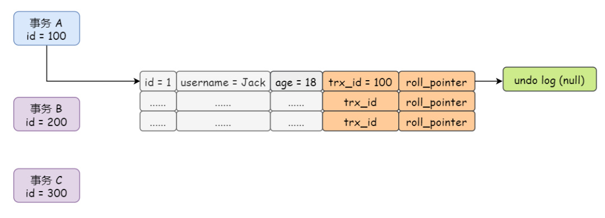

如果现在事务 B 开启了一个 ReadView，在这个 ReadView 里面：

- `m_ids` 就包含了当前的活跃事务的 id，即事务 B 和事务 C 这两个 id，200 和 300
- `min_trx_id` 就是 200
- `max_trx_id` 是下一个能够分配的事务的 id，那就是 301
- `creator_trx_id` 是当前创建 ReadView 事务 B 的 id 200

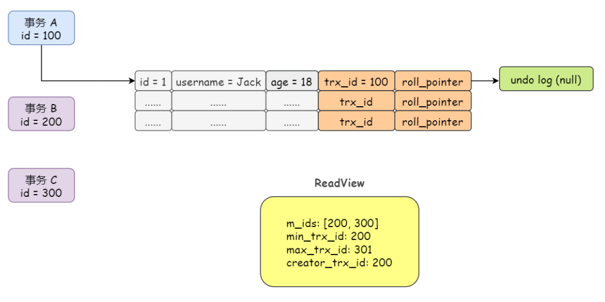

现在事务 B 进行第一次查询（select 操作不会生成 undo log 的哈），会**把这行记录的隐藏字段 `trx_id` 和 ReadView 的 `min_trx_id` 进行下判断**，此时，发现 trx_id 是 100，小于 ReadView 里的 `min_trx_id`（200），这说明在事务 B 开始之前，修改这行记录的事务 A 已经提交了，所以**开始于事务 A 提交之后的事务 B、是可以查到事务 A 对这行记录的更新的**。

```
row.trx_id < ReadView.min_trx_id
```

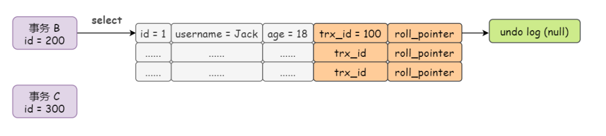

接着事务 C 过来修改这行记录，把 age = 18 改成了 age = 20，所以这行记录的 `trx_id` 就变成了 300，同时 `roll_pointer` 指向了事务 C 修改之前生成的 undo log：

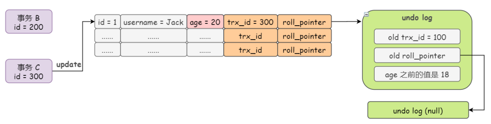

那这个时候事务 B 再次进行查询操作，会发现**这行记录的 `trx_id`（300）大于 ReadView 的 `min_trx_id`（200），并且小于 `max_trx_id`（301）**。

```
row.trx_id > ReadView.min_trx_id && row.trx_id < max_trx_id
```

这说明一个问题，就是更新这行记录的事务很有可能也存在于 ReadView 的 m_ids（活跃事务）中。所以事务 B 会去判断下 ReadView 的 m_ids 里面是否存在 `trx_id = 300` 的事务，显然是存在的，这就表示这个 id = 300 的事务是跟自己（事务 B）在同一时间段并发执行的事务，也就说明这行 age = 20 的记录事务 B 是不能查询到的。

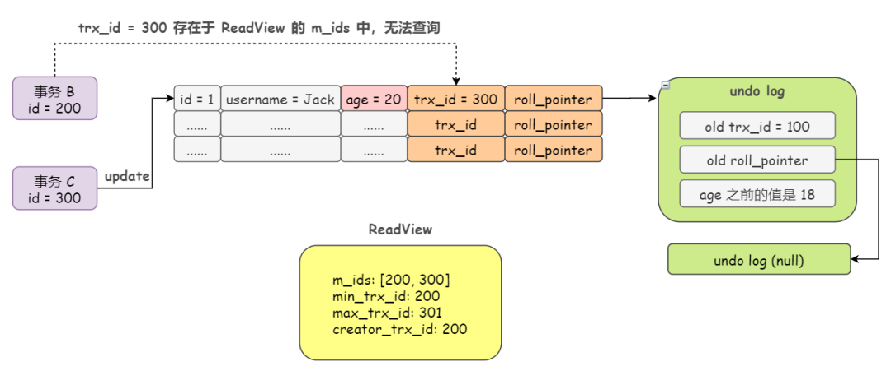

既然无法查询，那该咋整？事务 B 这次的查询操作能够查到啥呢？

没错，undo log 版本链

这时事务 B 就会顺着这行记录的 roll_pointer 指针往下找，就会找到最近的一条 `trx_id = 100` 的 undo log，而自己的 id 是 200，即说明这个 trx_id = 100 的 undo log 版本必然是在事务 B 开启之前就已经提交的了。所以事务 B 的这次查询操作读到的就是这个版本的数据即 age = 18。

通过上述的例子，我们得出的结论是，**通过 undo log 版本链和 ReadView 机制，可以保证一个事务不会读到并发执行的另一个事务的更新**。


那自己修改的值，自己能不能读到呢？

这当然是废话，肯定可以读到呀。上面的例子我们只涉及到了 ReadView 中的前三个字段，而 `creator_trx_id` 就与自己读自己的修改有关，所以这里还是图解出来让大家更进一步理解下 ReadView 机制：

假设事务 C 的修改已经提交了，然后事务 B 更新了这行记录，把 age = 20 改成了 age = 66，如下图所示：

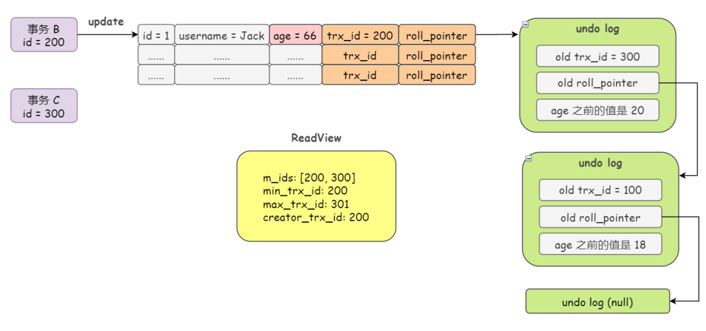

然后，事务 B 再来查询这条记录，发现 `trx_id = 200` 与 ReadView 里的 `creator_trx_id = 200` 一样，这就说明这是我自己刚刚修改的啊，当然可以被查询到。

```
row.trx_id = ReadView.creator_trx_id
```

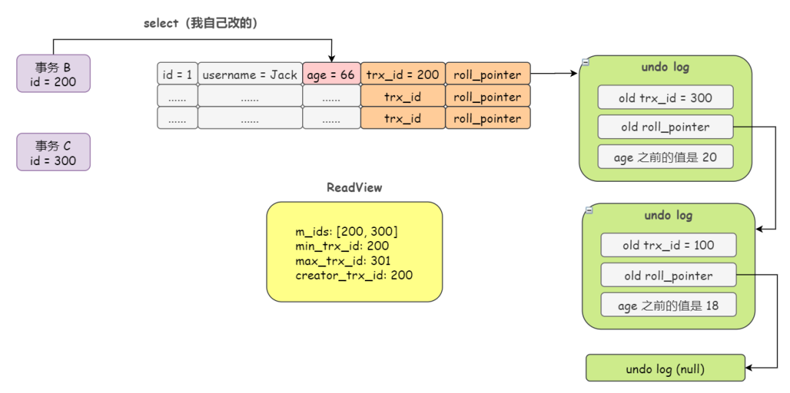

那如果在事务 B 的执行期间，突然开了一个 id = 500 的事务 D，然后更新了这行记录的 age = 88 并且还提交了，然后事务 B 再去读这行记录，能读到吗？

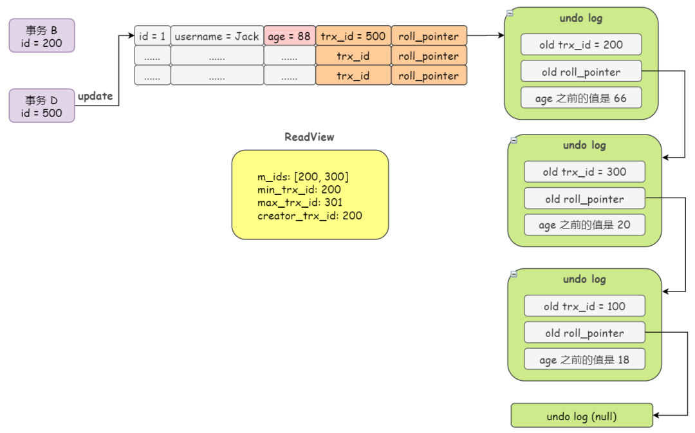

答案是不能的。

因为这个时候事务 B 再去查询这行记录，就会发现 `trx_id = 500` 大于 ReadView 中的 `max_trx_id = 301`，这说明事务 B 执行期间，有另外一个事务更新了数据，所以不能查询到另外一个事务的更新。

```
row.trx_id > ReadView.max_trx_id
```

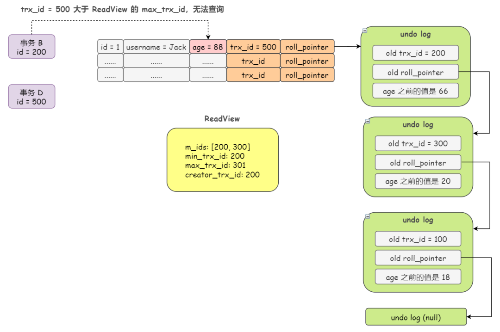

那通过上述的例子，我们得出的结论是，**通过 undo log 版本链和 ReadView 机制，可以保证一个事务只可以读到该事务自己修改的数据或该事务开始之前的数据**。

------

> 🥸 **面试官**：讲一下数据库的四种隔离级别，以及具体的实现
>
> 😎 **小牛肉**：数据库的四种隔离级别主要是用来解决四种并发一致性问题的，隔离级别越高，能够处理的并发一致性问题越多，相应的数据库付出的性能代价也就越高。
>
> 最低的隔离级别是读取未提交，一个事务还没提交时，它做的变更就能被别的事务看到：可以解决丢失更新问题（所谓丢失更新问题，就是指一个事务的更新操作会被另一个事务的更新操作所覆盖）；
>
> 然后是读取已提交，一个事务提交之后，它做的变更才会被其他事务看到：可以解决丢失更新和脏读问题（所谓脏读，就是一个事务读到了另外一个事务未提交的数据）；
>
> 然后是 InnoDB 默认的隔离级别可重复读，一个事务执行过程中看到的数据，总是跟这个事务在启动时看到的数据是一致的：可以解决丢失更新、脏读和不可重复读问题（所谓不可重复读，就是指第一个事务中的两次读数据之间，由于第二个事务的修改，那么第一个事务两次读到的数据是不一样的）。另外，InnoDB 的这个默认隔离级别，会通过 Next-Lock key 来解决幻读问题，所以其实是可以达到 SQL 标准的可串行化隔离级别的；
>
> 最后是可串行化，强制事务串行执行，对于同一行记录，“写” 会加 “写锁”，“读” 会加 “读锁”，当出现读写锁冲突的时候，后访问的事务必须等前一个事务执行完成，才能继续执行。这样可以避免并发一致性问题，解决丢失更新、脏读、不可重复读和幻读问题（所谓幻读，和不可重复读差不多，不过幻读侧重于记录数量的增减，不可重复读侧重于记录的修改）
>
> 对于读取已提交和可重复读这两个隔离级别来说，其底层实现就是多版本并发控制 MVCC。
>
> 具体来说，对于这两个隔离级别，数据库会为每个事务创建一个视图 (ReadView)，访问的时候以视图的逻辑结果为准。通过 undo log 版本链使得事务可以回滚到视图记录的状态。
>
> 而这两个隔离级别的区别就在于，它们生成 ReadView 的时机是不同的：
>
> - 在 “读取已提交” 隔离级别下，这个视图是在每个 SQL 语句开始执行的时候创建的
> - 在 “可重复读” 隔离级别下，这个视图是在事务启动时就创建的，整个事务存在期间都用这个视图
