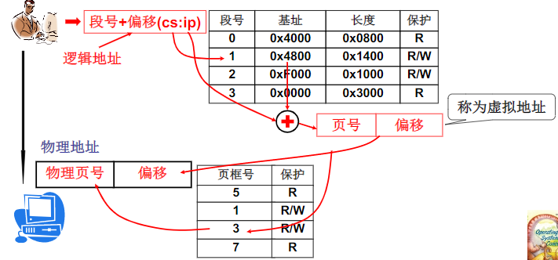

---

---

# 操作系统基础

## L1.弱弱的问：什么是操作系统

* 是计算机硬件和应用之间的一层软件。如果上层应用使用计算机的时候，要通过操作系统，要使用操作系统的一个接口，也可以提高效率，方便我们使用硬件，如使用显存...
* 管理哪些硬件。CPU管理、内存管理、终端管理、磁盘管理、文件管理等

## L2开始揭开钢琴的盖子

计算机怎么工作的？说到底就是一个计算模型。英国数学家图灵提出一种模型。通过纸带和控制器来完成加法操作。此时的图灵机只能计算加法。

通用图灵机。首先设置控制器动作和控制器状态，然后根据逻辑处理数据，就可以完成+ - * /等操作。需要将控制动作提前写在纸带上。核心：设置控制器动作。就很像现在的将ppt载进来就可以做ppt，将qq载进来就可以聊天


冯.诺依曼储存程序思想。主要思想:将程序和数据存放在计算机内部的储存器中，计算机在程序的控制下一步一个进程执行。计算机五大部件：输入设备、输出设备、储存器、运算器、控制器


计算机如何执行的？取指执行

## L3.操作系统启动

```bash
- bootsect.s
1.X86 PC刚开机时CPU处于实模式(和保护模式对应，实模式的寻址CS:IP(CS左移4位+IP)，和保护模式不一样)
2.开机时，CS=0xFFFF;IP=0x0000   CS : code segment代码段寄存器；IP : 指令指针寄存器(instucton pointer)
3.寻址0xFFFF0(ROM BIOS映射区)basic input ouput system   ROM：固化程序的储存器
4.先检查RAM,键盘，显示器，软硬磁盘
5.然后将磁盘0磁道0扇区读入0x7c00处(读入一个扇区 512字节   0x7c00也是操作系统的引导扇区)
6.设置cs=0x07c0,ip=0x0000   (cs是一个16位寄存器  ip是一个16位寄存器)

- 引导扇区
	就是从磁盘引导扇区读入的那512字节。
	引导扇区就是启动设备的第一个扇区(开机时按住del键可进入启动设备界面，可以设置为光盘启动)
	因此硬盘的第一个扇区上存放着开机后启动的第一段我们可以控制的程序

	实模式阶段的寻指执行，采用cs左移4位+ip地址，这种情况下计算机的寻址空间只能达到20位，能访问的内存只有1M。所以在启动程序最后需要切换到一个新的寻址模式，将16位机切换到32位机模式，32位模式也叫保护模式，这是内存就会很大了。
	16位模式和32位模式本质区别是什么？说到底是cpu里面的解释程序不一样。以前的遇见cs ip需要将cs<<4+ip来执行，现在遇见cs ip就不能这样解释了，需要走另外一条路来实现。
	如何切换模式？将cr0寄存器最后一个位，如果是0，就是实模式，如果是1，则是保护模式。启动程序最后会将cr0寄存器最后一位置为1，导致cpu走另外一条解释执行指令的电路。

- 操作系统启动流程
	boot | setup | system
	bootsect.s：将操作系统从磁盘0磁道0扇区读进内存。
	setup.s:将完成OS启动前的设置。
		1.获取硬件参数，为后面的初始化工作做准备
		2.把system挪动一下，挪到00地址处，这时操作系统核心代码就一直在哪里
		3.启动保护模式，让硬件进入保护模式，成为32位的寻指方式
		4.最后应用一条高级指令，跳到了零地址处去执行
	head.s:system模块的第一部分代码就是head.s.head就是第一部分的意思。主要工作，初始化了一些gdt表，初始化了一些页表，然后跳到main	
    main.c函数：main函数是一个永远不会退出的程序。他主要用于初始化工作，拿内存初始化mem_init()举例：初始化mem_map数组，每次4KB为一页，初始化为0。来表示表征那些部分是使用，哪些没有使用，因为0地址开始是操作系统使用的，后面应用程序才可以使用
    总结：将操作系统读入内存、然后初始化
	
	在编大型软件的时候，你要控制整个软件合成的结构，就必须要makefile

```

## L4.操作系统接口

什么是操作系统接口？==**系统调用**==

POSIX(portable operating system interface of unix):IEEE置顶的一个标准族

系统调用就是fork、open、write等重要函数

## L5.系统调用实现

**为什么要分为用户态和内核态**

如果不分的话，我们调用操作系统对外提供的接口时，就变成了函数调用，而不是系统调用。所以直接让用户态程序访问操作系统内核是不允许的。

这边会分为两个部分，一个是读一个是写。1.规定不能随意的调用数据，不能随意的jmp，如果能的话，因为操作系统有很多重要的数据，比如用户名和密码，操作系统就很可能会有，因为操作系统会根据输入的用户名对不对才能访问，如果用户程序可以访问，就很可能从操作系统里获取到，如果是网上的程序，就会导致系统不安全。另外一个例子，就是如果word我们写的内容，要经过操作系统最后写到磁盘上，当然操作系统就会在一定时刻内会留下来，留在缓冲区里面，如果可以访问的话，就可以获取这段内容，所以就会很不安全。2.另外一点写的话，用户程序很可能会将同一地址的内容进行覆盖，导致一些程序无法使用，造成崩溃

**不让进去，怎么做到内核态和用户态隔离的**

将内核程序和用户程序进行隔离，使用的是一种处理器“硬件设计”。将内存割分成了很多区域，一个是内核段，一个是用户段。(常识：计算机对内存的使用都是一段一段的使用)

当前程序执行在什么态？由于CS:IP是当前指令，所以用CS的最低两位来表示：0是内核态，3是用户态


而用户段和内核段都需要段寄存器来操作，所以这边会有两个段寄存器。这两个段寄存器有两个很重要的信息分别是CPL(current privilege level当前段特权级别)和DPL(destination privilege level目标段特权级别)。操作系统规定内核段特权级属于多少呢，这边在操作系统初始化的时候就设置好了，0表示内核态，3表示用户态(dpl cpl就在gdt表中，所以操作系统数据段还是代码段在gdt表中表象对应的dpl全等于0，是head.s做的)，而普通用户程序执行中用cs的某个部分表示它所处于的特权级，是3数字越大越低。所以访问时都需要判断一下当前特权级和目标特权级DPL>=CPL才允许访问，话句话说内核程序可以访问内核程序和用户程序，而用户程序只能访问用户程序。这种机制也成为了特权环。

**系统调用向让他进去，那又怎么做的**

硬件也提供了“主动进入内核的方法”，这个方法就是中断指令int。

* int指令将是CS中的CPL改为0，“进入内核”
* 这是用户程序发起的调用内核的唯一方法(此时CPL=3 DPL=0)

因为中断是进入内核的唯一方法，那么此时我们调用的函数实际上就变成了一段int指令，而要想实现的话，操作系统必须要提供相应的中断处理函数，根据你是做什么事去跳到相应的位置去执行

系统调用核心：

* 用户程序中包含一段包含int指令的代码
* 操作系统写中断处理，获取想调程序的编号
* 操作系统根据编号执行相应代码

这个中断就是`int 0x80`

要想进入内核中，必须根据系统调用号，

**系统调用的细节**

用户要根据系统调用号(假如是72)，然后通过int 0x80指令，发出这么一条指令，才能穿过接口到达系统，那如何穿过的?此时用户程序的CPL=3，但是呢int 0x80的DPL也做成3，所以这个时候可以穿过去，一旦穿过去CPL就被置成0了，然后就执行了_system_call，在_system_call里面通过移动查表最后就调用了一个内核的函数，去实现对应功能的，这时候就可以任意访问位置了，比如调用printk(print的kernel版本)来打印字符。

## L6.操作系统历史

CP/M -> QDOS -> MS -> DOS -> Windows    

Unix -> System -> Mac OS ->iOS

## L7.学习任务


# 进程与线程

## L8 CPU管理的直观想法

进程：进行(执行)中的程序，描述了运行的程序和静态程序的不一样

进程的上下文储存在PCB中

> 总结：操作系统要运行起来，给一段程序，操作系统去运行它，就开始工作起来了。但是只执行一个程序的话，cpu利用率会非常的低(io指令和计算指令时间差距很大)，为了使cpu利用率提升上来，cpu需要交替的执行多个程序，就需要切来切去，为了完成切换，就要记录运行中的程序，此时运行中的程序和静态程序就非常不一样了，所以引入了一个概念就进程。

## L9 多进程图像

操作系统通过PCB感知多进程，多进程图像是操作系统最核心的图像。

* 读写PCB，OS中最重要的结构，贯穿始终
* 要操作寄存器完成切换(L10，L11，L12)
* 要写调度程序(L13，L14)
* 要有进程同步与合作(L16，L17)
* 要有地址映射(L20)

## L10 用户级线程

进程 = 资源 + 指令执行序列

线程：保留了并发的优点，避免了进程切换代价

实质：就是映射表不变而PC指针变


进程中的线程还可以共享缓冲区。

yield：能完成切换	Create：

```bash
- 如果两个线程共享一个栈
	当线程1调用yield的时，会将此时返回地址a压栈，然后跳到线程2，然后执行一个函数fun，将函数返回地址b压栈，然后到达fun内部，此时又调用yield，就要跳出去了，此时就要弹栈，而弹的是fun内部的地址，就又跑回来了，但此时就出现问题了。
	原因；两个线程共享了一个栈，导致出了问题。	
```


```bash
- 当两个线程各自一个栈
	esp:cpu的寄存器 TCB:thread control block
	当调动yield会将yield的返回地址压栈，然后pc指针指向另一个线程开始的地方。 
	viod{
		TCB2.esp = esp;
		esp = TCB1.esp;
		jmp = 204; // 这句话不应该有 否则就又跳到204位置了 去掉这句话
	}
```


线程切换是在用户态进行的，操作系统感知不到，如果此时有一个用户线程阻塞了，那么就无法切换其他线程了，操作系统会切换进程，所以也达不到多线程并发性没有任何效果


核心级线程不一样，它的ThreadCreate是一个系统调用，要创建线程的话会进入内核，TCB在内核中，那么如果线程1阻塞了，就可以切换到其他线程，所以核心级线程的并发性更好一些


总结：用户级线程换的核心，从一个栈变成两个栈，每个线程有自己的栈自己的TCB，在切换的时候首先切换TCB，在切换栈，在切换的时候，把要切换的PC指针放到自己的栈中，然后在创建好TCB，然后将来在切换的时候，首先通过TCB切换，在切换到相应的栈，然后在栈中弹出地址，继续执行。

**内核线程的五段论**

1. 首先是中断，进入中断以后，才能把链拉好，为切换做准备，然后进行中断处理
2. 在中断处理过程中，可能会发生阻塞，或者时间片到了之后发生时钟中断，开始切换
3. 找到TCB，根据TCB完成内核栈的切换
4. 内核栈切换
5. 用户栈切换


## L11 内核级线程

多个线程可以用多核，而且可以同同一套MMU，这些线程属于同一个进程，所以是并行。

如果多进程，则切换时MMU也需要相应切换，所以和并发有一定区别。并发时同时触发，交替执行，并行是同时触发同时执行。

所以多进程不能发挥多核的价值，用户级线程也不能发送多核的价值，核心机线程才可以发挥多核的作用。

* 一个栈到一套栈，两个栈到两套栈
* TCB关联用户占，当切换用户栈时，内核栈要切，用户态也要切，所以是一套

```bash
- 内核线程切换五段论
	1.中断，进入中断才可以拉链
	2.在中断处理时，可能发生阻塞，
	3.要找到下一个TCB
	4.根据TCB要完成内核栈的切换
	4.内核栈切换后，中断返回(完成用户栈切换)
```

**用户级线程、内核级线程的对比**  多对一 一对一 多对多


## L12 内核级线程实现

看不懂

## L13 操作系统的那颗"树"

无

## L14 CPU调度策略

**cpu调度时，需要折中和综合**

* 响应时间小 -> 切换次数多 -> 系统内耗大 -> 吞吐量小

**常见调度算法**

* FCFS(First Come First Served)： 先到先服务
* SJF：短作业优先
* 时间片轮询调度RR(round robin)：因为短作业会导致长作业等待时间过长，所以需要分时间片来作出响应
* 优先级调度：前台任务优先级高，后台任务优先级低。但就会导致某个任务饥饿，长时间不能执行

## L15 一个实际的schedule函数

## L16 进程同步和信号量

```c
struct semaphore{
    int value;  // 记录资源个数
    PCB *queue; // 记录等待改信号量上的进程
}
```

信号量可以保证进程同步

## L17 信号量临界区保护

**临界区保护原则**

* 互斥进入

* 有空则进
* 有限等待

## L18 死锁处理

**死锁的4个必要条件**

* 互斥使用：资源的固有特性，如道口
* 不可抢占：资源只能自愿放弃，如车开走以后
* 请求和保持：进程占有资源，再去申请
* 循环等待：在资源分配图中存在一个环路

**死锁处理方法**

* 死锁预防：破坏死锁出现的条件
* 死锁避免：检测每个资源请求，如果在成死锁就拒绝
* 死锁检测+恢复：检测到死锁出现时，让一些进程回滚，让出资源
* 死锁忽略：就好像没有死锁一样

**在进程执行前，一次性申请所有需要的资源，不会占有资源再去申请其他资源**

* 缺点1：需要预知未来，编程困难
* 许多资源分配后很长时间后才是用，资源利用率低

**对资源类型进行排序，资源申请必须按序进行，不会出现环路等待**

* 缺点：仍然造成资源浪费

**死锁避免：银行家算法**

* 时间复杂度： T(n)=O(mn^2)

**死锁检测+恢复： 发现问题再处理**

* 定时检测或发现资源利用率低时检测
* 如何实现回滚？谁回滚等操作也都很麻烦

**死锁忽略**

* 死锁出现不是确定的，又可以用重启动来处理死锁

# 内存管理

## L20 内存使用与分段

每执行一条指令都要从逻辑地址算出物理地址：**地址翻译**

* 每个进程有各自的基地址，放在哪里？**PCB**。执行指令时第一步先从PCB中取出这个基地址

**程序员眼中的程序**

* 由若干部分(段)组成，每个段有各自的特点、用途：代码段只读，代码/数据段不会动态增长
* 符合用户观点，用户可独立考虑每个段（分治）
* 怎么定位具体指令（数据）：==**<断号，段内偏移>**==


**不是将整个程序，是将各段分别放入内存**

* **GDT**: 是操作系统的段表
* **LDT**：每个进程有自己的段表，进程的段表

**段表流程**

把程序分成多个段(代码段、数据段)，每个段去内存中找到一个空闲的地方，然后把基址放在一个LDT表里面。然后一个程序就载入到内存中了，然后LDT表初始化好了，然后将LDT表赋给PCB，接下来PC指针设成初始的地址，然后取指执行，每执行一条指令的时候，都查这个表，找到程序中的地址，根据表中的基址和程序的地址，就可以找到相应的物理内存，就可以进行读、改、写操作了


## L21 内存分区与分页

* 分页是为了解决内存分区导致的内存效率问题
* 当存在内存碎片时，将空闲分区合并，需要移动一个段(复制内容)：内存紧缩
* 定位：[页号， 页内偏移]
* 一页为4KB

## L22 多级页表和快表

 ==**问题：为了提高内存空间利用率，页应该小，但是页小了页表就大了(页表项多了)**==

2^32 = 4G / 4K = 1M   所以就有1M的页表项

**页表会很大，页表就成了问题**

* 页面尺寸通常为4K，而地址是32位，有2^20个页面(每个页表项一般为4个字节)
* 2^20个页表项都得放在内存中，需要4M内存；系统中并发10个进程，就需要40M内存
* 实际上大部分逻辑地址根本不会用到(4M的页表实际用不到)

实际我们在查找页表时，也需要页号是连续的，这样就可以采用折半查找等方式，减少访问内存的次数。**目标：既要连续又要让页表占用内存少**

**多级页表：页目录号、页号、offset空间**。这样我们就可以保证页目录号是连续的，但是不需要用到的页号，则可以不存储即可。中间大量的页就可以省略了。 **在空间上节省了空间，但是又增加了访问次数**

**快表也放在MMU中，可以保证一次查询即可找到物理页号，提高访问速度**

**首先查询快表TLB，快表找到则直接返回物理页号，如果miss则查询多级页表，然后返回物理页号**

* TLB越大越好，但TLB很贵，通常只有[64,1024]

* 程序的地址访问存在局部性
* **空间局部性** ：一旦程序访问了某个存储单元，在不久之后，其附近的存储单元也将被访问，即程序在一段时间内所访问的地址，可能集中在一定的范围之内，这是因为指令通常是顺序存放、顺序执行的
* **时间局部性** ：如果程序中的某条指令一旦执行，不久以后该指令可能再次执行；如果某数据被访问过，不久以后该数据可能再次被访问。产生时间局部性的典型原因，是由于在程序中存在着大量的循环操作。

## L23 段页结合的实际内存管理

**段、页结合：程序员希望用段，物理内存希望用页**



在虚拟内存中割出一部分作为分段，然后将虚拟内存割成一页一页映射到物理内存上。虚拟内存是连接分段和分页的核心

## L24 内存换入-请求调页


* 4GB(大而规整)的“内存”，可供用户使用，如char *p , p=3G, 实际上就是用地址
* 用户可随意使用该“内存”，就单独拥有4G"内存"
* 这个“内存”怎么**映射**到物理内存，用户全然不知(**请求时才映射**)

**请求调页，当然从缺页中断开始，就去执行对应的中断处理程序**

## L25 内存换出

**总不能总是获得新的页，内存是有限的**

* FIFO页面置换：先换入的先换出

* MIN页面置换：选最远将使用的页淘汰是最优方案

* LRU：选最近最长一段时间没有使用的页淘汰(最近最少使用) 公认的很好的代码

  * **页码栈**

    

    问题：每次访地址问都要修改栈，需要改变栈

  * **引用位**(最近没有使用)

    * 没访问一页，硬件自动设置改位

    * 选择淘汰页：扫描改位，是1时清0，并继续扫描；是0时淘汰该页  （Clock算法）

      

  * Clock算法优化

    * 定时清除R位。。。 再来一个扫描指针

    * 用来清除R位，移动速度要快！

    * 用来选择淘汰页，移动速度慢！

      

**页面置换策略还需要解决一个问题，给进程分配多少页框(帧frame)**

* 分配的多，请求调页导致内存高效利用就没有了

* 分配少了，就会出现**内存颠簸**

  


**换入换出是为了实现虚拟内存-->为了实现段页-->是为了保存程序-->是为了形成进程**

# 设备驱动与文件系统

## L26 I/O与显示器


## L27 键盘

外设工作的基本原理

* CPU发出一条指令，读或写(向控制器中的寄存器读写数据)
* 当外设完成工作的时候，向CPU发出一个中断信号

 **敲键盘，敲了就中断**

## L28 生磁盘的使用

**寻道-旋转-传输**

只需要往控制器写柱面、磁头、扇区、缓存位置

**磁盘寻道调度算法**

* FCFS:短寻道优先			小问题：造成饥饿

* SSTF:短寻道时间优先调度		小问题：磁头会来回旋转，可能造成饥饿

* SCAN磁盘调度：SSTF+中途不回折   小问题：中间占便宜

* C-SCAN磁盘调度(电梯算法)：SCAN+直接移到另一端，两端请求都很快处理


## L29 从生磁盘到文件

引入文件，对磁盘使用的第三层抽象

## L31 目录与文件系统

应用结构+储存的数据可以得到那课文件树，找到文件、读写文件

* 将划分后的集合阿紫进行划分：k次划分后，每个集合中的文件树为log2(n)


