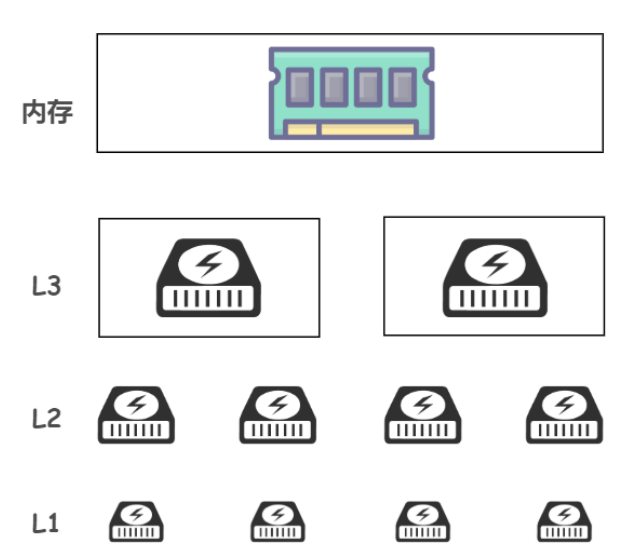
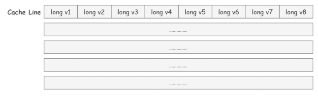

# 一 操作系统基础

## 1.0 基础

电脑的五大部分：**输入单元**、输出单元、CPU的**控制单元**和算数逻辑单元、**内存**。

CPU架构分为：**精简指令集**(RISC)和**复杂指令集**(CISC)。

* 精简指令集包括**ARM架构**
* 复杂指令集包括**x86架构**。Intel、AMD开发的x86架构的CPU被大量用于个人电脑。

新的x86CPU包含最先进的指令集，可以加速程序运行、功耗优化等。。。

```bash
> 小故事
	龙芯自己的指令集**LoongArch**(龙啊可)，不是x86，不是ARM。这点和华为海思等中国芯片都不一样。华为用的是ARM的授权。要么是Intel的x86授权。对外授权的方式有两种：**IP核层级授权**和架构层级授权。如果只拿到了IP核层级授权意味着你不能改微架构，只能用现有的IP核排列布局达到功能，只能实现整体层面的优化，无法实现架构和功能模块的优化。
	**第一点**，而华为、苹果、高通这些公司拿到的是架构层级授权，可以改微架构，所以华为海思也是掌握芯片底层设计能力的。ARM可以随时停止对华为的授权，虽然之前的授权是个软件想授权也收不回，但是ARM架构后续的指令集迭代不会跟华为同步，渐渐的和arm架构不兼容。
	**第二点**，如果对架构的优化涉及到要改指令集就要通过一些列arm生态厂商的同意，一旦更新也会同步共享给他们；
	**第三点**，用了别人的微架构不能保证没有隐藏的指令(后门)，越是对国家安全的领域越是不方便用别人的微架构。
	cpu在设计工艺上实际上是为了减少功耗，6nm、8nm等等。Intel的工艺制造更先进，ARM在工艺制造上不如Intel，但是在设计上有很强的优化，所以ARM功耗更强，但是x86的性能更好一点。
```

**CPU**

```bash
cpu全称为Central Processing Unit. 
>	内部执行流程
c语言程序 -> 编译为机器语言的exe文件 -> 程序运行时，在内存中生成exe副本 -> CPU解释并执行程序

> 主要包括几个部分：控制单元、算术逻辑单元(ALU)、寄存器、时钟
	* 控制单元：从内存中提取指令并解码执行
	* 算数逻辑单元：处理算数和逻辑运算
	* 寄存器：暂存指令、代码执行行数等
		** 程序计数器：用来储存下一条指令所在单元的地址。
		
> CPU执行过程：取指令、执行指令(解释、执行、取数)、结果写回		
```

**内存**

```bash
数据必须读入内存中，CPU才能够利用。
> 随机存储器(RAM)
	个人电脑的内存主要组件为动态随机存储内存(DRAM dynamic random access memory)  类型包括：SDRAM、DDR(double data rate) DDR就是所谓的双倍数据传输速度，在一次工作周期内可以进行两次数据传输。大部分是DDR内存。
> 只读存储器(ROM)
	一般只能用于数据的读取，不能写入。BIOS其实就是一段程序，固化BIOS的是只读储存器。电脑宕机时，数据不会丢失。
> 高速缓存(Cache):
	一级缓存(L1 Cache)、二级缓存(L2 Cache)、三级缓存（L3 Cache）等。位于CPU和内存之间，一般集成在CPU中。当CPU向内存中写入数据时，也会写入高速缓存中，如果下次读取时直接读取高速缓存，缓存中没有采取去读内存。
	* SRAM
		CPU中的二级高级缓存。在CPU到内存之间还要通过内存控制器，如果某些常用数据可以放入CPU中，就可以不用跑到内存了，提	高性能，这也是二级缓存的概念。CPU的二级高级缓存使用SRAM(static random access memory)
```

**磁盘**

```bash
磁盘中储存的程序必须加载到内存中才能运行。
> 磁盘缓存(实际是内存的一部分)
	磁盘的缓存技术。当内存向磁盘读取数据时，会在磁盘缓存中储存，当将下来需要读取相同内容时，就不会向实际磁盘中读取了。那么磁盘缓存大大解决了磁盘访问的速度。
> 虚拟内存(实际是磁盘的一部分)
	是内存和磁盘交互的第二个媒介。是把磁盘的一部分当做假象内存来使用。借用虚拟内存，在只剩5MB内存情况下，也可以运行10MB的程序。由于CPU只能执行加载到内存中的程序，所以虚拟内存空间就需要和内存空间进行置换，然后运行程序。
	虚拟内存方式有分页式和分段式。windows是分页式，在不考虑程序构造情况下，将程序按照一定大小的页分割，然后以页为单位，在虚拟内存和内存之间进行置换。磁盘读入内存称为Page In，内存写入磁盘称为Page Out。

> 物理结构
	机械磁盘由主轴马达、碟片、机械手臂、磁头组成。实际运行时，主轴马达让碟片转动，然后机械手臂可伸展在碟片上面通过磁头进行读写操作。
	磁盘上通常会被划分为多个空间来使用。一般Window使用的硬盘是使用扇区的方式。把磁盘表面分成若干个同心圆的空间就是 磁道，把磁道按照固定大小的存储空间划分而成的就是 扇区。扇面是同一延伸线内的扇区组成。
	SSD固态比HDD机械好很多。
> 接口
	磁盘与主板的连接接口大部分是SATA、SAS。一般个人笔记本都是SATA3.0接口，理论极限速度是600MB/s，SAS接口比SATA接口快。当然也有USB外接接口。USB3.0 USB3.1

> 顺序IO和随机IO
	1.磁盘块（block）是由多个相邻的扇区组成的，是操作系统读取的最小单元，这样如果信息能以 block 的形式聚集在一起，就能极大减少磁盘 IO 时间,这就是顺序 IO 带来的性能提升
	2.如果信息在一个磁道中分散地分布在各个扇区中，或者分布在不同磁道的扇区上（寻道时间是随机IO主要瓶颈所在），将会造成随机 IO，影响性能
	3.随机 IO 和顺序 IO 大概相差百倍 (随机 IO：10 ms/ page, 顺序  IO 0.1ms / page)，可见顺序 IO 性能之高，索引带来的性能提升显而易见！
```

<table> 
    <tr> 
    	<th>  </th>
        <th></th>
    </tr>
</table>


**操作系统**

```bash
> 操作系统内核
	操作系统(Operating System OS)其实就是一组程序，这组程序的重点在于管理电脑的所有活动以及驱动系统中的所有硬件。硬件的所有操作都必须通过操作系统来实现。
    综上，操作系统就是内核、其提供的接口工具和相关的用户软件。 底层向上：硬件、操作系统(内核、驱动接口)、壳程序
> 内核的功能(重点CPU和内存)
	1.系统调用接口 2.进程管理 3.内存管理 4.文件系统管理 5.设备驱动
> 驱动程序与操作系统
	驱动程序只能用来驱动特定型号的硬件。所以如果想要操作系统上驱动比较新的硬件，就需要驱动程序。为了解决这个问题，操作系统通常会提供一个API给硬件开发商，让他们根据这个接口，设计可以驱动硬件的驱动程序，这样一来，只要用户安装了驱动程序，就可以驱动新的硬件了。
```

# 

## 1.1 什么是操作系统

> 👨‍💻**面试官**：先来个简单问题吧！什么是操作系统

🙋 **我** ：我将通过以下几点向您介绍一下。

1. **操作系统（Operating System，简称 OS）是管理计算机硬件与软件资源的程序，是计算机的基石。**
2. **操作系统本质上是一个运行在计算机上的软件程序 ，用于管理计算机硬件和软件资源**
3. **操作系统的存在屏蔽了硬件层的复杂性。**
4. **操作系统的内核（Kernel）是操作系统的核心部分，它负责系统的内存管理，硬件设备的管理，文件系统的管理以及应用程序的管理**。

## 1.2 系统调用

> 👨‍💻**面试官** ：**什么是系统调用呢？** 能不能详细介绍一下。

🙋 **我** ：在介绍系统调用之前，需要先谈一下用户态和系统态。

根据进程访问资源的特点，我们可以把进程在系统的运行分为两个级别

* 用户态：用户态运行的进程可以直接读取用户程序的数据。
* 系统态：几乎可以访问计算机的任何资源，不受限制

我们运行的程序基本都是在用户态的，如果我们调用操作系统层面的资源，就需要用到系统调用了。

也就是说，我们运行的程序中，凡是与系统态级别的资源有关的操作（如**文件管理、进程控制、内存管理**等)，都必须通过系统调用方式向操作系统提出服务请求，并由操作系统代为完成。

> 用户态转向内核态的方式

```bash
- 系统调用
	用户态进程主动要求切换到内核态的一种方式。用户态的进程想要完成系统级别的资源操作时，都必须通过系统调用方式向操作系统提出服务请求，并由操作系统代为完成。也就完成了内核切换
- 异常
	当CPU在执行运行在用户态下的程序时，发生了某些事先不可知的异常，这时会触发由当前运行进程切换到处理此异常的内核相关程序中，也就转到了内核态
- 外围设备的中断
	当外围设备完成用户请求的操作后，会向CPU发出相应的中断信号，这时CPU会暂停执行下一条即将要执行的指令转而去执行与中断信号对应的处理程序，
```

> fork的作用

```bash
fork的作用是复制一个与当前进程一样的进程。新进程的所有数据（变量、环境变量、程序计数器、缓冲区等）数值都和原进程一致，但是是一个全新的进程，并作为原进程的子进程
子进程在执行自己那个fork时会返回0，父进程那个fork会返回子进程的pid号
```

> select poll epoll介绍和区别

```bash
暂时只记他们都是IO多路复用时，即让单个进程可以监视多个文件描述符，一旦某个fd就绪（一般是读就绪或写就绪），能够通知程序进行相应的读写操作。
```


## 1.3 IO模型

同步与异步：同步IO是指必须等待IO操作完成后，控制权才返回用户进程(一个执行流程中每个方法是否必须依赖前一个方法完成后才可以继续执行。假设我们的执行流程中：依次是方法一和方法二);异步IO是指调用立刻返回，调用者不必等待方法内的代码执行结束，就可以继续后续的行为(无须等待 IO 操作完成，就将控制权返回给用户进程)

阻塞和非阻塞：阻塞是 IO 操作需要彻底完成后才返回到用户空间(遇到同步等待后，一直在原地等待同步方法处理完成)；非阻塞是指 IO 操作被调用后立即返回给用户一个状态值，不需要等到 IO 操作彻底完成(遇到同步等待，不在原地等待，先去做其他的操作，隔断时间再来观察同步方法是否完成)

```bash
- BIO
	BIO全称是Blocking IO,本身是同步阻塞模式。 线程发起IO请求后，一直阻塞IO，直到缓冲区数据就绪后，再进入下一步操作。
	对于网络IO来说，数据没到来时，用户进程是阻塞的，等系统内核一直等到数据准备好了，它就会将数据从系统内核中拷贝到用户内存中，然后系统内核返回结果，用户进程才解除阻塞的状态，重新运行起来。
	大部分socket接口都是阻塞的，所谓阻塞型接口是指系统调用时却不返回调用结果，并让当前线程一直处于阻塞状态，只有当该系统调用获得结果或者超时出错时才返回结果。
- NIO
	NIO也叫Non-Blocking IO 是同步非阻塞的IO模型，同步指的是必须等待IO缓冲区内的数据就绪，而非阻塞指的是，用户线程不原地等待IO缓冲区，可以先做一些其他操作，但是要定时轮询检查IO缓冲区数据是否就绪。
	NIO主要有buffer、channel、selector三种技术的整合，通过零拷贝的buffer取得数据，每一个客户端通过channel在selector（多路复用器）上进行注册。
	因为循环调用 recv 将大幅度占用 CPU 使用率。
-AIO
	AIO是真正意义上的异步非阻塞IO模型，真正的理想的异步非阻塞IO应该让内核系统完成，用户线程只需要告诉内核，当缓冲区就绪后，通知我或者执行我交给你的回调函数。
	所以在发生系统调用后，会立即返回，不会对用户线程造成任何阻塞，内核会等待数据准备完成，然后将数据拷贝到用户内存中，当这一切都完成之后，内核会给用户进程发送一个信号(可以执行用户教程交给内核的执行任务)
```


# 二 进程与线程

> 👨‍💻**面试官**:行，我明白了。那么你在说一下进程与线程的区别吧！

🙋 **我：**我将从以下几个方面说明进程与线程的区别

1、**主要区别：**进程是操作系统进行资源分配(CPU、内存等等)的基本单位。线程是操作系统调度的基本单位。(好比包工头有地(资源)，工人干活(调度))

2、**共享和同步**：进程单独占有一定的内存空间，所以进程之间存在内存隔离，数据是分开的，数据共享复杂，但是同步简单；线程共享进程所占的内存地址和资源，所以共享简单，但同步复杂。

3、**异常：**一个进程出问题了，并不会影响其他进程的执行；但如果一个线程出问题了，可能导致整个进程的崩溃。

4、**开销：**进程在创建和销毁时，由于存在资源的创建和回收，所以开销要比线程大。

5、**包含：**一个操作系统中包括了很多个进程，一个进程中可以包括很多的线程。多个线程共享进程的**堆**和**方法区** (JDK1.8 之后的元空间)资源，但是每个线程有自己的**程序计数器、虚拟机栈** 和 **本地方法栈**。

> 👨‍💻**面试官** ： 那你再说说**进程和线程有哪几种状态?**

🙋 **我** ：进程一般分为5个状态：

* **创建状态**：进程正在被创建，尚未到就绪状态
* **就绪状态**：进程已处于准备运行状态，即进程获得了除了处理器之外的一切所需资源，一旦得到处理器资源(处理器分配的时间片)即可运行。
* **运行状态：**进程正在处理器上上运行(单核 CPU 下任意时刻只有一个进程处于运行状态)。
* **阻塞状态** ：又称为等待状态，进程正在等待某一事件而暂停运行如等待某资源为可用或等待 IO 操作完成。即使处理器空闲，该进程也不能运行。
* **结束状态** ：进程正在从系统中消失。可能是进程正常结束或其他原因中断退出运行。

线程的状态可由Thread.State内部枚举类

```bash
// java.lang.Thread内部类
public enum Thread.State{
    NEW, // 创建
    RUNNABLE, // 就绪和运行
    BLOCKED, // 阻塞，比如等待锁的释放以进入同步去
    WAITING, // 等待状态，调用了wait()、join()，需要其他线程来唤醒
    TIMED_WAITING, // 等待超时，时间到了自动唤醒。sleep、wait(time)、join(time)
    TERMINATED; // 终止
}
```

> 👨‍💻**面试官** ：**进程间的通信常见的的有哪几种方式呢?**

🙋 **我** ：大概有 7 种常见的进程间的通信方式。

1. **管道/匿名管道(Pipes)**：用于具有亲缘关系的父子进程间或者兄弟进程之间的通信。
2. **有名管道(Names Pipes)**：克服了匿名管道的缺点。有名管道严格遵循**先进先出(first in first out)**。有名管道以磁盘文件的方式存在，可以实现本机任意两个进程通信。
3. **信号(Signal)** ：信号是一种比较复杂的通信方式，用于通知接收进程某个事件已经发生；
4. **信号量(Semaphores)** ：信号量是一个计数器，用于多进程对共享数据的访问，信号量的意图在于进程间同步。这种通信方式主要用于解决与同步相关的问题并避免竞争条件。
5. **共享内存(Shared memory)** ：使得多个进程可以访问同一块内存空间，不同进程可以及时看到对方进程中对共享内存中数据的更新。这种方式需要依靠某种同步操作，如互斥锁和信号量等。可以说这是最有用的进程间通信方式。
6. **套接字(Sockets)** : 此方法主要用于在客户端和服务器之间通过网络进行通信。

> 👨‍💻**面试官** ：**那线程间的同步的方式有哪些呢?**

🙋 **我** ：线程同步是多个线程同时访问一个可见共享资源，应该同步线程避免共享资源使用冲突(或者保证线程之间完成有序性)。一般有三种线程同步的方式

* **互斥量(Mutex)**：采用互斥对象机制，只有拥有互斥对象资源的线程才有访问公共资源的权限，所以可以保证公共资源不会被多个线程同时访问。比如 Java 中的 synchronized 关键词和各种 Lock 都是这种机制。
* **信号量(Semphares)** ：它允许同一时刻多个线程访问同一资源，但是需要控制同一时刻访问此资源的最大线程数量
* **事件(Event)** :Wait/Notify：通过通知操作的方式来保持多线程同步。
* **临界区**：通过对多线程的串行化来访问公共资源或一段代码，速度快，适合控制数据访问。保证在某一时刻只有一个线程能访问数据的简便办法

> 👨‍💻**面试官** ：**你知道操作系统中进程的调度算法有哪些吗?**

🙋 **我** ：为了确定首先执行那个进程以及最后执行那个进程可以实现最大CPU利用率，计算机科学家已经定义一些算法。

* **先到先服务(FCFS)调度算法** : 从就绪队列中选择一个最先进入该队列的进程为之分配资源，使它立即执行并一直执行到完成或发生某事件而被阻塞放弃占用 CPU 时再重新调度。
* **短作业优先(SJF)的调度算法** : 从就绪队列中选出一个估计运行时间最短的进程为之分配资源，使它立即执行并一直执行到完成或发生某事件而被阻塞放弃占用 CPU 时再重新调度。
* **时间片轮转调度算法** : 时间片轮转调度是一种最古老，最简单，最公平且使用最广的算法，又称 RR(Round robin)调度。每个进程被分配一个时间段，称作它的时间片，即该进程允许运行的时间。
* **多级反馈队列调度算法** ：多级反馈队列调度算法既能使高优先级的作业得到响应又能使短作业（进程）迅速完成。UNIX 操作系统采取的便是这种调度算法。
* **优先级调度** ： 为每个流程分配优先级，首先执行具有最高优先级的进程，依此类推。具有相同优先级的进程以 FCFS 方式执行。

> 👨‍💻**面试官** ：**你知道什么是死锁吗?**

🙋 **我** ：两个线程获取了各自资源之后，还想再获取对方的资源，就会产生死锁。

> 👨‍💻**面试官** ：**产生死锁的四个必要条件是什么?**

🙋 **我** ：这四个条件是

* **互斥：**一个资源只能被一个线程使用(占有)时，那么其他线程必须等待该线程资源释放为止
* **非抢占：**一个在被一个线程使用是，不能被其他线程强行抢占
* **占有并保持**：一个线程占有一个资源后再请求其他资源时同时保持对原有资源的占有，不释放
* **循环等待**：两个线程获取了各自资源之后，还想再获取对方的资源，进而形成死锁。

如何避免死锁：只需要破坏四个条件中的任何一个就可以了

* 在线程执行前，拷贝资源副本到每一个线程

* 顺序加锁：线程按照一定顺序加锁
* 加锁限时：线程获取锁时加上一定的时限，超过时限则放弃对该锁的请求
* 规定必须释放自己的资源才可以请求另一个资源师

# 三、内存管理

## 3.1 内存管理介绍

> 👨‍💻 **面试官**: **操作系统的内存管理主要是做什么？**

🙋 **我：**  操作系统的内存管理主要负责内存的分配与回收，以及地址转换(将逻辑地址转换为对应的物理地址等功能)

## 3.2  常见的几种内存管理机制

> 👨‍💻 **面试官**: **操作系统的内存管理机制了解吗？内存管理有哪几种方式?**

简单分为**连续分配管理方式**和**非连续分配管理方式**这两种。连续分配管理方式是指为一个用户程序分配一个连续的内存空间，常见的如 **块式管理** 。同样地，非连续分配管理方式允许一个程序使用的内存分布在离散或者说不相邻的内存中，常见的如**页式管理** 和 **段式管理**。 

* **块式管理** ： 远古时代的计算机操系统的内存管理方式。将内存分为几个固定大小的块，每个块中只包含一个进程。如果程序运行需要内存的话，操作系统就分配给它一块，如果程序运行只需要很小的空间的话，分配的这块内存很大一部分几乎被浪费了。这些在每个块中未被利用的空间，我们称之为碎片。 

* **页式管理**：把主存分为大小相等且固定的一页一页的形式，页较小，相对相比于块式管理的划分力度更大，提高了内存利用率，减少了碎片。页式管理通过页表对应逻辑地址和物理地址

* **段式管理** ：页式管理虽然提高了内存利用率，但是页式管理其中的页实际并无任何实际意义。 段式管理把主存分为一段段的，段是有实际意义的，每个段定义了一组逻辑信息，例如,有主程序段 MAIN、子程序段 X、数据段 D 及栈段 S 等。 段式管理通过段表对应逻辑地址和物理地址。 

  页是物理单位，段是逻辑单位。分页可以有效提高内存利用率，分段可以更好满足用户需求

* **段页式管理机制** ：结合了段式管理和页式管理的优点，简单来说段页式管理机制就是把主存先分成若干段，每个段又分成若干页，也就是说 **段页式管理机制** 中段与段之间以及段的内部的都是离散的。

```bash
- 内存分段  断号 + 段内偏移
	将程序按照逻辑分段的形式储存在内存中，如主程序段 MAIN、子程序段 X、数据段 D 及栈段 S 等。但它有两个问题
	1.第一个就是`内存碎片`的问题
	2.第二个就是`内存交换的效率低`的问题。
	内存碎片包括外部内存碎片和内部内存碎片。外部内存碎片也就是产生了多个不连续的小物理内存，导致新的程序无法被装载；内部内存碎片即装载在内存中的程序需中有部分内存可能并不是很常用，这也导致内存的浪费。
	解决外部内存碎片的方式就是`内存交换`。将不连续的内存进程写入硬盘，再从硬盘写会内存中，不过进程会紧贴这上一个进程，不会空出内存碎片。所以，如果`如果内存交换的时候，交换的是一个占内存空间很大的程序，这样整个机器都会显得卡顿`。
- 内存分页  页号 + 页内偏移
	1.分页是把整个虚拟和物理内存空间切成一页页固定尺寸的大小。这样一个连续并且尺寸固定的内存空间，我们叫页（Page）。  	   
	2.虚拟地址和物理地址之间通过`页表`来映射，而页表储存在CPU的MMU(内存管理单元)中，于是CPU可以通过MMU找到实际要访问的物理内存地址。
	3.如果内存空间不够，可以使用`虚拟内存`技术。操作系统将最近没有使用的进程的内存页面暂时落盘储存，称为`换出`。一旦需要时在加载进来，称为`换入`。所以一次性写入和读取的页数很少，不会花很多时间。内存交换的效率就相对比较高了。
	4.好处：提高了内存交换效率，减少了内存碎片。另外分页使得我们在加载程序时不再需要一次性都把程序加载到物理内存中。而是只有在程序运行中，需要用到对应虚拟内存页里面的指令和数据时，再加载到物理内存里面去。
	5.32位操作系统(4GB内存)注意单页表或者一级页表都可以覆盖4GB的虚拟地址。单页表请款下，每个进程都包含一个4MB的页表，如果进程数多了，这个内存占用也是比较大的。
	
	- 多级页表 - 空间上解决问题
	解决只有单页表会存在页表占用内存太多的问题。解决方案为多级页表。多级页表是将页表（一级页表）分为 1024 个页表（二级页表），每个表（二级页表）中包含 1024 个「页表项」，形成二级分页。
	看似4GB虚拟地址全部映射到物理上，二级分页占用空间确实更大了，但是从局部性原理思考，如果使用了二级分页，一级页表就可以覆盖整个 4GB 虚拟地址空间。实际上每个进程不会占满4GB的虚拟地址空间，如果某个一级页表的页表项没有被用到，那么他对应的二级页表就可以等到使用时再创建。所以假设只有20%的一级页表被使用，那么页表占用的控件就是4KB（一级页表） + 20% * 4MB（二级页表）= 0.804MB.比但页表的4MB少多了。
	- TLB快表 - 时间上解决问题
	CPU中加入了专门存放程序最常访问的页表项Cache，这个Cache就是TLB。在CPU芯片中，MMU用来完成对TLB的访问实现地址转换。
	有了TLB后，CPU在虚拟地址寻址时，会先查TLB(命中率是很高的)，如果没有找到才会继续查常规的页表。
- 段页式内存管理 断号 + 段内页号 + 页内偏移
	先将程序划分为多个有逻辑意义的段，也就是前面提到的分段机制；接着再把每个段划分为多个页，也就是对分段划分出来的连续空间，再划分固定大小的页；
```


## 3.3 快表和多级页表

> 页表管理机制中有两个很重要的概念，快表和多级页表，这两个东西分别解决了页表管理中很重要的两个问题。你给我简单介绍一下吧！

🙋 **我** ：在分页内存管理中，很重要的两点是：

* 虚拟地址到物理地址的转换要快。
* 解决虚拟地址空间大，页表也会很大的问题。

**快表**(TLB)：为了解决虚拟地址到物理地址的转换速度，操作系统在 **页表方案** 基础之上引入了 **快表** 来加速虚拟地址到物理地址的转换。可以将其理解为高速缓存储存器，其中的内容是页表的一部分或者全部内容。

地址转换流程：

* 根据虚拟地址中的页号查快表；
* 如果该页在快表中，直接从快表中读取相应的物理地址；
* 果该页不在快表中，就访问MMU中的页表，再从页表中得到物理地址，同时将页表中的该映射表项添加到快表中；
* 当快表填满后，又要填入新页时，就按照一定的淘汰策略淘汰掉快表中的一个页。

**多级页表**

引入多级页表的主要目的是为了避免把全部页表一直放在内存中占用过多空间，特别是那些根本就不需要的页表就不需要保留在内存中。多级页表属于时间换空间的典型场景。

**总结**：为了提高内存的空间性能，提出了多级页表的概念；但是提到空间性能是以浪费时间性能为基础的，因此为了补充损失的时间性能，提出了快表（即 TLB）的概念。 不论是快表还是多级页表实际上都利用到了程序的局部性原理

## 3.4 分页机制和分段机制的共同点和区别

> 👨‍💻**面试官** ： **分页机制和分段机制有哪些共同点和区别呢？**

🙋 **我** ：

1. 共同点
   * 分页机制和分段机制都是为了提高内存利用率，较少内存碎片。
   * 页和段都是离散存储的，所以两者都是离散分配内存的方式。但是，每个页和段中的内存是连续的。
2. 区别
   * 页的大小是固定的，由操作系统决定；而段的大小不固定，取决于我们当前运行的程序
   * 分页仅仅是为了满足操作系统内存管理的需求，而段是逻辑信息的单位，在程序中可以体现为代码段，数据段，能够更好满足用户的需要

## 3.5 逻辑(虚拟)地址和物理地址

> 👨‍💻**面试官** ：你刚刚还提到了**逻辑地址和物理地址**这两个概念，我不太清楚，你能为我解释一下不？

🙋 **我：**我们编程一般只有可能和逻辑地址打交道，比如在 C 语言中，指针里面存储的数值就可以理解成为内存里的一个地址，这个地址也就是我们说的逻辑地址，逻辑地址由操作系统决定。物理地址指的是真实物理内存中地址，更具体一点来说就是内存地址寄存器中的地址。物理地址是内存单元真正的地址。

## 3.6 CPU寻址了解吗？为什么需要虚拟地址空间？

> 👨‍💻**面试官** ：**CPU 寻址了解吗?为什么需要虚拟地址空间?**

🙋 **我** ：现代处理器使用的是一种称为 **虚拟寻址(Virtual Addressing)** 的寻址方式。**使用虚拟寻址，CPU 需要将虚拟地址翻译成物理地址，这样才能访问到真实的物理内存。**当进程持有虚拟内存地址的时候，CPU执行该进程时会操作虚拟地址，而MMU(内存管理单元)会自动的将虚拟地址的操作映射到物理内存上。


**为什么要有虚拟地址空间**

先从没有虚拟地址空间的时候说起吧！没有虚拟地址空间的时候，**程序都是直接访问和操作的都是物理内存** 。但是这样有什么问题呢？

1. 用户程序可以访问任意内存，寻址内存的每个字节，这样就很容易（有意或者无意）破坏操作系统，造成操作系统崩溃。
2. 想要同时运行多个程序特别困难，比如你想同时运行一个微信和一个 QQ 音乐都不行。为什么呢？举个简单的例子：微信在运行的时候给内存地址 1xxx 赋值后，QQ 音乐也同样给内存地址 1xxx 赋值，那么 QQ 音乐对内存的赋值就会覆盖微信之前所赋的值，这就造成了微信这个程序就会崩溃。

**总结来说：如果直接把物理地址暴露出来的话会带来严重问题，比如可能对操作系统造成伤害以及给同时运行多个程序造成困难。**

虚拟地址访问内存的**优势**：

* 程序可以使用**一系列相邻的虚拟地址来访问物理内存中不相邻的内存缓冲区**。
* **不同进程使用的虚拟地址彼此隔离**。一个进程中的代码无法更改正在由另一进程或操作系统使用的物理内存。
* **程序可以使用一系列虚拟地址来访问大于可用物理内存的内存缓冲区**。当物理内存的供应量变小时，内存管理器会将物理内存页（通常大小为 4 KB）保存到磁盘文件。数据或代码页会根据需要在物理内存与磁盘之间移动。

# 四、虚拟内存

## 4.1 什么是虚拟内存(Virtual Memory)?

> 👨‍💻**面试官** ：再问你一个常识性的问题！**什么是虚拟内存(Virtual Memory)?**

🙋 **我** ：**虚拟内存是计算机系统内存管理的一种技术**。有的时候点开很多占内存的软件时，它占用的内存可能远远超过系统的物理内存。**为什么可以这样呢？** 正是因为 **虚拟内存** 的存在，通过 **虚拟内存** 可以让**程序可以拥有超过系统物理内存大小的可用内存空间**。另外，**虚拟内存为每个进程提供了一个一致的、私有的地址空间，它让每个进程产生了一种自己在独享主存的错觉**

**虚拟内存**是计算机系统内存管理的一种技术，我们可以手动设置自己电脑的虚拟内存。不要单纯认为虚拟内存只是“使用硬盘空间来扩展内存“的技术。**虚拟内存的重要意义是它定义了一个连续的虚拟地址空间**，并且 **把内存扩展到硬盘空间** 


基于局部性原理，在程序装入时，可以将程序的一部分装入内存，而将其他部分留在外存，就可以启动程序执行。由于外存往往比内存大很多，所以我们运行的软件的内存大小实际上是可以比计算机系统实际的内存大小大的。在程序执行过程中，当所访问的信息不在内存时，由操作系统将所需要的部分调入内存，然后继续执行程序。另一方面，操作系统将内存中暂时不使用的内容换到外存上，从而腾出空间存放将要调入内存的信息。这样，计算机好像为用户提供了一个比实际内存大的多的存储器——**虚拟存储器**。

实际上，我觉得虚拟内存同样是一种时间换空间的策略，你用 CPU 的计算时间，页的调入调出花费的时间，换来了一个虚拟的更大的空间来支持程序的运行。不得不感叹，程序世界几乎不是时间换空间就是空间换时间。

## 4.2 局部性原理

> 👨‍💻**面试官** ：要想更好地理解虚拟内存技术，必须要知道计算机中著名的**局部性原理**。

🙋 **我** ：局部性原理是虚拟内存技术的基础，正是因为程序运行具有局部性原理，才可以只装入部分程序到内存就开始运行。

局部性原理表现在以下两个方面：

1. **时间局部性** ：如果程序中的某条指令一旦执行，不久以后该指令可能再次执行；如果某数据被访问过，不久以后该数据可能再次被访问。产生时间局部性的典型原因，是由于在程序中存在着大量的循环操作。
2. **空间局部性** ：一旦程序访问了某个存储单元，在不久之后，其附近的存储单元也将被访问，即程序在一段时间内所访问的地址，可能集中在一定的范围之内，这是因为指令通常是顺序存放、顺序执行的，数据也一般是以向量、数组、表等形式簇聚存储的。

时间局部性是通过将近来使用的指令和数据保存到高速缓存存储器中，并使用高速缓存的层次结构实现。空间局部性通常是使用较大的高速缓存，并将预取机制集成到高速缓存控制逻辑中实现。虚拟内存技术实际上就是建立了 “内存一外存”的两级存储器的结构，利用局部性原理实现髙速缓存。

## 4.3 虚拟内存的技术实现

> 👨‍💻**面试官** ：**虚拟内存技术的实现呢？**

🙋 **我** ：**虚拟内存的实现需要建立在离散分配的内存管理方式的基础上**

1. **请求分页存储管理** ：建立在分页管理之上，为了支持虚拟存储器功能而增加了请求调页功能和页面置换功能。请求分页是目前最常用的一种实现虚拟存储器的方法。请求分页存储管理系统中，在作业开始运行之前，仅装入当前要执行的部分段即可运行。假如在作业运行的过程中发现要访问的页面不在内存，则由处理器通知操作系统按照对应的页面置换算法将相应的页面调入到主存，同时操作系统也可以将暂时不用的页面置换到外存中。 
2. **请求分段存储管理** ：建立在分段存储管理之上，增加了请求调段功能、分段置换功能。请求分段储存管理方式就如同请求分页储存管理方式一样。

3. **请求段页式存储管理**

不管是上面那种实现方式，我们一般都需要：

* 一定容量的内存和外存：在载入程序的时候，只需要将程序的一部分装入内存，而将其他部分留在外存，然后程序就可以执行了
* **缺页中断**：如果**需执行的指令或访问的数据尚未在内存**（称为缺页或缺段），则由处理器通知操作系统将相应的页面或段**调入到内存**，然后继续执行程序
* **虚拟地址空间** ：逻辑地址到物理地址的变换

**请求分页和分页储存管理器根本区别**在于是否将一作业的全部地址空间同时装入主存。求分页存储管理不要求将作业全部地址空间同时装入主存。基于这一点，请求分页存储管理可以提供虚存，而分页存储管理却不能提供虚存。

## 4.4 页面置换算法

> 👨‍💻**面试官** ：虚拟内存管理很重要的一个概念就是页面置换算法。那你说一下 **页面置换算法的作用?常见的页面置换算法有哪些?**

🙋 **我** ：地址映射过程中，若在页面中发现所要访问的页面不在内存中，则发生缺页中断。

当发生缺页中断时，如果当前内存中并没有空闲的页面，操作系统就必须在内存选择一个页面将其移出内存，以便为即将调入的页面让出空间。用来选择淘汰哪一页的规则叫做页面置换算法，我们可以把页面置换算法看成是淘汰页面的规则。 

* **FIFO（First In First Out） 页面置换算法（先进先出页面置换算法）** : 总是淘汰最先进入内存的页面，即选择在内存中驻留时间最久的页面进行淘汰。

* **LRU （Least Recently Used）页面置换算法（最近最久未使用页面置换算法）** ：LRU算法赋予每个页面一个访问字段，用来记录一个页面自上次被访问以来所经历的时间 T，当须淘汰一个页面时，选择现有页面中其 T 值最大的，即最近最久未使用的页面予以淘汰。

* **LFU （Least Frequently Used）页面置换算法（最少使用页面置换算法）** : 该置换算法选择在之前时期使用最少的页面作为淘汰页。

# 问题

> 如何提高服务器性能和处理能力

首先从程序任务类型出发，区分任务为 CPU 密集型和 IO 密集型两大类。基于这两类任务提高服务器性能，分为软件层面和硬件层面的方法。

软件层间利用多进程、多线程以及协程模型。当然现有的技术还有 IO 多路复用、异步 IO 、池化技术等方案等。

硬件层面主要通过提高机器核心数，然后利用CPU亲和性，将某一进程或线程绑定在一个CPU上，这样这个进程的上下文信息就会保留在CPU的缓存中，下次调度到这个CPU上就能避免缓存未命中对 CPU 处理性能的影响，从而使得进程的运行更加高效。

> 进程切换为什么比线程切换要慢呢？

那么先说一下虚拟地址和物理地址。物理地址就是真实的地址，这种寻址方式很容易破坏操作系统，使得操作系统崩溃。为了对物理地址进行保护，于是创建了虚拟地址空间。虚拟地址是逻辑地址，每个进程都拥有自己的虚拟地址空间，并且独立于其他进程的地址空间。那么有了虚拟地址，cpu就可以通过虚拟地址转换成物理地址这样一个过程，来间接访问物理内存了。

地址转换需要两个东西，一个是 CPU 上的内存管理单元 MMU，另一个是内存中的页表，页表中存的虚拟地址到物理地址的映射。

由于CPU和内存的处理速度不一样，如果每次访问内存都需要先访问内存中的页表，就会成为性能瓶颈。于是TLB诞生了，其实就是一个缓存，把经常访问到的内存地址映射存在 TLB 中，TLB存在CPU中访问非常快。

也正是TLB导致了进程切换比线程切换慢。由于进程切换会涉及到虚拟地址空间的切换，导致内存中的页表也要进行切换，但是此时cpu中的TLB就失效了，会导致一段时间内TLB无法命中，而去频繁访问内存，表现出来的就是程序运行会变慢。

而线程切换呢，由于不涉及虚拟地址空间的切换，所以也就不存在这个问题了

> 伪共享问题

```bash
越靠近 CPU 的缓存，速度越快，容量也越小。所以 L1 缓存容量最小但是速度最快；L3 缓存容量最大同时速度也最慢
	* L1 和 L2 都是只能被一个单独的 CPU 核心使用
	* L3 可以被单个插槽上的所有 CPU 核心共享
- 1.问题：三级缓存空间中的数据是如何组织起来的呢？
	伪共享问题其实是由于高速缓存的特性引起的，三级高速缓存中的数据并不是一个变量一个变量单独存放的，它的基本存储单元是 Cache Line，一般一个 Cache Line 的大小是 64 字节，也就是说，一个 Cache Line 中可以存下 8 个 8 字节的 long 类型变量。所以，缓存从内存中一次读取的数据就是 64 字节，即 cpu 要读取一个 long 类型的数组，读取其中一个元素的同时也会把接下来的其他相邻地址的七个元素也加载到 Cache Line 中来。
	举个例子，由于一个缓存行可以放8个long变量，定义了两个 long 类型的变量 a 和 b，他们在内存中的地址是紧挨着的，如果一个 CPU 核心的线程 T1 在对 a 进行修改，另一个 CPU 核心的线程 T2 却在对 b 进行读取，那么T1修改a的时候，除了把a加载到cache line中，还会把b也加载到cache line中，那么修改完a后，根据缓存一致性协议，那么其他包含a的缓存行就都会无效，这样当T2读取b的时候，他就会发现，b所处的缓存航是无效的，就需要花费很多时间去内存中重新加载。虽然b和a没有任何关系，却要因为a的更新导致它需要从内存中重新读取，拖慢速度。
	解决办法：
	1.padding：就是增大数组元素之间的间隔，使得不同线程存取的元素位于不同的缓存行上，以空间换时间。比如在 a 和 b 之间再定义 7 个 long 类型的变量，使得 a 和 b 不在一个 Cache Line 上，这样当修改 a 的时候 b 所处的 Cache Line 就不会受到影响了
	2.JDK 1.8 提供了 @Contended 注解，就是把我们手动 padding 的操作封装到这个注解里面了，把这个注解加在字段 a 或者 b 的上面就可以了。需要注意的是，默认使用这个注解是无效的，需要在 JVM 启动参数加上 XX:-RestrictContended 才会生效
	
- 2.什么样的变量生效
	被volatile修饰的变量会收到伪共享问题影响
```






