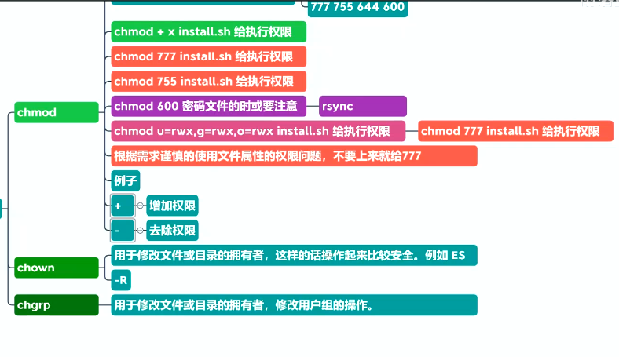

```bash
- 常用指令
	ctrl-c:常用于终止正在运行的程序
	ctrl-z:常用于挂起一个进程
	ctrl-d:作用相当于在终端中输入exit后回车
	ctrl-s：中断控制台输出；
	ctrl-q：恢复控制台输出；
	ctrl-l：清屏
```

# Linux命令

## 1.查看文件

```bash
1.cat ：一次性显示文件的全部内容，如果文件很长不建议使用cat
	cat [-nb] fileName
	参数说明：
        n或--number：由 1 开始对所有输出的行数编号
        -b 或 --number-nonblank：和 -n 相似，只不过对于空白行不编号
2.head ：head命令默认显示文件开头10行
	head [-cnqv] fileName
	参数说明：
        -c<数目> 显示的字节数。
        -n<行数> 显示的行数。
        -q 隐藏文件名
        -v 显示文件名
3.tail ： 和head类似，可以显示尾部10行文本
	tail [参数] fiilName
	参数说明：
		-n<行数> 显示文件的尾部 n 行内容
		-c<数目> 显示的字节数
		-v 显示详细的处理信息
		-q 不显示处理信息
		-f 循环读取
4.less : 一般对于行数超过3个屏幕的文件，可以使用less命令查看一般对于行数超过3个屏幕的文件，可以使用less命令查看	
	注意：翻页使用空格键、翻页键或者上下箭头
	
5.more : Linux more 命令类似 cat ，不过会以一页一页的形式显示，更方便使用者逐页阅读，而最基本的指令就是按空白键（space）就往下一页显示，按 b 键就会往回（back）一页显示，而且还有搜寻字串的功能（与 vi 相似）
    Enter 向下n行，需要定义。默认为1行
    Ctrl+F 向下滚动一屏
    空格键 向下滚动一屏
    Ctrl+B 返回上一屏
    = 输出当前行的行号
    ：f 输出文件名和当前行的行号
    V 调用vi编辑器
    !命令 调用Shell，并执行命令
    q 退出more
```

## 2.chmod

```bash
---------------------给文件赋权限
chmod:change mode 控制用户对文件的权限命令
linux文件调用权限分为三级：文件所有者(owner)、用户组(group)、其他用户(other users)
[r w x][r w x][r w x]	->	[4 2 1]

语法：chmod mode file
参数说明：
	mode:权限设定字符	[ugoa][[+-=][rwxX]...][,...]
	其中：u表示文件拥有者(user)、g表示与该文件的拥有者属于同一群体(group)者、o表示其他意外的人(others)，a表示这三者皆是(all)
	+ 表示增加权限、- 表示取消权限、= 表示唯一设定权限
	r 表示可读取，w 表示可写入，x 表示可执行，X 表示只有当该文件为目录文件，或者其他类型的用户有可执行权限时，才将文件权限设置可执行
	-R： 对目前目录下的所有文件与子目录进行相同的权限变更(即以递归的方式逐个变更 recursion递归)
命令及说明
chmod ugo+r file			给file的所以用户增加读权限
chmod a-x file				删除file的所有用户的执行权限
chmod ug+w,o-w file1 file2	将file1和file2的拥有者和同一群体可以写入，其他人不能写入
chmod -R a+r *				将目前目录下的所有文件与子目录皆设为任何人可读取 
chmod 777 file				chmod也可以用数字来表示权限.chmod abc file分别表示a b c为User、Group、及Other的权限	
```

## 3.netstat

 **netstat** 的命令用来显示网络状态

```bash
-a: --all 显示所有链接和监听端口
-n: 进制使用域名解析功能。链接以数字形式展示(IP地址)，而不是通过主机名或域名形式展示
-t: 所有的 tcp 协议的端口
-u: 所有的 udp 协议的端口
-p: --programs，与链接相关程序名和进程的PID
-l: --listening，显示所有监听的端口

命令使用：
netstat -anp：显示系统端口使用情况
netstat -nupl：UDP类型的端口
netstat -ntpl：TCP类型的端口
netstat -l：只显示所有监听端口
netstat -lt：只显示所有监听tcp端口
netstat -ntpl | grep -i 8080： 查看某个端口是否开放
netstat ip port: 测试远程主机端口是否打开
```

## 4.yum源修改为国内

**1.把默认yum源备份(可选)**

```shell
mkdir -p /etc/yum.repos.d.bak/
mv /etc/yum.repos.d/* /etc/yum.repos.d.bak/
```

**2.下载aliyun yum源到repo文件(对应自己系统版本下载即可)**

```shell
# 1.查看系统版本
cat /etc/redhat-release

# 2.各系统版本repo文件对应的下载操作(没有wget命令，手动下载后上传至/etc/yum.repos.d/目录下)
CentOS 5
wget -O /etc/yum.repos.d/CentOS-Base.repo http://mirrors.aliyun.com/repo/Centos-5.repo
CentOS 6
wget -O /etc/yum.repos.d/CentOS-Base.repo http://mirrors.aliyun.com/repo/Centos-6.repo
CentOS 7
wget -O /etc/yum.repos.d/CentOS-Base.repo http://mirrors.aliyun.com/repo/Centos-7.repo
```

**3.清除缓存**

```shell
[root@abcd ~]# yum clean all
[root@abcd ~]# yum makecache        //把Yum源缓存到本地，加快软件的搜索好安装速度
[root@abcd ~]# yum list        //总共列出了10656个包
```

## 5.scp 

```shell
# 复制文件到另外一台主机上的指定文件夹下
scp  -r  HOME/.kube   node1: HOME/
```


# Shell

```bash
a=`touch /test`      表示转义，` `中的的内容会被执行，即执行touch /test创建一个文件
>/test				 输出重定向，将要输出的内容写入/test中，若是没有/test文件则创建再写入
```


# Linux学习

##  文件和目录管理

`pwd`：显示当前的工作路径

`cd`：改变当前目录(进入到某个目录中) 

* /表示根目录	~表示家目录	.表示当前目录 ..表示当前目录的上一级目录	-表示上一次进入的目录

`ls`：查看当前目录的内容(可见)	

* ls -l 以想学习信息的方式显示目录的可见内容
* ls -a 想查看所有目录
* ls -al 想查看所有文件(可见 和 隐藏) -all -list所有

`mkdir` 创建一个或多个空的目录

* -p 逐层的去创建 

`rmdir`：删除一个空目录

`rm`：删除目录或文件	

* -r 递归删除
* -f 强制删除，不需要确认
* -i 删除前逐一的询问确认

`touch`创建文件

`cp` 复制文件或目录

* -r 递归的复制(复制一个目录下所有的内容)

`mv`：当前目录下的操作 重命名      相同/不同 移动文件或目录

`echo`输出

* \> 输出重定向 \> 覆盖方式写入
* \>> 输出重定向 \>> 追加方式写入

`cat`：文件从头开始显示

`tac`：查看文件内容，从文件最后一行开始显示

`nl`：查看文件内容，从文件的最后一行开始显示

`tail`： -n 3 查看几行



`whoami`：显示当前用户

`su`：切换系统中不用的用户

## 日期同步

Centos操作系统，执行`date`命令发现日期不正确，与当前日期差了12小时，格式是`EDT`

使用`NTP`(network time protocol)同步后，依然不正确

```shell
# 实际时间 2021年7月26日12:50:38
[root@hadoop2 ~]# date
2021年 07月 26日 星期一 00:50:47 EDT

# NTP时钟同步
[root@hadoop2 ~]# ntpdate ntp1.aliyun.com
26 Jul 00:51:16 ntpdate[67431]: step time server 120.25.115.20 offset -2.724103 sec

# NTP时钟同步后，依然不正确
[root@hadoop2 ~]# date
2021年 07月 26日 星期一 00:51:20 EDT
```

**方法一**

修改时区： `timedatectl set-timezone Asia/Shanghai`

```shell
# 原来，时区设置指向了美国纽约
[root@hadoop2 ~]# ll /etc/localtime
lrwxrwxrwx. 1 root root 38 7月  30 2020 /etc/localtime -> ../usr/share/zoneinfo/America/New_York

# 修改时区
[root@hadoop2 ~]# timedatectl set-timezone Asia/Shanghai

[root@hadoop2 ~]# date
2021年 07月 26日 星期一 12:56:13 CST

# 查看新的软链接
[root@hadoop2 ~]# ll /etc/localtime
lrwxrwxrwx. 1 root root 35 7月  26 12:56 /etc/localtime -> ../usr/share/zoneinfo/Asia/Shanghai
```


