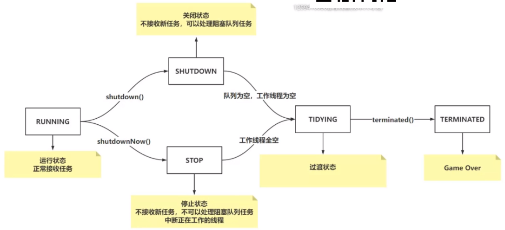
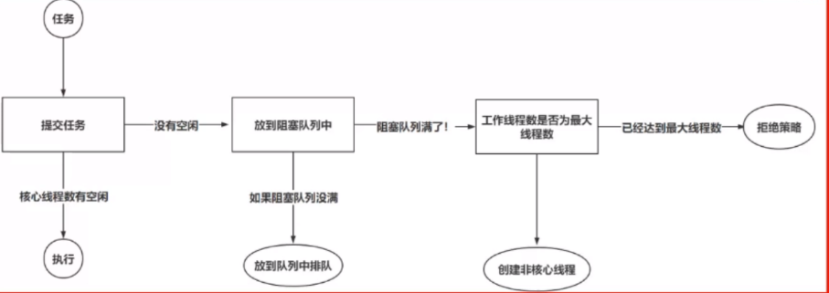

# 一、线程池

```java
	// 是一个原子类型的int数值，表达了两个意思  1：声明当前线程池的状态   2.声明线程池中的线程数
    // 高3位是：线程池状态   低29位是：线程池中的线程个数
    private final AtomicInteger ctl = new AtomicInteger(ctlOf(RUNNING, 0));
    private static final int COUNT_BITS = Integer.SIZE - 3;                     // 29位，方便后面做位运算
    private static final int CAPACITY   = (1 << COUNT_BITS) - 1;                // 通过位运算可以得出最大容量

    // 线程池状态 - 高3位
    // -1 -> 11111111 11111111 11111111 11111111 -> 左移29位 -> 11100000 00000000 00000000 00000000  => 所以高3位为111代表RUNNING
    private static final int RUNNING    = -1 << COUNT_BITS;
    private static final int SHUTDOWN   =  0 << COUNT_BITS;                     // 高3位为000 代表SHUTDOWN   代表此时不接受新任务，但是内部还会处理阻塞队列中的任务，以及正在执行的任务       shutdown()
    private static final int STOP       =  1 << COUNT_BITS;                     // 高3位为001 代表STOP   不接收新任务，而且不执行阻塞队列中的任务，同时会中断正在执行的任务                   shutdownNow()
    private static final int TIDYING    =  2 << COUNT_BITS;                     // 高3位为010 代表TIDYING 是一个过渡的状态，代表当前线程池即将game over       
    private static final int TERMINATED =  3 << COUNT_BITS;                     // 高位3位011 代表TERMINATED 此时线程池真正的结束了

    // 装箱和拆箱ctl
    // ~CAPACITY -> 11100000 00000000 00000000 00000000
    private static int runStateOf(int c)     { return c & ~CAPACITY; }          // 获得线程池的状态
    private static int workerCountOf(int c)  { return c & CAPACITY; }           // 获取当前线程池的线程数量(核心 + 非核心)
    private static int ctlOf(int rs, int wc) { return rs | wc; }
```

**线程池状态变化**



**线程池执行流程**



**execute方法源码**

```java
public void execute(Runnable command) {
    // 健壮性的判断
    if (command == null)
        throw new NullPointerException();
    // 获得32位的int
    int c = ctl.get();
    // 获得   工作线程数   < 核心线程数
    if (workerCountOf(c) < corePoolSize) {
        // 进到if，代表可以创建 核心 线程数
        if (addWorker(command, true))
            // 到这结束
            return;
        // 失败：是并发的原因。举例 0:1 此时线程a、b都进入addWorker，但只有一个线程可以创建核心线程成功，另一个就会失败，所以需要重新获取一下ctl
        // 如果if没进入，代表创建核心线程数失败，重新获取ctl 32位的int
        c = ctl.get();
    }
    // 判断线程池是不是running状态，将任务添加到阻塞队列中
    // 即如果线程池处于运行状态，且上面创建任务失败，则将其放入队列中
    if (isRunning(c) && workQueue.offer(command)) {
        // 再次获取ctl
        int recheck = ctl.get();
        // 再次判断一下是否是Running状态   如果不是RUNNING,移除任务
        if (! isRunning(recheck) && remove(command))
            // 拒绝策略
            reject(command);
        else if (workerCountOf(recheck) == 0)   // 如果线程池处于RUNNING状态，但是工作线程为0
            addWorker(null, false);  // 阻塞队列有任务，但是没有工作线程，添加一个任务为空的工作任务线程处理阻塞队列中的任务
    }
    // 队列满了 创建非核心线程，处理任务
    else if (!addWorker(command, false))
        // 如果创建失败 则执行拒绝策略
            reject(command);
}
```

**addWork源码**

```java
private boolean addWorker(Runnable firstTask, boolean core) {
    // retry是给for循环一个标记，作用是可以从内部for循环通过break retry跳出外部的for循环
    // 外侧for循环用于判断状态 内侧for循环用于线程数+1
    retry:
    // for循环实现功能： 经过大量的判断，真正将 线程数 + 1
    for (;;) {
        // 获取ctl 32位
        int c = ctl.get();
        // 获取线程池状态
        int rs = runStateOf(c);

        // Check if queue empty only if necessary.
        // 除了RUNNING都有可能  第一种创建任务失败的情况
        // 即STOP TIDYING TERMINATED状态一定失败 ,因为此时不需要添加线程处理任务
        // 如果是 SHUTDOWN 或 firstTask不为null 或工作队列为空则失败
        if (rs >= SHUTDOWN &&
            ! (rs == SHUTDOWN &&
               firstTask == null &&
               ! workQueue.isEmpty()))
            // !( rs == SHUTDOWN 且 传入任务为空 且 阻塞队列不为空 )
            // 说明构建工作线程失败
            return false;

        for (;;) {
            // 获取工作线程池个数
            int wc = workerCountOf(c);
            // 如果当前线程数已经大于等于线程池最大容量，不去创建
            // 判断wc是否超过核心线程数量或者最大线程
            if (wc >= CAPACITY ||
                wc >= (core ? corePoolSize : maximumPoolSize))
                // 创建失败
                return false;
            // 将工作线程数+1 采用CAS方式
            if (compareAndIncrementWorkerCount(c))
                // 成功就退出外侧for循环
                break retry;
            // 如果失败了 重新获取ctl 失败原因只有：有人和你并发操作了
            c = ctl.get();
            // 判断一下状态 如果有变化
            if (runStateOf(c) != rs)
                // 结束这次外侧for循环，开始下次外侧for循环
                continue retry;
            // 否则 CAS失败由于workCount改变了，重新内侧循环
            // 如果状态没变化，重新执行内侧循环即可
        }
    }

    // work开始 = false
    boolean workerStarted = false;
    // work添加 = false
    boolean workerAdded = false;
    // Work就是工作线程
    Worker w = null;
    try {
        // 创建Worker,传入任务
        w = new Worker(firstTask);
        // 从Wrok获取线程t
        final Thread t = w.thread;
        // 如果线程t 不为 null
        if (t != null) {
            // 开始加锁了 原因：获取线程池的全局锁，避免我添加任务时，其他线程干掉了线程池，因为干掉线程池需要先获取这个锁
            final ReentrantLock mainLock = this.mainLock;
            mainLock.lock();    // 加锁
            try {
                // Recheck while holding lock.
                // Back out on ThreadFactory failure or if
                // shut down before lock acquired.
                // 获取线程池状态 原因：加锁之前，ctl会被其他线程改变
                int rs = runStateOf(ctl.get());
                // RUNNING状态 或  为SHUTDOWN且firstTask为null
                if (rs < SHUTDOWN ||
                    (rs == SHUTDOWN && firstTask == null)) {
                    // 线程是否为运行状态
                    if (t.isAlive()) // precheck that t is startable
                        throw new IllegalThreadStateException();
                    // 将工作线程添加到集合 workers是一个HashSet
                    workers.add(w);
                    // 获取工作线程个数
                    int s = workers.size();
                    // 如果线程工作线程数，大于之前记录的最大工作线程数，就替换一下
                    if (s > largestPoolSize)
                        largestPoolSize = s;
                    // 添加工作线程为空
                    workerAdded = true;
                }
            } finally {
                // 添加工作成功，解锁
                mainLock.unlock();
            }
            // 如果添加成功
            if (workerAdded) {
                // 启动线程
                t.start();
                // 启动线程成功
                workerStarted = true;
            }
        }
    } finally {
        // 如果启动工作线程失败，调用下面的方法
        if (! workerStarted)
            addWorkerFailed(w);
    }
    // 返回工作是否启动
    return workerStarted;
}
```

**封装Worker**

```java
 private final class Worker extends AbstractQueuedSynchronizer implements Runnable
 {
     /**
       * This class will never be serialized, but we provide a
       * serialVersionUID to suppress a javac warning.
       */
     private static final long serialVersionUID = 6138294804551838833L;

     /** Thread this worker is running in.  Null if factory fails. */
     final Thread thread;
     /** Initial task to run.  Possibly null. */
     Runnable firstTask;
     /** Per-thread task counter */
     volatile long completedTasks;

     /**
         * Creates with given first task and thread from ThreadFactory.
         * @param firstTask the first task (null if none)
         */
     Worker(Runnable firstTask) {
         setState(-1); // inhibit interrupts until runWorker
         this.firstTask = firstTask;
         //
         this.thread = getThreadFactory().newThread(this);
     }
}
```

**runWork方法**

```java
final void runWorker(Worker w) {
    // 获取当前线程
    Thread wt = Thread.currentThread();
    // 拿到了任务
    Runnable task = w.firstTask;
    w.firstTask = null;
    // 这个是AQS的东西 其实就是AQS的release 先不关注
    w.unlock(); // allow interrupts
    // 标识为true
    boolean completedAbruptly = true;
    try {
        // 如果任务不为空，执行任务  如果任务为空，通过getTask从阻塞队列中获取任务
        // 就是在getTask地方复用的
        // 如果是非核心线程阻塞者获取，如果超过了最大时间则会销毁，如果是核心线程则阻塞着直到获得任务
        while (task != null || (task = getTask()) != null) {
            // 上锁 避免你shutdown我任务也不会中断
            w.lock();
            // If pool is stopping, ensure thread is interrupted;
            // if not, ensure thread is not interrupted.  This
            // requires a recheck in second case to deal with
            // shutdownNow race while clearing interrupt
            // 获取当前状态，判断当前状态是否>=STOP(即STOP TIDYING TERMINATED) 悲剧！
            if ((runStateAtLeast(ctl.get(), STOP) ||
                 (Thread.interrupted() &&
                  runStateAtLeast(ctl.get(), STOP))) &&
                !wt.isInterrupted())
                wt.interrupt();
            try {
                // 执行任务前的操作
                beforeExecute(wt, task);
                Throwable thrown = null;
                try {
                    // 开始执行任务
                    task.run();
                } catch (RuntimeException x) {
                    thrown = x; throw x;
                } catch (Error x) {
                    thrown = x; throw x;
                } catch (Throwable x) {
                    thrown = x; throw new Error(x);
                } finally {
                    // 执行任务后的操作
                    afterExecute(task, thrown);
                }
            } finally {
                task = null;
                w.completedTasks++;
                w.unlock();
            }
        }
        completedAbruptly = false;
    } finally {
        processWorkerExit(w, completedAbruptly);
    }
}
```


**getTask  processWorkerExit**