# 一、JAVA

## 1.JRE安装(linux版本)

```bash
下载网址：https://www.oracle.com/java/technologies/downloads/archive/
文件名:jre-8u311-linux-x64.tar.gz
电脑路径：D:\安装包\Java

1.解压tar -xzvf jre-8u311-linux-x64.tar.gz -C [targetPath
2.将解压后的文件放到/usr/lib/java
3.修改环境变量	vim /etc/profile
export JAVA_HOME=/usr/lib/java/jre1.8.0_311
export PATH=$JAVA_HOME/bin:$PATH
export CLASSPATH=.:$JAVA_HOME/lib/dt.jar:$JAVA_HOME/lib/tools.jar
4.使配置文件生效 source /etc/profile
```

## 2.编译jdk1.8源码

**1.在自己安装好的jdk1.8版本目录下，找到src.zip，就是源码**

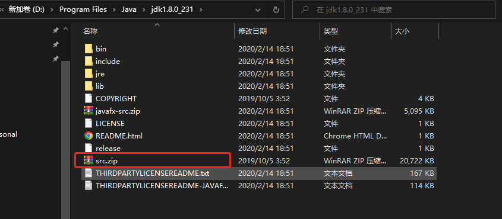

**2.然后解压到另外一个目录下(自己选择合适的位置)**

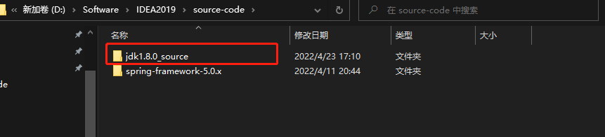

**3.找到自己的项目并导入**

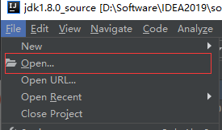

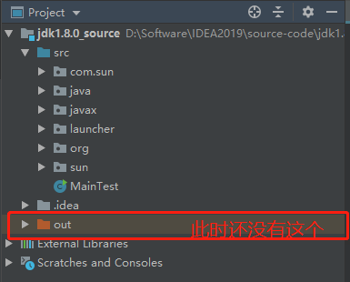

**4.导入后会发现这个java文件不可识别，此时需要将src标记为资源目录即可**

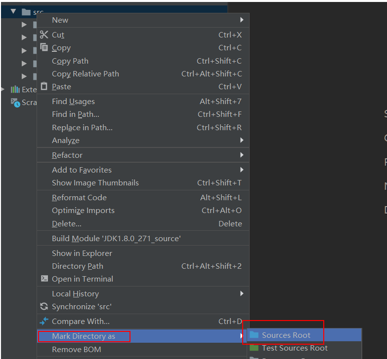

**5.设置编译内存，由原来的700改为1000或更高，防止后面编译因内存不足而失败**

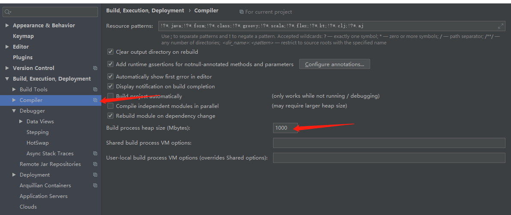

**6.新建sun包，awt包和UNIXToolkit类，font包和FontConfigManager，具体内容见jdk1.8源码工程部分**

**7.导入库和改变路径等操作**

7.1 导入编译器的库，

 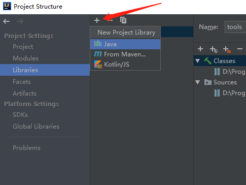


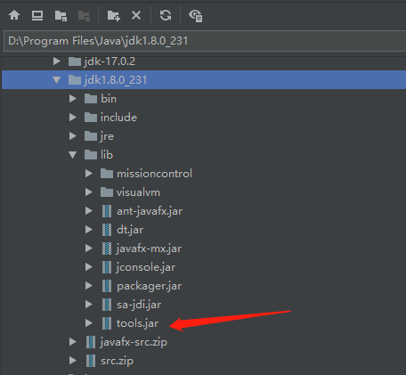

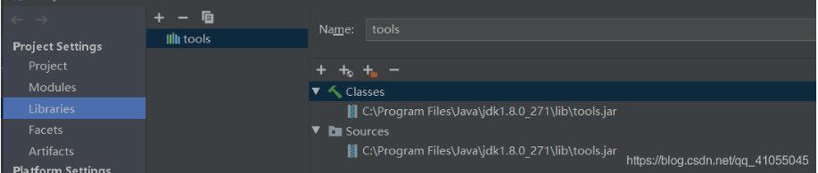

7.2配置新的JDK,并配置源码为自己的代码

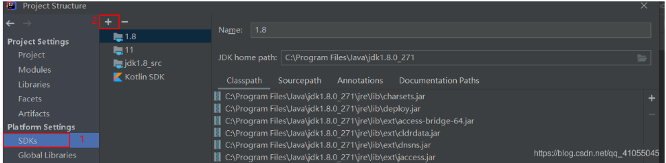

此时还是选官方的jdk导入

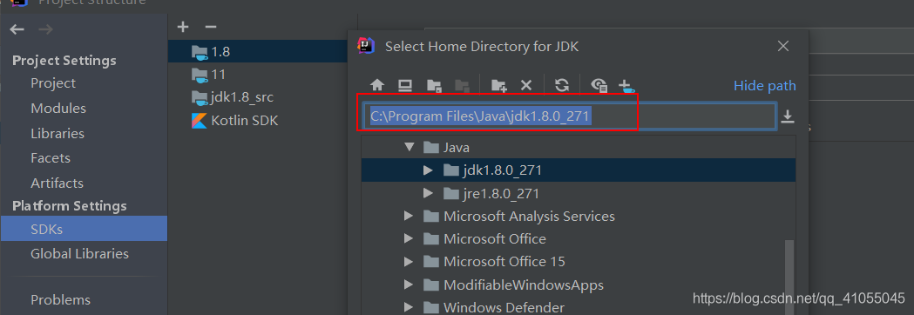

改jdk名字，且替换源码为自己代码

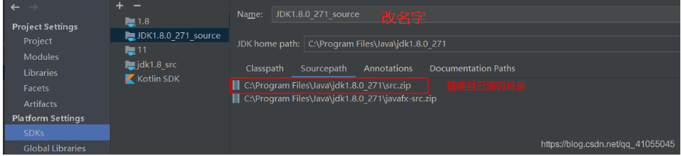

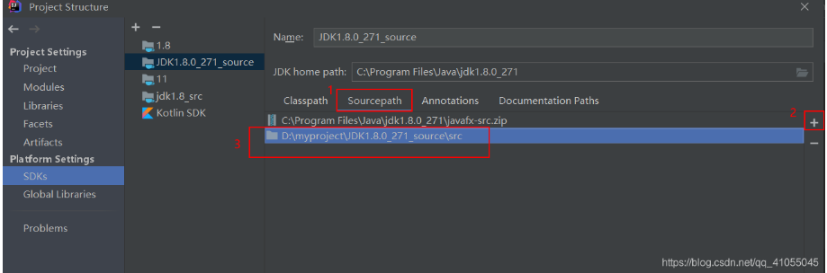

**8.设置编译输出文件位置和语言级别**

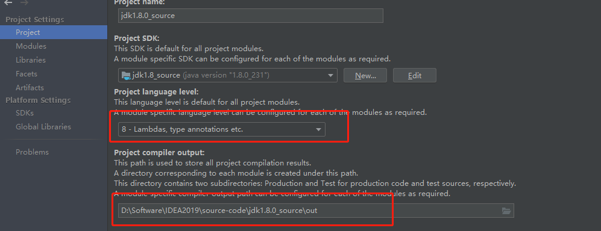

**运行编译成功！！！**

# 二、MySQL

## 1.mysql安装(linux版本)

```bash
下载网址：https://dev.mysql.com/downloads/mysql/
文件名：mysql-5.7.37-linux-glibc2.12-x86_64.tar.gz
电脑路径：D:\安装包\MySQL

1.解压 tar -xvzf mysql-5.7.37-linux-glibc2.12-x86_64.tar.gz
2.移动并重命名 mv mysql-5.7.26-linux-glibc2.12-x86_64 /usr/local/mysql
3.进入 cd /usr/local
4.创建mysql用户组和用户并修改权限 
	* groupadd mysql
	* useradd -r -g mysql mysql
5.创建数据目录并赋予权限
	mkdir -p  /data/mysql  #创建目录
	chown mysql:mysql -R /data/mysql #赋予权限
6.配置my.cnf 	vim /etc/my.cnf
[mysqld]
bind-address=0.0.0.0	# 广播
port=3306	# 端口号
user=mysql	
basedir=/usr/local/mysql	# 路径
datadir=/data/mysql	# 数据文件路径
socket=/tmp/mysql.sock
log-error=/data/mysql/mysql.err
pid-file=/data/mysql/mysql.pid
#character config
character_set_server=utf8mb4
symbolic-links=0
explicit_defaults_for_timestamp=true
7.初始化数据库 进入mysql的bin目录
	* cd /usr/local/mysql/bin/
	* ./mysqld --defaults-file=/etc/my.cnf --basedir=/usr/local/mysql/ --datadir=/data/mysql/ --user=mysql --initialize
8.	查看密码	cat /data/mysql/mysql.err
	A temporary password is generated for root@localhost: ;qqfFASaw45
9.	启动mysql
	- 先将mysql.server放置到/etc/init.d/mysql中
	* cp /usr/local/mysql/support-files/mysql.server /etc/init.d/mysql
	* 启动 service mysql start
	* 打印进程 ps -ef|grep mysql
10.修改密码
	* 进入mysql ./mysql -u root -p
	* 输入下面 修改密码
	SET PASSWORD = PASSWORD('123456');
	ALTER USER 'root'@'localhost' PASSWORD EXPIRE NEVER;
	FLUSH PRIVILEGES; 
	* 解决远程连接不上的问题
	use mysql                                            #访问mysql库
	update user set host = '%' where user = 'root';      #使root能再任何host访问
	FLUSH PRIVILEGES;                                    #刷新
11.软链接成系统命令
	ln -s  /usr/local/mysql/bin/mysql    /usr/bin
	
	
- 命令行创建库表
create database table_name;
show databases;
use table_name;
创建语句
```

# 三、Linux

## 3.1 安装网卡

**环境配置**

* linux版本： centos 8.x

1. ip addr   查看IP

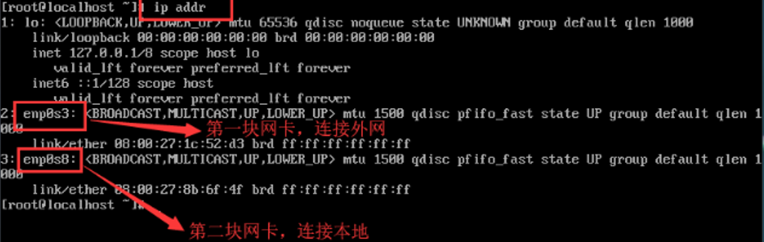

2. 配置第一块网卡---可以连外网

   ```linux
   vi /etc/sysconfig/network-scripts/ifcfg-enp0s3  
   ```

   修改配置文件如下：ONBOOT自启动 

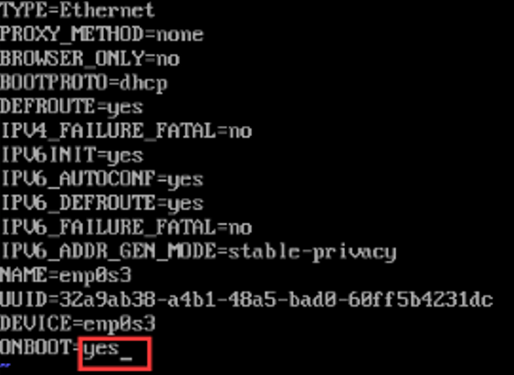

3. 配置第二块网卡---可以连本地

   ```linux
   vi /etc/sysconfig/network-scripts/ifcfg-enp0s8
   
   # 修改4处
   BOOTPBOTO=static  		//静态IP
   ONBOOT=yes 			//自启动
   IPADDR=192.168.56.134 	//IP地址
   NETMASK=255.255.255.0 	//子网掩码
   ```

   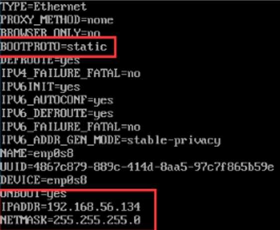

4. 重启网络

   ```linux
   # centos8.x 重启网络
   # 使用nmcli重新回载网络配置，不使用service network restart
   nmcli c reload
   	
   # centos 7.x  
   service network restart   # 或
   systemctl restart network
   ```

## 3.2 部署Docker

**1.查看系统的内核版本**

```bash
[root@CodeGuide ~]# uname -r
4.18.0-80.11.2.el8_0.x86_64

[root@localhost ~]# cat /etc/os-release 
NAME="CentOS Linux"
VERSION="8 (Core)"
ID="centos"
ID_LIKE="rhel fedora"
VERSION_ID="8"
PLATFORM_ID="platform:el8"
PRETTY_NAME="CentOS Linux 8 (Core)"
ANSI_COLOR="0;31"
CPE_NAME="cpe:/o:centos:centos:8"
HOME_URL="https://www.centos.org/"
BUG_REPORT_URL="https://bugs.centos.org/"

CENTOS_MANTISBT_PROJECT="CentOS-8"
CENTOS_MANTISBT_PROJECT_VERSION="8"
REDHAT_SUPPORT_PRODUCT="centos"
REDHAT_SUPPORT_PRODUCT_VERSION="8"
```

* x86 64位系统，如果是32位是不能安装 docker 的

**2.yum更新到最新版本**

大家都知道Centos8于2021年年底停止了服务，大家再在使用yum源安装时候，出现下面错误“错误：Failed to download metadata for repo ‘AppStream’: Cannot prepare internal mirrorlist: No URLs in mirrorlist”

```bash
1.进入yum的repos目录
cd /etc/yum.repos.d/
2.修改所有的CentOS文件内容
sed -i 's/mirrorlist/#mirrorlist/g' /etc/yum.repos.d/CentOS-*

sed -i 's|#baseurl=http://mirror.centos.org|baseurl=http://vault.centos.org|g' /etc/yum.repos.d/CentOS-*
```

更新yum版本

```bash
[root@CodeGuide ~]# sudo yum update
Last metadata expiration check: 1:15:10 ago on Sat 27 Nov 2021 04:22:53 PM CST.
Dependencies resolved.
Nothing to do.
Complete!
```

设置镜像仓库

```bash
yum-config-manager \
	--add-repo \
	http://mirrors.aliyun.com/docker-ce/linux/centos/docker-ce.repo # 阿里云的，下载快    
```

**3.安装Docker所需的依赖包**

```bash
[root@CodeGuide ~]# sudo yum install -y yum-utils device-mapper-persistent-data lvm2   
```

**4.设置Docker的yum源**

```bash
yum-config-manager \
    --add-repo \
    https://download.docker.com/linux/centos/docker-ce.repo #默认国外的
    
yum-config-manager \
	--add-repo \
	http://mirrors.aliyun.com/docker-ce/linux/centos/docker-ce.repo # 阿里云的，下载快     
```

**5.查看仓库所有Docker版本**

```bash
[root@CodeGuide ~]# yum list docker-ce --showduplicates | sort -r
```

**6.安装Docker出现和Podman冲突**

尝试在命令行中添加 ‘–allowerasing’ 来替换冲突的软件包 或 ‘–skip-broken’ 来跳过无法安装的软件包 或 ‘–nobest’ 来不只使用软件包的最佳候选,加上 --allowerasing 即可

```bash
sudo yum install docker-ce docker-ce-cli containerd.io --allowerasing
```

**7.启动Docker并添加开机自启动**

```bash
# 启动 Docker
[root@CodeGuide ~]# sudo systemctl start docker
# 设置开机启动 Docker
[root@CodeGuide ~]# systemctl enable docker
```

**8.查看Docker版本**

```bash
[root@localhost /]# docker --version
Docker version 20.10.15, build fd82621
```

**9.卸载Docker**

```bash
[root@CodeGuide ~]# sudo yum remove docker \
                  docker-client \
                  docker-client-latest \
                  docker-common \
                  docker-latest \
                  docker-latest-logrotate \
                  docker-logrotate \
                  docker-selinux \
                  docker-engine-selinux \
                  docker-engine
```

**10.Docker常用命令**

```bash
[root@CodeGuide ~]# docker --help				#Docker帮助
[root@CodeGuide ~]# docker --version			#查看Docker版本

############################## 镜像常用命令
[root@CodeGuide ~]# docker search <image>		#搜索镜像文件，如：docker search mysql
[root@CodeGuide ~]# docker pull <image><:tag>	#拉取镜像文件， 如：docker pull mysql
[root@CodeGuide ~]# docker images				#查看已经拉取下来的所以镜像文件
[root@CodeGuide ~]# docker rmi <image>		    #删除指定镜像文件

############################## 容器常用命令
[root@CodeGuide ~]# docker run --name <name> -p 80:8080 -d <image>		#发布指定镜像文件
-p: 指定容器的端口 -P: 随机指定端口 -it: 使用交互方式运行，进入容器查看内容 -d后台运行
-e: 设置环境变量
[root@CodeGuide ~]# docker ps					 #查看正在运行的所有镜像
[root@CodeGuide ~]# docker ps -a				 #查看所有发布的镜像
[root@CodeGuide ~]# docker rm 容器id			   	#删除执行已发布的镜像
[root@CodeGuide ~]# docker start 容器id			# 启动容器
[root@CodeGuide ~]# docker restart 容器id			# 重启容器
[root@CodeGuide ~]# docker stop 容器id			# 停止当前正在运行的容器
[root@CodeGuide ~]# docker kill 容器id			# 强制停止当前容器
ctrl + P + Q 或 exit							   	 #退出容器

############################## 其他常用命令
[root@CodeGuide ~]# docker top 容器id				# 查看容器中进程信息top
[root@CodeGuide ~]# docker inspect 容器id			# 查看镜像的元数据
[root@CodeGuide ~]# docker exec -it 4a9d0a79f028 /bin/bash	# 进入当前正在运行的容器
[root@CodeGuide ~]# docker cp 容器id:容器内路径 目的主机路径   # 从容器内拷贝文件到主机上
[root@CodeGuide ~]# docker -v 主机目录：容器目录				 # 使用数据卷命令挂载
```

**11.安装可视化界面Portainer**

```bash
- 1.创建一个 portainer 下的 public 文件夹
mkdir -p /data/portainer/data /data/portainer/public

- 2.拉取最新的 Portainer
docker pull portainer/portainer

- 3.安装和启动
docker run -d --restart=always --name portainer -p 9000:9000 -v /var/run/docker.sock:/var/run/docker.sock -v /data/portainer/data:/data -v /data/portainer/public:/public portainer/portainer

- 4.访问地址：http:127.0.0.1:9000/
```

启动portainer之前，将汉化包文件上传至服务器/data/portainer/public文件夹中

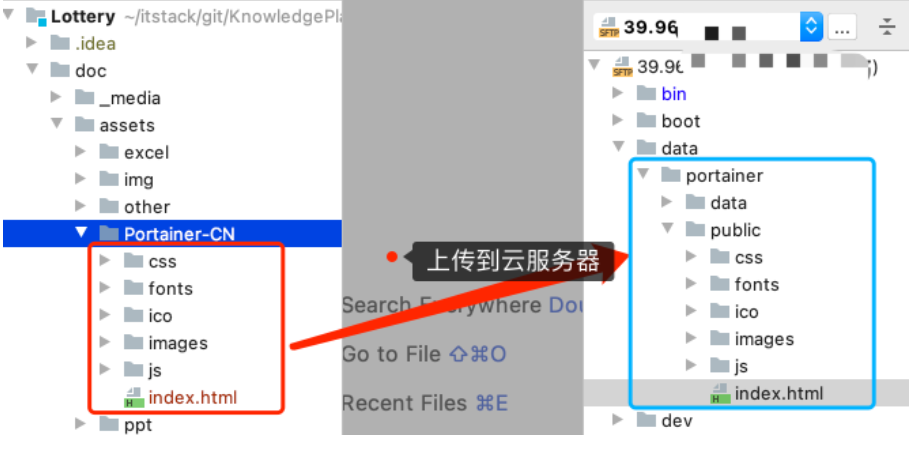

## 3.3 Docker部署Mysql

**1.使用docker命令下载mysql8.0镜像**

```bash
docker pull mysql:8.0
```

**2.创建文件夹做挂载**

```bash
//创建文件夹做挂载
mkdir -p /home/mysql/conf /home/mysql/data
//创建my.cnf配置文件
vi /home/mysql/conf/my.cnf
```

my.cnf添加如下内容

```txt
[mysqld]
user=mysql
character-set-server=utf8
default_authentication_plugin=mysql_native_password
secure_file_priv=/var/lib/mysql
expire_logs_days=7
sql_mode=STRICT_TRANS_TABLES,NO_ZERO_IN_DATE,NO_ZERO_DATE,ERROR_FOR_DIVISION_BY_ZERO,NO_ENGINE_SUBSTITUTION
max_connections=1000
 
[client]
default-character-set=utf8
 
[mysql]
default-character-set=utf8
```

**3.创建启动容器**

```bash
docker run --restart=always --privileged=true -p 3306:3306 --name mysql \
-v /home/mysql/log:/var/log/mysql -v/home/mysql/data:/var/lib/mysql \
-v /home/mysql/conf/my.cnf:/etc/mysql/my.cnf \
-v /home/mysql/conf/conf.d:/etc/mysql/conf.d \
-e MYSQL_ROOT_PASSWORD=ljldmysql \
-d mysql:8.0
```

**4.授予远程登录权限**

```bash
- 1.以bash方式进入容器内部
docker exec -it mysql bash

- 2. 登陆
mysql -u root -p

- 3.执行use mysql;

- 4.授予权限，%表示host不受限制，如果是本机使用localhost
grant all privileges on *.* to 'root'@'%';

- 5.刷新权限
flush privileges;

6.
原因是mysql 8以上默认使用的是caching_sha2_password身份验证机制，之前用的是mysql_native_password。 从5.7升级到8.0不会改变现有用户的身份验证方式，但新用户会默认使用新的cacthing_sha2_password

解决：修改用户的密码加密方式
ALTER USER 'root'@'%' IDENTIFIED WITH mysql_native_password BY '密码';
flush privileges;
```

## 3.4 Docker部署Kafka

**1.下载镜像**

```bash
docker pull wurstmeister/kafka
docker pull wurstmeister/zookeeper
```

**2.启动Zookeeper**

```bash
docker run -d --restart=always --privileged=true --name zookeeper -p 2181:2181 -t wurstmeister/zookeeper
```

**3.启动Kafka**

```bash
docker run -d --restart=always --name kafka \
-p 9092:9092 \
-e KAFKA_BROKER_ID=0 \
-e KAFKA_ZOOKEEPER_CONNECT=192.168.56.137:2181 \
-e KAFKA_ADVERTISED_LISTENERS=PLAINTEXT://192.168.56.137:9092 \
-e KAFKA_LISTENERS=PLAINTEXT://0.0.0.0:9092 wurstmeister/kafka 

```

**4.防火墙设置**

这里我们需要把 Zookeeper、Kafka 的端口对外开放；

```bash
* 设置zk 2181 端口：firewall-cmd --zone=public --add-port=2181/tcp --permanent
* 设置Kafka 9092 端口：firewall-cmd --zone=public --add-port=9092/tcp --permanent
* 重新加载：firewall-cmd --reload

* 查看已经开启的端口：firewall-cmd --list-ports
* 关闭端口：firewall-cmd --zone=public --remove-port=443/tcp --permanent 

```

**5.进入并启动Zookerper**

```bash
- 1. 启动
	./zkServer.sh start
- 2. 检查状态
	./zkServer.sh status
- 3. 停止
	./zkServer.sh stop	
```

**6.进入并启动Kafka**

```bash
docker exec -it kafka bash

- 1. 启动 --- 守护线程
	bin/kafka-server-start.sh  -daemon 	config/server.properties
- 2. 停止
	bin/kafka-server-stop.sh stop
- 3. 创建主题
	bin/kafka-topics.sh --create --zookeeper ip:2181 --replication-factor 1 --partitions 1 --topic topicName
- 4. 列主题
	bin/kafka-topics.sh --list --zookeeper ip:2181
- 5. 删除主题
	bin/kafka-topics.sh –delete --zookeeper 192.168.56.134:2181 –-topic topicName
- 6. 查主题
	bin/kafka-topics.sh --describe --topic first --zookeeper ip:2181
	
测试
- 启动生产者
	bin/kafka-console-producer.sh --broker-list ip:9092 --topic test
- 启动消费者
	bin/kafka-console-consumer.sh --bootstrap-server ip:9092 --topic test --from-beginning
```

## 3.5 Docker安装xxl-job

XXL-JOB是一个分布式任务调度平台，基于MySQL

**1.导入sql**

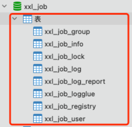

```sql
create database xxl_job;

USE xxl_job;

SET NAMES utf8mb4;
SET FOREIGN_KEY_CHECKS = 0;

-- ----------------------------
-- Table structure for xxl_job_group
-- ----------------------------
DROP TABLE IF EXISTS `xxl_job_group`;
CREATE TABLE `xxl_job_group` (
  `id` int(11) NOT NULL AUTO_INCREMENT,
  `app_name` varchar(64) NOT NULL COMMENT '执行器AppName',
  `title` varchar(12) NOT NULL COMMENT '执行器名称',
  `address_type` tinyint(4) NOT NULL DEFAULT '0' COMMENT '执行器地址类型：0=自动注册、1=手动录入',
  `address_list` text COMMENT '执行器地址列表，多地址逗号分隔',
  `update_time` datetime DEFAULT NULL,
  PRIMARY KEY (`id`)
) ENGINE=InnoDB AUTO_INCREMENT=3 DEFAULT CHARSET=utf8mb4;

-- ----------------------------
-- Records of xxl_job_group
-- ----------------------------
BEGIN;
INSERT INTO `xxl_job_group` VALUES (1, 'xxl-job-executor-sample', '示例执行器', 0, NULL, '2021-11-20 20:28:29');
INSERT INTO `xxl_job_group` VALUES (2, 'lottery-job', '抽奖系统任务调度', 0, NULL, '2021-11-20 20:28:29');
COMMIT;

-- ----------------------------
-- Table structure for xxl_job_info
-- ----------------------------
DROP TABLE IF EXISTS `xxl_job_info`;
CREATE TABLE `xxl_job_info` (
  `id` int(11) NOT NULL AUTO_INCREMENT,
  `job_group` int(11) NOT NULL COMMENT '执行器主键ID',
  `job_desc` varchar(255) NOT NULL,
  `add_time` datetime DEFAULT NULL,
  `update_time` datetime DEFAULT NULL,
  `author` varchar(64) DEFAULT NULL COMMENT '作者',
  `alarm_email` varchar(255) DEFAULT NULL COMMENT '报警邮件',
  `schedule_type` varchar(50) NOT NULL DEFAULT 'NONE' COMMENT '调度类型',
  `schedule_conf` varchar(128) DEFAULT NULL COMMENT '调度配置，值含义取决于调度类型',
  `misfire_strategy` varchar(50) NOT NULL DEFAULT 'DO_NOTHING' COMMENT '调度过期策略',
  `executor_route_strategy` varchar(50) DEFAULT NULL COMMENT '执行器路由策略',
  `executor_handler` varchar(255) DEFAULT NULL COMMENT '执行器任务handler',
  `executor_param` varchar(512) DEFAULT NULL COMMENT '执行器任务参数',
  `executor_block_strategy` varchar(50) DEFAULT NULL COMMENT '阻塞处理策略',
  `executor_timeout` int(11) NOT NULL DEFAULT '0' COMMENT '任务执行超时时间，单位秒',
  `executor_fail_retry_count` int(11) NOT NULL DEFAULT '0' COMMENT '失败重试次数',
  `glue_type` varchar(50) NOT NULL COMMENT 'GLUE类型',
  `glue_source` mediumtext COMMENT 'GLUE源代码',
  `glue_remark` varchar(128) DEFAULT NULL COMMENT 'GLUE备注',
  `glue_updatetime` datetime DEFAULT NULL COMMENT 'GLUE更新时间',
  `child_jobid` varchar(255) DEFAULT NULL COMMENT '子任务ID，多个逗号分隔',
  `trigger_status` tinyint(4) NOT NULL DEFAULT '0' COMMENT '调度状态：0-停止，1-运行',
  `trigger_last_time` bigint(13) NOT NULL DEFAULT '0' COMMENT '上次调度时间',
  `trigger_next_time` bigint(13) NOT NULL DEFAULT '0' COMMENT '下次调度时间',
  PRIMARY KEY (`id`)
) ENGINE=InnoDB AUTO_INCREMENT=4 DEFAULT CHARSET=utf8mb4;

-- ----------------------------
-- Records of xxl_job_info
-- ----------------------------
BEGIN;
INSERT INTO `xxl_job_info` VALUES (1, 1, '测试任务1', '2018-11-03 22:21:31', '2021-11-06 14:54:29', 'XXL', '', 'CRON', '0/1 * * * * ?', 'DO_NOTHING', 'FIRST', 'demoJobHandler', '', 'SERIAL_EXECUTION', 0, 0, 'BEAN', '', 'GLUE代码初始化', '2018-11-03 22:21:31', '', 1, 1637411338000, 1637411339000);
INSERT INTO `xxl_job_info` VALUES (2, 2, '活动状态扫描', '2021-11-06 11:43:49', '2021-11-13 10:19:56', '小傅哥', '', 'CRON', '0/1 * * * * ?', 'DO_NOTHING', 'FIRST', 'lotteryActivityStateJobHandler', '', 'SERIAL_EXECUTION', 0, 0, 'BEAN', '', 'GLUE代码初始化', '2021-11-06 11:43:49', '', 0, 0, 0);
INSERT INTO `xxl_job_info` VALUES (3, 2, '扫描用户抽奖奖品发放MQ状态补偿', '2021-11-13 10:23:59', '2021-11-13 13:47:26', '小傅哥', '', 'CRON', '0/5 * * * * ?', 'DO_NOTHING', 'FIRST', 'lotteryOrderMQStateJobHandler', '1', 'SERIAL_EXECUTION', 0, 0, 'BEAN', '', 'GLUE代码初始化', '2021-11-13 10:23:59', '', 0, 0, 0);
COMMIT;

-- ----------------------------
-- Table structure for xxl_job_lock
-- ----------------------------
DROP TABLE IF EXISTS `xxl_job_lock`;
CREATE TABLE `xxl_job_lock` (
  `lock_name` varchar(50) NOT NULL COMMENT '锁名称',
  PRIMARY KEY (`lock_name`)
) ENGINE=InnoDB DEFAULT CHARSET=utf8mb4;

-- ----------------------------
-- Records of xxl_job_lock
-- ----------------------------
BEGIN;
INSERT INTO `xxl_job_lock` VALUES ('schedule_lock');
COMMIT;

-- ----------------------------
-- Table structure for xxl_job_log
-- ----------------------------
DROP TABLE IF EXISTS `xxl_job_log`;
CREATE TABLE `xxl_job_log` (
  `id` bigint(20) NOT NULL AUTO_INCREMENT,
  `job_group` int(11) NOT NULL COMMENT '执行器主键ID',
  `job_id` int(11) NOT NULL COMMENT '任务，主键ID',
  `executor_address` varchar(255) DEFAULT NULL COMMENT '执行器地址，本次执行的地址',
  `executor_handler` varchar(255) DEFAULT NULL COMMENT '执行器任务handler',
  `executor_param` varchar(512) DEFAULT NULL COMMENT '执行器任务参数',
  `executor_sharding_param` varchar(20) DEFAULT NULL COMMENT '执行器任务分片参数，格式如 1/2',
  `executor_fail_retry_count` int(11) NOT NULL DEFAULT '0' COMMENT '失败重试次数',
  `trigger_time` datetime DEFAULT NULL COMMENT '调度-时间',
  `trigger_code` int(11) NOT NULL COMMENT '调度-结果',
  `trigger_msg` text COMMENT '调度-日志',
  `handle_time` datetime DEFAULT NULL COMMENT '执行-时间',
  `handle_code` int(11) NOT NULL COMMENT '执行-状态',
  `handle_msg` text COMMENT '执行-日志',
  `alarm_status` tinyint(4) NOT NULL DEFAULT '0' COMMENT '告警状态：0-默认、1-无需告警、2-告警成功、3-告警失败',
  PRIMARY KEY (`id`),
  KEY `I_trigger_time` (`trigger_time`),
  KEY `I_handle_code` (`handle_code`)
) ENGINE=InnoDB AUTO_INCREMENT=56303 DEFAULT CHARSET=utf8mb4;

-- ----------------------------
-- Records of xxl_job_log
-- ----------------------------
BEGIN;
COMMIT;

-- ----------------------------
-- Table structure for xxl_job_log_report
-- ----------------------------
DROP TABLE IF EXISTS `xxl_job_log_report`;
CREATE TABLE `xxl_job_log_report` (
  `id` int(11) NOT NULL AUTO_INCREMENT,
  `trigger_day` datetime DEFAULT NULL COMMENT '调度-时间',
  `running_count` int(11) NOT NULL DEFAULT '0' COMMENT '运行中-日志数量',
  `suc_count` int(11) NOT NULL DEFAULT '0' COMMENT '执行成功-日志数量',
  `fail_count` int(11) NOT NULL DEFAULT '0' COMMENT '执行失败-日志数量',
  `update_time` datetime DEFAULT NULL,
  PRIMARY KEY (`id`),
  UNIQUE KEY `i_trigger_day` (`trigger_day`) USING BTREE
) ENGINE=InnoDB AUTO_INCREMENT=10 DEFAULT CHARSET=utf8mb4;

-- ----------------------------
-- Records of xxl_job_log_report
-- ----------------------------
BEGIN;
INSERT INTO `xxl_job_log_report` VALUES (1, '2021-11-06 00:00:00', 0, 133, 17686, NULL);
INSERT INTO `xxl_job_log_report` VALUES (2, '2021-11-05 00:00:00', 0, 0, 0, NULL);
INSERT INTO `xxl_job_log_report` VALUES (3, '2021-11-04 00:00:00', 0, 0, 0, NULL);
INSERT INTO `xxl_job_log_report` VALUES (4, '2021-11-13 00:00:00', 0, 6, 13177, NULL);
INSERT INTO `xxl_job_log_report` VALUES (5, '2021-11-12 00:00:00', 0, 0, 0, NULL);
INSERT INTO `xxl_job_log_report` VALUES (6, '2021-11-11 00:00:00', 0, 0, 0, NULL);
INSERT INTO `xxl_job_log_report` VALUES (7, '2021-11-20 00:00:00', 0, 0, 25195, NULL);
INSERT INTO `xxl_job_log_report` VALUES (8, '2021-11-19 00:00:00', 0, 0, 0, NULL);
INSERT INTO `xxl_job_log_report` VALUES (9, '2021-11-18 00:00:00', 0, 0, 0, NULL);
COMMIT;

-- ----------------------------
-- Table structure for xxl_job_logglue
-- ----------------------------
DROP TABLE IF EXISTS `xxl_job_logglue`;
CREATE TABLE `xxl_job_logglue` (
  `id` int(11) NOT NULL AUTO_INCREMENT,
  `job_id` int(11) NOT NULL COMMENT '任务，主键ID',
  `glue_type` varchar(50) DEFAULT NULL COMMENT 'GLUE类型',
  `glue_source` mediumtext COMMENT 'GLUE源代码',
  `glue_remark` varchar(128) NOT NULL COMMENT 'GLUE备注',
  `add_time` datetime DEFAULT NULL,
  `update_time` datetime DEFAULT NULL,
  PRIMARY KEY (`id`)
) ENGINE=InnoDB DEFAULT CHARSET=utf8mb4;

-- ----------------------------
-- Records of xxl_job_logglue
-- ----------------------------
BEGIN;
COMMIT;

-- ----------------------------
-- Table structure for xxl_job_registry
-- ----------------------------
DROP TABLE IF EXISTS `xxl_job_registry`;
CREATE TABLE `xxl_job_registry` (
  `id` int(11) NOT NULL AUTO_INCREMENT,
  `registry_group` varchar(50) NOT NULL,
  `registry_key` varchar(255) NOT NULL,
  `registry_value` varchar(255) NOT NULL,
  `update_time` datetime DEFAULT NULL,
  PRIMARY KEY (`id`),
  KEY `i_g_k_v` (`registry_group`,`registry_key`(191),`registry_value`(191))
) ENGINE=InnoDB DEFAULT CHARSET=utf8mb4;

-- ----------------------------
-- Records of xxl_job_registry
-- ----------------------------
BEGIN;
COMMIT;

-- ----------------------------
-- Table structure for xxl_job_user
-- ----------------------------
DROP TABLE IF EXISTS `xxl_job_user`;
CREATE TABLE `xxl_job_user` (
  `id` int(11) NOT NULL AUTO_INCREMENT,
  `username` varchar(50) NOT NULL COMMENT '账号',
  `password` varchar(50) NOT NULL COMMENT '密码',
  `role` tinyint(4) NOT NULL COMMENT '角色：0-普通用户、1-管理员',
  `permission` varchar(255) DEFAULT NULL COMMENT '权限：执行器ID列表，多个逗号分割',
  PRIMARY KEY (`id`),
  UNIQUE KEY `i_username` (`username`) USING BTREE
) ENGINE=InnoDB AUTO_INCREMENT=2 DEFAULT CHARSET=utf8mb4;

-- ----------------------------
-- Records of xxl_job_user
-- ----------------------------
BEGIN;
INSERT INTO `xxl_job_user` VALUES (1, 'admin', 'e10adc3949ba59abbe56e057f20f883e', 1, NULL);
COMMIT;

SET FOREIGN_KEY_CHECKS = 1;
```

**2.安装xxl-job**

```bash
- 1. 拉取
	docker pull xuxueli/xxl-job-admin:2.3.0
- 2. 部署
	docker run -e PARAMS=" --server.port=7397 --spring.datasource.url=jdbc:mysql://192.168.56.111:3306/xxl_job?useUnicode=true&characterEncoding=UTF-8&serverTimezone=GMT%2B8 --spring.datasource.username=root --spring.datasource.password=l --xxl.job.accessToken=xdsl3ewi3al1oehxmo68pqxer" -p 7397:7397 -v /logs/xxl-job:/data/applogs --name xxl-job-admin --restart=always  -d xuxueli/xxl-job-admin:2.3.0
```

**3.配置任务**

http://192.168.56.111:7397/xxl-job-admin/ （默认用户名：admin 密码：123456）

* 添加执行器，一个执行器也就是对应一个对应案例
* 添加JOB

**4.配置启动参数**

```yaml
# http://39.96.73.167:7397/xxl-job-admin
# 账号：admin
# 密码：123456
xxl:
  job:
    admin:
      ### 调度中心部署跟地址 [选填]：如调度中心集群部署存在多个地址则用逗号分隔。执行器将会使用该地址进行"执行器心跳注册"和"任务结果回调"；为空则关闭自动注册；
      addresses: http://39.96.73.167:7397/xxl-job-admin
    executor:
      ### 执行器AppName [选填]：执行器心跳注册分组依据；为空则关闭自动注册
      appname: lottery-job
      ### 执行器注册 [选填]：优先使用该配置作为注册地址，为空时使用内嵌服务 ”IP:PORT“ 作为注册地址。从而更灵活的支持容器类型执行器动态IP和动态映射端口问题。
      address:
      ### 执行器IP [选填]：默认为空表示自动获取IP，多网卡时可手动设置指定IP，该IP不会绑定Host仅作为通讯实用；地址信息用于 "执行器注册" 和 "调度中心请求并触发任务"；
      ip: 3e62f9.natappfree.cc
      ### 执行器端口号 [选填]：小于等于0则自动获取；默认端口为9999，单机部署多个执行器时，注意要配置不同执行器端口；
      port: 9999
      logpath: /Users/fuzhengwei/itstack/data/applogs/xxl-job/jobhandler
      logretentiondays: 50
    accessToken: xdsl3ewi3al1oehxmo68pqxer

```

## 3.6 Docker安装Redis


# 四、K8S安装


