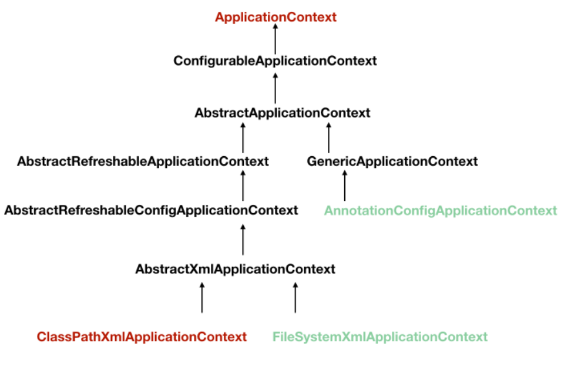
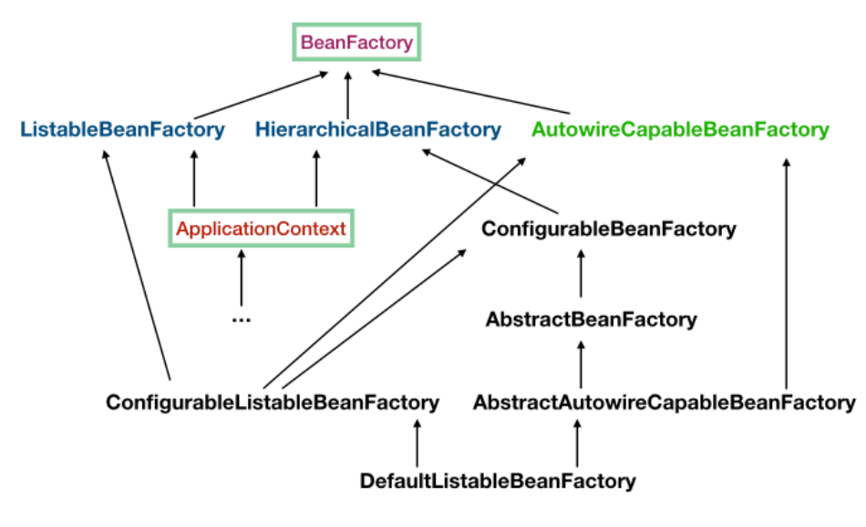
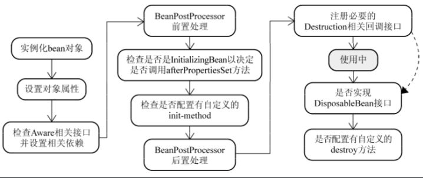
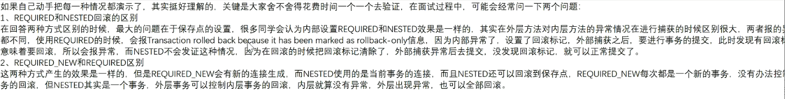

# 一、概念(面试题)

```bash
--------------------------Spring基础
- Spring有哪些优点
	由于Spring Frameworks 的分层架构，用户可以自由选择自己需要的组件。具有集成和可测试、IOC和AOP的特点，而且是开源免费的。

- Spring Framework有哪些不同的功能
	轻量级：Spring 在代码量和透明度方面都很轻便
	IOC：控制反转
	AOP： 面向切面编程可以将应用业务逻辑和系统服务分离，以实现高内聚
	容器：Spring 负责创建和管理对象（Bean）的生命周期和配置
	MVC：对 web 应用提供了高度可配置性
	事务管理：提供了用于事务管理的通用抽象层

- Spring Framework有多少个模块
	核心模块：Spring Core、Spring Bean、SpEL、Spring Context
	数据访问/集成：JDBC(Java DataBase Connectivity)、ORM(Object Relational Mapping)、OXM、JMS(Java Messaging Service)、Transaction
	Web：Web、Web-Servlet、Web-Socket、Web-Portlet
	Aop：该层支持面向切面编程
	Instrumentation – 该层为类检测和类加载器实现提供支持
	Test – 该层为使用 JUnit 和 TestNG 进行测试提供支持
	
--------------------------IOC
- 什么是Spring IOC容器？
	Spring 框架的核心是 Spring 容器。容器创建对象并管理它们的完整生命周期。使用依赖注入来使用他们。可以通过xml、java 注解等方式提供
	
- IOC和DI区别？
	IOC是一种思想，DI是一种动作。有一个对象持有另一个对象作为属性，传统的new方式增加了程序的耦合性，IOC就是将实例不在由开发者创建而是交给Spring容器创建，这种控制权由开发者到Spring容器的转变就是控制反转。那么Spring容器将依赖对象赋值给调用者的成员变量，相当于调用者注入它所依赖的实例，这就是依赖注入。实现控制反转的方式就是依赖注入。

- 依赖注入方式
	1.构造器注入(常用)
    2.setter方法注入
    3.注解注入 @Autowire和@Qualifier配合使用，@Resource单独使用

- Spring中有哪几种IOC容器
	1.BeanFactory：BeanFactory是比较原始的Factory，其无法支持Spring插件和基于依赖的注解。而且其采用延迟加载的方式注入Bean的，只有使用时才会加载实例化，好处节约内存，坏处速度慢
	2.ApplicationContext：BeanFactory的子接口，是为了满足更新的Spring的需求，面向框架实现上下文分层。其在容器启动时，将所有的bean都进行加载，好处速度快，坏处浪费内存
	
- 请你讲一下对IOC的理解
	首先，IoC（Inverse of Control，控制反转）在其他语言中也有应用，并非 Spring 特有，它是一种设计思想，基本概念就是将原本在程序中手动创建对象的控制权，交由 Spring 框架来管理。IoC 具体的实现方式是依赖注入。
	简单的说之前我们在代码中创建一个对象是通过 new 关键字，而使用了 Spring 之后，我们不在需要自己去 new 一个对象了，而是直接通过容器里面去取出来，再将其自动注入到我们需要的对象之中，也就说创建对象的控制权不在我们程序员手上了，全部交由 Spring 进行管理。
	交给 Spring 管理的也称为 Bean，所有的 Bean 都被存储在一个 Map 集合中，这个 Map 集合也称为 IoC 容器。
	将对象之间的相互依赖关系交给 IoC 容器来管理，并由 IoC 容器完成对象的注入。这样可以很大程度上简化应用的开发，把应用从复杂的依赖关系中解放出来。IoC 容器就像是一个工厂一样，当我们需要创建一个对象的时候，只需要配置好配置文件/注解即可，完全不用考虑对象是如何被创建出来的。
	网上：
	IoC是控制反转的意思，是一种面向对象编程的设计思想。在不采用这种思想的情况下，我们需要自己维护对象与对象之间的依赖关系，很容易造成对象之间的耦合度过高。尤其是在一个大型的项目中，对象与对象之间的关系是十分复杂的，这十分不利于代码的维护。IoC则可以解决这种问题，它可以帮我们维护对象与对象之间的依赖关系，并且降低对象之间的耦合度。
	说到IoC就不得不说DI，DI是依赖注入的意思，它是IoC实现的实现方式。由于IoC这个词汇比较抽象而DI比较直观，所以很多时候我们就用DI来代替它，在很多时候我们简单地将IoC和DI划等号，这是一种习惯。实现依赖注入的关键是IoC容器，它的本质就是一个工厂。
	延伸阅读
	Spring主要提供了两种类型的容器：BeanFactory和ApplicationContext。
	BeanFactory：是基础类型的IoC容器，提供完整的IoC服务支持。如果没有特殊指定，默认采用延迟初始化策略。只有当客户端对象需要访问容器中的某个受管对象的时候，才对该受管对象进行初始化以及依赖注入操作。所以，相对来说，容器启动初期速度较快，所需要的资源有限。对于资源有限，并且功能要求不是很严格的场景，BeanFactory是比较合适的IoC容器选择。
	ApplicationContext：它是在BeanFactory的基础上构建的，是相对比较高级的容器实现，除了拥有BeanFactory的所有支持，ApplicationContext还提供了其他高级特性，比如事件发布、国际化信息支持等。ApplicationContext所管理的对象，在该类型容器启动之后，默认全部初始化并绑定完成。所以，相对于BeanFactory来说，ApplicationContext要求更多的系统资源，同时，因为在启动时就完成所有初始化，容器启动时间较之BeanFactory也会长一些。在那些系统资源充足，并且要求更多功能的场景中，ApplicationContext类型的容器是比较合适的选择。
在具体的实现中，主要有三种注入方式：
	构造方法注入:就是被注入对象可以在它的构造方法中声明依赖对象的参数列表，让外部知道它需要哪些依赖对象。然后，IoC Service Provider会检查被注入的对象的构造方法，取得它所需要的依赖对象列表，进而为其注入相应的对象。构造方法注入方式比较直观，对象被构造完成后，即进入就绪状态，可以马上使用。
	setter方法注入:通过setter方法，可以更改相应的对象属性。所以，当前对象只要为其依赖对象所对应的属性添加setter方法，就可以通过setter方法将相应的依赖对象设置到被注入对象中。setter方法注入虽不像构造方法注入那样，让对象构造完成后即可使用，但相对来说更宽松一些，可以在对象构造完成后再注入。
	接口注入:相对于前两种注入方式来说，接口注入没有那么简单明了。被注入对象如果想要IoC Service Provider为其注入依赖对象，就必须实现某个接口。这个接口提供一个方法，用来为其注入依赖对象。IoC Service Provider最终通过这些接口来了解应该为被注入对象注入什么依赖对象。相对于前两种依赖注入方式，接口注入比较死板和繁琐。
	总体来说，构造方法注入和setter方法注入因为其侵入性较低，且易于理解和使用，所以是现在使用最多的注入方式。而接口注入因为侵入性较强，近年来已经不流行了。

--------------------------Bean
- 什么是Spring Bean
	它们由Spring IOC容器实例化、装配、管理、使用；是Spring IOC容器的主要部分。

- 提供了哪些装配方式
	xml、注解、Java Api。后两种用的频率较多

- Bean的作用范围
	1.Singleton - 每个 Spring IoC 容器仅有一个单实例
	2.Prototype - 每次注入请求都会产生一个新的实例
	3.Request - 每一次 HTTP 请求都会产生一个新的实例，并且该 bean 仅在当前 HTTP 请求内有效
	4.Session - 每一次 HTTP 请求都会产生一个新的 bean，同时该 bean 仅在当前 HTTP session 内有效

- 什么是spring装配
	当bean 在 Spring 容器中组合在一起时，它被称为装配或 bean 装配

- 自动装配有哪些方式
	no：这是默认设置，表示没有自动装配。
	byName：它根据 bean 的名称注入对象依赖项
	byType：它根据类型注入对象依赖项。
	构造函数：它通过调用类的构造函数来注入依赖项
	autodetect：首先容器尝试通过构造函数使用 autowire 装配，如果不能，则尝试通过 byType 自动装配
	
--------------------------注解
- @Required ：应用于 bean 属性 setter 方法。
- @Autowired ：自动装配，依赖注入

--------------------------数据访问
- spring JDBC API 中存在哪些类
	JdbcTemplate、SimpleJdbcTemplate、NamedParameterJdbcTemplate、SimpleJdbcInsert、SimpleJdbcCall

- 列举 spring 支持的事务管理类型
	声明式事务管理：事务管理与业务代码分离。仅使用注解来管理事务
	编程式管理：在编程的帮助下管理事务。它为您提供极大的灵活性，但维护起来非常困难

--------------------------AOP
- 什么是Aop
	面向切面编程，采用横向抽取机制，将分散到方法中的重复代码提取出来，然后程序编译或运行是将这些抽取的代码在应用到需要执行的地方。基本单位切面（类）、连接点（各个方法）、切入点（需要处理的连接点）、通知（处理的方式）、引入（允许现有类添加自定义方法和属性）、织入（将切面代码插入到目标对象后，生成代理对象的过程,也叫编织）。

-  AOP 中的 Aspect、Advice、Pointcut、JointPoint 和 Advice 参数分别是什么？
	Aspect：使用 @Aspect 注解将类声明为 Aspect。
	Advice(通知)：是针对特定 JoinPoint 采取的操作。其实是代理方法。
	Pointcut：Pointcut 是与 JoinPoint 匹配的正则表达式，用于确定是否需要执行 Advice。
	JoinPoint：JoinPoint 是应用程序中的特定点，例如方法执行，异常处理，更改对象变量值等。

- 有哪些类型的通知(Advice)
	Before - 这些类型的 Advice 在 代理方法之前执行，并使用 @Before 注解标记进行配置
	After Returning - 这些类型的 Advice 在代理方法正常执行后执行，并使用@AfterReturning 注解标记进行配置。
	After Throwing - 这些类型的 Advice 仅在代理方法通过抛出异常退出并使用 @AfterThrowing 注解标记配置时执行
	After (finally) - 这些类型的 Advice 在代理方法之后执行，无论方法退出是正常还是异常返回，并使用 @After 注解标记进行配置
	Around - 这些类型的 Advice 在连接点之前和之后执行，并使用 @Around 注解标记进行配置。

- Spring AOP and AspectJ AOP 有什么区别？
	Spring AOP 基于动态代理方式实现；AspectJ 基于静态代理方式实现。

- 什么是编织
	为了创建一个 advice 对象而链接一个 aspect 和其它应用类型或对象，称为编织（Weaving）
	
--------------------------MVC
- Spring MVC 框架有什么用？
	Spring Web MVC 框架提供 模型-视图-控制器 架构和随时可用的组件，用于开发灵活且松散耦合的 Web 应用程序。MVC 模式有助于分离应用程序的不同方面，如输入逻辑，业务逻辑和 UI 逻辑，同时在所有这些元素之间提供松散耦合。

- DispatcherServlet 的工作流程
	1.向服务器发送 HTTP 请求，请求被前端控制器 DispatcherServlet 捕获
	2.DispatcherServlet 根据 -servlet.xml 中的配置对请求的 URL 进行解析，得到请求资源标识符（URI）。然后根据该 URI，调用 HandlerMapping 获得该 Handler 配置的所有相关的对象（包括 Handler 对象以及 Handler 对象对应的拦截器），最后以HandlerExecutionChain 对象的形式返回。
	3.DispatcherServlet 根据获得的Handler，选择一个合适的 HandlerAdapter。（附注：如果成功获得HandlerAdapter后，此时将开始执行拦截器的 preHandler(…)方法）
	4.提取Request中的模型数据，填充Handler入参，开始执行Handler（Controller)。在填充Handler的入参过程中，根据你的配置，Spring 将帮你做一些额外的工作
		4.1.HttpMessageConveter：将请求消息（如 Json、xml 等数据）转换成一个对象，将对象转换为指定的响应信息
		4.2.数据转换：对请求消息进行数据转换。如String转换成Integer、Double等。
		4.3.数据根式化：对请求消息进行数据格式化。如将字符串转换成格式化数字或格式化日期等
		4.4.数据验证：验证数据的有效性（长度、格式等），验证结果存储到BindingResult或Error中
	5.Handler(Controller)执行完成后，向 DispatcherServlet 返回一个 ModelAndView 对象
	6.根据返回的ModelAndView，选择一个适合的 ViewResolver（必须是已经注册到 Spring 容器中的ViewResolver)返回给DispatcherServlet
	7.ViewResolver 结合Model和View，来渲染视图
	8.视图负责将渲染结果返回给客户端

- WebApplicationContext
	WebApplicationContext 是 ApplicationContext 的扩展。它具有 Web 应用程序所需的一些额外功能。
```


# IOC源码分析

> 接口和抽象类区别：接口是自上向下的，而抽象类是自下向上的，因为接口就要有实现类去实现了就完事了，而如果子类有共性的方法，抽象类就可以完成。



* ClassPathXmlApplicationContext 、**FileSystemXmlApplicationContext** 的构造函数需要一个 xml 配置文件在系统中的路径，其他和 ClassPathXmlApplicationContext 基本上一样
* **AnnotationConfigApplicationContext** 是基于注解来使用的，它不需要配置文件，采用 java 配置类和各种注解来配置，是比较简单的方式，也是大势所趋吧

**BeanFactory**



* ApplicationContext 继承了 ListableBeanFactory，这个 Listable 的意思就是，通过这个接口，我们可以获取多个 Bean，大家看源码会发现，最顶层 BeanFactory 接口的方法都是获取单个 Bean 的
* ApplicationContext 继承了 HierarchicalBeanFactory，Hierarchical 单词本身已经能说明问题了，也就是说我们可以在应用中起多个 BeanFactory，然后可以将各个 BeanFactory 设置为父子关系
* AutowireCapableBeanFactory 这个名字中的 Autowire 大家都非常熟悉，它就是用来自动装配 Bean 用的，但是仔细看上图，ApplicationContext 并没有继承它，不过不用担心，不使用继承，不代表不可以使用组合，如果你看到 ApplicationContext 接口定义中的最后一个方法 getAutowireCapableBeanFactory() 就知道了。
* ConfigurableListableBeanFactory 也是一个特殊的接口，看图，特殊之处在于它继承了第二层所有的三个接口，而 ApplicationContext 没有。这点之后会用到。

```bash
public interface BeanFactory {
	#########################################获取bean的相关方法
	// 返回指定bean的实例，该实例可以是共享的，也可以是独立的
	Object getBean(String name) throws BeansException;
	// 通过名字和类型获取指定的bean。 class可以是接口或者超类
	<T> T getBean(String name, Class<T> requiredType) throws BeansException;
	// args：使用显式参数创建bean实例时使用的参数(仅在创建新实例时使用，而不是检索现有实例时使用)
	Object getBean(String name, Object... args) throws BeansException
	// 仅根据类型获取指定的bean。 class可以是接口或者超类
	<T> T getBean(Class<T> requiredType) throws BeansException;
	<T> T getBean(Class<T> requiredType, Object... args) throws BeansException;
	
	#########################################获取ObjectProvider的相关方法
	// 返回指定bean的提供程序，允许延迟按需检索实例，包括可用性和唯一性选项。
	<T> ObjectProvider<T> getBeanProvider(Class<T> requiredType);
	<T> ObjectProvider<T> getBeanProvider(ResolvableType requiredType);
	
	#########################################判断的一些方法
	// 是否包含这个名字的bean
	boolean containsBean(String name);
	// 是否是单例的。即每次getBean获取的都是同一个的实例
	boolean isSingleton(String name) throws NoSuchBeanDefinitionException;
	// 是否是原型。即每次getBean获取的都是新的实例
	boolean isPrototype(String name) throws NoSuchBeanDefinitionException;
	// 是否类型匹配
	boolean isTypeMatch(String name, ResolvableType typeToMatch) throws NoSuchBeanDefinitionException;
	boolean isTypeMatch(String name, Class<?> typeToMatch) throws NoSuchBeanDefinitionException;
	
	#########################################获取的一些方法
	// 获取类型
	Class<?> getType(String name) throws NoSuchBeanDefinitionException;
	@Nullable
	Class<?> getType(String name, boolean allowFactoryBeanInit) throws NoSuchBeanDefinitionException;
	// 返回给定bean名的别名(如果有的话)。
	String[] getAliases(String name);
}

// 此类用于获取多个bean
public interface ListableBeanFactory extends BeanFactory {
	//检查这个bean工厂是否包含一个具有给定名称的bean定义。
	boolean containsBeanDefinition(String beanName);
	// 返回工厂中定义的bean的数量。
	int getBeanDefinitionCount();
	// 返回此工厂中定义的所有bean的名称。
	String[] getBeanDefinitionNames();
	// 返回指定bean的提供程序
	<T> ObjectProvider<T> getBeanProvider(Class<T> requiredType, boolean allowEagerInit);
	<T> ObjectProvider<T> getBeanProvider(ResolvableType requiredType, boolean allowEagerInit);
	// 返回匹配给定类型(包括子类)的bean名称
	String[] getBeanNamesForType(ResolvableType type);
	String[] getBeanNamesForType(ResolvableType type, boolean includeNonSingletons, boolean allowEagerInit);
	String[] getBeanNamesForType(@Nullable Class<?> type);
	String[] getBeanNamesForType(@Nullable Class<?> type, boolean includeNonSingletons, boolean allowEagerInit);
	// 根据指定类型获取一个Map，bean名称作为key，bean实例作为value
	<T> Map<String, T> getBeansOfType(@Nullable Class<T> type) throws BeansException;
	<T> Map<String, T> getBeansOfType(@Nullable Class<T> type, boolean includeNonSingletons, boolean allowEagerInit) throws BeansException;
	// 根据条件获取bean实例map
	String[] getBeanNamesForAnnotation(Class<? extends Annotation> annotationType);
	// 查找所有被提供的{@link Annotation}类型注释的bean名，而不创建相应的bean实例。
    String[] getBeanNamesForAnnotation(Class<? extends Annotation> annotationType);
	// 查找所有被提供的Annotation类型注释的bean，返回带有相应bean实例的bean名称的Map。	
	Map<String, Object> getBeansWithAnnotation(Class<? extends Annotation> annotationType) throws BeansException;
	// 在指定bean上找注解
	<A extends Annotation> A findAnnotationOnBean(String beanName, Class<A> annotationType)
			throws NoSuchBeanDefinitionException;
}

// 我们可以在应用中起多个 BeanFactory，然后可以将各个 BeanFactory 设置为父子关系
public interface HierarchicalBeanFactory extends BeanFactory {
	// 返回父bean 工厂(如果有的话)
	BeanFactory getParentBeanFactory();
	// 返回本地bean工厂是否包含给定名称的bean，忽略在祖先上下文中定义的bean
	boolean containsLocalBean(String name);
}

// 通过注解它就是用来自动装配 Bean 用的
public interface AutowireCapableBeanFactory extends BeanFactory {

	<T> T createBean(Class<T> beanClass) throws BeansException;
	
	void autowireBean(Object existingBean) throws BeansException;
	
	Object configureBean(Object existingBean, String beanName) throws BeansException;
	
	Object createBean(Class<?> beanClass, int autowireMode, boolean dependencyCheck) throws BeansException;
	
	Object autowire(Class<?> beanClass, int autowireMode, boolean dependencyCheck) throws BeansException;
	
	void autowireBeanProperties(Object existingBean, int autowireMode, boolean dependencyCheck)
			throws BeansException;
			
	void applyBeanPropertyValues(Object existingBean, String beanName) throws BeansException;
    
    Object initializeBean(Object existingBean, String beanName) throws BeansException;
    
    Object applyBeanPostProcessorsBeforeInitialization(Object existingBean, String beanName)
			throws BeansException;
			
	Object applyBeanPostProcessorsAfterInitialization(Object existingBean, String beanName)
			throws BeansException;
            
	void destroyBean(Object existingBean);
	
	<T> NamedBeanHolder<T> resolveNamedBean(Class<T> requiredType) throws BeansException;
	
	Object resolveBeanByName(String name, DependencyDescriptor descriptor) throws BeansException;
	
	Object resolveDependency(DependencyDescriptor descriptor, @Nullable String requestingBeanName) throws BeansException;
	
	Object resolveDependency(DependencyDescriptor descriptor, @Nullable String requestingBeanName,
			@Nullable Set<String> autowiredBeanNames, @Nullable TypeConverter typeConverter) throws BeansException;
}

// 扩展的bean工厂
public interface ApplicationContext extends EnvironmentCapable, ListableBeanFactory, HierarchicalBeanFactory,MessageSource, ApplicationEventPublisher, ResourcePatternResolver {
	// 返回此应用程序上下文的唯一id。
	String getId();
	// 返回此上下文所属的已部署应用程序的名称。
	String getApplicationName();
	// 为这个上下文返回一个友好的名称。
	String getDisplayName();
	// 返回这个上下文第一次加载时的时间戳。
	long getStartupDate();
	// 返回父上下文，如果没有父上下文，则返回{@code null}，这是上下文层次结构的根。
	ApplicationContext getParent();
	// 为这个上下文暴露AutowireCapableBeanFactory功能
	AutowireCapableBeanFactory getAutowireCapableBeanFactory() throws IllegalStateException;
}
```

## 启动过程分析

一.从 ClassPathXmlApplicationContext 的构造方法

```bash
public class ClassPathXmlApplicationContext extends AbstractXmlApplicationContext {
  private Resource[] configResources;

  // 如果已经有 ApplicationContext 并需要配置成父子关系，那么调用这个构造方法
  public ClassPathXmlApplicationContext(ApplicationContext parent) {
    super(parent);
  }
  ...
  public ClassPathXmlApplicationContext(String[] configLocations, boolean refresh, ApplicationContext parent)
      throws BeansException {

    super(parent);
    // 根据提供的路径，处理成配置文件数组(以分号、逗号、空格、tab、换行符分割)
    setConfigLocations(configLocations);
    if (refresh) {
      refresh(); // 核心方法
    }
  }
    ...
}
```


**xml文件如何变为BeanDefinition**

```bash
1. AbstractApplicationContext       refresh方法的obtainFreshBeanFactory
2. AbstractApplicationContext		obtainFreshBeanFactory方法的refreshBeanFactory
3.子类AbstractRefreshableApplicationContext  重写的refreshBeanFactory中的loadBeanDefinitions
4.子类AbstractXmlApplicationContext			重写loadBeanDefinitions中的loadBeanDefinitions
5.										    loadBeanDefinitions中的loadBeanDefinitions
6.XmlBeanDefinitionReader					的loadBeanDefinitions
7.loadBeanDefinitions描述了会通过输入流，
8.然后通过doLoadBeanDefinitions方法，此处获取xml文件的document对象，这个解析过程是由documentLoader完成
```


1.通过反射生成对应的实例化对象       AbstractAutowireCapableBeanFactory类中的createBeanInstance方法

2.属性注入   通过AbstractAutowireCapableBeanFactory的populateBean方法

3.容器属性赋值   通过AbstractAutowireCapableBeanFactory的invokeAwareMethods方法

```bash
bean的生命周期

spring源码中有一个initializeBean的方法，这个方法中包括了bean的整个生命周期。
bean的创建包括两部分：一部分是实例化，另一部分是初始化
1.实例化：申请空间，对象属性值是默认值		通过`createBeanInstance`方法，可以完成对象的实例化，但此时属性还都是默认值 (无参构造？)
2.初始化
2.1.进行属性的赋值，首先是对象自定义属性的赋值。 通过`populateBean()`方法，本质是通过set方法完成属性的赋值
2.2.然后是容器属性的赋值，换句话说就是检查Aware相关接口并设置相关依赖。  通过`invokeAwareMethods`方法中开始判断bean是否实现了`BeanNameAware、BeanClassLoaderAware和BeanFactoryAware`接口，如果实现了通过对应的set方法传入对应的实例。如果实现了其他Aware接口这上面说的一致
2.3.然后是方法的初始化。如果bean实现了`BeanPostProcessor`接口，如果实现了则会执行`postProcessBeforeInitialization() 和postProcessAfterInitialization()`方法。
2.4执行上述两个方法之间，有一个`invokeInitMethods()`方法，它还会去判断bean是否实现了`InitializingBean`接口，如果实现了就会调用`afterPropertiesSet`()
3.然后一个完整的对象就可以使用了，通过context.getBean()方法可以获得bean
4.然后是销毁环节，如果bean实现了`DisposableBean `接口，则执行 `destroy() `方法

标准回答：
	spring是一个轻量级框架，为了帮助我们进行简化开发的，它里面的核心功能有IOC和AOP。bean的生命周期只是IOC中创建对象的整个流程。里面大体上来说可以包含实例化，初始化、使用和销毁四部分。这是粗粒度的一个描述，如果说更细粒度的描述的话，先从实例化开始，createBeanInstance方法中，会(通过反射的方式)读取到我们bd中的一些相关信息，可以把这些class对象创建出来，然后呢，可以通过反射的方式加载我们的类，并且创建出当前的对象，此时的创建只是在堆空间中申请一块内存空间，并没有实际的给对象的属性赋值。所以此时对象的属性都是默认值，当默认值结束之后。会通过一个方法，叫做populateBean()来给当前的对象进行属性的赋值操作，在里面会调用我们对应的set方法完成属性的赋值，但是在这个步骤里面，他只会完成自定义属性的赋值操作，还有一部分属性叫做容器属性，也就是说在spring框架中，他自己帮我们定义的一类对象，我们自定义的对象中也可能会使用到这些容器对象，所以此时在进行赋值的时候，需要调用我们的aware接口，通过在invokeAwareMethods方法中对aware接口的一个判断，来确定是够能够进行属性值的一个设置操作。所以说相当于populateBean和我们的invokeAwareMethods两个方法都完成了属性赋值操作。一个是自定义属性赋值，一个是容器属性赋值。按照正常流程，我们的bean已经可以正常使用了，但是spring作为一个框架，他在进行设计的时候要充分考虑一个特点，叫扩展性。当bean创建完成之后，可能会有一些对bean对象进行扩展的过程，比如说aop的实现，其实就是对我们生成的对象要进行扩展操作，所以会对BeanPostProcessor接口进行判断，对before和after进行一些扩展操作，比如说aop动态代理的实现，就是在after方法中操作的，而在before和after方法之间还有一个初始化的方法调用invokeInitMethods，这里面有一个很重要的隐藏接口，叫InitializingBean，如果实现了需要完成afterPropertiesSet方法的调用，这个方法可以给到用户最后一次机会来完成属性或方法的一些调用，当这些步骤都执行完了，我们整个对象就创建结束了。现在可以通过context.getBean的方式来进行对象的使用了。在对象使用完毕之后，还要完成对象的销毁操作，通过判断是否实现了DisposableBean接口，来执行destroy方法。
```



**循环依赖**

```bash
- 为什么使用三级缓存来解决循环依赖问题
	由于spring的生命周期处理过程中，实例化和初始化时分开执行的

1.三个map缓存中分别储存什么对象？
一级缓存：成品
二级缓存：半成品
三级缓存：lamda表达式

2.三个map缓存查找的顺序是什么样的
先从以及缓存找，没有的话找二级缓存，没有的话找三级缓存

3.如果只有一个map缓存，能解决缓存依赖问题吗？
不能。如果只有一个map结构那么成品和半成品对象会放在同一个map中，半成品对象是无法直接暴露给用户使用的，所以如果想用一个缓存解决问题，就需要在value上打标签，每次获取的时候，要取出value做判断，很麻烦，所以用两个map结构可以直接解决这个问题

4.如果只有两个map缓存，能够解决循环依赖问题吗
在刚刚整个debug的流程中，有几个地方用到了三级缓存？doCreateBean、getSingleton
两个map缓存就可以解决循环依赖问题，但是他有一个前提，整个循环依赖过程中没有aop的话，二级缓存可以解决，如果有aop的话，必须要三级缓存

5.为什么使用aop之后就要使用三级缓存了呢？
	(1)在创建代理对象的时候，是否需要创建原始对象？  需要
	(2)同一个map结构中，能够包含两个同名对象 ?  不能
	(3)当创建完代理对象之后，对外暴露的原始对象还是代理对象？
		程序无法判断是哪一个具体的对象，所以创建出的代理对象之后要覆盖原始对象
	(4)对象在外暴露调用使用的时候，无法	预估在什么时候对外暴露，也就是无法确定暴露时间，怎么办？
		所以需要一个回调机制，在对象第一次暴露使用的时候，要判断当前对象是否需要生成代理对象，如果需要，那么就返回代理对象，如果不需要返回原始对象，此处的逻辑在哪里实现呢？lambda表达式：getEarlyBeanReference
```

```bash
- 谈谈Spring IOC的理解、原理和实现
总：
	控制反转：原来的对象是由使用者来进行控制，有了spring之后，可以把整个对象交给spring来帮助我们来进行管理
	DI：依赖注入，把对象的属性的值注入都具体的对象中，@Autowired、populateBean完成属性值的注入
	容器：储存对象，使用map结构来储存，在spring中一般存在三级缓存，singletonObjects存放完整的bean对象，真个bean的生命周期，从创建到使用到销毁的过程都是由容器来管理(bean的生命周期)
分：
1.一般聊ioc容器的时候，要设计到容器的创建过程(beanFactory，DefaultListableBeanFactory 容器有一个最上层的根接口叫beanFactory，它里面只有声明方法，没有具体的实现，我们在实际使用过程中最普遍的实现类就是DefaultListableBeanFactory，包括我们在使用的时候会优先创建bean工厂)，向bean工厂中设置一些参数(BeanPostProcessor，Aware接口的子类)等等属性
2.加载解析bean对象，准备要创建的bean对象的定义对象beanDefinition(xml或者注解的解决过程)，这时我们就得到了beanDefinitoiin了
3.beanFactoryPostProcessor的处理，此处是扩展点。比较多的扩展点，比如处理占位符，PlaceHolderConfigureSupport、ConfigurationClassPostProcessor
4.BeanPostProcessor的注册功能，方便后续对bean对象完成具体的扩展功能
5.通过反射的方式将beanDefinition对象实例化成及具体的bean clas对象
6.聊一聊bean对象的初始化过程(填充属性，调用aware子类的方法，调用BeanPostProcessor前置处理方法，调用init-method方法，调用BeanPostProcessor的后置处理方法)
7.生成完整的bean对象，通过getBean方法直接获取
8.销毁过程

没看过源码：spring中bean都是通过反射的方式生成的，同时包含了很多的扩展点，比如最常用的对象BeanFactory的扩展，对bean的扩展(对占位符的处理)

- IOC的底层实现
	底层实现：你对他的理解，和你了解过的实现过程
	反射(bean的创建)，突出工厂的价值，设计模式,关键的几个方法
	createBeanFactory、getBean、doGetBean、doCreateBean、createBeanInstance(getDeclareConstruction、newInstance)、populateBean
	1.先通过createBeanFactory创建一个bean工厂(DefaultListableBeanFactory)
	2.开始循环创建对象，因为容器中的bean默认都是单例的，所以优先通过getBean/doGetBean从容器中查找
	3.通过createBean、doCreateBean方法，以反射的方式创建对象，一般情况下使用的是无参的构造方法(getDeclaredConstructor,newInstance)
	4.进行对象的属性填充(populateBean)
	5.进行其他的初始化操作(intializingBean)

- bean的生命周期见上面写的
	1.实例化bean:反射的方式生产对象
	2.填充bean的属性：populateBean() ，循环依赖的问题(三级缓存)
	3.调用aware接口相关的方法，invokeAwareMethod(完成beanName BeanFactory BeanClassLoader对象的属性设置)
	4.调用BeanPostProcessor中的前置处理方法：使用比较多的有(ApplicationContextPostProcessor，设置ApplicationContext，Environment等待)
	5.调用initmethod方法，invokeInitmetod()判断是否实现initialingBean接口，如果有，调用afterProperties调用
	6.调用BeanPostProcessor的后置处理方法，spring的aop就是此处实现的，注册Destruction相关的回调接口
	7.获取完整对象，通过getBean方式获取对象
	8.销毁流程.1判断对象是否实现了DisposableBean接口2.调用destroyMethod方法

- 如何解决循环依赖问题
总:什么是循环依赖问题，A依赖B,B依赖A
分:先说明bean的创建过程:实例化，初始化(填充属性)
	1、先创建A对象，实例化A对象，此时A对象中的b属性为空，填充属性b
	2、从容器中查找B对象，如果找到了，直接赋值不存在循环依赖问题(不通)，找不到直接创建B对象
	3、实例化B对象，此时B对象中的a属性为空，填充属性a
	4、从容器中查找A对象，找不到，直接创建
	形成闭环的原因：
	此时，如果仔细琢磨的话，会发现A对象是存在的，只不过此时的A对象不是一个完整的状态，只完成了实例化但是未完成初始化，如果在程序调用过程中，拥有了某个对象的引用，能否在后期给他完成赋值操作，可以优先把非完整状态的对象优先赋值，等待后续操作来完成赋值，相当于提前暴露了某个不完整对象的引用，所以解决问题的核心在于实例化和初始化分开操作，这也是解决循环依赖问题的关键，
	当所有的对象都完成实例化和初始化操作之后，还要把完整对象放到容器中，此时在容器中存在对象的几个状态，完成实例化=但未完成初始化，完整状态，因为都在容器中，所以要使用不同的map结构来进行存储，此时就有了一级缓存和二级缓存，如果一级缓存中有了，那么二级缓存中就不会存在同名的对象，因为他们的查找顺序是1，2，3这样的方式来查找的。一级缓存中放的是完整对象，二级绥存中放的是非完整对象
	为什么需要三级缓存?三级缓存的value类型是ObjectFactory,是一个函数式接口，存在的意义是保证在整个容器的运行过程中同名的bean对象只能有一个。
	如果一个对象需要被代理，或者说需要生成代理对象，那么要不要优先生成一个普通对象?要
	普通对象和代理对象是不能同时出现在容器中的，因此当一个对象需要被代理的时候，就要使用代理对象覆盖掉之前的普通对象，在实际的调用过程中，是没有办法确定什么时候对象被使用，所以就要求当某个对象被调用的时候，优先判断此对象是否需要被代理，类似于一种回调机制的实现，因此传入lambda表达式的时候，可以通过lambda表达式来执行对象的覆盖过程，getEarlyBeanReference()

- 缓存的放置时间和删除时间(非必要)
	三级缓存: createBeanlnstance之后: addSingletonFactory
	二级缓存:第一次从三级缓存确定对象是代理对象还是普通对象的时候，同时删除三级缓存getSingleton
	一级缓存:生成完整对象之后放到一级缓存，删除二三级缓存:addSingleton

- BeanFactory与FactoryBean有什么区别？
	相同点:都是用来创建bean对象的
	不同点:使用BeanFactory创建对象的时候，必须要遵循严格的生命周期流程，太复杂了，，如果想要简单的自定义某个对象的创建，同时创建完成的对象想交给spring来管理，那么就需要实现FactroyBean接口了
	issingleton:是否是单例对象
	getObjectType:获取返回对象
	getObject:自定义创建对象的过程(new，反射，动态代理)

- Spring中用到的设计模式
	单例模式: bean默认都是单例的
	原型模式:指定作用域为prototype
	工厂模式: BeanFactory
	模板方法: postProcessBeanFactory,onRefresh,initPropertyvalue
	策略模式: XmlBeanDefinitionReader,PropertiesBeanDefinitionReader
	观察者模式:listener，event，multicast
	适配器模式: Adapter
	装饰者模式: BeanWrappe
	责任链模式:使用aop的时候会先生成一个拦截器链代理模式:动态代理
	委托者模式: delegate

- Spring中AOP的实现原理
	aop是ioc的一个扩展功能，先有的ioc，再有的aop，只是在ioc的整个流程中新增的一个扩展点而已: BeanPostProcessor
	总: aop概念，应用场景，动态代理
	分：bean的创建过程中有一个步骤可以对bean进行扩展实现，aop本身就是一个扩展功能，所以在BeanPostProcessor的后置处理方法中来进行实现
	1、代理对象的创建过程(advice，切面，切点)
	2、通过jdk或者cglib的方式来生成代理对象
	3、在执行方法调用的时候，会调用到生成的字节码文件中，直接回找到DynamicAdvisorednterceptor类中的intercept方法，从此方法开始执行
	4、根据之前定义好的通知来生成拦截器链
	5、从拦截器链中依次获取每一个通知开始进行执行，在执行过程中，为了方便找到下一个通知是哪个，会有一个cglibMethodInvocation的对象，找的时候是从-1的位置一次开始查找并且执行的。

- Spring事务如何回滚
	spring的事务管理是如何实现的?
	总: spring的事务是由aop来实现的，首先要生成具体的代理对象，然后按照aop的整套流程来执行具体的操作逻辑，正常情况下要通过通知来完成核心功能，但是事务不是通过通知来实现的，而是通过一个TransactionInterceptor来实现的，然后调用invoke来实现具体的逻辑
	分:
	1、先做准备工作，解析各个方法上事务相关的属性，根据具体的属性来判断是否开始新事务
	2、当需要开启的时候，获取数据库连接，关闭自动提交功能，开起事务
	3、执行具体的sql逻辑操作
	4、在操作过程中，如果执行失败了，那么会通过completeTransactionAfterThrowing看来完成事务的回滚操作，回滚的具体逻辑是通过doRollBack方法来实现的，实现的时候也是要先获取连接对象，通过连接对象来回滚
	5、如果执行过程中，没有任何意外情况的发生，那么通过commitTransactionAfterReturning来完成事务的提交操作，提交的具体逻辑是通过doCommit方法来实现的，实现的时候也是要获取连接，通过连接对象来提交
	6、当事务执行完毕之后需要清除相关的事务信息cleanupTransactionInfo
如果想要聊的更加细致的话，需要知道TransactionInfo,TransactionStatus,	
	
- 谈一下Spring事务传播？	
	传播特性有几种? 7种
	Required,Requires_new,nested,Support,Not_Support,Never,Mandatory
	某一个事务嵌套另一个事务的时候怎么办?
	A方法调用B方法，AB方法都有事务，并且传播特性不同，那么A如果有异常，B怎么办，B如果有异常，A怎么办?
	
	总∶事务的传播特性指的是不同方法的嵌套调用过程中，事务应该如何进行处理，是用同一个事务还是不同的事务，当出现异常的时候会回滚还是提交，两个方法之间的相关影响，在日常工作中，使用比较多的是required，Requires_new,nested
	分:
	1、先说事务的不同分类，可以分为三类:支持当前事务，不支持当前事务，嵌套事务
	2、如果外层方法是required，内层方法是，required,requires_new,nested
	3、如果外层方法是requires_new，内层方法是，required,requires_new,nested
	4、如果外层方法是nested，内层方法是，required,requires_new,nested


	
```



```bash
- Spring IOC源码

- Spring AOP源码  aop如何实现

- Spring 事务实现  事务的传播性

- Spring缓存作用

- Spring注解如何实现
```


# Spring编程思想

**核心特性(Core)**

* IOC容器(IOC Container)
* Spring事件(Events)
* 资源管理(Resources)
* 国际化(i18n)
* 校验(Validation)
* 数据绑定(Data Binding)
* 类型转换(Type Conversion)
* Spring表达式(Spring Express Language)
* 面向切面编程(AOP)

**数据存储(Data Access)**

* JDBC
* 事务抽象(Transaction)
* DAO 支持(DAO Support)
* O/R映射(O/R Mapping)
* XML 编列(XML Marshalling)

**Web技术(Web)**

* Web Servlet技术栈
  * Spring MVC 
  * WebSocket
  * SockJS
* Web Reactive
  * Spring WebFlux
  * WebClient
  * WebSocket

**技术整合(Integration)**

* 远程调用(Remoting)
* Java 消息服务(JMS)
* JAVA 连接架构(JCA)
* Java 管理扩展(JMX)
* Java 邮件客户端(Email)
* 本地任务(Tasks)
* 本地调度(Scheduling)
* 缓存抽象(Caching)
* Spring 测试(Testing)

**测试(Testing)**

* 模拟对象(Mock Objects)
* TestContext 框架
* Spring MVC测试
* Web 测试客户端


**模块划分**

* spring-aop：面向切面编程
* spring-aspects：spring对aspect的支持
* spring-context-indexer：
* spring-context-support：
* spring-context：
* spring-core：
* spring-expression：spring表达式语言
* spring-instrument：对java的装配
* spring-jcl：spring新型日志框架
* spring-jdbc：spring对jdbc的整合
* spring-jms：java message service(比如apache的ActivrMQ)
* spring-messageing：统一消息服务的实现(kafka等)
* spring-orm：hibernate、jpa等的整合
* spring-oxm：
* spring-test：spring测试
* spring-tx：tx是transaction缩写，事务抽象
* spring-web：普通web
* spring-webflux：
* spring-webmvc：
* spring-websocket：

## 

