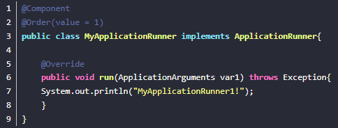

# 一、pom.xml

## 1、引入druid数据源

```xml
<!--引入druid数据源-->
<dependency>
    <groupId>com.alibaba</groupId>
    <artifactId>druid</artifactId>
    <version>1.2.3</version>
</dependency>
```

## 2、引入Alibab fastjason

```xml
<dependency>
    <groupId>com.alibaba</groupId>
    <artifactId>fastjson</artifactId>
    <version>1.2.73</version>
</dependency>
```


# 二、application.yml

## 1、jackson

```yml
spring:
#  json数据显示更漂亮 使json数据缩进形式输出  indent-output(缩进输出)
  jackson:
    serialization:
      indent-output: true
    date-format: yyyy-MM-dd HH:mm:ss  #设置json时区和时间显示格式
    time-zone: GMT+8  
```

## 2、配置服务器上下文根路径

```yml
server:
  servlet:
    context-path: /Api
```

## 3、配置数据库

```yml
spring:
  datasource:
    username: root
    password: ljldmysql
    url: jdbc:mysql://localhost:3306/mybatis?serverTimezone=UTC&characterEncoding=utf-8
    driver-class-name: com.mysql.cj.jdbc.Driver
```

## 4、配置日志

```yaml
logging:
  level:
    com.ljl: trace
```

## 5、配置MyBatis框架

```yaml
mybatis:
  config-location: classpath:mybatis/mybatis_config.xml
```

mybatis_config.xml 中实现驼峰命名法

```xml
<?xml version="1.0" encoding="UTF-8" ?>
<!DOCTYPE configuration
        PUBLIC "-//mybatis.org//DTD Config 3.0//EN"
        "http://mybatis.org/dtd/mybatis-3-config.dtd">
<configuration>
    <settings>
        <setting name="mapUnderscoreToCamelCase" value="true"/>  <!--驼峰命名法-->
    </settings>
</configuration>
```


# 三、基本内容

## 1、Druid

```java
@Configuration
public class DruidConfig {
    @ConfigurationProperties(prefix = "spring.datasource")
    @Bean
    public DataSource druid(){
        return new DruidDataSource();
    }

    //配置Druid监控
    //1、配置一个管理后台的Servlet
    @Bean
    public ServletRegistrationBean<StatViewServlet> startViewServlet(){
        ServletRegistrationBean<StatViewServlet> bean = new ServletRegistrationBean<>(new StatViewServlet(), "/druid/*");
        Map<String,String> initParams = new HashMap<>();

        initParams.put("loginUsername","admin");
        initParams.put("loginPassword","ljldmysql");
        initParams.put("allow","");//默认就是允许所有访问
        initParams.put("deny","192.168.1.10");

        bean.setInitParameters(initParams);
        return bean;
    }

    //2、配置一个web监控的filter
    @Bean
    public FilterRegistrationBean<WebStatFilter> webStatFilter(){
        FilterRegistrationBean<WebStatFilter> bean = new FilterRegistrationBean<WebStatFilter>();
        bean.setFilter(new WebStatFilter());

        Map<String,String> initParams = new HashMap<>();
        initParams.put("exclusions","*.js,*.css,/druid/*");

        bean.setInitParameters(initParams);

        bean.setUrlPatterns(Collections.singletonList("/*"));

        return  bean;
    }
}
```


##  2、fastjson

```java
@Configuration
public class fastJsonConfig extends WebMvcConfigurationSupport {
    /**
     * 配置消息转换器--这里我用的是alibaba 开源的 fastjson
     * @param converters
     */
    @Override
    public void configureMessageConverters(List<HttpMessageConverter<?>> converters) {
        //1.需要定义一个convert转换消息的对象;
        FastJsonHttpMessageConverter fastJsonHttpMessageConverter = new FastJsonHttpMessageConverter();
        //2.添加fastJson的配置信息，比如：是否要格式化返回的json数据;
        FastJsonConfig fastJsonConfig = new FastJsonConfig();
        fastJsonConfig.setSerializerFeatures(SerializerFeature.PrettyFormat,
                SerializerFeature.WriteMapNullValue,
                SerializerFeature.WriteNullStringAsEmpty,
                SerializerFeature.DisableCircularReferenceDetect,
                SerializerFeature.WriteNullListAsEmpty,
                SerializerFeature.WriteDateUseDateFormat);
        //3处理中文乱码问题
        List<MediaType> fastMediaTypes = new ArrayList<>();
        fastJsonHttpMessageConverter.setDefaultCharset(Charset.forName("UTF-8"));
        //4.在convert中添加配置信息.
        fastJsonHttpMessageConverter.setSupportedMediaTypes(fastMediaTypes);
        fastJsonHttpMessageConverter.setFastJsonConfig(fastJsonConfig);
        //5.将convert添加到converters当中.
        converters.add(fastJsonHttpMessageConverter);
    }
}
```

## 3. 注入配置文件

application.yml

```
app:
  version: 2.2.0
```

@Value(""${app.version}) ：可以获取配置文件对应属性的值，并将其赋值给此注解下的字段上。要配合@Component注解使用。

>其背后是通过public void setAppVersion(String appVersion){赋值} 运行工作的！   可以通过此方式将其赋值到静态字段上。

## 4、AOP

AOP的基本单元是切面，采用横向抽取机制，将分散在各个方法中的重复代码提取出来，然后程序编译或者运行的时候将这些抽取的代码应用到需要执行的地方。

**切面**：封装横切到系统功能（事务处理）的类  @Aspect                                                         

**连接点**：每个需要执行的方法都是一个连接点方法     

> 方法： ("execution(* com.*(..))")                                                                                             
>
> 注解： @Pointcut("@annotation(com.jt.anno.CacheFind)") 

**切入点**：需要处理的连接点。@PointCut()                                                                                                                               

**通知**：由切面添加到特定连接点的一段代码                            

> @Before:前置通知，目标方法之前执行。
>
> @AfterReturning:后置返回通知。执行方法结束之前执行（异常不执行）                                                                                            
>
> @Around:定义环绕通知。环绕目标方法执行                                                                                                      
>
> @AfterThrowing:定义异常通知。出现异常执行                                                                                             
>
> @After:后置返回通知。目标方法之后执行（始终执行）

**引入**：允许现有的实现类添加自定义方法和属性                                                                                   

**目标对象**：所有被通知的对象                                                                                                                                                                      

**代理**：通知应用到目标对象之后被动态创建的对象                                                                      

**织入**：将切面代码插入到目标对象之后，从而生成代理对象的过程


**多切面情况**

多个切面的情况下，可以通过@Order指定先后顺序，数字越小，优先级越高。如下图所示


## 5、日志

| 日志门面(日志的抽象层)                                       | 日志实现                                    |
| ------------------------------------------------------------ | ------------------------------------------- |
| JCL(xx commons logging) SLF4J(simple logging facade(e啊) for java)  **~~jboss-logging~~** | Log4j Loaback Log4j2 JUL(java.util.logging) |

小背景：slf4j、log4j、logback是出自同一个人手。logback是log4j的升级版;JUL是当时log4j出来后，害怕日志市场被占有，所以出了JUL。log4j2是借log4j之名，由apache公司设计的日志框架。

SpringBoot：底层是Spring框架，Spring框架默认是用JCL

**==SpringBoot选用 SLF4j和logback；==**


* logback是面向slf4j适配的，所以直接导入slf4j和logback就可以使用
* log4j发布较早，没有考虑到slf4j的出现，所以需要中间一个适配层，实现抽象层的接口，调用实现层方法。所以需要导入三个包，slf4j，log4j，

每一个日志的实现框架都有自己的配置文件。使用slf4j以后，**配置文件还是做成日志实现框架自己本身的配置文件**

> 遗留问题

统一日志记录，即使是别的框架和我一起统一使用slf4j进行输出？


**如何让系统中所有的日志都统一到slf4j：**

==1、将系统中其他日志框架先排除出去；==

==2、用中间包来替换原有的日志框架；==

==3、我们导入slf4j其他的实现==

**SpringBoot日志框架**


* SpringBoot底层也是使用slf4j + logback的日志框架
* SpringBoot也其他的日志替换成了slf4j
* 如果要用其他框架，一定要把这个框架的默认日志依赖排除掉

**==SpringBoot能自动适配所有的日志，而且底层使用slf4j+logback的方式记录日志，引入其他框架的时候，只需要把这个框架依赖的日志框架排除掉即可==**

# 四、注解介绍

## 1、Java SE注解部分 （元注解）

**元注解**：用于修饰其他注解的注解

有四个分别是：

* Retention:指定所修饰的Annotation的生命周期：SOURCE\CLASS(默认行为) \RUNTIME 只有生命为RUNTIME生命周期的注解，才能通过反射获取

* Target:用于指定被修饰的Annotation能用于修饰哪些程序结构元素

* Documented：表示所修饰的注解在被javadoc解析时，保留下来

* Inherited：被它修饰的Annotation将具有继承性，父类的注解，子类自动继承

## 2、Spring  针对 Bean  管理中创建对象提供注解

（1）@Component
（2）@Service
（3）@Controller
（4）@Repository

​	@**Configuration**:配置类上来标注这个注解；配置类 -----  配置文件；配置类也是容器中的一个组件；@Component

​	@**Autowired**：根据属性类型进行自动装配。默认按照type注入

   @**Qualifier**：根据名称进行注入和@**Autowired**配合使用

   **@Resource**:可以根据类型注入或名称注入。默认按照name注入。装配顺序：

* 如果同时指定了name和type，则从Spring上下文中找到唯一匹配的bean进行装配，找不到则抛出异常
* 如果指定了name，则从上下文中查找名称（id）匹配的bean进行装配，找不到则抛出异常
* 如果指定了type，则从上下文中找到类型匹配的唯一bean进行装配，找不到或者找到多个，都会抛出异常
* 如果既没有指定name，又没有指定type，则自动按照byName方式进行装配；如果没有匹配，则按照类型进行匹配，匹配上则自动装配

​	 

   @Value（value="abc"）：注入普通类型属性

## 3、SpringBoot 注解：

### 3.1常见注解

#### 1、@**SpringBootApplication**

 Spring Boot应用标注在某个类上说明这个类是SpringBoot的主配置类，SpringBoot就应该运行这个类的main方法来启动SpringBoot应用；

#### 2、@Configuration()

类似xml的beans标签，其中 proxyBeanMethods = true 或不写，是Full模式 ，proxyBeanMethods =false是Lite模式，Full指向的仍旧是原来的Bean,Lite模式下直接返回新实例对象，推荐使用lite模式，可以提高Spring的启动速度。

#### 3、@**RestController**

 等同于@Controller + @ResponseBody 。在一个类上添加@Controller注解，表明了这个类是一个控制器类 。 @ResponseBody表示方法的返回值直接以指定的格式写入Http response body中 

#### 4、@**EnableAutoConfiguration** 

开启自动配置功能；感觉类似自动装配

#### 5、@**RequestMapping("/")** 

用来映射请s求的，即指明处理器可以处理哪些URL请求

#### 6、**@RequestParam("param") **

```
语法：@RequestParam(value=”参数名”,required=”true/false”,defaultValue=””)
value：参数名
required：是否包含该参数，默认为true，表示该请求路径中必须包含该参数，如果不包含就报错。
defaultValue：默认参数值，如果设置了该值，required=true将失效，自动为false,如果没有传该参数，就使用默认
例子：
@RequestMapping("/dynasty")   
public JsonResult<Map> getDynstyId(@RequestParam(value="cpCode",required = true) String cpCode) {...}
```

#### 7、**@PathVariable("xxx")：**

```
@PathVariable("xxx")
通过 @PathVariable 可以将URL中占位符参数{xxx}绑定到处理器类的方法形参中@PathVariable(“xxx“) 
 
@RequestMapping(value=”user/{id}/{name}”)
请求路径：http://localhost:8080/hello/show5/1/james
```

#### 8、**@ControllerAdvice**:

```
可以说是Controller类的增强类，可对controller中被@RequestMapping注解的方法，加一些逻辑处理。
一般有三个用处：
	1.结合@ExceptionHandler可以进行全局异常处理
	2.结合@InitBinder:应用于全局的controller的类型绑定器，在其方法执行之前初始化数据绑定器。作用时间：在controller具体方法之前；作用点：所有被@RequestMapping注解的方法。
	3.结合@ModelAttribute：参数的绑定和添加
	4.结合ResponseBodyAdvice接口，可以对@ResponseBody进行增强处理。
```

#### 9、**@InitBinder:**

```
场景：springmvc并不能对所有类型的参数进行绑定，对Date类型参数进行绑定时，会报错。所以可以通过@InitBinder注解，添加类型绑定器进行参数转换。可以对特定参数值进行处理，@InitBinder(value="usr")

可以定制自己的类型绑定器：实现Formatter接口即可。
```

 会报错！

```
@InitBinder
    public void dateTypeBinder(WebDataBinder webDataBinder){
        //往数据绑定器中添加一个DateFormatter日期转化器。
        webDataBinder.addCustomFormatter(new DateFormatter("yyyy-mm-dd"));
    }
```


#### 10、**@ExceptionalHandler:**

```
@ExceptionHandler(Exception.class) 处理全局异常
```

#### 11、**@ModelAttribute**:

```
用在controller方法的前面，用于一些参数的绑定，可以指定内容
	@ModelAttribute(value = "message")
    public String globalModelAttribute() {
        System.out.println("添加了message全局属性。");
        return "输出了message全局属性。";
    }
    //Controller
    @RequestMapping(value = "/users", method = RequestMethod.GET)
    public void users(@ModelAttribute("message") String message) {
        System.out.println(message);
  }
  输出：
  	添加了message全局属性。
	输出了message全局属性。
```

### 3.2JSON注解

#### 1、@JsonInclude

@JsonInclude(JsonInclude.Include.NON_NULL)

```
jackson:1、在类的上面加注解，可以让没必要的null不返回
	import com.fasterxml.jackson.annotation.JsonInclude;
	@JsonInclude(JsonInclude.Include.NON_NULL)
2、配置文件
spring:
    jackson:
        default-property-inclusion: non_null
```

#### 2、@JsonIgnore   

设置某些字段不返回前端（如密码等敏感信息）

```
jackson: 在字段的上面加注解 @JsonIgnore
fastjson:@JSONField(serialize = false)
例：
@JsonIgnore
@TableField("USER_STATUS")
private Integer userStatus;
```

### 3.3 MyBatis相关的注解

```
@Options(useGeneratedKeys=true,keyProperty="id",keyColumn="id")
注释：
useGeneratedKeys 是否返回生成的主键
keyProperty 传入对象中的对象名
keyColumn 数据库中的字段名
int insert(User user) # 返回的是插入行数；要通过user里面的id会获取主键

@Mapper：将mapper自动注入到spring中
@MapperScan:避去了每个接口都写@Mapper的麻烦。直接在启动类上写这个即可将指定包下的所有接口作为mapper注入到spring中。


```

## 3.4配置类相关注解

#### **1、@ConfigurationProperties**

```java
public @interface ConfigurationProperties {
    @AliasFor("prefix")
    String value() default "";

    @AliasFor("value")
    String prefix() default "";						// 前缀，用于识别配置文件的内容

    boolean ignoreInvalidFields() default false;	// 绑定到此对象时应忽略无效字段，若置为true，不会导致程序启动失败。使用代码中设定好的默认值
    boolean ignoreUnknownFields() default true;		// 如果含有未知字段，将被忽略。置为true，不会导致程序启动失败
}
```

**使用**

```java
@Data
@ConfigurationProperties("itstack.door")
public class StarterServiceProperties {
    
    private String userStr;

}
```

* 必须要有getter和setter

**宽松绑定规则**

不严格要求配置文件的属性名和成员变量名一致。支持驼峰、中划线、下划线等等。


**@ConfigurationProperties和@Value对比**

| 特性       | @ConfigurationProperties | @Value |
| ---------- | ------------------------ | ------ |
| 宽松绑定   | yes                      | no     |
| 元数据支持 | yes                      | no     |
| EL表达式   | no                       | yes    |

meta-data support：元数据支持，帮助IDE生成属性提示（写开源框架会用到）。

#### 2、@EnableConfigurationProperties

@EnableConfigurationProperties({RedisProperties.class})

**作用：**使**@ConfigurationProperties**生效。使用**@Component**也可以

#### 3、@Conditional

@Conditional是Spring4新提供的注解，作用是按照一定的条件进行判断，满足条件给容器注入bean

```java
@Target({ElementType.TYPE, ElementType.METHOD})		//可以标注类和方法
@Retention(RetentionPolicy.RUNTIME)
@Documented
public @interface Conditional {
    Class<? extends Condition>[] value();			//传入一个class数组
}
```

**Condition -> 函数式接口**

```java
@FunctionalInterface
public interface Condition {
    /**
     * @param conditionContext:判断条件能使用的上下文环境
     * @param annotatedTypeMetadata:注解所在位置的注释信息
     * */
    boolean matches(ConditionContext var1, AnnotatedTypeMetadata var2);
}
```

* 标注在方法上，@Conditional()返回true，才会注入bean
* 标注在类上，@Conditional()返回true，可以注入一批bean
* 多条件下@Conditional({WindowsCondition.class,ObstinateCondition.class}),只有所有条件都满足才返回true，否则不注入容器

#### 4、@ConditionalOnMissingBean

动态注入bean。当指定的在bean不存在时，则实例化当前bean。

#### 5、@ConditionalOnProperty

控制配置类是否生效，可以使用@ConditionalOnProperty注解来控制@Configuration或@Bean是否生效.

```java
@Retention(RetentionPolicy.RUNTIME)
@Target({ElementType.TYPE, ElementType.METHOD})
@Documented
@Conditional({OnPropertyCondition.class})
public @interface ConditionalOnProperty {
    String[] value() default {};

    String prefix() default "";		// 前缀

    String[] name() default {};		// 配置名称

    String havingValue() default "";// 与配置的值进行对比,相同返回true，生效

    boolean matchIfMissing() default false;
}
```

**例子：**

```java
@Configuration
@ConditionalOnClass(StarterService.class)
@EnableConfigurationProperties(StarterServiceProperties.class)
public class StarterAutoConfigure {

    @Autowired
    private StarterServiceProperties properties;

    @Bean
    @ConditionalOnMissingBean
    @ConditionalOnProperty(prefix = "itstack.door", value = "enabled", havingValue = "true")
    StarterService starterService() {
        return new StarterService(properties.getUserStr());
    }
}
```

# 五 进阶

## 1、关闭8080进程

```
netstat -ano|findstr 8080
taskkill /pid 进程号 -f
```

## 2、启动SpringBoot时执行特定方法

SpringBoot给我们提供了两种“开机启动"某种方法的方式：ApplicationRunner和CommandLineRunner。推荐用ApplicationRunner接口方式。


如果要指定启动顺序，可以实现Orderd接口或者使用注解。


注解方式：



## 3.SpringBoot如何打包成工程jar？

利用maven工具的**package**工具，即可将springboot工程打包成jar包。并利用java -jar x.jar方式运行。

## 4.Springboot打包为jar后会出现路径找不到的情况

**输入流**：

```
Resource resource = new ClassPathResource("excel/excel.xlsx");
InputStream inputStream = resource.getInputStream();
```

## 5.拦截器

```
实现HandlerInterceptor接口，并重写preHandle()和postHandle()和afterCompletion()方法。
preHandle:在业务处理器处理请求之前被调用，预处理，可以进行编码、安全控制等
postHandle:在业务处理器处理请求执行完成后，生成视图之前执行
afterCompletion:在DispatcherServlet完全处理完请求后被调用，可用于清理资源等。

顺序：
preHandle1->preHandle2->controller方法->postHandle2->postHandle1->afterCompletion2->afterCompletion1
```

添加拦截器及拦截请求：


接口返回前的处理：

实现ResponseBodyAdvice<T>接口，重写supports和beforeBodyWrite方法，supports：response是否需要重写包装，true需要，false不需要                                                  beforeBodyWrite:对response进行重写包装操作。

## 6.过滤器

```
Filter是Servlet技术中最实用的技术。

用途：
例如实现URL级别的权限访问控制、过滤敏感词汇、压缩响应信息等一些高级功能。它主要用于对用户请求进行预处理，也可以对HttpServletResponse进行后处理。

完整流程：
Filter对用户请求进行预处理，接着将请求交给Servlet进行处理并生成响应，最后Filter再对服务器响应进行后处理。
```


配置类中：


## 7.监听器

```
listneer是servlet规范中定义的一种特殊类，用于监听servletContext、HttpSession和servletRequest等域对象的创建和销毁事件。

用途：
	用于在事件发生前、发生后做一些必要的处理。其主要可用于以下方面：1、统计在线人数和在线用户2、系统启动时加载初始化信息3、统计网站访问量4、记录用户访问路径。
```


配置类中：


## 8.启动定时任务

-  Spring启动类上添加注解：***\*@EnableScheduling\****
-  定时任务类添加@Component注解，并在定时任务方法上添加@Scheduled注解。  **fixedDelayString**:3000表示3s，任务结束后等待3s执行；**fixedRateString**：每隔指定时间执行任务，若是执行任务的时间超过定时的时间，则每次上一次任务执行完毕后下一次任务立刻执行，否则上次任务开始每隔指定时间执行任务；**cron**：每隔3秒执行定时任务，0秒开始第一次执行，在第3秒的时候判断上次任务是否已经执行结束，若是已经结束，则执行此次任务，若是没有结束则在第6秒的时候再次检查任务是否执行完成


cron表达式: * * * * * ? * （秒、分、时、天、月、星期、年）


```
（1）*：表示匹配该域的任意值。假如在Minutes域使用*, 即表示每分钟都会触发事件。

（2）?：只能用在DayofMonth和DayofWeek两个域。它也匹配域的任意值，但实际不会。因为DayofMonth和DayofWeek会相互影响。例如想在每月的20日触发调度，不管20日到底是星期几，则只能使用如下写法： 13 13 15 20 * ?, 其中最后一位只能用？，而不能使用*，如果使用*表示不管星期几都会触发，实际上并不是这样。

（3）-：表示范围。例如在Minutes域使用5-20，表示从5分到20分钟每分钟触发一次 

（4）/：表示起始时间开始触发，然后每隔固定时间触发一次。例如在Minutes域使用5/20,则意味着5分钟触发一次，而25，45等分别触发一次. 

（5）,：表示列出枚举值。例如：在Minutes域使用5,20，则意味着在5和20分每分钟触发一次。 

（6）L：表示最后，只能出现在DayofWeek和DayofMonth域。如果在DayofWeek域使用5L,意味着在最后的一个星期四触发。 

（7）W:表示有效工作日(周一到周五),只能出现在DayofMonth域，系统将在离指定日期的最近的有效工作日触发事件。例如：在 DayofMonth使用5W，如果5日是星期六，则将在最近的工作日：星期五，即4日触发。如果5日是星期天，则在6日(周一)触发；如果5日在星期一到星期五中的一天，则就在5日触发。另外一点，W的最近寻找不会跨过月份 。

（8）LW:这两个字符可以连用，表示在某个月最后一个工作日，即最后一个星期五。 

（9）#:用于确定每个月第几个星期几，只能出现在DayofMonth域。例如在4#2，表示某月的第二个星期三。

例子：
0 0 2 1 * ? *   表示在每月的1日的凌晨2点调整任务
0 0/5 14 * * ?    在每天下午2点到下午2:55期间的每5分钟触发 
```

**坑：**1. 定时任务是在单线程中顺序执行的，如果有一个线程阻塞，其他线程也会阻塞。

## 9.数据库连接池

数据库连接池负责**分配、管理和释放数据库连接**，它允许应用程序**重复使用一个现有的数据库连接而不是重新建立一个**；释放掉**空闲时间超过最大空闲时间**的数据库连接来避免因为没有释放数据库连接引起的数据库连接泄漏。可以明显提供对数据库操作的性能。

连接池的思想是系统初始化时候，将数据库连接作为对象储存在内存中，当用户需要访问数据库时，并非建立一个新的连接，而是从连接池取出一个已建立的空闲连接对象。使用完毕后，用户也并非将连接关闭，而是将连接放回到连接池中，以供下一个请求访问使用。而连接的建立、断开都有连接池自身来管理。

一般参数：最小连接数、最大连接数、最大空闲时间，每个连接最大使用次数等。

## 10.线程池

```java
@Configuration
@EnableAsync
// 开启线程池
public class TaskExecutePool{
	@Autowired
    private TaskThreadPoolConfig config;
    
	@Bean
    public Executor myTaskAsyncPool() {        
		ThreadPoolTaskExecutor executor = new ThreadPoolTaskExecutor();        
		// 核心线程池大小
        executor.setCorePoolSize(config.getCorePoolSize());        
		// 最大线程数
        executor.setMaxPoolSize(config.getMaxPoolSize());        
		// 队列容量
        executor.setQueueCapacity(config.getQueueCapacity());        
		// 活跃时间
        executor.setKeepAliveSeconds(config.getKeepAliveSeconds());        
		// 线程名字前缀
        executor.setThreadNamePrefix("MyExecutor-");        
		// setRejectedExecutionHandler：当 pool 已经达到 max size 的时候，如何处理新任务       
		// CallerRunsPolicy：不在新线程中执行任务，而是由调用者所在的线程来执行
        executor.setRejectedExecutionHandler(new ThreadPoolExecutor.CallerRunsPolicy());
        executor.initialize();        
        return executor;
    }
}
```

**需要异步线程执行的任务**

```java
@Component
public class AsyncTask {    
	protected final Logger logger = LoggerFactory.getLogger(this.getClass());    
	@Async("myTaskAsyncPool")  //myTaskAsynPool 即配置线程池的方法名，此处如果不写自定义线程池的方法名，会使用默认的线程池
    public void doTask1(int i) {
        logger.info("Task"+i+"started.");
    }
}
```

# 六、进阶细节

## 1、自动配置原理

1）SpringBoot启动时候加载主配置类，开启了自动配置功能==@EnableAutoConfiguretion==

2)@EnableAutoConfiguration作用：

* 利用EnableAutoConfigurationImportSelection给容器导入一些组件

* 可以查看selectImports()方法的内容

* List<String> configurations = getCandidateConfigurations(annotationMetadata,      attributes);获取候选的配置

  * ```java
    SpringFactoriesLoader.loadFactoryNames()
    扫描所有jar包类路径下  META-INF/spring.factories
    把扫描到的这些文件的内容包装成properties对象
    从properties中获取到EnableAutoConfiguration.class类（类名）对应的值，然后把他们添加在容器中
    ```

* 将 类路径下  META-INF/spring.factories 里面配置的所有EnableAutoConfiguration的值加入到了容器中；

  ```java
  # Auto Configure
  org.springframework.boot.autoconfigure.EnableAutoConfiguration=\
  org.springframework.boot.autoconfigure.admin.SpringApplicationAdminJmxAutoConfiguration,\
  org.springframework.boot.autoconfigure.aop.AopAutoConfiguration,\
  .......
  ```

  每一个这样的  xxxAutoConfiguration类都是容器中的一个组件，都加入到容器中；用他们来做自动配置；

3）每一个自动配置类进行自动配置功能

4）以**HttpEncodingAutoConfiguration（Http编码自动配置）**为例解释自动配置原理；

```java
@Configuration   //表示这是一个配置类，以前编写的配置文件一样，也可以给容器中添加组件
@EnableConfigurationProperties(HttpEncodingProperties.class)  //启动指定类的ConfigurationProperties功能；将配置文件中对应的值和HttpEncodingProperties绑定起来；并把HttpEncodingProperties加入到ioc容器中

@ConditionalOnWebApplication //Spring底层@Conditional注解（Spring注解版），根据不同的条件，如果满足指定的条件，整个配置类里面的配置就会生效；    判断当前应用是否是web应用，如果是，当前配置类生效

@ConditionalOnClass(CharacterEncodingFilter.class)  //判断当前项目有没有这个类CharacterEncodingFilter；SpringMVC中进行乱码解决的过滤器；

@ConditionalOnProperty(prefix = "spring.http.encoding", value = "enabled", matchIfMissing = true)  //判断配置文件中是否存在某个配置  spring.http.encoding.enabled；如果不存在，判断也是成立的
//即使我们配置文件中不配置pring.http.encoding.enabled=true，也是默认生效的；
public class HttpEncodingAutoConfiguration {
  
  	//他已经和SpringBoot的配置文件映射了
  	private final HttpEncodingProperties properties;
  
   //只有一个有参构造器的情况下，参数的值就会从容器中拿
  	public HttpEncodingAutoConfiguration(HttpEncodingProperties properties) {
		this.properties = properties;
	}
  
    @Bean   //给容器中添加一个组件，这个组件的某些值需要从properties中获取
	@ConditionalOnMissingBean(CharacterEncodingFilter.class) //判断容器没有这个组件？
	public CharacterEncodingFilter characterEncodingFilter() {
		CharacterEncodingFilter filter = new OrderedCharacterEncodingFilter();
		filter.setEncoding(this.properties.getCharset().name());
		filter.setForceRequestEncoding(this.properties.shouldForce(Type.REQUEST));
		filter.setForceResponseEncoding(this.properties.shouldForce(Type.RESPONSE));
		return filter;
	}
```

5)在配置文件中能配置的属性都是在xxxxProperties类中封装者‘；配置文件能配置什么就可以参照某个功能对应的这个属性类

```java
@ConfigurationProperties(prefix = "spring.http.encoding")  //从配置文件中获取指定的值和bean的属性进行绑定
public class HttpEncodingProperties {

   public static final Charset DEFAULT_CHARSET = Charset.forName("UTF-8");
```

**精髓：**

​	**1）、SpringBoot启动会加载大量的自动配置类**

​	**2）、我们看我们需要的功能有没有SpringBoot默认写好的自动配置类；**

​	**3）、我们再来看这个自动配置类中到底配置了哪些组件；（只要我们要用的组件有，我们就不需要再来配置了）**

​	**4）、给容器中自动配置类添加组件的时候，会从properties类中获取某些属性。我们就可以在配置文件中指定这些属性的值；**

# 七、整合

## 1.lombok

是一个java插件，帮助开发工程师消除冗长代码，尤其对于简单的java对象，通过注解实现这一目的。

```
常用注解：
√ @Data:注解在类上，@Getter和@Setter、@ToString、@EqualsAndHashCode、@RequiredArgsConstructor这几个注解与一身，是一个非常强大的注解

@Getter/@Setter:注释在类上，可以自动生成成员属性的get和set方法，如果希望有个字段不生成，则在其上添加@Getter(AccessLevel.NONE)。static字段不会生成这两个方法，final字段不会生成set方法。

@ToString:生成toString方法。@ToString(exclude = {“email”},of = {“name”})，可以排除某些字段或只包含某些字段。

@NonNull:@NonNull这个注解可以用在字段上，也可以用在方法的参数上，作用是自动帮你判断是否是null，如果是null，就会报空指针异常

@NoArgsConstructor、@RequiredArgsConstructor和@AllArgsConstructor：自动生成构造函数

√ @Slf4j:可以直接使用Slf4j日志，默认是本类的日志。
√ @Log4j:可以直接使用Log4j日志，默认是本类的日志。


√ @Builder:会生成一个Builder内部类，使用赋值操作会比之前更加方便。
```

class代码实现：

```
public class Student {
    static int id;
    final int id2 = 10;
    private String name;
    private String sex;
    private String email;

    public static void main(String[] args) {
        Student student = builder().email("123").sex("男").name("萧炎").build();
        System.out.println(student.toString());
    }

    Student(String name, String sex, String email) {
        this.name = name;
        this.sex = sex;
        this.email = email;
    }

    public static Student.StudentBuilder builder() {
        return new Student.StudentBuilder();
    }

    public int getId2() {
        this.getClass();
        return 10;
    }

    public String getName() {
        return this.name;
    }

    public String getSex() {
        return this.sex;
    }

    public void setName(String name) {
        this.name = name;
    }

    public boolean equals(Object o) {
        if (o == this) {
            return true;
        } else if (!(o instanceof Student)) {
            return false;
        } else {
            Student other = (Student)o;
            if (!other.canEqual(this)) {
                return false;
            } else if (this.getId2() != other.getId2()) {
                return false;
            } else {
                label49: {
                    Object this$name = this.getName();
                    Object other$name = other.getName();
                    if (this$name == null) {
                        if (other$name == null) {
                            break label49;
                        }
                    } else if (this$name.equals(other$name)) {
                        break label49;
                    }

                    return false;
                }

                Object this$sex = this.getSex();
                Object other$sex = other.getSex();
                if (this$sex == null) {
                    if (other$sex != null) {
                        return false;
                    }
                } else if (!this$sex.equals(other$sex)) {
                    return false;
                }

                Object this$email = this.email;
                Object other$email = other.email;
                if (this$email == null) {
                    if (other$email != null) {
                        return false;
                    }
                } else if (!this$email.equals(other$email)) {
                    return false;
                }

                return true;
            }
        }
    }

    protected boolean canEqual(Object other) {
        return other instanceof Student;
    }

    public int hashCode() {
        int PRIME = true;
        int result = 1;
        int result = result * 59 + this.getId2();
        Object $name = this.getName();
        result = result * 59 + ($name == null ? 43 : $name.hashCode());
        Object $sex = this.getSex();
        result = result * 59 + ($sex == null ? 43 : $sex.hashCode());
        Object $email = this.email;
        result = result * 59 + ($email == null ? 43 : $email.hashCode());
        return result;
    }

    public String toString() {
        return "Student(id2=" + this.getId2() + ", name=" + this.getName() + ", sex=" + this.getSex() + ", email=" + this.email + ")";
    }

    private void setSex(String sex) {
        this.sex = sex;
    }

    public static class StudentBuilder {
        private String name;
        private String sex;
        private String email;

        StudentBuilder() {
        }

        public Student.StudentBuilder name(String name) {
            this.name = name;
            return this;
        }

        public Student.StudentBuilder sex(String sex) {
            this.sex = sex;
            return this;
        }

        public Student.StudentBuilder email(String email) {
            this.email = email;
            return this;
        }

        public Student build() {
            return new Student(this.name, this.sex, this.email);
        }

        public String toString() {
            return "Student.StudentBuilder(name=" + this.name + ", sex=" + this.sex + ", email=" + this.email + ")";
        }
    }
}
```

## 2.MyBatis

### 2.1 注解用法

> 查询

**1、基本用法**

当数据库字段名与实体类对应的属性名不一致时，可以使用`@Results`映射来将其对应起来。**column**为数据库字段名，**porperty**为实体类属性名，**jdbcType**为数据库字段数据类型，**id**为是否为主键。

```java
@Select({"select id, name, class_id from my_student"})
@Results({
    @Result(column="id", property="id", jdbcType=JdbcType.INTEGER, id=true),
    @Result(column="name", property="name", jdbcType=JdbcType.VARCHAR),
    @Result(column="class_id", property="classId", jdbcType=JdbcType.INTEGER)
})
List<Student> selectAll();

```

如上所示的数据库字段名**class_id**与实体类属性名**classId**，就通过这种方式建立了映射关系。名字相同的可以省略。

**2、@ResultMap用法**

当这段`@Results`代码需要在多个方法用到时，为了提高代码复用性，我们可以为这个`@Results`注解设置id，然后使用`@ResultMap`注解来复用这段代码。

```java
@Select({"select id, name, class_id from my_student"})
@Results(id="studentMap", value={
    @Result(column="id", property="id", jdbcType=JdbcType.INTEGER, id=true),
    @Result(column="class_id", property="myClass", javaType=MyClass.class,
        one=@One(select="com.example.demo.mapper.MyClassMapper.selectById"))
})
List<Student> selectAllAndClassMsg();
```

**3、@One用法**

**一对一关联查询**。当我们需要通过查询到的一个字段值作为参数，去执行另外一个方法来查询关联的内容，而且两者是一对一关系时，可以使用`@One`注解来便捷的实现。

```java
@Select({"select id, name, class_id from my_student"})
@Results(id="studentMap", value={
    @Result(column="id", property="id", jdbcType=JdbcType.INTEGER, id=true),
    @Result(column="class_id", property="myClass", javaType=MyClass.class,
        one=@One(select="com.example.demo.mapper.MyClassMapper.selectById"))
})
List<Student> selectAllAndClassMsg();
```

```bash
# 懒加载：
#	顾名思义，懒加载就是延迟加载，就是我用到的时候才加载，不用到就不会加载。
#	原理：调用的时候触发加载，而不是在初始化的时候就加载信息。比如调用 a. getB(). getName()，这个时候发现 a. getB()          的值为 null，此时会单独触发事先保存好的关联 B 对象的 SQL，先查询出来 B，然后再调用 a. setB(b)，而这时候再调          用 a. getB(). getName() 就有值了，这就是延迟加载的基本原理。其本质是将整个查询的结果包装成一个代理，当要进行          属性加载时，调用其被代理的一些方法，再从数据库中查
#	优点：
#		1.延迟内存占用
#		2.增加类的灵活性
	
#用法：
#	1.全局懒加载设置： 配置文件lazy-loading-enabled: true
#	2.局部懒加载设置：@One和@Many中设置fetchType = FetchType.LAZY
	
#测试证明：
#	1.当不使用关联查询的属性时，不执行关联查询语句
#	2.且同一组@Many中的数据也是分隔，互不影响的
```

**4、@Many用法**

**一对多关联查询**。与`@One`类似，只不过如果使用`@One`查询到的结果是多行，会抛出`TooManyResultException`异常，这种时候应该使用的是`@Many`注解，实现一对多的查询。

```java
@Select({"select id, name, class_id from my_student"})
@Results(id="studentMap", value={
    @Result(column="id", property="id", jdbcType=JdbcType.INTEGER, id=true),
    @Result(column="class_id", property="classId", jdbcType=JdbcType.INTEGER),
    @Result(column="id", property="gradeList", javaType=List.class,
        many=@Many(select="com.example.demo.mapper.GradeMapper.selectByStudentId"))
})
List<Student> selectAllAndGrade();
```

**5、传递多个参数**

`@One` 中 传递多个参数

```java
@Select("select id, name, age, gender from my_student")
@Results({
    @Result(column="id", property="id", jdbcType=JdbcType.INTEGER, id=true),
    @Result(column="class_id", property="classId", jdbcType=JdbcType.INTEGER),
    @Result(column="{age=age,gender=gender}", property="lunch", 
        one=@One(select="com.example.demo.mapper.StudentMapper.getLunchByAgeAndGender")),
    })
List<Student> selectAllAndLunch();

@Select("select name from lunch where student_age = #{age} and student_gender = #{gender}")
String getLunchByAgeAndGender(@Param("age") int age, @Param("gender") int gender);
```

6、**动态SQL**

`@SelectProvider` `@InsertProvider` `@UpdateProvider` `@DeleteProvider`，需要配置ype（类的完全限定名）和method（该类中的指定映射的方法名）两个属性

```java
@SelectProvider(type = com.ljl.template.api.mapper.dynasql.UserDynaSqlProvider.class, method = "selectWithParamSql")
    public UserMysql dynaSelectUserById(int param);

public String selectWithParamSql(int param){
        return new SQL(){
            {
                SELECT("*");
                FROM("user");
                if (param == 1){
                    WHERE("id=2");
                }
                if (param == 2){
                    WHERE("id=3");
                }
            }
        }.toString();
    }
```

> 插入

```java
	@Options(useGeneratedKeys = true,keyProperty = "id",keyColumn = "id")
	@Insert("insert into doctor(DoctorID,name,DepartmentID) values(#{doctorTechnicianCode},#{name},#{departmentCode})")
    int insertDict(HisDoctorTechDict hisDoctorTechDict);
```

> 批量插入

```bash
@Insert({
 "<script>",
 "insert into table_name(column1, column2, column3) values ",
 "<foreach collection='testLists' item='item' index='index' separator=','>",
 "(#{item.实体属性1}, #{item.实体属性2}, #{item.实体属性3})",
 "</foreach>",
 "</script>"
})
int insertCollectList(@Param(value="testLists") List<Test> testLists)
```

* collection： 指定要遍历的集合（三种情况 list，array，map） ！！！！在这种使用注解sql的情况下，这里请填写mapper方法中集合的名称
* item：将当前遍历出的元素赋值给指定的变量 （相当于for循环中的i）
* separator:每个元素之间的分隔符 
* index:索引。遍历list的时候是index就是索引，item就是当前值 
* \#{变量名}就能取出变量的值也就是当前遍历出的元素

### 2.2 多库查询

**1、分包的多库查询**

com.action.bjzy.mapper.his包下的mapper映射器，都查询slave对应的数据库。slaveSqlSessionTemplate是其事务管理器，可以处理事务，异常回滚。

**注：只对本数据库起作用，对其他数据源不起作用。**

```java
@Configuration
@MapperScan(basePackages = "com.action.bjzy.mapper.his",  sqlSessionTemplateRef  = "slaveSqlSessionTemplate")
public class DataSourceConfig2 {

    @Bean(name = "slave")
    @ConfigurationProperties(prefix = "spring.datasource.druid.slave")
    public DataSource SlaveDataSource(){
        return DruidDataSourceBuilder.create().build();
    }

    @Bean("slaveSqlSessionFactory")
    public SqlSessionFactory slaveerSqlSessionFactory(@Qualifier("slave") DataSource dataSource) throws Exception {
        SqlSessionFactoryBean bean = new SqlSessionFactoryBean();
        org.apache.ibatis.session.Configuration configuration = new org.apache.ibatis.session.Configuration();
        configuration.setMapUnderscoreToCamelCase(true);
        bean.setConfiguration(configuration);
        bean.setDataSource(dataSource);
        return bean.getObject();
    }

    /**
     * @methodDesc: 功能描述:(test1 事物管理)
     */
    @Bean(name = "slaveTransactionManager")
    public DataSourceTransactionManager slaveTransactionManager(@Qualifier("slave") DataSource dataSource) {
        return new DataSourceTransactionManager(dataSource);
    }

    @Bean(name = "slaveSqlSessionTemplate")
    public SqlSessionTemplate slaveSqlSessionTemplate(
            @Qualifier("slaveSqlSessionFactory") SqlSessionFactory sqlSessionFactory) throws Exception {
        return new SqlSessionTemplate(sqlSessionFactory);
    }
}
```

对应的数据库配置`yml文件`

```yaml
spring:
  datasource:
    type: com.alibaba.druid.pool.DruidDataSource
    druid:
      master:
        username: root
        password: czmarchive
        driver-class-name: com.mysql.cj.jdbc.Driver
        url: jdbc:mysql://localhost:3306/fplus_bjzy?characterEncoding=utf-8
      slave:
        username: C##HIS_BJZY
        password: HIS_BJZY
        driver-class-name: oracle.jdbc.driver.OracleDriver
        url: jdbc:oracle:thin:@127.0.0.1:1521:orcl
```

事务处理：

```java
@Transactional(rollbackFor = Exception.class, transactionManager = "masterTransactionManager")
```

结构目录：


**2、AOP的多库查询**


### 2.3 缓存

```java
// 默认开启一级缓存
// 手动开启二级缓存 
// 1.配置文件 cache-enabled: true
// 2.增加@CacheNamespace() 注解

相关注解：
 * @CacheNamespace(readWrite=false,blocking=true)
 * @Options(useCache = true,flushCache = Options.FlushCachePolicy.DEFAULT)
```

**概念**

MyBatis包含一个很强大的查询缓存机制，极大的提高了查询效率。

* 默认只开启一级缓存，二级缓存需要手动开启
* 一级缓存(**本地缓存 sqlSession**)、二级缓存(**全局缓存 namespace**)
* 一级缓存使其失效，==**不能禁用**==。
* 一级缓存默认返回结果是只读(返回对象的引用)。
* 一级缓存时间为本次session的起止时间
* 用户访问缓存的顺序: 请求->二级缓存->一级缓存->数据库

```java
/**
* 
* 两级缓存：
* 一级缓存：(本地缓存) sqlSession级别的缓存。一级缓存是一直开启的，SqlSession级别的一个Map
*		与数据库同一次会话期间查询到的数据会放在本地缓存中
*		以后如果需要获取相同的数据，直接从缓存中拿，没必要再去查询数据库；
*		
*		一级缓存失效情况(没有使用到当前一级缓存的情况，效果就是，还需要再向数据库发出查询)
*		1.sqlSession不同
*		2.sqlSession相同，查询条件不同(当前一级缓存中还没有这个数据)
*		3.sqlSession相同，两次查询之间执行了增删改操作或commit()、close()(这次增删改可能对这个数据有影响)
*		4.sqlSession相同，手动清除一级缓存(缓存清空)
* 二级缓存：(全局缓存): 基于namesapce级别的缓存；一个namespace对应的一个二级缓存；
*						namespace相当于包名.类名
*
* 缓存顺序：新会话->二级缓存->一级缓存->数据库
*
* 工作机制：
* 		1.一个会话，查询一条数据，这个数据就会被放到当前会话的一级缓存中；
*		2.如果会话关闭，一级缓存中的数据就会被保存到二级缓存中；新的会话查询信息，就可以查询二级缓存的内容
*		3.sqlSession==EmployeeMapper==>Employee
*					  DepartmentMapper==>Department
*			不同namespace查出的数据就放在自己对应的缓存中(map)
*			效果：数据会从二级缓存中获取
*				查到的数据都会被默认先放到一级缓存，只有一级缓存提交或关闭以后，
*				一级缓存中的内容才会转移到二级缓存中
*
*		使用：
*			1）、开启全局二级缓存配置<setting name="cacheEnabled" value="true">
*			2）、去mapper.xml中配置使用二级缓存(去对应的mapper下写缓存标签即可)：
*				<cache></cache>
*				二级缓存有一些缓存策略：
*					eviction:缓存的回收策略
*						* LRU - 最近最少使用；移除最长时间不被使用的对象
*						* FIFO - 先进先出：按对象进入缓存的顺序来移除它们
*						* SOFT - 软引用：移除基于垃圾回收器状态和软引用规则的对象
*						* WEAK - 弱引用：更积极地基于垃圾收集器状态和弱引用规则的对象
*						* 默认LRU
*					flushInterval:缓存刷新间隔
*						缓存多长时间清空一次，默认不清空，设置一个毫秒值
*					readOnly:是否只读
*						true:只读；mybatis认为所有从缓存中获取数据的操作都是只读操作，不会修改数据
*							mybatis为了加快获取速度，直接将数据在缓存中的引用交给用户。不安全，速度快
*						false:非只读(默认)；mybatis觉得获取的数据可能会被修改
*							mybatis会利用序列化&反序列化技术克隆一份新的数据给你。安全，速度慢。
*					size:缓存存放多少元素
*					type="":指定自定义缓存的全类名，我们用的自定义的不需要管；实现Cache接口即可
*			3）、我们的POJO需要实现序列化接口
*
* 		和缓存有关的设置/属性：
*			1）、cacheEnabled=true;false：关闭缓存(二级缓存关闭 一级缓存一直可以使用)
*			2）、每个select标签都有useCache="true";
*					false:不使用缓存（一级缓存仍然使用，二级缓存不使用）
*			3）、每一个增删改标签：flushCache="true";(一级、二级都会清空)
*					增删改执行完成后就会清楚缓存；
*					测试:fluhCache="true"；一级缓存就清空了；二级缓存也会被清空
*					查询标签：flushCache="false";
*						如果flushCache=true；每次查询之后都会清空缓存；缓存是没有被使用的
*			4）、sqlSession.clearCache()；只是清除当前session的一级缓存；
*			5）、localCacheScope：本地缓存作用域；(一级缓存SESSION)当前会话的所有数据
*								STATEMENT:使缓存只在在本次声明和执行下一次声明之间有效。
*/
```

### 2.4 拦截器

#### 1.拦截器注解

> **1. mybatis自定义拦截器实现步骤：**

1. 实现**`org.apache.ibatis.plugin.Interceptor`**接口。
2. 添加拦截器注解**`org.apache.ibatis.plugin.Intercepts`**
3. 配置文件中添加拦截器 或 常见拦截器的Bean

> **2. 在mybatis中可被拦截的类型有四种(按照拦截顺序)：**

1. Executor：拦截执行器的方法。
2. ParameterHandler：拦截参数的处理。
3. ResultHandler：拦截结果集的处理。
4. StatementHandler：拦截Sql语法构建的处理。

**1.一个拦截器的拦截顺序**


**2.多个插件拦截的顺序**


需要注意的是，因为拦截器Aa和拦截器Bb均是拦截的StatementHandler对象，所以拦截器B在此获取StatementHandler的时候，获取的是代理对象

**3.多个插件plugin()和intercept()方法的执行顺序**

先执行每个插件的plugin方法，若是@Intercepts注解标明需要拦截该对象，那么生成类型对象的代理对象。（即使该插件需要拦截该类型对象，但是依旧会执行下一个插件的plugin方法）。知道执行完毕所有的plugin方法。在执行每个Intercept方法。

> **3.拦截器注解的作用**

自定义拦截器必须使用mybatis提供的注解来声明我们要拦截的类型对象。

Mybatis插件都要有Intercepts注解来指定要拦截哪个对象哪个方法。我们知道，Plugin.wrap方法会返回四大接口对象的代理对象，会拦截所有的方法。在代理对象执行对应方法的时候，会调用InvocationHandler处理器的invoke方法。

> **4.拦截器注解的规则

```css
@Intercepts({
    @Signature(type = StatementHandler.class, method = "query", args = {Statement.class, ResultHandler.class}),
    @Signature(type = StatementHandler.class, method = "update", args = {Statement.class}),
    @Signature(type = StatementHandler.class, method = "batch", args = {Statement.class})
})
```

1. @Intercepts：标识该类是一个拦截器；

2. @Signature：指明自定义拦截器需要拦截哪一个类型，哪一个方法；
    2.1 type：对应四种类型中的一种；
    2.2 method：对应接口中的哪类方法（因为可能存在重载方法）；
    2.3 args：对应哪一个方法；

>**5.拦截器可拦截的方法**


## 3.Web

### 1.静态资源

1、在Springboot，我们可以使用以下方式处理静态资源

* webjars	`localhost:8080/webjars/`
* public，static，resources `localhost:8080/`

2.优先级：resources > stataic(默认的) > public

所以可以在jar建立同级目录然后将资源文件进行修改

```bash
# 可以指定静态文件路径 可能需要指定一下
spring.resources.static-locations: file:D:/public/
```

