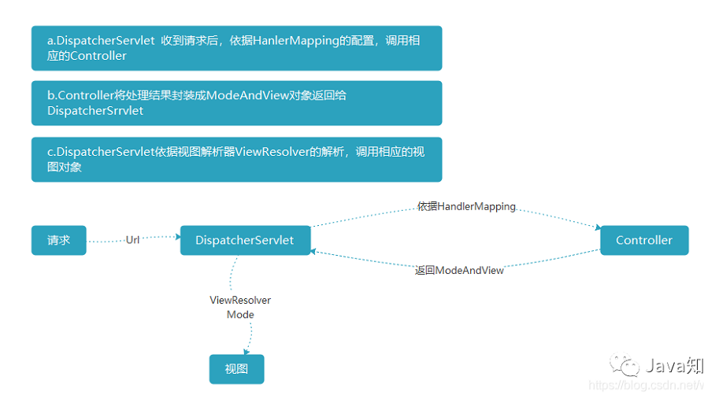

# 一、五大组件

* DispatcherServlet
* HandleMapping
* Controller
* ModeAndView
* ViewResolver

```bash
- 1.DispatcherServlet
	这个控件是SpringMVC 最核心的一个控件，顾名思义其实他就是一个Servlet，是Spring写好的一个Servlet
- 2.HandleMapping
	控件标明了路径与Controller的对应关系，不同的路径访问不同的Controller
- 3.Controller
	用来处理业务逻辑的Java类
- 4.ModeAndView
	Mode用来绑定处理后所得的数据，View视图名
- 5.ViewResolver
	视图解析器明确了视图名与视图对象的关系，是调用demo.jsp还是调用demo.html,以及明确视图的位置
```



# 二、拦截器、过滤器、监听器

```bash
- 过滤器
	使用：首先需要实现Filter接口重写他的三个方法
	init：在容器中创建当前过滤器的时候自动调用
	destroy:在容器中销毁当前过滤器的时候自动调用
	doFilter ：过滤的具体操作
	- 作用
		1.登录认证：在一些应用中，可能会通过拦截器来验证用户的登录状态，如果没有登录或登录失败，会返回一个友好的页面
		2.记录系统日志：我们在常见应用中，通常要记录用户的请求信息，比如请求 ip
		3.通用处理：在应用程序中可能存在所有方法都要返回的信息
	
- 拦截器
	使用：需要实现 HandlerInterceptor 类，并且重写三个方法
	preHandle：在 Controoler 处理请求之前被调用
	postHandler：在 Controoler 处理请求执行完成后、生成视图前执行
	afterCompletion：在 DispatcherServlet 完全处理请求后被调用，通常用于记录消耗时间，也可以对一些资源进行处理
	- 作用：和filter差不多的作用

- 监听器
	通过 HttpSessionListener来统计当前在线人数、ip等信息。

- 拦截器与过滤器的区别
	1.过滤器是基于回调函数实现，无法注入 ioc 容器中的 bean
	2.拦截器是基于反射来实现，因此拦截器中可以注入 ioc 容器中的 bean，例如注入 Redis 的业务层来验证用户是否已经登录
```

**实现**

```java
// 过滤器
@Log4j2
public class MyFilter implements Filter {

    @Override
    public void init(FilterConfig filterConfig) throws ServletException {
        log.info("初始化过滤器");
    }
  
    @Override
    public void doFilter(ServletRequest servletRequest, ServletResponse response, FilterChain filterChain) throws IOException, ServletException {
        HttpServletRequest request = (HttpServletRequest)servletRequest;
        HttpServletResponseWrapper wrapper = new HttpServletResponseWrapper((HttpServletResponse) response);
        String requestUri = request.getRequestURI();
        log.info("请求地址是："+requestUri);
        if (requestUri.contains("/addSession")
            || requestUri.contains("/removeSession")
            || requestUri.contains("/online")
            || requestUri.contains("/favicon.ico")) {
            filterChain.doFilter(servletRequest, response);
        } else {
            wrapper.sendRedirect("/online");
        }
    }
  
    @Override
    public void destroy() {
        //在服务关闭时销毁
        log.info("销毁过滤器");
    }
}
// 拦截器
@Log4j2
@Component
public class MyInterceptor implements HandlerInterceptor {
    @Override
    public boolean preHandle(HttpServletRequest request, HttpServletResponse response, Object handler) throws Exception {
        log.info("【MyInterceptor】调用了:{}", request.getRequestURI());
        request.setAttribute("requestTime", System.currentTimeMillis());
        return true;
    }

    @Override
    public void postHandle(HttpServletRequest request, HttpServletResponse response,
                           Object handler, ModelAndView modelAndView) throws Exception {
        if (!request.getRequestURI().contains("/online")) {
            HttpSession session = request.getSession();
            String sessionName = (String) session.getAttribute("name");
            if ("haixiang".equals(sessionName)) {
                log.info("【MyInterceptor】当前浏览器存在 session:{}",sessionName);
            }
        }
    }

    @Override
    public void afterCompletion(HttpServletRequest request, HttpServletResponse response,
                                Object handler, Exception ex) throws Exception {
        long duration = (System.currentTimeMillis() - (Long)request.getAttribute("requestTime"));
        log.info("【MyInterceptor】[{}]调用耗时:{}ms",request.getRequestURI(), duration);
    }
}
// 监听器
@Log4j2
public class MyHttpSessionListener implements HttpSessionListener {

    public static AtomicInteger userCount = new AtomicInteger(0);

    @Override
    public synchronized void sessionCreated(HttpSessionEvent se) {
        userCount.getAndIncrement();
        se.getSession().getServletContext().setAttribute("sessionCount", userCount.get());
        log.info("【在线人数】人数增加为:{}",userCount.get());
      
        //此处可以在ServletContext域对象中为访问量计数，然后传入过滤器的销毁方法
        //在销毁方法中调用数据库入库，因为过滤器生命周期与容器一致
    }

    @Override
    public synchronized void sessionDestroyed(HttpSessionEvent se) {
        userCount.getAndDecrement();
        se.getSession().getServletContext().setAttribute("sessionCount", userCount.get());
        log.info("【在线人数】人数减少为:{}",userCount.get());
    }
}
```

**实例化**

```java
@Configuration
public class WebConfig implements WebMvcConfigurer {
    @Autowired
    MyInterceptor myInterceptor;

    @Override
    public void addInterceptors(InterceptorRegistry registry) {
        registry.addInterceptor(myInterceptor);
    }

    /**
     * 注册过滤器
     * @return
     */
    @Bean
    public FilterRegistrationBean filterRegistrationBean(){
        FilterRegistrationBean filterRegistration = new FilterRegistrationBean();
        filterRegistration.setFilter(new MyFilter());
        filterRegistration.addUrlPatterns("/*");
        return filterRegistration;
    }

    /**
     * 注册监听器
     * @return
     */
    @Bean
    public ServletListenerRegistrationBean registrationBean(){
        ServletListenerRegistrationBean registrationBean = new ServletListenerRegistrationBean();
        registrationBean.setListener(new MyHttpRequestListener());
        registrationBean.setListener(new MyHttpSessionListener());
        return registrationBean;
    }
}
```

