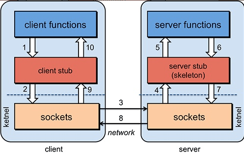
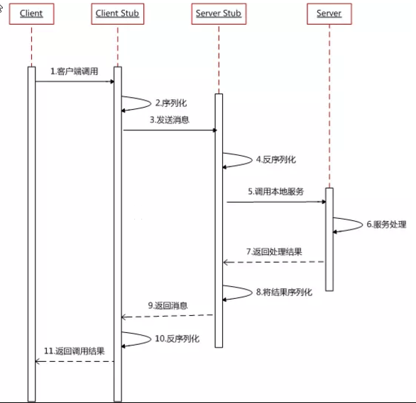
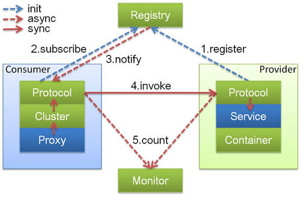
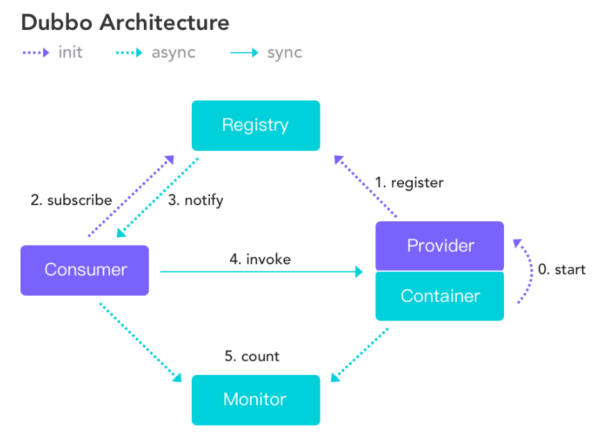
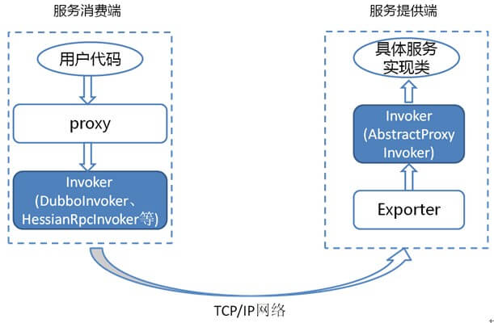
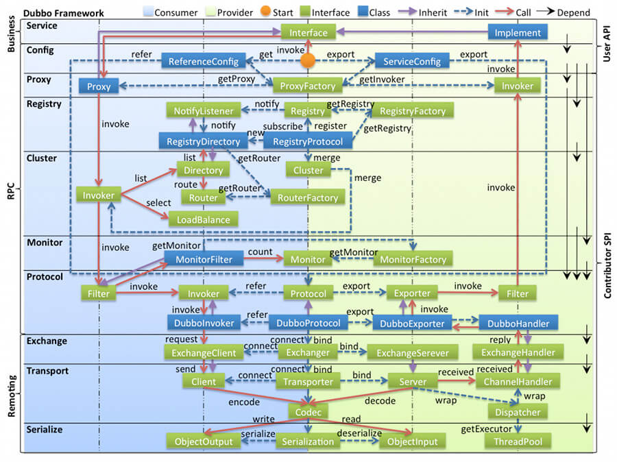
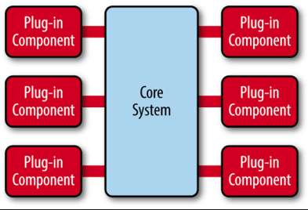
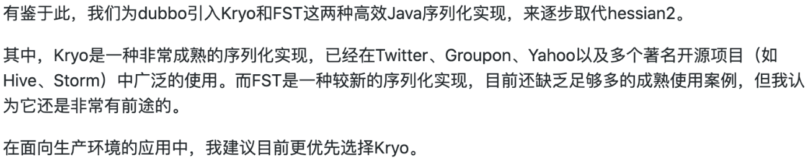

# 一、基础知识

## 1.1 什么是RPC

RPC（Remote Procedure Call）—远程过程调用，它是一种通过网络从远程计算机程序上请求服务，而不需要了解底层网络技术的协议。比如两个不同的服务 A、B 部署在两台不同的机器上，那么服务 A 如果想要调用服务 B 中的某个方法该怎么办呢？使用 HTTP请求 当然可以，但是可能会比较慢而且一些优化做的并不好。 RPC 的出现就是为了解决这个问题

**RPC的基本原理**



1. 服务消费端（client）以本地调用的方式调用远程服务；
2. 客户端 Stub（client stub） 接收到调用后负责将方法、参数等组装成能够进行网络传输的消息体（序列化）：`RpcRequest`；
3. 客户端 Stub（client stub） 找到远程服务的地址，并将消息发送到服务提供端；
4. 服务端 Stub（桩）收到消息将消息反序列化为Java对象: `RpcRequest`；
5. 服务端 Stub（桩）根据`RpcRequest`中的类、方法、方法参数等信息调用本地的方法；
6. 服务端 Stub（桩）得到方法执行结果并将组装成能够进行网络传输的消息体：`RpcResponse`（序列化）发送至消费方；
7. 客户端 Stub（client stub）接收到消息并将消息反序列化为Java对象:`RpcResponse` ，这样也就得到了最终结果。

**时序图**



RPC主要解决了：**让分布式或者微服务系统中不同服务之间的调用像本地调用一样简单**

## 二、Dubbo

## 2.1 概念

**特点**

* **面向接口代理的高性能RPC调用**：提供高性能的基于代理的远程调用能力，服务以及接口为粒度，为开发者屏蔽远程调用底层细节
* **智能负载均衡**：内置多种负载均衡策略，智能感知下游节点健康状况，显著减少调用延迟，提高系统吞吐量
* **服务自动注册与发现**：支持多种注册中心服务，服务实例上下线实时感知
* **高度可扩展能力**：遵循微内核+插件的设计原则，所有核心能力如Protocol、Transport、Serialization被设计为扩展点，平等对待内置实现和第三方实现
* **运行期流量调度**：内置条件、脚本等路由策略，通过配置不同的路由规则，轻松实现灰度发布，同机房优先等功能
* **可视化的服务治理与运维**：提供丰富的服务治理、运维工具：随时查询服务元数据，服务健康状态及调用统计，实时下发路由策略、调整配置参数

**设计架构**



上述节点简单介绍以及他们之间的关系：

- **Container：** 服务运行容器，负责加载、运行服务提供者。必须。
- **Provider：** 暴露服务的服务提供方，会向注册中心注册自己提供的服务。必须。
- **Consumer：** 调用远程服务的服务消费方，会向注册中心订阅自己所需的服务。必须。
- **Registry：** 服务注册与发现的注册中心。注册中心会返回服务提供者地址列表给消费者。非必须。
- **Monitor：** 统计服务的调用次数和调用时间的监控中心。服务消费者和提供者会定时发送统计数据到监控中心。 非必须

# 二、概念&架构

## 2.1 服务发现

服务发现，即消费端自动发现服务地址列表的能力，是微服务框架需要具备的关键能力，借助于自动化的服务发现，微服务之间可以在无需感知对端部署位置与 IP 地址的情况下实现通信。

实现服务发现的方式有很多种，Dubbo 提供的是一种 Client-Based 的服务发现机制，通常还需要部署额外的第三方注册中心组件来协调服务发现过程，如常用的 Nacos、Consul、Zookeeper 等，Dubbo 自身也提供了对多种注册中心组件的对接，用户可以灵活选择。

Dubbo 基于消费端的自动服务发现能力，其基本工作原理如下图



服务发现的一个核心组件是注册中心，Provider 注册地址到注册中心，Consumer 从注册中心读取和订阅 Provider 地址列表。 因此，要启用服务发现，需要为 Dubbo 增加注册中心配置：

以 dubbo-spring-boot-starter 使用方式为例，增加 registry 配置

```yml
# application.properties
dubbo
 registry
  address: zookeeper://127.0.0.1:2181
```

## RPC通信协议


# 知识点

## 1.分布式基础

### 什么是分布式？

分布式或者说 SOA 分布式重要的就是面向服务，说简单的分布式就是我们把整个系统拆分成不同的服务然后将这些服务放在不同的服务器上减轻单体服务的压力提高并发量和性能。

### 为什么要分布式

从开发角度来讲单体应用的代码都集中在一起，而分布式系统的代码根据业务被拆分。所以，每个团队可以负责一个服务的开发，这样提升了开发效率。另外，代码根据业务拆分之后更加便于维护和扩展。同时也提高了性能

## 2.Dubbo

### Dubbo中Invoker概念了解么

简单来说，`Invoker` 就是 Dubbo 对远程调用的抽象



* Invoker分为服务提供Invoker和服务消费Invoker
* 假如我们需要调用一个远程方法，我们需要动态代理来屏蔽远程调用的细节吧！我们屏蔽掉的这些细节就依赖对应的 `Invoker` 实现， `Invoker` 实现了真正的远程服务调用

### Dubbo的工作原理了解么



- **config 配置层**：Dubbo相关的配置。支持代码配置，同时也支持基于 Spring 来做配置，以 `ServiceConfig`, `ReferenceConfig` 为中心
- **proxy 服务代理层**：调用远程方法像调用本地的方法一样简单的一个关键，真实调用过程依赖代理类，以 `ServiceProxy` 为中心。
- **registry 注册中心层**：封装服务地址的注册与发现。
- **cluster 路由层**：封装多个提供者的路由及负载均衡，并桥接注册中心，以 `Invoker` 为中心。
- **monitor 监控层**：RPC 调用次数和调用时间监控，以 `Statistics` 为中心。
- **protocol 远程调用层**：封装 RPC 调用，以 `Invocation`, `Result` 为中心。
- **exchange 信息交换层**：封装请求响应模式，同步转异步，以 `Request`, `Response` 为中心。
- **transport 网络传输层**：抽象 mina 和 netty 为统一接口，以 `Message` 为中心。
- **serialize 数据序列化层** ：对需要在网络传输的数据进行序列化。

### Dubbo的SPI机制了解么

SPI（Service Provider Interface） 机制被大量用在开源项目中，它可以帮助我们动态寻找服务/功能（比如负载均衡策略）的实现

SPI 的具体原理是这样的：我们将接口的实现类放在配置文件中，我们在程序运行过程中读取配置文件，通过反射加载实现类。这样，我们可以在运行的时候，动态替换接口的实现类。和 IoC 的解耦思想是类似的。

### Dubbo的微内核架构了解吗

Dubbo 采用 微内核（Microkernel） + 插件（Plugin） 模式，简单来说就是微内核架构。微内核只负责组装插件。

微内核架构包含两类组件：**核心系统（core system）** 和 **插件模块（plug-in modules）**



核心系统提供系统所需核心能力，插件模块可以扩展系统的功能。因此， 基于微内核架构的系统，非常易于扩展功能。

我们常见的一些IDE，都可以看作是基于微内核架构设计的。绝大多数 IDE比如IDEA、VSCode都提供了插件来丰富自己的功能。

正是因为Dubbo基于微内核架构，才使得我们可以随心所欲替换Dubbo的功能点。比如你觉得Dubbo 的序列化模块实现的不满足自己要求，没关系啊！你自己实现一个序列化模块就好了啊！

### 关于Dubbo架构的一些自测小问题

**注册中心了解么**

注册中心负责服务地址的注册与查找，相当于目录服务，服务提供者和消费者只在启动时与注册中心交互。

**服务提供者宕机后，注册中心会做什么**

注册中心会立即推送事件通知消费者

**监控中心的作用**

监控中心负责统计各服务调用次数，调用时间等。

**监控中心和注册中心都宕机的话，服务都会挂掉吗**

不会。两者都宕机也不影响已运行的提供者和消费者，消费者在本地缓存了提供者列表。注册中心和监控中心都是可选的，服务消费者可以直连服务提供者

## 3.Dubbo的负载均衡策略

### 什么是负载均衡

负载均衡改善了跨多个计算资源工作负载分布。负载平衡旨在优化资源使用，最大化吞吐量，最小化响应时间，并避免任何单个资源的过载。

我们的系统中的某个服务的访问量特别大，我们将这个服务部署在了多台服务器上，当客户端发起请求的时候，多台服务器都可以处理这个请求。

### Dubbo提供的负载均衡策略有哪些

在集群负载均衡时，Dubbo 提供了多种均衡策略，默认为 `random` 随机调用。我们还可以自行扩展负载均衡策略

在 Dubbo 中，所有负载均衡实现类均继承自 `AbstractLoadBalance`，该类实现了 `LoadBalance` 接口，并封装了一些公共的逻辑

```java
public abstract class AbstractLoadBalance implements LoadBalance {
    static int calculateWarmupWeight(int uptime, int warmup, int weight) {
    }
    @Override
    public <T> Invoker<T> select(List<Invoker<T>> invokers, URL url, Invocation invocation) {
    }
    protected abstract <T> Invoker<T> doSelect(List<Invoker<T>> invokers, URL url, Invocation invocation);
    int getWeight(Invoker<?> invoker, Invocation invocation) {
    }
}
```

**RandomLoadBalance**

根据权重随机选择（对加权随机算法的实现）。这是Dubbo默认采用的一种负载均衡策略

`RandomLoadBalance` 具体的实现原理非常简单，假如有两个提供相同服务的服务器 S1,S2，S1的权重为7，S2的权重为3。

我们把这些权重值分布在坐标区间会得到：S1->[0, 7) ，S2->[7, 10)。我们生成[0, 10) 之间的随机数，随机数落到对应的区间，我们就选择对应的服务器来处理请求。

**LeastActiveLoadBalance**

`LeastActiveLoadBalance` 直译过来就是**最小活跃数负载均衡**。

初始状态下所有服务提供者的活跃数均为 0（每个服务提供者的中特定方法都对应一个活跃数，我在后面的源码中会提到），每收到一个请求后，对应的服务提供者的活跃数 +1，当这个请求处理完之后，活跃数 -1。

因此，**Dubbo 就认为谁的活跃数越少，谁的处理速度就越快，性能也越好，这样的话，我就优先把请求给活跃数少的服务提供者处理。**

如果有多个服务提供者的活跃数相等，则再走一遍RandomLoadBanlance

**ConsistentHashLoadBalance**

`ConsistentHashLoadBalance` 即**一致性Hash负载均衡策略**.

`ConsistentHashLoadBalance` 中没有权重的概念，具体是哪个服务提供者处理请求是由你的请求的参数决定的，也就是说相同参数的请求总是发到同一个服务提供者。

Dubbo 为了避免数据倾斜问题（节点不够分散，大量请求落到同一节点），还引入了虚拟节点的概念。通过虚拟节点可以让节点更加分散，有效均衡各个节点的请求量。

**RoundRobinLoadBanlance**

加权轮询负载均衡。轮询就是把请求依次分配给每个服务提供者。加权轮询就是在轮询的基础上，让更多的请求落到权重更大的服务提供者上。比如假如有两个提供相同服务的服务器 S1,S2，S1的权重为7，S2的权重为3。

如果我们有 10 次请求，那么 7 次会被 S1处理，3次被 S2处理

## Dubbo序列化协议

### Dubbo支持哪些序列化方式


Dubbo 支持多种序列化方式：JDK自带的序列化、hessian2、JSON、Kryo、FST、Protostuff，ProtoBuf等等。

Dubbo 默认使用的序列化方式是 hession2。

### 谈谈你对序列化协议了解

一般我们不会直接使用 JDK 自带的序列化方式。主要原因有两个：

1. **不支持跨语言调用** : 如果调用的是其他语言开发的服务的时候就不支持了。
2. **性能差** ：相比于其他序列化框架性能更低，主要原因是序列化之后的字节数组体积较大，导致传输成本加大。

像 Protostuff，ProtoBuf、hessian2这些都是跨语言的序列化方式，如果有跨语言需求的话可以考虑使用。

Kryo和FST这两种序列化方式是 Dubbo 后来才引入的，性能非常好。不过，这两者都是专门针对 Java 语言的。


