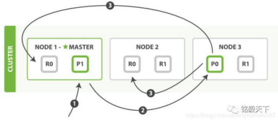
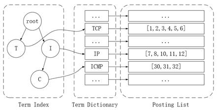
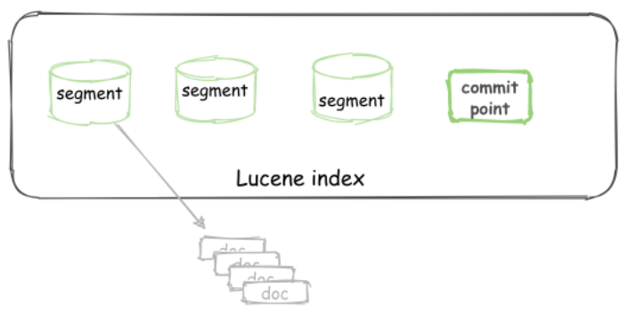
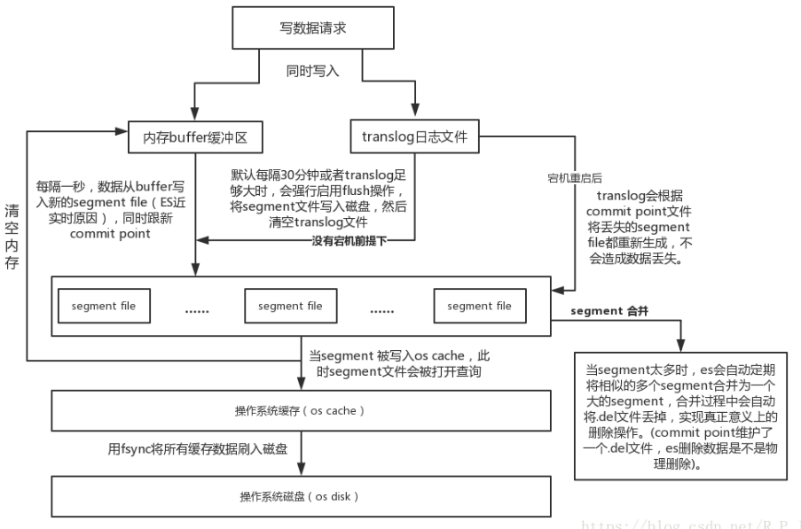
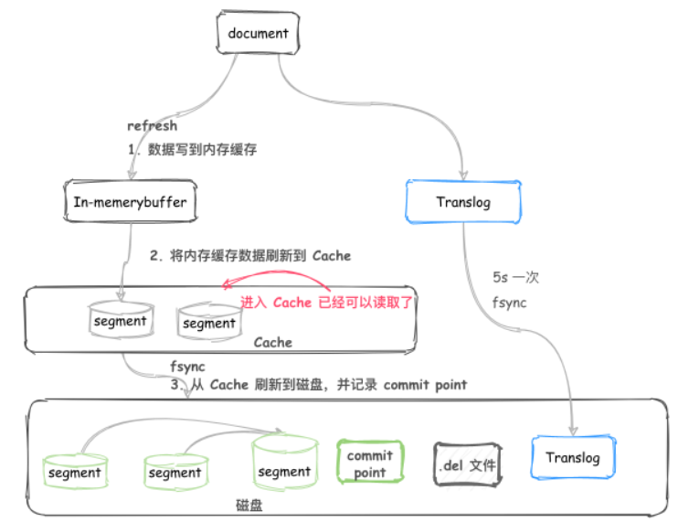

# 1.基本概念

```bash
- cluster
	集群的意思。集群由一个或多个节点组成。一个集群由一个主节点和多个数据节点组成。
	
- node
	节点的意思。一般一个节点就是一台主机。节点分为：主节点、数据节点、协调节点。
	每个节点都可以是协调节点，协调节点将搜索请求在两个阶段中执行。
	查询阶段，协调节点将请求转发到保存数据的数据节点，每个数据节点在本地执行请求，并将结果集返回到协调节点。在收集阶段，协调节点将每个数据节点的结果合并成一个结果集。
	- 主节点：主节点只有一个，负责集群范围内的轻量级操作，例如创建索引、删除索引、分配分片、添加和删除节点等。不负责文档级别的管理
	- 数据节点：可以有多个，包含建立索引的文档的分片
	
- document
	Elasticsearch是面向文档的，意味着索引和搜索的最小单元是文档。包括字段及其值。

- index
	索引是文档的集合。
	每当一个文档进来以后，会根据文档的id自动进行hash计算，并与主分片数进行取余操作，得到具体分片位置。shard_num = hash(_routing) % num_primary_shards
	建立一个索引需要告知需要主分片几个、副本分片几个(1个主分片对应的副本分片数量)
	主分片数量不能修改，但是副本分片数量是可以修改的
	
- shard
	分区。一个ES有一个主节点，多个数据节点。数据节点中包含了主分片和副本分片，每个主分片可以设置自己有几个副本分片。
	主分片数量不能修改，但是副本分片数量是可以修改的
	分区的原因：允许水平的扩展你的内容量、分片之间进行分布式、并行操作，进而提高性能和吞吐量。
	分类的原因：主分片作用是将索引分为好几份，分布在不同节点上，减轻单个节点的数据压力；副本分片作用是增加故障转移，排除单节点故障的发生和提高性能。查询请求可以由主分片或副本分片处理。
	number_of_replicas：每个主分片对应的副本分片数量
	number_of_shards：副本分片数量
```

data 节点可以关闭 http 功能

脑裂问题？

别名？模板？

# 1.调优手段

**设计阶段**

* 根据业务增量需求，采用基于日期模板创建索引

* 使用别名进行索引管理。索引别名可以指向一个或多个索引

* 采取冷热分离机制，热数据存储到 SSD，提高检索效率；冷数据定期进行 shrink操作，以缩减存储

**写入阶段**

* 写入前,考虑通过设置 index.number_of_replicas: 0 副本数设置为 0(关闭副本)
* 写入前关闭 refresh_interval 设置为-1，禁用刷新机制；将flush时间变长，避免了频繁的操作影响插入效率(如果你的搜索结果不需要近实时的准确度，考虑把每个索引的index.refresh_interval 改到 3)
* 写入过程中：采取 bulk 批量写入
* 尽量使用自动生成的 id
* 将单线程改用多线程，可以实现请求的并发处理
* 储存：使用SSD

**查询阶段**

每次refresh都会创建一个新的Lucene段，每个搜索请求需要轮流检查每个段，查询完在对这些结果进行合并，所以段越多，搜索就越慢。所以搜索优化可以对段合并考虑。

* 充分利用倒排索引机制，能 keyword 类型尽量 keyword
* 数据量大时候，可以先基于时间敲定索引再检索
* 设置合理的路由机制

#   2.倒排索引是什么

与倒排索引相反的一种索引机制是正排索引，我们熟知的Mysql采用的就是正排索引的结构，通过id可以查询到相关联的信息内容。倒排索引是在正排索引的基础上进行了反向思维转换，将单词作为索引单元，将文档id作为检索的结果集。倒排索引结构是根据关键词指出含有此关键字的文档id列表

由于互联网上用户搜索关键字“华为手机”，假设只存在正向索引，那么就需要扫描索引库的所有文档，找出含有关键词”华为手机”的文档，再根据打分模型进行打分，排出名次后呈现给用户。

倒排索引的底层实现时基于FST数据结构的。FST有两个优点：1.空间占用小2.查询速度快。

| **Term** | **Posting List** |
| -------- | ---------------- |
| TCP      | [1,2,3,4,5,6]    |
| UDP      | [9,15,22]        |
| IP       | [7,8,10,11,12]   |

# 3.Elasticsearch索引数据多了怎么办，如何调优，部署

**动态索引层面**：基于模板+时间+rollover api 滚动创建索引，举例：设计阶段定义：blog 索引的模板格式为：blog_index_时间戳的形式，每天递增数据。这样做的好处：不至于数据量激增导致单个索引数据量非常大，一旦单个索引很大，存储等各种风险也随之而来，

**储存层面**：冷热数据分离存储，热数据（比如最近 3 天或者一周的数据），其余为冷数据。对于冷数据不会再写入新数据，可以考虑定期 force_merge 加 shrink 压缩操作，节省存储空间和检索效率

**部署层面**：一旦之前没有规划，这里就属于应急策略。结合 ES 自身的支持动态扩展的特点，动态新增机器的方式可以缓解集群压力

# 4.elasticsearch 是如何实现 master 选举的

前置前提：
1、只有候选主节点（master：true）的节点才能成为主节点。
2、最小主节点数（min_master_nodes）的目的是防止脑裂

第一步：确认候选主节点数达标，elasticsearch.yml 设置的值discovery.zen.minimum_master_nodes

第二步：比较：先判定是否具备 master 资格，具备候选主节点资格的优先返回；若两节点都为候选主节点，则 id 小的值会主节点。注意这里的 id 为 string 类型

```bash
2.对所有可以成为 master 的节点（node.master: true）根据 nodeId 字典排序，每次选举每个节点都把自己所知道节点排一次序，然后选出第一个（第 0 位）节点，暂且认为它是 master 节点。
3.如果对某个节点的投票数达到一定的值（可以成为 master 节点数 n/2+1）并且该节点自己也选举
自己，那这个节点就是 master。否则重新选举一直到满足上述条件。
```


# 5.详细描述一下 Elasticsearch 索引文档的过程

文档写入包含：单文档写入和批量 bulk 写入，这里只解释一下：单文档写入流程



第一步：客户向集群某节点写入数据，发送请求。（如果没有指定路由/协调节点，请求的节点扮演路由节点的角色。）

第二步：节点 1 接受到请求后，使用文档_id 来确定文档属于分片 0。请求会被转到另外的节点，假定节点 3。因此分片 0 的主分片分配到节点 3 上。

第三步：节点 3 在主分片上执行写操作，如果成功，则将请求并行转发到节点 1和节点 2 的副本分片
上，等待结果返回。所有的副本分片都报告成功，节点 3 将向协调节点（节点 1）报告成功，节点 1 向请求客户端报告写入成功。

```bash
- 如果面试官再问：第二步中的文档获取分片的过程?
	借助路由算法获取，路由算法就是根据路由和文档 id 计算目标的分片 id 的过程。 
	shard = hash(_routing) % (num_of_primary_shards)
```

# 6.详细描述一下 Elasticsearch 搜索的过程

搜索拆解为“query then fetch” 两个阶段。query 阶段的目的：定位到位置，但不取。

步骤拆解如下：

* 假设一个索引数据有 5 主+1 副本 共 10 分片，一次请求会命中（主或者副本分片中）的一个
* 每个分片在本地进行查询，结果返回到本地有序的优先队列中
* 第 2）步骤的结果发送到协调节点，协调节点产生一个全局的排序列表。

fetch 阶段的目的：取数据。

路由节点获取所有文档，返回给客户端。 

# 7.Elasticsearch 中的节点（比如共 20个），其中的 10 个选了一个 master，另外 10 个选了另一个 master，怎么办？

1、当集群 master 候选数量不小于 3 个时，可以通过设置最少投票通过数量（discovery.zen.minimum_master_nodes）超过所有候选节点一半以上来解决脑裂问题；
2、当候选数量为两个时，只能修改为唯一的一个 master 候选，其他作为 data节点，避免脑裂问题

# 8.详细描述一下 Elasticsearch 插入文档(索引文档)的过程

协调节点默认使用文档 ID 参与计算：shard = hash(document_id) % (num_of_primary_shards)

1. 当分片所在的节点接收到来自协调节点的请求后，会将请求写入到 Memory Buffer，然后定时（默
   认是每隔 1 秒）写入到 Filesystem Cache，这个从 MomeryBuffer 到 Filesystem Cache 的过程就叫做
   refresh；
2. 当然在某些情况下，存在 Momery Buffer 和 Filesystem Cache 的数据可能会丢失，ES 是通过
   translog 的机制来保证数据的可靠性的。其实现机制是接收到请求后，同时也会写入到 translog 中，
   当 Filesystem cache 中的数据写入到磁盘中时，才会清除掉，这个过程叫做 flush；
3. 在 flush 过程中，内存中的缓冲将被清除，内容被写入一个新段，段的 fsync将创建一个新的提交
   点，并将内容刷新到磁盘，旧的 translog 将被删除并开始一个新的 translog。
4. flush 触发的时机是定时触发（默认 30 分钟）或者 translog 变得太大（默认为 512M）时

# 9.详细描述一下 Elasticsearch 更新和删除文档的过程

1、删除和更新也都是写操作，但是 Elasticsearch 中的文档是不可变的，因此不能被删除或者改动以展
示其变更；
2、磁盘上的每个段都有一个相应的.del 文件。当删除请求发送后，文档并没有真的被删除，而是在.del
文件中被标记为删除。该文档依然能匹配查询，但是会在结果中被过滤掉。当段合并时，在.del 文件中
被标记为删除的文档将不会被写入新段。
3、在新的文档被创建时，Elasticsearch 会为该文档指定一个版本号，当执行更新时，旧版本的文档
在.del 文件中被标记为删除，新版本的文档被索引到一个新段。旧版本的文档依然能匹配查询，但是会
在结果中被过滤掉。

# 10详细描述一下 Elasticsearch 搜索的过程

1. 搜索被执行成一个两阶段过程，我们称之为 Query Then Fetch；
2. 在初始查询阶段时，查询会广播到索引中每一个分片拷贝（主分片或者副本分片）。 每个分片在本
   地执行搜索并构建一个匹配文档的大小为 from + size 的优先队列
3. 每个分片返回各自优先队列中 所有文档的 ID 和排序值 给协调节点，它合并这些值到自己的优先队
   列中来产生一个全局排序后的结果列表
4. 接下来就是 取回阶段，协调节点辨别出哪些文档需要被取回并向相关的分片提交多个 GET 请求。每
   个分片加载并 丰富 文档，如果有需要的话，接着返回文档给协调节点。一旦所有的文档都被取回了，
   协调节点返回结果给客户端。

# 11.在并发情况下，Elasticsearch 如果保证读写一致？

* 可以通过版本号使用乐观并发控制，以确保新版本不会被旧版本覆盖，由应用层来处理具体的冲
  突
* 另外对于写操作，一致性级别支持 quorum/one/all，默认为 quorum，即只有当大多数分片可用时
  才允许写操作。但即使大多数可用，也可能存在因为网络等原因导致写入副本失败，这样该副本被认为
  故障，分片将会在一个不同的节点上重建
* 对于读操作，可以设置 replication 为 sync(默认)，这使得操作在主分片和副本分片都完成后才会返
  回；如果设置 replication 为 async 时，也可以通过设置搜索请求参数_preference 为 primary 来查询
  主分片，确保文档是最新版本。 

# 12.是否了解字典树

字典树核心思想是空间换时间，利用字符串的公共前缀来降低查询时间的开销以达到提高效率的目的。

它有 3 个基本性质

* 根节点不包含字符，除根节点外每一个节点都只包含一个字符
* 从根节点到某一节点，路径上经过的字符连接起来，为该节点对应的字符串
* 每个节点的所有子节点包含的字符都不相同。

Elasticsearch为了更加高效进行模糊查询，比如查询报文类型中包含T的数据有哪些，**它会将文本拆分成一个一个独立的单词(Term)，然后将所有的Term合并在一起就是一个Term Dictionary，称之为单词词典**。当文本数据量很大的时候，分词的Term也会很多，为了可以在内存中存放更多的倒排索引，提高搜索效率，**Elasticsearch采用了字典树的数据结构来为Term Dictionary建立一个索引**，这样就可以将这个索引放入内存中，减少了磁盘IO读取次数，效率就会提高很多。如图3-1所示，表示了Elasticsearch索引机制的基本原理，其中Term Index是存放在内存中，也是提高查询效率的关键。



图3-1 索引结构关系图

以上是单字段下的基本检索原理，当用户对两个字段进行同时检索时，Elasticsearch会利用Bitmap进行优化处理，比如我们需要查询type=TCP and Num = 10的数据，这时我们需要通过这两个字段将各自的结果集取出，

| **Name** | **Posting List** |
| -------- | ---------------- |
| type=TCP | [1,3,5]          |
| Num = 10 | [1,2,4,5]        |

为了提高效率，**Elasticsearch采用Bitmap的方式进行储存**（还节省了储存空间），同时利用位与运算便可以很快的计算出结果。

[1,3,5] => 10101

[1,2,4,5] => 11011

将这两个二进制数据进行位与运算便可得到结果：10001 => [1,5]，检索效率可以提高很多。

# 13.ES插入流程和优化手段

**Lucene**

Lucene 是 Elasticsearch所基于的 Java 库，它引入了按段搜索的概念。

Segment： 也叫段，类似于倒排索引，相当于一个数据集。Commit point：提交点，记录着所有已知的段。 Lucene index：由一堆 Segment 的集合加上一个提交点组成。



另外，**Elasticsearch**由一个一个 Elasticsearch Index 由一个或者多个 shard （分片） 组成，而 Lucene 中的 Lucene index 相当于 ES 的一个 shard

**写入过程**

1.在将documents写入到 In-memory buffer (内存缓冲区)，同时也会写到translog日志文件中(文档不能被搜索到)

2.当满足一定条件[1]时内存缓冲区中的documents会被**refresh**到filesystem cache中，生成新的segment，这个segment还在filesystem cache中，但此时的文档是可以搜索的

3.最后满足一定条件[2]，从cache中**flush**到磁盘，并记录commit point

```bash
- 条件1
	"refresh_interval": "1s",默认每隔1s，数据会从buffer写入新的segment file(ES近实时原因)，同时更新commit point
- 条件2
	默认每隔30min或者translog足够大时，会强行启动flush操作，将操作系统缓存中的segment文件写入磁盘，然后清空translog文件

- 概念
	refresh：是将文档从内存缓冲区写入文件系统cache，并产生一个新的segment段，此时的文档是可以被查询到的
	flush：flush = translog中的记录刷到磁盘上 + 更新commit point信息 + 清空translog文件. 换句话说，将内存缓冲区中的所有文档都写入新的 Lucene Segment，连同所有现有的内存段一起被提交到磁盘，更新提交点，并将该磁盘的事务日志清空
	.del：被标记为删除，后续会进行物理删除
```



**segment合并**

每 1s 执行一次 refresh 都会将内存中的数据创建一个 segment。

segment 数目太多会带来较大的麻烦。 每一个 segment 都会消耗文件句柄、内存和cpu运行周期。更重要的是，每个搜索请求都必须轮流检查每个 segment ；所以 segment 越多，搜索也就越慢。

在 ES 后台会有一个线程进行 segment 合并

* refresh操作会创建新的 segment 并打开以供搜索使用。
* 合并进程选择一小部分大小相似的 segment，并且在后台将它们合并到更大的 segment 中。这并不会中断索引和搜索
* 当合并结束，老的 segment 被删除 说明合并完成



**优化**

```bash
默认配置：
	refresh_interval: 1s  # 每1s中将内存缓冲区的文档写入filesystem cache，生成新的segment
	translog.flush_threshold_size: 512mb # translog文件的大小达到上限(默认为512MB)时主动触发flush
	translog.flush_threshold_period: 30min # 每隔多长时间执行一次flush操作, 默认是30min
	translog.sync_interval: 5s # 并执行一次flush操作的间隔, 默认是5s.我的理解是每5s刷新磁盘上的translog文件，但是不持久化segment
	translog.durability": "async"	# 设置为async表示translog的刷盘策略按sync_interval配置指定的时间周期进行异步刷新translog，提高效率。 request(默认)每个请求都持久化translog文件
	
- 优化
	1.`加大translog flush周期`。ES默认每个request都会刷新translog文件。这也是影响ES写入速度的最大因素。但是只有这样，写操作才有可能是可靠的。如果系统可以接受一定概率的数据丢失(数据写入主分片成功,尚未复制到副本分片，主机断电)，可以调整translog刷盘策略。
	默认：index.translog.durability: request	但是不容易丢失内容
	优化：
		#设置为async表示translog的刷盘策略按sync_interval配置指定的时间周期进行
		index.translog.durability: async
		#加大translog刷盘间隔时间。默认5s，不可低于100ms。
		index.translog.sync_interval: 120s
		#超过这个大小会导致flush操作。默认值512MB
		index.translog.flush_threshold_size: 1024mb
	
    2.`加大refresh_interval间隔`默认情况下索引的refresh_interval为1秒，这意味着数据写入1秒后就可以被搜索到，每次索引的refresh会产生一个新的Lucene段，这会导致频繁的segment merge行为，如果不需要这么高的搜索实时性应该降低索引refresh周期。
    优化：
    	index.refresh_interval: 120s
   3.`使用bulk请求`。 	批量写比一个索引请求只写单个文档的效率高得多，但是要注意bulk请求的整体字节数不要太大，因此每个请求最好避免超过几十兆字节。
   4.`并发请求`。bulk写请求是个长任务，为了给系统增加足够的写入压力，写入过程应该多个客户端、多线程的并行执行
   5.`自动生成doc ID`.写入doc时如果外部指定了id，则es会尝试读取原来doc的版本号，以判断是否需要更新。这会涉及一次读取磁盘操作，通过自动生成doc ID可以避免这个环节
```

**参考配置**

```json
{
    "template":"*",
    "order":0,
    "settings":{
        //单个分段的最大容量
        "index.merge.policy.max_merged_segment":"2gb",
        //每层分段的数量，值越小，合并操作越多，可以适当增加，默认10
        //不要小于max_merge_at_once
        "index.merge.policy.segments_per_tier":"24",
        //索引刷入操作系统缓存时间，默认1秒
        "index.refresh_interval":"120s",
        //索引刷入操作系统缓存策略，默认request，改为定时刷新
        "index.translog.durability":"async",
        //索引刷入磁盘的translog的阈值，默认512mb，提交commit point
        "index.translog.flush_threshold_size":"512mb",
        //日志刷新磁盘的时间，默认5s
        "index.translog.sync_interval":"120s",
        //索引分配延迟时间，默认1分钟
        "index.unassigned.node_left.delayed_timeout":"5d"
    }
}
```

# 14.ES搜索流程和优化手段

```bash
倒排索引是词典 ( Term Dictionary ) 到文档列表 ( Postings List ) 的映射关系
```


