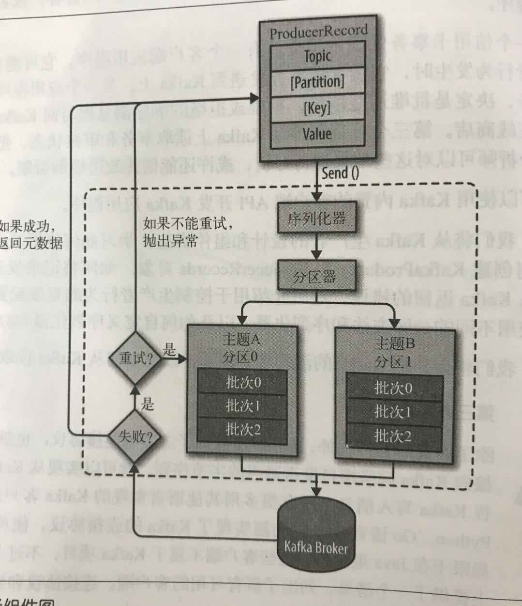
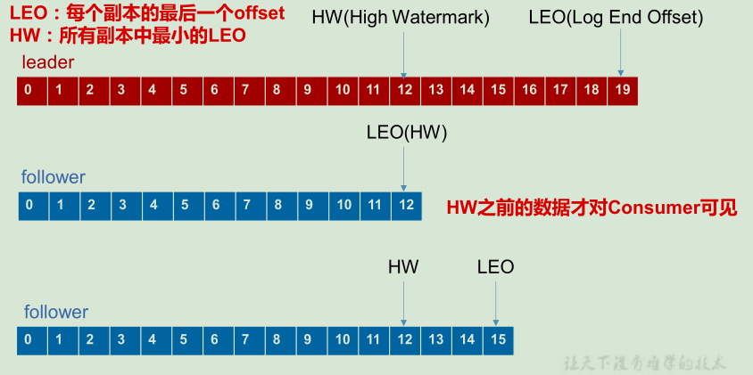

# 一.消息队列介绍

**1.什么是消息队列？**

我们可以把消息队列看作是一个存放消息的容器，当我们需要使用消息的时候，直接从容器中取出消息供自己使用即可。消息发布者只需要将消息发布到MQ中而不需要管谁来取，消费者直管从MQ中取消息而不管是谁发布的。

**2.为什么要使用消息队列？**

这就要说到消息队列的优点了

* **解耦**：允许你独立的扩展或修改两边的处理过程，只要确保它们遵守同样的接口约束
* **削峰**：使用消息队列能够使关键组件顶住突发的访问压力，而不会因为突发的超负荷的请求而完全崩溃。
* **异步通信**：消息队列提供了异步处理机制，允许用户把一个消息放入队列，但并不立即处理它。

传统与MQ对比？

比如：订单系统，其中可能的逻辑包括扣减库存和发短信， **在业务发展初期这些逻辑可能放在一起同步执行**，随着业务的发展订单量增长，需要提升系统服务的性能，这时可以**将一些不需要立即生效的操作拆分出来异步执行**，比如发放红包、发短信通知等。

**3.消息队列的两种模式是什么？**

1.点对点模型

**使用队列（Queue）作为消息通信载体；满足生产者与消费者模式**，一条消息只能被一个消费者使用，未被消费的消息在队列中保留直到被消费或超时。(如果生产100条消息，则两个消费者各自消费一半，你一个我一个)

2.发布订阅模型

消息发布者将消息发布到topi主题中，类似广播模式；如果发布者发布一条消息，该消息通过主题递给所有的订阅者，**在一条消息广播之后才订阅的用户则是收不到该条消息的**。

# 二 Kafka

## 2.1 kafka介绍

**1.kafka是什么？**

Kafka 是一个分布式流式处理平台，用于10万级别的单机吞吐量，是一个非常优秀的消息队列。

**2.和其他消息队列相比，kafka的优势在哪里？**

其他消息队列，举例为RabbitMQ、RocketMQ。

首先Kafka拥有以下优势，**1.极致的性能**，设计中大量使用了批量处理和异步的思想，单机吞吐量可以达到十万级级别，延迟在ms级以下，通过参数优化可以实现消息0丢失。**2.生态系统兼容性很强**，kafka与周边生态系统的兼容性是最好的，尤其是大数据和流计算。

* RabbitMQ：单机吞吐量是万级，比RocketMQ和Kafka低了一个数量级；消息延迟在微秒级别，延迟是最低的；又很低的概率会丢失消息；是由erlang开发，所以很难看懂源码
* RocketMQ:单机吞吐量是十万级；topic可以达到几百、几千个的级别，吞吐量会有较小幅度的下降，这也是RocketMQ的一大优势，在同等机器下可以支持大量的topic；时效性是ms级别；经过参数配置优化，可以做到0丢失；
* Kafka：单机吞吐量是十万级；topic可以达到几百、几千级别，但是从几十到几百个的时候，吞吐量会大幅度下降，所以kafka需要保证topic不要过多；延迟在ms级别；经过参数配置优化，可以做到0丢失；可扩展性很强，天然适合大数据计算，生态兼容无敌。**kafka具有高吞吐、低时延、高可用性**

**3.请你介绍一下kafka的一些专业名词？**

* 生产者：生产消息的一方

* 消费者：消费消息的一方。

* Broker(代理)：可以看做是一个独立的kafka实例。对个broker组成一个kafka集群。

* 主题和分区：Producer 将消息发送到特定的主题，Consumer 通过订阅特定的 Topic(主题) 来消费消息。主题可以被分为若干个分区，消息以追加的方式写入分区，只能保证单个分区内有序，不能保证主题范围内有序。分区使kafka可以分布到多个服务器上，以此提供比单个服务器更强大的功能。

* 保留策略：是kafka的一个重要特性。要么保留7天或者保留消息不超过1GB

**4.kafka部署**

配置文件：

```bash
#broker 的全局唯一编号，不能重复
broker.id=0
#删除 topic 功能使能
delete.topic.enable=true
#处理网络请求的线程数量
num.network.threads=3
#用来处理磁盘 IO 的现成数量
num.io.threads=8
#发送套接字的缓冲区大小
socket.send.buffer.bytes=102400
#接收套接字的缓冲区大小
socket.receive.buffer.bytes=102400
#请求套接字的缓冲区大小
socket.request.max.bytes=104857600
#kafka 运行日志存放的路径
log.dirs=/opt/module/kafka/logs
#topic 在当前 broker 上的分区个数
num.partitions=1
#用来恢复和清理 data 下数据的线程数量
num.recovery.threads.per.data.dir=1
#segment 文件保留的最长时间，超时将被删除
log.retention.hours=168
#配置连接 Zookeeper 集群地址
zookeeper.connect=hadoop102:2181,hadoop103:2181,hadoop104:2181
```

## 2.2 Kafka架构

**1.那你介绍一下kafka的工作流程**

​	Kafka 中消息是以 topic 进行分类的，生产者生产消息，消费者消费消息，都是面向 topic的。

​	topic 是逻辑上的概念，而 partition 是物理上的概念，每个 partition 对应于一个 log 文件，该 log 文件中存储的就是 producer 生产的数据。Producer 生产的数据会被不断追加到该log 文件末端，且每条数据都有自己的 offset。消费者组中的每个消费者，都会实时记录自己消费到了哪个 offset，以便出错恢复时，从上次的位置继续消费

**2.kafka多副本机制了解吗**

Kafka 为分区（Partition）引入了多副本（Replica）机制，分区（Partition）中的多个副本之间会有一个叫做 leader 的家伙，其他副本称为 follower。我们发送的消息会被发送到 leader 副本，然后 follower 副本才能从 leader 副本中拉取消息进行同步。

**3.Kafka 的多分区（Partition）以及多副本（Replica）机制有什么好处呢？**

* Kafka 通过给特定 Topic 指定多个 Partition, 而各个 Partition 可以分布在不同的 Broker 上, 这样便能提供比较好的并发能力（负载均衡）。

* Partition 可以指定对应的 Replica 数, 这也极大地提高了消息存储的安全性, 提高了容灾能力，不过也相应的增加了所需要的存储空间。

**4.你知道Zookeeper在Kafka中的作用嘛**

* **broker注册**：在 Zookeeper 上会有一个专门**用来进行 Broker 服务器列表记录**的节点。
* Topics注册：在 Kafka 中，同一个**Topic 的消息会被分成多个分区**并将其分布在多个 Broker 上，**这些分区信息及与 Broker 的对应关系**也都是由 Zookeeper 在维护
* **负载均衡** ：上面也说过了 Kafka 通过给特定 Topic 指定多个 Partition, 而各个 Partition 可以分布在不同的 Broker 上, 这样便能提供比较好的并发能力。

**5.请你讲一下kafka是如何保证消息不丢失的？**

* 生产者丢失消息情况
  * 生产者发送消息默认采用的是异步发送，可以通过get()调用获取结果，但一般采用添加回调函数的形式。如果发送失败的话，通过设置`retries`(重试次数)来重新发送消息，一般是3，但为了保证消息不丢失一般会设置比较大一点。另外还需要设置重试间隔，因为间隔太小重试的效果就不明显了
  * ack为0是leade一接收还没有落盘就返回ack，容易丢失消息；ack为1，只有leader落盘了，如果leader宕机就会丢失消息；ack为-1，可以保证leader和follower都罗盘了，保证消息不丢失
* 消费者丢失消息情况
  * 消息在被追加到 Partition(分区)的时候都会分配一个特定的偏移量（offset）。偏移量（offset)表示 Consumer 当前消费到的 Partition(分区)的所在的位置。当自动提交offset时，如果刚拿到一个消息，突然挂掉了实际上并没有消费，但是offset却被自动提交了。解决办法：消费消息幂等性，使用redis、mysql等；将自动提交关闭，在真正消费完消息之后在手动提交offset，但这样会重复消费。
* kafka自身弄丢了消息
  * 假如 leader 副本所在的 broker 突然挂掉，那么就要从 follower 副本重新选出一个 leader ，但是 leader 的数据还有一些没有被 follower 副本的同步的话，就会造成消息丢失。所以需要ack=-1(all)
  * 所以需要设置每个分区有3个以上的副本，来保证系统的可靠性，虽然增加了数据冗余，但是带来了数据的安全性

## 2.3 生产者




**1.你说一下kafak分区的原因**

* **可以提高并发**。Kafka 通过给特定 Topic 指定多个 Partition, 而各个 Partition 可以分布在不同的 Broker 上, 这样便能提供比较好的并发能力（负载均衡）
* **方便在集群中扩展**。每个 Partition 可以通过调整以适应它所在的机器，而一个 topic又可以有多个 Partition 组成，因此整个集群就可以适应任意大小的数据了；

**2.那你了解分区的方式嘛**

首先生产者发送的数据会被封装成一个ProduceRecord对象。在创建ProduceRecord对象时可分为以下几种情况

* 指明partition情况下，直接将指明的值作为partition值
* 没有指明partition值但有key的情况下，将key的hash值与topic的partition数进行取余操作得到partition值
* 既没有partition也没有key的情况下，第一次调用时随机生成一个整数(后面每次调动在这个整数上自增)，将这个值与topic可用的partition总数取余得到partition值，也就是常说的round-robin算法。

每一个分区都对应这一个log文件，log文件中储存的是producer生产的数据，producer生产的数据会被不断追加到该log文件末端，且每条数据都有自己的offset。可以消息保证区内有序，但不能保证分区间有序。

**3.那你说一下Producer发送消息的大致流程**

* 首先创建一个Producer对象，Producer对象需要包括主题和消息，还可以设置键和分区。
* 在发送Producer对象时，生产者会内容经过序列化器进行序列化操作，最终变为字节流，这样才能够在网络上传输
* 接下来要根据分区器进行分区操作，如果设置了分区则直接到达指定分区位置；如果没有设置分区设置了键，则会使用键的hash值与主题的分区数进行取余操作，得到的数即为分区值；如果都没有设置则发送时随机生成一个整数，并与topic可用的partiton数进行取余获得分区值，随机数在下次依次递增。选好分区后，生产者就知道向那个主题和那个分区发送这条记录了。
* 如果有批次设置，则会根据批次设置，如果批次可用内存满了或者指定时间到了都会发送消息。如果发送成功会返回元数据信息，包括主题和分区信息等，如果返回错误，则会根据重试次数和重试时间进行重试操作，如果重试次数用完，就会返回错误信息。

**4.你了解故障处理的细节嘛(如何保证副本之间的数据一致性)**



LEO(log end offset)：指的是每个follower最大的 offset；

HW(high watermark)：指的是消费者能见到的最大的 offset，ISR 队列中最小的 LEO

* follower故障：follower 发生故障后会被临时踢出 ISR，待该 follower 恢复后，follower 会读取本地磁盘记录的上次的 HW，并将 log 文件高于 HW 的部分截取掉，从 HW 开始向 leader 进行同步。等该 follower 的 LEO 大于等于该 Partition 的 HW，即 follower 追上 leader 之后，就可以重新加入 ISR 了。
* leader故障：leader 发生故障之后，会从 ISR 中选出一个新的 leader，新的leader是LEO最大的那个，其余的follower先将各自log文件高与HW的部分截掉，然后从新的leader同步数据。

注意：这只能保证副本之间的数据一致性，并不能保证数据不丢失或者不重复

**5.kafka是如何保证生产者数据传输的可靠性的？**

* **ack确认机制**：为保证producer发送数据的可靠性，topic的每个partition收到消息后，都需要想producer发送ack，如果producer收到ack，就会进行下一轮的发送，否则重新发送数据。
  * kafka为用户提供了三种可靠性级别
    * 0：producer 不等待 broker 的 ack，这一操作提供了一个最低的延迟，broker 一接收到还没有写入磁盘就已经返回，当 broker 故障时有可能**丢失数据**；
    * 1：producer 等待 broker 的 ack，partition 的 leader 落盘成功后返回 ack，如果在 follower同步成功之前 leader 故障，那么将会**丢失数据**；
    * -1(all)：producer 等待 broker 的 ack，partition 的 leader 和 follower 全部落盘成功后才返回 ack。但是如果在 follower 同步完成后，broker 发送 ack 之前，leader 发生故障，那么会造成==**数据重复**==。
* **ISR**：保证了kafka的稳定性，实时性。设想如果leader收到数据了，所有的follower都开始同步数据，但此时有一个follower由于某种故障迟迟不能与leader进行同步，那么leader就要一直等下去，所以为了解决这个问题引入了ISR。Leader会维护一个动态的副本集合(in-sync replica set)，意思是和leader保持同步的follower集合，当ISR中的follower完成数据同步之后，follower就会给leader发送ack，如果leader长时间收不到某一个follower的消息，就会将改follower踢出ISR。时间阈值是可以设置的。如果Leader发送故障了，也会从ISR中重新选举新的leader。
* **幂等性、事务**
  * 将ACK级别设置为-1，可以保证数据不会丢失，但是可能会重复发送，即At Least Once；将ACK设置成0，可以保证生产者每条消息只发送一次，即At Most Once。At Least Once 可以保证数据不丢失，但是不能保证数据不重复；相对的，At Most Once可以保证数据不重复，但是不能保证数据不丢失。但是有些业务需要消息不丢失也不重复即Exactly One。
  * 引入了幂等性特性。所谓的幂等性就是指 Producer 不论向 Server 发送多少次重复数据，Server 端都只会持久化一条。开启幂等性的Producer初始化时会被分配一个PID，发往同一个partition的消息会附带Sequence Number。而Broker端会对\<PID，Partition，SeqNumber\>做缓存，当具有相同主键的消息提交时，Broker只会持久化一条。但是PID重启会变化，同时不同的 Partition 也具有不同主键，所以幂等性无法保证跨分区跨会话的 Exactly Once。开启幂等性需要设置producer参数enable.idempotent为true
  * 事务保证原子性的写入多个分区，即写入到多个分区的消息要么全部成功，要么全部回滚。事务可以保证多分区写入消息的完整性。

**Kafka生产者参数详情**

```bash
bootstrap.servers:该属性指定broker的地址清单，地址格式host:port。建议提供两个broker信息，一旦其中一个宕机，生产者仍然可以连接到集群上

key.serializer:broker希望接收到的消息的键和值都是字节数组。键的序列化器，且为必选项。

value.serializer:和key.serializer一样，value.serializer会将指定的值序列化。

-----------------------------------------------------------------------------------------
-------------------------------
acks：指定了要有多少个分区副本收到消息，生产者才会认为写入成功。
	0：成功写入消息之前不会等待任何服务器的消息。只负责发送。
	1：只要集群的首领节点收到消息，生产者就会收到一个来自服务器的成功响应。
	all(或-1):只有当所有的副本都成功收到消息，生产者才会收到一个服务的成功响应。
	
buffer.memory:生产者内存缓存区的大小，用它来缓存要发送的消息。

compression.type:默认情况下，消息不会被压缩。提供压缩的方式。

retries:生产者可以重发消息的次数，如果达到这个次数，生产者会放弃重试并返回错误。

batch.size:当多个消息需要被发送到同一分区时，生产者会把它们放在同一个批次里。该参数指定了一个批次可以使用的内存大小，按照字节数计算(而不是消息个数)。消息填满或未满都可能发送，太小则会频繁发送。

linger.ms:生产者发送批次之前等待更多消息加入批次的时间。生产者会在批次填满或linger.ms达到上限时把批次发送出去。

client.id:服务用来识别消息的来源

max.in.flinght.request.connection:指定了生产者在收到服务响应之前可以发送多少消息。设为1，则可以保证按照发送的顺序写入服务器，即使发生了重试。
```

## 2.4 消费者

**1.消费者的消费方式有哪两种**

一种是pull(拉)模式从broker中读取数据，一种是push(推)模式向消费者推数据。push模式的消息发送速率完全由broker决定，这就很容易造成consumer来不及处理消息。所以一般会使用pull模式，但是这种模式也会有不足，如果kafka没有消息，消费者可能会进入循环，这是可以给消费者传入一个时长参数timeout，使consumer等待一段时间在重新去消费。

**2.消费者消费消息时，是如何分配分区的**

一个consumer group会有多个消费者，然后一个topic会有多个partition，所以针对哪个分区由哪个consumer消费，kafka有两种策略。一个是roundrobin，一个是range。

roundrobin就是将分区按照从头往后循环分配。即第一个分区分给consumer group的第一个consumer，第二个分区分给第二个，第三个以此类推。如果有三个消费者，则第四个分配给第一个消费者。

range方式是将分区数和消费者数进行平均分配，相除得到每个消费者分到几个分区。如果除数是2，则第一个消费者将分到前两个分区0/1，第二个消费者分到2/3，一次类推。

**3.你了解消费者的分区在均衡嘛**

当一个消费者被关闭或发生崩溃时，他就离开了群组，原本由它读取的分区将交给其他消费者来读取。在分区发生变化时，比如管理员添加了新的分区，会发生分区重分配。

**4.你觉得重复消费消息的原因有哪些**

* 自动提交：kafka消费者每5s会提交当前最大offset，在次期间发生分区增加或消费者崩溃或有新的消费者加入群，就会触发再均衡，此时重新分配分区，就会导致有些消费者消费了消息但未提交
* 手动提交：服务端消费了消息但是没有提交成功offset（消费完消息了但是自己挂掉了）

**5.消费者是如何维护offset，可以保证消息不重复消费**

因为消费者在消费过程中可能会出现宕机等故障，consumer恢复后，需要在故障前位置继续消费，所以consumer需要实时记录自己消费的位置offset，以便故障恢复后继续消费。

消费者依靠offset保证消息的传递，默认offset是自动提交的，每过5秒钟消费者会把自己接收到的最大偏移量提交上去。自动提交的弊端是如果在5s之内发送在均衡，就会出现重复消费的情况。

解决方案：

1.消费消息服务做幂等性验证。利用Redis的set、Mysql的主键等天然幂等功能，这种方法比较有效。

2.所以需要将自动提交更改为手动提交，手动提交会有个问题，什么时候提交offset？

* 处理完消息再提交：依旧有消息重复消费的风险，和自动提交一样
* 拉取到消息即提交：会有消息丢失的风险。

# 三 精通之路

```bash
1.ack=1效率更高，为什么用-1(意思是平常ack=1用的更频繁，效率高，-1貌似效率是不太好)
2
```


