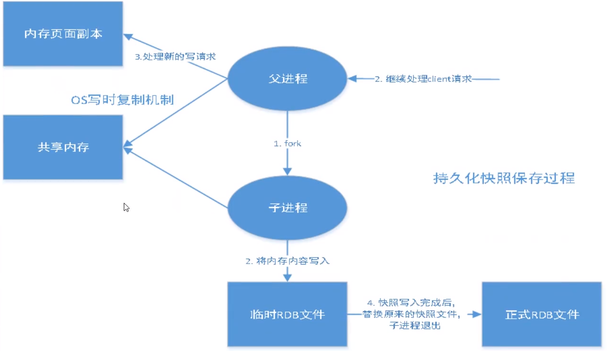
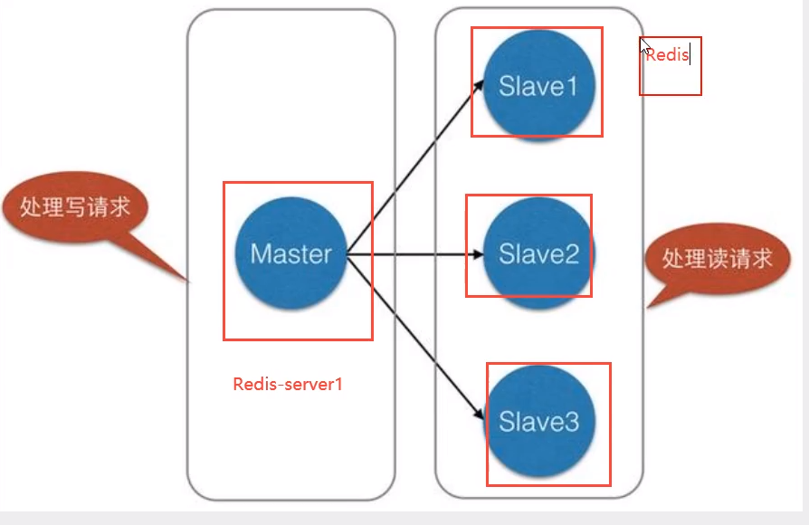
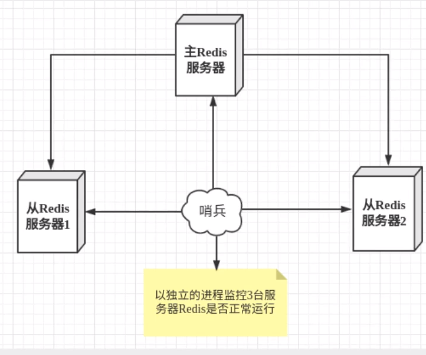
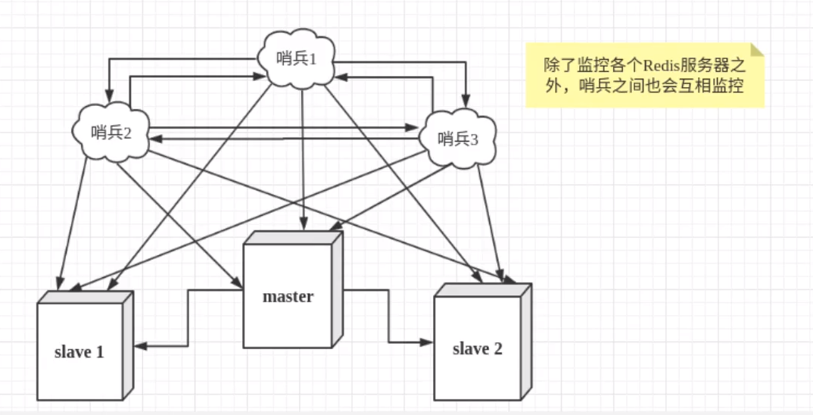

```bash
分区
```


# 1.redis为什么那么快呢

redis 的速度非常的快，单机的 redis 就可以支撑每秒 10 几万的并发，相对于 mysql 来说，性能是 mysql 的几十倍。

* 完全基于内存操作
* 使用单线程，无上下文的切换成本
* 语言实现，优化过的数据结构，基于几种基础的数据结构，redis 做了大量的优化，性能极高
* 基于非阻塞的 IO 多路复用机制

**单线程模型**

首先Redis 通过**IO 多路复用程序** 来监听来自客户端的大量连接，它会将感兴趣的事件及类型（读、写）注册到内核中并监听每个事件是否发生。**I/O 多路复用技术的使用让 Redis 不需要额外创建多余的线程来监听客户端的大量连接，降低了资源的消耗**

**Redis6.0 之前 为什么不使用多线程？**

* 单线程编程容易并且更容易维护；
* Redis 的性能瓶颈不在 CPU ，主要在内存和网络；
* 多线程就会存在死锁、线程上下文切换等问题，甚至会影响性能

**Redis6.0 引入多线程主要是为了提高网络 IO 读写性能**（Redis 的瓶颈主要受限于内存和网络），Redis 的多线程只是在网络数据的读写这类耗时操作上使用了，执行命令仍然是单线程顺序执行。

# 2.Redis除了做缓存还能做什么？

* **分布式锁** ： 通过 Redis 来做分布式锁是一种比较常见的方式。通常情况下，我们都是基于 Redisson 来实现分布式锁。

  ```bash
  1.通过redis去获取锁，设置锁的过期时间和唯一编号
  	setnxex("lock",uuid,10s)
  2.如果没有设置成功，则表示没有获取到锁，等待100ms重试，有点像CAS的自旋锁实现
  3.如果设置成功，表示获取到了锁，执行业务，执行完后，进行脚本删锁操作(lua脚本，所以原子性操作)，然后结束
  
  删锁操作：先判断通过“lock”获取的值是否等于第二个传参，如果等于则删除“lock”值，如果不等于就返回0，表示删锁失败，意思是业务执行时间太长，超过了10s
  
  LUA脚本：
  if redis.call("get",KEYS[1]) == ARGV[1]
  then
      return redis.call("del",KEYS[1])
  else
      return 0
  ```

* **限流** ：一般是通过 Redis + Lua 脚本的方式来实现限流。也可以AtomicInteger、Semaphore做简单的限流。Lua本身就是一个编程语言，和数据库的储存过程很像，Lua脚本的操作是原子性的，方式是redis中存在限流的key和限流的大小，判断限流的key的值是多少a，判断a+1后是否大于限流大小，如果大于则返回0，不大于就返回1.

  ```bash
  -- 获取调用脚本时传入的第一个key值（用作限流的 key）
  local key = KEYS[1]
  -- 获取调用脚本时传入的第一个参数值（限流大小）
  local limit = tonumber(ARGV[1])
  -- 获取当前流量大小
  local curentLimit = tonumber(redis.call('get', key) or "0")
  -- 是否超出限流
  if curentLimit + 1 > limit then
      -- 返回(拒绝)
      return 0
  else
      -- 没有超出 value + 1
      redis.call("INCRBY", key, 1)
      -- 设置过期时间
      redis.call("EXPIRE", key, 2)
      -- 返回(放行)
      return 1
  end
  ```

* **消息队列**：Redis 自带的 list 数据结构可以作为一个简单的队列使用。Redis5.0 中增加的 Stream 类型的数据结构更加适合用来做消息队列。它比较类似于 Kafka，有主题和消费组的概念，支持消息持久化以及 ACK 机制

* **复杂业务场景**：redis提供的数据结构，我们可以很方便地完成很多复杂的业务场景比如通过 bitmap 统计活跃用户、通过 sorted set 维护排行榜

# 3.Redis的RDB是什么

Redis 持久化方案分为 RDB(redis database) 和 AOF(append only file) 两种。



```bash
# rdb文件名
dbfilename dump.rdb

# rdb机制
# save 3600 1
# save 300 100
# save 60 10000
save 60 5 # 测试60s内只修改5次key，就会触发rdb操作
```

rdb可以手动执行也可以根据配置定期执行，一般是配置执行。它的作用是在指定时间间隔内将数据库状态保存到RDB文件中，RDB文件是一个二进制文件(保留的是数据)，通过它可以还原某个时刻数据库的状态。

```bash
- rdb文件是如何生成得到？
	Redis会单独创建(fork)一个子线程来进行持久化，会先将数据写入到一个临时文件中，待持久化过程都结束了，再用这个临时文件替换上次持久化好的文件。在整个过程中，主进程是不进行任何IO操作的，还可以继续处理命令请求，不会阻塞进程。
	所以进行大规模数据恢复时，且对于上次数据恢复的完整性不是非常敏感，那么rdb方式要比aof方式更加高效。
	
- 触发机制
	1.当save规则满足时，会自动触发rdb规则
	2.执行flushall命令，也会触发我们的rdb规则
	3.退出redis，也会产生rdb文件
	
- 优点
	适合大规模的数据恢复
- 缺点
	需要一定的时间间隔进行操作，如果redis意外宕机，最后几次修改的数据就会没有了
```

# 4.Redis的AOF持久化是什么？

AOF是以日志的形式记录每个写操作。通过追加、写入、同步三个步骤来实现持久机制。redis重启的时候就根据日志文件的内容将写指令从前到后执行一次以完成数据的恢复工作。

```bash
appendonly no 	# 默认是不开启aof模式的

appendfilename "appendonly.aof"  #持久化文件的名字

# aof策略
# appendfsync always 每个写操作都要落盘，基本不会丢失数据，但性能较差
appendfsync everysec	 # 每秒写回，每个写命令执行完，只会写入aof文件的内存缓冲区，每隔一秒把缓冲区中的内容写入磁盘； 宕机会丢失1s内的数据，性能较好
# appendfsync no   由操作系统决定何时将缓冲区内容写回磁盘,宕机时丢失数据较多。
```

```bash
- rdb和aof对比
	1 aof更能保证保证数据的完整性，最多会丢失1s的数据；rdb则可能会丢失几s的数据
	2.相对于数据文件，aof文件大小要远大于rdb，且修复速度也比rdb慢
	3.aof运行效率比rdb慢，所以redis默认是rdb
```

# 5.Redis的底层数据结构有哪些

五大数据类型：String(字符串)、List(列表)、Set(集合)、Hash(哈希)、Zset(有序集合)；三种特殊数据结构：bitmaps(位图)、geospatial()、hyperloglog

```bash
- String
	就是简单的看看K,V结构的类型。
	常用命令：set(设置)、get(获取)、strlen(获取字符串长度)、incr(增加)、decr(减少)、getrange(获取截取)、setrange(替换截取)、setex(设置值并有过期时间)、setnx(不存在再设置)、mset(批量设置)、mget(批量获取)、getset(先get再set)
	应用场景：一般常用在需要计数的场景，比如用户的访问次数、热点文章的点赞转发数量等等
	
- List
	就是双向链表，可以左右操作。
	常见命令：rpush(从右插入)、lpush(从左插入)、rpop(从右弹出)、lpop(从左弹出)、lrange(获取固定范围的内容)、rrange、lindex(距离左侧的索引)、rindex、llen(查看链表长度)
	应用场景：rpush和lpop可以实现消息队列、rpush和rpop可以实现栈

- Hash
	就是一个哈希表。是一个string类型的 field 和 value 的映射表
	常见命令：hset(设置)、hget、hmset(批量设置)、hmget、hgetall(获取所有值)、hkeys(获取所有键值)、hvals、hlen(获取hash长度)、hexists(判断指定字段是否存在)
	应用场景：string适合存储字符串、hash适合存储对象
	举例：hmset ljl age 24 name ljl ; hget ljl age(返回24)

- Set
	就是一个HashSet，是一个无序集合。可以基于 set 轻易实现交集、并集、差集的操作。
	常见命令：sadd(添加)、spop(移除)、smembers(查看所有值)、sismember(判断是否存在)、scard(查看set元素个数)、sinterstore(将两个set交集放入另一个set)、sunion(合并set)
	应用场景：要存放的数据不能重复以及需要获取多个数据源交集和并集等场景

- ZSet
	比set增加了一个权重值score，使得集合中的元素能够按 score 进行有序排列，还可以范围查找。底层是跳表。
	常见命令：zadd(添加),zcard(获取元素个数),zscore(查看某个value的权重),zrange(获取某个范围的所有值),zrevrange(逆序输出某个范围的元素),zrem(移除)
	应用场景：各种礼物排行榜等

- bitmap
	连续的二进制数字。
	常见命令：setbit(设置对应为0或1),getbit,bitcount(统计位数为1的个数),bitop
	应用场景：是否签到、是否登陆，统计数量

- geospatial地理位置 Hyperloglog基数


```

# 6.Redis如何实现事务？

redis通过multi、exec、discard和watch命令来实现事务功能。

```bash
multi:开启一个事务，可以输入很多命令，命令进入命令队列中
exec：提交一个事务，从命令队列中取出提交的操作命令，进行实际操作
discard：放弃一个事务，清空命令队列
watch：检测一个或多个键在事务期间是否发生变化，如果被其他事务进行了修改就放弃当前事务(有点像CAS)

首先redis的事务不满足原子性，也不支持回滚。

错误情况：提交事务时编译发生错误，也就是有命令写错了，那么事务中的所有命令都不执行；如果是运行时发生错误，也就是命令都对，但是执行时发现有不符合要求的，只有这条命令不执行，其他命令都执行。
```

# 7.Redis如何判断数据过期和对应的删除策略

```bash
redis的内存管理主要分为两方面：内存上限控制及内存回收管理
- 内存上限
	在进行内存分配和限制时要充分考虑内存碎片占用影响。
	目的：缓存应用内存回收机制触发 + 防止物理内存用尽
	
- 内存回收
	回收时机：键过期、内存占用达到上限
	1）过期删除：redis 键过期时间保存在内部的过期字典中，redis采用惰性删除机制+定时任务删除机制。
	2)内存溢出控制：当内存达到maxmemory，会触发内存回收策略
```

Redis 通过一个叫做过期字典（可以看作是 hash 表）来保存数据过期的时间，过期字典的键指向 Redis 数据库中的某个 key(键)，过期字典的值是一个 long long 类型的整数，这个整数保存了 key 所指向的数据库键的过期时间。

删除策略：

* **惰性删除** ：只会在取出 key 的时候才对数据进行过期检查。这样对 CPU 最友好，但是可能会造成太多过期 key 没有被删除，造成内存泄漏。
* **定期删除** ： 每隔一段时间抽取一批 key 执行删除过期 key 操作。如果定期删除执行太频繁或执行时间太长，就会使CPU 过多时间消耗在上面；如果执行的太少又会有惰性删除的情况。所以，Redis 底层会通过限制删除操作执行的时长和频率来减少删除操作对 CPU 时间的影响

定期删除对内存更加友好，惰性删除对 CPU 更加友好。两者各有千秋，所以 Redis 采用的是 **定期删除+惰性/懒汉式删除** 。

# 8.Redis的内存淘汰策略有哪些

1. **volatile-lru（least recently used）**：从已设置过期时间的数据集中挑选最近最少使用的数据淘汰

2. **volatile-ttl**：从已设置过期时间的数据集中挑选将要过期的数据淘汰

3. **volatile-random**：从已设置过期时间的数据集（server.db[i].expires）中任意选择数据淘汰

4. **allkeys-lru（least frequence used）**：当内存不足以容纳新写入数据时，在键空间中，移除最近最少使用的 key（这个是最常用的）

5. **allkeys-random**：从数据集（server.db[i].dict）中任意选择数据淘汰

6. **no-eviction**：禁止驱逐数据，也就是说当内存不足以容纳新写入数据时，新写入操作会报错。这个应该没人使用吧！

   Redis默认采用no-eviction，也就是说在使用的内存空间超过maxmemory值时，不会淘汰数据，写满后再写会返回错误。

# 9.缓存穿透

缓存穿透就是大量请求的key根本不存在于缓存中，导致请求直接到了数据库上，根本没有经过缓存这一层。举个例子：某个黑客故意制造我们缓存中不存在的 key 发起大量请求，导致大量请求落到数据库。

**为什么会存在缓存穿透？**

* 业务层误操作：缓存中的数据被误删除了，所以缓存中都没有数据
* 恶意攻击：专门访问数据库中没有的数据。

**解决方案**

* **缓存无效的key**：如果缓存和数据库都查不到某个 key 的数据就写一个到 Redis 中去并设置过期时间。但这样如果黑客恶意攻击，还是会导致大量无效的key，不能从根本上上解决问题。一般上设置key为：表名:列名:主键名:主键值
* **布隆过滤器**：通过它可以很方便的判断这个数据是否存在海量数据中，需要判断key是够合法。把所有可能存在的请求的值都存放在布隆过滤器中，当用户请求过来，先判断用户发来的请求的值是否存在于布隆过滤器中。不存在的话，直接返回请求参数错误信息给客户端，存在的话才会走下面的流程
  * 放入元素流程：使用布隆过滤器中的哈希函数对元素值进行计算，得到哈希值；根据得到的哈希值，在位数组中把对应下标的值置为 1
  * 判断元素流程：对给定元素再次进行相同的哈希计算；得到值之后判断位数组中的每个元素是否都为 1，如果值都为 1，那么说明这个值在布隆过滤器中，如果存在一个值不为 1，说明该元素不在布隆过滤器中
* 前端进行请求检测。把恶意的请求直接过滤掉。

# 10.缓存击穿

是指一个key非常热点，在不停的杠着大并发，大并发集中对这个一点进行访问，当这个key在失效的瞬间，持续的大并发就会穿破缓存，直接请求数据库，

**解决方案**

* 设置热点数据永不过期：将基本不会更新的数据设为永不过期。但会浪费缓存空间
* 加互斥锁：使用分布式锁，保证对于对于每个线程去查询后端服务，其他线程没有获得分布式锁的权限，因此只需要等待即可。这种方式将高并发的压力转移到了分布式锁，因此对分布式锁的考验很大。

# 11.缓存雪崩

是指在某一段时间段，缓存集中过期失效。

举个例子 ：秒杀开始 12 个小时之前，我们统一存放了一批商品到 Redis 中，设置的缓存过期时间也是 12 个小时，那么秒杀开始的时候，这些秒杀的商品的访问直接就失效了。导致的情况就是，相应的请求直接就落到了数据库上，就像雪崩一样可怕

**解决办法**

* 采用 Redis 集群，避免单机出现问题整个缓存服务都没办法使用。
* 限流，避免同时处理大量的请求(可以使用semphere)
* 设置不同的失效时间比如随机设置缓存的失效时间
* 缓存永不失效

# 12.Redis Bigkey是什么？

如果一个 key 对应的 value 所占用的内存比较大，那这个 key 就可以看作是 bigkey。

bigkey 有什么危害？除了会消耗更多的内存空间，bigkey 对性能也会有比较大的影响

# 13.单机系统下，Redis如何实现并发控制？

* **单命令操作**：把多个操作在 Redis 中实现成一个操作。单命令操作就是一个命令中带有多个数据操作，比如incr/decr命令可以实现增值 / 减值操作
* **事务+watch**:给某个变量添加watch，如果其他事务中改变这个值就不执行当前事务
* **Lua脚本**：把多个操作写到一个 Lua 脚本中，以原子性方式执行单个 Lua 脚本。但是不要把很多操作放到Lua脚本中，这样也会降低 Redis 的并发性能

# 14.缓存和数据库的更新时间

**1.cache aside：旁路缓存，是比较常用的缓存策略**	
	读请求：应用首先会判断缓存是否有该数据，缓存命中直接返回数据，缓存未命中即缓存穿透到数据库，从数据库查询数据然后回写到缓存中，最后返回数据给客户端。
	写请求：首先更新数据库，然后从缓存中删除该数据。
	误区一：先更新数据库，再更新缓存。但是在高并发下更新缓存顺序是不可控的，所以最终缓存和数据库不一致。
	误区二：先删缓存，再更新数据库。在一个读请求和一个写请求并发场景下可能会出现数据不一致情况。在写请求到达，删除缓存；读请求未命中缓存读数据库，并回写缓存；写请求更新数据库。导致不一样。
	误区三：先更新数据库，再删除缓存，也会存在问题。在读请求未命中缓存读取数据库，返回数据；写请求更新数据库删除缓存，此时读请求才回写缓存。但是发生概率很低。保底方案：缓存设置过期时间，而且可以允许少量的数据段时间内不一致的情况。
**2.Read/Write through**
	一般是由一个 Cache Provider 对外提供读写操作，应用程序不用感知操作的是缓存还是数据库。服务端把 cache 视为主要数据存储，从中读取数据并将数据写入其中。cache 服务负责将此数据读取和写入 DB，从而减轻了应用程序的职责

写请求:先查 cache，cache 中不存在，直接更新 DB;cache 中存在，则先更新 cache，然后 cache 服务自己更新 DB

读请求：从 cache 中读取数据，读取到就直接返回 ；读取不到的话，先从 DB 加载，写入到 cache 后返回响应

**3.Write behind**
	说白了就是延迟写入，应用程序更新数据时只更新缓存， Cache Provider每隔一段时间将数据刷新到数据库中。**只更新缓存，不直接更新 DB，而是改为异步批量的方式来更新 DB**

如果第二步执行失败，需要重试。由于同步重试会影响吞吐量，所以通常采用异步重试，可以配合消息队列来实现，保证数据一致性。

这种策略在我们平时开发过程中也非常非常少见，但是不代表它的应用场景少，比如消息队列中消息的异步写入磁盘、MySQL 的 InnoDB Buffer Pool 机制都用到了这种策略。

# 15.请你介绍一下主从复制

主从复制，是指将一台Redis服务器的数据，复制到其他的Redis服务器上。前者成为主节点(master/leader),后者称为从节点(salve/follower)；数据的复制是单向的，只能从主节点到从节点。Master以写为主，slave以读为主。

==默认情况下，每台Redis服务器都是主节点；==

且一个主节点可以有多个从节点（或没有从节点），但一个从节点只能有一个主节点。

**主从复制的作用主要包括：**

1.数据冗余：主从复制实现了数据的热备份，是持久化之外的一种数据冗余方式。

2.故障恢复：当从节点出现问题时，可以由从节点提供服务，实现快速的故障恢复；实际上就是一种服务的冗余

3.负载均衡：在主从复制的基础上，配合读写分离，可以由主节点提供写服务，有从节点提供读服务（即写Redis数据时应用连接主节点，读Redis数据时应用连接从节点）。分担服务器负载；尤其是写少读多的场景下，通过多个节点分担读负载，可以大大提高Redis服务器的并发量！

4.高可用（集群）基石：除了上述作用之外，主从复制还是哨兵和集群能够实施的基础，因此说主从复制是Redis高可用的基础。


一般来说，要将Redis运用于工程项目中，只使用一台Redis是万万不能（宕机，要一主二从）的，原因如下：

1、从结构上，单个Redis服务器会发生单点故障，并且一台服务器需要处理所有的请求负载，压力较大；

2、从容量上，单个Redis服务器内存容量有限，就算一台Redis服务器内存容量为256G，也不能将所有内存用作Redis储存内存，==单台Redis最大使用内存不应该超过20G==。

电商网站上的商品，一般都是一次上传，无数次浏览的，说专业点也就是“多读多写”。

对于这种场景，我们可以使用如下这种架构：



主从复制，读写分离！80%的情况下都是进行读操作！减缓服务器压力！架构中经常使用！一主二从！

只要在公司中，主从复制就必须要使用的，不可能使用单机。

> 复制原理

Slave启动成功连接到master后会发送一个sync同步命令

Master接到命令，启动后台的存盘进程，同时收集所有接收到的用于修改数据集命令，在后台进程执行完毕之后，==master将传送整个数据文件到slave,并完成一次完全同步。==

全量复制：而slave服务在接收到数据库文件数据后，将其存盘并加载到内存中。

增量复制：Master继续将新的所有收集到的修改命令一次传给slave，完成同步

但是只要是重新连接master，第一次完全同步（全量复制）将自动执行！我们的数据一定可以在从机中看到！

# 16.请你介绍一下Redis的哨兵模式

>概述

主从切换技术的方法是：当主服务器宕机后，需要手动把一台从服务器切换到主服务器，这就需要人工干预，费事费力，还会造成一段时间内服务不可用。这不是一种推荐的方式，更多时候，我们优先考虑哨兵模式。Redis从2.8开始正式提供了Sentinel（哨兵）架构来解决这个问题。

谋朝篡位的自动版，能够后台监控主机是否故障，如果故障了根据投票数自动将从库转为主库。

哨兵模式是一种特殊的模式，首先Redis提供了哨兵的命令，哨兵是一个独立的进程，作为进程，它会独立运行。其原理是**哨兵通过发送命令，等待Redis服务器响应，从而监控运行的多个Redis实例。**



这里的哨兵有两个作用

* 通过发送命令，让Redis服务器返回监控其运行状态，包括其主服务器和从服务器
* 当哨兵检测到master宕机，会自动将slave切换成master，然后通过**发布订阅模式**通知其他的从服务器，修改配置文件，让它们切换成主机。

然而一个哨兵进程对Redis服务器进行监控，可能会出现问题，为此，我们可以使用多个哨兵进行监控。各个哨兵之间还会进行监控，这样就形成了多哨兵模式。



假设主服务器宕机，哨兵先检测这个结果，系统并不会马上进行failover[故障转移]过程，仅仅是哨兵主观的认为主服务器不可用，这个现象称为**主观下线**。当后面的哨兵也检测到主服务器不可用，并且数量达到一定值时，那么哨兵之间就会进行一次投票，投票的结果由一个哨兵发起，进行failover[故障转移]操作。投票成功后，就会通过发布订阅模式，让各个哨兵把自己监控的从服务器实现切换主机，这个过程就是**客观下线**。

**优点**

* 可以主从切换，可以故障转移，实现了高可用
* 哨兵模式就是主从模式的升级，手动到自动，更加健壮

**缺点**

* Redis不好在线扩容，集群容量一旦到达上限，在线扩容就会十分麻烦

# 17.生成订单30分钟未支付，则自动取消，如何实现

**1）数据库轮询**

通过一个线程去定时扫描数据库，并通过订单时间来判断是否有超时的订单，然后进行update和delete操作

简单易行，支持集群操作。但对服务器内存消耗大

**2）JDK延时队列**

利用JDK自带的DelayQueue来实现，这是一个无界阻塞队列，该队列只有在延迟期满的时候才会从中获取元素。放入DelayQueue中的对象，是必须实现Delayed接口的

效率高,任务触发时间延迟低。但服务器重启后，数据全部消失，且由于内存条件限制的原因，比如下单未付款的订单数太多，那么很容易就出现OOM异常

**3）Redis缓存**

```bash
添加元素:ZADD key score member [[score member] [score member] …]
按顺序查询元素:ZRANGE key start stop [WITHSCORES]
查询元素score:ZSCORE key member
移除元素:ZREM key member [member …]

 	利用redis的zset,zset是一个有序集合，每一个元素(member)都关联了一个score,通过score排序来取集合中的值。我们将订单超时时间戳与订单号分别设置为score和member,系统扫描第一个元素判断是否超时(利用生产者生产订单，然后消费者每隔很短时间去redis中取内容，如果取出则说明存在超时订单，这时再去取 消费者处理即可。)
	但有一个致命伤，并发时会存在多个消费者消费一个订单，所以要根据ZREM的返回值进行判断，只有大于0的时候，才消费数据。当然也可以使用分布式锁，但性能会下降。

重启后数据不会丢失；做集群扩展相当方便；但需要额外进行redis维护
```

# 18.限流

面对越来越多的高并发场景，限流显示的尤为重要

```bash
- Redis的setnxex操作
	限流的主要目的就是为了在单位时间内，有且仅有N数量的请求能够访问我的代码程序。所以可以通过setnxex的时候设置过期时间为10，然后获取时需要从0到20不停访问是否存在
- 通过对incerby
	通过increby对一个key进行+1操作，在获取这个key时如果没有超过预设的值，则表示还可以获取，如果超过的话，就要限流，决绝操作。可用通过LUA脚本实现，原子性操作。
```


