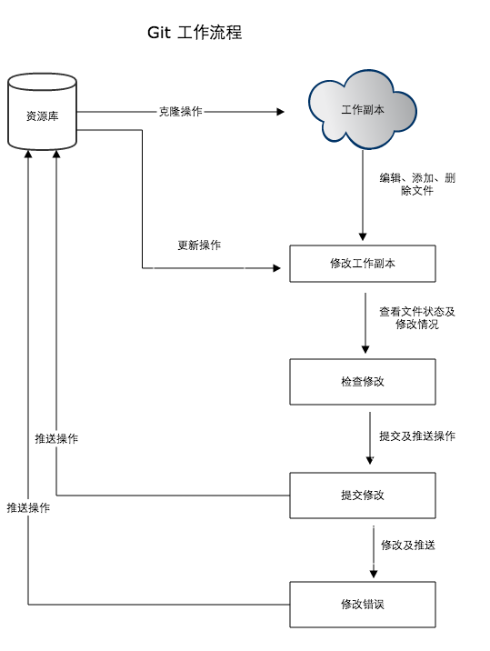
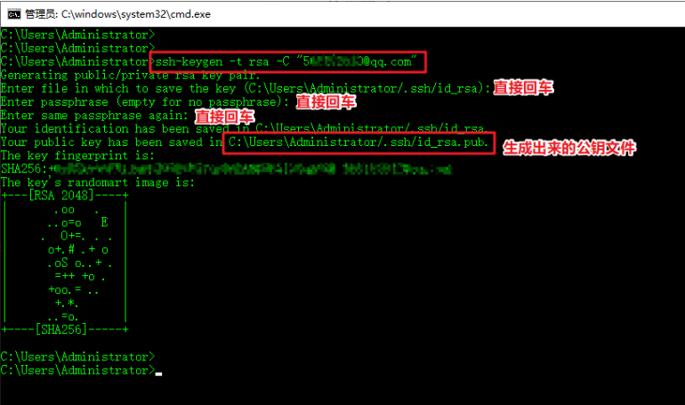

# Git介绍

Git 是一个开源的分布式版本控制系统，用于敏捷高效地处理任何或小或大的项目

## Git工作流程



## Git工作区、暂存区和版本库

* **工作区：**就是你在电脑里能看到的目录
* **暂存区**：一般存放在 ：git** 目录下的 index 文件（.git/index）中，所以我们把暂存区有时也叫作索引
* **版本库：**工作区有一个隐藏目录 **.git**，这个不算工作区，而是 Git 的版本库。


# Git基本操作

```bash
git init 	: 初始化仓库
git clone	: 拷贝一份远程仓库，也就是下载一个项目
git clone -b branchname xxx.git :下载指定分支的代码

git add  	: 添加文件到暂存区
git status	: 查看仓库当前状态
git diff	: 比较文件的不同，即暂存区和工作区的差异
git commit	: 将暂存区内容添加到仓库中
git reset	: 回退版本

git pull	: 下载远程代码并合并
git push	: 上传远程代码并合并
```

# Git分支管理

几乎每一种版本控制系统都以某种形式支持分支。

```bash
git branch (branchname)		: 创建分支
git branch					: 会列出本地的分支。(我们有一个叫做 master 的分支，并且该分支是当前分支.当执行git init时，默认会创建一个master分支，如果需要手动创建一个分支，需要git branch (branchname))
git branch -d (branchname)	: 删除分支
git branch -a				: 可以查看本地和远程的所有分支
git branch -m 旧分支名 新分支名: 修改本地分支名称


git checkout (branchname)	: 切换为目标分支
git checkout -b (branchname) : 创建新分支并立即切换到该分支下(等于git branch 和 git checkout)

git	merge					: 合并分支(切换分支时，git会用该分支最后一次提交的快照替换工作目录内容， 所以多个分支不需要多个目录。)
git merge (branchname)		: 将目标分支合并到本分支来

git log						: 查看历史提交记录
git blame <file> 			: 以列表形式查看指定文件的历史修改记录

git push origin 新分支名：新分支名		: 新建一个远程分支，名字一样
git push --set-upstream origin 新分支名	: 将本地分支和远程分支合并关联

git add .   				: 推送到本地
git status  				: 查看状态，推送的文件是绿色的
git commit -m "备注" 		   : 提交
git push -u origin 分支名    : 推送到远程 

git push origin :旧分支名	 : 删除远程分支
git push --set-upstream origin 			: 本地分支和远程分支进行关联合并

```

# Git实操

1. ssh免登陆方式

   ```bash
   ssh-keygen -t rsa -C "xxxxx@xxxxx.com"		# 最好是邮箱
   ```

   

2. 去生成公钥文件id_rsa.pub路径：C:\User\Adminstrator\\.ssh\id_rsa.pub	打开.pub文件，并复制里面的内容
3. 去官网配置ssh密钥，将复制的内容粘贴到官网ssh密钥的位置即可

**拉去新项目**

```
1.在目标文件夹下克隆项目到本地
git git@gitcode.net:KnowledgePlanet/Lottery.git
2.关联本地工程到远程仓库，在本地库上使用命令 git remote add把它和 gitee的远程库关联
git remote add origin git@gitcode.net:KnowledgePlanet/Lottery.git
3.如果此时报错，可以先用git remote -v查看远程库信息
git remote -v
4.删除已有的远程库
git remote rm origin
5.再次关联
git remote add origin git@gitcode.net:KnowledgePlanet/Lottery.git

# 提交
git add -A 								# 添加所有文件
git commit -m "Add File,Hello WORKD"	# 提交文件
git push -u origin master				# 推到远程git仓库master分支

