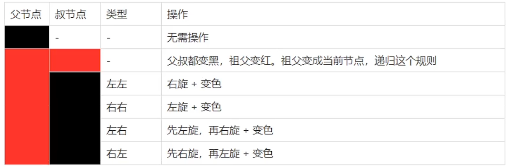
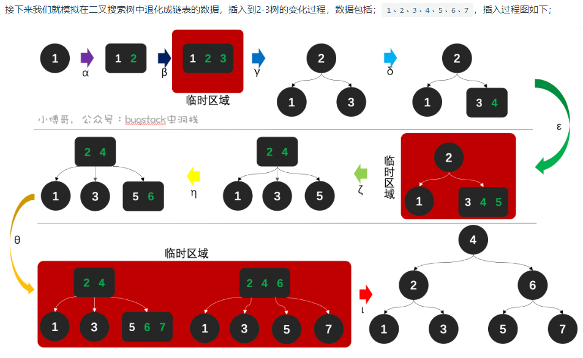
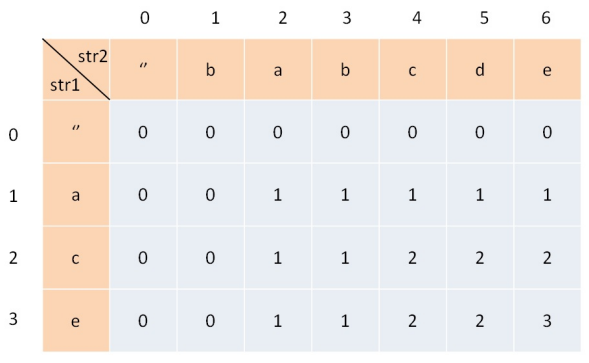

```bash
topk问题
拓扑排序(课程表)
单调栈(接雨滴)
二分图
网(网络延迟时间)
反转K链表

类型转换(long)x * x而不是(long)(x * x)这样会溢出
```


# 算法基础

## 排序算法

稳定排序：排序前后两个相等的数相对位置不变，则算法稳定

不稳定排序：排序前后两个相等的数相对位置发生了变化，则算法不稳定

| 排序方法 | 时间复杂度   | 空间复杂度 | 稳定性 | 最优复杂度 |
| :------- | :----------- | :--------- | ------ | ---------- |
| 冒泡排序 | O(n^2)       | O(1)       | 稳定   | O(n)       |
| 选择排序 | O(n^2)       | O(1)       | 稳定   | O(n^2)     |
| 插入排序 | O(n^2)       | O(1)       | 稳定   | O(n)       |
| 希尔排序 | O(nlogn~n^2) | O(1)       | 不稳定 |            |
| 堆排序   | O(nlogn)     | O(1)       | 不稳定 | O(nlogn)   |
| 快速排序 | O(nlogn)     | O(logn)    | 不稳定 | O(nlogn)   |
| 归并排序 | O(nlogn)     | O(n)       | 稳定   | O(nlogn)   |


```java
//================================O(n^2)======================================//
// 1.冒泡排序
// 比较相邻元素大小并交换
for(int i = 0; i < len; i++){
    for(int j = i+1; j < len; j++){
        if (arr[j] < arr[i]){
            int temp = arr[i];
            arr[i] = arr[j];
            arr[j] = temp;
        }
    }
}
// 1.冒泡优化
boolean swap = false;
for(int i = 0; i < len; i++){
    swap = false;
    for(int j = len - 1; j > i; j--){
        if (arr[j] < arr[j-1]){
            int temp = arr[j-1];
            arr[j-1] = arr[j];
            arr[j] = temp;
            swap = true; 
        }
    }
    if(!swap)	// swap为false未更新意味着相邻元素都是符合要求的
        return;
}
// 2.选择排序
// 选择最大值或最小值放入前面，并以此后移
for(int i = 0; i < data.length; i++){
    int min = i;
    for(int j = i + 1; j < data.length; j++){
        if(data[j] < data[i]){
            min = j;
        }
    }
    int temp = data[min];
    data[min] = data[i];
    data[i] = temp;    
}
// 3.插入排序
// 将一个节点插入到已经排好序的有序表中，得到节点数增1
for(int i = 1; i < data.length; i++){
    int j = i - 1;
    while(j >= 0 && data[j] > data[i]){
        data[j + 1] = data[j--];
    }
    data[j + 1]  = data[i];
}
//================================O(nlogn)====================================//
// 1.快速排序
// 找一个基准值，然后将数组分为两个数组，分别全部大于和全部小于基准值。开始从后找比基准值小的值，放到左侧，然后到左侧找大值，放到右边，以此往复。
void quickSort(int[] arr){
    int low = 0;
    int high = arr.length - 1;
    quickSort(arr, low, high)
}
void quickSort(int[] arr, int low, int high){//闭区间 
    if(low >= high) 						 // 递归出口
        return;
    int mid = partition(arr, low, high);	 // 分区划分
    quickSort(arr, low, mid - 1);			 // 对左区间快排
    quickSort(arr, mid + 1, high);			 // 对右区间快排
}
int partition(int[] arr, int low, int high){
    int i = low;
    int j = high;
    int tmp = arr[low];
    while(i < j){
        while(j > i && arr[j] >= tmp){
            j--;
        }
        if(j > i){
            arr[i] = arr[j];
            i++;
        }
        while(j > i && arr[i] <= tmp){
            i++;
        }
        if(j > i){
            arr[j] = arr[i];
            j--;
        }
    }
    arr[i] = tmp;
    return i;
}
// 2.归并排序
// 将已有序的子序列合并，得到完全有序的序列；即先使每个子序列有序，再使子序列段间有序。若将两个有序表合并成一个有序表，称为二路归并。
void mergerSort(int[] arr, int left, int right){// 闭区间
    if(left == high)
        return;
    int mid = left +(right - left) >> 1;
    mergeSort(arr, left, mid);
    mergeSort(arr, mid + 1, right);
    if(arr[mid] > arr[mid + 1]){
        merge(arr, left, mid, right);
    }
}
void merge(int[] arr, int left, int mid, int right){
    int l1 = l, l2 = mid + 1, i = 0;
    int[] temp = new int[right - left + 1];
    for(int k = left; k <= right; k++){
        if(l2 > right){
            temp[i++] = arr[l1++];
        }else if(l1 > mid){
            temp[i++] = arr[l2++];
        }
        else if(arr[l1] > arr[l2]){
            temp[i++] = arr[l2++];
        }else if(arr[l2] >= arr[l1]){
            temp[i++] = arr[l1++];
        }
    }
    for(int i = 0; i <= right - left + 1; i++){
        arr[left + i] = temp[i];
    }
}
// 希尔排序
// 时间复杂度:nlogn~n^2
// 一种分组插入排序方法，比如147一组、258一组、369一组分别进行插入排序。
int gap = arr.length;
while(true){
    gap /= 2;
    for(int i = 0; i < gap; i++){
        for(int j = i + gap; j < arr.length; j += gap){
            int k = j - gap;
            while(k >= 0 && arr[k] > arr[j]){
                arr[k + gap] = arr[k];
                k -= gap;
            }
            arr[k + gap] = arr[j];
        }
    }
    if(gap == 1)
        break;
}
// 堆排序
// 1.建堆：将无序数组建立为一个堆 2.排序：将堆顶元素取出，然后对剩余元素进行堆化，反复迭代，直到所有元素被取出为止。
public void heapSort(int[] arr){
    // 1.建堆,从最右下的第一个非叶子节点开始
    for(int i = (arr.length - 1) / 2; i >= 0; i--){
        //从第一个非叶子结点从下至上，从右至左调整结构
        adjustHeap(arr, i, arr.length);
    }
    // 移除大顶堆的堆顶节点，并放入数组最后，完成正序排序
    // 交换堆顶元素与末尾元素 + 调整堆结构
    for(int i = arr.length - 1; i > 0; i--){
        int tmp = arr[i];
        arr[i] = arr[0];
        arr[0] = tmp;
        // 重新堆化
        adjustHeap(arr, 0, i);
    }
}
// 2.由顶自下 进行堆化 - 大顶堆
private void adjustHeap(int[] arr, int parent, int length){
    int tmp = arr[parent];			// 储存父节点的值，下面要寻找它的位置
    int lChild = parent * 2 + 1;	// 左孩子
    while(lChild < length){
        rChild = lChild + 1;		// 右孩子
        // 如果右孩子存在且大于左孩子，将lChild作为较大值的那个
        if(rChild < length && arr[rChild] > arr[lChild]){
            lChild++;
        }
        // 如果父节点比最大的节点大，则不用更换位置 不要写成arr[parent]
        if(tmp > arr[lChild])
            break;
        // 否则更换位置，继续向下寻找
        arr[parent] = arr[lChild];
        parent = lChild;
        lChild = 2 * parent + 1;
    }
    arr[parent] = tmp;
}
```

## 查找算法

顺序、二分、插值

# 数据结构

## 一、数组

**数组是存放在连续内存空间上的相同类型数据的集合。**

数组的特点是

* **数组下标都是从0开始的。**
* **数组内存空间的地址是连续的**
* **提供随机访问并且容量有限**

```bash
假如数组的长度为 n。
访问：O（1）//访问特定位置的元素
插入：O（n ）//最坏的情况发生在插入发生在数组的首部并需要移动所有元素时
删除：O（n）//最坏的情况发生在删除数组的开头发生并需要移动第一元素后面所有的元素时
```

**一维数组**

```bash
排序：
    一维数组 int[] arr = new int[n];
        正序 Arrays.sort(arr);
    一维数组 Integer arr = new Integer[n]; 
        Arrays.sort(arr, (a, b) -> a - b) 正序排序 
        Arrays.sort(arr, (a, b) -> b - a) 降序排序 
    二维数组 一样	Arrays.sort(arr, (a, b) -> a[0] - b[0]) 根据第一个元素正序排序
索引数组：
	即数组索引的数组。原数组内容不变，变得是索引数组的值。索引数组的索引具有升序条件，值是原数组的索引。
	注意：所以操作原数组比较时，要将索引数组的值作为原数组的索引来比较，需要交换值时，只需要交换索引数组的值即可。
    例：比较 : score[array[r]] > ref  交换: array[r] = array[l];
```

**二维数组**

```shell
**方向型题型**
1. 方向数组(也可以dfs做)
	int[][] directions  = new int[][]{{0, 1}, {1, 0}, {0, -1}, {-1, 0}}; // 右下左上
	while(条件){
		...
		if(检测边界 || 换方向条件)
			directionIndex = (directionIndex + 1) % 4; // 顺时针旋转至下一个方向
		更新row和column值		
	}
2. 二维数组映射到一位数组上
int[][] array = new int[m][n];  【 i -> 0 : m - 1  j -> 0 : n - 1 】
一位数组的索引位置 : index = i * n + j; 

**其他作用**
1、记录一维数组的原索引值。int[][] arr = new int[n][2]; 可以在排完序后获得排序后的数字在原数组中的位置。
```

**列表数组**

```bash
1. 不变的部分用数组，变化的部分用动态数组。List<Integer>[] list = new List[n];还是比较常用的
```

**题型归类**

```bash
代码随想录：二分查找、双指针、滑动窗口、模拟行为
- 二分查找	
	适用于在给定范围内寻找符合条件的值。 常用环境：数组、平方根num*num
	1.[left,right] 此时right是有意义的 
	2.[left,right) 此时right是没有意义的
	# 精髓：left为>target的最接近的位置 right为<target的最接近的位置
	#int mid = left + ((right - left) >> 1); // 防止溢出 等同于(left + right)/2
	# 如果数组中没有目标值target，则查找的是 < target 且 最接近target 在数组中的位置。 查找值在所有元素前left，right -> [0，-1] 尾端[length,length - 1] 中间[index,index]
	# 如果数组中存在目标值，且不止一个。则寻找左右边界时，需要将>=或<=合并判断，左边界在-1中寻找，右边界在+1中寻找。
	# 假设left=right时符合第一个条件，和目标值的关系；假设left=right时符合第二个条件，和目标值的关系
# 寻找左边界
int getLeftBorder(int[] nums, int target) {
    int left = 0;
    int right = nums.length - 1;
    int leftBorder = -2; // 记录一下leftBorder没有被赋值的情况
    while (left <= right) {
        int middle = left + ((right - left) / 2);
        if (nums[middle] >= target) { // 寻找左边界，nums[middle] == target的时候更新right
            right = middle - 1;
            leftBorder = right;
        } else {
            left = middle + 1;
        }
    }
    return leftBorder;
}
# 如果二分查找成功，则滑动左指针
while (left - 1 >= 0 && nums[left - 1] == nums[index]) { // 防止数组越界。逻辑短路，两个条件顺序不能换
	left--;
}

- 快慢指针
	# 环境：数组删除元素
	# slowIndex、fastIndex
	# 1. 注意慢指针+1的条件
	# 2.左右指针。从数组的左右边界向中间移动
	# 如果条件和slowIndex无关，则slowIndex是下一个需要插入的位置
	# 如果条件和slowIndex有关，建议这样写if(nums[fastIndex] != nums[slowIndex]){  slowIndex++; nums[slowIndex] = nums[fastIndex];}  就可以实现和当前slowIndex的值进行比较

- 滑动窗口
	关键在于找到变化的式子和窗体的条件！
	# for(int rightIndex = 0; rightIndex <n; rightIndex++){
    #    // 移动右指针 导致变化的式子
    #    while(// 满足窗体条件){
    #        // 移除元素
    #        // 移动左指针导致的结果变化
    #    }
    #    // 更新结果
    # }
- 模拟行为
while(true){
	for(模拟)
	if(判断临界条件)
}
```


## 二、链表

元素在内存中不是连续的，可能是随机的。分散存储的。

```bash
插入和删除的复杂度为O(1)，查找复杂度是O(n)

数组和链表的区别：
	1.数组可以随机查找，复杂度为O(1)，链表是O(n)
	2.数组的插入和删除复杂度是O(n)，链表是O(1)
	3.数组占用内存更少，链表占用内存更多，因为每个节点还要存放下一个节点的地址
	4.数组使用的是连续的内存空间对CPU缓存机制比较友，链表是分散储存的，不友好
	5.数组大小固定，而链表天然支持动态扩容，如果数组要扩容，需要申明一个较大的数组，然后将原数组拷贝进去，这个操作是比较耗时的。
```

```java
// 1.碰见链表问题，首先在头部插入节点
ListNode hair = new ListNode(0);
hair.next = head;
ListNode pre = hair;
// 2.推荐用while()方式
```

```bash
链表反转问题:
	1.根据头部节点和尾部节点就可以将链表进行反转(从头向后依次反转)
	2.递归方式 (一般不推荐)
确定链表中点：
	1.快慢指针！
```

```bash
反转链表:
https://leetcode-cn.com/problems/reverse-nodes-in-k-group/
https://leetcode-cn.com/problems/aMhZSa/		# 利用快慢指针反转链表
```

```bash
！！！ 由于单链表的头部进行操作时的特殊情况，所以引入了虚拟头结点的方法。
代码随想录：头插法
题型：移除结点、增加结点、反转链表
- 移除结点
	# 虚拟头结点法 dummyHead节点
	# 定义cur和pre节点。cur一直移动，pre不一定一直移动。
- 增删操作
	# 获取需要的前节点即可解决
- 反转链表
	# 迭代法和递归法。迭代法：prev=null,curr=head;开始迭代。 递归法：递归到最后一个节点开始操作
- 删除倒数第N个节点
	# 结合虚拟头结点和双指针法
	# 关键是找到待删的前一个节点
- 链表相交
	# 根据链表长度截取较长的链表和短链表一样长
	# 使用双指针找到两个链表的交点（引用完全相同，即：内存地址完全相同的交点）
- 环形链表起点
	# 快慢指针找到第一次相交的位置
	# 从相交位置和头位置开始两个指针一步一步移动
经验：链表反转的方式值得学习！！！ prev,curr反转方式；递归方式；每两节点反转的方式。	
反转的两种方式：
	- 全量反转：prev=null,curr=head; 然后储存head.next后开始一个节点一个节点反转
	- 定量反转：prev为虚拟头结点，然后通过特定的反转方式，然后更新prev和head节点。
```

## 三、哈希表

散列表的实现原理正是映射的原理，通过设定的一个关键字和一个映射函数，就可以直接获得访问数据的地址，实现O(1)的数据访问效率

```bash
- 散列函数
	1.直接寻址法：取关键字或关键字的某个线性函数值为散列地址
	2.平方取中法：当无法确定关键字里哪几位的分布相对比较均匀时，可以先求出关键字的平方值，然后按需要取平方值的中间几位作为散列地址。
	3.取随机数法：使用一个随机函数，取关键字的随机值作为散列地址，这种方式通常用于关键字长度不同的场合。
	4.除留取余法：取关键字被某个不大于散列表的表长 n 的数 m 除后所得的余数 p 为散列地址。这种方式也可以在用过其他方法后再使用。该函数对 m 的选择很重要，一般取素数或者直接用 n。  √
- 冲突处理方法
	1.开放地址法：实际上就是当需要存储值时，对Key哈希之后，发现这个地址已经有值了，这时该怎么办？比如往后移动一个地址，如果没人占用，就用这个地址。
		1.1 线性探测法 ： f,key = (f(key) + di) mod m (di=1,2,3,4,5....m-1)
		1.2 二次探测法：f,key = (f(key) + di) mod m (di=1^2,-(1^2),2^2,.....q<=m^2)
	2.链地址法：链地址法其实就是对Key通过哈希之后落在同一个地址上的值，做一个链表。 √

	
# 哈希表可以记录元素的个数，如果题目最终可以归结为对元素个数的考察，推荐使用Map
# 设计到字符串字母计数时，可以采用26长度的数组来记录！！！
# 和顺序有关的题目。可以先排序然后作为key
三种哈希结构
	- 数组 : 比如字母数组(26英文字母),字母-`a`获得所有进行计数
	- set(集合) : HashSet
	- map(映射) : Has
滑动窗口:while循环只能是meet为条件才行。

```


```bash
https://leetcode-cn.com/problems/hand-of-straights/
```

## 四、字符串

```bash
1.双指针
2.KMP算法
3.反转系列
```


## 五、栈、队列

**栈**

栈是只允许在有序数据集合的一端(称为栈顶top)进行加入数据，按照后进先出的原理运行。**在栈中，push 和 pop 的操作都发生在栈顶**。可以利用数组或者链表实现栈。

```java
访问：O(n)
插入删除:O(1)
```

**使用数组实现栈**

```java
// 包括push()/pop()/isEmpty()/size()/peek
public class MyStack{
    private int[] storage; //存放栈中元素的数组
    private int capacity;  //栈的容量
    private int count;     //栈中元素数量
    private static final int GROW_FACTOR = 2;
    
    public MyStack(){ //不带初始容量的构造方法。默认容量为8
        this.capacity = 8;
        this.storage = new int[8];
        this.count = 0;
    }
    
    public MyStack(int initialCapacity){ //带初始容量的构造方法
        if(initialCapacity < 0)
            throw new IllegalArgumentException("Capacity too small.");
        this.capacity = initialCapacity;
        storage = new int[initialCapacity];
        this.count = 0;
    }
    
    public void push(int value){ //入栈
        if(count == capacity){
            ensureCapacity();
        }
        storage[count++] = value;
    }
    
    private void ensureCapacity(){ //确保容量大小
        int newCapacity = capacity * GROW_FACTOR;
        storage = Arrays.copyOf(storage, newCapacity);
        capacity = newCapacity;
    }
    
    public void pop(){ // //返回栈顶元素并出栈
        if(count == 0)
            throw new IllegalArgumentException("Stack is empty.");
        count--;
        return storage[count];
    }
    
    puclic int peek(){ //  //返回栈顶元素不出栈
        if(count == 0)
            throw new IllegalArgumentException("Stack is empty.");
        return storage[count - 1];
    }
     
    public boolean isEmpty(){ //判断栈是否为空
        return count == 0;
    }
     
    public int size(){ //返回栈中元素的个数
        return count;
    } 
}
```

**队列**

队列是先进先出的线性表，可以利用数组或者链表实现，用数组实现的是顺序队列，用链表实现的是链式队列。只允许后端添加元素，前端移除元素。

```bash
假设队列中有n个元素。
访问：O（n）//最坏情况
插入删除：O（1）//后端插入前端删除元素

- 分类
	1.单队列
		单队列就是常见的队列，分为顺序队列和链式队列。
		顺序队列存在“假溢出”的问题，也就是明明有位置但是却不能添加的情况。数组容量确定后，当rear移动到末尾时，无法再添加元素，此时数组前端还有位置，成为“假溢出”。于此同时rear移动到数组外，成为越界。
		font为第一个元素位置，rear为最后一个元素的下一个位置，font=rear时单队列为空。
	2.循环队列
    	循环队列可以实现顺序队列的假溢出和越界问题。解决方法：从头开始，这样就形成了首尾相连的循环了，这也是循环队列的由来。
    	font=rear时，循环队列可能为满也可能为空。那如何区分，有两种方法：
    		* 设置标志变量flag。font=rear且flag=0为空，font=rear且flag=1为满。
    		* 保证队列满时还留有一个位置。那么现在判断队列是否为满的条件就是： (rear+1) % QueueSize= front
- 应用
	1.阻塞队列：队列基础上加上了阻塞操作。当队列为空的时候，出队操作阻塞，当队列满的时候，入队操作阻塞。使用阻塞队列我们可以很容易实现“生产者 - 消费者“模型
	2.线程池中的请求/任务队列：线程池中没有空闲线程时，新的任务请求线程资源时，线程池该如何处理呢？答案是将这些请求放在队列中，当有空闲线程的时候，会循环中反复从队列中获取任务来执行。队列分为有界队列(基于数组)和无界队列(基于链表)。无界队列特点就是可以一直入队，直到系统资源耗尽；有界队列特点是队列满后再有任务会根据拒绝策略进行处理
	3.Linux 内核进程队列
	4.消息队列
```

**假溢出**


```java
// 1.碰见括号问题 - 一般都是用栈的方式解决的
// 1.1 单括号合法问题 	用计数的方法即可，'('+1 ')'-1
// 1.2 多括号合法问题	用栈解决
// 1.3 单括号+可变字符问题	用两个栈解决，一个正常记，切记存入index，一个记可变字符，最后进行合法性判断;也可以采用计数
```


```shell
代码随想录：
- 栈
	1.用栈实现队列 ： 两个栈组合成一个队列。
	2.StringBuilder通过deleteCharAt()和append()可以模仿栈的行为

- 队列
	1.用队列实现栈
```

```java
// 单调队列
class MonotousQueue{
    private Deque<Integer> data;
    public MonotousQueue(){
        data = new LinkedList<>();
    }
    public void push(int n){
        while(!data.isEmpty() && data.getLast() < n){
            data.removeLast();
        }
        data.addLast(n);
    }
    public void pop(int n){
        // if别写成while了 很容易错的！！！
        if(!data.isEmpty() && data.getFirst() == n){
            data.removeFirst();
        }
    }
    public int max(){
        return data.getFirst();
    }
}
// 优先队列


```

## 六、二叉树

### 6.0术语

**节点的度**：一个节点含有的子树的个数成为该节点的度

**兄弟节点**：父节点为同一个节点的节点互称为兄弟节点

**深度**：根的深度为0，以此类推。

**高度**：叶子节点的高度为0，以此类推

**层数**：根的层数为1，以此类推。即节点深度+1

### 6.1 基本概念

二叉树是每个节点最多只有两个节点，拥有左右子树，而且第i层至多拥有2^(i-1)个节点。深度为k的二叉树至多拥有 2^(k+1)-1个节点(满二叉树)。

**满二叉树**：如果一棵二叉树只有度为0的结点和度为2的结点，并且度为0的结点在同一层上，则这棵二叉树为满二叉树。层数为k，深度为k-1，节点总数为(2^k) - 1，这样的二叉树为满二叉树


**完全二叉树**：在完全二叉树中，除了最底层节点可能没填满外，其余每层节点数都达到最大值，并且最下面一层的节点都集中在该层最左边的若干位置。**优先队列**其实就是一个堆，堆就是一棵完全二叉树，同时保证父子节点的顺序关系。


**平衡二叉树**：是一棵二叉排序树，且具有以下性质：可以是一棵空树；如果不是空树，它的左右两个子树的高度差的绝对值不超过 1，并且左右两个子树都是一棵平衡二叉树

**二叉查找树(BST)**：满二叉树和完全二叉树都没有数值，二叉搜索树是有数值的了，**二叉搜索树是一个有序树**。查找复杂度O(logn)

* 若它的左子树不空，则左子树上所有结点的值均小于它的根结点的值
* 若它的右子树不空，则右子树上所有结点的值均大于它的根结点的值；
* 它的左、右子树也分别为二叉排序树


----------

**平衡二叉查找树**：又称AVL树，且具有以下性质：它是一棵空树或它的左右两个子树的高度差的绝对值不超过1，并且左右两个子树都是一棵平衡二叉树。


**平衡二叉排序树是为了解决二叉排序树在插入时发生线性排列的现象**。由于二叉排序树本身是有序的，当插入一个有序程度十分高的序列时，生成的二叉排序树会持续在某个方向生长，最终退化为链表，从而使得查询和插入效率恶化。

当平衡因子大于1时，就需要进行平衡调整，平衡因子=左子树和右子树的高度差。

**1.LL**(发现节点左单旋)

插入节点在发现节点左子树的左边。每次插入节点，检查是否破坏了平衡，如果插入后树不平衡了，找到离插入节点最近的那个平衡因子>1的那个节点，按照上面进行旋转。

**将发现者左旋为其子节点的右孩子，将其子节点的右孩子变为发现节点的左孩子**

<table>
    <tr>
        <td></td>
        <td></td>
    </tr>
</table>

**2.RR**(发现节点右单旋)

插入节点在发现节点右子树的右边。找到离插入节点最近的不平衡的节点作为发现节点。

**将发现节点右旋为其子节点的左孩子，将其子节点的左孩子变为发现节点的右孩子**


**3.LR**

插入节点在发现节点左子树的右边。**先右单旋，在左旋。**

**将发现节点的左子树进行右旋，然后变为LL后进行左旋**

<table>
    <tr>
        <td></td>
        <td></td>
        <td></td>
    </tr>
</table>

**4.RL**

插入节点在发现节点右子树的左边。**先左单旋，在右旋。**

**将发现节点的右子树进行左旋，然后变为RR后进行右旋**

<table>
    <tr>
        <td></td>
        <td></td>
        <td></td>
    </tr>
</table>

### 6.2 储存方式

==**二叉树可以链式存储，也可以顺序存储。**==那么链式存储方式就用指针， 顺序存储的方式就是用数组。

如果用数组储存二叉树，**如果父节点的数组下标是 i，那么它的左孩子就是 i \* 2 + 1，右孩子就是 i \* 2 + 2。**储存方式如下图：


链式储存更有利于我们理解，所以一般用链式存储。储存方式如下图：


顺序存储会在数组中出现空隙，导致内存利用率降低。

遍历方式

* **深度优先遍历**：前序遍历、中序遍历、后序遍历。
* **广度优先遍历：**层级遍历

### 6.3 算法解题

```java
题型：
	- 前、中、后序遍历
    - 层级遍历
    - 最大深度和
层级遍历：
    - 获取每一层的节点列表[[2],[1,3]] (递归中序遍历即可，保留depth深度参数)   
    - 找每一行最大值(获取层级列表后，寻找最大值)
    - 右视图节点元素(中、右、左顺序遍历)
    - 填充每个节点的下一个右侧节点指针I II (贪心思想，先完成当前节点下的 不好描述) * 
其他题型
    - 对称二叉树 (节点左右子树比较)
    
    
// 前序遍历
public List<Integer> preorderTraversal(TreeNode root) {
    List<Integer> ans = new ArrayList<>();
    dfs(root, ans);
    return ans;
}

private void dfs(TreeNode root, List<Integer> ans){
    if(root == null)
        return;
    // 中
    ans.add(root.val);
    // 左
    dfs(root.left, ans);
    // 右    
    dfs(root.right, ans);
}
// 中序遍历：中和左换换位置
// 后序遍历：中放在右后面

// 层级遍历
// 	- 递归 结果形式 -> [[1],[2,3],[4,5,6,7]]
private void dfs(List<List<Integer>> list, TreeNode root,int depth){
    if(root == null)
        return;
    if(depth > list.size()){
        List<Integer> temp = new ArrayList<Integer>();
        list.add(temp);
    }    
    // 中
    list.get(depth - 1).add(root.val);
    // 左
    dfs(list, root.left, depth + 1);
    // 右
    dfs(list, root.right, depth + 1);
}
// 	- 迭代(更清楚) 借助队列
public void checkFun02(TreeNode node) {
    if (node == null) return;
    Queue<TreeNode> que = new LinkedList<TreeNode>();
    que.offer(node);
    while (!que.isEmpty()) {
        List<Integer> itemList = new ArrayList<Integer>();
        int len = que.size();
        for(int i = 0; i < l; i++) {
            TreeNode tmpNode = que.poll();
            itemList.add(tmpNode.val);
            if (tmpNode.left != null) que.offer(tmpNode.left);
            if (tmpNode.right != null) que.offer(tmpNode.right);
        }
        resList.add(itemList);
    }
}

// 无差别的遍历 迭代
// 左右节点的回溯 
private void backtrace(TreeNode root, int targetSum, List<List<Integer>> res, LinkedList<Integer> temp){
    // base case
    temp.add(root.val);
    // 叶子节点
    if(root.right == null && root.left == null && targetSum == root.val){
        // 浅克隆
        res.add(new ArrayList(temp));
    }
    if(root.left != null){
        backtrace(root.left, targetSum - root.val, res, temp);
        temp.removeLast();
    }
    if(root.right != null){
        backtrace(root.right, targetSum - root.val, res, temp);    
        temp.removeLast();
    } 
}
// 递归 - 二分法
// 中序、后序：中序数组大小一定是和后序数组的大小相同的 ！ 前序和后序不能唯一确定一棵二叉树！

// 二叉搜索数： 中序结果是一个递增的数组
TreeNode pre;
public void findMode1(TreeNode root) {
    if (root == null) {
        return;
    }
    findMode1(root.left); // 左
    int rootValue = root.val; // 中 ： 利用节点处理
    // 赋值为上一节点
    pre = root;
    findMode1(root.right); // 右
}
// 回溯 - 利用结果进行处理 搜索一条边
if(递归函数(root.left)) {  移除元素}
if(递归函数(root.right)) { 移除元素}

// 这个操作是从头节点搜到底部后，反过来对当前节点进行判断操作
left = 递归函数(root->left);
right = 递归函数(root->right);
left与right的逻辑处理;

```

### 6.4 堆

堆是一种满足一定条件的树。**堆中的每个节点都大于等于(或小于等于)子树中所有节点的值**。

相对于有序数组而言，**堆的主要优势在于更新数据效率比较高。**堆的初始化时间复杂度为 `O(nlog(n))`，堆可以做到`O(1)`时间复杂度取出最大值或者最小值，`O(log(n))`时间复杂度插入或者删除数据

**利用顺序存储的数组来实现二叉树。**并不是常见的链式储存。

```bash
- 分类
	1.最大堆：堆中的每一个节点的值都大于等于子树中所有节点的值
	2.最小堆：堆中的每一个节点的值都小于等于子树中所有节点的值
	
- 堆的储存
	由于完全二叉树的优秀性质，利用数组存储二叉树即节省空间，又方便索引(若根结点的序号为1，那么对于树中任意节点i，其左子节点序号为 2*i，右子节点序号为 2*i+1)
	
- 堆的操作
	插入和删除。
	插入元素：先将元素放至数组末尾，再自底向上堆化，将末尾元素上浮
	删除堆顶元素：删除堆顶元素，将末尾元素放至堆顶，再自顶向下堆化，将堆顶元素下沉。也可以自底向上堆化，只是会产生“气泡”，浪费存储空间。
	
- 堆排序
	1.建堆。将一个无序数组建立为一个堆
	2.排序。将堆顶元素取出，然后对剩下的元素进行堆化，反复迭代，直到所有元素取出为止
```

### 6.5 红黑树

**红黑树。是一种高效的自平衡二叉查找树**

**背景：**由于平衡二叉查找树为了追求高度平衡，搜索效率很高，但其插入和删除时的效率并不高；为了解决这一问题，一种兼顾搜索和插入删除的数据结构诞生了。他不追求完全平衡，只要求部分达到平衡要求。

**特点** (左跟右 跟叶黑 不红红 黑路同)

* 根节点是黑色
* 节点是红色或黑色
* 所有子叶节点都是黑色(叶子是NIL节点，默认没有画出来)
* 每个红色节点必须有两个黑色节点
* 黑高：对每个节点，从该节点到任一叶节点的简单路径上，所含黑节点的数目相同

**性质**

* 从根节点到叶节点的最长路径不大于最短路径的2倍
* 有n个内部节点的红黑树高度h <= 2log2(n + 1)

**平衡条件**：由性质以可知，黑节点下一个可以是黑节点也可以是红节点，但红节点子节点一定是黑节点。==**所以红黑树的满足平衡条件下，最多允许左右子树深度差一倍以内。相比AVL就要宽松很多。**==

红黑树需要通过**变色**和**旋转**来调整。由于平衡二叉树在插入或删除数据时需要旋转的次数不可预知，而且旋转是很耗时间的，而红黑树每次插入最多只需要三次旋转就可以达到平衡。

**平衡操作**

左旋转：把一个向右倾斜的红色节点链接，转化为左链接

右旋转：把一个向左倾斜的红色节点链接，转化为右链接



**插入**

* 先查找，确定插入位置(原理同二叉排序树)，插入新节点
* 新节点是根 -- 染色为黑色
* 新节点非根 -- 染色为红色
  * 若插入新节点后依然满足红黑树定义，则插入结束
  * 若插入新节点后不满足红黑树定义，需要调整，使其重新满足红黑树定义(如何调整，看叔叔脸色)
    * 黑叔：旋转 + 染色
      * LL型：右单旋，父换爷+染色
      * RR型：左单旋，父换爷+染色
      * LR型：左、右双旋，儿换爷+染色
      * RL型：右、左双旋，儿换爷+染色
    * 红叔：染色 + 变新
      * 叔父爷染色，爷变为新节点


## 6.6 2-3平衡树

它允许在一个节点中有两个元素，等元素数量等于3个时候在进行调整。通过这种方式呢，来保证整个二叉搜索树的平衡性。

**性质**

* 2-3树所有子叶节点都在同一层
* 1个节点可以有1到2个数据，如果有三个需要调整树结构
* 1个节点1个数据时，则有两个子节点
* 1个节点2个数据时，则有3个子节点，且中间子节点是介于两个节点间的值

**数据插入模拟**



优点：保持平衡，几乎达到二分法的速度

缺点：实现起来很麻烦，且效率不高

## 七、位运算

```shell
^操作满足交换律和结合律。特殊的性质：一个数和它本身做异或结果是0，一个数和0做异或结果是它本身。
```


```shell
https://leetcode-cn.com/problems/missing-number/   # 也可以用等差数组求和
```

## 八、连通图

### 8.1 图

图是一种比较复杂的非线性数据结构。图形结构的元素之间的关系是任意的。图就是由顶点的有穷非空集合和顶点之间的边组成的集合。通常表示为：**G(V,E)**，其中，G表示一个图，V表示顶点的集合，E表示边的集合

```bash
- 概念
	顶点：图中的数据元素，我们称之为顶点，图至少有一个顶点。对应到好友关系图，每个用户就是一个顶点
	边：顶点之间的关系用边表示。对应到好友关系图，两个是好友的话，那两者就存在一条边
	度：表示一个顶点包含多少条边。在有向图中还分为出度和入度。对应好友关系图，度就是某个人的好友数量
	无向图和有向图：边表示的是顶点之间的关系，有的关系是双向的，有的是单向的，不用关注方向的就是无向图，需要关注方向的才是有向图。比如a是b的同学，那b肯定也是a的同学，他们之间是无向图；a关注了b，那b不一定关注了a，他们之间是有向图。
	无权图和有权图：如果我们只关心关系的有无，而不关心关系有多强，那么就可以用无权图表示二者的关系；如果我们既关心关系的有无，也关心关系的强度，那么就用有权图。边上存在强度关系。
- 储存方式
	1.邻接矩阵
		邻接矩阵采用二维矩阵方式储存，A[i][j]代表第i个顶点和第j个顶点之间的关系。无向图的邻接矩阵是一个对称矩阵。
		优点：比较直观。缺点：浪费空间。
	2.邻接表
		邻接链表使用一个链表来存储某个顶点的所有后继相邻顶点，这个单链表成为顶点v的邻接表。
		无向图中，邻接表的个数等于边条数的2倍，有向图中，邻接表的个数等于边条数。
- 搜索方式
	1.广度优先搜索
		使用队列。一层一层搜索。
	2.深度优先搜索
    	使用栈。一条路走到黑。

- 二分图
	⼆分图就是⼀幅拥有特殊性质的图：能够⽤两种颜⾊为所有顶点着⾊，使得任何⼀条边的两个顶点颜⾊不
同。


注意：邻接矩阵要写全，不要只写一个节点方向，不写另一个方向的。切记！！！
```

```bash
1.二维数组的形式的连通图。
	- 首先深度遍历，将所有连接点搜索到底(注意base case)；
	- 然后将搜索到的连通图用别的符号代替。
	一般题型：会用至多两个符号来代替物品来描述题目，我们用其他符号来替换一般可以实现目标。
```

```bash
https://leetcode-cn.com/problems/battleships-in-a-board/ 	# 甲板上的战舰
```

### 8.2 二分图

```bash
- 染色法判断二分图
	首先随意选取一个未染色的点进行染色，然后尝试将其相邻的点染成相反的颜色。如果邻接点已经被染色并且现有的染色与它应该被染的颜色不同，那么就说明不是二分图。而如果全部顺利染色完毕，则说明是二分图。
class Solution {
    
    private Map<Integer,Integer> color;
    // 对第一个节点默认设置为0
    // map不包括节点，且添加验证不成功则返回false 因为添加时会将周围的节点都添加进去，所以包括的话说明没问题
    // map包括节点则说明没问题
    // 给你一个二维数组 graph ，其中 graph[u] 是一个节点数组，由节点 u 的邻接节点组成。如果 graph[u] 包含 v，那么 graph[v] 也会包含 u
    public boolean isBipartite(int[][] graph) {
        color = new HashMap<Integer,Integer>();
        for(int node = 0; node < graph.length; node++){
            if(!color.containsKey(node) && !dfs(node, 0, graph)){
                return false;
            }else{
                continue;
            }
        }
        return true;
    }
    // 添加并验证
    // 添加节点对应的值
    // 遍历周围节点是否符合，如果没有添加，有则判断
    // 返回结果
    private boolean dfs(int node, int v,int[][] graph){
        // 如果存在
        if(color.containsKey(node)){
            return color.get(node) == v;
        }
        color.put(node, v);
        for(int notFriend :graph[node]){
            if(!dfs(notFriend, v ^ 1, graph)) return false;
        }
        return true;
    }
}	
```


**单源最短路径算法Dijkstra**

```java
/**
	将所有节点分成两类：已确定从起点到当前点的最短路长度的节点，以及未确定从起点到当前点的最短路长度的节点
	每次从「未确定节点」中取一个与起点距离最短的点，将它归类为「已确定节点」，并用它「更新」从起点到其他所有「未确定节点」的距离。直到所有点都被归类为「已确定节点」。
	这里暗含的信息是：每次选择「未确定节点」时，起点到它的最短路径的长度可以被确定。
	可以这样理解，因为我们已经用了每一个「已确定节点」更新过了当前节点，无需再次更新（因为一个点不能多次到达）。而当前节点已经是所有「未确定节点」中与起点距离最短的点，不可能被其它「未确定节点」更新。所以当前节点可以被归类为「已确定节点」。
*/
class Solution {
    public int networkDelayTime(int[][] times, int n, int k) {
        final int INF = Integer.MAX_VALUE / 2;
        List<int[]>[] arr = new ArrayList[n];
        for(int i = 0; i < n; i++){
            arr[i] = new ArrayList<int[]>();
        }
        // 所有节点都-1 声明邻接矩阵
        for(int[] g : times){
            int a = g[0] - 1; // 源点
            int b = g[1] - 1; // 终点
            arr[a].add(new int[]{b, g[2]}); // 第一个为目标节点 时间值
        }
        // 设置路径数组
        int[] dis = new int[n];
        Arrays.fill(dis, INF);
        dis[k - 1] = 0;
        // 将离的进的放在前面 一样进则区小的节点
        PriorityQueue<int[]> queue = new PriorityQueue<>((o1,o2) -> o1[1] != o2[1] ? o1[1] - o2[1] : o1[0] - o2[0]);
        queue.offer(new int[]{k - 1, 0});
        while(!queue.isEmpty()){
            // 得到离得最近的节点
            int[] l = queue.poll();
            int x = l[0], d = l[1]; // 节点位置 节点时间
            if(d > dis[x]){
                // 如果距离数组上的时间比队列中对应的小 说明n1节点是已经被更新过了
                continue;
            }
             // x节点周围的邻接节点
            for(int[] a : arr[x]){
                // 已确定节点和相连节点进行更新
                // 相邻节点位置  距离为原节点距离 + 邻接节点距离
                // 如果比距离矩阵中的小 则替换 并放入队列中 后面可以用这个节点进行更新操作
                int an = a[0], av = dis[x] + a[1];
                if(dis[an] > av){
                    dis[an] = av;
                    queue.offer(new int[]{an, av});
                }
            }
        }
        int max = Arrays.stream(dis).max().getAsInt();
        return max == INF ? -1 : max;
    }
}
```

### 8.3 拓扑排序

就是有向图，但是不能有环的排序方式。

```bash
对于图 G 中的任意一条有向边 (u, v)，u 在排列中都出现在 v 的前面。那么称该排列是图 G 的「拓扑排序」
对于图中的任意一个节点，它在搜索的过程中有三种状态，即：
「未搜索」：我们还没有搜索到这个节点；
「搜索中」：我们搜索过这个节点，但还没有回溯到该节点，即该节点还没有入栈，还有相邻的节点没有搜索完成）；
「已完成」：我们搜索过并且回溯过这个节点，即该节点已经入栈，并且所有该节点的相邻节点都出现在栈的更底部的位置，满足拓扑排序的要求。
	我们用0 1 2代表未搜索，搜索中，已完成
class Solution {
    List<List<Integer>> edges;
    int[] visited;
    boolean valid = true;

    public boolean canFinish(int numCourses, int[][] prerequisites) {
        edges = new ArrayList<List<Integer>>();
        for (int i = 0; i < numCourses; ++i) {
            edges.add(new ArrayList<Integer>());
        }
        visited = new int[numCourses];
        for (int[] info : prerequisites) {
            edges.get(info[1]).add(info[0]);
        }
        for (int i = 0; i < numCourses && valid; ++i) {
            if (visited[i] == 0) {
                dfs(i);
            }
        }
        return valid;
    }

    public void dfs(int u) {
        visited[u] = 1;
        for (int v: edges.get(u)) {
            if (visited[v] == 0) {
                dfs(v);
                if (!valid) {
                    return;
                }
            } else if (visited[v] == 1) {
                valid = false;
                return;
            }
        }
        visited[u] = 2;
    }
}
```


## 九、跳表

特别是当链表长度很长的时候，对数据的查询还得从头依次查询，这样的效率会更低。跳表的产生就是为了解决链表过长的问题，通过增加链表的多级索引来加快原始链表的查询效率。这样的方式可以让查询的时间复杂度从O(n)提升至O(logn)。

<table>
    <tr>
        <td></td>
        <td></td>
    </tr>
</table>

跳表通过增加的多级索引能够实现高效的动态插入和删除，目前redis和levelDB都有用到跳表。

从图上可以看出，索引级的指针域除了指向下一个索引位置的指针，还有一个down指针指向低一级的链表位置，这样才能实现跳跃查询的目的。

跳表索引的最前面是空节点，在删除时有用；最后是null节点，中间是索引节点。

**引申：**为啥Redis的有序集合(zset) 使用跳表呢？因为跳表除了查找插入维护和红黑树有着差不多的效率，它是个链表，能确定范围区间，而区间问题在树上可能就没那么方便查询啦。而JDK中**跳跃表ConcurrentSkipListSet和ConcurrentSkipListMap。**

**空间换时间**

```java
// 跳表节点
class SkipNode<T>
{
    int key;
    T value;
    SkipNode right,down;//右下个方向的指针
    public SkipNode (int key,T value) {
        this.key=key;
        this.value=value;
    }
}
public class SkipList <T> {

    SkipNode headNode;//头节点，入口
    int highLevel;//当前跳表索引层数
    Random random;// 用于投掷硬币
    final int MAX_LEVEL = 32;//最大的层

    SkipList(){
        random=new Random();
        headNode=new SkipNode(Integer.MIN_VALUE,null);
        highLevel=0;
    }
    //其他方法
    // 查询
    // 1.从team节点出发，如果当前节点的key与查询的key相等，那么返回当前节点
    // 2.如果key不相等，且右侧为null，那么证明只能向下,此时team=team.down
    // 3.如果key不相等，且右侧不为null，且右侧节点key小于待查询的key。那么说明同级还可向右，此时team=team.right
    // 4.如果key不相等，且右侧不为null，且右侧节点key大于待查询的key ,此时team=team.down
    public SkipNode search(int key) {
        SkipNode team=headNode;
        while (team!=null) {
            if(team.key==key)
                return  team;
            else if(team.right==null)//右侧没有了，只能下降
                team=team.down;
            else if(team.right.key>key)//需要下降去寻找
                team=team.down;
            else //右侧比较小向右
                team=team.right;
        }
        return null;
    }
    
    // 删除。从上向下删，存在索引的位置都删除
    // 删除当前节点和这个节点的前后节点都有关系(为了得到上一个节点，所以node.right，不直接操作当前节点)
    // 删除当前层节点之后，下一层该key的节点也要删除，一直删除到最底层。
    public void delete(int key)//删除不需要考虑层数
    {
        SkipNode team=headNode;
        while (team!=null) {
            if (team.right == null) //右侧没有了，说明这一层找到，没有只能下降
                team=team.down;
            else if(team.right.key==key){//找到节点，右侧即为待删除节点
                team.right=team.right.right;//删除右侧节点
                team=team.down;//向下继续查找删除
            }
            else if(team.right.key>key)//右侧已经不可能了，向下
                team=team.down;
            else { //节点还在右侧
                team=team.right;
        }
    }
    
    // 插入。从下向上插入。
    // 考虑是否插入索引，插入几层，如何得到上一层索引节点。1.使用随机化的方法判断当前节点是否插入索引，超过0.5插入，小于0.5不插入；2.设定最高层，比如最高32，达到32层时，停止插入。并且每次最高层更新时，head节点都要变更。；3.利用栈，在查找插入位置时将关键节点放入栈中，然后需要插入新索引时，在以此取出    
}

```


## 十、B树、B+树

### 10.1 B树


* 每个中间节点包含 k-1 个关键字和 k 个孩子，孩子的数量 = 关键字的数量 +1
* 叶子节点包括 k-1 个关键字
* 此时 k-1 个关键字相当于划分了 k 个范围，每个范围都有一个指针与其对应，并指向下一个子树
* 所有叶子节点位于同一层

### 10.2 B+树


* 有m个孩子的节点就有m个关键字(孩子数量=关键字数)，而在B树中孩子数量=关键字数量+1
* 非叶子节点关键字也会出现在子节点中，而且子节点中为所有关键字的最大或最小
  非叶子节点只是用来索引，不保存数据的记录。在B树中，非叶子节点既保存索引也保存数据记录。
* 所有关键字都存在于叶子节点，叶子节点构成有序链表，而且关键字按照从大到小或者从小到大顺序连接。

优点：

* B+树的中间结点没有数据记录，所以同样大小的磁盘页可以容纳更多的节点元素，也就是说B+树更加的矮胖，这样的话，IO的次数也就比较少。
* B+树的查询相比B树更加稳定，因为B+树的查询是必须到叶子节点，而B树有可能在中间节点，也可能非中间节点。
* B+树叶子节点形成了有序链表，更加有利于范围的查询

# 算法思维

## 一、二分

```bash
- 有限枚举的二分法可以解决的问题 可以采用二分法

- 二分查找
	适用于在给定范围内寻找符合条件的值。 常用环境：数组、平方根num*num(注意整数溢出(需强转long))
	# left返回的位置是>=target的位置 right返回的是<=target的位置
	# [left,right] 此时right是有意义的  [left,right) 此时right是没有意义的
	# int mid = left + ((right - left) >> 1); // 防止溢出 等同于(left + right)/2
	# 如果数组中没有目标值target，则查找的是 < target 且 最接近target 在数组中的位置。 查找值在所有元素前left，right -> [0，-1] 尾端[length,length - 1] 中间[index,index]   
	# 如果数组中存在目标值，且不止一个。则寻找左右边界时，需要将>=或<=合并判断，左边界在-1中寻找，右边界在+1中寻找。
	# 假设left=right时符合第一个条件，和目标值的关系；假设left=right时符合第二个条件，和目标值的关系
	# 返回值分为：返回left 和 返回right
	# 如果数组中存在目标值且一个。直接返回
	# 如果数组中存在目标值且多个且寻找左边界。则>=合并，并左移right，将mid赋值给左边界，更新左边界；如果寻找右边界，则<=合并，并右移left，将mid赋值给右边界，更新右边界
	# 如果数组中不存在目标值。左侧:[left,right]->[0,-1] 中间[left,right]->[(>target)+1,(<target)-1] 右侧[left,right]->[tailIndex + 1, tailIndex - 1]
# 寻找左边界
int getLeftBorder(int[] nums, int target) {
    int left = 0;
    int right = nums.length - 1;
    int leftBorder = -2; // 记录一下leftBorder没有被赋值的情况
    while (left <= right) {
        int middle = left + ((right - left) / 2);
        if (nums[middle] >= target) { // 寻找左边界，nums[middle] == target的时候更新right
            right = middle - 1;
            leftBorder = right;
        } else {
            left = middle + 1;
        }
    }
    return leftBorder;
}
# 如果二分查找成功，则滑动左指针
while (left - 1 >= 0 && nums[left - 1] == nums[index]) { // 防止数组越界。逻辑短路，两个条件顺序不能换
	left--;
}
```


```bash
https://leetcode-cn.com/problems/online-election/ 		# 保存最大值方法值得学习
https://leetcode-cn.com/problems/heaters/				# 暴力二分法 有限枚举
```

## 二、双指针、滑动窗口

双指针(快慢指针、左右指针)和滑动窗口的区别是：双指针只在意当前访问的值的条件；滑动窗口则在意包括当前访问元素和窗口内所有元素共同的条件

```java
// 快慢指针
// 环境：移除元素 适用：数组、字符串
/*
0. slowIndex、fastIndex
1. 注意慢指针+1的条件
2.左右指针。从数组的左右边界向中间移动
如果条件和slowIndex无关，则slowIndex是下一个需要插入的位置
如果条件和slowIndex有关，建议这样写if(nums[fastIndex] != nums[slowIndex]){  slowIndex++;  nums[slowIndex] = nums[fastIndex];}  就可以实现和当前slowIndex的值进行比较
**/
// 通过for循环从头到尾开始搜索
for (int i = 0, j = 0; j < 2 * n; j++) {
    // 超出条件则移动左指针
    while (i < j && list.get(j) - list.get(i) > t) i++;
    max = Math.max(max, j - i + 1);
    // 逐步移动右指针，扩大窗口范围
}
// 左右指针
// 数组的0和len-1这两个指针，向中间移动。

// 滑动窗口
for(int rightIndex = 0; rightIndex <n; rightIndex++){
    // 移动右指针 导致变化的式子
    while(// 满足窗体条件){
        // 移除元素
        // 移动左指针导致的结果变化
    }
    // 更新结果
}
```

## 三、深度优先遍历

```java
// 1、代码结构
dfs(params...)
    // base case
    if(符合条件){
        条件操作;
        return;
    }
    list.add(s);
	dfs(...)
    list.removeLast();
// 2、参数中的状态为当前状态，一定是和list或主要储存变量相关的。
// 	  最好将可能变化的量放入到某个容器变量中
// 3、出现2个及以上的dfs()时，需要分别进行dfs()操作，否则容易结果出错(结果中有重复)
// 切记这样写dfs(...);dfs(...);
// 4.深度优先遍历的base case的结束结果不能是数组中的值，否则会存在重复值计数不足。
例如：
public void backtrack(List<String> ans, StringBuilder cur, int open, int close, int max){
        if (cur.length() == max * 2) {
            ans.add(cur.toString());
            return;
        }
        if (open < max) {
            cur.append('(');
            backtrack(ans, cur, open+1, close, max);
            cur.deleteCharAt(cur.length() - 1);
        }
        if (close < open) { // 第二个条件很关键
            cur.append(')');
            backtrack(ans, cur, open, close+1, max);
            cur.deleteCharAt(cur.length() - 1);
        }
    }
// 4、图的遍历
{
    int[] ans = new int[n];
    Arrays.fill(ans, -1);
    for (int i = 0; i < n; ++i) {
            dfs(i, quiet, g, ans);
        }
}
public void dfs(int x, int[] quiet, List<Integer>[] g, int[] ans) {
    if (ans[x] != -1) {	// 关键
        return;
    }
    ans[x] = x;	// 关键
    for (int y : g[x]) {
        dfs(y, quiet, g, ans); // 关键
        if (quiet[ans[y]] < quiet[ans[x]]) {
            ans[x] = ans[y];
        }
    }
}
//思路： 通过深度遍历 遍历到最底端。进入新一层利用base case判断当前是否满足条件。
```

## 四、回溯

回溯算法是递归的一种特殊形式。回溯就是一个递归函数，它的本质是**穷举**，穷举所有答案，在回退时，将上一个条件元素移除。

**回溯要有层的概念**

```bash
- 组合
	- 深度优先遍历
	- 排序后找出不重复元素
		使用标记数组 int[] used (全排列问题必须用标记)
		不使用标记数组	i > start && nums[i] == nums[i - 1]
	- 不排序找出不重复元素
    	使用标记数组 int[] used
    	
- 分割	


```

## 五、[KMP算法](https://programmercarl.com/0028.实现strStr.html)

### 什么是KMP

因为是由这三位学者发明的：Knuth，Morris和Pratt，所以取了三位学者名字的首字母。所以叫做KMP。

KMP的主要思想是**当出现字符串不匹配时，可以知道一部分之前已经匹配的文本内容，可以利用这些信息避免从头再去做匹配**

### 什么是前缀表

**前缀表是用来回退的，它记录了模式串与主串(文本串)不匹配的时候，模式串应该从哪里开始重新匹配。**

**前缀是指不包含最后一个字符的所有以第一个字符开头的连续子串**。**后缀是指不包含第一个字符的所有以最后一个字符结尾的连续子串**。


### 前缀表和next数组

next数组就可以是前缀表，但是很多实现都是把前缀表统一减一（右移一位，初始位置为-1）之后作为next数组。

### 时间复杂度分析

整个KMP算法的时间复杂度是$O(n+m)$的。

### 实现

```java
// 获得next数组
private void getNext(String s, int[] next){
    int j = -1;
    next[0] = j;
    for(int i = 1; i < s.length(); i++){
        // 注意i从1开始 ; 前后缀不相同了  
        while(j >= 0 && s.charAt(i) != s.charAt(j + 1)){ 
            j = next[j]; // // 向前回退
        }
        //  找到相同的前后缀
        if(s.charAt(i) == s.charAt(j + 1)){
            j++;
        }
        // 将j（前缀的长度）赋给next[i]
        next[i] = j;
    }
}
// 实现匹配
public int strStr(String haystack, String needle) {
    if(needle.length() == 0)
        return 0;
    int[] next = new int[needle.length()];
    getNext(needle, next); 
    int j = -1;
    for(int i = 0; i < haystack.length(); i++){
        while(j >= 0 && haystack.charAt(i) != needle.charAt(j+1)){
            j = next[j];
        }
        if(haystack.charAt(i)==needle.charAt(j+1)){
            j++;
        }
        if(j==needle.length()-1){
            return (i-needle.length()+1);
        }
    }   
    return -1;
}
```

## 六、贪心算法

```bash
// 1、从小问题出发，找到局部最优解后，扩大范围从而找到全局最优解。
// 2、有时候就是第一直觉的思路！
// 3、当两种情况一致时，可以考虑如果一种情况符合时的做法，再去考虑另外一种情况。
Arrays.sort()是快排 时间复杂度是nlog(n)
1.分发饼干：小饼干喂给小胃口的孩子，充分利用饼干喂饱，最后就可能会省下大饼干
2.摆动序列：记录当前差值和上一个差值
3.最大子数组和：当和为负数时从0开始求和，否则继续
4.买卖股票||：局部最优：收集每天的正利润，全局最优：求得最大利润
5.跳跃游戏：局部最优：每次取最大跳跃步数（取最大覆盖范围），整体最优：最后得到整体最大覆盖范围，看是否能到终点
跳跃游戏||：局部最大覆盖最后达到全局
```

```bash
https://leetcode-cn.com/problems/maximize-sum-of-array-after-k-negations/	 # 只反负值并判断最后剩的是单数还是双数
https://leetcode-cn.com/problems/valid-tic-tac-toe-state/ 	# 分类讨论
```

## 七、动态规划

**递归算法：**利用递归算法解决一个个子问题。

**带备忘录的递归：**通过备忘录将解决过的子问题记录下来。**自顶向下**

**dp数组：**状态转移方程初始化dp数组，解决问题。**自底向上**

==**递归问题的时间复杂度：⼦问题个数乘以解决⼀个⼦问题需要的时间**==

**举例**

1、可以用二维数组表示同一个字符串或者两个字符串的关系。



```java
// 判断回文子串预处理 g[i][j]表示字符串s[i..j]之间是回文子串
boolean[][] g = new boolean[n][n];
for (int i = 0; i < n; ++i) {
    Arrays.fill(g[i], true);
}

for (int i = n - 1; i >= 0; --i) {
    for (int j = i + 1; j < n; ++j) {
        g[i][j] = s.charAt(i) == s.charAt(j) && g[i + 1][j - 1];
    }
}
//  f[i] 表示字符串的前缀 s[0..i] 的最少分割次数.f[i]= min{f[j]}+1,其中0<=j<i, s[j+1..i] 是一个回文串.即我们枚举最后一个回文串的起始位置 j+1，保证 s[j+1..i]是一个回文串，那么 f[i]就可以从 f[j]转移而来，附加 1 次额外的分割次数。另外 s[0..i] 本身就是一个回文串，则f[i]=0
```

```bash
回文子串
https://leetcode-cn.com/problems/palindrome-partitioning-ii/
```

**2、两个字符串**

```bash
1.当两个字符串题目要求包含关系(1字符)时，可以通过计数的方法进行结题。
```

```bash
https://leetcode-cn.com/problems/ransom-note/		# 统计字符个数
```

**代码随想录**

```bash
递推公式：
	* dp[j] = max(dp[j], dp[j - nums[i]] + nums[i])
	* dp[j] = max(dp[j], dp[j - weight[i]] + value[i])
	* dp[j] += dp[j - nums[i]]
	* dp[j] = min(dp[j - coins[i]] + 1, dp[j]);
	01背包：物品外部正序，背包内部倒序
	完全背包：
		物品外部正序，背包内部正序	--- 组合不看顺序
		背包外部正序，物品内部正序	--- 组合看顺序
	打包劫舍：	
		dp[i] = max(dp[i - 1], dp[i - 2] + nums[i])

- 1.基础题目
	1.1 斐波那契数 f(n) = f(n - 1) + f(n - 2)
		状态转移方程已经得到了：dp[i] = dp[i - 1] + dp[i - 2]
	1.2 爬楼梯
    	dp[i]代表到达i阶需要的不同种方法。dp[i] = dp[i - 1] + dp[i - 2];
    1.3 使用最小花费爬楼梯
    	含义：dp[i]代表到达i阶台阶需要的最小花费。
    	推导公式：dp[i] = Math.min(dp[i - 1] + cost[i - 1], dp[i - 2] +cost[i])
    1.4 不同路径
    	含义：dp[i][j]表示到达(i,j)位置时可以达到的最多路径数量
    	推导公式：dp[i][j] = dp[i - 1][j] + dp[i][j - 1]
    	初始化：第一行和第一列都是1
    1.5 不同路径ii
    	含义：dp[i][j]表示到达(i,j)位置时可以达到的最多路径数量
    	推导公式：dp[i][j] = dp[i - 1][j] + dp[i][j - 1]
    	初始化：第一行和第一列中第一次出现阻碍物前面的数值都为1；当碰到障碍物时跳过不赋值。
    1.6 整数拆分
    	含义：dp[i]表示整数i经过拆分后相乘得到的最大值
    	推导公式：dp[i] = max(dp[i], dp[i - j] * dp[j]) j = 1 ~ i - 2
    	初始化：dp[0]、dp[1]没有意义。dp[2]=1;遍历方式外部i为整数i从2~n遍历，内部j为1~n-2
    1.7 不同的二叉搜索树
    	含义：dp[i]为1到i节点组成的二叉树的个数为dp[i]
    	推导公式：dp[i] += dp[j - 1] * dp[i - j];j - 1为以j为头结点左子树节点数量，i-j为以j为头结点右子树数量。
    	初始化：dp[0] = 1;外部i为1~n,内部j为1到i；内部含义为以j为头结点的情况。
- 2.背包问题
	-------------------01背包	
	-------------------一个容量为n的背包，最多可以背dp[n]的东西
	2.1 01背包 - 二维
		问题描述：有n件物品和一个最多能背重量为w 的背包。第i件物品的重量是weight[i]，得到的价值是value[i] 。每件物品只能用一次，求解将哪些物品装入背包里物品价值总和最大
		含义：dp[i][j] 表示从下标为[0-i]的物品里任意取，放进容量为j的背包，价值总和最大是多少
		递推公式：dp[i][j] = max(dp[i-1][j], dp[i - 1][j - weight[i]] + value[i])
		初始化：第一列为0，第一行小于最小的物品重量的为0，大于为1.遍历方式如何嵌套都可以。不会覆盖。
	2.2 01背包 - 一维 
		含义:dp[j]表示容量为j的背包，所背价值的最大为dp[j]
		递推公式:dp[j] = max(dp[j], dp[j - weight[i]] + valuep[i])
		初始化：初始化都为0；遍历顺序物品由小到大遍历，背包由大到小遍历。这样可以避免同一个物体重复加入。
		区别：二维数组可以颠倒是因为不会覆盖，从上向下填补，所以可以。一维数组这样会覆盖，所以不行。
	2.3 分割等和子集
		含义：dp[j]代表容量为j的背包，所背物品价值可以最大为dp[j]
		递推公式:dp[j]=max(dp[j],dp[j - nums[i]] + nums[i])
		初始化：默认都为0
		分析：数组总和为奇数直接返回false;tagert为总和的一半；遍历方式物品正序背包倒序。dp[target]==target为结果
	2.4 最后一块石头的重量ii	
		含义：dp[j]代表容量为j的背包，最多可以背dp[j]这么重的石头
		递推公式：dp[j] = max(dp[j], dp[j - stones[i]] + stones[i])
		初始化：默认都为0
		分析：将其分为两堆石头，一堆为sum-dp[target]，一堆为dp[target]；sum为石头的总和；target为石头总和的一半，也为背包的最大容量限制；由于target为sum/2向下取整，所以sum-dp[target] >= dp[target];结果为将这两堆石头相减得到最后的结果。
	2.5 目标和		- 组合
		含义：dp[j]表示填满j这么大的背包，有dp[j]种方法
		递推公式:dp[j] += dp[j-nums[i]]  -- 比较特别
		背包容量上限:  x = (target + sum) / 2 。假设加法的总和为x，那么减法对应的总和就是sum - x。所以我们要求的是 x - (sum - x) = S,则x = (S + sum) / 2。问题转换装满容量为x背包，有几种方法
		初始化:dp[0] = 1
    2.6 一和零
    	含义：dp[i][j]：最多有i个0和j个1的strs的最大子集的大小为dp[i][j]
    	递推公式:dp[i][j] = max(dp[i][j], dp[i-zeroNum][j-oneNum] + 1)
    	背包容量:i为题目说的m,j为题目说的n
    	分析：遍历每个字符串，得出各自1和0的数量，然后对其进行dp[i][j]赋值。
    -------------------完全背包
    2.7 零钱兑换ii
    	含义：dp[j]代表凑成总金额j的货币组合数为dp[j]
    	递推公式:dp[j] += dp[j - coins[i]]
    	初始化:dp[0] = 1
    	遍历顺序：`外层for循环遍历物品，内层for循环遍历背包  是 组合问题` 不注重顺序
    2.8 组合总和IV
    	含义：凑成目标正整数为i的排列个数为dp[i]
    	递推公式:dp[j] += dp[j - nums[i]]
    	初始化:dp[0] = 1
    	遍历顺序：`外层for循环遍历背包，内层for循环遍历物品   是 排列问题` 注重顺序
    2.9 爬楼梯
    	含义：dp[i]表示到达i阶台阶具有的排列数
    	递推公式：dp[i] += dp[i - 1(2)]
    	初始化:dp[0] = 1;
    2.10 零钱兑换								`组合`
    	含义：凑成总金额为j的最少硬币个数
    	递推公式:dp[j] = min(dp[j], dp[j - coins[i]])
    	初始化:Arrays.fill(dp, Integer.MAX_VALUE);dp[0] = 0;
    	注意：只有当dp[j - coins[i]] != Integer.MAX_VALUE 时才有意义;如果最后dp[amount]= Integer.MAX_VALUE,则说明没办法凑成这个总金额
    2.11 完全平方和
    	含义：dp[j]表示和为j的完全平方最少数量为dp[j]
    	递推公式：dp[j] = min(dp[j],dp[j- i * i] + 1)
    	初始化:dp[0] = 0
    	注意：dp[j - i * i] != Integer.MAX_VALUE时才有意义；此题dp[n]必有值，所以直接返回
    2.12 单词拆分
    	含义：dp[i] : 字符串长度为i的话，dp[i]为true，表示可以拆分为一个或多个在字典中出现的单词
    	递推公式：如果确定dp[j] 是true，且 [j, i] 这个区间的子串出现在字典里，那么dp[i]一定是true。（j < i ）。所以递推公式是 if([j, i] 这个区间的子串出现在字典里 && dp[j]是true) 那么 dp[i] = true。
    	初始化：dp[0] = true
    	遍历顺序：外层遍历为背包，内层遍历为物品
- 3.打家劫舍
	3.1 打家劫舍
		含义：dp[i]代表第i家时偷到的最多现金为dp[i]
		递推公式：dp[i] = max(dp[i - 1], dp[i - 2] + nums[i])
		初始化：dp[0] = nums[0],dp[1] = max(nums[0], nums[1])
		遍历顺序：从2开始遍历到末尾。 考虑临界情况个数为0或1
	3.2 打家劫舍ii
		含义: dp[i]代表第i家时偷到的最多现金为dp[i]
		递推公式：dp[i] = max(dp[i - 1], dp[i - 2] + nums[i])
		注意点：分为两种情况，索引从 0到len-2 和 1到len-1。通过封装方法，输出两者的最大值
	3.3 打家劫舍iii
    	分析：由于是隔着偷的，所以需要可以访问包括父节点在内的三级节点。
    	临界条件：节点为null，返回0；节点左右子节点为null，返回节点的值
    	递归方式：1.偷当前节点，如果左节点不为空，则需要继续偷左节点的左节点和左节点的右节点；如果右节点不为空，则需要继续偷右节点的左节点和左节点的右节点。2.不偷当前节点，则需要偷左右节点，所以返回两节点之和。
    	优化：不加备忘录会超时，所以需要用Map记录某一节点的最大值。
- 4.买卖股票最佳时机
	4.1 买卖股票的最佳时机 i
		贪心：从头开始遍历，开始比较最小的元素，并和当前元素进行比较，得到的差取最大值
	4.2 买卖股票的最佳时机 ii
      	贪心：从头开始遍历，如果相邻两个元素的值大于0，则将值加入最终收益值中，如果相邻两个元素小于0，不进行操作，返回相加后的和。
-5 子序列问题
	~~~~~~~~~~~~~~~~~~~~~~
	5.1  最长递增子序列
		含义：dp[i]表示i之前包括i的最长上升子序列的长度。
		递推公式：if (nums[i] > nums[j]) dp[i] = max(dp[i], dp[j] + 1)
		初始化：Arrays.fill(dp, 1);
		结果：从头开始寻找最大值
	5.2 最长连续递增序列
     	含义：dp[i]表示i之前包括i的最长连续递增序列的长度
     	递推公式：if (nums[i] > nums[j]) dp[i] = dp[i -1] + 1
     	初始化：Arrays.fill(dp, 1);
		结果：从头开始寻找最大值
		贪心算法：相邻两个如果符合要求，就+1，否则从头开始，最后输出最大的值
	~~~~~~~~~~~~~~~~~~~~~~
	5.3 最长重复子数组
    	含义：dp[j]以下标为i-1结尾的B得到的最长重复子数组长度为dp[j]
    	递推公式：if (A[i - 1] == B[j - 1]) dp[j] = dp[j - 1] + 1; else dp[j] = 0
    	遍历：外部从0开始遍历A，内部从尾部开始遍历B，防止重复
    	注意：由于是从后遍历的，所以会保留上一次的结果；
    5.4 最长公共子序列 (有顺序要求)
    	含义：dp[i][j]：长度为[0, i - 1]的字符串text1与长度为[0, j - 1]的字符串text2的最长公共子序列为dp[i][j]	
    	递推公式：如果text1[i - 1] 与 text2[j - 1]相同，所以dp[i][j] = dp[i - 1][j - 1] + 1;。如果text1[i - 1] 与 text2[j - 1]不相同 则dp[i][j] = Math.max(dp[i - 1][j], dp[i][j - 1]);
    	遍历：内外都从头开始遍历
    5.5 不想交的线
    	和5.4一样
    ~~~~~~~~~~~~~~~~~~~~~~
    5.6 判断子序列
    	含义：dp[i][j]表示以i-1结尾的s与以j-1结尾的t的最大子序列是dp[i][j]
    	递推公式：if(s.charAt(i - 1) == t.charAt(j - 1)) dp[i][j] = dp[i-1][j-1] + 1 。否则dp[i][j] = Math.max(dp[i][j-1], dp[i-1][j]);#表示i-1的子串和j-1的子串的最大值+1；	否则取i子串和j-1子串和i-1子串和j子串最大值。 由于此时i-1 j-1和i-1 j和i j-1以及是有值的了。
    	注意：任然是dp[i][j]代表i-1结尾的。原因是好写
    5.7 两个字符串的删除操作
    	含义：dp[i][j]代表使得以i-1结尾的word1和以j-1结尾的word2相同需要删除的最少字符个数
    	递推公式：if(word1.charAt(i - 1) == word2.charAt(j - 1)) dp[i][j] = dp[i - 1][j - 1]；else dp[i][j] = Math.min(dp[i-1][j], dp[i][j-1]) + 1;
    	初始化：for(int i = 0; i <= len1; i++) dp[i][0] = i; for(int j = 0; j <= len2; j++)  dp[0][j] = j;
    5.8 编辑距离
    	含义：dp[i][j]代表使得以i-1为结尾的word1转换成以j-1为结尾的word2所需要最少的操作数
    	递推公式：if(word1.charAt(i -1) == word2.charAt(j - 1)) dp[i][j] = dp[i - 1][j - 1];否则dp[i][j] = Math.min(Math.min(dp[i-1][j], dp[i][j-1]),dp[i-1][j-1]) + 1; 
    	初始化：for(int i = 0; i <= len1; i++) dp[i][0] = i; for(int j = 0; j <= len2; j++)  dp[0][j] = j;	  ~~~~~~~~~~~~~~~~~~~~~~
    5.9 回文子串
    	
    5.10 最长回文子串序列
    		
```

## 八、经验

```bash
1.当尾部和首部相连的情况，需要将复制一份再将首部和尾部相连进行逻辑判断(如果是数值的话，可以进行+pi或者其他方法相连)，容量扩为原来的两倍
2.从后开始遍历放入map，即可解决结果在数组中计数的情况。如果从头开始遍历计数则会少计数。
# https://leetcode-cn.com/problems/count-special-quadruplets/
3.跳出循环的方法：
	- 使用hash集合进行记录，如果hash集合中出现过，则进入循环可以退出
	- 使用快慢指针的思想，一个跑1步，一个跑2步，判断是否一样。
4.注意包装类判断相等时要注意了！！！Map<Character,Integer> windows value类型为Integer:0-128之间有缓存，所以==是同一个值，但是超过这个值==则不相等，需要用equlas。安全起见，最好用equlas()	
```

# 常用的方法

```java
Character.isLetter(c)		// 字符c是否为字母
Character.toLowerCase(c) 	// 将字符转为小写字母   
    
// String实例方法 
s.toLowerCase();

//Arrays方法
Arrays.fill(int[] ,int) 	// 向数组中填充初始值
    
// Math方法
Math.atan2(y, x)    		// 返回坐标相对于原点的夹角[-pi,pi]
```


# 面试题

## 1.寻找数组中第k大的数

**冒泡排序**

进行k趟排序，即可查找到第k大的数   时间复杂度k*n

**快排思想**

利用快速排序的思想，因为只需要找到第k大的数，不必把所有的排好序。

思路分析：先任取一个数(作为基准值)，把比它大的数移动到它的右边，比他小的数移动到它的左边。移动完一轮后，看该数的下标(从0计数)，如果刚好为length - k，则它就是第k大的数，如果小于length-k，说明第k大的数在它右边，如果大于length-k，则说明第k大的数在它左边，取左边或者右边继续进行移动，直到找到。


```
Predecessors 前置 前人
exclusive /ɪkˈskluːsɪv/ 独有的
exceeded  /ɪkˈsiːdɪd 超过
```


