> 1. Collections 中采用的[排序](https://www.nowcoder.com/jump/super-jump/word?word=排序)方式是哪一种，具体是怎么使用的
> 

```bash
	Collections中的sort排序，有两种调用方式。
	sort方法中直接传入list集合，list集合中存入的对象必须实现Comparable接口，如果实现的话就用实现的方法进行排序，如果没有实现的则必须自定义Comparator接口的实现类来完成排序。
- 内部原理：
	Java提供了Collections.sort()来对数组进行排序，其内部采取的是归并排序；此外还提供了Arrays.sort()，Arrays.sort()采用了2种排序算法 – 基本类型数据使用快速排序法，对象数组使用归并排序。
	1.排序基本类型数组。此时要看数据规模，不同数据规模下数据的执行效率不一样。
	2. 排序对象数组。采用Collections.sort()。
- 深入比较快速和归并排序
	比较这两个算法在数组长度由100增加到1亿过程的时间复杂度。
	结果：数据在小规模时(千级以下)，快速排序效率要比归并排序高，可能是归并排序需要额外的数据开销(比如声明临时数组用来储存排序结果),而数据规模大时(千万级别)归并排序则比快速排序效率高。为什么归并排序比快速排序效率高：因为复杂度。
	算法		最坏时间复杂度		平均时间复杂度		空间复杂度
	快速排序		n^2				nlogn			O(1)
	归并排序		nlogn			nlogn			O(n)
```

> 如何实现空间复杂度为O(1)的归并排序

```bash
	原始的归并排序复杂度是O(n)，需要用新数组来重组数据，产生了额外的空间。
	如果使用O(1)空间复杂度，需要在原数组上进行修改，就需要保证数组上的一个元素可以同时保留原数组的值和排序后数组的值。可以采用这种方式，即除法得到排序后的值，取余得到原数组的值。即采用`a[i] + a[x] * maxval`;
	其中maxval为数组中的最大值+1，此时需要三个指针，分别是`两个数组的头指针i、j和排序到的位置的指针k`。
	步骤：i = 0, j = x, k = 0 首先判断a[i] % maxval和a[j] % maxval谁大，将小的值 * maxval + a[k]得到新值w，放入a[k]位置，然后移动小值所在数数组，假如移动j，j = x + 1，k = k + 1然后在判断a[i] % maxval和a[j] % maxval谁小，在放入k位置，以此类推。
	例子：加入数组a[1,4,5] [2,4,8]合并[1,4,5,2,4,8]
	0. i = 0, j = 3, k = 0, maxval = 8 + 1 = 9
	1. 比较a[i] % 9 = 1 和 a[j] % 9 = 2. 所以1小，于是a[i] = a[k] + a[i] * maxval = 1 + 1 * 9 = 10;变为[10,4,5,2,4,8] 。i = i + 1 = 1、k = k + 1 = 1
	2.比较a[1] % maxval = 4 和 a[3] % maxval = 2. 所以2小。 于是a[k] = a[1] = a[k] + a[j] * maxval = 22；变为[10,22,5,2,4,8]。j = j + 1 = 4、k = k + 1 = 2
	3.比较a[1] % maxval = 4 和 a[4] % maxval = 4.一样大，于是取前者。 a[k] = a[2] = a[k] + a[i] * maxval = 5 + 4 * 9 = 41。 i = i + 1 = 2、k = k + 1 = 3
	4.以此类推最后变为[10,22,41,38,49,80]
	5.除以maxval得到排序后的值 [1,2,4,4,5,8]
```

> java一次编译到处运行的原因

```bash
java能做到一次编译，处处执行，可见他的的跨平台性非常强。首先需要明确的是跨平台指的是代码编译后的文件。即c语言对应的是.o文件，java对应的是.class文件。那么对于c语言来说，编译后的.o文件只能本机计算机可以识别，如果放到其他操作系统上，就无法识别了，是由于不同cpu的指令集不同，即相同的机器指令使用不同的cpu执行结果不同，所以编译的结果只有本机可以识别。而java编译的是class文件，而class文件到机器指令之间还存在一个JVM，相当于多加了这么一层，对于不同平台安装对应平台的JVM，JVM就可以识别class文件，并利用解释器将其翻译为本机认识的机器码，换句话说jvm来识别不同平台的class文件，并翻译为本机认识的机器码，于是实现了跨平台
```

> 字节码文件如何被JVM读取的

```bash
1.加载：通过类的全限定名获取此类的二进制字节流，并将其转换为运行时数据结构，在内存中生成一个class对象，作为访问这些数据的入口	除了本地系统获取，还可以通过网络获取或者运行时计算生成等方式
2.链接
	2.1 验证：确保class文件的字节流包含的信息符合当前虚拟机的要求，保证被加载类的正确性，不会危害虚拟机自身安全(文件格式验证、元数据验证、字节码验证、符号引用验证)
	2.2 准备：仅为类变量分配内存并赋零值，即0 false null，不会为实例对象初始化
	2.3 链接：将常量池内的符号引用转换为直接引用的过程。也就是得到对应类、字段在内存中的指针或偏移量
3.初始化	
	执行类构造方法的过程。这一步 JVM 才开始真正执行类中定义的 Java 程序代码。
	当初始化一个类的时候，如果发现其父类还没有进行过初始化，则需要先触发其父类的初始化
```

> 编译的字节码文件中的主要内容是什么？

```bash
1.magic  判断class文件的标志
2.minor_version 和 major_version class文件的版本号
3.constant_pool 常量池：保存着符号引用和字面量。比如保存文字字符串、常量，当前类的类名、字段名、方法名等等或者类和接口的全限定名、字段的名称和描述符
4.access_flag 保存了当前类的访问权限
* 当前类实现的接口列表
* 当前类的成员列表
* 当前类的方法列表
* 当前类的attributes列表
```

> JVM调优OOM问题

```bash
1.确定问题原因 是yonggc还是fullgc问题  通过jmap命令，把堆内存dump下来,然后进行问题排查
2.确认jvm配置 查看堆内存大小(4G)，新生代(2G)和老年代大小(2G)，以及伊甸园区和存活区大小，是否是因为设置内存太小的缘故。分析分代年龄是否合适，避免过多的新生代对象进入老年代导致频繁的full gc。
3.检查代码，是否存在内存泄漏的代码，比如文件流未关等等；是否存在太多类变量和全局变量，导致对象堆积严重
4.分析dump下来的堆文件，寻找所有大对象，并检查对应代码。很有可能是第三方包中代码的问题。所以需要细心寻找。
```

> syncronized和lock的区别

```bash
1.syncronized是关键字，而lock是一个接口，其有很多相关的类，比如ReentrantLock、ReentrantReadWriteLock等。
2.syncronized是自动加锁的，而lock实现类需要手动加锁和解锁
3.syncornized是非公平锁，而lock的实现类可以通过构造函数传参来改变自己是公平锁还是非公平锁
4.它俩都是可重入锁，获得了一把锁后，可以再次获取同一把锁，不会产生死锁
5.syncronized获取锁时如果获取不到就阻塞等待，lock在加锁时，可以通过tryLock增加时间来限制获取锁的时间
6.syncronized适用于少量代码的同步问题，而lock适用于大量代码同步问题，性能更好
7.syncronized可以和wait/notifyAll方法配合使用完成线程同步，lock可以使用newCondition获取监视器，配合await和signalAll方法完成线程同步，而且lock锁可以实现精确的线程唤醒，而syncronized实现则比较困难
```

> ReentrantLock 绑定多个 Condition的原理

```bash
绑定多个condition，当创建一个condition时，就会有一个等待队列，所以多次调用lock.newCondition()创建多个等待队列，而Object的wait只能拥有一个等待队列，所以Lock可以拥有多个等待队列，这样就保证了不同的唤醒机制。
```

> 原子类的实现原理，为什么 i++ 不是线程安全的

```bash
原子类的原理是CAS机制，包括三个标志，分别是内存地址预测值，真实值。如果内存地址上的值，与预期值一样就更新，如果不一样，就不更新。一直循环，直到更新成功为止。
i++不安全的原因时这个操作不保证原子性。如果是单线程，i++操作是这样的，首先如果线程需要执行i++操作，会先从内存中读取i变量的副本到线程本地内存中，也可以理解为操作系统的高速缓存中，然后cpu从缓存中读取数据到寄存器然后执行计算操作，写会到缓存中，然后在写会内存中。这时如果i变量在多线程操作下，会造成i变量读入多个缓存中，此时一个cpu计算完成后写会内存，另一个cpu计算完成后写会，最后结果是2，根本原因是读取变量时读取的不是最新值而且没有进行线程同步操作。
```

> CAS 的缺陷

```bash
如果更新失败，会进入自旋状态，此时会消耗CPU很多资源，另外还会有ABA问题的风险出现，如果另一个线程修改V值假设原来是A，先修改成B，再修改回成A。当前线程的CAS操作无法分辨当前V值是否发生过变化。
如何解决：原子类中有一个类是AtomicStampedReference，可以通过版本号来解决ABA问题，此时可以更新时，更新版本号，
```

> 版本号是如何实现的？如果我目标版本是 100 ，当前版本是 99 ，能不能成功进行 CAS 操作?

```bash
版本号是在CAS的基础上增加了版本号作为凭证，除了验证期望值以外还要验证期望版本，判断在获取版本号期间，此值是否被修改过。如果期望引用相等，期望版本也相等，才会进行更新操作，并将版本号+1。
应该不能，因为版本号不一样。
```

> 多线程操作 static 变量会有影响吗？

```bash
会有影响，在多线程下，无论操作共享变量还是静态变量，在不加锁的情况下，都可能会出现问题。如果想要不会出现错误，可以用volatile和syncronized结合使用即可。

```

> @Transaction 注释的原理

``````````````````````````````````bash
我的理解是@Transaction注解后，相当于利用切面AOP编程，在方法的前后进行了额外的事务操作，在执行方法前，会开启事务，然后执行方法，如果方法正常执行，则事务可以正常提交，如果抛出异常，则会回滚事务。
`````````````````````````````````
- 事务注解失效的几个场景
	1.抛出受检查异常，但是没有指定rollbackfor。因为默认是RuntimeException异常才会回滚，所以需要显示指定Exception.class
	2.添加了@Transaction 但是catch{}语句为抛出异常
``````````````````````````````````

> Spring IOC 与 AOP是什么，如何实现的

```bash
- IOC
	即控制反转。原先创建对象是程序员通过new方法完成对象的创建，IOC使创建对象的身份颠倒过来，由Spring容器来创建，这种控制权由开发者到Spring容器的转变就是控制反转。另外Spring容器将依赖的对象赋值给调用者的成员变量，相当于调用者注入它所依赖的实例，这就是依赖注入。实现控制反转的方式就是依赖注入。
- 实现原理
	详见spring源码部分
- AOP
	面向切面编程，采用横向抽取机制，将分散到方法中的重复代码提取出来，然后程序编译或运行是将这些抽取的代码在应用到需要执行的地方。基本单位切面（类）、连接点（各个方法）、切入点（需要处理的连接点）、通知（处理的方式）、引入（允许现有类添加自定义方法和属性）、织入（将切面代码插入到目标对象后，生成代理对象的过程,也叫编织）。
	`````````````````````````````````````
```

> 三次握手与四次挥手

```bash
- 三次握手
	三次握手的目的是为了建立可靠的通信信道。
	1.客户端发送SYN同步标志(seq=x)的数据包给服务端，服务端收到。第一次握手Client什么都不能确认，Server端确认对方发送正常，自己接收正常。
	2.服务端回复带有SYN(seq=y)和ACK(ack=x+1)标志的数据包给客户端，客户端收到。 第二次握手Client确认了：自己发送、接收正常，对方发送、接收正常；[确认序号为收到的序号加 1]
	3.客户端回应一个ACK（ack=y+1;seq=x+1）报文，服务端收到完成握手连接。第三次握手Server确认了Client方发送和接收都正常。
- 四次挥手
	1.客户端-发送一个 FIN 报文，用来关闭客户端到服务器的数据传送。客户端处于半关闭状态，客户端不能发送数据，但是依然可以接受来自服务端的数据。
	2.服务器-收到这个 FIN，它发回一个 ACK，确认序号为收到的序号加 1 。和 SYN 一样，一个 FIN 将占用一个序号。发送这个ACK是因为防止客户端重新发送FIN报文。
	3.服务器-等待服务器的数据都发送完毕后，关闭与客户端的连接，发送一个 FIN 给客户端
	4.客户端-收到FIN报文后，发回 ACK 报文确认，并将确认序号设置为收到序号加 1。注意客户端发出确认报文后不是立马释放TCP连接，而是要经过2MSL(最长报文段寿命的2倍时长)后才释放TCP连接。而服务端一旦收到客户端发出的确认报文就会立马释放TCP连接，所以服务端结束TCP连接的时间要比客户端早一些。
```

> 外键的优缺点

```bash
- 优点
	1.外键适合于单机低并发的业务下，可以保证数据的一致性；另外可以减少代码量，因为外键约束可以帮助节省代码量
- 缺点
	1.一切的外键业务，都应该在应用层解决。外键导致了在每次删除和更新时都需要考虑外键的存在。
	2.外键有级联更新，而级联更新是强阻塞的，会存在更新风暴的风险
	3.外键在分库分表的情况下不起作用
	4.外键会影响插入的速度
- 约束
	1.cascade	含义是对主键表进行的delete和update会影响到外键表的内容。delete则将外键表相应的数据也删掉，更新一样。 
	2.set null 设置为null. 对主键表的删除和更新，外键表相应数据的外键字段设置null
	3.no action|restrict  不允许对含有外键的数据进行delete和update,否则会报错。
```

-----------------------------------

> java面向对象都有什么特点

```bash
1.封装
	将散乱的程序进行封装，保证程序的高内聚，避免代码太长，维护起来很麻烦
2.继承
	子类可以继承父类拥有的属性和方法，避免子类重新定义，最大程度上增加了代码的复用性
3.多态
	分为编译时多态和运行时多态，重载是编译时多态，重写是运行时多态。重载需要重载方法与原方法保证方法名相同、参数类型不同，参数个数不同等；重写则具有两同两小一大，两同指方法名相同、参数列表相同，两小指方法返回类型要比要方法小、抛出异常要比原方法小，一大指重写方法要比原方法访问权限大于等于。
```

> ArrayList是线程安全的嘛？为什么不是线程安全的？你了解其扩容机制不

```bash
- 是线程安全嘛
	arraylist不是线程安全的，在多线程条件下会出现数据覆盖的问题
- 为甚线程不安全
	因为其对象列表不是volatile修饰，导致其变量不具有可见性，第二其所有方法都没有进行加锁操作，syncronized或者lock锁之类的，不能保证线程同步，在多线程操作时，由于其不具有可见性和原子性，导致读取数据和更新数据出现缓存不一致情况，从而数据覆盖，导致线程不安全
- 其扩容机制
	粗略来说arraylist每次扩容为原来的1.5倍。
	扩容是在添加操作时可能触发的。首先其在添加时，会判断count + 1位置是否在其内部对象数组位置上，count是指数组中有几个元素，如果count + 1在数组位置上，则不进行扩容操作，如果不在数组位置上，就会将数组的扩容为原来的1.5倍，即原始数组长度+原始数组长度右移一位。然后将原数组的元素等位复制到新数组中。然后在新数组中的count+1位置更新元素。即先扩容在添加元素。而hashmap是先添加元素在扩容的。
```

> 假设ArrayList不是线程安全的，怎么把他搞成线程安全的呢

```bash
我目前想到的是两种方法，第一种就是无脑加锁，将所有方法设置为syncronized，就如何古老类Vetor一样；第二种方法时，将对象数组设置为volatile保证其引用是可见的，然后在获取元素时直接获取，在添加元素时通过lock加锁，即只有一个线程可以获得到，然后通过Arrays.copyOf将对象数组进行复制，并将数组容量+1，然后在新数组进行更新操作最后更换引用，解锁。这保证了更新操作的原子性，这样即是线程安全的，如同CopyOnWriteArrayList一样。
```

> 线程、进程、协程区别

```bash
进程和线程的区别
	1.进程是操作系统资源分配的基本单位，而线程是操作系统资源调度的基本单位
	2.进程拥有独立的内存空间，内存空间相互独立，所以共享简单而同步复杂，多个线程是共享进程内部的内存空间，所以共享简单而同步复杂
	3.一个进程包括多个线程
	4.一个进程的崩溃不会影响其他进程的运行，而一个线程的崩溃可能会影响进程的运行
	5.进程的创建和销毁，由于存在资源的分配和回收，所以开销要比线程要大
协程是一种用户级别的轻量级线程，操作系统感知不到协程的存在，协程的调度由程序员的代码来完成，拥有自己的寄存器上下文和栈，直接操作栈则基本没有内核切换的开销，可以不加锁的访问全局变量，所以上下文的切换非常快	
```

> 操作系统是怎么调用进程的

```bash
- 进程之间的通信有哪几种方式
	1.无名管道：用于具有父子关系或兄弟关系的进程之间的通信
	2.有名管道：可以应用于任何进程之间的通信，利用磁盘文件的方式，严格遵守先进先出，来完成进程之间的通信
	3.信号：是一种比较复杂的通信方式，用于通知接收进程某个事件已经发生
	3.信号量：信号量是一个计数器，用于多进程对共享数据进程访问时，来保证进程同步。
	4.共享内存：使得多进程可以访问同一块内容空间，不同进程可以及时看到共享空间的数据变化。这种方式需要依靠同步操作，比如互斥量或者信号量等。
	5.socket套接字：完成两个进程之间通过网络通信的方式进行交流信息
- 操作系统中进程的调度算法有哪些
	1.先到先服务调度算法：从就绪队列中选择一个最先进入的进程为之分配资源，并使它立即执行完成或由于错误放弃占用cpu
	2.短作业优先调度算法：从就绪队列中选出一个估计运行时间最短的进程并为之分配资源，并使它立即执行完成或由于错误放弃占用cpu
	3.时间片轮询调度算法：是一种古老且使用最广泛的一种调度算法。即每个进程被分配一个时间片，在拥有时间片的时候执行，然后切换到另外一个进程分配时间片
	4.优先级调度算法：为每个进程分配优先级，首先执行具有最高优先级的进程，依此类推。同优先级则执行先到先执行的调度算法
```

> 讲一下垃圾回收

```bash
垃圾回收算法包括了：复制算法、标记清除算法、标记整理算法、分代收集算法
1.复制算法：从内存中划分出等大的两块，每次只是用其中的一块。当一块用完了，触发gc时，将该块存活的对象赋值到另一块区域，然后一次性清理掉这块没有用的内存。下次触发gc时，将那块存活的又复制到这块，然后循环往复。
复制算法可以解决掉内存碎片的问题，而且效率更高，一次行清理掉，但是会浪费一半的内存空间。由于空间是连续的，所以分配内存使用的是碰撞指针的方式
2.标记清除算法：从GC ROOT开始遍历，然后标记所有被引用的对象，即所以具有引用链的对象都会被标记，然后从堆内存中从头到尾进行线性遍历，清除掉那些没有被标记的对象
标记清除算法会造成很多的内存碎片，而且效率不高
3.标记整理算法：从GC ROOT开始遍历，然后标记所有被引用的对象，然后将存活的对象压缩到内存的另一端，按顺序排放，清理掉边界以外的空间。
优点就是可以解决内存碎片的问题，而且避免了复制算法内存减半的代价，效率上低于复制算法。在移动对象时，如果对象被其他对象引用，则还需要调整引用的地址；移动过程中，会暂停所有用户进程，即STW。
4.分代收集：即根据每个区域的特点，使用特定的垃圾回收算法。新生代采用复制算法，老年代采用标记整理或者标记清除算法。
```

> 请你讲一下ParNew、CMS、G1垃圾回收器

```bash
- parnew
	parnew是并行回收器，将串行回收器多线程化，适用于多CPU场景，是新生代的垃圾回收器，算法为复制算法。可以和CMS垃圾回收期配合使用
- CMS
	CMS垃圾回收器是hotspot虚拟机真正意义上的并发收集器，他第一次实现了用户线程和垃圾回收线程同时工作。他应用于老年代区域，采用的回收算法为垃圾清除算法，具有低停顿等优点。缺点就是会存在内存碎片
- G1
	G1是一款面向服务器的垃圾回收器，主要针对配备了多颗CPU的机器，以极高的概率满足GC停顿要求的同时保持高吞吐的性能，特定是并发并行，能充分利用多个CPU多核环境下来缩短STW停顿时间，响应速度快等。采用分代收集算法，即G1收集器可以独自管理整个GC堆。
```

> redis分布式锁

```bash
使用redis来完成分布式锁，通常会基于Redission来实现分布式锁。
1.采用setnxex方法设置锁的过期时间和唯一编号或者只使用setnx来设置key
2.如果没有设置成功，即存在设置的key，不做任何动作，返回0，则表示没有获取到锁，等待100ms重试
3.如果设置成功会返回1，表示获取到了锁，执行业务，执行完后，进行LUA脚本完成删除锁的操作，然后结束。如果删除失败则表示业务执行时间太长，超过了锁的过期时间

- 注意点
	1.加锁后一定要记住释放锁。如果没有释放锁，则会导致其他线程一直尝试获取锁阻塞，导致redis接收客户端的线程池被塞满，引发故障
	2.B的锁被A给释放了。假设这么一个场景，线程A获取锁后执行业务，但是业务执行时间太长，超过了锁的过期时间，此时B线程获取锁成功，执行B的业务，此时线程A执行完成，还去释放锁(删除这个key)，导致B线程的锁被A线程删了。
	解决办法：加锁时要带上自己独有的value标志，线程只释放指定value的key，否则就会出现释放锁混乱的情况
	3.锁过期，业务还没执行完，为了完整业务执行完之前锁一直有。
	解决办法：利用redis客户端redission，完成分布式锁的问题。redisson在加锁成功后，会注册一个定时任务监听这个锁，每隔10秒就去查看这个锁，如果还持有锁，就对过期时间进行续期。默认过期时间30秒。
- 缺点
	主从复制的问题。在redis cluster集群环境下，假如现在A客户端想要加锁，它会根据路由规则选择一台master节点写入key mylock，在加锁成功后，master节点会把key异步复制给对应的slave节点。如果此时redis master节点宕机，为保证集群可用性，会进行主备切换，slave变为了redis master。B客户端在新的master节点上加锁成功，而A客户端也以为自己还是成功加了锁的。就会导致同一时间多个客户端对一个分布式锁完成了加锁。
```

> 分布式锁有什么替代的方法

```bash
1.基于数据库的实现方式
	即创建一个表，引入唯一索引，在插入时如果锁的标志在数据库中存在，插入失败则表示获取锁失败，如果插入成功就表示获取成功。
2.基于zookeeper的临时有序节点可以实现的分布式锁
```

> 泛型是面向对象哪一个特点？接口呢

```bash
泛型是继承？
接口反正是抽象。
```

> 多线程面经

```bash
- 说一下什么是线程安全？如何实现线程安全
	当多个线程同时访问一个对象时，每个线程都可以获得这个对象正确的结果，那就称这个对象是线程安全的。
	方法有：互斥同步、非阻塞同步、无同步
	互斥同步：同步是指多个线程并发访问共享数据时，保证共享数据在同一各时刻只被一个线程所使用
	非阻塞同步类似是一种乐观并发的策略，比如CAS
	无同步：比如使用ThreadLocal

- synsynchronized和ReentLock的区别是什么？
	1.一个是关键字是JVM级别的锁，一个是lock的实现类
	2.一个隐式自动加锁解锁，一个手动加锁解锁
	3.都是可重入锁，都是为了访问共享变量线程同步的方案
	4.一个无法获取锁的状态，一个可以尝试获取锁，并设置获取锁的时间
	5.ReentLock可以实现精准线程唤醒，由于其拥有多个等待队列

- syncronized和valatile区别
	1.一个保证原子性，一个保证可见性，他们并不是队里存在的，而是辅助对方
	2.volatile关键字能保证数据的可见性，但不能保证数据的原子性。synchronized 关键字两者都能保证
	3.volatile关键字主要用于解决变量在多个线程之间的可见性，而 synchronized 关键字解决的是多个线程之间访问资源的同步性

- synchronized锁升级的过程
* 偏向锁：Java偏向锁(Biased Locking)是指它会偏向于第一个访问锁的线程，如果在运行过程中，只有一个线程访问加锁的资源，不存在多线程竞争的情况，那么线程是不需要重复获取锁的，这种情况下，就会给线程加一个偏向锁。

* 轻量级锁：当线程竞争变得比较激烈时，偏向锁就会升级为`轻量级锁`，轻量级锁认为虽然竞争是存在的，但是理想情况下竞争的程度很低，通过`自旋方式`等待上一个线程释放锁。

* 重量级锁：如果线程并发进一步加剧，轻量级锁就会膨胀为`重量级锁`，重量级锁会使除了此时拥有锁的线程以外的线程都阻塞。
为什么引入轻量级锁？因为阻塞线程需要CPU从用户态转到内核态，代价较大，如果刚刚阻塞不久这个锁就被释放了，那这个代价就有点得不偿失了，因此这个时候就干脆不阻塞这个线程，让它自旋这等待锁释放。
什么时候轻量级锁转为重量级锁：因此自旋的次数是有限制的，比如10次或者100次，如果自旋次数到了线程1还没有释放锁，或者线程1还在执行，线程2还在自旋等待，这时又有一个线程3过来竞争这个锁对象，那么这个时候轻量级锁就会膨胀为重量级锁。

- synchronize锁的作用范围
	1.synchronize作用于成员变量和非静态方法时，锁住的是对象的实例，即this对象
	2.synchronize作用于静态方法时，锁住的是Class实例
	3.synchronize作用于一个代码块时，锁住的是()中配置的对象

- 线程的状态有哪些？线程间的通信方式有哪些？
	Java中线程生命周期分为新建（New）、运行（Runnable）、阻塞（Blocked）、无限期等待（Waiting）、限期等待（Time Waiting）和结束（Terminated）这6种状态。
	通信方式：
	1.互斥量(Mutex)：采用互斥对象机制，只有拥有互斥对象的线程才有访问公共资源的权限。因为互斥对象只有一个，所以可以保证公共资源不会被多个线程同时访问。比如 Java 中的 synchronized 关键词和各种 Lock 都是这种机制。
	2.信号量(Semphares) ：它允许同一时刻多个线程访问同一资源，但是需要控制同一时刻访问此资源的最大线程数量
	3.事件(Event) :Wait/Notify：通过通知操作的方式来保持多线程同步，还可以方便的实现多线程优先级的比较操

- wait为什么是数Object类下面的方法？
	所谓的释放锁资源实际是通知对象内置的monitor对象进行释放，而只有所有对象都有内置的monitor对象才能实现任何对象的锁资源都可以释放。又因为所有类都继承自Object，所以wait(）就成了Object方法，也就是通过wait()来通知对象内置的monitor对象释放，而且事实上因为这涉及对硬件底层的操作，所以wait()方法是native方法，底层是用C写的。

- start方法和run方法有什么区别？
	1.start()方法用于启动线程，真正实现了多线程运行。
	2.通过调用start()方法，形成进入就绪状态，并没有运行。
	3.run()方法也叫线程体，包含了线程执行的逻辑代码，在调用run()方法后，线程才进入运行状态，run()方法结束后，线程终止，cpu调度其他线程

- AQS了解吗？
	回答：AQS是一个抽象队列同步器，通过维护一个状态标志位state和一个先进先出的（FIFO）的线程等待队列来实现一个多线程访问共享资源的同步框架。
	AQS定义了两种资源共享方式：独占式和共享式
	独占式：只有一个线程能执行，具体的Java实现有ReentrantLock。
	共享式：多个线程可同时执行，具体的Java实现有Semaphore和CountDownLatch。
	AQS只是一个框架（模板模式），只定义了一个接口，具体资源的获取、释放都交由自定义同步器去实现。不同的自定义同步器争取用共享资源的方式也不同，自定义同步器在实现时只需实现共享资源state的获取与释放方式即可，至于具体线程等待队列的维护，如获取资源失败入队、唤醒出队等，AQS已经在顶层实现好，不需要具体的同步器在做处理。
- AQS组件
	CountDownLatch、CylicBarrier、Semaphore

- CAS说一下
	CAS指Compare and swap比较和替换是设计并发算法时用到的一种技术，CAS指令有三个操作数，分别是内存位置（在Java中可以简单的理解为变量的内存地址，用V表示），旧的预期值（用A表示）和准备设置的新值（用B表示）。CAS指令在执行的时候，当且仅当V符合A时，处理器才会用B更新V的值，否则它就不会执行更新
- CAS带来的问题是什么？如何解决的？
	ABA问题、循环时间长开销很大、只能保证一个共享变量的原子操作。一般加版本号进行解决（具体操作：乐观锁每次在执行数据的修改操作时都会带上一个版本号，在预期的版本号和数据的版本号一致时就可以执行修改操作，并对版本号执行加1操作，否则执行失败。）
- 	什么是乐观锁，什么是悲观锁？
	乐观锁就是什么时候否保持乐观的心态。即获取数据时，不担心数据被修改，每次获取数据的时候也不会加锁，只是在更新数据的时候，通过判断现有的数据是否和原数据一致来判断数据是否被其他线程操作，如果没被其他线程修改则进行数据更新，如果被其他线程修改则不进行数据更新。
	悲观锁就是比较悲观。认为对于同一个数据的并发操作，一定是会发生修改的，哪怕没有修改，也会认为修改。因此对于同一个数据的并发操作，悲观锁采取加锁的形式。悲观地认为，不加锁的并发操作一定会出问题。

- 创建线程的方式
	1.写一个类继承Thread类，并重写run方法
	2.写一个类实现Runnable接口，重写run方法
	3.写一个类实现Callable方法，重写call方法
	4.使用线程池
- 常见的阻塞队列有哪些？
	ArrayBlockingQueue:是一个我们常用的典型的有界队列，其内部的实现是基于数组来实现的。
	LinkedBlockingQueue：它是一个由链表实现的队列，这个队列的长度Integer.MAX_VALUE ，无界队列
	SynchronousQueue 是一个不存储任何元素的阻塞队列，每一个put操作必须等待take操作，否则不能添加元素。同时它也支持公平锁和非公平锁。
	PriorityBlockingQueue是一个支持优先级排序的无界阻塞队列，可以通过自定义实现 compareTo() 方法来指定元素的排序规则，或者通过构造器参数 Comparator 来指定排序规则。但是需要注意插入队列的对象必须是可比较大小的，也就是 Comparable 的，否则会抛出 ClassCastException 异常。

- ThreaLocal知道吗？
	 JDK 中提供的ThreadLocal类，ThreadLocal类主要解决的就是让每个线程绑定自己的值。
	 1.1.ThreadLocal是Java中所提供的线程本地存储机制，可以利用该机制将数据存在某个线程内部，该线程可以在任意时刻、任意方法中获取缓存的数据
	 2.ThreadLocal底层是通过ThreadLocalmap来实现的，每个Thread对象（注意不是ThreadLocal对象）中都存在一个ThreadLocalMap，Map的key为ThreadLocal对象，Map的value为需要缓存的值。
	 3.ThreadLocal经典的应用场景就是连接管理
- 可能带来什么问题？
	内存泄漏。因为`ThreadLocalMap` 中使用的 key 为 `ThreadLocal` 的弱引用,而 value 是强引用，在垃圾回收的时候，key 会被清理掉，而 value 不会被清理掉。这样一来，`ThreadLocalMap` 中就会出现 key 为 null 的 Entry，如果不处理就会造成内存泄漏。
	解决办法：1.调用remove方法移除。2ThreadLocal已经考虑到这种情况，在get、set、remove时会清理掉垃圾
- 强引用、软引用、弱引用、虚引用
	1.强引用是使用最普遍的引用。只要某个对象有强引用与之关联，JVM必定不会回收这个对象，即使在内存不足的情况下，JVM宁愿抛出OutOfMemory错误也不会回收这种对象
	2.软引用是用来描述一些有用但并不是必需的对象，只有在内存不足的时候JVM才会回收该对象。应用场景：sql语句查询数据期间，如果查询的结果集占用内存很大，JVM内存不足以填充，很有可能会抛出异常。这时，就可以用软引用指向这个结果集对象。如果空间不足，就会被垃圾回收器回收掉，从而避免异常发生。
	3.弱引用：只具有弱引用的对象拥有更短暂的生命周期。在垃圾回收器线程扫描它所管辖的内存区域的过程中，一旦发现了只具有弱引用的对象，不管当前内存空间足够与否，都会回收它的内存。弱引用经典的引用就是ThreadLocal的ThreadLocalMap实现。
	4.虚引用：虚引用也称为幻影引用，一个对象是都有虚引用的存在都不会对生存时间都构成影响，也无法通过虚引用来获取对一个对象的真实引用。唯一的用处：能在对象被GC时收到系统通知。虚引用必须和引用队列 （ReferenceQueue）联合使用。当垃圾回收器准备回收一个对象时，如果发现它还有虚引用，就会在回收对象的内存之前，把这个虚引用加入到与之 关联的引用队列中。
```

> 并发模型

```bash
1.Future模型	Future模型是将异步请求和代理模式结合的产物。客户端发送一个长时间的请求，服务端不需等待该数据处理完成便立即返回一个伪造的代理数据，用户也无需等待，先去执行其他的若干操作后，再去调用服务器已经完成组装的真实数据。该模型充分利用了等待的时间片段。
2.Fork/Join模型 将任务分割成足够小的小任务，然后让不同的线程来做这些分割出来的小事情，然后完成之后再进行join，将小任务的结果组装成大任务的结果
3.Actor模型 每个线程都是一个Actor，这些Actor不共享任何内存，所有的数据都是通过消息传递的方式进行的。一个Actor指的是一个最基本的计算单元。它能接收一个消息并且基于其执行计算
4.生产者消费者模型 核心是使用一个缓存来保存任务。开启一个/多个线程来生产任务，然后再开启一个/多个来从缓存中取出任务进行处理。
这样的好处是任务的生成和处理分隔开，生产者不需要处理任务，只负责向生成任务然后保存到缓存。而消费者只需要从缓存中取出任务进行处理。使用的时候可以根据任务的生成情况和处理情况开启不同的线程来处理。
5.Master-Worker模型 核心思想:系统有两个进程协作工作 Master进程，负责接收和分配任务； Worker进程，负责处理子任务。当Worker进程将子任务处理完成后，结果返回给Master进程，由Master进程做归纳汇总，最后得到最终的结果
```

> Spring事务管理

```bash
	事务的ACID。
	1.Spring事务管理包括编程式事务管理和声明式事务管理。
	2.编程式事务管理即通过TransactionTemplate编写代码完成开启事务，提交事务，回滚事务等操作。
	3.声明式事务管理则是建立在AOP之上的，其本质是对方法前后进行拦截，然后在目标方法开始之前创建或者加入一个事务，执行完目标方法之后根据执行的情况提交或者回滚。
	4.编程式事务管理是侵入式编程方式，声明式事务管理是非侵入式的，一般比较推荐采用声明式事务管理。
```

> Redis的数据结构

```bash
5大基本数据类型
- String
	通过对应的key设置value，常用命令set get strlen incr setex  
- List
	是双向链表 lpush rpush lpop rpop
- Hash
	是一个hash表。底层实现：底层使用c写的，采用结构体来定义hash的数据结构，当发生冲突时也是处采用拉链法解决hash冲突的，每个哈希表节点都有一个next指针。
- Set
	就是一个hashset，无序唯一集合
- ZSet
	比set增加了一个权重值score，使得集合中的元素能够按 score 进行有序排列.底层使用跳表来实现。
还有三个分别是地理位置相关的、和基数相关的、位操作
```

> Redis的数据持久化如何实现，具体的AOF实现

```bash
持久化操作包括rdb和aof。
1.其中rdb机制是一种设置间隔时间检测修改的次数，如果超过了设定的次数，则进行持久化操作。它的作用是在指定时间间隔内将数据库状态保存到RDB文件中，RDB文件是一个二进制文件(保留的是数据)，通过它可以还原某个时刻数据库的状态。
2.aof是以日志的形式记录每一个写操作。通过追加、写入、同步三个步骤来实现持久机制。redis重启的时候就根据日志文件的内容将写指令从前到后执行一次以完成数据的恢复工作。落盘策略有1.每次写操作都进行落盘操作，基本不会丢数据，但性能较差；每秒写入，每个写命令执行完，只会写入aof文件的内存缓冲区，每隔一秒把缓冲区中的内容写入磁盘；第三种有操作系统来决定何时将缓冲区内容写回磁盘。
```

> 主键索引和辅助索引，聚集索引和非聚集索引，覆盖索引

```bash
- 主键索引
	是一种特殊的唯一索引，一张表只能定义一个主键索引，B+树的节点就是根据主键索引进行分布的。举个例子，在InnoDB表中，如果没有显示的制定主键时，InnoDB 会自动检查表中是否具有唯一索引，如果有就拿该字段作为主键索引。否则InnoDB将会自动创建一个6byte的自增主键
- 辅助索引
	就是除主键索引以外的索引，比如唯一索引，普通索引，联合索引等。辅助索引也叫二级索引，二级索引树的叶子节点存储的数据是主键，所以需要回表查询。

- 聚集索引
	聚集索引即索引结构和数据一起存放的索引。主键索引属于聚集索引。聚集索引的查询速度非常的快，定位到索引就相当于定位到数据。缺点是依赖于有序的数据。因为B树是多路平衡树，如果索引的数据不是有序的，则从插入和查找会很慢；更新索引代价高，如果对索引列的数据被修改时，那么对应的索引也将会被修改，而且况聚集索引的叶子节点还存放着数据
- 非聚集索引
	非聚集索引即索引结构和数据分开存放的索引。`二级索引属于非聚集索引`.二级索引的叶子节点只指向了行的主键值，还需要通过主键B+树中去查找行。有点更新代价小。缺点是跟聚集索引一样，非聚集索引也依赖于有序的数据；可能会二次查询(回表) :这应该是非聚集索引最大的缺点了。当查到索引对应的指针或主键后，可能还需要根据指针或主键再到数据文件或表中查询。

- 覆盖索引
	即查询的字段正好是索引字段，这样就可以直接返回，不需要回表操作，这种就成为覆盖索引。覆盖索引的查询效率还是很高的。
```

> 项目中实际场景设计使用的索引

```bash
- 中医眼的联合唯一索引

- 小卫星的前缀索引展开一下
```

> JVM运行时数据区域，堆和方法区存放哪些数据

```bash
方法区中存放是由类信息、方法信息、作用域信息。字段信息等，还包括静态变量，运行时常量池。
堆则存放java对象实例的内存地址和数据
```

> Minor GC和Full GC的触发条件

```bash
Minor GC触发条件：当Eden区满时，触发Minor GC。
Full GC触发条件：
	1.系统：调用System.gc时，系统建议执行Full GC，但是不必然执行
	2.老年代：老年代空间不足
	3.新生代gc:通过Minor GC后进入老年代的平均大小大于老年代的可用内存
	4.新生代不gc:由Eden区、From Space区向To Space区复制时，对象大小大于To Space可用内存，则把该对象转存到老年代，且老年代的可用内存小于该对象大小。
```

> 如何实现进程同步？

```bash
为了避免竞争条件，操作系统需要利用同步机制在并发执行时，保证对临界区的互斥访问。进程同步的解决方案主要有：信号量和管程。
对于同步机制，需要遵循以下四个规则：
	1.空闲则入：没有进程在临界区时，任何进程可以进入；
	2.忙则等待：有进程在临界区时，其他进程均不能进入临界区
	3.有限等待：等待进入临界区的进程不能无限期等待；
	4.让权等待（可选）：不能进入临界区的进程，应该释放 CPU，如转换到阻塞态；
- 信号量
	信号量机制（semaphore）是一种协调共享资源访问的方法。信号量由一个变量 semaphore 和两个原子操作组成，信号量只能通过 P 和 V 操作来完成，而且 P 和 V 操作都是原子操作。P就是wait操作，V就是signal操作。
	信号量可分为两类：互斥信号量，信号量大小为为 0 或 1，用来实现进程的互斥访问；资源信号量，信号量大小为资源数，用来表示系统资源数目。
- 管程
	使用信号量机制实现进程同步可能需要做很多控制，而管程把控制代码独立出来。即将表示共享资源的数据结构及相关的操作，包括同步机制，都集中并封装到一起。所有进程都只能通过管程间接访问临界资源，而管程只允许一个进程进入并执行操作，从而实现进程同步。主要是wait和signal方法。wait表示将调用管程的进程需要被阻塞，通过调用wait方法将自己插入到condition的等待队列中。signal表示唤醒队列中因conditoin条件而阻塞的进程。
```

> RPC了解吗？

```bash
- 什么是RPC
	RPC就是remote procuduce call，即远程过程调用，它是一种通过网络从计算机程序上请求服务，而不需要了解底层网络技术的协议。比如两个不同的服务A、B部署在两台不同的机器上，那么服务 A 如果想要调用服务 B 中的某个方法该怎么办呢？使用 HTTP请求 当然可以，但是可能会比较慢而且一些优化做的并不好。 RPC 的出现就是为了解决这个问题。

- RPC原理
服务消费者(client):以本地调用的方式调用远程服务
客户端Stub(client stub)：接收到调用后负责将方法、参数等组装成能够进行网络传输的消息体(序列化)，然后找到远程服务的地址，发送消息到服务提供端
服务端Stub(Server stub)：收到消息将消息反序列化为Java对象，根据请求中的类、方法、参数等信息调用本地方法
服务端Stub(Server stub)：得到方法执行结果并组装成能够进行网络传输的消息体(序列化)发送给消费者
客户端Stub(client stub)：接收到消息并将消息反序列化为Java对象，这样也就得到了最终结果

- 解决的问题
	让分布式或微服务系统在不同服务之间的调用如何像本地方法调用一样简单
- 常用的RPC框架总结
	RMI（JDK自带）： JDK自带的RPC，有很多局限性，不推荐使用。
	Dubbo: Dubbo是 阿里巴巴公司开源的一个高性能优秀的服务框架，使得应用可通过高性能的 RPC 实现服务的输出和输入功能，可以和 Spring框架无缝集成。
	Thrift：Apache Thrift是Facebook开源的跨语言的RPC通信框架，目前已经捐献给Apache基金会管理，由于其跨语言特性和出色的性能，在很多互联网公司得到应用

- 既然有了Http，为啥要用RPC进行服务调用
	RPC 只是一种概念、一种设计，就是为了解决 不同服务之间的调用问题, 它一般会包含有 传输协议 和 序列化协议 这两个。HTTP 是一种协议，RPC框架可以使用 HTTP协议作为传输协议或者直接使用TCP作为传输协议。首先RPC既然是个框架，就肯定具有扩展功能，可以实现http无法实现的功能，RPC框架提供了“服务自动注册与发现”、"智能负载均衡"、“可视化的服务治理和运维”、“运行期流量调度”等等功能。
```

> 用户态切换到内核态的切换途径

```bash
首先进程根据访问资源的特点，把进程分为了两个级别：用户态和内核态。用户态运行的进程基本上都是用户进程们可以直接读取用户程序的数据；而内核态运行的进程几乎可以访问系统上的任何资源，不受限制。
那么由用户态到内核态切换主要有三种方式，分别是系统调用、异常、外部设备中断
- 系统调用
	这是用户态进程主动要求切换到内核态的一种方式，用户态进程通过系统调用申请使用操作系统提供的服务程序完成工作，也就转到了内核态，比如缺页异常。
- 异常
	当cpu在执行运行在用户态下的程序时，发生了某些实现不可预知得到异常，这时就会触发由当前运行进程切换到处理此异常的内核相关程序中
- 外围设备中断
	当外围设备完成用户请求的操作后，会向CPU发出相应的中断信号，这时CPU会暂停执行下一条即将要执行的指令转而去执行与中断信号对应的处理程序，如果先前执行的指令是用户态下的程序，那么这个转换的过程自然也就发生了由用户态到内核态的切换。比如硬盘读写操作完成，系统会切换到硬盘读写的中断处理程序中执行后续操作等。
```

> 微服务和分布式

```bash
- 微服务
	微服务就是很小的服务，小到服务只对应一个单一的功能，只做一件事。这个服务可以单独部署运行，服务之间可以通过RPC来相互交互，每个微服务都是独立的小团队开发测试部署上线，负责它的整个生命周期

- 分布式顾名思义就是将服务分散部署在不同服务器上，一个服务可能负责几个功能，是一种面向SOA架构的，服务之间也是通过rpc来交互或者webservice交互的。系统应用部署在超过一台服务器或虚拟机上，且各分开部署的部分彼此通过各种通讯协议交互信息，就可算作分布式部署，生产环境下的微服务肯定是分布式部署的，但是分布式部署不一定都是微服务架构，比如集群部署，就是把相同应用复制到不同服务器上，但逻辑上还是单体应用。
```

> 序列化有哪些

```bash
1.Serializable：java自带的实现Serializable接口，并通过对象流ObjectOutputStream将对象进行序列化输出操作
2.jackson：jackson序列化通过ObjectMapper类完成序列化操作
3.fastjson:JSON.toJSONBytes()方法完成序列化
4.protobuf：protobuf序列化
实例：
1.ByteArrayOutputStream baos = new ByteArrayOutputStream();
  ObjectOutputStream out = new ObjectOutputStream(baos); //序列化
2.  ObjectMapper mapper = new ObjectMapper();
	byte[] buff = mapper.writeValueAsBytes(student); // 序列化
	newStudent = mapper.readValue(buff, Student.class); //反序列化
3.	buff = JSON.toJSONBytes(student); // 序列化
	newStudent = (Student) JSON.parseObject(buff,Student.class); // 反序列化
4.	Codec<Student> codec = ProtobufProxy.create(Student.class, false);
	buff = codec.encode(student);	// 序列化
	newStudent = codec.decode(buff); // 反序列化
性能：	protobuf性能最好，jackson和fastjson次之.
```

> 最终一致性了解吗

```bash
最终一致性：即需要保证所有的连锁操作都必须成功执行，并不保证多久后可以保证数据一致性
实时一致性：在保证最终一致性的同时，即多个操作操作完后，还要保证及时的显示出来结果
- 分布式理论
	如果要适应分布式系统的ACID需求，于是有了CAP定理。CAP定理指出WEB服务无法同时满足以下3个属性
	1.一致性(Consistency) ： 客户端知道一系列的操作都会同时发生(生效)
	2.可用性(Availability) ： 每个操作都必须以可预期的响应结束
	3.分区容错性(Partition tolerance) ： 即使出现单个组件无法可用,操作依然可以完成
	在分布式系统下，一个Web应用至多只能同时支持上面的两个属性，显然任何横向扩展策略都要依赖于数据分区，所以设计人员必须在一致性与可用性之间做出选择。
	BASE理论是指：Basically Available（基本可用）、Soft state（软状态）、Eventually consistent（最终一致性）。BASE理论是对CAP中的一致性和可用性进行一个权衡的结果，理论的核心思想就是：我们无法做到强一致，但每个应用都可以根据自身的业务特点，采用适当的方式来使系统达到最终一致性

- 分布式事务解决办法
	1.两阶段提交2PC：分为准备阶段和提交阶段。
		准备阶段：事务管理器给每个参与者(资源管理器)发送Prepare消息，每个参与者要么直接返回失败(如权限验证失败)，要么在本地执行事务，写本地的redo和undo日志，但不提交。
		提交阶段：如果协调者收到了参与者的失败消息或者超时，直接给每个参与者发送回滚(Rollback)消息；否则，发送提交(Commit)消息；参与者根据协调者的指令执行提交或者回滚操作，释放所有事务处理过程中使用的锁资源
		局限性：所有操作必须是XA协议，但微服务下大多是HTTP协议；资源需要在事务内部等待，性能影响较大，吞吐率不高
	2.MQ消息：
    	1.操作数据库，如果返回成功就将消息投递到MQ中。无论数据库操作失败还是投递消息到MQ失败，都会抛出异常，进行回滚操作。这就保证了消息可以成功到达MQ中，然后进行消费。消费后执行下一步操作，直到所有操作都执行完毕。
```

> 说说springmvc一些常用注解和作用

```bash
1.controller 控制器，作用于类上表示此类是一个控制器，这个类中的方法，就是相应的动作
2.Service:服务，用于业务层的逻辑操作，表名此类是服务服务类
3.Repositry：用于数据库的访问接口的声明，实现dao访问
4.RequestMapping：用于映射请求。通过它来指定控制器可以处理哪些URL请求。相当servlet中在web.xml的配置。常用的属性：value路径地址，method请求方法，produces 返回内容类型
5.RequestParam：作用在方法传递的参数前，用于接收所传参数(是springmvc中接受普通参数的注解)。属性包括：value 请求参数名、 required是否必须、defaultValue默认值
6.PathVariable：在url上占位符参数绑定到处理方法的入参中,大括号{}
7.ReuqestBody：请求体。只能有一个，因为一个请求组多有一个请求体
8.ModelAttribute：用于修饰方法和参数。在controller的每个方法执行前执行
```

> 说说redis两种持久化的方式和特点.再说说缓存雪崩、缓存击穿缓存穿透吧，解决办法？redis为什么快?缓存淘汰策略？

```bash
- 持久化策略
	1.其中rdb机制是一种设置间隔时间检测修改的次数，如果超过了设定的次数，则进行持久化操作。它的作用是在指定时间间隔内将数据库状态保存到RDB文件中，RDB文件是一个二进制文件(保留的是数据)，通过它可以还原某个时刻数据库的状态。
	2.aof是以日志的形式记录每一个写操作。通过追加、写入、同步三个步骤来实现持久机制。redis重启的时候就根据日志文件的内容将写指令从前到后执行一次以完成数据的恢复工作。落盘策略有1.每次写操作都进行落盘操作，基本不会丢数据，但性能较差；每秒写入，每个写命令执行完，只会写入aof文件的内存缓冲区，每隔一秒把缓冲区中的内容写入磁盘；第三种有操作系统来决定何时将缓冲区内容写回磁盘。
- 缓存穿透、缓存击穿、缓存雪崩
	缓存穿透：大量请求的key根本不在缓存中，导致请求直接到了数据库上，根本没有经过缓存这一层。解决方法：1.如果缓存和数据库都查不到某个 key 的数据就写一个到 Redis 中去并设置过期时间。但会存在大量无效的key2.布隆过滤器：通过它可以很方便的判断这个请求的数据是否存在海量数据中，当用户发来请求时，判断是否在布隆过滤器中，不存在则返回错误。
	缓存击穿：指一个key非常热点，在不停的杠着大并发，大并发集中对这个一点进行访问，当这个key在失效的瞬间，持续的大并发就会穿破缓存，直接请求数据库。解决方法：设置热点数据永不过期、使用分布式锁，拥有分布式锁的线程在可以查询后台服务
	缓存雪崩：是指在某一段时间段，缓存集中过期失效。解决办法：限流避免同时处理大量的请求、设置不同或随机的失效时间、缓存永不失效
```

> cookie做什么的？session又是什么？它们直接的关系？

```bash
- cookie
	由于http是无状态的，不会保留任何会话信息，cookie就是为了服务端和浏览器进行会话跟踪，从而保持一个状态；存在客户端，其不可跨域访问
- session
	是一个保留会话信息的容器，用来存放用户的访问信息的一些关键数据。**session是基于cookie实现的，session储存在服务端，cookie储存在客户端**。还有第二种方式**[url重写](https://www.cnblogs.com/Renyi-Fan/p/11012086.html)**。即前端在请求新地址时，将上一个响应报文中的sessionID加到URL后面。可以通过response.encodeURL("地址")实现
- 区别
	session更安全、cookie只能存字符串而session可以存任意类型、cookie一般时间比较长而session时间较短且客户端关闭就没了、cookie存的数据少而session可以存的数据多
```

> 浏览器输入网址到返回页面的过程？如果服务器返回不是静态的页面？动态的？

```bash
1.DNS解析 
2.tcp连接
3.http连接
4.http响应
5.浏览器渲染页面
6.连接结束
```

> 线程之间的同步方式？ 两个不同的JVM的进程如何同步？

```bash
1.互斥量
2.信号量
3.事件通知

jvm进程同步:
	1.通过分布式锁
	2.socket通信
	3.数据库的唯一表
```

> 消息中间件，可靠性消息？

```bash
* 生产者丢失消息情况
  * 生产者发送消息默认采用的是异步发送，可以通过get()调用获取结果，但一般采用添加回调函数的形式。如果发送失败的话，通过设置`retries`(重试次数)来重新发送消息，一般是3，但为了保证消息不丢失一般会设置比较大一点。另外还需要设置重试间隔，因为间隔太小重试的效果就不明显了
  * ack为0是leade一接收还没有落盘就返回ack，容易丢失消息；ack为1，只有leader落盘了，如果leader宕机就会丢失消息；ack为-1，可以保证leader和follower都罗盘了，保证消息不丢失
* 消费者丢失消息情况
  * 消息在被追加到 Partition(分区)的时候都会分配一个特定的偏移量（offset）。偏移量（offset)表示 Consumer 当前消费到的 Partition(分区)的所在的位置。当自动提交offset时，如果刚拿到一个消息，突然挂掉了实际上并没有消费，但是offset却被自动提交了。解决办法：消费消息幂等性，使用redis、mysql等；将自动提交关闭，在真正消费完消息之后在手动提交offset，但这样会重复消费。
* kafka自身弄丢了消息
  * 假如 leader 副本所在的 broker 突然挂掉，那么就要从 follower 副本重新选出一个 leader ，但是 leader 的数据还有一些没有被 follower 副本的同步的话，就会造成消息丢失。所以需要ack=-1(all)
  * 所以需要设置每个分区有3个以上的副本，来保证系统的可靠性，虽然增加了数据冗余，但是带来了数据的安全性
```

>spring 和 springboot的区别？spring 哪里运用到了反射


> 集合的序列化和反序列化里面内容是什么 项目用什么垃圾回收器 做的最复杂的sql是什么？项目里面是什么怎么用的？


> 对springboot理解，它主要特性是什么 数据库索引原理？


> 字符串匹配算法有什么？ 哈希 kmp 字典树。区别？


> 最短路算法有什么？ 迪杰斯特拉 spfa 弗洛伊德


> 程序设计和项目开发的区别


> 为什么来我们公司？


> redis集群同步，redis集群是ap还是cp？


> 设计模式


> MySQL（GBK编码下）有个字符串"coder李四110"它们的char_length()和length()函数的值?length()计算的是字符长度，“coder李四110”字符为10，length()计算的是字节数，在GBK编码下中文字符占两个字节。utf-8下占三个字节，所以上述字符串字节数为8+2*2=12


```bash
程序无法知道可用的物理地址，所以必须做出映射。程序所需要的物理地址可能被其他进程在使用
2.逻辑地址->物理地址
	进程所占用的内存中有一部门内存利用率很低，我们称之为内碎片
	可用内存与可用内存之间的闲置内存，而且无法加载新进程，我们称之为外碎片
	为了解决这两个问题呢，就存在了分页，将逻辑内存和物理内存都分为了好多个页，从逻辑地址到物理地址的映射关系需要一个表，称之为页表(page table)，页表存的就是页号(逻辑地址的页)和帧号(物理地址的页)等等内容。
	另外，页表是每个进程都需要维护的，由于每个进程的映射关系都是相互独立的，他们不可能共享一个页表，所以每个进程都会有他们自己的页表(page table)
3.小知识
	* 内存的一个位地址里住着的是一个字节的数据
	* 32位OS物理的地址有2^32个，因而只能使用4GB的内存
	* 任何一个32位的程序可操作性的逻辑地址是2^32个，即4GB；(每个32位程序都天真的以为自己拥有4GB内存)
	* 上面势必造成多个程序使用内存总和大于物理内存，此时会借助磁盘，将并不着急使用内存先放到磁盘，PT对应的真好只显示是磁盘
4.	内存映射的过程
	机器：32位系统 256M内存 页大小为4KB
	程序：32位程序
			4KB = 4 * 1024B = 12bit(这里是指12个字节，因为内存是以字节为基本单位)
			逻辑地址32bit = 20bit页号 + 12bit偏移
			物理地址28bit = 16bit帧号 + 12bit偏移
  			比如：地址0x000011a3 -> 页号：00001 偏移：1a3。所以拿页号00001在页表中找到映射得帧号为00f3，然后找到帧号根据偏移量就可以找到物理地址了。
  	如果对应的帧号是磁盘，会发生什么？ 如果此时页号对应的帧号在磁盘中，就会发生缺页中断，	缺页中断会触发我们的程序进入内核态，内核就是要去磁盘中找到这一帧所对应的数据，然后把它加载到内存的帧中，然后把加载好的帧号加载到page table页表中，然后重新进行寻址的过程。如果加载帧时，内存的帧数已经满了，就会触发页的置换算法，根据置换策略将一些没用的帧换出到磁盘，让我们需要的帧换入到内存中即可。
  	分页小结：分页使得每个程序都有很大的逻辑地址空间，通过映射磁盘和高效的置换算法，使内存“无限大”；分页使不同的进程的内存隔离，保证了安全；分页降低了内存碎片问题；但是分页过程需要两次读取内存(一次用逻辑地址得到物理地址，用物理地址去读取内容)有待优化，且页表占用空间也有较大的优化
5. 分页对时间和空间的优化
	`时间优化`：将最常访问的几个(8-128个左右)页表项访问速度更快的硬件(CPU)中，一般在MMU(内存管理单元)，这个小表的名称为TLB，可以称其为快表。
	寻址时先查询TLB，如果miss后在查page table。快表命中率很高，因为一个事实，程序最常访问的页没几个
	`空间优化`：多级页表
6.程序内部的内存管理 - 分段
	
	
```


> 1.进程和线程的区别

```bash
1.进程是操作系统资源分配的基本单位，线程是操作系统调度的基本单位
2.进程间内存是相互隔离的，数据不共享，所以进程同步简单而共享复杂；线程共享进程的内存空间和资源，所以共享简单，但同步复杂
3.操作系统中拥有多个进程，每个进程拥有多个线程
4.一个进程出了问题，并不会影响其他进程，而一个线程除了问题，就会影响其他线程
5.进程的创建和销毁，由于存在资源的分配和回收，所以开销要比线程大
```

> 2.线程和协程的区别

```bash
- 介绍一下协程
	协程是用户态的轻量级线程，协程的调度完成由程序员控制。操作系统感知不到协程的存在，由编写的代码来控制其调度，他拥有自己的寄存器和栈，可以不加锁的访问全局变量，并且直接操作栈则基本没有内核切换的开销，所以上下文切换非常快
	
- 区别
	1.一个线程可以多个协程，一个进程也可以单独拥有多个协程
	2.线程进程都是同步机制，而协程则是异步
	3.协程能保留上一次调用时的状态，每次过程重入时，就相当于进入上一次调用的状态。
	4.线程是抢占式，而协程是非抢占式的，所以需要用户自己释放使用权来切换到其他协程，因此同一时间其实只有一个协程拥有运行权，相当于单线程的能力。
	5.协程拥有极高的执行效率：因为子程序切换不是线程切换，而是由程序自身控制，因此，没有线程切换的开销，和多线程比，线程数量越多，协程的性能优势就越明显；
	6.不需要多线程的锁机制：因为只有一个线程，也不存在同时写变量冲突，在协程中控制共享资源不加锁，只需要判断状态就好了，所以执行效率比多线程高很多
```

> 3.并发和并行的区别

```bash
1.并发是指一个处理器可以同时处理多个任务，这是逻辑上的同时发生
2.并行是多个处理器可以同时处理多个任务，这是物理上的同时发生。
3.并发是指多个任务之间是互相抢占资源的，而并行是多个任务之间不互相抢占资源
4.只有在多CPU的情况中，才会发生并行。否则是并发
```

> 4.进程与线程的切换流程讲一下

```bash
- 进程切换流程
	1.切换新的页表，然后使用新的虚拟地址空间
	2.切换内核栈，加入新的内容(资源相关)，硬件上下文切换
	注意：进程的切换需要设计到用户态到内核态的切换，因为无论是进程上下文切换还是线程上下文切换，都是计算机内核完成的
	* 切换新的页表
		当前进程的上下文需要被新的进程上下文所替换，所以当前上下文的物理地址也会被占用，此时就需要切换新的页表，使用新的虚拟地址空间
	* 切换内核栈
		就是使用新的栈来存放进程运行时资源了
- 线程切换流程
	线程的切换就只包括线程上下文的切换，就是替换线程放在处理器寄存器中的相关数据，但是同样需要从用户态转向内核态
```

> 5.为什么虚拟地址空间切换回比较耗时

```bash
	进程都有自己的虚拟地址空间，把虚拟地址转换为物理地址需要查找页表，页表查找是一个很慢的过程，因此通常使用Cache来缓存常用的地址映射，这样可以加速页表查找，这个cache就是TLB。由于每个进程都有自己的虚拟地址空间，那么显然每个进程都有自己的页表，那么当进程切换后页表也要进行切换，页表切换后TLB就失效了，cache失效导致命中率降低，那么虚拟地址转换为物理地址就会变慢，就需要到内存中查找，表现出来的就是程序运行会变慢，而线程切换则不会导致TLB失效，因为线程线程无需切换地址空间，因此我们通常说线程切换要比较进程切换快，原因就在这里
```

> 6.进程间的通信方式有哪些

```bash
1.无名管道：管道是一种半双工的通信方式，数据只能单向流动，而且只能具有亲缘关系的进程间使用。进程的亲缘关系通常是指父子进程关系
2.有名管道：严格遵循先进先出机制，以磁盘文件的方式存在，可以实现本机任何进程间的通信
3.信号：是一种比较复杂的通信方式，用于通知接收方某个事件已经发生了
4.信号量：是一个计数器，他用来规定同一时间内访问共享资源的最大进程数。他主要用于进程或线程的同步手段
5.共享内存：使得多个进程可以访问同一块内存空间，不同进程可以及时看到其他进程对共享内存数据的操作。这种方式需要依靠某种同步操作共同实现
6.socket：主要用于进程之间通过网络完成套接字通信
```

> 7.讲讲线程的分类

```bash
1.主线程：程序启动时，操作系统会创建一个进程，与此同时会立即运行一个线程，该线程通常被称为主线程。主线程的作用主要有两个，一个是产生其他子线程，另一个是最后执行各种关闭操作，例如文件的关闭
2.子线程：程序中创建的其它线程。
3.守护线程：守护线程是在后台为其它线程提供服务的线程，它独立于程序，不会因程序的终止而结束。当进程中只剩下守护线程时，进程直接退出。
```

> 8.同一个进程内的线程共享什么资源呢

```bash
- 线程共享的
	线程共享的资源包括：进程代码段、进程的共有数据(利用这些共享数据，线程很容易的实现相互之间的通讯)、进程打开的文件描述符、信号的处理器、进程的当前目录和进程用户ID与进程组ID
- 线程私有的
	1.线程id，用来标志线程 	2.寄存器的值 3.线程的栈	4.线程优先级
```

> 9.fork()的时候子进程和父进程间是什么关系呢

```bash
fork的作用是复制一份与当前进程一样的进程。新进程的所有数据(如环境变量、程序计数器、缓存区等)数值和原进程都一样。但是又是一个独立的进程。新进程与原进程的关系的是父子关系。他俩最大
1.父进程中fork成功创建子进程，会返回子进程的pid号
2.子进程中同一个fork返回0
3.如果出现错误，fork返回一个负数
```

> 10.主线程消亡，子线程会如何呢

```bash
- 如果子线程是守护线程的话
	主线程消亡，子线程就会消亡
- 如果子线程不是守护线程的话
	1.主线程消亡，不影响子线程的执行，子线程会继续执行
	2.通过join方法，使主线程在子线程执行完之后，才能消亡

如果是进程的主线程，需要等待其他非守护线程的子线程都执行完
如果不是进程的主线程，则符合上述说的情况
```

> 11.是临界区 如何解决冲突

```bash
临界区就是每个进程中访问邻接资源的那段程序，一次仅允许一个进程使用的资源称为临界资源。
解决：
	1.如果有若干进程要求进入空闲的临界区，一次仅允许一个进程进入，如已有进程进入自己的临界区，则其它所有试图进入临界区的进程必须等待；
	2.进入临界区的进程要在有限时间内退出。
	3.如果进程不能进入自己的临界区，则应让出CPU，避免进程出现“忙等”现象。

什么忙等待：
	满足互斥、前进和有限等待三个条件是一个临界区所具备的三个要求，而不是解决忙等的方案。 至于忙等，简单的说就是进程获取了CPU时间，但是却浪费在等待资源或进入临界区的循环上，这样导致了CPU时钟的浪费。
```

> 12.什么是死锁 死锁产生的条件有哪些

```bash
- 什么是死锁
	死锁就是每个进程持有自己的资源的同时还要请求等待对方的资源，就会形成死锁。

- 产生的必要条件
	1.互斥：一个资源只能被一个线程使用时，其他线程就必须要等待该线程资源释放为止
	2.非抢占：一个在被一个线程使用是，不能被其他线程强行抢占
	3.占有并保持：一个线程占有一个资源后再请求其他资源时同时保持对原有资源的占有，不释放
	4.循环等待:指线程在获取到各自资源后，要去获取对方线程的资源，造成了环。
	如何避免死锁：只需要破坏四个条件中的任何一个就可以了
		1.在线程执行前，拷贝资源副本到每一个线程
		2.顺序加锁：线程按照一定顺序加锁
		3.加锁限时：线程获取锁时加上一定的时限，超过时限则放弃对该锁的请求
		4.规定必须释放自己的资源才可以请求另一个资源师
```

> 13.进度调度的策略有哪几种

```bash
1.先到先服务调度策略：从就绪队列中选择一个最先进入该队列的进程为之分配资源，使它立即执行并一直执行到完成或发生某事件而被阻塞放弃占用 CPU 时再重新调度。
2.短作业优先调度算法：从就绪队列中选出一个估计运行时间最短的进程为之分配资源，使它立即执行并一直执行到完成或发生某事件而被阻塞放弃占用 CPU 时再重新调度
3.时间片轮询调度算法： 时间片轮转调度是一种最古老，最简单，最公平且使用最广的算法，又称 RR(Round robin)调度。每个进程被分配一个时间段，称作它的时间片，即该进程允许运行的时间
4.优先级调度：为每个流程分配优先级，首先执行具有最高优先级的进程，依此类推。
5.多级反馈队列调度算法：多级反馈队列调度算法既能使高优先级的作业得到响应又能使短作业（进程）迅速完成
```

> 14.进程有哪些状态

```bash
进程有5种状态：分别是新建、就绪、运行、阻塞、终止

新建：为进程分配内存空间和相关资源，此时进程是刚刚创建好的
就绪：进程已处于准备运行的状态，即进程获得了除CPU之外的一切所需资源，一旦得到CPU即可运行
运行：进程正在CPU上运行。在单处理机环境下，每一时刻最多只有一个进程处于运行状态。
阻塞：进程正在等待某一事件而暂停运行，比如等待某资源为可用或等待I/O完成。即使CPU空闲，该进程也不能运行
		  <-
创建->就绪 - > 执行 - >终止
	   <- 阻塞 <-
```

> 15.什么是分页 什么是分段

```bash
分页：将逻辑地址和物理地址都分为大小相等的一页一页的形式，一般一页是4KB。分页式管理可以提高内存利用率，相对来说可以减少外碎片和内碎片。另外呢，从逻辑地址到物理地址的映射关系需要一个表，称之为页表(page table)，页表存的就是页号(逻辑地址的页)和帧号(物理地址的页)等等内容

分段：段式管理把主存分为一段段的，段是有实际意义的，每个段定义了一组逻辑信息，例如,有主程序段 MAIN、子程序段 X、数据段 D 及栈段 S 等。 段式管理通过段表对应逻辑地址和物理地址

页是物理单位，段是逻辑单位。分页可以有效提高内存利用率，分段可以更好满足用户需求。一般来说分页更加常用一些。
```

> 16.分页和分段有什么区别

```bash
1.页是物理单位，分页是由于系统管理的需要。段是信息的逻辑单位，分段是为了满足用户的要求。
2.页的大小固定且由系统决定，段的长度不固定，决定于用户所编写的程序
3.分页的作业的地址空间是一维的，程序员只需要利用一个记忆符，即可表示一个地址。分段的作业地址空间则是二维的，程序员在标识一个地址时，既需要给出段名，又需要给出段的地址值
```

> 17.什么是虚拟内存

```bash
虚拟内存是计算机系统内存管理的一种技术，它可以让程序超过系统物理内存大小的可用内存空间。虚拟内存为每个进程提供了一个一致的、私有的地址空间，它让每个进程产生了一种自己在独享主存的错觉
虚拟内存的重要意义是它定义了一个连续的虚拟地址空间，并且 把内存扩展到硬盘空间上了
```

> 18.讲讲逻辑地址与物理地址的转换过程吧

```bash
	cpu处理器使用的是一种虚拟寻址的寻址方式，需要将逻辑地址翻译成物理地址，这样才能访问真实的物理内存。
	当进程持有虚拟内存地址的时候，CPU执行该进程时会操作虚拟地址，而MMU(内存管理单元)会自动的将虚拟地址的操作映射到物理内存上。
	首先逻辑地址和物理地址的映射关系需要存放在页表上，所以当我们拿到虚拟地址时，通过页表就可以获得对应的物理地址的页号，然后通过页号和偏移量，我们就可以获得真实的物理地址。但如果对应的帧号为磁盘或disk，则就会发生缺页中断，	缺页中断会触发我们的程序进入内核态，内核就是要去磁盘中找到这一帧所对应的数据，然后把它加载到内存的帧中，然后把加载好的帧号加载到page table页表中，然后重新进行寻址的过程。如果加载帧时，内存的帧数已经满了，就会触发页的置换算法，根据置换策略将一些没用的帧换出到磁盘，让我们需要的帧换入到内存中即可。
	- 多级页表
	
	- 快表
```

> 19.局部性原理了解吗

```bash
局部性原理是虚拟内存技术的基础，正是因为程序运行具有局部性原理，才可以只装入部分程序到内存就开始运行。
	1.时间局部性：如果程序中的某条指令一旦执行，不久以后该指令可能再次执行；如果某数据被访问过，不久以后该数据可能再次被访问。
	2.空间局部性：一旦程序访问了某个存储单元，在不久之后，其附近的存储单元也将被访问，即程序在一段时间内所访问的地址，可能集中在一定的范围之内，这是因为指令通常是顺序存放、顺序执行的
```

> 20.什么是交换空间

```bash
操作系统把物理内存成一块一块的小内存，每一块内存被称为页(page)。当内存资源不足时，Linux把某些页的内容转移至硬盘上的一块空间上，以释放内存空间。硬盘上的那块空间叫做交换空间(swap space),而这一过程被称为交换。物理内存和交换空间的总容量就是虚拟内存的可用容量。
用途：物理内存不足时一些不常用的页可以被交换出去，腾给系统。
```

> 21.页面置换算法有哪些

```bash
地址映射过程中，若在页面中发现所要访问的页面不在内存中，则发生缺页中断。
当发生缺页中断时，如果当前内存中并没有空闲的页面，操作系统就必须在内存选择一个页面将其移出内存，以便为即将调入的页面让出空间。这是就会涉及页面置换算法
	1.FIFO（First In First Out） 页面置换算法（先进先出页面置换算法）: 总是淘汰最先进入内存的页面，即选择在内存中驻留时间最久的页面进行淘汰。
	2.LRU （Least Recently Used）页面置换算法（最近最久未使用页面置换算法） ：LRU算法赋予每个页面一个访问字段，用来记录一个页面自上次被访问以来所经历的时间 T，当须淘汰一个页面时，选择现有页面中其 T 值最大的，即最近最久未使用的页面予以淘汰。
	3.LFU （Least Frequently Used）页面置换算法（最少使用页面置换算法） : 该置换算法选择在之前时期使用最少的页面作为淘汰页。
```

> 22.什么是缓冲区溢出，有什么危害吗

```bash
缓冲区溢出是指当计算机向缓冲区填充数据时超出了缓冲区本身的容量，溢出的数据覆盖在合法数据上

危害有以下两点：
  1、程序崩溃，导致拒绝服务
  2、跳转并且执行一段恶意代码
原因：造成缓冲区溢出的主要原因是程序中没有仔细检查用户输入。  
```

> 23.僵尸进程是什么？怎么解决呢？如何避免呢

```bash
- 僵尸进程
	一个进程使用fork创建子进程，如果子进程退出，而父进程并没有调用wait或waitpid获取子进程的状态信息，那么子进程的进程描述符仍然保存在系统中。这种进程称之为僵尸进程。

- 危害
	因为僵尸进程需要父进程通过wait / waitpid来取时才释放，如果进程不调用wait / waitpid的话， 那么保留的那段信息就不会释放，其进程号就会一直被占用，但是系统所能使用的进程号是有限的，如果大量的产生僵死进程，将因为没有可用的进程号而导致系统不能产生新的进程. 也是僵尸进程的最大危害

-如何避免
	1.fork两次。第一次fork的子进程在fork完成后直接退出，这样第二次fork得到的子进程就没有爸爸了，它会自动被老祖宗init收养，init会负责释放它的资源，这样就不会有“僵尸”产生了
```

> 24.孤儿进程是什么？有什么危害吗

```bash
- 孤儿进程
	一个父进程退出，而它的一个或多个子进程还在运行，那么那些子进程将成为孤儿进程。孤儿进程将被init进程(进程号为1)所收养，并由init进程对它们完成状态收集工作。

- 危害
	孤儿进程是没有父进程的进程，孤儿进程这个重任就落到了init进程身上。
```

> 25.讲讲io多路复用

```bash
	IO多路复用是一种同步IO模型，实现一个线程可以监视多个文件句柄；一旦某个文件句柄就绪，就能够通知应用程序进行相应的读写操作；没有文件句柄就绪时会阻塞应用程序，交出cpu。多路是指网络连接，复用指的是同一个线程
	BIO:服务端采用单线程，当accept一个请求后，在recv或send调用阻塞时，将无法accept其他请求（必须等上一个请求处recv或send完），无法处理并发
	IO多路复用：服务器端采用单线程通过select/epoll等系统调用获取fd列表，遍历有事件的fd进行accept/recv/send，使其能支持更多的并发连接请求
	实现方式有三种：select poll epoll
```

> 26.select poll epoll的区别呢

```bash
	select：数据结构采用bitmap，单个进程所打开的FD是有限制的，默认是1024；每次调用select，都需要把fd集合从用户态拷贝到内核态，这个开销在fd很多时会很大，对socket扫描时是线性扫描，采用轮询的方法，效率较低，工作效率O(n)
	poll：数据结构采用数组，最大连接数无上限，其他部分和select很相似
	epoll:数据结构是红黑树，最大连接数无上限，而且功率效率是O(1) 。fd首次调用epoll_ctl拷贝，每次调用epoll_wait不拷贝
```

> 27.硬连接和软连接有什么区别    

```bash
1.软连接相当于windows的快捷方式，当我们访问这个软连接文件时，其实访问的是源文件本身
2.软连接可以跨盘操作，即建立软链接时，链接文件和被链接文件可以位于不同的文件系统，甚至可以跨越机器。硬链接不可以
3.建立硬链接时链接文件和被链接文件必须位于同一文件系统中，即，硬链接只能在同一块盘内操作
4.软链接一旦原始文件被删除，链接文件立即失效，即，删除源文件后，软连接文件失效
5.硬链接指向一个原始文件时，即使原始文件被删除，链接文件依然有效，即，删除源文件后，硬链接文件不受影响

- 另一个
	硬链接就是在目录下创建一个条目，记录着文件名与 inode 编号，这个 inode 就是源文件的 inode。删除任意一个条目，文件还是存在，只要引用数量不为 0。但是硬链接有限制，它不能跨越文件系统，也不能对目录进行链接。
	符号链接文件保存着源文件所在的绝对路径，在读取时会定位到源文件上，可以理解为 Windows 的快捷方式。当源文件被删除了，链接文件就打不开了。因为记录的是路径，所以可以为目录建立符号链接。
```

> 28.中断的处理过程讲一下   

```bash
1.保护现场：将当前执行程序的相关数据保存在寄存器中，然后入栈。

2.开中断：以便执行中断时能响应较高级别的中断请求。

3.中断处理

4.关中断：保证恢复现场时不被新中断打扰

5.恢复现场：从堆栈中按序取出程序数据，恢复中断前的执行状态。
```

> 29.中断和轮询有什么区别 

```bash
轮询：CPU对特定设备轮流询问。中断：通过特定事件提醒CPU。

轮询：效率低等待时间长，CPU利用率不高。中断：容易遗漏问题，CPU利用率不高。
```

> 30.为什么要区分用户态和内核态

```bash
根据进程访问资源的特点，我们可以把进程在系统的运行分为两个级别

* 用户态：用户态运行的进程可以直接读取用户程序的数据，只能执行一些受限权限的代码
* 系统态：几乎可以访问计算机的任何资源，不受限制

原因：区分内核态和用户态的原因是为了限定用户的程序不能乱搞操作系统，如果人人都可以任意读写任意地址空间软件管理便会乱套。
```

> 31.零拷贝了解过吗  详细讲一下  

```bash
```

> 32.磁盘调度算法有哪些  xxx

```bash
```

> 33.操作系统是如何实现的锁呢 xxx

```bash
```

> 34.讲讲堆栈的区别

```bash
堆与栈实际上是操作系统对进程占用的内存空间的两种管理方式

1.管理方式不同。栈由操作系统自动分配释放，无需我们手动控制；堆的申请和释放工作由程序员控制，容易产生内存泄漏；
2.空间大小不同。每个进程拥有的栈的大小要远远小于堆的大小。
3.生长方向不同。堆的生长方向向上，内存地址由低到高；栈的生长方向向下，内存地址由高到低。
4.分配方式不同。堆都是动态分配的，没有静态分配的堆。栈有2种分配方式：静态分配和动态分配。静态分配是由操作系统完成的，比如局部变量的分配。动态分配由alloca函数进行分配，但是栈的动态分配和堆是不同的，他的动态分配是由操作系统进行释放，无需我们手工实现
5.分配效率不同。栈由操作系统自动分配，会在硬件层级对栈提供支持：分配专门的寄存器存放栈的地址，压栈出栈都有专门的指令执行，这就决定了栈的效率比较高。堆则会频繁的内存申请容易产生内存碎片，效率低
6.存放内容不同。
```

> 35.cpu的占用率或使用率和cpu负载有什么区别嘛

```bash
- cpu使用率
	CPU使用率指的是程序在运行期间实时占用的CPU百分比，这是对一个时间段内CPU使用状况的统计。通过这个指标可以看出在某一个时间段内CPU被占用的情况
	
- cpu负载
	cpu最大能承载的能力。如果正好等于cpu最大负载，则负载为1，如果小于则小于1，大于则大于1
```

> 36.什么是大端 什么是小端

```bash

```

> RPC和HTTP对比

```bash
	RPC 只是一种概念、一种设计，就是为了解决 不同服务之间的调用问题, 它一般会包含有 传输协议 和 序列化协议 这两个。
	HTTP 是一种协议，RPC框架可以使用 HTTP协议作为传输协议或者直接使用TCP作为传输协议，使用不同的协议一般也是为了适应不同的场景
	但是RPC拥有很好的扩展性。比如RPC提供了服务自动注册与发现、智能负载均衡、可视化的服务治理和运维、运行期流量调度”等等功能。
```

> 为什么不根据时间来分库分表，而是根据人员ID来分库分表，后期数量大怎么扩容？

```bash
1.根据时间做，需要按照时间分片进行处理，比较适合处理冷数据
2.目前抽奖系统为实时业务数据，如果基于时间分片处理带来的问题，当一个用户请求进来做业务，很难定位这个用户所属的库表，也包括一些基于人维度的事务处理
3.一般基于用户ID所做的分库分表，会根据业务体量的发展设定一个2-3年增量的分库分表规模。比如每个库32张表，分4个库
4.为了因为因分库分表带来的服务器占用数量，会采用虚拟机操作，一般一台标C的物理机，进行1虚5的配置处理，这样后续的第一波业务爆发增长的时候，可以把虚拟换成物理机，这个时候是不需要考虑迁移数据的，成本较低
5.当后期数据较大的时候，采用binlog+canel同步数据的方式进行扩容，并逐步将数据写入到新库中，当两方数据完全同步后，开始重启实例进行切换。当然这个成本和风险是会有的，但随着我们的整个流程完整度的提高，在公司内部已经成为标准SOA作业
6.当然我们还要一些额外的考虑，怎么做到自动扩展，针对这方面我们目前开始尝试给用户生成的ID中写入库表信息，这个信息是加密的，随着用户量的增多自动扩展数据库表，随着用户体量的增加，挂在后新的用户就可以注册到新库表了。另外，我们还思考，把数据的路由前置到RPC层，解决数据库笛卡尔积链接的问题，当然这是另外一个场景了，这里不做过多的扩展了，面试官你还有
```


```bash
1.讲讲进程和线程的区别
2.协程和线程的区别
3.并发和并行的区别
4.进程与与线程的切换流程讲一下
5.为什么虚拟地址空间切换回比较耗时
6.进程间的通信方式有哪些
7.线程同步的方式有哪些
8.讲讲线程的分类
9.同一个进程内的线程共享什么资源呢
10.fork()的时候子进程和父进程间是什么关系呢
11.主线程消亡，子线程会如何呢
12.什么是临界区 如何解决冲突
13.什么是死锁 死锁产生的条件有哪些
14.进度调度的策略有哪几种
15.进程有哪些状态
16.什么是分页 什么是分段
17.分页和分段有什么区别
18.什么是虚拟内存
19.讲讲逻辑地址与物理地址的转换过程吧
20.局部性原理了解吗
21.什么是交换空间
22.页面置换算法有哪些
23.什么是缓冲区溢出，有什么危害吗
24.僵尸进程是什么？怎么解决呢？如何避免呢
25.孤儿进程是什么？有什么危害吗
26.讲讲io多路复用
27.select poll epoll的区别呢
28.硬连接和软连接有什么区别
29.中断的处理过程讲一下
30.中断和轮询有什么区别
31.为什么要区分用户态和内核态
32.零拷贝了解过吗  详细讲一下
33.磁盘调度算法有哪些
34.操作系统是如何实现的锁呢
35.讲讲堆栈的区别
36.cpu的占用率或使用率和cpu负载有什么区别嘛
37.什么是大端 什么是小端


1.分层 | 透明性：下层对上层是透明的
- 链路层
1.以太网帧的格式
2.MTU(最大传输单元)概念
3.ARP/RARP协议(在网络层，工作内容是链路层)
4.ARP查询原理   ARP缓存
- 网络层
1.ip首部格式：16位分片标识、DF不分片标志等等
2.ip分片(给很长的数据包，数据包总长度大于MTU值，就必定会有IP分片问题，可能要画IP分片的情况)
3.如何避免ip分片 怎么确定分片顺序 接收端如何确定ip数据包所有分片都到达了
4.ip选路  会看路由表。Route print 。路由表每个字段的含义
5.ICMP协议 报文格式；2种查询报文+5种差错报文。
- 传输层
1.UDP协议 包括特点
2.TCP协议。 特点 + 首部字段 + 可靠机制
3.TCP连接控制：三次握手 四次挥手 同时打开 同时关闭 半关闭
4.TCP流量控制机制：滑动窗口机制、慢启动原理、拥塞避免机制、快速重传和快速恢复
5.TCP的超时重传机制：各种定时器
- 应用层
1.DNS协议 DNS的名字空间 DNS查找原理 DNS缓存一些概念
2.FTP协议：了解一下  控制流和数据流
3.HTTP协议：报文格式，请求报文各种子端和响应报文各种子端   http状态码
5.HTTPS协议:详细的握手过程 摘要算法 数字签名 数字证书原理和过程

- MTU(最大传输单元)概念
	以太网帧格式：
	以太网帧头 - [IP头部 - TCP头部 - 上层数据] - FCS校验
	以太网帧头(14字节)：目的MAC地址(6字节) 源MAC地址(6字节) 2字节上层协议类型
	数据(46-1500字节)，帧尾CRC校验(FCS校验4字节)
	网络传输时，单个TCP包每次打包`1448字节`的数据进行发送。
	以太网最大的数据帧是1518字节。
	MTU：以太网的帧头14字节包括帧尾CRC校验4字节(共占18字节)，剩下承载上层协议的地方就是Data域最大就只剩1500字节，这个值我们成为MTU(ip层)
	MSS(MaximumSegmentSize，最大报文段大小，传输层讲的)：为1460，由1500-20(ip头)-20(tcp头)计算出的。实际场景单个TCP包头中会带有12字节的时间戳。于是单个TCP包实际传输的最大量就缩减到1448字节。1448字节=1500-20(IP头)-32(tcp头)。也是TCP每次能够传输的最大量
- 区别	
	MTU：IP头部+TCP头部+数据的长度，以太网中一般为1500字节
	MSS：出去IP头部和TCP头部，所容纳的数据的最大长度

- 粘包问题
	粘包：TCP发了两个数据：A数据长度18Byte；B数据长度14Byte。接收端一下子读了32Byte
	解决：每段数据前加一个2Byte的长度，用来表述这个数据段的长度。A数据：2Byte(表示A数据长度)+16Byte(A的实际长度)。接收端先读2Byte得出剩下数据长度18，在读18Byte那么就是A的数据了。

- ARP RARP
	ARP：将IP地址转为MAC地址
	RARP：将MAC地址转为IP地址
	ARP流程：
	1:首先，每个主机都会在自己的ARP缓冲区中建立一个ARP列表，以表示IP地址和MAC地址之间的对应关系。
	2∶当源主机要发送数据时，首先检查ARP列表中是否有对应IP地址的目的主机的MAC地址，如果有，则直接发送数据，如果没有，就向本网段的所有主机发送ARP数据包，该数据包包括的内容有:源主机IP地址，源主机MAC地址，目的主机的IP地址。
	3:当本网络的所有主机收到该ARP数据包时，首先检查数据包中的IP地址是否是自己的IP地址，如果不是，则忽略该数据包，如果是，则首先从数据包中取出源主机的IP和MAC地址写入到ARP列表中，如果已经存在，则覆盖，然后将自己的MAC地址写入ARP响应包中，告诉源主机自己是它想要找的MAC地址。
	4:源主机收到ARP响应包后。将目的主机的IP和MAC地址写入ARP列表，并利用此信息发送数据。如果源主机一直没有收到ARP响应数据包，表示ARP查询失败。
	
- ip首部格式
	ip头：20字节。(ip头最小20字节，具体多大，取决于可选项(最多40字节)有多大)
	1.版本(4bit) 2.首部长度(4bit) 3.服务类型(8bit) 4.总长度(16bit) 5.标识(16bit) 6.标志(16bit) 7.片偏移(3bit) 8.生存时间 9.协议 10.首部校验和 11.源地址 12.目的地址 
	标识：同一IP分组的数据片具有相同的标识
	标志：第0位是保留位。第1位是DF(dont’t fragment)字段，0表示分片1不分片；第2位MF字段，表示该后续有其他分片
	片偏移：给出当前数据片在原IP分组中的位置
- ip分片
	MTU是针对网络层，MSS是针对传输层，一般来说MTU长度为1500字节，MSS长度为1500 - 20 - 20 = 1460字节。如果传输层传输的字节数，超过1460字节，那么网络层，就会将其按照1460字节进行切片。比如2000字节，就会被切片为1460和540字节。主要是为了将大数据进行切片，方便网络的传输。
	包越小越不容易丢失，但是效率低，包越大传输效率高，但是丢包丢失的字节也越多。权衡之下，MTU为1500字节
- 为什么ip分片了，tcp还要分段
	一般来说，tcp的数据就算不分段，到了ip层也会进行数据包的分片，数据也可以正常传输。tcp为什么还要分片。其原因是加入有一份数据较大，且在tcp层不分段，如果这份数据在发送的过程中出现丢包问题，tcp就会重传，那么重传的就是这一大份数据(虽然ip层会把数据切分成MTU长度的N多个小包，但是TCP重传的单位却是那一大份数据)
- tcp分段了，ip层就一定不会分片了吗
	这个不一定。要取决于传输链路中最小的MTU，如果在发送端的MTU不是链路中最小的，在后续到中途的网络设备时还会进行分片。
	链路上最小的MTU也叫PMTU。
- 如何避免ip分片
	如何避免ip分片，就要想办法知道ip链路上，最小的MTU也就是PMTU的长度，然后以PMTU的长度进行发送，那么在后续的节点中都不会出现ip分片的问题
	解决：首先ip包头中有一个字段DF是报文是否分片，0允许分片1不允许分片并丢失。
		1.应用通过TCP正常发送消息，传输层TCP分段后，到网络层加上IP头，DF置为1，消息再到更底层执行发送。
		2.此时链路上有台路由器由于各种原因MTU变小了，IP消息到这台路由器了，路由器发现消息长度大于自己的MTU，且消息自带DF不让分片。就把消息丢弃。同时返回一个ICMP错误给发送端，同时带上自己的MTU。(ICMP Internet 控制消息协议，用来给IP协议提供控制服务)，用来给IP协议提供控制服务
		3.发送端收到这个ICMP消息，会更新自己的MTU，同时记录到一个PMTU表中。因为TCP的可靠性，会尝试重传这个消息，同时以这个新MTU值计算出MSS进行分段，此时新的IP包就可以顺利被刚才的路由器转发
		4.如果碰到MTU更小的路由器，上述步骤会重新执行一遍
- 怎么确定分片顺序
	重组由目标端的ip层完成。
	通过检查ip包头中的标识字段来确定分片属于哪一个报文，有分片中的片偏移确定分片的顺序。
-接收端如何判断ip数据包是否接受完了
	1.ip数据包的包头的DF字段，如果为1表示ip数据包未分片
	2.如果DF字节为0表示分片，且MF字段即该后续有其他分片，如果没有则表示接受完成，如果有则表示没有接收完成
- IP选路
	一，优先查找主机地址。二，主机地址没找到，再找网络地址。三，网络地址也没找到，则按照默认路由。

- ICMP五种差错报告报文
	1.终点不可达报文 : 路由器 / 主机 不能交付数据报时 , 就会向源点 发送 终点不可达报文
	2.源点抑制报文 : 路由器 / 主机 拥塞 , 丢弃 IP 数据报 , 向源点发送源点抑制报文 , 让源点降低发送速率
	3.时间超过报文 :生存周期为 0 00 : 路由器 生存周期 TTL = 0 00 时 , 丢弃该报文 , 同时向源点发送 时间超过报文 ;
	4.参数问题报文 : 路由器 / 主机 收到的 数据报 首部 字段有错误值 , 丢弃该数据报 , 向源点发送 参数问题报文
	5.改变路由报文 : 路由器 将 改变路由报文 发送给主机 , 让主机下次将数据报发送给另外的路由器 ; 又称为 “重定向报文” 

- TCP协议。 半关闭 半连接 半打开
	半关闭：当TCP连接中A向B发送FIN请求关闭，另一端B回应ACK之后，并没有立即发送 FIN 给A,A方处于半连接状态，此时A可以接收B发送的数据，但是A已经不能再向B发送数据。
	半连接：发生在TCP三次握手中如果A向B发起链接，B也按照正常情况响应了，但是A不进行三次握手，这就是半连接。SYN攻击就可以通过半连接让服务器资源耗尽。
	半打开：如果一方关闭或者异常关闭（断电，断网），而另一方并不知情，这样的链接称之为半打开。解决办法：引入心跳机制就可以察觉半打开。
	同时打开：两个应用程序同时彼此执行主动打开的情况是可能的，尽管发生的可能性极小。每一方必须发送一个SYN，且这些SYN必须传递给对方。当出现同时打开的情况时，状态迁移图就与标准的连接状态迁移图不一样了。
	同时关闭：在标准的情况下通过一方发送FIN来关闭连接，但是双方都执行主动关闭也是有可能的，TCP协议也允许这样的同时关闭。	
	
- 如何避免Syn攻击
	由于Syn攻击主要发送的是syn报文，导致服务端存在大量的Syn_RECD连接，所以只要限定syn队列的长度，如果syn队列满了，则后续的syn报文不再放入队列中，而是计算一个cookie，然后发送ack+syn报文给客户端，然后客户端在收到报文后也会恢复ACK报文给服务端，服务端检查这个ACK报文的合法性，如果合法就放入全连接队列中。
	
- TCP流量控制和拥塞控制的区别
	TCP协议有两个比较重要的控制算法，一个是流量控制，另一个就是阻塞控制。
	TCP协议通过滑动窗口来进行流量控制，它是控制发送方的发送速度从而使接受者来得及接收并处理。而拥塞控制作用于整体网络，它是防止过多的包被发送到网络中，避免出现网络负载过大，网络拥塞的情况。
	拥塞算法需要掌握其状态机和四种算法。拥塞控制状态机的状态有五种，分别是Open，Disorder，CWR，Recovery和Loss状态。四个算法为慢启动，拥塞避免，拥塞发生时算法和快速恢复
	
- TCP的流量控制
	tcp利用滑动窗口来实现流量控制，窗口的大小单位是字节。流量控制的目的是为了控制发送发的发送速率，保证接收方来得及接收和处理。数据传输窗口在建立连接时双方商定。然后在通信过程中，数据接收端可根据自己的资源情况，或者说接收端的缓冲区剩余空间大小，来动态调整传输窗口大小，通过在ack响应的tcp头部窗口字段进行更改，高速发送反自己的接收窗口，然后发送方会从接收窗口和拥塞窗口中找到最小值来作为放松窗口进行发送数据。
	发送方会有开辟发送缓存区，用于记录那些数据没有应答，只有确认应答才会从缓冲区中删除。最大发送数据长度MSS为1460字节。
	
- TCP的拥塞控制算法：慢启动、拥塞避免、快重传、快恢复
	随着网络中的主机增加其发送速率并使网络变得十分拥挤，此时会经常发生丢包现象，导致网络的传输效率急剧降低。分组的超时重传通常被作为网络拥塞的标志
	
```

**以太网帧格式**


**IP头格式**

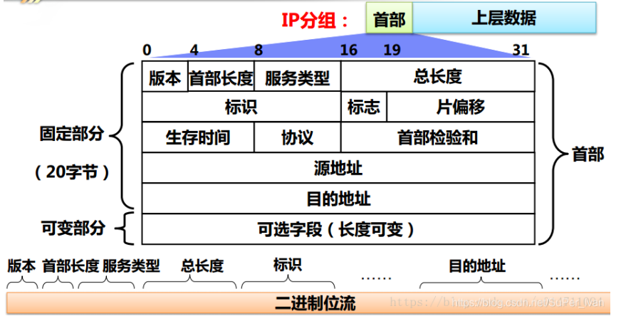

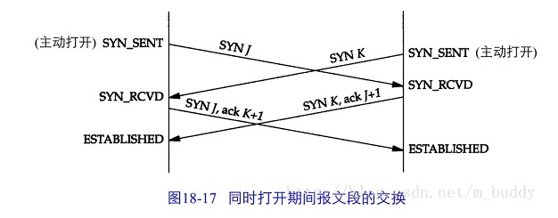

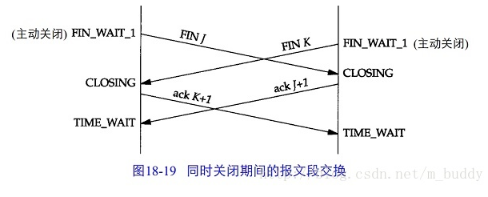

**TCP窗口字段**

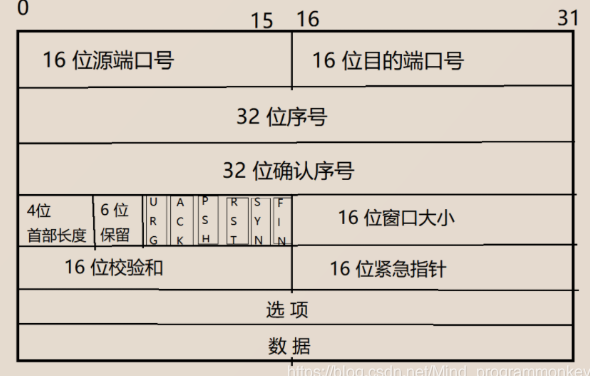

* **seq**(sequence number)是包的序号，**用来解决网络包乱序的问题**
* **ack**(acknowledgement number)，用于确认收到，**用来解决不丢包的问题**
* **window**，也就是著名的滑动窗口(sliding window)，**用来解决流量控制**
* **tcp flag**，也就是包的类型，**主要是用来操控TCP的状态机的**


```bash
1.redis为什么那么快？
2.为什么redis6.0之前不用多线程，而之后用多线程
3.redis可以有哪些用处
4.redis有那些持久化方式(细讲)，介绍rdb文件如何生成、触发机制、优缺点。对比与aof区别
5.redis有哪些数据结构和基本命令
6.redis如何实现事务有哪些命令，什么含义？ 支持事务的特点
7.redis对过期数据的删除策略；6中淘汰策略
8.缓存穿透和对应的解决方案   
9.缓存击穿和对应的解决方案
10.缓存雪崩和对应的解决方案
11.单机系统下，redis如何实现并发控制
12.缓存和数据库的更新时间
13.请你介绍一下主从复制以及其作用包括什么。复制的基本流程是什么
14.哨兵模式的作用。以及监控的流程。优缺点
15.生成订单30分钟未支付，则自动取消，如何实现(3种方法)
16.限流

1.什么是消息队列？为什么使用消息队列(消息队列的特点)？
2.消息队列的两种模式
3.kafka和其他消息队列相比，优势在哪里


tcp状态转移图http://www.cnblogs.com/tonyluis/p/5729531.html
```

```bash
- B树和B+树的区别
- mysql为什么要用B+树(hash BST 红黑 B树 B+树)
- 幻读为什么会发生？如何解决呢
- 进程与线程的切换流程讲一下
- 索引分类
- IO复用聊一下
- http的状态码
- redis的zset以及 redis的一些指令
- 

- 场景题
	1.一个很大的文件几百个G，文件里每一行是一个整数，请找出第十小的数
	
	2.B从A下载数据，下载过程很慢，B不能堵在这里，问如何解决？问A完成下载后又该如何通知B
	
	3.海量数据，无法读入内存，但需要从数据中获得一个最大值
	
	4.什么场景下会触发多笔退款，比如超时...
	
- 5.有一个大数据量的导入操作，分校验数据、入库两步，要我在此场景下使用多线程优化，提高效率。
	这个问题其实就是提高吞吐量。
	5.1并不一定是多线程解决，因为你不是在压榨一台机器，如果是你分布式，要考虑用MQ、分布式任务，把多线程的思想理解为多实例
	5.2把大量数据的读取分为多个分布式任务进行处理，之后发送MQ消息，再有MQ消息进行落库。单个实例接收的多个MQ消息，也可以进行队列存放，批量落库。
	5..3适当扩大数据库连接数，否则可能不够，另外应用配置的总连接数要小于数据库连接数
- 6.类似于骑手抢外卖订单的系统，订单有多个标签，比如在指定区域内的骑手可抢，平均配送时长30分钟内的骑手可抢，信誉度等级c以上的可抢等等，只有所有标签都符合的骑手可以看到该订单，如何设计表结构，如何锁单，如何保证骑手拉取订单列表的速度
	6.1多标签判断，毕竟适合使用规则引擎，无论是自己开发的是还是基于 Drools 的，都可以实现
	6.2外卖订单一般应该是派发模式，圈定符合的骑手进行订单推送，也就遇到热缓存了。
	6.3骑手刷新列表，从redis缓存读取后，基于分布式锁进行“秒杀”，秒杀成功即锁单。确定接单则更新数据库状态。
	6.4表包括：用户外卖订单流水表、骑手表、派单表、订单标签、骑手标签、规则引擎表等。
	`规则引擎：`当业务代码中包含了大量的if else和case等条件判断和选择，当这些ifelse庞大到一定程度后，我们的代码就变得难以维护，很多逻辑可能性需要看好半天才能理清。规则引擎做的事就是 把决策的逻辑判断剥离出来，或者说将整个逻辑判断当做黑盒，我们定义好输入输出即可。
	`热缓存：`热缓存就是某些值存在缓存，查找时缓存可以命中，
	
- 海量数据，无法读入内存，但需要从数据中获得一个最大值

- 如果用excel文件储存学院 班级 分数等成绩，如果动态生成类用于读取数据，避免一个excel对应一个类，比较麻烦。

- 如何实现b站的弹幕，请你设计一下
	利用Netty来实现，然后通过自定义的handler，然后将所有的客户端的管道都先存起来，然后监听客户端接收信息然后通过服务器将消息发送所有的客户端的channel。这样就可以实现一个客户端发送弹幕所有人

```

```bash
- 为什么用B+树（必背）--要结合整个演变过程的优缺点回答
Hash
    mysql是提供了BTREE和HASH的索引方法
    优点：查询性能快，只需要O(1)定位时间，只适用于等值查询
    缺点：
        无法进行范围查询
        重复键会造成哈希冲突，影响性能

二叉查找树
    优点：查找性能快，O(logn)
    缺点：不平衡情况下会退化为链表 O(n)
    	时间复杂度为log(n) ,n为节点。（计算公式：时间复杂度为树的高度x：2^x=n>>x=logn）

红黑树
    优点：保证了不会出现不平衡情况，适合用于内存型数据结构(为什么hashmap用红黑树）
    缺点：
        索引是存储在磁盘文件上，磁盘上的存储是随机存储，每次都需要转圈去读取一个节点，这样当树的深度过大而造成磁盘IO读写过于频繁，进而导致效率低效的情况
        磁盘每次读取是读一页，一页只是为了获取一个节点的数据，也会造成性能浪费

B树
    优点：
        一个节点存储多个数据，更好的利用磁盘页的大小
        n叉树树的高度降低，磁盘读取次数降低
    缺点
        非叶节点存储数据，查询效率不稳定
        非叶节点存储key和data指针，导致一页内能存的key数量降低，导致树的高度增高
        B树不适合做范围查询，必须用中序遍历的方法按序扫库

B+树
	优点：
        叶子节点用指针连在一起形成双向链表，增加了遍历的高效性
        非叶节点不带数据，可以更高效使用索引空间
	缺点：
        B+树的数据只出现在叶子节点上，单次查询性能不如B树
        mysql使用B+树，mongo使用B树，所以B树不是一无是处。
```

```bash
- 面向对象和面向过程区别
	1.面向对象：易维护、易复用、易扩展，由于面向对象有封装、继承、多态性的特征，可以设计出低耦合的系统，使系统更加灵活性能比面向过程底。
	2.面向过程；性能比面向对象高，因为类调用时需要实例化，开销比较大，比较消耗资源。比如 单片机、嵌入式开发、Linux/Unix等一般采用面向过程开发。但没有面向对象易维护、易复用、易扩展

- linux如何查看负载情况
	uptime：会展示系统当前时间、开机时间、用户在线数、负载(1min 5min 15min)
	top：会看到更多的信息。除了以上，还包括cpu占用率，磁盘容量，进程pid等等
- linux如何查看端口占用情况
	netstat -npl | grep 端口号
- linux查看远程服务器的端口占用情况	
	telnet ip port可以查看对方的端口情况  是基于TCP的
	yum -y install telnet # 下载telnet
- ping通，但是连不上服务器，原因
	1.放火墙问题，关闭防火墙
	2.ssh服务是否没开
	3.ssh权限变高了？
	4.密钥问题？删除有关密钥，重新登陆
	5.重启机器，可能会好
```


# 阿里

```bash
------------------- 国际事业群部门

- IOC原理 bean是谁创建的

- 序列化缺点

- 微服务之间服务如何调用

- Spring和SpringBoot的区别

- 请你说一下syncronized源码怎么实现的

- 请你说一下锁住的具体是什么东西

- 请你说一下保证懒加载实现线程安全的单例模式

- 那为什么要第二次判断if(instance == null)

- 那你知道Spring中@Transaction注解如何实现的嘛 如何连接到数据库的

- 那你知道数据库从层面如何处理事务的嘛

- 线程池的原理

- 线程池用了哪些设计模式

- ReentrantLock源码

- AQS源码  AbstractQueuedSynchronizer

- Spring的@Transaction源码

- syncronized 底层c语言源码实现

- syncronized锁的升级 为什么要锁的升级

- 锁具体锁住的是什么

------------------- 本地生活部门
- ArrayList和普通数组的区别
- ArrayList和LinkedList区别
- 如果是一个普通数组，如何去寻找一个元素的值最快，时间复杂度是多少
- HashMap和ConcurrentHashMap的区别
- 介绍项目
- 你这个项目，还有哪些提升点
- 你有度过concurrent包的一些代码吗
- 反问

- 给你一个x,y的值，请你设计一个算法，可以求出其三公里之内的人
```


# 字节

```bash
1.自我介绍
2.请你说一下java的hashmap和redis的map有啥区别				
3.那你说一下hashmap的负载因子为什么是0.75  大了小了又怎么了    
4.请你说一下hashmap的扩容机制。主要是链表方式的扩容
5.链表的扩容是到达同一个位置还是两个位置，如果是两个链表节点的数量会一致嘛
6.redis的map如何解决hash冲突的								
7.除了AVL平衡树，你还知道其他的平衡树吗？						 
7.请你说一下kafka如何保证消息不丢失的
8.每种ack代表什么意思
9.kafka如何保证高吞吐率的 几个原因(除了分布式这种)	
10.同一个topic是到达不同分区是如何实现的
11.同一个topic到达partition的哪里了
12.不同的topic下的消息是放在同一个log文件里面
13.同步和异步你怎么理解的									 
14.阻塞和非阻塞呢											
15.你项目中的socket是使用的同步机制还是异步机制
16.那你了解过netty嘛
17.请你说一下IO多路复用
18.select epoll的区别讲一下
19.tcp连接中TIME WAIT状态为什么有
20.如果你发现存在大量的TIME_WAIT状态的客户端，可能是什么原因，如何解决		*
21.你项目中服务端是如何进行设计的？ (其实没太懂是什么意思)
22.请你讲一下http和https的区别
23.https如何保证安全的，整个流程
24.公钥可以解密私钥嘛？你确定么？								*
25.非对称加密和对称加密原理讲一下									*
26.三色标记法了解吗											*
27.gc你知道那些算法 
28.如何解决STW停顿时间										*
29.zookeeper了解吗
30.线程池的流程说一下
31.线程池的原理    *
32.Scheduled定时线程池的原理 (延迟时间怎么做？)
33.kafka如何选择新的master的


算法题：请你找出一个数组中第k小的数，用O(1)的时间复杂度						*
那么刚才收的，你使用小顶堆的时间复杂度是多少

- redis的map特点
	1.redis键值对中键的类型可以是字符串、整形、浮点型等
	2.redis并没有使用char data[]="ljl",而是自建的SDS:simple dynamic string原因是为了防止二进制丢失，因为c语言中\0代表结束，如果字符中包括了\0，就会导致其后面的字符丢失
	3.兼容c语言的函数库。(因为字符换末尾还会自动加上一个\0，来代表c语言的结束)
- redis应用场景
		SDS:1.是二进制安全的数据结构2.
	`缓存`，计数器(incr decr),海量数据统计(位图：储存是否参过、是否已读，是否会员，日活统计)，分布式锁，限流，排行榜
- redis中的SDS
	SDS：simple dynamic string
	redis并没有c语言原生的方式char data[]="ljl"，而是使用SDS来保存字符串。
	原因：为了防止二进制丢失，因为c语言中\0代表结束，如果字符中包括了\0，就会导致其后面的字符丢失
	优点：1.二进制安全的数据结构	2.内存预分配机制，避免了频繁的内存分配
	SDS:
		free:0；      # 还剩多少空间
		len:6;		# 代表字符的长度
		char buf[]="guojia";	# 储存字符，这样就可以根据len的长度来读取字符，就不会以\0为结束了
   如果此时有增加成了"guojia123"，剩余空间不够了，就会进行扩容，扩围新长度的2倍。
   SDS:
   		free:9
   		len:9			#如果len超过1M以后。下次分配只会增加1M，而不是2倍关系了
   		char buf[]="guojia123";	#如果后续还有增加字符，就会减少free和增加len长度即可。防止频繁内存分配
   		
   redis为了节省空间，又划分出了多种类型
   struct _attributes_((_packed_)) sdshdr5{		#代表可以储存5bit的长度的字符串
   		unsined char flags;   # 高3位代表类型 低5位代表字符串长度
   		char[] buf[];
   }
   struct _attributes_((_packed_)) sdshdr8{
   		uint8_t len; 			# 已用的
   		uint8_t alloc; 			# 分配到的
   		unsinged char flags;	#  
   		char buf[];
   }

- redis map 与java的map有什么区别
	1.java的hashmap只有扩容，而redis的map除了扩容还有缩容。负载因子小于0.1的时候，开始缩容
	2.redis的hash在hash冲入时采用链地址法解决冲突，当链表过长时没有转化为红黑树。而java中的map在链表超过8的时候，而且数组长度超过64的时候会转为红黑树(原因：我认为redis更看中内存空间的宝贵性，实现红黑树更耗费内存)
	3.redis字典实现rehash时候采用的是渐进式rehash，也就是rehash这个动作不是一次性集中性完成的。而是分多次渐进式的完成，就是为了避免rehash时间过长导致服务暂停。而java中hashmap是一次完成的

- redis如何解决hash冲突(扩容，渐进式rehash)
	
- redis是如何缩容的

- 扩容因子为什么是0.75？
	1.设置为0.75有一个好处，因为0.75正好是3/4，而capacity又是2的幂次方，两个数的乘积正好是整数。
	2.说道扩容因子，我们先考虑时间和空间。
	如果负载因子是1.0的话，那当发生hash碰撞时就会生成链表，链表达到一定长度后，就会转换为红黑树，那当负载因子1.0，也就意味着阈值就是数组的长度，当加入了数组长度的元素后才会发生扩容，而相对来说，加入的元素会比较多，此时哈希碰撞次数就会比较多，这是时间效率就会比较低
	如果负载因为是0.5的话，那么就会频繁进行扩容操作，造成空间的浪费，空间利用率有比较低。
	所以综合时间查找效率化和空间利用率，而且2的幂次方这些特性，综合考虑，将负载因子设置为0.75会比较合适。
		
- 还有哪些平衡树
	AVL：平衡二叉树
	红黑树：
	B树：
	B+树：
	B*树：

- kafka如何保证高吞吐量的
	1.kafka使用顺序写入保证自己读写的速度。磁盘读写有两种方式：顺序读写和随机读写。在顺序读写的情况下，磁盘的顺序读写速度和内存持平。由于磁盘是一个机械结构，每次读写都会寻址、写入。其中寻址就比较耗时，而kafka顺序读写就可以大大减少寻址的过程。kafka将message不读追加到本地磁盘文件末尾，而不是随机写入，这使得kafka写入吞吐量很高
	2.零拷贝：kafka利用零拷贝来提高性能。一般来说程序运行在用户空间，文件和网络属于硬件资源，两者之间有一个内核空间。零拷贝跳过了过“用户缓冲区”的拷贝，建立一个磁盘空间和内存的直接映射，数据不再复制到“用户态缓冲区”，系统上下文切换减少两次，性能太高一倍
	3.文件分段：kafka的队列topic被分为了多个区partition，每个partition又分为多个段segment，所以一个队列中的消息实际上是保存在N多个片段文件中。通过分段的方式，每次文件操作都是对一个小文件的操作，非常轻便，同时也增加了并行处理能力
	4.批量发送：Kafka允许进行批量发送消息，先将消息缓存在内存中，然后一次请求批量发送出去。如100条消息就发送，或者每5秒发送一次，这种策略将大大减少服务端的I/O次数
	5.数据压缩：Kafka还支持对消息集合进行压缩，Producer可以通过对消息集合进行压缩，减少传输的数据量，减轻对网络传输的压力

- 零拷贝是什么？说一下实现原理
	零拷贝在java nio、netty、kafka中出现。
	大白话解释：零拷贝就是没有把数据从一个存储区域拷贝到另一个存储区域。从而通过网路传输文件时减少cpu周期
	零拷贝带来的好处：
		1.减少甚至完全避免不必要的CPU拷贝，从而让CPU解脱出来去执行其他的任务
		2.减少内存带宽的占用
		3.通常零拷贝技术还能够减少用户空间和操作系统内核空间之间的上下文切换

- 同步异步 阻塞非阻塞
	同步：比如A调用send方法与B通信，由于是同步，那么在A进程所对应的系统内核空间中，内核缓冲区的数据没发送出去之前，A进程都是一直等待的。
	异步：A调用send方法与B通信，由于是异步，A进程只需要把要发送的消息由用户空间拷贝到内核空间，不用等到内核缓冲区的消息发送出去，就可以处理其他逻辑。换句话说：A发出一个异步调用后，并不会立刻返回结果，而是在未来的某个时间，B会通知A成功了，也可以通过异步回调函数来完成。
	阻塞IO：当用户线程发起read，就会由用户空间切换到内核空间，内核空间真正读取，但是网络上可能没有真正数据发送过来，这个时候就会阻塞主，阻塞就是线程停下来(内核和用户线程都得等)，等数据过来，等数据到了就有DMA复制到内核缓冲区，再由CPU由内核复制到用户缓冲区，这个read方法调用返回结束。内核再切换到用户空间
	非阻塞IO：用户线程调一次read方法，如果这个时候网络上数据还没传输过来，他会立刻返回，告诉用户线程我读到的0，一般是在一个while(true)循环里，那么他就会再去循环一次read，，这个时候用户线程始终没有停下来，所以就叫做非阻塞。如果某次调用read有数据了，这时就不会立刻返回，需要数据的拷贝，这个时候用户线程还是会阻塞住，然后结束(等待数据阶段是非阻塞，拷贝数据阶段还是阻塞)
	多路复用：调用的不是read方法了，而是select方法，然后在阻塞住，看有没有事件，一旦有事件发生了，内核会告诉用户线程有事件发生了，用户线程就可以通过selectKey去拿到channel，然后调用read.然后还是数据拷贝。
	同步：线程自己去获取结果(一个线程)
	异步：线程自己不去获取结果，而是由其他线程送结果(至少两个线程)

- 当出现大量的time-waiting状态，可能是什么原因，如何解决

- 算法题：寻找第k大的数
	1.冒泡排序，进行k趟排序，即可查找到第k大的数   时间复杂度k*n
	2.利用快速排序的思想。因为只需要找到第k大的数，不必把所有的排好序
	
```

**零拷贝**

* “拷贝”：就是指数据从一个存储区域转移到另一个存储区域。
* “零” ：表示次数为0，它表示拷贝数据的次数为0。

> **零拷贝**是指计算机执行IO操作时，CPU不需要将数据从一个存储区域复制到另一个存储区域，从而可以减少上下文切换以及CPU的拷贝时间。它是一种`I/O`操作优化技术。

场景：。如果你实现的是一个web程序，前端请求过来，服务端的任务就是：将服务端主机磁盘中的文件从已连接的socket发出去。

传统的IO流程，包括read和write的过程。

- `read`：把数据从磁盘读取到内核缓冲区，再拷贝到用户缓冲区
- `write`：先把数据写入到socket缓冲区，最后写入网卡设备。

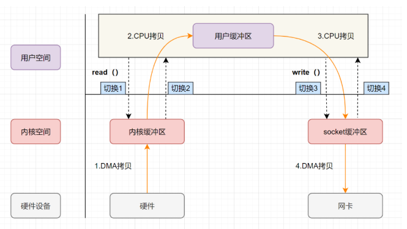

* 用户应用进程调用read函数，向操作系统发起IO调用，**上下文从用户态转为内核态（切换1）**
* DMA控制器把数据从磁盘中，读取到内核缓冲区。
* CPU把内核缓冲区数据，拷贝到用户应用缓冲区，**上下文从内核态转为用户态（切换2）**，read函数返回
* 用户应用进程通过write函数，发起IO调用，**上下文从用户态转为内核态（切换3）**
* CPU将用户缓冲区中的数据，拷贝到socket缓冲区
* DMA控制器把数据从socket缓冲区，拷贝到网卡设备，**上下文从内核态切换回用户态（切换4）**，write函数返回

从流程图可以看出，**传统IO的读写流程**，包括了4次上下文切换（4次用户态和内核态的切换），4次数据拷贝（**两次CPU拷贝以及两次的DMA拷贝**)

```bash
相关知识
- 内核空间和用户空间
	内核空间：主要提供进程调度、内存分配、连接硬件资源等功能
	用户空间：提供给各个程序进程的空间，它不具有访问内核空间资源的权限，如果应用程序需要使用到内核空间的资源，则需要通过系统调用来完成。进程从用户空间切换到内核空间，完成相关操作后，再从内核空间切换回用户空间。
- 什么是用户态、内核态
	如果进程运行于内核空间，被称为进程的内核态
	如果进程运行于用户空间，被称为进程的用户态。
- 什么是cpu上下文
	CPU 寄存器，是CPU内置的容量小、但速度极快的内存。而程序计数器，则是用来存储 CPU 正在执行的指令位置、或者即将执行的下一条指令位置。它们都是 CPU 在运行任何任务前，必须的依赖环境，因此叫做CPU上下文。
- 什么是CPU上下文切换
	它是指，先把前一个任务的CPU上下文（也就是CPU寄存器和程序计数器）保存起来，然后加载新任务的上下文到这些寄存器和程序计数器，最后再跳转到程序计数器所指的新位置，运行新任务。
	一般我们说的上下文切换，就是指内核（操作系统的核心）在CPU上对进程或者线程进行切换。进程从用户态到内核态的转变，需要通过系统调用来完成。系统调用的过程，会发生CPU上下文的切换。
- 虚拟内存
	现代操作系统使用虚拟内存，即虚拟地址取代物理地址，使用虚拟内存可以有2个好处：
	1.虚拟内存空间可以远远大于物理内存空间
	2.多个虚拟内存可以指向同一个物理地址
	正是`多个虚拟内存可以指向同一个物理地址`，可以把内核空间和用户空间的虚拟地址映射到同一个物理地址，这样的话，就可以减少IO的数据拷贝次数啦，示意图1如下
- DMA技术
	DMA，英文全称是Direct Memory Access，即直接内存访问。DMA本质上是一块主板上独立的芯片，允许外设设备和内存存储器之间直接进行IO数据传输，其过程不需要CPU的参与。
	一个整个IO流程，DMA做了哪些事，我们看图2所示。
	1.用户应用进程调用read函数，向操作系统发起IO调用，进入阻塞状态，等待数据返回。
	2.CPU收到指令后，对DMA控制器发起指令调度。
	3.DMA收到IO请求后，将请求发送给磁盘；
	4.磁盘将数据放入磁盘控制缓冲区，并通知DMA
	5.DMA将数据从磁盘控制器缓冲区拷贝到内核缓冲区。
	6.DMA向CPU发出数据读完的信号，把工作交换给CPU，由CPU负责将数据从内核缓冲区拷贝到用户缓冲区。
	7.用户应用进程由内核态切换回用户态，解除阻塞状态
	DMA做的事情很清晰啦，它主要就是帮忙CPU转发一下IO请求，以及拷贝数据。
	DMA的作用：主要就是效率，它帮忙CPU做事情，这时候，CPU就可以闲下来去做别的事情，提高了CPU的利用效率。
```

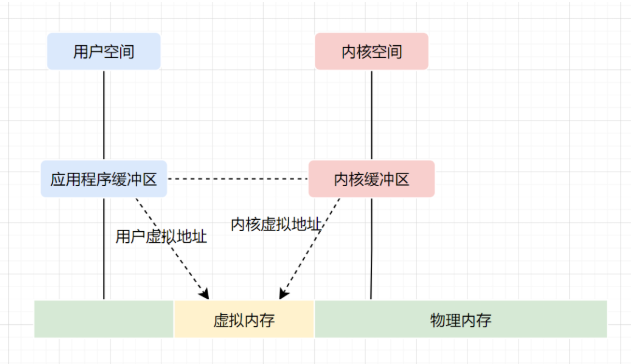

**图1**

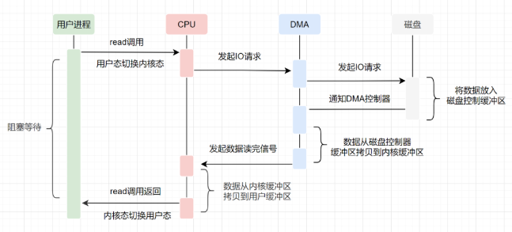

**图2**

**零拷贝实现的几种方式**

* mmap+write
* sendfile
* 带有DMA收集拷贝功能的sendfile

**1.mmap+write实现零拷贝**

mmap函数原型：

```c
void *mmap(void *addr, size_t length, int prot, int flags, int fd, off_t offset);

addr：指定映射的虚拟内存地址
length：映射的长度
prot：映射内存的保护模式
flags：指定映射的类型
fd:进行映射的文件句柄
offset:文件偏移量
```

mmap+write实现零拷贝的流程

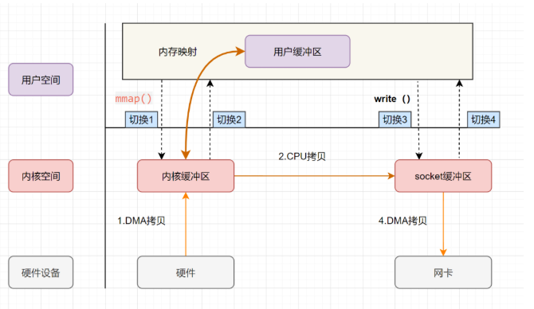

- 用户进程通过`mmap方法`向操作系统内核发起IO调用，**上下文从用户态切换为内核态**。
- CPU利用DMA控制器，把数据从硬盘中拷贝到内核缓冲区。
- **上下文从内核态切换回用户态**，mmap方法返回。
- 用户进程通过`write`方法向操作系统内核发起IO调用，**上下文从用户态切换为内核态**。
- CPU将内核缓冲区的数据拷贝到的socket缓冲区。
- CPU利用DMA控制器，把数据从socket缓冲区拷贝到网卡，**上下文从内核态切换回用户态**，write调用返回。

可以发现，`mmap+write`实现的零拷贝，I/O发生了**4**次用户空间与内核空间的上下文切换，以及3次数据拷贝。其中3次数据拷贝中，包括了**2次DMA拷贝和1次CPU拷贝**。

**什么是mmap?**

`mmap`是将读缓冲区的地址和用户缓冲区的地址进行映射，内核缓冲区和应用缓冲区共享，所以节省了一次CPU拷贝

`mmap`的方式节省了一次CPU拷贝，同时由于用户进程中的内存是虚拟的，只是映射到内核的读缓冲区，所以可以节省一半的内存空间，比较适合大文件的传输。

**2.sendfile实现零拷贝**

```c
ssize_t sendfile(int out_fd, int in_fd, off_t *offset, size_t count);

out_fd:为待写入内容的文件描述符，一个socket描述符。，
in_fd:为待读出内容的文件描述符，必须是真实的文件，不能是socket和管道。
offset：指定从读入文件的哪个位置开始读，如果为NULL，表示文件的默认起始位置。
count：指定在fdout和fdin之间传输的字节数。
```

`sendfile`是Linux2.1内核版本后引入的一个系统调用函数，sendfile表示在两个文件描述符之间传输数据，它是在**操作系统内核**中操作的，**避免了数据从内核缓冲区和用户缓冲区之间的拷贝操作**，因此可以使用它来实现零拷贝

sendfile实现的零拷贝流程如下:

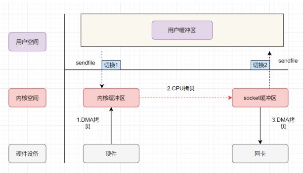

* 用户进程发起sendfile系统调用，**上下文（切换1）从用户态转向内核态**
* DMA控制器，把数据从硬盘中拷贝到内核缓冲区。
* CPU将读缓冲区中数据拷贝到socket缓冲区
* DMA控制器，异步把数据从socket缓冲区拷贝到网卡，
* **上下文（切换2）从内核态切换回用户态**，sendfile调用返回。

可以发现，`sendfile`实现的零拷贝，I/O发生了**2**次用户空间与内核空间的上下文切换，以及3次数据拷贝。其中3次数据拷贝中，包括了**2次DMA拷贝和1次CPU拷贝**。那能不能把CPU拷贝的次数减少到0次呢？有的，即`带有DMA收集拷贝功能的sendfile`！

`sendfile`方法IO数据对用户空间完全不可见，所以只能适用于完全不需要用户空间处理的情况，比如静态文件服务器

**3.sendfile+DMA scatter/gather实现的零拷贝**

linux 2.4版本之后，对`sendfile`做了优化升级，引入SG-DMA技术，其实就是对DMA拷贝加入了`scatter/gather`操作，它可以直接从内核空间缓冲区中将数据读取到网卡。使用这个特点搞零拷贝，即还可以多省去**一次CPU拷贝**

sendfile+DMA scatter/gather实现的零拷贝流程如下：

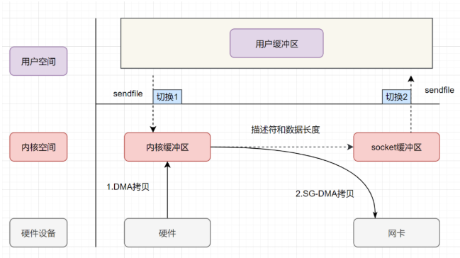


* 用户进程发起sendfile系统调用，**上下文（切换1）从用户态转向内核态**
* DMA控制器，把数据从硬盘中拷贝到内核缓冲区。
* CPU把内核缓冲区中的**文件描述符信息**（包括内核缓冲区的内存地址和偏移量）发送到socket缓冲区
* DMA控制器根据文件描述符信息，直接把数据从内核缓冲区拷贝到网卡
* **上下文（切换2）从内核态切换回用户态**，sendfile调用返回。

可以发现，`sendfile+DMA scatter/gather`实现的零拷贝，I/O发生了**2**次用户空间与内核空间的上下文切换，以及2次数据拷贝。其中2次数据拷贝都是包**DMA拷贝**。这就是真正的 **零拷贝（Zero-copy)** 技术，全程都没有通过CPU来搬运数据，所有的数据都是通过DMA来进行传输的。

`DMA gather`和`sendfile`一样数据对用户空间不可见，而且需要硬件支持，同时输入文件描述符只能是文件，但是过程中完全没有CPU拷贝过程，极大提升了性能。

**java提供的零拷贝方式**

- Java NIO对mmap的支持
- Java NIO对sendfile的支持

**1.Java NIO对mmap的支持**

Java NIO有一个`MappedByteBuffer`的类，可以用来实现内存映射。它的底层是调用了Linux内核的**mmap**的API。

**mmap的小demo**如下：

```java
public class MmapTest {

    public static void main(String[] args) {
        try {
            FileChannel readChannel = FileChannel.open(Paths.get("./jay.txt"), StandardOpenOption.READ);
            MappedByteBuffer data = readChannel.map(FileChannel.MapMode.READ_ONLY, 0, 1024 * 1024 * 40);
            FileChannel writeChannel = FileChannel.open(Paths.get("./siting.txt"), StandardOpenOption.WRITE, StandardOpenOption.CREATE);
            //数据传输
            writeChannel.write(data);
            readChannel.close();
            writeChannel.close();
        }catch (Exception e){
            System.out.println(e.getMessage());
        }
    }
}
```

**2.Java NIO对sendfile的支持**

FileChannel的`transferTo()/transferFrom()`，底层就是sendfile() 系统调用函数。Kafka 这个开源项目就用到它，平时面试的时候，回答面试官为什么这么快，就可以提到零拷贝`sendfile`这个点。

```java
@Override
public long transferFrom(FileChannel fileChannel, long position, long count) throws IOException {
   return fileChannel.transferTo(position, count, socketChannel);
}
```

**sendfile的小demo**如下：

```java
public class SendFileTest {
    public static void main(String[] args) {
        try {
            FileChannel readChannel = FileChannel.open(Paths.get("./jay.txt"), StandardOpenOption.READ);
            long len = readChannel.size();
            long position = readChannel.position();
            
            FileChannel writeChannel = FileChannel.open(Paths.get("./siting.txt"), StandardOpenOption.WRITE, StandardOpenOption.CREATE);
            //数据传输
            readChannel.transferTo(position, len, writeChannel);
            readChannel.close();
            writeChannel.close();
        } catch (Exception e) {
            System.out.println(e.getMessage());
        }
    }
}
```

**应用场景**

对于文章开头说的两个场景：RocketMQ和Kafka都使用到了零拷贝的技术。

对于MQ而言，无非就是生产者发送数据到MQ然后持久化到磁盘，之后消费者从MQ读取数据。

对于RocketMQ来说这两个步骤使用的是`mmap+write`，而Kafka则是使用`mmap+write`持久化数据，发送数据使用`sendfile`。

**总结**

由于CPU和IO速度的差异问题，产生了DMA技术，通过DMA搬运来减少CPU的等待时间。

传统的IO`read+write`方式会产生2次DMA拷贝+2次CPU拷贝，同时有4次上下文切换。

而通过`mmap+write`方式则产生2次DMA拷贝+1次CPU拷贝，4次上下文切换，通过内存映射减少了一次CPU拷贝，可以减少内存使用，适合大文件的传输。

`sendfile`方式是新增的一个系统调用函数，产生2次DMA拷贝+1次CPU拷贝，但是只有2次上下文切换。因为只有一次调用，减少了上下文的切换，但是用户空间对IO数据不可见，适用于静态文件服务器。

`sendfile+DMA gather`方式产生2次DMA拷贝，没有CPU拷贝，而且也只有2次上下文切换。虽然极大地提升了性能，但是需要依赖新的硬件设备支持。


# 哔哩哔哩

```bash
- Redis如何实现高可用

- 文件如何保证消息的唯一性
```

**常见分库分表算法**

* hash取模：通过对唯一编号hash取模(%n)后得到n个表中某一个表

  * 优点：经过hash取模后，分到表中的数据是均衡的，不会出现资源倾斜问题

  * 缺点：如果数据暴增没有再我们预估范围内，就涉及到数据迁移、重新hash、修改路由等

* range划分：64个表，每个表存100w数据，第一个表存0-100w编号之间的，第二表存100-200w之间，以此类推

  * 不需要数据迁移，后续数据即时增长很多也没问题
  * 数据倾斜严重，比如上图，很长一段时间，都会只用到1个库，几个表

* 一致性hash：同样是hash取值，经过处理得到一个数值。然后在对数值在某个区域内分配到某个表中。简单来说就是对range划分前进行了hash操作，增加了有序数据的随机性，减少了数据倾斜现象。

  * 更加均匀，并且在需要扩容时，数据迁移的量级更小
  * 路由算法要复杂

**雪花算法(64bit)**

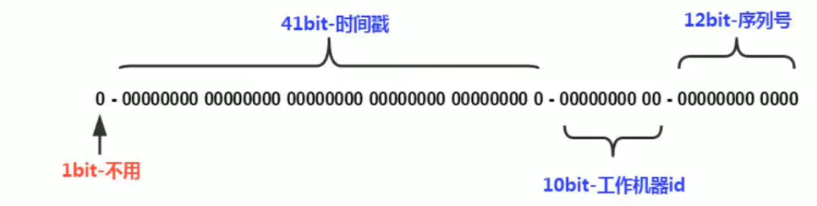

* 第一个bit是符号位，一般是0表示正数
* 第二部分是41bit的时间戳，可以精确到毫秒
* 第三部分是机房id和机器id(统称为工作机器id，一共10bit)
* 第四部分是序列号，12bit表示4096个数

```bash
- 第二部分可以支持69年
	1<<<41 / (1000 * 60 * 60 * 24 * 365) = 69年	
```

```java
// 源码nextId()
private final static long SEQUENCE_BIT = 12; //序列号占用的位数
private final static long MACHINE_BIT = 5;   // 机器标识占用的位数
private final static long DATACENTER_BIT = 5;// 数据中心占用的位数
/**
-1L = 1111111...
-1L << 12 也就是 1111 1111 ... 0000 0000 0000 0000(64位)

1111 1111 0000 0000 0000 0000
^
1111 1111 1111 1111 1111 1111
-------------------
0000 0000 1111 1111 1111 1111 换算成10进制4095
*/
private final static long MAX_SEQUENCE = -1L ^ (-1L << SEQUENCE_BIT)  

// 机器标识较序列号偏移12位 
private final static long MACHINE_LEFT =   SEQUENCE_BIT;
// 数据中心较机器标志偏移量 17位
private final static long DATACENTER_LEFT =   SEQUENCE_BIT + MACHINE_BIT;
// 时间戳较数据中心偏移22位
private final static long TIMESTMP_LEFT =   DATACENTER_LEFT + DATACENTER_BIT;

public static syncronized long nextId(){
    // 获取当前时间戳
    long currStmp = System.currentTimeMillis();
    // 如果当前时间戳是否小于上次时间戳则抛出异常
    if(curStmp < lastStmp){
        throw new RuntimeException("不正常");
    }
    // 相同毫秒内
    if(currStmp == lastStmp){
        /*
        4095 + 1 -> 高位是1 低12位都是0
        */
        // 相同毫秒内，序列号自增
        sequnce = (sequence + 1) & MAX_SEQUENCE; // 4095
        // 同一毫秒的序列数已经达到最大
        if(sequnce == 0L){
            // 获取小一秒的时间戳并赋值给当前时间戳
            currStmp = getNextMill();
        }
    }else{
        // 不同毫秒内，序列号置为0
        sequence = 0L;
    }
    // 当前时间戳存档记录，用于下次产生id时对比是否为相同时间戳
    lastStmp = currStmp;
    // START_STMP就是当前机器启动的时间戳
    return (curr - START_STMP) << TIMESTMP_LEFT  // 时间戳高位
         | datacenterId << DATACENTER_LEFT		 // 数据中心部分
         | machinedId << MACHINE_LEFT			 // 机器标识部分
         | sequence;							 // 序列号部分
}

private static long getNextMill(){
    // 还是当前的时间
    long mill = System.currentTimeMillis();
    while(mill <= lastStmp){
        mill = getNewstmp();
    }
    return mill;
}
```

**问题**

* 时钟回拨问题
* 机器id的分配和回收问题
* 机器id的上限问题

**时钟回拨解决方案**

* 抛异常
* 设置可容忍的回拨时间，比如3ms，如果时间差在3ms之内，可以等待，如果超过3ms则跑异常
* 超过3ms也可以不抛异常。因为10bit的机器id可以灵活分配，所以我们可以为主生成id的服务器分配对应的备用机，接下来我们采用备用机生成id，此时由于两台机器的机器id不一样，所以生成的分布式id一定不一样
* 由于雪花算法是用当前时间戳为条件，如果当前时间发生时钟回拨就造成id重复问题。我们可以采用“历史时间”，即产生新id时，先将序列号+1，等序列号增加至最大值在将时间戳+1。但是在超高并发情况下，历史的时间很快用完，时间一直保持在最新时间的话，这个时候出现时间回拨，则采用业界对于时间回拨的处理方式

**Kafka如何实现生产者幂等性的**

当ack为-1时，可以保证数据不丢失，但是可能会重复发送，即At Least Once；当ack为0时，可以保证消息只发送一次，但可能会丢失，即即At Most Once；

Exactly Once = At least Once + 幂等性；其实生产者参数中一个配置参数enable.idempotence设置为true就可以了。(设置完后ack就自动为-1，retries属性设为Integer.MAX_VALUE)。

kafka的幂等性其实就是将下游要去做的唯一性去重放在了数据上游。开启幂等性后Producer在初始化是会被分配一个PID,发往同一个Partition的消息会附带Sequence Number，而Broker端会对<PID，Partition，SeqNumber>做缓存，**当具有相同主键的消息提交时，Broker只会持久化一条**

Producer重启，PID就会变化，所以**幂等性只能保证单会话的Exactly Once**。

**Kafka如何实现选举master的**

LEO(log end offset)：指的是每个follower最大的 offset；

HW(high watermark)：指的是消费者能见到的最大的 offset，ISR 队列中最小的 LEO

* follower故障：follower 发生故障后会被临时踢出 ISR，待该 follower 恢复后，follower 会读取本地磁盘记录的上次的 HW，并将 log 文件高于 HW 的部分截取掉，从 HW 开始向 leader 进行同步。等该 follower 的 LEO 大于等于该 Partition 的 HW，即 follower 追上 leader 之后，就可以重新加入 ISR 了。

* leader故障：leader 发生故障之后，会从 ISR 中选出一个新的 leader，新的leader是LEO最大的那个，其余的follower先将各自log文件高与HW的部分截掉，然后从新的leader同步数据。

**如何处理消息重复**

* 通过数据库唯一键实现幂等，我们可以在设计消息结构的时候设置一个对应数据库唯一键的列字段，业务成功后将此字段作为唯一键保存到数据库，当同样的ID做保存的时候就会出现违反数据库唯一约束异常，这里的主键可以是单独的，也可以是组合的列。

**消息积压**

我们应该从三个方面查找问题

* 生产端：一般当生产端发生积压就要查看你的业务逻辑是否有异常的耗时步骤导致的。是否需要改并行化操作等
* Broker端：当Broker端发生积压我们首先要查看，消息队列内存使用情况，如果有分区的的话还得看每个分区积压的消息数量差异。当每个分区的消息积压数据量相对均匀的话，我们大致可以认为是流量激增。需要在消费端做优化，或者同时需要增加Broker节点（相当于存储扩容），如果分区加压消息数量差异很大的话（有的队列满了，有的队列可能还是空闲状态），我们这时候就要检查我们的路由转发规则是否合理
* 消费端：在使用消息队列的时候大部分的问题都出在消费端，当消费速度小于生产速度很快就会出现积压，导致消息延迟，以至于丢失。这里需要重点说明一点的是，当消费速度小于生产速度的时候，仅增加消费者是没有用处的，因为多个消费者在同一个分区上实际是单线程资源竞争关系，我们需要同时增加Broker上的分区数量才能解决这一问题。

# 百度

```bash
1.多线程交替打印 熟悉一下
2.redis如何使先分布式锁的逻辑
3.AOP 都用在什么场景下
4.mysql中怎么用乐观锁和悲观锁的 具体到语句
5.redis作为缓存为什么还有持久化策略
```

# 星球

**腾讯**

```bash
- 反射的使用场景
	反射是反射就是把Java类中的各个成分映射为一个个对象，在运行状态中，可以动态获取的一种技术手段。
	1.在动态配置时，比如有时我们底层数据库有时是mysql有时用oracle，需要动态根据实际情况加载驱动类，这个时候反射就会用到 Class.forName()等操作
	2.首先反射是框架的灵魂，需要大量使用到反射机制来进行框架设计。比如平常用到的Spring等框架。
	3.还有Spring的IOC功能也会根据配置文件配置各种各样的bean，spring的工厂会加根据去求动态加载

- 反射为什么比实例对象相比要慢
	反射的确会导致性能问题。当随着反射调用次数越多，效率就会下降的越低。
	原因：
		1.method的invoke方法会对参数做封装和解封操作
		2.需要检查方法可见性
		3.需要校验参数
		4.JIT无法优化
	一般来说，我们获取方法的方式是getMethod / getDeclaredMethod，而其流程是1.检查方法权限2.获取方法的Method对象3.返回方法的拷贝。 
	首选会根据访问权限去进行判断，所以会筛选出一部分public方法。然后获取对应访问权限的方法列表，然后根据方法名和参数列表从中筛选出对应的方法。那如果子类中没有找到对应的方法，就会去父类中查找对应的方法。最终得到了方法以后，并不会直接返回，而是会返回方法的拷贝，然后进行返回。
	得到方法之后才能通过invokde方法进行调用，此时又会对输入的参数完成包装操作。
	原因1：invoke方法会对参数进行封装和解封操作。我们看源码时会发现invoke的参数是Object[]类型的，所以如果输入参数为long时，就会用到Long.valueOf进行包装，此时会生成很多包装对象，在后面的实现部分呢，还会对参数进行校验，又会从数组中对数据完成解封操作，因此在反射调用时，因为封装和解封产生了不必要的内存浪费，当调用次数达到一定次数后，还会导致gc。
	原因2：反射每次调用时还必须检查放大的可见性。
	原因3：需要校验参数
	原因4：因为反射涉及到动态加载类型，所以JIT无法进行优化。
	综上就是反射比较慢的原因。

- ArrayList扩容
	首先arrayList的扩容操作常常发生在添加操作。和hashmap先添加元素再扩容的扩容机制不同的时，arrayList是先完成容量检查，如果检查合法或扩容完成才会添加元素。
	首先呢，类中有一个size的属性表示数组中添加了多少元素，那如果在添加元素时就需要保证数组长度需要大于size+1，所以第一件事情就是要判断数组长度和size+1谁大，如果size+1大的话，就会通过grow方法完成扩容操作。
	具体的扩容流程是先将就数组的长度右移一位+旧数组长度，换句话说就是对数组扩容了原来的1.5倍，然后通过Arrays.copyOf方法完成旧数组的拷贝，此时得到的就是容量为新长度，且数组也复制的新Object数组，在然后将新数组赋值给elementData，以后的添加操作都在新数组中操作即可。

- ConcurrentHashMap实现原理
	ConcurrentHashMap使用的是锁的分段技术，给每一个槽位都添加了一把锁，这样多线程在访问每个操作时，就不存在锁竞争的情况了，提高了并发效率。
	ConcurrentHashMap的基本单位Node，其实就是hashmap的Node，这边储存元素的数据结构是Node[]，而且其是被volatile修饰的，也是为了多线程情况下，保证其可见性。在添加元素时，首先根据元素的key，经过扰乱函数(高16位异或第16位，高16位不变)得到一个新的hash，然后根据hash & (n-1)得到元素在数组中的位置。在添加元素时很关键。
	如果添加的位置是null空的话，就会利用CAS的操作完成添加的更新操作，因为CAS也是一种原子操作，可以保证线程安全。第二种情况，如果该位置的hash值为-1，说明此位置正在经历扩容。第三种情况，该位置不为null和-1，就会采用syncronized关键字锁着该位置，然后在对该位置的链表或者红黑树进行操作。如果通过hash值一样且equals方法也相等，就会直接更新此处的值，不会采用CAS来更新。 get方法就是很普通的方法。
	问题1：扩容的时候，可以不可以对数组进行读写操作？事实上是可以的。当在进行数组扩容的时候，如果当前节点还没有被处理，那就可以进行设置操作。如果该节点已经被处理了，则当前线程也会加入到扩容的操作中去。
	问题2：多个线程又是如何同步处理的？在取得某个位置的Node时，使用的都是unsafe的方法，来达到并发安全的目的；当需要在某个位置设置节点的时候，则会通过Synchronized的同步机制来锁定该位置的节点；在进行数组扩容时，会将hash值设置为-1，将某个位置的节点复制到另外一个table时，也通过Synchronized的同步机制来保证现程安全；在Node为null时，通过cas来完成Node的添加。
	
- volatile原理
	volatile变量具有以下三个特性，一个是保证可见性，一个是有序性，即volatile可以防止指令重排，使得执行到volatile时前面的代码都已经执行了。第三个就是不保证原子性。
	volatile的写语义：当写线程写一个volatile变量时，JMM会把该线程对应的本地内存中的共享变量值刷新到主内存
	volatile的读语义：当读线程读一个volatile变量时，JMM会把该线程对应的本地内存置为无效，线程接下来将从主内存读取共享变量。
	实现volatile的原理主要和内存屏障和缓存行有关，首先内存屏障是一组处理器指令，用于实现对内存操作的顺序限制；缓存行是CPU高速缓存中的基本单位，一般一个缓存行是64字节，也就是说可以存8个long类型的数据。
	首先java程序执行时会编译为字节码通过加载器加载到JVM中，JVM执行字节码最终将其转变为汇编代码相关的CPU指令，当变量被volatile修饰时，会比普通变量多一行以Lock为前缀的指令，因此在对变量执行写操作的时候JVM会向处理器发送一条Lock# 指令将缓存行中的数据更新到主存相应的地址中，但是此时的数据就会和其他处理器缓存行中的数据不一致，此时为了保证数据的一致性，就会实现缓存一致性协议，每一个处理器会嗅探在总线上传播的数据来检查自己缓存的值是不是过期了，当处理器发现自己缓存行对应的内存地址被修改过，就会将该缓存行设置为无效转态，当处理器需要读取该数据的时候，就会重新从主存中读取到缓存行

- syncronized原理
	1.修饰同步语句块：syncronized使用的是 monitorenter 和 monitorexit 指令，其中 monitorenter 指令指向同步代码块的开始位置，monitorexit 指令则指明同步代码块的结束位置，当执行 monitorenter 指令时，线程试图获取锁也就是获取 对象监视器 monitor 的持有权，如果锁的计数器为 0 则表示锁可以被获取，获取后将锁计数器设为 1 也就是加 1。对象锁的的拥有者线程可以执行 monitorexit 指令来释放锁。锁计数器设为0.
    2.修饰同步方法，取而代之采用的是 ACC_SYNCHRONIZED 标识，该标识指明了该方法是一个同步方法，如果是实例方法，JVM会尝试获取实例对象的锁，如果是静态方法，JVM 会尝试获取当前 class 的锁。
   
- G1收集器的特性
	1.并行并发：G1在回收期间，可以有多个GC线程同时工作，有效利用多核计算能力；G1拥有与应用程序交替执行的能力，部分工作可以和应用程序同时执行，因此，一般来说，不会在整个回归阶段发生完全阻塞应用程序的情况
	2.分代收集：将堆空间划分为若干区域，逻辑上包括了新生代和老年代，在新生代采用复制算法，在老年代采用标记整理算法
	3.可预测的停顿时间模型：G1相对于CMS有一大优势，G1追求低停顿，还能建立可预测的停顿时间模型，使用者可以指定M毫秒的时间片段，消耗在垃圾收集上的时间不能超过n毫秒
	缺点：一般来说，G1更适合在大内存应用上发挥作用，CMS则在小内存上表现比较好。另外G1无论为了垃圾收集产生的内存占用还是程序运行时的额外执行负载都要比CMS要高

- mysql事务隔离级别
	read uncommited(读为提交)
	read commited(读已提交，是快照读)
	repeatable read(可重复读，快照读)
	serializable(可串行化)
	对于读取已提交和可重复读这两个隔离级别来说，其底层实现就是多版本并发控制 MVCC，具体来说就是数据库会为每个事务创建一个视图，访问的时候以视图的逻辑结果为准，通过undo log版本链使得事务可以回滚到视图记录的状态。
	* 在 “读取已提交” 隔离级别下，这个视图是在每个 SQL 语句开始执行的时候创建的
	* 在 “可重复读” 隔离级别下，这个视图是在事务启动时就创建的，整个事务存在期间都用这个视图
	为了解决幻读采用的是记录锁和间隙锁，也称临建锁。
- 可串行化隔离级别的实现原理，如何避免幻读的
	可串行化是最高的隔离级别，他通过强制事务排序，使之不可能发生冲突，从而解决幻读。该级别可以防止脏读、不可重复读以及幻读。写会加写锁，读会加读锁，后访问的事务必须等前一个事务执行完成后才可以执行
- 介绍一下MVCC
	MVCC即多版本并发控制。简单来说呢，针对读已提交和可重复读这两种隔离机制，数据库会为每个事务创建一个视图，访问的时候以视图的逻辑结果为准。
	1.事务如何回到之前事务记录之前的状态？
		这就是undo log版本链做的事情了。首先每条记录在更新的时候都会记录一条回滚操作，当前记录最新值，通过回滚都可以得到前一个状态的值。也就是说，B+索引数上对应的记录只会有一个最新版本的，但是InnoDB可以根据undo log得到数据的历史版本，同一条记录在系统中存在多个版本，这就是数据库多版本并发控制
	2.怎么得到这条记录拥有的undo log
    	其实innodb储存引擎中每条记录都会有两个隐藏字段，事务id和指向之前生成undo log的指针。当我们执行一个事务时，加入事务id为200，当操作这条数据时，那么这条记录的事务id就会变为200，然后undolog会记录没修改前的数据，随着事务没有提交的前提下，其他事务的增加，undolog就会下形成多个undolog指针串联的情况，从而形成undolog版本链。
    	undolog记录的是，他更新操作时，对应事务id和当时的值。以及一个undolog指针。
    3.那对于当前事务，他可以看到那些undolog呢？
    	这就要说到readview机制了，一个readview会包含以下几个部分：m_ids：生成 ReadView 时有哪些事务在执行但是还没提交的（称为活跃事务），这些活跃事务的 id 就存在这个字段里；min_trx_id:m_ids 里最小的值；max_trx_id:生成 ReadView 时 InnoDB 将分配给下一个事务的 ID 的值;creator_trx_id:当前创建视图事务的id。
    	一个事务只能看不到活跃事务id字段中存在的和大于等于max_trx_id的，当前事务都看不到，只能看到当前事务修改和小于min_trx_id的修改
- 索引设计原则
	1.单张表不能设置超过5个以上的索引，因为会降低效率
	2.每个InnoDB必须有一个主键，不能使用uuid等作为主键，建议使用自增的id
	3.建议对频繁作为where条件查询和order by或on等用到的字段作为索引
	
- 索引底层结构
	1.hash查询效率快，定位只需要O(1)的定位时间，但是无法范围查询，也会存在哈希冲突
	2.二叉查找树，平均时间复杂度为O(logn)，但是极端情况下会退化为链表
	3.红黑树，可以保证二叉树的平衡，缺点是储存在磁盘文件上，磁盘上的储存是随机储存，就会花费大量的时候在寻道，旋转上面。而且当树的深度过大，也会造成IO读写频繁
	4.B树，一个节点可以储存多个数据，更好的利用磁盘页的大小，n叉树也可以降低高度从而减少IO读取次数。缺点就是没叶子节点也会储存key和data，导致一页内存着key数量降低，而且不适合范围查找
	5.B+树： 叶子节点用指针连在一起形成双向链表，增加了遍历的高效性，非叶节点不带数据，可以更高效使用索引空间。
	综合来看，B+树更适合作为mysql的索引结构

- 为什么主键用自增不用UUID
	1.使用自增id是顺序的，所以innodb就可以把每条记录都储存在一条记录的后面，这样不仅在插入时定位和寻址很快，而且还会减少页分裂和碎片产生。
	2.使用uuid的话，它是毫无规律可言，无法总把新数据插到索引的最后，而是需要为新行寻找新的合适的位置从而来分配新的空间。 第一，写入的目标页很有可能已经刷新到磁盘上了，就不得不从磁盘上找到并加载到内存中，导致大量的随机IO 第二，由于写入是乱序的，innodb不得不频繁的做页分裂操作，以便为新的行分配空间,页分裂导致移动大量的数据，导致效率很低 第三，由于频繁的页分裂，页会变得稀疏并被不规则的填充，最终会导致数据会有碎片
	页分裂：当后一个数据页中所有行并不一定比前一个数据页的行的id大时，就会触发页分裂的逻辑。页分裂是为了保证后一个数据页中所有行主键值比前一个数据页中主键值大
- Redis为什么快
	1.完全基于内存操作
	2.使用单线程，无上下文的切换成本
	3.语言实现，优化过的数据结构，基于几种基础的数据结构，redis 做了大量的优化，性能极高
	4.基于非阻塞的 IO 多路复用机制
- Redis的两种持久化方式
	持久化操作包括rdb和aof。
	1.其中rdb机制是一种设置间隔时间检测修改的次数，如果超过了设定的次数，则进行持久化操作。它的作用是在指定时间间隔内将数据库状态保存到RDB文件中，RDB文件是一个二进制文件(保留的是数据)，通过它可以还原某个时刻数据库的状态。
	2.aof是以日志的形式记录每一个写操作。通过追加、写入、同步三个步骤来实现持久机制。redis重启的时候就根据日志文件的内容将写指令从前到后执行一次以完成数据的恢复工作。落盘策略有1.每次写操作都进行落盘操作，基本不会丢数据，但性能较差；每秒写入，每个写命令执行完，只会写入aof文件的内存缓冲区，每隔一秒把缓冲区中的内容写入磁盘；第三种有操作系统来决定何时将缓冲区内容写回磁盘。
- 写RDB文件时候fork调用原理，为什么这样子性能良好
	
- Redis定期键删除策略
	1.从已设置过期时间的数据集中挑选最近最久未使用的数据淘汰
	2.从已设置过期时间的数据集中挑选将要过期的数据淘汰
	3.从已设置过期时间的数据集（server.db[i].expires）中任意选择数据淘汰
	4.当内存不足以容纳新写入数据时，在键空间中，移除最近最久未使用的 key
	5.从数据集（server.db[i].dict）中任意选择数据淘汰
	6.禁止驱逐数据，也就是说当内存不足以容纳新写入数据时，新写入操作会报错
- Redis万一崩了，怎么办
	
- SpringMVC工作流程
	1.用户向服务器发送请求，请求被Spring 前端控制器DispatcherServlet捕获
	2.DispatcherServlet对请求URL进行解析，得到请求资源标识符（URI）。然后根据该URI，调用HandlerMapping获得该Handler配置的所有相关的对象（包括Handler对象以及Handler对象对应的拦截器），最后以HandlerExecutionChain对象的形式返回
	3.DispatcherServlet 根据获得的Handler，选择一个合适的HandlerAdapter(如果成功获得HandlerAdapter后，此时将开始执行拦截器的preHandler(…)方法)
	4.然后提取Request中的模型数据，填充Handler入参，然后执行对应的Controller
	5.当Controller执行完后，会向DispatcherServlet 返回一个ModelAndView对象
	6.根据返回的ModelAndView，选择一个适合的ViewResolver（必须是已经注册到Spring容器中的ViewResolver)返回给DispatcherServlet ；
	7.ViewResolver 结合Model和View，来渲染视图
	8.将渲染结果返回给客户端。
- SpringMVC处理器拦截器的使用场景
	1.记录接口响应时间。在preHandler开始计时，然后到afterCompletion结束计时
	2.判断用户是否登录。可以看到当从session中取不到相应的用户信息时，说明用户没有登录，应该提示登录
	3.判断用户的权限。
	4.接口权限验证。
	preHandler：Controller方法处理之前。而且多个的话，则先拦截先执行
	postHandler:Controller方法处理完之后，DispatcherServlet进行视图的渲染之前，也就是说在这个方法中你可以对ModelAndView进行操作。执行顺序倒着执行
	afterCompletion：pDispatcherServlet进行视图的渲染之后。所有的postHandler都执行完了，然后倒着执行
	
- Spring IOC的设计原理
	控制反转：原来的对象是由使用者来进行控制，有了spring之后，可以把整个对象交给spring来帮助我们来进行管理
	DI：依赖注入，把对象的属性的值注入都具体的对象中，@Autowired、populateBean完成属性值的注入
	容器：储存对象，使用map结构来储存，在spring中一般存在三级缓存，singletonObjects存放完整的bean对象，真个bean的生命周期，从创建到使用到销毁的过程都是由容器来管理(bean的生命周期)
分：
    1.一般聊ioc容器的时候，要设计到容器的创建过程(beanFactory，DefaultListableBeanFactory 容器有一个最上层的根接口叫beanFactory，它里面只有声明方法，没有具体的实现，我们在实际使用过程中最普遍的实现类就是DefaultListableBeanFactory，包括我们在使用的时候会优先创建bean工厂)，向bean工厂中设置一些参数(BeanPostProcessor，Aware接口的子类)等等属性
    2.加载解析bean对象，准备要创建的bean对象的定义对象beanDefinition(xml或者注解的解决过程)，这时我们就得到了beanDefinition了(通过IO读取为Document对象，然后解析标签和属性值装载为BeanDefinition，当然普通类型和引用类型处理起来也稍有不同)
    3.beanFactoryPostProcessor的处理，此处是扩展点。比较多的扩展点，比如处理占位符，PlaceHolderConfigureSupport、ConfigurationClassPostProcessor(会去储存beanDefinition的Map中获得class对象和属性值)
    4.BeanPostProcessor的注册功能，方便后续对bean对象完成具体的扩展功能。注册也就是从容器中获得此类型的对象，添加到
    5.通过反射的方式将beanDefinition对象实例化成及具体的bean class对象
    6.聊一聊bean对象的初始化过程(填充属性，调用aware子类的方法，调用BeanPostProcessor前置处理方法，调用init-method方法，调用BeanPostProcessor的后置处理方法)
    7.生成完整的bean对象，通过getBean方法直接获取
    8.销毁过程
- Spring bean的生命周期
	spring是一个轻量级框架，为了帮助我们进行简化开发的，它里面的核心功能有IOC和AOP。bean的生命周期只是IOC中创建对象的整个流程。里面大体上来说可以包含实例化，初始化、使用和销毁四部分。这是粗粒度的一个描述，如果说更细粒度的描述的话，先从实例化开始，createBeanInstance方法中，会(通过反射的方式)读取到我们bd中的一些相关信息，可以把这些class对象创建出来，然后呢，可以通过反射的方式加载我们的类，并且创建出当前的对象，此时的创建只是在堆空间中申请一块内存空间，并没有实际的给对象的属性赋值。所以此时对象的属性都是默认值，当默认值结束之后。会通过一个方法，叫做populateBean()来给当前的对象进行属性的赋值操作，在里面会调用我们对应的set方法完成属性的赋值，但是在这个步骤里面，他只会完成自定义属性的赋值操作，还有一部分属性叫做容器属性，也就是说在spring框架中，他自己帮我们定义的一类对象，我们自定义的对象中也可能会使用到这些容器对象，所以此时在进行赋值的时候，需要调用我们的aware接口，通过在invokeAwareMethods方法中对aware接口的一个判断，来确定是够能够进行属性值的一个设置操作。所以说相当于populateBean和我们的invokeAwareMethods两个方法都完成了属性赋值操作。一个是自定义属性赋值，一个是容器属性赋值。按照正常流程，我们的bean已经可以正常使用了，但是spring作为一个框架，他在进行设计的时候要充分考虑一个特点，叫扩展性。当bean创建完成之后，可能会有一些对bean对象进行扩展的过程，比如说aop的实现，其实就是对我们生成的对象要进行扩展操作，所以会对BeanPostProcessor接口进行判断，对before和after进行一些扩展操作，比如说aop动态代理的实现，就是在after方法中操作的，而在before和after方法之间还有一个初始化的方法调用invokeInitMethods，这里面有一个很重要的隐藏接口，叫InitializingBean，如果实现了需要完成afterPropertiesSet方法的调用，这个方法可以给到用户最后一次机会来完成属性或方法的一些调用，当这些步骤都执行完了，我们整个对象就创建结束了。现在可以通过context.getBean的方式来进行对象的使用了。在对象使用完毕之后，还要完成对象的销毁操作，通过判断是否实现了DisposableBean接口，来执行destroy方法。Boo

- SpringBoot自动配置的原理
	其实核心就是 @EnableAutoConfiguration 这个注解，这个注解扫描了主启动类所在包和导入了 spring.factories 中的所有的 xxxAutoConfiguration 配置类。通过 @Conditionalxxx 来使自动配置生效。
	还有就是 xxxProperties 就是封装配置文件中的属性的，给 Bean 属性赋值，比如说 spring.web.xxx 的属性
	xxxAutoConfiguration 就是 Spring 的 JavaConfig 自动配置类，目的是给 Spring 容器添加 组件
```

**阿里云**

```bash
- 对线程安全的理解
	就是对象可以在多线程的情况下，每个线程都可以获得正确的值，或者保证每个线程的操作都是正确的
- 什么是死锁
	互斥：一个资源只能被一个线程所占有，其他线程必须等待该线程释放为止
	非抢占：一个资源被一个线程占有时，其他线程不能抢占过来
	请求并保持：当一个拥有资源的线程，在不释放自己持有资源的情况下还去请求其他资源
	循环等待：当两个线程各自获得了自己的资源之后，还要在获取对方的资源，从而形成死锁

- 如何解决死锁
	1.线程执行前，拷贝资源副本到本线程中
	2.顺序加锁，即按照一定顺序加锁，只有获取了前面的锁，才可以获取后面的锁
	3.加锁限时：线程在获取锁时要加一定的时限，超过时限则放弃对该锁的请求
	4.请求释放：一个线程在请求资源时，如果自己占有资源，则先释放占有的资源，采取请求其他资源

- TCP的拥塞控制
	若对网络中某一资源的需求超过了该资源所能提供的可用部分，网络的性能就要变坏，那拥塞控制是为了防止网络变得更坏，从而限制发送方的发送速率。
	四种拥塞控制算法：慢开始、拥塞避免、快重传、快恢复。
	
- 分布式事务解决方案
1.2PC:二阶段提交。二阶段提交实时一种强一致性设计。2PC引入一个事务协调者的角色来协调管理参与者的提交和回滚，二阶段分别是准备和提交两个阶段。
	准备阶段：协调者会给各参与者发送准备命令，此时可以认为除了提交事务外，其他事都已经做完了。同步等待所有资源响应完之后就进入第二阶段即提交阶段(或者回滚事务)
	提交阶段：加入第一阶段所有参与者都准备成功，那么协调者则会向所有参与者发送提交事务命令，然后等待所有事务都提交成功，返回事务执行成功。假如第一阶段有一个参与者返回失败。那么协调者就会向所有参与者发送回滚事务的请求，即分布式事务执行失败。
	此时也会出现故障分析：
	1.如果第二将执行的是回滚操作，然后提交失败。那么就会不断重试，直到所有参与者都回滚了，不然哪些在第一阶段准备成功的参与者就会一直阻塞者
	2.如果第二阶段提交事务操作失败，那么答案也是不断重试，直到提交成功，到最后真的不行只能人工介入处理
	另外一些细节：首先2PC是一个同步阻塞协议，像第一阶段协调者会等待所有参与者响应才会进行下一步操作，那当然第一阶段的协调者会有超时机制，假设因为网络原因没有收到某参与者的响应或某参与者挂掉了，那么超时后就会判断事务失败，向所有参与者发送回滚命令。 另外第二阶段没法超时，因为只会不断重试。
	协调者故障分析：
	发送准备命令之前，之后；发送回滚事务之前，之后；发送提交事务之前，之后
	协调者故障，通过选举得到新协调者，如果处于第一阶段，其实影响不大，都回滚好了。假设第二阶段，假设参与者都没挂，此时新协调者可以向所有参与者确认它们自身情况来推断下一步的操作。但如果有个别参与者挂了，然后协调者发送了回滚命令，只有第一个参与者收到了，然后协调者和第一个参与者都挂了，那么新的协调者就不知道挂了的那个参与者是已经执行回滚了还是没有。因为每个参与者自身的状态只有自己和协调者知道，新的协调者不知道。	
2.3pc:
	3PC即包括三个阶段：准备阶段，预提交阶段和提交阶段。准备阶段变更为去询问参与者是否有条件完成这个事务；预提交阶段：就是操作事务，但是没有提交事务，而且只有所有参与者都进入了预提交阶段，才会进入预提交阶段，所以可以保证所有机器都没问题 ；提交阶段:提交事务
	相对于2PC，3PC引入了超时机制，这样就参与者就在协调者宕机后，傻等着。如果是等待提交命令超时，那么参与者就会提交事务了，因为都到了这一阶段了大概率是提交的，如果是等待预提交命令超时，那该干啥就干啥了，反正本来啥也没干
	问题：可能会造成数据不一致性，因为等待提交命令，可能是回滚操作，所以会出问题。
	3PC 相对于 2PC 做了一定的改进：引入了参与者超时机制，并且增加了预提交阶段使得故障恢复之后协调者的决策复杂度降低，但整体的交互过程更长了，性能有所下降，并且还是会存在数据不一致问题。
3.TCC:
	2PC和3PC都是数据库层面的，而 TCC 是业务层面的分布式事务。TCC 指的是Try - Confirm - Cancel
	Try 指的是预留，即资源的预留和锁定，注意是预留。
	Confirm 指的是确认操作，这一步其实就是真正的执行了。
	Cancel 指的是撤销操作，可以理解为把预留阶段的动作撤销了。
	如说一个事务要执行A、B、C三个操作，那么先对三个操作执行预留动作。如果都预留成功了那么就执行确认操作，如果有一个预留失败那就都执行撤销动作。
	因此 TCC 对业务的侵入较大和业务紧耦合,还有一点要注意，撤销和确认操作的执行可能需要重试，因此还需要保证操作的幂等.优点：TCC是业务上实现的，所以TCC可以跨数据库、跨不同的业务系统来实现事务
4.本地消息表：
	本地消息表其实就是利用了 各系统本地的事务来实现分布式事务。
	首先会有一个存放消息的表，然后一般放在数据库中，然后在执行业务的时候 将业务的执行和将消息放入消息表中的操作放在同一个事务中，这样就能保证消息放入本地表中业务肯定是执行成功的。
	然后再去调用下一个操作，如果下一个操作调用成功了，消息表的消息状态就会直接改成已完成。
	如果调用失败，会有 后台任务定时去读取本地消息表，筛选出还未成功的消息再调用对应的服务，服务更新成功了再变更消息的状态
	当然也会有最大重试次数，如果超过最大次数可以记录下报警让人工处理。可以保证最终一致性
5.消息事务：
	消息队列支持消息事务的特点来实现的。
	第一步先给Broker发送事务消息即半消息，半消息是这个消息对消费者来说不可见，然后发送成功后发送方再执行本地事务。
	然后发送方再根据本地事务的结果向 Broker 发送 Commit 或者 RollBack 命令
	并且发送方会提供一个反查事务状态接口，如果一段时间内半消息没有收到任何操作请求，那么 Broker 会通过反查接口得知发送方事务是否执行成功，然后执行 Commit 或者 RollBack 命令
	如果是 Commit 那么订阅方就能收到这条消息，然后再做对应的事务操作，做完了之后再消费这条消息即可。
	如果是 RollBack 那么订阅方收不到这条消息，等于事务就没执行过
	所以我们只需要，我们只需要定义好事务反查接口即可，可以看到消息事务实现的也是最终一致性。
6.最大努力通知：
	也是实现分布式事务的一些放大的另一种称呼。最大努力通知其实只是表明了一种柔性事务的思想，我已经尽力我最大的努力想达成事务的最终一致了。比如本地消息表会有后台定时任务会查询未完成的消息，然后调用对应服务，如果多次失败还会引入人工或者舍弃，算是最大努力了。事务消息也一样。
	总结： 2PC 和 3PC 是一种强一致性事务，不过还是有数据不一致，阻塞等风险，而且只能用在数据库层面。TCC 是一种业务层面实现的，因此对业务的侵入性较大，每一个操作都需要实现对应的三个方法。本地消息、事务消息和最大努力通知其实都是最终一致性事务，因此适用于一些对时间不敏感的业务。
	
- CAP理论
	如果要适应分布式系统的ACID需求，于是有了CAP定理。CAP定理指出WEB服务无法同时满足以下3个属性
	1.一致性(Consistency) ： 客户端知道一系列的操作都会同时发生(生效)
	2.可用性(Availability) ： 每个操作都必须以可预期的响应结束
	3.分区容错性(Partition tolerance) ： 即使出现单个组件无法可用,操作依然可以完成
	在分布式系统下，一个Web应用至多只能同时支持上面的两个属性，显然任何横向扩展策略都要依赖于数据分区，所以设计人员必须在一致性与可用性之间做出选择。
- MYSQL主从复制
	mysql主从复制是指数据库可以从一个mysql数据库主节点复制到一个或多个从节点。mysql默认采用异步复制方式，这样从节点不用一直访问主服务器来更新自己的数据，数据的更新可以在远程连接上进行，从节点可以复制主数据库中的所有数据或者特定数据库，或者特定表。
	binlog iothread sqlthread
	
- 电脑突然卡一下一般是什么指标明显不正常： 负载！
	CPU利用率：CPU时间片被程序使用的时间 / 总时间 。比如A进程占用10ms，然后B进程占用30ms，然后空闲60ms，再又是A进程占10ms，B进程占30ms，空闲60ms，此时CPU利用率就是40%
	CPU负载：一段时间内正在使用和等待使用CPU的平均任务数
	哪些命令可以查看负载：uptime、top

- b树索引和b+树索引
	
	
- java中四种引用级别
	强引用：强引用是使用最普遍的引用。只要某个对象有强引用与之关联，JVM必定不会回收这个对象，即使在内存不足的情况下，JVM宁愿抛出OutOfMemory错误也不会回收这种对象
	软引用：软引用是用来描述一些有用但并不是必需的对象，只有在内存不足的时候JVM才会回收该对象。应用场景：sql语句查询数据期间，如果查询的结果集占用内存很大，JVM内存不足以填充，很有可能会抛出异常。这时，就可以用软引用指向这个结果集对象。如果空间不足，就会被垃圾回收器回收掉，从而避免异常发生
	弱引用:只具有弱引用的对象拥有更短暂的生命周期。在垃圾回收器线程扫描它所管辖的内存区域的过程中，一旦发现了只具有弱引用的对象，不管当前内存空间足够与否，都会回收它的内存。弱引用经典的引用就是ThreadLocal的ThreadLocalMap实现。
	虚引用：虚引用也称为幻影引用，一个对象是都有虚引用的存在都不会对生存时间都构成影响，也无法通过虚引用来获取对一个对象的真实引用。唯一的用处：能在对象被GC时收到系统通知。虚引用必须和引用队列 （ReferenceQueue）联合使用。当垃圾回收器准备回收一个对象时，如果发现它还有虚引用，就会在回收对象的内存之前，把这个虚引用加入到与之 关联的引用队列中。
	
- 五种IO模型
	同步阻塞IO模型：我们进程调用一个read（）方法。会经历两个过程：等待网络数据到达和从内核缓冲区拷贝到用户空间。在这个过程中用户进程都阻塞着，拷贝好后才恢复运行
	同步非阻塞IO模型：非阻塞是指在调用read时，如果网络请求数据并没有到达内核空间，用户进程并不会被阻塞，而是会给用户进程返回一个error，然后可以干别的事，但是会隔一段时间来检查一下是否好了。在拷贝数据阶段，从内核空间拷贝到用户空间，这一步用户进程还是会阻塞。阻塞/非阻塞指的是用户空间和内核空间之间
	IO多路复用：让一个进程去循环查询这些任务的完成状态，只要有任何一个任务完成，就去处理它。系统提供了select poll epoll三种方式来实现IO多路复用。
	信号IO模型：Socket进行信号驱动IO,并安装一个信号处理函数，进程继续运行自己的事情不会阻塞。当数据准备好时，进程会收到一个SIGIO信号，可以在信号处理函数中调用I/O操作函数处理数据。然后将数据拷贝到用户空间。（第二段时间是阻塞的）
	异步非阻塞IO：用户调用read后，无论数据是否到达，都会直接返回给用户进程，然后用户 进程干自己的其它事，不会阻塞。等到socket数据准备好了，然后内核将数据直接拷贝到用户空间，然后向用户空间发送通知。这两个等待数据，拷贝数据是非阻塞的
- 泛型的应用场景和底层实现
	泛型类、泛型方法、泛型接口。
	PESC
- java对象创建过程
	1.类加载检查
	2.分配内存
	3.初始化零值
	4.设置对象头
	5.执行init方法
- 
分布式事务常见解决方案
	1.2PC:二阶段提交。二阶段提交实时一种强一致性设计。2PC引入一个事务协调者的角色来协调管理参与者的提交和回滚，二阶段分别是准备和提交两个阶段。
	2.3PC即包括三个阶段：准备阶段，预提交阶段和提交阶段。准备阶段变更为去询问参与者是否有条件完成这个事务；预提交阶段：就是操作事务，但是没有提交事务，而且只有所有参与者都进入了预提交阶段，才会进入预提交阶段，所以可以保证所有机器都没问题 ；提交阶段:提交事务。还引用了超时机制
	3.TCC 是业务层面的分布式事务。TCC 指的是Try - Confirm - Cancel
	Try 指的是预留，即资源的预留和锁定，注意是预留。
	Confirm 指的是确认操作，这一步其实就是真正的执行了。
	Cancel 指的是撤销操作，可以理解为把预留阶段的动作撤销了。
	如说一个事务要执行A、B、C三个操作，那么先对三个操作执行预留动作。如果都预留成功了那么就执行确认操作，如果有一个预留失败那就都执行撤销动作。
	4.本地消息表：本地消息表其实就是利用了 各系统本地的事务来实现分布式事务。
	首先会有一个存放消息的表，然后一般放在数据库中，然后在执行业务的时候 将业务的执行和将消息放入消息表中的操作放在同一个事务中，这样就能保证消息放入本地表中业务肯定是执行成功的。
	然后再去调用下一个操作，如果下一个操作调用成功了，消息表的消息状态就会直接改成已完成。
	如果调用失败，会有 后台任务定时去读取本地消息表，筛选出还未成功的消息再调用对应的服务，服务更新成功了再变更消息的状态
5.消息事务：
	消息队列支持消息事务的特点来实现的。
	第一步先给Broker发送事务消息即半消息，半消息是这个消息对消费者来说不可见，然后发送成功后发送方再执行本地事务。
	然后发送方再根据本地事务的结果向 Broker 发送 Commit 或者 RollBack 命令
	并且发送方会提供一个反查事务状态接口，如果一段时间内半消息没有收到任何操作请求，那么 Broker 会通过反查接口得知发送方事务是否执行成功，然后执行 Commit 或者 RollBack 命令
	如果是 Commit 那么订阅方就能收到这条消息，然后再做对应的事务操作，做完了之后再消费这条消息即可。
	如果是 RollBack 那么订阅方收不到这条消息，等于事务就没执行过
- 白盒测试和黑盒测试
	白盒测试：结构测试，主要用于检测软件编码过程中的错误。
	黑盒测试又称为功能测试，主要检测软件的每一个功能是否能够正常使用。
- 怎么减少FULL GC次数
	
- 定时线程池ScheduledThreadPool原理
	
- 如何避免消息被重复消费
	1.手动提交offset
	2.执行完任务后，插到唯一表中
	3.执行任务前，先查询一下是否在表中
- kafka为什么那么快
	1.partition并行处理
	2.顺序写磁盘，充分利用磁盘特性
	3.页缓存
	4.零拷贝技术
- 如何实现消息有序消费

- sql语句执行过程

- 事务实现原理

- mysql占用cpu突然飙高怎么排查

- java应用程序占用cpu飙高怎么排查

- 词法分析和语法分析的区别

- mysql主从复制和redis主从复制的区别

- 怎么理解ThreadLocal，详细讲一讲

- 线程池中的ThreadLocal

- 分库分表的主键id怎么生成

- 了解过开源分库分表组件的实现吗

- 消息队列的消息累计问题，需要淘汰我们应该怎么做

- 为什么用消息队列来处理消息一致性 削峰填谷的峰出现在哪里

- 跳表

- 零拷贝有了解嘛

- linux用什么命令找大文件

- cpu负载过高，怎么排查

- 开源社区怎么解决log4j和logback的共存问题

- 怎么保证全局唯一ID

- 雪花算法问题，如何解决数据量大了之后出现的乱序

- 接口幂等性的考虑

- AQS基本原理,有哪些实现了AQS
	AbstractQueuedSynchronizer：抽象队列同步器。像ReentrantLock、CountdownLatch等都是用AQS实现的。其本质是维护了一个state状态变量和一个双向链表的数据结构。其中state=0，表示0代表没有被占用 >=1表示被占用，双向链表的数据结构为Node内部类，然后它还继承了抽象父类的一个属性，exclusiveOwnerThread来表示当前占有锁的线程。ConditionObject内部类是一个单向链表，是条件队列的实现类，进入等待线程则会入队

- ReentrantLock是如何使用AQS的
	重要的一个内部类**Sync**(继承了AQS) 和 **NonfairSync** 和 **FairSync**，然后分别由自己的lock和tryAcquire方法。公平锁和非公平锁在tryAcruire时也有一定区别，非公平锁在调用lock时，首先就会调用CAS进行一次抢锁还有尝试获取锁时，非公平锁发现则会直接抢占。

- 了解过字节码插桩技术嘛

- java类文件的结构
	1.magic  判断class文件的标志
	2.minor_version 和 major_version class文件的版本号
	3.constant_pool 常量池：保存着符号引用和字面量。比如保存文字字符串、常量，当前类的类名、字段名、方法名等等或者类和接口的全限定名、字段的名称和描述符
	4.access_flag 保存了当前类的访问权限
	* 当前类实现的接口列表
    * 当前类的成员列表
	* 当前类的方法列表
	* 当前类的attributes列表

- 线程池创建线程后是直接执行任务的嘛(线程池原理)
	先判断是否可以是核心线程，是则通过addWorker()方法，来讲线程封装成Worker对象，然后将其存入到hashSet中，然后调用start运行线程，如果线程跑起来后则会运行runWorker()方法，然后通过while循环，和getTask方法，不停的从阻塞队列中取任务，实现线程复用
- jstack命令 ，有哪些参数

- mysql对b+树做了哪些优化让他更快

- 装饰器模式和代理模式区别

- 面对对象的开闭原则和里氏替换原则

- 看过美团在领域驱动设计在抽奖系统中的实现，这篇文章吗

- 画过类图嘛，类之间有哪些关系

- 组合关系和聚合关系有什么区别

- ReentrantLock源码

- AQS源码

- Spring的@Transaction源码

- syncronized的锁和reentrantlock的锁对比

- 线程池的原理
	
- 负载均衡算法
	1.随机算法：通过随机数生成选取一个服务器
	2.轮询算法：轮询算法按顺序把每个新的连接请求分配给下一个服务器
	3.加权轮询算法：该算法中，每个机器接受的连接数量是按权重比例分配的。
	4.动态轮询算法：类似于加权轮询，但是，权重值基于对各个服务器的持续监控，并且不断更新
- 分布式id生成方案
	1.uuid 生成的都是不一样的字符串，生成主键全局唯一，但占用16个字符，空间占用较多，而且不是自增的，随机IO降低性能
	2.数据库主键自增，int或者bigint，自增且连续写入，但并发性能不好，且有最大值
	3.redis自增，redis计数器，原子性自增，使用内存并发性能好，但可能数据丢失
	4.雪花算法。分布式ID的经典解决方案。可以支持好几年。
	
- Redis集群由哪些
	主从复制模式：从一台redis服务器的数据复制到其他redis服务器，前者是主节点，后者为从节点。数据的复制是单向的。即实现了数据的多机备份，以及对于读操作的负载均衡和简单的故障恢复。故障恢复无法自动化，写操作无法负载均衡。
	哨兵模式：在主从复制的基础山，哨兵实现了主从节点的自动化故障转移。但是写操作依旧无法负载均衡，储存能力收单机限制。主要由哨兵节点和数据节点组成。
	redis cluster模式：提供了数据分片功能，将数据分散到多个节点，一方面储存容量大大增加，另一方面每个主节点都可以对外提供读写服务。引入了哈市槽的概念，Redis集群有16384个哈希槽。每个节点负责一部分哈希槽。每个Key通过CRC16校验后对16384取余来决定放置哪个哈希槽，通过这个值，去找到对应的插槽所对应的节点，然后直接自动跳转到这个对应的节点上进行存取操作

- 布隆过滤器介绍一下
	布隆过滤器实际上是一个很长的二进制向量和一系列随机映射函数。布隆过滤器可以用来检索一个元素是否在一个集合中。优点是空间效率和查询时间都比一般的算法要好的多，缺点是由一定的误识率和删除困难
	使用场景：解决Redis的缓存穿透问题。
	数据结构：一个大型的位数组 + 多个hash函数
	空间计算：需要提供两个重要参数：预加入元素的个数和错误率。会根据这两个计算出二进制数组的大小和hash函数的个数
	增加元素： 1.通过k个无偏hash函数计算得出k个hash值 2.依次取模数组长度，得到数组索引 3.将计算得到的数组索引下标位置数据修改为1
	查询元素： 1.通过k个无偏hash函数计算得到k个hash值 2.依次取模数组长度，得到数组索引 3.判断索引处的值是否全部为1，如果全部为1则存在（这种存在可能是误判），如果存在一个0则必定不存在
	删除元素： 删除很困难。
	
- 缓存穿透和解决方案
	缓存穿透是指一个一定不存在的数据，由于缓存是不命中时被动写的，并且处于容错考虑，如果从储存层查不到则不写入缓存，这将导致整个不存在的数据每次请求都要到储存层去查询，失去了缓存的意义。在流量大时，可能DB就挂掉了，要是有人利用不存在的key频繁攻击我们的应用，这就是漏洞
	解决方案：有很多方法可以有效的解决缓存储存问题，最常见的则是采用布隆过滤器，将所有可能存在的数据哈希到一个足够大的bitmap中，一个一定不存在的数据就会被这个bitmap拦截掉，从而避免对底层储存系统的查询压力。另外也有一个更为简单粗暴的方案(一般采用)，如果查询返回的数据为空(不管是数据不存在，还是系统故障)，我们仍然吧这个空结果进行缓存，但它的过期时间会很短，最长不超过五分钟
	
- 缓存击穿和解决方案
	对于一些设置了过期时间的key，如果这些key可能会在某些时间点被超高并发的访问，是一种非常“热点”的数据，这个时候，需要考虑一个问题：缓存被“击穿”的问题，这个和缓存雪崩的区别在于这里针对某一key缓存，前者则是很多key。当这个key过期了，此时高并发请求，就会造成后端DB压垮
	解决方案：1.设置热点key永不过期，但会浪费缓存空间 2.加分布式锁。

- 缓存雪崩和解决方案
	缓存雪崩就是指我们设置缓存时采用了相同的过期时间，导致缓存在某一时刻同时失效，请求全部转发的DB，DB瞬间压力过重雪崩
	解决方案：1.使用互斥锁，利用setnx，只有不存在时才能设置成功，可以利用它实现锁的效果 2.缓存永不过期  3. 随机设置不同的失效时间
- 总结
	缓存穿透：缓存不存在，数据库不存在，高并发，少量key
	缓存击穿：缓存不存在，数据库存在，高并发，少量key
	缓存雪崩：缓存不存在，数据库存在，高并发，大量key
	
	
```

**2PC流程图**

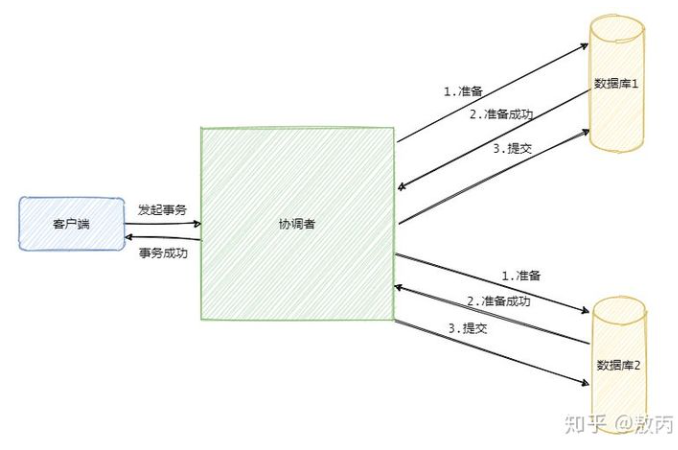

**布隆过滤器**

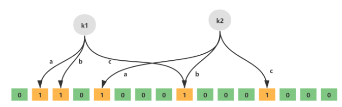

k1 k2代表元素，a b c代表hash函数，最下层则是二进制数组


# 复习

## Kafka

**Kafka如何保证高可用**

kafka由多个broker组成，每个 broker 是一个节点；你创建一个 topic，这个 topic 可以划分为多个 partition，每个 partition 可以存在于不同的 broker 上，每个 partition 就放一部分数据

为了保证高可用，Kafka提供了HA机制，就是副本机制。每个 partition 的数据都会同步到其它机器上，形成自己的多个 replica 副本。所有 replica 会选举一个 leader 出来，那么生产和消费都跟这个 leader 打交道，然后其他 replica 就是 follower。写的时候，leader 会负责把数据同步到所有 follower 上去，读的时候就直接读 leader 上的数据即可。只能读写 leader。Kafka 会均匀地将一个 partition 的所有 replica 分布在不同的机器上，这样才可以提高容错性

所谓可用性，因为如果某个 broker 宕机了，没事儿，那个 broker 上面的 partition 在其他机器上都有副本的。

**如何保证消息不被重复消费**

幂等性：一个数据或一个请求，给你重复来多次，你得确保对应的数据是不会改变的，不能出错

>  生产者生产消息幂等

生产者：各自分配一个producerID，然后确定分区，首先获取topic存在多少个partition，然后根据指定partition或key来确定发往那个分区，在发送的时候还会携带序列号Sequence Number

Kafka分区：接收到带有<PID，partiion，SeqNUmber>的消息，然后将其进行缓存下来，然后将消息持久化

这个时候，发送了网络故障，生产者没有收到来自kafka的ack，然后重试了上次的发送请求，而此时kafka对应的分区已经落盘了，那么首先kafka会在按照上次的PID、Partition、SeqNumber来发送，SeqNumber没有变，此时kafka分区收到后发现自己缓存中已经存在这个key了，于是就确认这个消息是发送过了，所以就会丢掉并且返回结果给生产者

> 消费者消费消息幂等

Kafka有个offset的概念，就是每个消息写进去，都有一个 offset，代表消息的序号。消费者消费了数据之后，会定期提交offset，表示消费了多少消息了。保证消费幂等性还需要和具体业务相结合

* 比如消费数据要写库，先根据主键查一下，如果这个数据有了就别插入，update一下好了
* 比如是写Redis，那么每次使用set，天然幂等性
* 如果以上两个场景都不是，则需要让生产者发送每条数据的时候，里面加一个全局唯一的id，类似订单id之类的东西，然后去redis中查一下，没有则处理，有则不处理
* 基于数据库的唯一键来保证重复数据不会插入多条。因为唯一键的约束，重复数据插入会报错

**消息的可靠传输**

> 消费者弄丢消息

消费者消费消息默认采用自动提交offset，如果在自动提交offset完，消息没被消费比如系统宕机了，就会造成消息丢失，那么为了解决这个问题，就采用手动提交的方式。

关闭自动提交offset，消息处理完后自己手动提交，就不会保证消息丢失了，与此同时会出现一个新问题，重复消费。于是mysql唯一键和redis的set命令就起到了作用

> 生产者弄丢数据

acks=all保证了消息一定不会丢，所有的副本都同步到了消息才会返回，如果没成功则生产者重试

> Kafka本身弄丢了数据

比较常见的场景，就是Kafka某个broker宕机，重新选举partition的leader，发现其他的follower刚好还有些数据没有通过，就造成了少了一下数据。为了解决就需要设置一些参数

* 给 topic 设置 `replication.factor` 参数：这个值必须大于 1，要求每个 partition 必须有至少 2 个副本
* 在 Kafka 服务端设置 `min.insync.replicas` 参数：这个值必须大于 1，这个是要求一个 leader 至少感知到有至少一个 follower 还跟自己保持联系，没掉队，这样才能确保 leader 挂了还有一个 follower 吧。
* 在 producer 端设置 `acks=all` ：这个是要求每条数据，必须是**写入所有 replica 之后，才能认为是写成功了**。
* 在 producer 端设置 `retries=MAX` （很大很大很大的一个值，无限次重试的意思）：这个是**要求一旦写入失败，就无限重试**，卡在这里了

**消息的顺序性**

- 一个 topic，一个 partition，一个 consumer，内部单线程消费，单线程吞吐量太低，一般不会用这个。
- 在消费者端创建多个内存队列，具有相同key的数据都到同一个内存队列中；然后对于N个线程，每个线程分别消费一个内存队列，这样就能保证顺序性

**消息积压**

大概率都是消费者出了问题。首先修复consumer问题，确保恢复消费速度，然后将consumer都停掉；新建一个topic，partition是原来的10倍，然后临时写一个分发数据的consumer程序，不做耗时处理，将积压的消息分发都新topic上，然后临时征用10倍的机器部署consumer，相当于使用10倍速度消费；结束后在恢复原先部署的架构

**如何设计一个消息队列**

* 这个 mq 得支持可伸缩性吧，就是需要的时候快速扩容。参照一下 kafka 的设计理念，broker -> topic -> partition，每个 partition 放一个机器，就存一部分数据。如果现在资源不够了，简单啊，给 topic 增加 partition，然后做数据迁移，增加机器，不就可以存放更多数据，提供更高的吞吐量了？
* mq数据的落盘操作，最好顺序写，就省去了随机写的寻址开销
* 采用多副本机制。多副本->leader & follower -> broker 挂了重新选举 leader 即可对外服务
* 能不能支持数据 0 丢失啊？可以的，参考我们之前说的那个 kafka 数据零丢失方案。

## Redis

### 缓存如何使用


