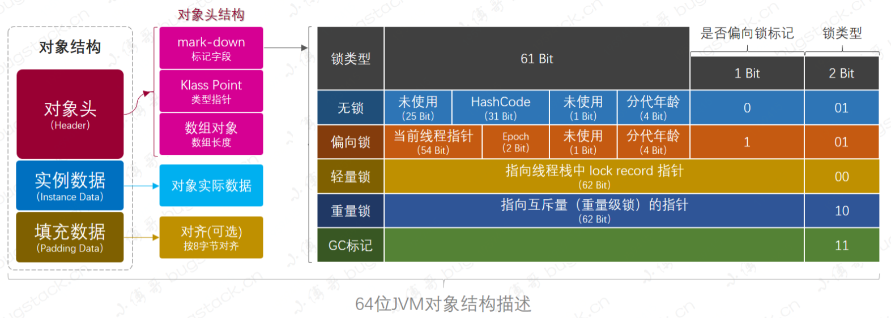
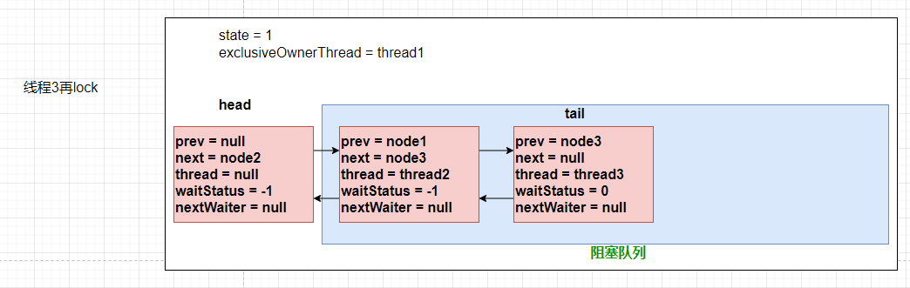

# 一、syncronized


## 1.对象结构



在HotSpot虚拟机中，对象在内存中储存布局分为三个区域：`对象头(Header)`、`实例数据(Instance Data)`和`对齐填充(Padding)`

* mark-word：标记字段，用于储存一些列的标记位，比如：哈希值、轻量级锁的标记位，偏向锁标记位、分代年龄等
* Klass Pointer：Class对象的类型指针
* 数组对象：只有当本对象是一个数组对象时才会用
* 对象实际数据：包括对象的所有成员变量，大小由各个成员变量决定，比如：byte占1个字节8比特位、int占4个字节32比特位
* 对齐：仅仅为了起到占位符的作用。由于HotSpot虚拟机的内存管理系统要求对象起始地址必须是8字节的整数倍

对象头：mark word标记字段、类型指针、数组对象(数组长度)。其中标记字段中包括了对象哈希码、分代年龄、（偏向锁ID、偏向时间戳、对象分代年龄）、指向线程中lock record的指针、指向重量级锁的指针

**markdown结构**


最右侧的 3 Bit（1 Bit标识偏向锁，2 Bit描述锁的类型）是跟锁类型和GC标记相关的，而 synchronized 的锁优化升级膨胀就是修改的这三位上的标识，来区分不同的锁类型。从而采取不同的策略来提升性能

**聊聊Monitor对象**

在HotSpot虚拟机中，monitor是由C++中ObjectMonitor实现

synchronized 的运行机制，就是当 JVM 监测到对象在不同的竞争状况时，会自动切换到适合的锁实现，这种切换就是锁的升级、降级

```c++
// initialize the monitor, exception the semaphore, all other fields
// are simple integers or pointers
ObjectMonitor() {
    _header       = NULL;
    _count        = 0;       // 记录个数
    _waiters      = 0,
    _recursions   = 0;       // 线程重入次数
    _object       = NULL;    // 存储 Monitor 对象
    _owner        = NULL;    // 持有当前线程的 owner
    _WaitSet      = NULL;    // 处于wait状态的线程，会被加入到 _WaitSet
    _WaitSetLock  = 0 ;
    _Responsible  = NULL ;
    _succ         = NULL ;
    _cxq          = NULL ;   // 单向列表
    FreeNext      = NULL ;
    _EntryList    = NULL ;   // 处于等待锁block状态的线程，会被加入到该列表
    _SpinFreq     = 0 ;
    _SpinClock    = 0 ;
    OwnerIsThread = 0 ;
    _previous_owner_tid = 0;
}
```

* ObjectMinitor主要成员：\_WaitSet、\_EntryList，用来保存ObjectWiter对象列表；_owner,执行持有ObjectMonitor对象的线程；
* 


每个 Java 对象头中都包括 Monitor 对象(存储了指向Monitor对象的指针)，synchronized 也就是通过这一种方式获取锁，也就解释了为什么 synchronized() 括号里放任何对象都能获得锁

monitor锁的标识：偏向标识为0，锁类型标识为01，则是无锁；偏向标识为1，锁类型为01，则为偏向锁；如果锁类型为00，则为轻量级锁；如果锁类型为10，则为重量级锁

**ObjectMonitor的一些细节**

首先我们需要记住的几个变量属性:\_WaitSet、\_EntryList、\_owner、\_recursions

* 当线程去访问同步代码时，首先会进入\_EntryList集合，当线程获取对象的monitor后，进入\_owner区域并将monitor的owner变量设置为当前线程，同时monitor中计数器count会+1
* 若线程调用了wait()方法，将释放当前持有的monitor，owner变量恢复为null，count变量自减1，同时该线程进入WaitSet集合中等待唤醒
* 若当前线程执行完毕，也会释放monitor并复位count值

**syncronized底层原理**

syncronized在JVM里的实现都是基于进入和退出Moniter对象来实现同步和代码块同步的

```bash
- 同步代码块实现原理
	是基于monitorenter和monitorexit指令来实现的。每个对象都有一次moniter内部锁，当执行monitorenter时，会尝试获取monitor的所有权，如果此时monitor进入数为0，则线程进入monitor后会_recursions会设置为1，然后_owner执行该线程，那么如果线程已经占有monitor后，重新进入，_recursions也会对应+1，也以为者可重入锁，当然加几次锁就要解几次锁，如果此时有其他线程要占用monitor，就会进入阻塞状态。最后调用monitorexit，退出monitor的使用权，此时其他线程会去尝试获取。
	syncronized语义底层是通过一个monitor的对象来完成，其实wait/notify也是依赖monitor对象
- 同步方法实现原理
	同步方法的实现，是给同步方法增加了ACC_SYNCRONIZED标识符，当方法调用时，调用指令回去检查方法的ACC_SYNCRONIZED标志是否被设置了，如果设置了，执行线程将先获取monitor，获取成功之后才能执行方法体，方法执行完后再释放monitor。在方法执行期间，其他任何线程都无法再获得同一个monitor对象。
	如果是实例方法，获取获取该对象的monitor，如果是类方法，会去获取class对象的monitor
```

## 2.聊聊锁升级和粗化

### 2.1 锁的升级

* 偏向锁：会通过比较thread id来判断是否可以直接获取
* 轻量级锁：当锁是偏向锁的时候，被另一个线程所访问，偏向锁就会升级为轻量级锁，其他线程会通过自旋的形式尝试获取锁，不会阻塞，提高性能
* 自旋锁：自旋锁是指尝试获取锁的线程不会立即阻塞，而是采用循环的方式去尝试获取锁，这样的好处是减少线程上下文切换的消耗，缺点是循环会消耗CPU(如果自旋次数超过了n次，就会升级为重量级锁)

==**流程**==


.png)

* 如果是偏向锁，只需要判断Thread ID是否一样，就可以执行同步代码块
* 如果是轻量级锁，则需要为当前线程分配锁记录，并拷贝对象头的mark word字段，并通过CAS将对象头的记录指向当前线程的锁记录上，成功则执行同步代码块   失败则自旋
* 如果自旋次数达到一定次数，就会转为重量级锁，并挂起当前线程
* 偏向锁 -> 轻量级锁 ：其他线程也是偏向锁，然而对象头的thread id不是当前线程，然后CAS替换对象头中偏向锁的thread id失败，就会暂停获得偏向锁的线程，然后先升级为轻量级锁，然后给线程的栈分配锁记录，拷贝mark word到所记录中，唤醒持有偏向锁的线程，再从安全点继续执行

**为什么要锁要分类**

其实还是为了应对不同的场景，提高效率而做出的分类

* 偏向锁：当一个线程重复的访问某段临界资源，如果频繁的上下文切换和CAS操作，其实没有必要。所以偏向锁诞生了
* 轻量级锁：当竞争存在时，没有获得锁的线程会自旋等待，此时如果获得锁的线程释放锁了，其他线程可以立刻获得锁然后执行。优点：在竞争锁时不会阻塞，提高了程序的响应速度，因为线程阻塞，但一直不能获取锁又会消耗CPU
* 重量级锁：竞争非常激烈，轻量级锁已经不能胜任工作了，只能将其他线程阻塞

### 2.2 锁的粗化

* 虽说同步的范围越少越好，并发效率越高，但有时会碰到代码中会反复多次获取锁和释放锁的情况，比如StringBuffer类，如果反复append就意味着反复加锁和解锁，这对性能来说非常不利。
* 解决办法：由于加锁解锁，又可能涉及到内核态和用户态之间的切换，所以JVM对于多次append操作时，会将其变成一个大的同步块，这样就可以减少加锁-->解锁的次数，有效地提升了代码执行的效率。

# 二、volatile

**老生常谈的特点**

* 可见性
* 不保证原子性
* 禁止指令重排

**浅谈原理**

1. 首先，volatile 关键字修饰的共享变量可以提供可见性规范，也叫做读写可见
2. 被 volatile 关键字修饰的共享变量在转换成汇编语言时，会加上一个以 lock 为前缀的指令，当CPU发现这个指令时，立即将当前内核高速缓存行的数据回写到内存，同时使在其他内核里缓存了该内存地址的数据无效。
3. 另外，在早期的 CPU 中，是通过在总线加 LOCK# 锁的方式实现的，但这种方式开销较大。所以后面诞生了缓存一致性协议
4. 另外，jdk中也提供了防止指令重排的方法，比如Unsafe中的loadFence()禁止读操作指令重排，storeFence禁止写操作指令重排，fullFence禁止读写操作指令重排

**聊聊volatile导致的伪共享问题**

我们都知道越靠近CPU的缓存速度越快，容量也越小，所以 L1 缓存容量最小但是速度最快；L3 缓存容量最大同时速度也最慢

* L1 和 L2 都是只能被一个单独的 CPU 核心使用

* L3 可以被单个插槽上的所有 CPU 核心共享

  

伪共享问题其实就是由于高速缓存的特性引起的，三级高速缓存中的数据并不是一个变量一个变量单独存放的，它的基本存储单元是 Cache Line，一般一个 Cache Line 的大小是 64 字节，也就是说，一个 Cache Line 中可以存下 8 个 8 字节的 long 类型变量。


所以，缓存从内存中一次读取的数据就是 64 字节，即 cpu 要读取一个 long 类型的数组，读取其中一个元素的同时也会把接下来的其他相邻地址的七个元素也加载到 Cache Line 中来

由于一个缓存行可以放8个long变量，定义了两个 long 类型的变量 a 和 b，他们在内存中的地址是紧挨着的，如果一个 CPU 核心的线程 T1 在对 a 进行修改，另一个 CPU 核心的线程 T2 却在对 b 进行读取，那么T1修改a的时候，除了把a加载到cache line中，还会把b也加载到cache line中，那么修改完a后，根据缓存一致性协议，那么其他包含a的缓存行就都会无效，这样当T2读取b的时候，他就会发现，b所处的缓存航是无效的，就需要花费很多时间去内存中重新加载。虽然b和a没有任何关系，却要因为a的更新导致它需要从内存中重新读取，拖慢速度。

> 解决办法：
>
> 1.被volatile修饰的变量和普通变量之间，增加元素间隔。即增加几个无用的变量，使其他变量不受影响。以空间换时间
>
> 2..JDK 1.8 提供了 @Contended 注解，就是把我们手动 padding 的操作封装到这个注解里面了，把这个注解加在字段 a 或者 b 的上面就可以了。需要注意的是，默认使用这个注解是无效的，需要在 JVM 启动参数加上 XX:-RestrictContended 才会生效


# 三、CAS

**计算机如何实现的(原理)**


# 四、线程池

## 4.1 视频源码教学

```java
	// 是一个原子类型的int数值，表达了两个意思  1：声明当前线程池的状态   2.声明线程池中的线程数
    // 高3位是：线程池状态   低29位是：线程池中的线程个数
    private final AtomicInteger ctl = new AtomicInteger(ctlOf(RUNNING, 0));
    private static final int COUNT_BITS = Integer.SIZE - 3;                     // 29位，方便后面做位运算
    private static final int CAPACITY   = (1 << COUNT_BITS) - 1;                // 通过位运算可以得出最大容量

    // 线程池状态 - 高3位
    // -1 -> 11111111 11111111 11111111 11111111 -> 左移29位 -> 11100000 00000000 00000000 00000000  => 所以高3位为111代表RUNNING
    private static final int RUNNING    = -1 << COUNT_BITS;
    private static final int SHUTDOWN   =  0 << COUNT_BITS;                     // 高3位为000 代表SHUTDOWN   代表此时不接受新任务，但是内部还会处理阻塞队列中的任务，以及正在执行的任务       shutdown()
    private static final int STOP       =  1 << COUNT_BITS;                     // 高3位为001 代表STOP   不接收新任务，而且不执行阻塞队列中的任务，同时会中断正在执行的任务                   shutdownNow()
    private static final int TIDYING    =  2 << COUNT_BITS;                     // 高3位为010 代表TIDYING 是一个过渡的状态，代表当前线程池即将game over       
    private static final int TERMINATED =  3 << COUNT_BITS;                     // 高位3位011 代表TERMINATED 此时线程池真正的结束了

    // 装箱和拆箱ctl
    // ~CAPACITY -> 11100000 00000000 00000000 00000000
    private static int runStateOf(int c)     { return c & ~CAPACITY; }          // 获得线程池的状态
    private static int workerCountOf(int c)  { return c & CAPACITY; }           // 获取当前线程池的线程数量(核心 + 非核心)
    private static int ctlOf(int rs, int wc) { return rs | wc; }
```

**线程池状态变化**


**线程池执行流程**


**execute方法源码**

```java
public void execute(Runnable command) {
    // 健壮性的判断
    if (command == null)
        throw new NullPointerException();
    // 获得32位的int
    int c = ctl.get();
    // 获得   工作线程数   < 核心线程数
    if (workerCountOf(c) < corePoolSize) {
        // 进到if，代表可以创建 核心 线程数
        if (addWorker(command, true))
            // 到这结束
            return;
        // 失败：是并发的原因。举例 0:1 此时线程a、b都进入addWorker，但只有一个线程可以创建核心线程成功，另一个就会失败，所以需要重新获取一下ctl
        // 如果if没进入，代表创建核心线程数失败，重新获取ctl 32位的int
        c = ctl.get();
    }
    // 判断线程池是不是running状态，将任务添加到阻塞队列中
    // 即如果线程池处于运行状态，且上面创建任务失败，则将其放入队列中
    if (isRunning(c) && workQueue.offer(command)) {
        // 再次获取ctl
        int recheck = ctl.get();
        // 再次判断一下是否是Running状态   如果不是RUNNING,移除任务
        if (! isRunning(recheck) && remove(command))
            // 拒绝策略
            reject(command);
        else if (workerCountOf(recheck) == 0)   // 如果线程池处于RUNNING状态，但是工作线程为0
            addWorker(null, false);  // 阻塞队列有任务，但是没有工作线程，添加一个任务为空的工作任务线程处理阻塞队列中的任务
    }
    // 队列满了 创建非核心线程，处理任务
    else if (!addWorker(command, false))
        // 如果创建失败 则执行拒绝策略
            reject(command);
}
```

**addWork源码**

```java
private boolean addWorker(Runnable firstTask, boolean core) {
    // retry是给for循环一个标记，作用是可以从内部for循环通过break retry跳出外部的for循环
    // 外侧for循环用于判断状态 内侧for循环用于线程数+1
    retry:
    // for循环实现功能： 经过大量的判断，真正将 线程数 + 1
    for (;;) {
        // 获取ctl 32位
        int c = ctl.get();
        // 获取线程池状态
        int rs = runStateOf(c);

        // Check if queue empty only if necessary.
        // 除了RUNNING都有可能  第一种创建任务失败的情况
        // 即STOP TIDYING TERMINATED状态一定失败 ,因为此时不需要添加线程处理任务
        // 如果是 SHUTDOWN 或 firstTask不为null 或工作队列为空则失败
        if (rs >= SHUTDOWN &&
            ! (rs == SHUTDOWN &&
               firstTask == null &&
               ! workQueue.isEmpty()))
            // !( rs == SHUTDOWN 且 传入任务为空 且 阻塞队列不为空 )
            // 说明构建工作线程失败
            return false;

        for (;;) {
            // 获取工作线程池个数
            int wc = workerCountOf(c);
            // 如果当前线程数已经大于等于线程池最大容量，不去创建
            // 判断wc是否超过核心线程数量或者最大线程
            if (wc >= CAPACITY ||
                wc >= (core ? corePoolSize : maximumPoolSize))
                // 创建失败
                return false;
            // 将工作线程数+1 采用CAS方式
            if (compareAndIncrementWorkerCount(c))
                // 成功就退出外侧for循环
                break retry;
            // 如果失败了 重新获取ctl 失败原因只有：有人和你并发操作了
            c = ctl.get();
            // 判断一下状态 如果有变化
            if (runStateOf(c) != rs)
                // 结束这次外侧for循环，开始下次外侧for循环
                continue retry;
            // 否则 CAS失败由于workCount改变了，重新内侧循环
            // 如果状态没变化，重新执行内侧循环即可
        }
    }

    // work开始 = false
    boolean workerStarted = false;
    // work添加 = false
    boolean workerAdded = false;
    // Work就是工作线程
    Worker w = null;
    try {
        // 创建Worker,传入任务
        w = new Worker(firstTask);
        // 从Wrok获取线程t
        final Thread t = w.thread;
        // 如果线程t 不为 null
        if (t != null) {
            // 开始加锁了 原因：获取线程池的全局锁，避免我添加任务时，其他线程干掉了线程池，因为干掉线程池需要先获取这个锁
            final ReentrantLock mainLock = this.mainLock;
            mainLock.lock();    // 加锁
            try {
                // Recheck while holding lock.
                // Back out on ThreadFactory failure or if
                // shut down before lock acquired.
                // 获取线程池状态 原因：加锁之前，ctl会被其他线程改变
                int rs = runStateOf(ctl.get());
                // RUNNING状态 或  为SHUTDOWN且firstTask为null
                if (rs < SHUTDOWN ||
                    (rs == SHUTDOWN && firstTask == null)) {
                    // 线程是否为运行状态
                    if (t.isAlive()) // precheck that t is startable
                        throw new IllegalThreadStateException();
                    // 将工作线程添加到集合 workers是一个HashSet
                    workers.add(w);
                    // 获取工作线程个数
                    int s = workers.size();
                    // 如果线程工作线程数，大于之前记录的最大工作线程数，就替换一下
                    if (s > largestPoolSize)
                        largestPoolSize = s;
                    // 添加工作线程为空
                    workerAdded = true;
                }
            } finally {
                // 添加工作成功，解锁
                mainLock.unlock();
            }
            // 如果添加成功
            if (workerAdded) {
                // 启动线程
                t.start();
                // 启动线程成功
                workerStarted = true;
            }
        }
    } finally {
        // 如果启动工作线程失败，调用下面的方法
        if (! workerStarted)
            addWorkerFailed(w);
    }
    // 返回工作是否启动
    return workerStarted;
}
```

**封装Worker**

```java
 private final class Worker extends AbstractQueuedSynchronizer implements Runnable
 {
     /**
       * This class will never be serialized, but we provide a
       * serialVersionUID to suppress a javac warning.
       */
     private static final long serialVersionUID = 6138294804551838833L;

     /** Thread this worker is running in.  Null if factory fails. */
     final Thread thread;
     /** Initial task to run.  Possibly null. */
     Runnable firstTask;
     /** Per-thread task counter */
     volatile long completedTasks;

     /**
         * Creates with given first task and thread from ThreadFactory.
         * @param firstTask the first task (null if none)
         */
     Worker(Runnable firstTask) {
         setState(-1); // inhibit interrupts until runWorker
         this.firstTask = firstTask;
         //
         this.thread = getThreadFactory().newThread(this);
     }
}
```

**runWork方法**

```java
final void runWorker(Worker w) {
    // 获取当前线程
    Thread wt = Thread.currentThread();
    // 拿到了任务
    Runnable task = w.firstTask;
    w.firstTask = null;
    // 这个是AQS的东西 其实就是AQS的release 先不关注
    w.unlock(); // allow interrupts
    // 标识为true
    boolean completedAbruptly = true;
    try {
        // 如果任务不为空，执行任务  如果任务为空，通过getTask从阻塞队列中获取任务
        // 就是在getTask地方复用的
        // 如果是非核心线程阻塞者获取，如果超过了最大时间则会销毁，如果是核心线程则阻塞着直到获得任务
        while (task != null || (task = getTask()) != null) {
            // 上锁 避免你shutdown我任务也不会中断
            w.lock();
            // If pool is stopping, ensure thread is interrupted;
            // if not, ensure thread is not interrupted.  This
            // requires a recheck in second case to deal with
            // shutdownNow race while clearing interrupt
            // 获取当前状态，判断当前状态是否>=STOP(即STOP TIDYING TERMINATED) 悲剧！
            if ((runStateAtLeast(ctl.get(), STOP) ||
                 (Thread.interrupted() &&
                  runStateAtLeast(ctl.get(), STOP))) &&
                !wt.isInterrupted())
                wt.interrupt();
            try {
                // 执行任务前的操作
                beforeExecute(wt, task);
                Throwable thrown = null;
                try {
                    // 开始执行任务
                    task.run();
                } catch (RuntimeException x) {
                    thrown = x; throw x;
                } catch (Error x) {
                    thrown = x; throw x;
                } catch (Throwable x) {
                    thrown = x; throw new Error(x);
                } finally {
                    // 执行任务后的操作
                    afterExecute(task, thrown);
                }
            } finally {
                task = null;
                w.completedTasks++;
                w.unlock();
            }
        }
        completedAbruptly = false;
    } finally {
        processWorkerExit(w, completedAbruptly);
    }
}
```

## 4.2 源码学习

**结构**


**Executor接口**

```java
public interface Executor {
    void execute(Runnable command);
}
```

**ExecutorService**

```java
public interface ExecutorService extends Executor {
    // 关闭线程池，已提交的任务继续执行，不接受继续提交新任务
    void shutdown();
    
    // 关闭线程池，尝试停止正在执行的所有任务，不接受继续提交新任务
    List<Runnable> shutdownNow();
    
    // 线程池是否已关闭
    boolean isShutdown();
    
    // 等待所有任务完成，并设置超时时间
    // 实际应用中是，先调用 shutdown 或 shutdownNow，然后再调这个方法等待所有的线程真正地完成，返回值意味着有没有超时
    boolean awaitTermination(long timeout, TimeUnit unit)throws InterruptedException;
    // 提交一个 Callable 任务
    <T> Future<T> submit(Callable<T> task);
    
    // 提交一个 Runnable 任务，第二个参数将会放到 Future 中，作为返回值
    // 因为 Runnable 的 run 方法本身并不返回任何东西
    <T> Future<T> submit(Runnable task, T result);
    
    // 提交一个 Runnable 任务
    Future<?> submit(Runnable task);
    
    // 执行所有任务，返回 Future 类型的一个 list
    <T> List<Future<T>> invokeAll(Collection<? extends Callable<T>> tasks throws InterruptedException;
	
    // 也是执行所有任务，但是这里设置了超时时间
    <T> List<Future<T>> invokeAll(Collection<? extends Callable<T>> tasks,long timeout, TimeUnit unit) throws InterruptedException;
           
    // 只有其中的一个任务结束了，就可以返回，返回执行完的那个任务的结果
    <T> T invokeAny(Collection<? extends Callable<T>> tasks)
    // 不过这个带超时，超过指定的时间                        
    <T> T invokeAny(Collection<? extends Callable<T>> tasks, long timeout, TimeUnit unit)                                         
}
```

**FutureTask**

```bash
Future      Runnable
   \           /
    \         /
   RunnableFuture
          |
          |
      FutureTask

Runnable 的 void run() 方法是没有返回值的，所以，通常，如果我们需要的话，会在 submit 中指定第二个参数作为返回值
<T> Future<T> submit(Runnable task, T result);
其实到时候会通过这两个参数，将其包装成 Callable。
```

**ThreadPoolExecutor**

```java
// 构造函数
public ThreadPoolExecutor(int corePoolSize,
                          int maximumPoolSize,
                          long keepAliveTime,
                          TimeUnit unit,
                          BlockingQueue<Runnable> workQueue,
                          ThreadFactory threadFactory,
                          RejectedExecutionHandler handler) {
    if (corePoolSize < 0 ||
        maximumPoolSize <= 0 ||
        maximumPoolSize < corePoolSize ||
        keepAliveTime < 0)
        throw new IllegalArgumentException();
    // 这几个参数都是必须要有的
    if (workQueue == null || threadFactory == null || handler == null)
        throw new NullPointerException();
    this.acc = System.getSecurityManager() == null ?
        null :
    AccessController.getContext();
    this.corePoolSize = corePoolSize;
    this.maximumPoolSize = maximumPoolSize;
    this.workQueue = workQueue;
    this.keepAliveTime = unit.toNanos(keepAliveTime);
    this.threadFactory = threadFactory;
    this.handler = handler;
}
/*
- cooPoolSize 		: 核心线程数
- maximumPoolSize   : 最大线程数，线程池允许创建的最大线程数。
- workQueue			: 任务队列，BlockingQueue 接口的某个实现
- keepAliveTime		: 空闲线程的保活时间，如果某线程的空闲时间超过这个值都没有任务给它做，那么可以被关闭了。
- threadFactory		: 用于生成线程，一般我们可以用默认的就可以了。
- handler			: 拒绝策略
*/    
```

还有一些线程池的属性

```java
	// 是一个原子类型的int数值，表达了两个意思  1：声明当前线程池的状态   2.声明线程池中的线程数
    // 高3位是：线程池状态   低29位是：线程池中的线程个数
    private final AtomicInteger ctl = new AtomicInteger(ctlOf(RUNNING, 0));
    private static final int COUNT_BITS = Integer.SIZE - 3;                     // 29位，方便后面做位运算
    private static final int CAPACITY   = (1 << COUNT_BITS) - 1;                // 通过位运算可以得出最大容量

    // 线程池状态 - 高3位
    // -1 -> 11111111 11111111 11111111 11111111 -> 左移29位 -> 11100000 00000000 00000000 00000000  => 所以高3位为111代表RUNNING
    private static final int RUNNING    = -1 << COUNT_BITS;
    private static final int SHUTDOWN   =  0 << COUNT_BITS;                     // 高3位为000 代表SHUTDOWN   代表此时不接受新任务，但是内部还会处理阻塞队列中的任务，以及正在执行的任务       shutdown()
    private static final int STOP       =  1 << COUNT_BITS;                     // 高3位为001 代表STOP   不接收新任务，而且不执行阻塞队列中的任务，同时会中断正在执行的任务                   shutdownNow()
    private static final int TIDYING    =  2 << COUNT_BITS;                     // 高3位为010 代表TIDYING 是一个过渡的状态，代表当前线程池即将game over       
    private static final int TERMINATED =  3 << COUNT_BITS;                     // 高位3位011 代表TERMINATED 此时线程池真正的结束了

    // 装箱和拆箱ctl
    // ~CAPACITY -> 11100000 00000000 00000000 00000000
    private static int runStateOf(int c)     { return c & ~CAPACITY; }          // 获得线程池的状态
    private static int workerCountOf(int c)  { return c & CAPACITY; }           // 获取当前线程池的线程数量(核心 + 非核心)
    private static int ctlOf(int rs, int wc) { return rs | wc; }
```

很重要的内部了Worker，会将线程包装成一个个Worker(工人)

```java
private final class Worker extends AbstractQueuedSynchronizer implements Runnable{
    // 这个是真正的线程，任务靠你啦
    final Thread thread;
    
    // 这里的 Runnable 是任务。
    // 由于创建线程时，如果执行了任务，就会第一个执行
    // 如果为null，那么线程起来后，就会自己去任务队列中取任务
    Runnable firstTask;
    
    // 用于存放此线程完成的任务数，注意了，这里用了 volatile，保证可见性
    volatile long completedTasks;
    
    // Worker 只有这一个构造方法，传入 firstTask，也可以传 null
     Worker(Runnable firstTask) {
         setState(-1); // inhibit interrupts until runWorker
         this.firstTask = firstTask;
         // 调用 ThreadFactory 来创建一个新的线程
         this.thread = getThreadFactory().newThread(this);
     }
    
    // 这里调用了外部类的 runWorker 方法
    public void run() {
        runWorker(this);
    }
}
```

开始关注源码

```java
//=================================================================execute
public void execute(Runnable command) {
    // 健壮性的判断
    if (command == null)
        throw new NullPointerException();
    // 获得32位的int
    int c = ctl.get();
    // 获得   工作线程数   < 核心线程数
    if (workerCountOf(c) < corePoolSize) {
        // 进到if，代表可以创建 核心 线程数
        if (addWorker(command, true))
            // 到这结束
            return;
        // 失败：是并发的原因。举例 0:1 此时线程a、b都进入addWorker，但只有一个线程可以创建核心线程成功，另一个就会失败，所以需要重新获取一下ctl
        // 如果if没进入，代表创建核心线程数失败，重新获取ctl 32位的int
        c = ctl.get();
    }
    // 判断线程池是不是running状态，将任务添加到阻塞队列中
    // 即如果线程池处于运行状态，且上面创建任务失败，则将其放入队列中
    if (isRunning(c) && workQueue.offer(command)) {
        // 再次获取ctl
        int recheck = ctl.get();
        // 再次判断一下是否是Running状态   如果不是RUNNING,移除任务
        if (! isRunning(recheck) && remove(command))
            // 拒绝策略
            reject(command);
        else if (workerCountOf(recheck) == 0)   // 如果线程池处于RUNNING状态，但是工作线程为0
            addWorker(null, false);  // 阻塞队列有任务，但是没有工作线程，添加一个任务为空的线程处理任务
    }
    // 队列满了 创建非核心线程，处理任务
    else if (!addWorker(command, false))
        // 如果创建失败 则执行拒绝策略
        reject(command);
}
//=================================================================addWorker
private boolean addWorker(Runnable firstTask, boolean core) {
    // 将工作线程数 + 1
    ...    
        
    // worker 是否已经启动
    boolean workerStarted = false;
    // 是否已将这个 worker 添加到 workers 这个 HashSet 中
    boolean workerAdded = false;
    // Work就是工作线程
    Worker w = null;
    try {
        // 创建Worker,传入任务firstTask
        w = new Worker(firstTask);
        // 取 worker 中的线程对象，之前说了，Worker的构造方法会调用 ThreadFactory 来创建一个新的线程
        final Thread t = w.thread;
        // 如果线程t 不为 null
        if (t != null) {
            // 开始加锁了 原因：获取线程池的全局锁，避免我添加任务时，其他线程干掉了线程池，因为干掉线程池需要先获取这个锁
            final ReentrantLock mainLock = this.mainLock;
            mainLock.lock();    // 加锁
            try {
                // Recheck while holding lock.
                // Back out on ThreadFactory failure or if
                // shut down before lock acquired.
                // 获取线程池状态 原因：加锁之前，ctl会被其他线程改变
                int rs = runStateOf(ctl.get());
                // 小于 SHUTDOWN 那就是 RUNNING，这个自不必说，是最正常的情况
                // 如果等于 SHUTDOWN，前面说了，不接受新的任务，但是会继续执行等待队列中的任务
                if (rs < SHUTDOWN ||
                    (rs == SHUTDOWN && firstTask == null)) {
                    // 此时线程可不能是已经启动的
                    if (t.isAlive()) // precheck that t is startable
                        throw new IllegalThreadStateException();
                    // 将工作线程添加到集合 workers是一个HashSet
                    workers.add(w);
                    // 获取工作线程个数
                    int s = workers.size();
                    // largestPoolSize 用于记录 workers 中的个数的最大值
                    // 因为 workers 是不断增加减少的，通过这个值可以知道线程池的大小曾经达到的最大值
                    if (s > largestPoolSize)
                        largestPoolSize = s;
                    // 添加成功 标志赋为true
                    workerAdded = true;
                }
            } finally {
                // 添加工作成功，解锁
                mainLock.unlock();
            }
            // 如果添加成功
            if (workerAdded) {
                // 启动线程
                t.start();
                // 启动线程成功
                workerStarted = true;
            }
        }
    } finally {
        // 如果启动工作线程失败，调用下面的方法
        if (! workerStarted)
            addWorkerFailed(w);
    }
    // 返回工作是否启动
    return workerStarted;    
}
//=================================================================runWorker
final void runWorker(Worker w) {
    // 获取当前线程
    Thread wt = Thread.currentThread();
    // 拿到了任务
    Runnable task = w.firstTask;
    w.firstTask = null;
    // 这个是AQS的东西 其实就是AQS的release 先不关注
    w.unlock(); // allow interrupts
    // 标识为true
    boolean completedAbruptly = true;
    try {
        // 如果任务不为空，执行任务  如果任务为空，通过getTask从阻塞队列中获取任务
        // 就是在getTask地方复用的  会不停从阻塞队列中拿新的任务
        // 如果是非核心线程阻塞者获取，如果超过了最大时间则会销毁，如果是核心线程则阻塞着直到获得任务
        while (task != null || (task = getTask()) != null) {
            // 上锁 避免你shutdown我任务也不会中断
            w.lock();
           
            // 获取当前状态，判断当前状态是否>=STOP(即STOP TIDYING TERMINATED) 悲剧！
            if ((runStateAtLeast(ctl.get(), STOP) ||
                 (Thread.interrupted() &&
                  runStateAtLeast(ctl.get(), STOP))) &&
                !wt.isInterrupted())
                wt.interrupt();
            try {
                // 这是一个钩子方法，留给需要的子类实现
                beforeExecute(wt, task);
                Throwable thrown = null;
                try {
                    // 开始执行任务
                    task.run();
                } catch (RuntimeException x) {
                    thrown = x; throw x;
                } catch (Error x) {
                    thrown = x; throw x;
                } catch (Throwable x) {
                    thrown = x; throw new Error(x);
                } finally {
                    // 也是一个钩子方法，将 task 和异常作为参数，留给需要的子类实现
                    afterExecute(task, thrown);
                }
            } finally {
                // 置空 task，准备 getTask 获取下一个任务
                task = null;
                // 累加完成的任务数
                w.completedTasks++;
                // 释放掉 worker 的独占锁
                w.unlock();
            }
        }
        completedAbruptly = false;
    } finally {
        // 需要执行线程关闭：
        // 1. 说明 getTask 返回 null，也就是说，队列中已经没有任务需要执行了，执行关闭
        // 2. 任务执行过程中发生了异常
        processWorkerExit(w, completedAbruptly);
    }
}
```

**问题**

```bash
- 任务执行过程中发生异常怎么处理
	如果某个任务执行出现异常，那么执行任务的线程会被关闭，而不是继续接收其他任务。然后会启动一个新的线程来代替它。

- 线程池如何实现线程复用的
	1.线程会被保证成一个Worker对象，而线程由线程工厂创建
	2.我们都知道线程创建后会执行对应的run方法，那线程池的线程执行也是这个流程。不过在执行run方法时，并不是执行我们传入的Runnable对应的run方法，而是对应一个while循环，通过getTask方法，不停地从阻塞队列中取Runnable，然后想调用普通方法一样，执行其run方法。执行完毕后，仍然从阻塞对应中取
	3.如果是核心线程是没关系的。如果是非核心线程在取任务的过程中可能超时，超时了就会将这个线程销毁掉
	
- 线程池的原理你懂吗
	1.线程池中有一个ctl的变量，高3位代表线程池状态，第29位为代表线程池中线程个数。
	2.线程池状态：RUNABLE: 111 SHUTDOWN: 000 STOP: 001 TIDING: 010 TERMINATED: 011
	3.我们从excute方法说起
		3.1 当利用excute方法提交一个Runnable任务时，首先判断工作线程数是否大于核心线程数，如果不大于，则利用addWorker()方法，创建核心线程去执行对应的任务，然后结束。 此时阻塞队列为空
		3.2 当线程数>=核心线程数，如果此时线程池处于RUNNABLE状态，且阻塞队列没满，就会将任务存入阻塞队列中，如果此时发现工作线程数为0，就也会创建非核心线程
		3.3 队列也满了，就会创建非核心线程处理任务，如果达到了最大线程数就会执行对应拒绝策略
	4.其中addWorker()添加worker工作线程比较关键，线程池是利用一个HashSet的集合来储存worker的。所以这一步要做的就是将线程数+1，并创建Worker，并启动线程。
    5.当线程启动后，就会去执行对应的run方法。另外线程是通过线程工厂来创建的。线程执行run方法，就会执行对应worker的run方法。即runWorker
    6.runWorker方法中是一个while循环，会通过getTask()不断从阻塞队列中取任务。也就实现了一个线程，不停执行不同的Runnable
```

# 五、AQS

**AQS结构**

有很重要的两个内部类**Node**和**ConditionObject**

有四个很重要的属性：**Node head；Node tail； int state；Thread exclusiveOwnerThread**

```java
public abstract class AbstractQueuedSynchronizer
    extends AbstractOwnableSynchronizer
    implements java.io.Serializable {
    
    protected AbstractQueuedSynchronizer() { }
    // 等待队列的头部
    private transient volatile Node head;
    // 等待队列的尾部
    private transient volatile Node tail;
    // 同步状态 0代表没有被占用 >=1表示被占用
    private volatile int state;
    
    // ===============很重要的一个内部类Node  是一个双向链表
    static final class Node {
        // SHARED是一个空Node
        static final Node SHARED = new Node();
        // 独占节点默认为null
        static final Node EXCLUSIVE = null;
        
        // ==============以下几个都是waitStatus需要用的
        // 代表线程取消争抢这个锁
        static final int CANCELLED =  1;
        // waitStatus值，表示后继线程需要被唤醒
        static final int SIGNAL    = -1;
        // 表示线程正在等待条件 表示在条件队列中
        static final int CONDITION = -2;
        // 表示下一个被请求的对象应该无条件地传播
        static final int PROPAGATE = -3;
        
        // 取上面的1 -1 -2 -3 和 默认值0
        volatile int waitStatus;
        
        // 前驱节点的引用
        volatile Node prev;
        
        // 后继节点的引用
        volatile Node next;
        
        // 这个就是线程本尊
        volatile Thread thread;
        // 链接下一个在条件队列中的Node或者为特殊值SHARED
        // 用于实现条件队列的单向队列
        Node nextWaiter;
    }
    
    // ===============很重要的一个内部类ConditioObject 是一个单向链表
    public class ConditionObject implements Condition{
        // 链表头结点
        private transient Node firstWaiter;
        // 链表尾节点
        private transient Node lastWaiter;
        
        public ConditionObject() { }
        // 将当前线程添加到条件队列中
        private Node addConditionWaiter() { ...}
        
        public final void signal() {...}
        
        public final void signalAll() {...}
        
        public final void await() throws InterruptedException {...}
        
    }
    
}
```

**AQS父类AbstractOwnableSynchronizer结构**

```java
public abstract class AbstractOwnableSynchronizer
    implements java.io.Serializable {
    
    protected AbstractOwnableSynchronizer() { }
    // 代表当前持有独占锁的线程
    private transient Thread exclusiveOwnerThread;
    // set方法
    protected final void setExclusiveOwnerThread(Thread thread) {
        exclusiveOwnerThread = thread;
    }
    // get方法
    protected final Thread getExclusiveOwnerThread() {
        return exclusiveOwnerThread;
    }
}
```

## 5.1 ReentrantLock

**ReentrantLock结构**

很重要的一个内部类**Sync**(继承了AQS) 和 **NonfairSync** 和 **FairSync**

很重要的一个属性**Sync sync**

```java
public class ReentrantLock implements Lock, java.io.Serializable {
    // 提供所有执行机制的同步器
    private final Sync sync;
    // 内部类 - 同步器  继承AQS
    abstract static class Sync extends AbstractQueuedSynchronizer {
        // 子类实现 加锁
        abstract void lock();
        // 非公平尝试获取
        final boolean nonfairTryAcquire(int acquires) {
            ...
        }
        // 尝试释放锁
        protected final boolean tryRelease(int releases) {
            ...
        }
        // 是否原先本线程就获取了独占锁
        protected final boolean isHeldExclusively() {
            return getExclusiveOwnerThread() == Thread.currentThread();
        }
        // 实例化监视器
        final ConditionObject newCondition() {
            // 实例化一个 ConditionObject
            return new ConditionObject();
        }
        // 获得锁的拥有线程
        final Thread getOwner() {
            return getState() == 0 ? null : getExclusiveOwnerThread();
        }
        // 获取占有锁的次数
        final int getHoldCount() {
            return isHeldExclusively() ? getState() : 0;
        }
        // 是否加锁了
        final boolean isLocked() {
            return getState() != 0;
        }
    }
    
    // =======================公平锁
    // 用于公平锁的同步对象
    static final class FairSync extends Sync {
        // 加锁
        final void lock() {
            acquire(1);
        }
        // 尝试获取
        protected final boolean tryAcquire(int acquires) {
            ...
        }
    }
    // 非公平锁也是lock和tryAcquire
    static final class NonfairSync extends Sync {
        private static final long serialVersionUID = 7316153563782823691L;

        final void lock() {
            if (compareAndSetState(0, 1))
                setExclusiveOwnerThread(Thread.currentThread());
            else
                acquire(1);
        }

        protected final boolean tryAcquire(int acquires) {
            return nonfairTryAcquire(acquires);
        }
    }
}
```

**lock和unlock**

```bash
- 基本单位
	private final Sync sync;	// 是实现AQS的同步器，后续的加锁和解锁也都是和sync有关

- ReentrantLock锁住的是什么
	由于ReentrantLock是代码锁，而且是有AQS抽象队列同步器实现的锁，所以锁住的其实是exclusiveOwnerThread这个属性。对应的state值不为0，也是锁住的属性。

- 公平锁和非公平锁和lock区别
	1.非公平锁在调用lock时，首先就会调用CAS进行一次抢锁，如果这个时候恰巧锁没有被占用，那么直接就获取到锁(将exclusiveOwnerThread 置为 当前线程)返回。但是公平锁开始并不会直接CAS
	2.如果非公平锁CAS失败，那么就会和公平锁一样进入到tryRelease方法中，尝试获取锁。非公平锁如果发现锁被释放了，即state = 0，就会直接CAS抢锁，但是公平锁会判断等待队列中是否有其他的线程处于等待状态，如果有则不去抢锁，所以会进行判断。

- lock和unlock简单介绍
	lock: 将state + 1 ，并设置exclusiveOwnerThread；如果获取锁失败，则加入到等待队列中，然后阻塞等待
	unlock: sate - 1，锁释放了则唤醒后续节点

- 公平锁lock流程
	if (!tryAcquire(arg) &&acquireQueued(addWaiter(Node.EXCLUSIVE), arg))
            selfInterrupt();
   - tryAcquire() 公平锁中的实现
   		1.获取同步器的state，如果state = 0 表示没有被占用，那么表示锁可用。由于是公平锁，所以还需要判断等待队列是否为空或者不为空时等待队列中自己的前面是否有其他在等待的线程，如果有就不取获取
   		2.判断exclusiveOwnerThread对应的线程是否为自己，如果为自己即重入锁，如果不是则表示获取锁失败
   - addWaiter : 即获取锁失败时会执行
   1.获取锁失败，所以后续要加入到等待队列中
   2.首先，会将当前线程包装为Node，然后利用CAS的方式将node插入到双向链表的等待队列的尾部。如果是等待队列此时为空，就会创建head = new Node()空节点，然后在尾部插入node节点
   总结：如果等待队列为空，则会创建一个空的head头节点，然后node插入链表尾部；如果队列不为空，则直接插入到尾部
   解释为什么要创建一个空的head节点：我们会发现，当线程获得锁时，只成功设置exclusiveOwnerThread时和修改了state，执行addWaiter是没有获取锁的线程，如果队列是空的，很有可能此时获得锁的线程并没有执行完，所以空节点来占一个位置，代表获得锁的线程，后续也会对这种情况进行特殊处理
   - acquireQueued(node, arg) : 会出现阻塞和唤醒
   1.首先会存在一种是可以拿锁的。如果node节点的前一个节点是head，那么它就会去尝试获取锁(因为之前创建的空节点代表获得锁的线程，但那个线程可能此时已经释放了，所以作为等待队列的第一个会去尝试获取一下锁)，如果获取成功就会直接返回；
   2.接下来正常流程，没拿到锁。会将node节点的前一个节点的waitStatus置为-1，表明node节点是需要被唤醒的，再然后就会进入利用LockSupport.park(this)进入阻塞。
   3.等待unlock释放锁，或者线程被中断了，就会从阻塞中被唤醒，然后重新自旋(1.尝试获取锁 2.成功返回 3.失败阻塞)

- 非公平锁 lock流程
	1.首先会CAS更新state + 1，如果成功，就直接设置exclusiveOwnerThread
	2.tryAcquire():当然也是判断state = 0 和 exclusiveOwnerThread的判断。但是非公平锁在得到state = 0时，会直接本线程去抢锁，不会等自己前面的节点都获取完锁自己才获取
	3.然后addWaiter一样
	4.acquireQueue一样
	
- unlock流程(公平和非公平一样的)
	1.tryRelease(arg): 将state - 1，如果state = 0，则表示锁被释放了
	2.那么如果此时等待队列不为空，就会去判断每个节点的waitStatus是否为-1，如果不为-1，就会去唤醒后面那个节点的线程
	
- 总结
	公平锁上锁：并发情况下，在加入到等待队列中的顺序就是获得锁的顺序；及时加入等待队列中发现锁没人用，也不能立即获取，需要判断前面的节点是否有需要唤醒的
	非公平锁：在加入到等待队列时，即使等待队列中有等待的线程，如果此时锁没人用，就会直接获取；
	解锁：公平锁和非公平锁释放锁的方式一样。都是将head的waitStatus置为0，然后唤醒等待队列中的第一个节点对应的线程。
```

**增加tryAcquire addWaiter acquireQueue**


线程1调用lock，在没有调unlock之前，线程2也调用lock





## 5.2 AQS的condition

```java
// ReentrantLock的newCondition
public Condition newCondition() {
    return sync.newCondition();
}
// sync的new Condition
final ConditionObject newCondition() {
    return new ConditionObject();
}

// ConditionObject结构
public class ConditionObject implements Condition, java.io.Serializable {
	
    private transient Node firstWaiter;
    
    private transient Node lastWaiter;
    
    public ConditionObject() { }
    
    ...
}
```

condition调用流程


* newCondition会创建ConditionObject。其内部是一个单向链表(firstWaiter、lastWaiter)
* 当有线程调用condition.await()，第一步：则会将当前线程创建为Node (waitStatus=-2)，然后添加到condition内部的链表中 第二步：会释放自己所持有的锁(state/exclusiveOwnerThread)  第三部：阻塞自己线程，等待唤醒
* 当有线程调用condition.siginal()时，第一步先获取condition内部链表的第一个Node 第二步：改变waiState = 0，然后插入到阻塞队列的尾部，并将前一个节点waitStatus = -1
* 这样在之前的节点调用unlock时就会唤醒自己节点

```bash
- signal和signalAll的区别
	signal是只将条件队列中的第一个节点插入到阻塞队列中尾部。而signalAll是将条件队列中所有Node节点都插入到阻塞队列尾部
```

# 六、集合

## 6.1 ConcurrentHashMap

**构造函数**

```java
// 这构造函数里，什么都不干
public ConcurrentHashMap() {
}

// 传入初始容量的map
// 初始容量 = (1.5 * initialCapacity + 1) 然后向上取整为2的n次方
public ConcurrentHashMap(int initialCapacity) {
    if (initialCapacity < 0)
        throw new IllegalArgumentException();
    int cap = ((initialCapacity >= (MAXIMUM_CAPACITY >>> 1)) ?
               MAXIMUM_CAPACITY :
               tableSizeFor(initialCapacity + (initialCapacity >>> 1) + 1));
    this.sizeCtl = cap;
}
```

# 七、ThreadLocal

## 7.1 概念

**使用简单案例**

```java
public class Test{
    static ThreadLocal<String> local = new ThreadLocal<>();
    public static void main(String[] args) {
        local.set("123");
        String s = local.get();
    }
}
```


**特性 / 特点**

* 通过new ThreadLocal()创建的ThreadLocal存在唯一的新hash值，且不会改变
* 一个ThreadLocal可以存入到不同线程的ThreadLocalMap中，所以线程安全的
* get/set除了完成对应操作外，如果发现有垃圾回收，则还会执行清除过期节点的行为
* 扩容为原来的2倍
* ThreadLocal 不是用来解决线程安全问题的，多线程不共享，不存在竞争！其目的是使线程能够使用本地变量
* ThreadLocal 使用完一般手动remove掉，不要让get/set被动处理
* 利用开放地址法来避免哈希碰撞，并且利用斐波那契散列来作为新hash值
* ThreadLocalMap的key是弱引用，会存在内存泄漏，但是get/set方法又会自己发现并处理，但一般最好自己手动处理掉。原因：get/set清除过期key是没有目标性的，所以会在一个范围内进行搜索，但是自己手动移除效率更高

接下来我们来看源码

```java
public class ThreadLocal<T> {
    // 根据斐波那契散列获得新 hash 值
    // 一个 ThreadLocal 实例只有一个 hash 属性，且不会更改
    private final int threadLocalHashCode = nextHashCode();
    // 从0开始的原子类，用于充当斐波那契散列的i 
    // i++ --> hashCode = i * HASH_INCREMENT + HASH_INCREMENT
    private static AtomicInteger nextHashCode = new AtomicInteger();
    // 黄金比例系数
    private static final int HASH_INCREMENT = 0x61c88647;
    
    /**
     * 返回下一个新hash值
     * 即hash = nextHashCode + HASH_INCREMENT
     */
    private static int nextHashCode() {
        return nextHashCode.getAndAdd(HASH_INCREMENT);
    }
    
    /**
     * 初始化 value 值，初始化为 null
     */
    protected T initialValue() {
        return null;
    }
    
    // 无参构造函数，唯一构造
    public ThreadLocal() {
    }
    
    // 其他的方法
    
    // 内部类 ThreadLocalMap ，很关键的内部类
    static class ThreadLocalMap {
        
        /**
         * 基本单位：Entry   其父类WeakReference 有一个 referent 属性，就是 key 
         * 注意：key 是弱引用，所以只能存在与下一次垃圾回收之前
         * referent：ThreadLocal  value: 传入的值 
         */
        static class Entry extends WeakReference<ThreadLocal<?>> {
            // 与 ThreadLocal 相关联
            Object value;

            Entry(ThreadLocal<?> k, Object v) {
                super(k);
                value = v;
            }
        }
        // 数组初始容量
        private static final int INITIAL_CAPACITY = 16;
        // Entry 数组
        private Entry[] table;
		// Entry 的个数，计数        
        private int size = 0;
        // 阈值，超过阈值会扩容 负载因子：2/3
        private int threshold;
        
        // 其他重要方法
    }
}
```

## 7.2 get源码

以上就是ThreadLocal最基本的属性和方法，接下来我们再来看最终要的两个方法**get**和**set**，先看一下get吧

```java
public T get() {																		// 解释
    // 1. 获取当前运行的线程
    Thread t = Thread.currentThread();
    // 2. 获取当前线程的 ThreadLocalMap            											
    ThreadLocalMap map = getMap(t);														// √
    // 3. 如果 map 不为 null，说明该线程存在 ThreadLocal 变量
    if (map != null) {
        // 获得以当前 ThreadLocal 实例为 key 的Entry
        ThreadLocalMap.Entry e = map.getEntry(this);									// √
        // 如果不为 null ，说明存在
        if (e != null) {
            @SuppressWarnings("unchecked")
            // 根据 ThreadLocal 的泛型强制转换类型，并返回
            T result = (T)e.value;
            return result;
        }
    }
    // 4. 只有当以当前 ThreadLocal 实例为 key 的 Entry 不存在时，才会走下面这个方法
    // 分为两种情况
    // 4.1 以 this 的 key 被垃圾回收了，所以找不到
    // 4.2 在获取之前，压根就没有 set 存入
    return setInitialValue();															// √
}

/**
 * t: 当前线程，即返回当前线程的 threadLocals 属性(ThreadLocalMap 类型的)
 */
ThreadLocalMap getMap(Thread t) {
	return t.threadLocals;
}  

// getEntry 是内部类 ThreadLocalMap 的方法
	/**
	 * 存在则直接返回
	 * 不存在则
	 */
	private Entry getEntry(ThreadLocal<?> key) {
        // 根据新 hash 值 & 数组长度得到位置
        int i = key.threadLocalHashCode & (table.length - 1);
        Entry e = table[i];
        // 两个条件同时成立： Entry 不为 null 且 key 就是目标 ThreadLocal 对象
        // 大白话：存在且没有被垃圾回收
        if (e != null && e.get() == key)
            return e;
        else
            // 几种情况：真的不存在、key 被垃圾回收了、扩容了？	
            return getEntryAfterMiss(key, i, e);										// √
    } 

	
	/**
	 * 入参解释：key 为目标 ThreadLocal，i 为应该位于的位置，e 是位于该位置的 Entry
	 * 完成的任务：从 i 位置挨个向后找，直到找到目标 Entry 或找到下一个为 null 的节点停止；这个寻找的中途如果发现有被垃圾回收而存在过期的 Entry ，则顺便将其清除
	 * 注意：但是与该位置不发生hash碰撞的Entry没有被清除掉 ？
	 */
	private Entry getEntryAfterMiss(ThreadLocal<?> key, int i, Entry e) {
        Entry[] tab = table;
        int len = tab.length;
        // 如果目标位置的 Entry 不为null，则执行循环，否则直接返回null(真的不存在)
        // 大白话：从目标位置开始向后继续找，直到找到一个符合条件的，返回。如果发现垃圾回收了，则清除过期的Entry
        while (e != null) {
            // 由于是循环，所以需要不停的获取 key
            ThreadLocal<?> k = e.get();
            // 找到了，直接返回。是因为发生了 hash 冲突
            if (k == key)
                return e;
            // 被垃圾回收了
            if (k == null)
                // 清除过期的 Entry
                expungeStaleEntry(i);													// √
            else
                // 发生 hash 冲突，寻找当前位置 i 的下一个位置 i+1(如果找到数组尾部，则从数组起点继续找)
                i = nextIndex(i, len);
            // 下一个 Entry
            e = tab[i];
        }
        return null;
    }

	/** 
	 * staleSlot: 发现的一个被垃圾回收的位置
	 * 完成任务：从垃圾回收的地方开始移除所有hash冲突而且被垃圾回收的节点，如果发现没有被回收的，则进入rehash过程寻找新位置，即从目标位置从挨个向后找到第一个不为null的位置
	 */
	private int expungeStaleEntry(int staleSlot) {
        Entry[] tab = table;
        int len = tab.length;
        // 先将改位置的 Entry 清除掉
        tab[staleSlot].value = null;
        tab[staleSlot] = null;
        size--;

        // 接下来 rehash 直到遇见 null 节点
        Entry e;
        int i;
        for (i = nextIndex(staleSlot, len);    	// 起点：staleSlot + 1 的位置
             (e = tab[i]) != null;             	// 条件：当前位置 Entry 不为null
             i = nextIndex(i, len)) {          	// 循环：继续 i + 1 的位置
            ThreadLocal<?> k = e.get();
            // 依然是垃圾回收了，则移除
            if (k == null) {
                e.value = null;
                tab[i] = null;
                size--;
            } else {
                // rehash 的过程
                // 如果发现依然是hash冲突的节点，由于之前有垃圾回收，所以重新从目标位置向后寻找第一个不为null的位置，将其 Entry 放入该位置
                int h = k.threadLocalHashCode & (len - 1);
                if (h != i) {
                    // 先将旧位置置为 null
                    tab[i] = null;
					// 不停向后找到新位置
                    while (tab[h] != null)
                        h = nextIndex(h, len);
                    tab[h] = e;
                }
            }
        }
        // 以上我们已经处理完当前ThreadLocal存在hash碰撞的情况，然后返回处理完后第一个为 null 的位置
        return i;
    }

// 
private T setInitialValue() {
    T value = initialValue();
    Thread t = Thread.currentThread();
    ThreadLocalMap map = getMap(t);
    if (map != null)
        // 先将该 Entry 设置为 value 为 null
        // 该方法具体细节在 set 方法中讲解
        map.set(this, value);
    else
        // 不存在则为该线程创建一个 ThreadLocalMap
        createMap(t, value);															// √
    // 返回 null
    return value;
}

void createMap(Thread t, T firstValue) {
    // key 为当前的 ThreadLocal 实例，value 为传入的 value 值
    // 然后创建新的 ThreadLocalMap 赋值给 Thread 的 threadLocals 属性上
    t.threadLocals = new ThreadLocalMap(this, firstValue);
}
```

**get总结：首先根据ThreadLocal的新hash经过&运算得到目标位置，然后如果目标位置就是要找的则直接返回，如果不是则发生了hash冲突，则挨个向后找，如果找到了直接返回，如果找到了为null的节点依然没找到则返回null，如果期间发现有垃圾回收，则执行expungeStaleEntry方法清除寻找路径上所有的过期节点，并执行rehash移动没被垃圾回收但有hash冲突的节点。最后如果都没找到则在该位置设置null值**

## 7.3 set源码

然后我们在看set方法的源码

```java
public void set(T value) {
    Thread t = Thread.currentThread();
    // 获取当前线程的 ThreadLocalMap
    ThreadLocalMap map = getMap(t);
    if (map != null)
        // 设置以该 ThreadLocal 为 key，传入值为 value
        map.set(this, value);															// √
    else	
        // 如果为 null，则新建一个
        createMap(t, value);
}
	private void set(ThreadLocal<?> key, Object value) {
        Entry[] tab = table;
        int len = tab.length;
        // 获得该 ThreadLocal 的 目标位置
        int i = key.threadLocalHashCode & (len-1);

        for (Entry e = tab[i];						// 初始：ThreadLocal 的目标位置
             e != null;                             // 条件：位置为i的 Entry 不为 null
             e = tab[i = nextIndex(i, len)]) {      // 循环：获得下一个位置	
            // 获得 Map 的弱引用 Key
            ThreadLocal<?> k = e.get();
            // 如果该 key 就是要找的则直接设置value 并结束
            if (k == key) {
                e.value = value;
                return;
            }
            // 如果该位置的 key 为 null，但 Entry 不为 null,则该位置的 key 被垃圾回收了
            if (k == null) {
                //
                replaceStaleEntry(key, value, i);										// √
                return;
            }
        }
		// 如果该目标位置没有设置过 Entry，则新建一个新的
        tab[i] = new Entry(key, value);
        int sz = ++size;
        // 如果没有垃圾回收，且Entry个数超过了阈值，则执行扩容
        if (!cleanSomeSlots(i, sz) && sz >= threshold)
            rehash();																	// √
    }

	/**
	 * key: 就是发现被垃圾回收的 ThreadLocal(key)， value: 目标value staleSlot：找到的垃圾回收的位置
	 */
	private void replaceStaleEntry(ThreadLocal<?> key, Object value,
                                       int staleSlot) {
        Entry[] tab = table;
        int len = tab.length;
        Entry e;

        // 从刚发现垃圾回收的地方向前找，直到找到最开始被垃圾回收的位置slotToExpunge
        int slotToExpunge = staleSlot;
        for (int i = prevIndex(staleSlot, len);     // 获得 staleSlot 位置的前一个位置
             (e = tab[i]) != null;                  // 条件：位置上的 Entry 不为 null
             i = prevIndex(i, len))                 // 下一次： 继续获得前一个
            // 该位置被垃圾回收，赋值给 slotToExpunge
            if (e.get() == null)
                slotToExpunge = i;

        // 寻找目标值并顺便清理掉一些过期的Entry
        for (int i = nextIndex(staleSlot, len);
             (e = tab[i]) != null;
             i = nextIndex(i, len)) {
            ThreadLocal<?> k = e.get();
            // 如果当前位置就是要找的
            if (k == key) {
                // 设置 value
                e.value = value;
				// 由于当前节点被垃圾回收了，所以找到的Entry前移一位
                tab[i] = tab[staleSlot];
                tab[staleSlot] = e;

                // 更新 slotToExpunge 
                if (slotToExpunge == staleSlot)
                    slotToExpunge = i;
                // 再去清理掉一些过期的 Entry
                cleanSomeSlots(expungeStaleEntry(slotToExpunge), len);
                return;
            }

            // 更新 slotToExpunge
            if (k == null && slotToExpunge == staleSlot)
                slotToExpunge = i;
        }

        // 如果 key 没有找到则直接在该位置设置新的 Entry
        tab[staleSlot].value = null;
        tab[staleSlot] = new Entry(key, value);

        // 如果有其他陈旧的条目，请直接删除他们
        // 1.expungeStaleEntry：先从slotToExpunge位置向后清除过期Entry
        // 2.cleanSomeSlots：再从过程1清理过最后一个Entry的下一个位置开始， 当前位置/2的寻找下一个位置清理过期key
        if (slotToExpunge != staleSlot)
            cleanSomeSlots(expungeStaleEntry(slotToExpunge), len);
    }

	 private void rehash() {
         // 删除表中所有过时的条目，从头开始遍历判断，如果过期则移除
         expungeStaleEntries();

         // size 超过 3/4的threshold 则执行扩容
         if (size >= threshold - threshold / 4)
             // 扩容为原来的2倍
             // 根据每个位置的key也就是ThreadLocal自身的threadLocalHashCode & (newLen - 1)获得新位置，并赋值
             resize();
     }
```

**set总结：如果是第一次设置，则创建以当前ThreadLocal为Key，传入值为value的ThreadLocalMap，并赋值给当前线程对应的属性；如果不是当前线程第一次设置，即当前线程已经存在ThreadLocalMap了，则寻找当前位置如果符合条件则直接赋值，如果当前位置不是，则说明有hash冲突，则一次向后找，直到找到对应位置然后赋值，如果期间发现有垃圾回收过期的Entry，则会以发现的垃圾回收的位置为基本点，向两边搜索并移除过期的Entry。添加成功后，如果size 大于阈值则执行扩容操作，扩容为原来的2倍，并从头到尾清除过期节点**

最后有几个问题

* 为什么ThreadLocalMap使用开放定址法，而不是像HashMap一样使用拉链法
  * 拉链法有个很大缺点，就是会保留指向下一个节点的指针，所以会造成空间浪费。而开放定址法则更节省空间，但是如果节点数量太多，寻找效率又会不高
  * 针对业务场景，线程的本地变量一般不会很多，即节点个数一般很少，所以数据规模少，开放定址发则更占优，因为占用空间少，而且数据规模少的情况下，查找效率和拉链法基本一样，而且空间占用更少，所以选用这种方式
* 为什么ThreadLocalMap的key要设置为弱引用
  * ThreadlocalMap是和线程绑定在一起的，我们在使用变量时一般使用完之后就几乎不会在使用了，如果key-value的键值对就会一直在map中存在，就会出现了**内存泄漏**。设置为虚引用，则垃圾回收时会将其的key清除掉，减少内存浪费。而且ThreadLocalMap内部在set/get/扩容时也会清理过期的Entry。但是更推荐手动清除掉


