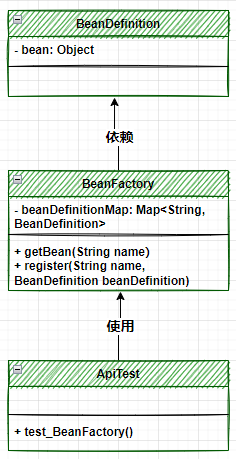
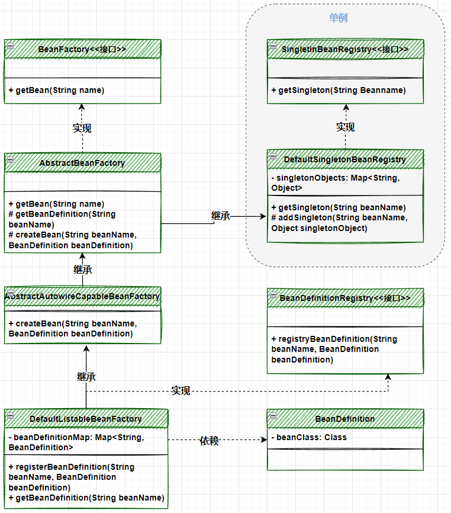
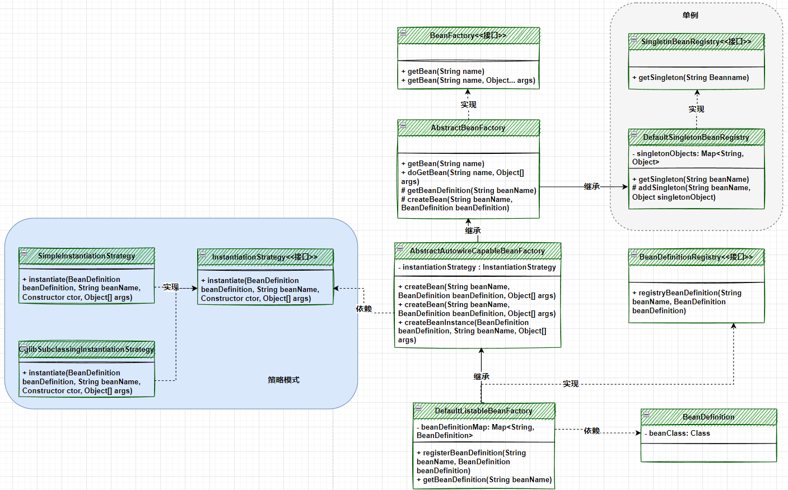
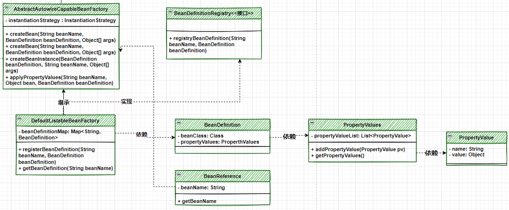
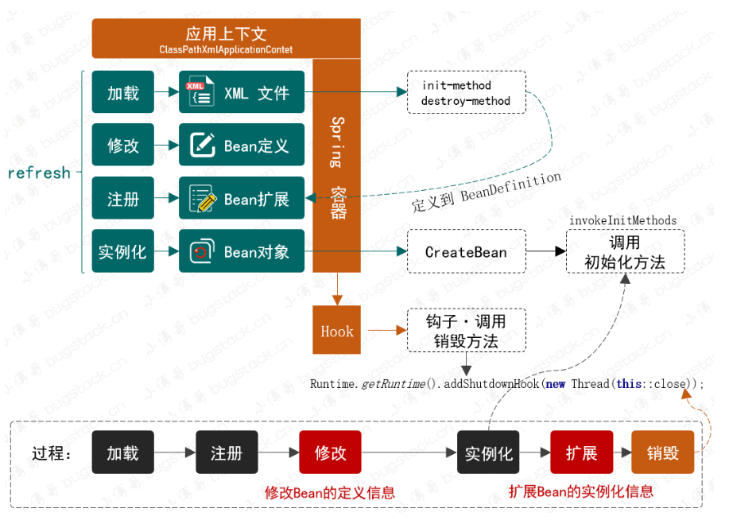
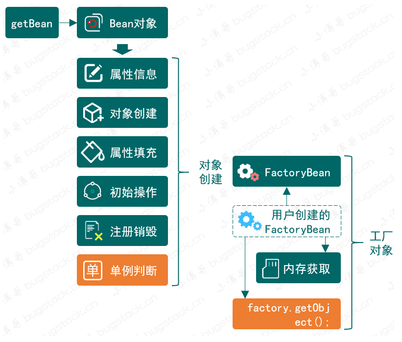

# 一、手写Spring

## 1.简单的Spring架构



* BeanDefinition，用于定义 Bean 实例化信息，现在的实现是以一个 Object 存放对象
* BeanFactory，代表了 Bean 对象的工厂，可以存放 Bean 定义到 Map 中以及获取

## 2.实现Bean的定义、注册、获取



* BeanFactory的定义由AbstractBeanFactory抽象类定义实现接口的getBean方法
* 而AbstractBeanFactory又继承实现了SingletonBeanRegistry的DefaultSingletonBeanRegistry类。这样 AbstractBeanFactory 抽象类就具备了单例 Bean 的注册功能
* AbstractBeanFactory中又定义了两个抽象方法：getBeanDefinition(String beanName)、createBean(String beanName, BeanDefinition beanDefinition)，而两个抽象方法分别由DefaultListableBeanFactory、bstractAutowireCapableBeanFactory 实现
* 最终 DefaultListableBeanFactory 还会继承抽象类 AbstractAutowireCapableBeanFactory 也就可以调用抽象类中的 createBean 方法了
* 另外，DefaultListableBeanFactory实现了BeanDefinitionRegistry实现了registryBeanDefinition的注册功能，注册到Map中
* **设计模式：模板模式**

## 3.基于Cglib实现含构造函数的类实例化策略



* 对BeanFactory接口，添加了getBean(name,args)的方法，这样就方便传递入参给构造函数实例化了
* 对AbstractBeanFactory新增了doGetBean方法，表示实际要做事了
* 添加InstantiationStrategy 实例化策略接口，AbstractAutowireCapableBeanFactory属性中注入InstantiationStrategy ，并可以选择实例化策略
* 实现了JDK和CGLIB两种方式的实例化instantiate
* createBeanInstance完成对象的实例化创建，对构造器选择主要简单根据参数个数判断，调用无参还是有参构造函数在instantiate方法中实现
* **设计模式：策略模式**

## 4.注入属性和依赖关系

> 就是根据用户的需要，调用set方法将基本类型属性和引用类型属性进行赋值



* PropertyValue用于表示类中的属性(基本类型和引用类型)
* BeanReference是表示引用类型属性的一种自定义类
* PropertyValues则是某个类所有属性的汇总收集类
* AbstractAutowireCapableBeanFactory增加了applyPropertyValues用于获取beanDefinition后，在获取其属性汇总类，继而获取其各个属性，根据属性进行添加，如果是引用类型(BeanReference)，则递归创建对象并获取

## 5.资源加载器解析文件注册对象

```bash
- PropertyValue: 记录类的属性名和值
	String name 
	
```




## 10. 对象作用域和FactoryBean



* 作用域：SCOPE_SINGLETON、SCOPE_PROTOTYPE。主要区别是 `AbstractAutowireCapableBeanFactory#createBean` 创建完成对象后是否放入到内存中，如果不放入则每次获取都会重新创建
* createBean 执行对象创建、属性填充、依赖加载、前置后置处理、初始化等操作后，就要开始做执行判断整个对象是否是一个 FactoryBean 对象，如果是这样的对象，就需要再继续执行获取 FactoryBean 具体对象中的 `getObject` 对象了。整个 getBean 过程中都会新增一个单例类型的判断`factory.isSingleton()`，用于决定是否使用内存存放对象信息。

> FactoryBean： 首先是个 bean，也存放在 BeanFactory 中。它具有工厂方法的功能，**在程序运行中** 产生指定(一种)类型的 bean，并添加到了 IOC容器中的 `factoryBeanObjectCache` 属性中

## 11.容器事件和事件监听器


## IOC总结

**涉及到的设计模式**


**主要功能**


**大致流程**


