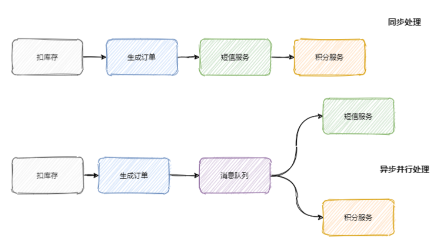
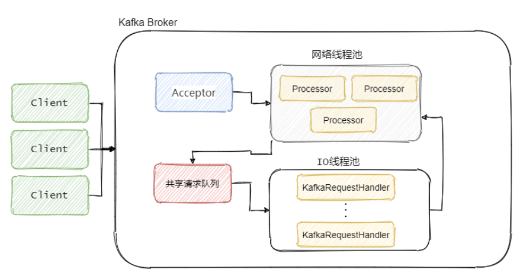
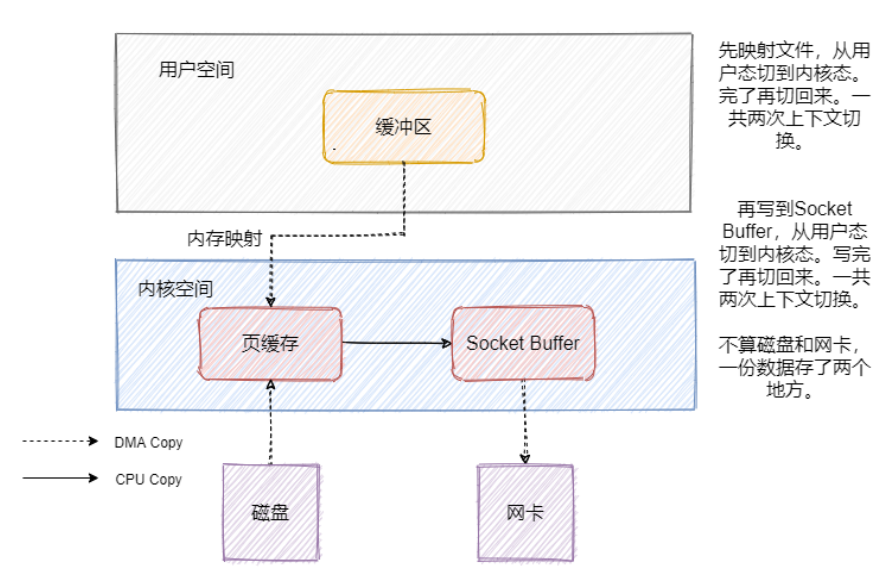
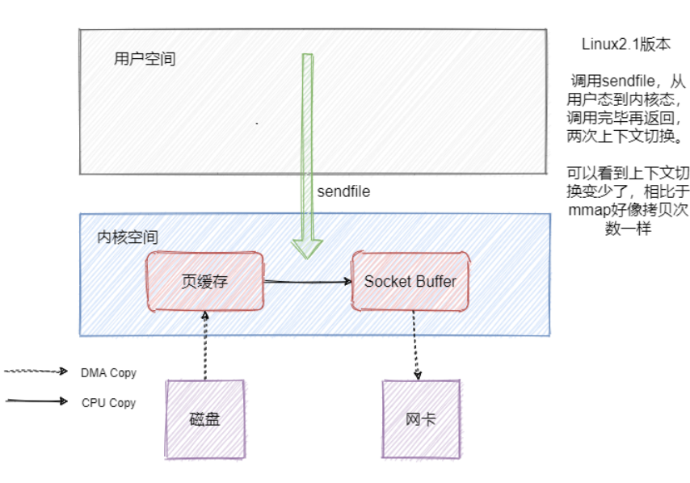
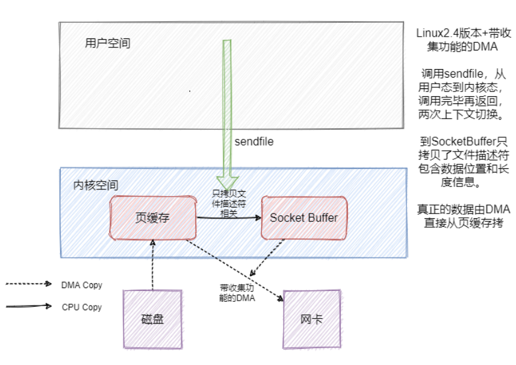

# 基础知识

## 什么是消息队列

**消息队列就是使用队列来通信的组件**

## 为什么需要消息队列

从本质上来说，互联网发展迅速，业务不断扩张，需要一个东西来解耦服务的关系，控制资源合理使用以及缓冲流量洪峰等

它上用来实现：**异步处理、服务解耦、流量控制**

**异步处理**：调用链路长，响应就慢了。减少请求的等待，还能让服务异步并发处理，提升系统总体性能



**服务解耦**：通过订阅主题发布消息来实现服务解耦

**流量控制**：即削峰，引入一个中间件来做缓冲

## 消息队列的两种模型

**队列模型和发布/订阅模型**

**队列模型**：生产者往某个队列里面发送消息，一个队列可以存储多个生产者的消息，一个队列也可以有多个消费者，但是消费者之间是竞争关系，即每条消息只能被一个消费者消费。

**发布订阅模型**：为了解决一条消息能被多个消费者消费的问题，出现了。该模型是将消息发往一个Topic 即主题中，所有订阅了这个 Topic 的订阅者都能消费这条消息。(群聊)

**小结**：RabbitMQ采用队列模式，RocketMQ和Kafka采用发布/订阅模型

## 如何保证消息不丢失

* 生产者丢失消息情况
  * 生产者发送消息默认采用的是异步发送，可以通过get()调用获取结果，但一般采用添加回调函数的形式。如果发送失败的话，通过设置`retries`(重试次数)来重新发送消息，一般是3，但为了保证消息不丢失一般会设置比较大一点。另外还需要设置重试间隔，因为间隔太小重试的效果就不明显了
  * ack为0是leade一接收还没有落盘就返回ack，容易丢失消息；ack为1，只有leader落盘了，如果leader宕机就会丢失消息；ack为-1，可以保证leader和follower都罗盘了，保证消息不丢失
* 消费者丢失消息情况
  * 消息在被追加到 Partition(分区)的时候都会分配一个特定的偏移量（offset）。偏移量（offset)表示 Consumer 当前消费到的 Partition(分区)的所在的位置。当自动提交offset时，如果刚拿到一个消息，突然挂掉了实际上并没有消费，但是offset却被自动提交了。解决办法：消费消息幂等性，使用redis、mysql等；将自动提交关闭，在真正消费完消息之后在手动提交offset，但这样会重复消费。
* kafka自身弄丢了消息
  * 假如 leader 副本所在的 broker 突然挂掉，那么就要从 follower 副本重新选出一个 leader ，但是 leader 的数据还有一些没有被 follower 副本的同步的话，就会造成消息丢失。所以需要ack=-1(all)
  * 所以需要设置每个分区有3个以上的副本，来保证系统的可靠性，虽然增加了数据冗余，但是带来了数据的安全性

## 如何处理重复消息

将ACK级别设置为-1，可以保证数据不会丢失，但是可能会重复发送，即At Least Once；将ACK设置成0，可以保证生产者每条消息只发送一次，即At Most Once但是有些业务需要消息不丢失也不重复即Exactly One。 Exactly One = At Least Once + 幂等

所谓的幂等性就是指 Producer 不论向 Server 发送多少次重复数据，Server 端都只会持久化一条。开启幂等性需要设置producer参数enable.idempotent为true。开启幂等性的Producer初始化时会被分配一个PID，发往同一个partition的消息会附带Sequence Number。而Broker端会对\<PID，Partition，SeqNumber\>做缓存，当具有相同主键的消息提交时，Broker只会持久化一条。但是PID重启会变化，同时不同的 Partition 也具有不同主键，所以幂等性无法保证跨分区跨会话的 Exactly Once。

## 如何保证消息的有序性

有序性分为**全局有序和部分有序**

**全局有序**：如果要保证消息的全局有序，首先只能由一个生产者往 Topic 发送消息，并且一个 Topic 内部只能有一个队列（分区）。

**部分有序**：部分有序我们就可以将 Topic 内部划分成我们需要的队列数，把消息通过特定的策略发往固定的队列中

## 如何处理消息堆积

* 生产端：一般当生产端发生积压就要查看你的业务逻辑是否有异常的耗时步骤导致的。是否需要改并行化操作等
* Broker端：当Broker端发生积压我们首先要查看，消息队列内存使用情况，如果有分区的的话还得看每个分区积压的消息数量差异。当每个分区的消息积压数据量相对均匀的话，我们大致可以认为是流量激增。需要在消费端做优化，或者同时需要增加Broker节点（相当于存储扩容），如果分区加压消息数量差异很大的话（有的队列满了，有的队列可能还是空闲状态），我们这时候就要检查我们的路由转发规则是否合理
* 消费端：在使用消息队列的时候大部分的问题都出在消费端，当消费速度小于生产速度很快就会出现积压，导致消息延迟，以至于丢失。这里需要重点说明一点的是，当消费速度小于生产速度的时候，仅增加消费者是没有用处的，**因为多个消费者在同一个分区上实际是单线程资源竞争关系，我们需要同时增加Broker上的分区数量才能解决这一问题**。

# 如何设计一个消息队列

首先我们需要明确地提出消息中间件的几个重要角色，分别是生产者、消费者、Broker、注册中心。

简述下消息中间件数据流转过程，无非就是生产者生成消息，发送至 Broker，Broker 可以暂缓消息，然后消费者再从 Broker 获取消息，用于消费

而注册中心用于服务的发现包括：Broker 的发现、生产者的发现、消费者的发现，当然还包括下线，可以说服务的高可用离不开注册中心

为了考虑扩容和整体的性能，采用分布式的思想，像 Kafka 一样采取分区理念，一个 Topic 分为多个partition，并且为保证数据可靠性，采取多副本存储，即 Leader 和 follower，根据性能和数据可靠的权衡提供异步和同步的刷盘存储

并且利用选举算法保证 Leader 挂了之后 follower 可以顶上，保证消息队列的高可用

也同样为了提高消息队列性能，可以采用顺序写的方式，并且利用内存映射、零拷贝进一步提高性能

# 消息队列设计为推消息还是拉消息

**推模式 √** 

* 好处
  * 消息实时性高
  * 对于消费者更简单
* 缺点
  * 推送速率难以适应消费速率，提高了Broker的复杂性

**拉模式**

* 好处
  * 拉模式下 Broker 就相对轻松了，复杂性下降
  * 拉模式可以更合适的进行消息的批量发送
* 缺点
  * 消息延迟。消费者需要不断拉取，但是又不能太频繁，所以有消息延迟

Kafka和RocketMQ都是采用**“长轮询”**的机制，具体的做法都是通过消费者等待消息，当有消息的时候 Broker 会直接返回消息，如果没有消息都会采取延迟处理的策略，并且为了保证消息的及时性，在对应队列或者分区有新消息到来的时候都会提醒消息来了，及时返回消息

一句话说就是消费者和 Broker 相互配合，拉取消息请求不满足条件的时候 hold 住，**避免了多次频繁的拉取动作**，当消息一到就提醒返回

# 消息队列之事务消息

```bash
1.2PC:二阶段提交。二阶段提交实时一种强一致性设计。2PC引入一个事务协调者的角色来协调管理参与者的提交和回滚，二阶段分别是准备和提交两个阶段。
	准备阶段：协调者会给各参与者发送准备命令，此时可以认为除了提交事务外，其他事都已经做完了。同步等待所有资源响应完之后就进入第二阶段即提交阶段(或者回滚事务)
	提交阶段：加入第一阶段所有参与者都准备成功，那么协调者则会向所有参与者发送提交事务命令，然后等待所有事务都提交成功，返回事务执行成功。假如第一阶段有一个参与者返回失败。那么协调者就会向所有参与者发送回滚事务的请求，即分布式事务执行失败。
	此时也会出现故障分析：
	1.如果第二将执行的是回滚操作，然后提交失败。那么就会不断重试，直到所有参与者都回滚了，不然哪些在第一阶段准备成功的参与者就会一直阻塞者
	2.如果第二阶段提交事务操作失败，那么答案也是不断重试，直到提交成功，到最后真的不行只能人工介入处理
	另外一些细节：首先2PC是一个同步阻塞协议，像第一阶段协调者会等待所有参与者响应才会进行下一步操作，那当然第一阶段的协调者会有超时机制，假设因为网络原因没有收到某参与者的响应或某参与者挂掉了，那么超时后就会判断事务失败，向所有参与者发送回滚命令。 另外第二阶段没法超时，因为只会不断重试。
	协调者故障分析：
	发送准备命令之前，之后；发送回滚事务之前，之后；发送提交事务之前，之后
	协调者故障，通过选举得到新协调者，如果处于第一阶段，其实影响不大，都回滚好了。假设第二阶段，假设参与者都没挂，此时新协调者可以向所有参与者确认它们自身情况来推断下一步的操作。但如果有个别参与者挂了，然后协调者发送了回滚命令，只有第一个参与者收到了，然后协调者和第一个参与者都挂了，那么新的协调者就不知道挂了的那个参与者是已经执行回滚了还是没有。因为每个参与者自身的状态只有自己和协调者知道，新的协调者不知道。	
2.3pc:
	3PC即包括三个阶段：准备阶段，预提交阶段和提交阶段。准备阶段变更为去询问参与者是否有条件完成这个事务；预提交阶段：就是操作事务，但是没有提交事务，而且只有所有参与者都进入了预提交阶段，才会进入预提交阶段，所以可以保证所有机器都没问题 ；提交阶段:提交事务
	相对于2PC，3PC引入了超时机制，这样就参与者就在协调者宕机后，傻等着。如果是等待提交命令超时，那么参与者就会提交事务了，因为都到了这一阶段了大概率是提交的，如果是等待预提交命令超时，那该干啥就干啥了，反正本来啥也没干
	问题：可能会造成数据不一致性，因为等待提交命令，可能是回滚操作，所以会出问题。
	3PC 相对于 2PC 做了一定的改进：引入了参与者超时机制，并且增加了预提交阶段使得故障恢复之后协调者的决策复杂度降低，但整体的交互过程更长了，性能有所下降，并且还是会存在数据不一致问题。
3.TCC:
	2PC和3PC都是数据库层面的，而 TCC 是业务层面的分布式事务。TCC 指的是Try - Confirm - Cancel
	Try 指的是预留，即资源的预留和锁定，注意是预留。
	Confirm 指的是确认操作，这一步其实就是真正的执行了。
	Cancel 指的是撤销操作，可以理解为把预留阶段的动作撤销了。
	如说一个事务要执行A、B、C三个操作，那么先对三个操作执行预留动作。如果都预留成功了那么就执行确认操作，如果有一个预留失败那就都执行撤销动作。
	因此 TCC 对业务的侵入较大和业务紧耦合,还有一点要注意，撤销和确认操作的执行可能需要重试，因此还需要保证操作的幂等.优点：TCC是业务上实现的，所以TCC可以跨数据库、跨不同的业务系统来实现事务
4.本地消息表：
	本地消息表其实就是利用了 各系统本地的事务来实现分布式事务。
	首先会有一个存放消息的表，然后一般放在数据库中，然后在执行业务的时候 将业务的执行和将消息放入消息表中的操作放在同一个事务中，这样就能保证消息放入本地表中业务肯定是执行成功的。
	然后再去调用下一个操作，如果下一个操作调用成功了，消息表的消息状态就会直接改成已完成。
	如果调用失败，会有 后台任务定时去读取本地消息表，筛选出还未成功的消息再调用对应的服务，服务更新成功了再变更消息的状态
	当然也会有最大重试次数，如果超过最大次数可以记录下报警让人工处理。可以保证最终一致性
5.消息事务：
	消息队列支持消息事务的特点来实现的。
	第一步先给Broker发送事务消息即半消息，半消息是这个消息对消费者来说不可见，然后发送成功后发送方再执行本地事务。
	然后发送方再根据本地事务的结果向 Broker 发送 Commit 或者 RollBack 命令
	并且发送方会提供一个反查事务状态接口，如果一段时间内半消息没有收到任何操作请求，那么 Broker 会通过反查接口得知发送方事务是否执行成功，然后执行 Commit 或者 RollBack 命令
	如果是 Commit 那么订阅方就能收到这条消息，然后再做对应的事务操作，做完了之后再消费这条消息即可。
	如果是 RollBack 那么订阅方收不到这条消息，等于事务就没执行过
	所以我们只需要，我们只需要定义好事务反查接口即可，可以看到消息事务实现的也是最终一致性。
6.最大努力通知：
	也是实现分布式事务的一些放大的另一种称呼。最大努力通知其实只是表明了一种柔性事务的思想，我已经尽力我最大的努力想达成事务的最终一致了。比如本地消息表会有后台定时任务会查询未完成的消息，然后调用对应服务，如果多次失败还会引入人工或者舍弃，算是最大努力了。事务消息也一样。
	总结： 2PC 和 3PC 是一种强一致性事务，不过还是有数据不一致，阻塞等风险，而且只能用在数据库层面。TCC 是一种业务层面实现的，因此对业务的侵入性较大，每一个操作都需要实现对应的三个方法。本地消息、事务消息和最大努力通知其实都是最终一致性事务，因此适用于一些对时间不敏感的业务。
```

**事务消息**

* Rocket的事务消息
  * RocketMQ 的事务消息也可以被认为是一个两阶段提交，简单的说就是在事务开始的时候会先发送一个半消息给 Broker。半消息的意思就是这个消息此时对 Consumer 是不可见的，而且也不是存在真正要发送的队列中，而是一个特殊队列。发送完半消息之后再执行本地事务，再根据本地事务的执行结果来决定是向 Broker 发送提交消息，还是发送回滚消息。
  * Broker 会定时的向 Producer 来反查这个事务是否成功，具体的就是 Producer 需要暴露一个接口，通过这个接口 Broker 可以得知事务到底有没有执行成功，没成功就返回未知，因为有可能事务还在执行，会进行多次查询。
* Kafka的事务消息
  * 在开始事务的时候，生产者会向事务协调者发起请求表示事务开启，事务协调者会将这个消息记录到特殊的日志-事务日志中，然后生产者再发送真正想要发送的消息，这里 Kafka 和 RocketMQ 处理不一样，Kafka 会像对待正常消息一样处理这些事务消息，由消费端来过滤这个消息
  * 然后发送完毕之后生产者会向事务协调者发送提交或者回滚请求，由事务协调者来进行两阶段提交，如果是提交那么会先执行预提交，即把事务的状态置为预提交然后写入事务日志，然后再向所有事务有关的分区写入一条类似事务结束的消息，这样消费端消费到这个消息的时候就知道事务好了，可以把消息放出来了
* QMQ
  * 核心思想就是本地消息表！利用关系型数据库的事务能力，将业务的写入和消息表的写入融在一个事务中，这样业务成功则消息表肯定写入成功
  * 然后在事务提交之后，立刻发送事务消息，如果发送成功，则删除本地消息表中的记录
  * 如果消息发送失败，也就是比如 mq 集群挂了，并不会影响事务的执行，业务的执行和事务消息的插入都已经成功了，那此时待消息已经安安静静的在消息库里等着，后台能会有一个补偿任务，会将这些消息捞出来重新发送，直到发送成功

# Kafka请求全流程解析

**Reactor模式**：基本上只要是底层的高性能网络通信就离不开 Reactor模式 。像Netty、Redis都是使用 Reactor模式

> 单线程 => 多线程 => 线程池 => Reactor模型

```bash
- 流程
	简单来说就是，Broker 中有个 Acceptor(mainReactor) 监听新连接的到来，与新连接建连之后轮询选择一个 Processor(subReactor) 管理这个连接。
	而 Processor 会监听其管理的连接，当事件到达之后，读取封装成 Request ，并将 Request 放入共享请求队列中。
	然后IO线程池不断的从该队列中取出请求，执行真正的处理。处理完之后将响应发送到对应的
Processor 的响应队列中，然后由 Processor 将 Response 返还给客户端。

- 解析
	每个 listener 只有一个 Acceptor线程 ，因为它只是作为新连接建连再分发，没有过多的逻辑，很轻量，一个足矣。
	Processor 在Kafka中称之为网络线程，默认网络线程池有3个线程，对应的参数是num.network.threads 。
	还有个 IO 线程池，即 KafkaRequestHandlerPool ，执行真正的处理，对应的参数是num.io.threads ，默认值是 8
	可以看到网络线程和IO线程之间利用的经典的生产者 - 消费者模式
```



# 请求处理优先级

的data-plane 和 control-plane 就是数据类请求和控制类请求

简单点的说比如我们想删除某个topic，我们肯定是想这个topic马上被删除的，而此时producer还一直往这个topic写数据，那这个情况可能是我们的删除请求排在第N个...等前面的写入请求处理好了才轮到删除的请求。实际上前面哪些往这个topic写入的请求都是没用的，平白的消耗资源。

再或者说进行 Preferred Leader 选举时候， producer 将 ack 设置为 all 时候， 老leader 还在等着follower 写完数据向他报告呢，谁知 follower 已经成为了 新leader ，而通知它leader已经变更的请求由于被一堆数据类型请求堵着呢， 老leader 就傻傻的在等着，直到超时

为解决这个问题：社区采取的是两套 Listener ，即数据类型一个 listener ，控制类一个 listener 。

对应的就是我们上面讲的网络通信模型，在kafka中有两套！ kafka通过两套监听变相的实现了请求优先级，毕竟数据类型请求肯定很多，控制类肯定少，这样看来控制类肯定比大部分数据类型先被处理

# Kafka为什么要抛弃Zookeeper

ZooKeeper 有个特点，**强一致性**。

如果 ZooKeeper 集群的某个节点的数据发生变更，则会通知其它 ZooKeeper 节点同时执行更新，就得等着大家(超过半数)都写完了才行，这写入的性能就比较差了


## Kafka为什么这么快

**顺序读写**：首先了解一下页缓存，页缓存是操作系统用来作为磁盘的一种缓存，减少磁盘的I/O操作。在写入磁盘的时候其实是写入页缓存中，使得对磁盘的写入变成对内存的写入。写入的页变成脏页，然后操作系统会在合适的时候将脏页写入磁盘中。

在读取的时候如果页缓存命中则直接返回，如果页缓存 miss 则产生缺页中断，从磁盘加载数据至页缓存中，然后返回数据。

根据磁盘的构成，顺序I/O的时候，磁头几乎不用换道。但这样也会存在数据丢失的风险，**一般建议多副本机制来保证消息的可靠，而不是同步刷盘**。

可以看到顺序 I/O 适应磁盘的构造，并且还有预读和后写。 RocketMQ 和 Kafka 都是顺序写入和近似
顺序读取。它们都采用文件追加的方式来写入消息，只能在日志文件尾部写入新的消息，老的消息无法
更改。

**mmap-文件内存映射**

页缓存属于内核空间，用户进程访问不了，因此还需要拷贝操作。mmap对此作了优化、

简单的说文件映射就是将程序虚拟页面直接映射到页缓存上，这样就无需有内核态再往用户态的拷贝，而且也避免了重复数据的产生。mmap + write 两个系统调用



**sendfile-零拷贝**：DMA可以独立地直接读写系统内存，不需要CPU介入。上下文减少2次。一次系统调用



**sendfile-[分散收集]的DMA**:节省一次CPU拷贝。2次上下文切换，2次DMA拷贝。在 Java 中 FileChannal.transferTo() 底层用的就是 sendfile 



**从发送消息来说 RocketMQ 用到了 mmap + write 的方式，并且通过预热来减少大文件 mmap 因为缺**
**页中断产生的性能问题。**

**Kafka 的消息写入对于单分区来说也是顺序写，如果分区不多的话从整体上看也算顺序写，它的日志文件并没有用到 mmap，而索引文件用了 mmap。但发消息 Kafka 用到了零拷贝。**

**对于消息的写入来说 mmap 其实没什么用，因为消息是从网络中来。而对于发消息来说 sendfile 对比**
**mmap+write 我觉得效率更高，因为少了一次页缓存到 SocketBuffer 中的拷贝。**


# 定时任务终极实现

Timer、ScheduledThreadPool、DelayQueue和时间轮

