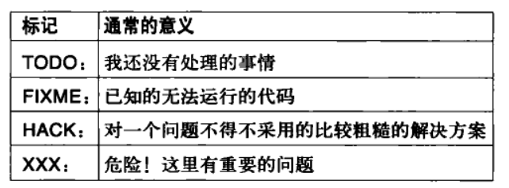
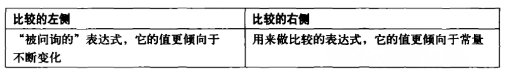

# 一、代码应易于理解

> **关键思想**
>
> 
>
> **代码应当易于理解**

# 二、把信息装入名字

> **关键思想**
>
> **把信息装入名字**

## 选择专业的词

把信息装入名字包括选择非常专业的词，并且避免使用“空洞”的词

“get”这个词没有表达出很多信息，这个方法是从本地缓存中得到还是数据库中得到？如果从互联网，更专业的名字可以是FetchPage()或DownloadPage()

## 避免像tmp和retval这样的泛泛的名字

使用想tmp、retval和foo这样的名字往往是“我想不出名字”的托辞。与其使用这样空洞的名字，不如挑一个能描述这个实体的值或目的的名字

```javascript
function(v){
    var retval = 0.0;
    for(var i = 0; i < v.length; i+= 1)
        retval += v[i] * v[i]
    return Math.sqrt(retval);
}
```

本例中，这个变量正在累加v的平方，所以更贴切的名字可以是sum_squares。这样就提前声明了这个变量的目的

**tmp**

```java
if(right < left){
    tmp = right;
    right = left;
    left = tmp;
}
// 此时tmp这个名字就很好，这个变量的唯一目的就是临时存储。
```

但下面这个理解对tmp的使用仅仅是因为懒惰

```java
String tmp = user.name();
tmp += " " + user.phone_number();
tmp += " " + user.email();

// 尽管这里的变量只有很短的生命周期，但对他来讲最重要的并不是临时储存，用想user_info这样的名字代替可能会更具有描述性
```

**建议：tmp这个名字只应用于短期存在且临时性为其主要存在因素的变量**

**循环迭代器**

像i、j、it等名字常做索引和循环迭代到期。尽管这些名字很空泛，但是大家都知道他们的意思。但有时有比i、j、k更贴切的迭代器命名。例如，下面小循环要找到那个user属于哪个club

```c++
for(int i = 0; i < clubs.size(); i++)
    for(int j = 0; j < clubs[i].members.size(); j++)
        for(int k = 0; k < users.size(); k++)
            if(clubs[i].member[k] = users[j])
                cout << "user[" << j << "] is in club[" << i << "]" << endl;
        
// 这种情况下，使用更精确的名字可能会有帮助，如果不把循环索引命名为(i、j、k)，另一个选择可以是(club_i,member_i,user_i)，或更简化一点(ci,mi,ui)
	if(clubs[ci].members[mi] == users[ui])  # OK。首字母匹配
```

## 为名字附带更多的信息

一个变量名就像是一个小小的注释。尽管空间不是很大，但不管你在命名中挤进任何额外的信息，每次有人看到这个变量名时都会同时看到这些信息。例如，假如你有一个变量包括一个十六进制字符串：

```javascript
string id; // Example: "af84ef845cd8"
```

如果让读者记住这个ID的格式很重要，可以将其改名为hex_id

**带单位的值**

如果你的变量是一个度量的话(如时间长度或者字节数)，那么最好把名字带上它的单位。

```javascript
var start = (new Date()).getTime();  // top of the page
```

getTime()返回的是毫秒而不是秒，通过给变量结尾追加_ms，我们可以让所有地方更明确

```javascript
var start_ms = (new Date()).getTime();   // top of the page
```

# 三、读写什么样的注释



# 四、写出言简意赅的注释

**让注释保持紧凑**

**避免使用不明确的代词**

**采用信息含量高的词**

# 五、把控制流变得易读

> 关键思想：把条件、循环以及其他对控制流的改变做的越“自然”越好



**避免使用do/while循环**

**从函数中提前返回**

在某些编程结构中，像三目运算符(:?)、do/while循环、以及goto经常会导致代码的可读性变差。


# 六、拆分超长表达式

用摩尔根定理来操作逻辑表达式——这个技术有时可以吧布尔表达式更整洁的方式重写(例如if(!(a && !b))变成if(!a || b))

