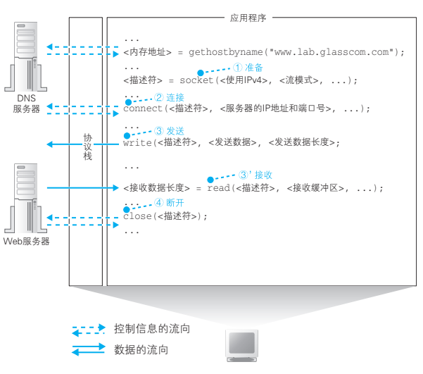
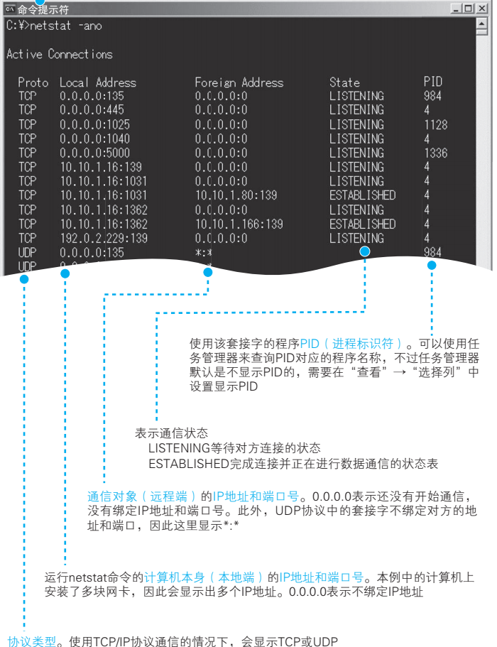

# 一、浏览器生成消息——探索浏览器内部

## 1.1 生成HTTP请求消息

### 1.1.1 浏览器先要解析 URL

**URL元素**


* http://www.lab.glasscom.com/dir/ ：像前面这样省略文件名时，服务器就会访问 /dir/index.html
  或者 /dir/default.html
* http://www.lab.glasscom.com/whatisthis：如果Web 服务器上存在名为 whatisthis 的文件，则将 whatisthis 作为文件名来处理；如果存在名为 whatisthis 的目录，则将 whatisthis 作为目录名来处理

### 1.1.2 HTTP基本思路

| 方法    | 含义                                                         |
| :------ | :----------------------------------------------------------- |
| GET     | 获取指定 URI 的信息。如果 URI 指定是文件，则返回文件的内容；如果 URI 指定的是CGI程序，则返回该程序的输出数据 |
| POST    | 从客户端向服务器发送数据。一般用于发送表单中填写的数据等情况下 |
| HEAD    | 和GET基本相同。不过它只返回HTTP的消息头，而并不返回数据的内容。用于获取文件最后更新时间等属性信息 |
| OPTIONS | 用于通知或查询通信选项                                       |
| PUT     | 替换URI指定的服务器上的文件。如果URI指定的文件不存在，则创建该文件 |
| DELETE  | 删除URI指定的服务器上的文件                                  |

请求信息包括请求行、请求头和请求体；响应信息包括响应行、响应头和响应体

```bash
- HTTP头字段类型
	Date：表示请求和响应生成的日期
	Programe：表述数据是否允许缓存的通信选项
	Cache-Control：控制缓存的相关信息
	Connection：设置发送响应之后TCP连接是否继续保持的通信选项
	Transfer-Encoding：表示消息主题的编码格式
	Via：记录途中经过的代理和网关
- HTTP请求头
	Authorization：身份认证数据
	From：请求发送者的邮件地址
	If-Modified-Since：如果希望仅当数据在某个日期之后有更新时才执行请求，可以在这个字段指定希望的日期
	Referer：当通过点击超级链接进入下一个页面时，在这里记录下上一个页面的URI
	User-Agent：客户端软件的名称和版本号等相关信息
	Accept：客户端可支持的数据类型(Content-Type)，以MIME类型来表示
	Accept-Encoding：客户端可支持的编码格式(Content-Encoding)
	Accept-Language：客户端可支持的语言，汉语为zh，英语为en
	Host：接收请求的服务器IP地址和端口号
	Range：当需要只获取部分数据而不是全部数据时，可通过这个字段指定要获取的数据范围
- 响应头
	Allow：表示指定的URI支持的方式
	Content-Encoding：当消息体经过压缩等编码处理时，表示其编码格式
	Content-Length：表示消息体的长度
	Content-Type：表示消息体的数据类型，以MIME规格定义的数据类型来表示
	Expires：表示消息的有效期
	Last-Modified：数据的最后更新日期
	Content-Language：表示消息的语言
	Conteng-Range：当仅请求部分数据时，表示消息体包含的数据范围
```

**HTTP状态码**：1xx：告知请求的处理进度和情况；2xx：成功；3xx：表示需要进一步操作；4xx：客户端错误；5xx：服务器错误

## 1.2 向DNS服务器查询Web服务器的IP地址

### 1.2.1 IP地址的基本知识

生成 HTTP 消息之后，接下来我们需要委托操作系统将消息发送给Web 服务器。


IP地址包括两个部分，分别是网络号和主机号，主机号部分的比特全部为 0 或者全部为 1 时代表两种特殊的含义。**主机号部分全部为 0 代表整个子网而不是子网中的某台设备。此外，主机号部分全部为 1 代表向子网上所有设备发送包，即广播**


### 1.2.2 通过解析器向DNS服务器发送查询

通过DNS根据域名查询IP地址的操作成为解析，执行这一操作的是解析器。

解析器的用法非常简单。Socket 库中的程序都是标准组件，只要从应用程序中进行调用就可以了。

**根据域名查询 IP 地址时，浏览器会使用 Socket 库中的解析器**

当控制流程转移到解析器后，解析器会生成要发送给 DNS 服务器的查询消息。发送消息这个操作并不是由解析器自身来执行，而是要委托给操作系统内部的协议栈来执行。解析器调用协议栈后，控制流程会再次转移，协议栈会执行发送消息的操作，然后通过网卡将消息发送给 DNS 服务器

## 1.3 全世界DNS服务器的大接力

### 1.3.1 域名的层次结构

> DNS 服务器会从域名与 IP 地址的对照表中查找相应的记录，并返回 IP 地址。

**DNS 中的域名都是用句点来分隔的，在域名中，越靠右的位置表示其层级越高**，比如 www.lab.glasscom.com 这个域名如果按照公司里的组织结构来说，大概就是“com 事业集团 glasscom 部 lab 科的 www”这样。其中，相当于一个层级的部分称为域。因此，com 域的下一层是glasscom 域，再下一层是 lab 域，再下面才是 www 这个名字。

### 1.3.2 寻找相应的DNS服务器并获取IP地址

首先，将负责管理下级域的 DNS 服务器的 IP 地址注册到它们的上级 DNS 服务器中，然后上级 DNS 服务器的 IP 地址再注册到更上一级的 DNS 服务器中，以此类推。也就是说，负责管理 lab.glasscom.com 这个域的 DNS 服务器的 IP 地址需要注册到 glasscom.com 域的 DNS服务器中，而 glasscom.com 域的 DNS 服务器的 IP 地址又需要注册到 com域的 DNS 服务器中。

在互联网中，com 和 jp 的上面还有一级域，称为根域


### 1.3.3 委托缓存加快DNS服务器的响应

**因为 DNS 服务器有一个缓存 功能，可以记住之前查询过的域名**。如果要查询的域名和相关信息已经在缓存中，那么就可以直接返回响应，接下来的查询可以从缓存的位置开始向下进行。相比每次都从根域找起来说，缓存可以减少查询所需的时间。

因此，**DNS 服务器中保存的信息都设置有一个有效期**，当缓存中的信息超过有效期后，数据就会从缓存中删除。而且，在对查询进行响应时，**DNS 服务器也会告知客户端这一响应的结果是来自缓存中还是来自负责管理该域名的 DNS 服务器**

## 1.4 委托协议栈发送消息

知道IP地址之后，就可以委托操作系统的协议栈向目标IP地址发送消息了。**向操作系统内部的协议栈发出委托时，需要按照指定的顺序来调用Socket库中的程序组件**

（1）创建套接字（创建套接字阶段）
（2）将管道连接到服务器端的套接字上（连接阶段）
（3）收发数据（通信阶段）
（4）断开管道并删除套接字（断开阶段）



### 1.4.1 创建套接字阶段

客户端创建套接字的操作非常简单，只要调用 Socket 库中的 socket 程序组件。套接字创建完成后，协议栈会返回一个描述符，应用程序会将收到的描述符存放在内存中，**描述符是用来识别不同的套接字的**。

同一台计算机上可能同时存在多个套接字，在这种情况下，我们就需要一种方法来识别出某个特定的套接字，这种方法就是描述符

### 1.4.2 连接阶段

这里的要点是当调用 connect 时，需要指定描述符、服务器 IP 地址和端口号这 3 个参数

客户端在创建套接字时，协议栈会为这个套接字随便分配一个端口号 A。接下来，当协议栈执行连接操作时，会将这个随便分配的端口号通知给服务器。

### 1.4.3 通信阶段：传递消息

应用程序需要在内存中准备好要发送的数据。根据用户输入的网址生成的 HTTP 请求消息就是我们要发送的数据。接下来，当调用 write时，需要指定描述符和发送数据，然后协议栈就会将数据发送到服务器。由于套接字中已经保存了已连接的通信对象的相关信息，所以只要通过描述符指定套接字，就可以识别出通信对象，并向其发送数据。接着，发送数据会通过网络到达我们要访问的服务器

接收消息的操作是通过 Socket 库中的 read 程序组件委托协议栈来完成的，调用read 时需要指定用于存放接收到的响应消息的内存地址，这一内存地址称为接收缓冲区。

### 1.4.4 收发数据结束

我们需要调用 Socket 库的 close 程序组件进入断开阶段。最终，连接在套接字之间的管道会被断开，套接字本身也会被删除

==**探索了浏览器与Web服务器之间收发消息的过程，但实际负责收发消息的是协议栈、网卡驱动和网卡**==

# 二、用电信号传输TCP/IP数据

## 2.1 创建套接字

### 2.1.1 协议栈内部结构

**操作系统中的网络控制软件(协议栈)和网络硬件(网卡)**


​																				**TCP/IP分层结构图**

==**第一层**==应用程序的下面就是Socket库，其中包括解析器，解析器用来向DNS服务器发出查询

==**第二层**==协议栈的上半部分有两块，分别负责用TCP协议收发数据的部分和负责用**UDP协议收发数据(DNS查询)**的部分

==**第三层**==IP包括ICMP协议和ARP协议。ICMP用于告知网络传送过程中产生的错误以及各种控制信息，ARP用于根据IP地址查询相应的MAC地址

==**最下面**==网卡驱动程序控制网卡硬件，而最下面的网卡则负责完成实际的收发操作，也就是对网线中的信号执行发送和接收的操作

### 2.1.1 套接字实体就是通信控制信息

**协议栈内部有一块用于储存控制信息的内存空间，这里记录了用于控制通信信息操作的控制信息，例如IP地址、端口等**

套接字就只是一个概念而已，并不存在实体，如果一定要赋予它一个实体，我们可以说这些控制信息就是套接字的实体

**协议栈是根据套接字中记录的控制信息来工作的**

```bash
netstat用于显示套接字内容的命令，-ano选项表示下面的意思
a 不仅显示正在通信的套接字，还显示包括尚未开始通信等状态的所有套接字
n 显示IP地址和端口号
o 显示使用该套接字的程序PID
```



### 2.1.3 调用Socket时的操作

浏览器委托协议栈使用 TCP 协议来收发数据

首先是创建套接字的阶段。**创建套接字时，首先分配一个套接字所需的内存空间，然后向其中写入初始状态。**

接下来，需要将表示套接字的描述符告知应用程序，描述符相当于用来区分协议栈中的多个套接字的号码牌

## 2.2 连接服务器

### 2.2.1 连接是什么意思

我们需要把服务器的 IP 地址和端口号等信息告知协议栈，这是连接操作的目的之一。

连接实际上是通信双方交换控制信息，在套接字中记录这些必要信息并准备数据收发的一连串操作

### 2.2.2 负责保存控制信息的头部

控制信息其实可以分为两大类，第一类是客户端和服务端相互联络时交换的控制信息。这些信息不仅连接时需要，包括数据收发和断开连接操作在内，整个通信过程中都需要，这些内容在 TCP 协议的规格中进行了定义。 为了避免各种不同的头部发生混淆，
我们一般会记作 TCP 头部、以太网头部 、IP 头部

**TCP头部字段**

```bash
名称			长度(bit)   含义
发送方端口号		16		发送网络包的程序端口号
接收方端口号		16		网络包的接收方程序的端口号
`序号`		   32	   发送方告知接收方该网络包发送的数据相当于所有发送数据的第几个字节
`ACK号`			32		接收方告知发送方接收方已经收到数据的第几个字节
数据偏移量		 4		 表示数据部分的起始位置，也可以认为表示头部的长度
保留			   6	   该字段为保留，现在未使用
控制位			  6		  该字段中的每个比特分别表示以下通信控制含义。ACK、FIN、URG等等
窗口			   16	   接收方告知发送方窗口大小（即无需等待确认可一起发送的数据量）
校验和			  16	  用来检查是否出现错误
紧急指针		  16	 表示应紧急处理的数据位置
可选字段         可变		还可以添加可选字段，但除了连接操作之外，很少使用可选字段
```

控制信息还有另外一类，那就是保存在套接字中，用来控制协议栈操作的信息


**通信操作中使用的控制信息分为两类。**
**（1） 头部中记录的信息**
**（2） 套接字（协议栈中的内存空间）中记录的信息**

### 2.2.3 连接操作的实际过程

连接操作的第一步是在 TCP 模块处创建表示连接控制信息的头部

通过 TCP 头部中的发送方和接收方端口号可以找到要连接的套接字

当 TCP 头部创建好之后，接下来 TCP 模块会将信息传递给 IP 模块并委托它进行发送。

IP 模块执行网络包发送操作后，网络包就会通过网络到达服务器，然后服务器上的 IP 模块会将接收到的数据传递给 TCP 模块，服务器的 TCP 模块根据 TCP 头部中的信息找到端口号对应的套接字，也就是说，从处于等待连接状态的套接字中找到与 TCP 头部中记录的端口号相同的套接字就可以了。当找到对应的套接字之后，套接字中会写入相应的信息，并将状态改为正在连接

网络中经常会发生错误，网络包也会发生丢失，因此双方在通信时必须相互确认网络包是否已经送达，而设置ACK 比特就是用来进行这一确认的。接下来，服务器 TCP 模块会将 TCP头部传递给 IP 模块，并委托 IP 模块向客户端返回响应

## 2.3 收发数据

**将HTTP请求交给协议栈**：数据收发操作是从应用程序调用 write 将要发送的数据交给协议栈开始的

协议栈并不关心数据的内容，在它看来就是一定长度的二进制字节序列；其次，协议栈并不是一收到数据就马上发送，而是将数据存在内部的发送缓冲区中，并等待应用程序的下一段数据

如果**一收到数据马上发送**，就会可能发送大量的小包，导致**网络效率下降**；

协议栈会根据MTU的参数来判断，MTU表示一个网络包的最大长度，以太网中一般是1500字节，MTU包括头部的总长度(ip头部、tcp头部)，减去头部得到网络包能容纳的最大数据长度为MSS，也就是1448(1500 - 20 - 32)

> MTU：一个网络包的最大长度，以太网中一般为 1500 字节。
> MSS：除去头部之后，一个网络包所能容纳的 TCP 数据的最大长度，一般1448字节

为了解决每次都等待长度接近MSS在发送，就会因为等待时间太长而造成发送延迟，所以协议栈内部有一个计时器来解决这个问题


### 2.3.2 对较大数据进行拆分

当发送缓冲区中的数据超过MSS的长度，这时发送缓冲区中的数据就会以MSS长度为单位进行拆分，拆分出来的每块数据会被放进单独的网络包中，然后每一块数据前面加上TCP头部，并根据套接字中记录的控制信息标记发送方和接收方的端口号，然后交给IP模块进行执行发送数据的操作


### 2.3.3 使用ACK号确认网络网已经收到

首先，TCP 模块在拆分数据时，会先算好每一块数据相当于从头开始的第几个字节，接下来在发送这一块
数据时，将算好的字节数写在 TCP 头部中，“序号”字段就是派在这个用场上的

像这样，如果确认没有遗漏，接收方会将到目前为止接收到的数据长度加起来，计算出一共已经收到了多少个字节，然后将这个数值写入 TCP头部的 ACK 号中发送给发送方

在实际的通信中，序号并不是从 1 开始的，而是需要用随机数计算出一个初始值，这是因为如果序号都从 1 开始，通信过程就会非常容易预测


​																		**序号和 ACK 号的用法**

首先，客户端在连接时需要计算出与从客户端到服务器方向通信相关的序号初始值，并将这个值发送给服务器。接下来，服务器会通过这个初始值计算出 ACK 号并返回给客户端。初始值有可能在通信过程中丢失，因此当服务器收到初始值后需要返回 ACK 号作为确认。同时，服务器也需要计算出与从服务器到客户端方向通信相关的序号初始值，并将这个值发送给客户端。接下来像刚才一样，客户端也需要根据服务器发来的初始值计算出 ACK 号并返回给服务器。到这里，序号和 ACK 号都已经准备完成了，接下来就可以进入数据收发阶段了。数据收发操作本身是可以双向同时进行的，但 Web 中是先由客户端向服务器发送请求，序号也会跟随数据一起发送。然后，服务器收到数据后再返回 ACK 号。从服务器向客户端发送数据的过程则正好相反

我们可以确认接收方有没有收到某个包，如果没有收到则重新发送，这样一来，无论网络中发生任何错误，我们都可以发现并采取补救措施（重传网络包）。

### 2.3.4 使用窗口有效管理ACK号

每发送一个包就等待一个 ACK 号的方式是最简单也最容易理解的，但在等待 ACK 号的这段时间中，如果什么都不做那实在太浪费了。为了减少这样的浪费，TCP 采用滑动窗口方式来管理数据发送和 ACK 号的操作

所谓滑动窗口，就是在发送一个包之后，不等待 ACK 号返回，而是直接发送后续的一系列包。这样一来，等待 ACK 号的这段时间就被有效利用起来了


问题：如果数据到达的速率比处理这些数据并传递给应用程序的速率还要快，那么接收缓冲区中的数据就会越堆越多，最后就会溢出。所以接收方需要告诉发送方自己最多能接收多少数据，然后发送方根据这个值对数据发送操作进行控制，这就是滑动窗口方式的基本思路

接收方会通过在**TCP头部的窗口字段**将自己能接收的数据量告知发送方，来避免发送速率超过自己的接收能力


### 2.3.5 ACK和窗口合并

为了提高收发效率，**那就是返回 ACK号和更新窗口的时机**。

返回ACK的时机在收到数据然后确认没问题就可以返回了；更新窗口时机在接收方将数据传递给应用程序，导致接收缓冲区剩余容量增加。

**每收到一个包，就需要向发送方分别发送 ACK 号和窗口更新这两个单独的包 B。这样一来，接收方发给发送方的包就太多了，导致网络效率下降。**

**接收方在发送 ACK 号和窗口更新时，并不会马上把包发送出去，而是会等待一段时间，在这个过程中很有可能会出现其他的通知操作，这样就可以把两种通知合并在一个包里面发送了**

### 2.3.6 接收HTTP响应消息

和发送数据一样，接收数据也需要在接收缓冲区中暂存，然后协议栈尝试从接收缓冲区中取出数据传递给应用程序，但此时请求消息刚刚发送，响应消息可能还没有返回，于是协议栈将应用程序的委托，也就是从接收缓冲区中取出数据并传递给应用程序的工作暂时挂起

首先，协议栈会检查收到的数据块和 TCP 头部的内容，判断是否有数据丢失，如果没有问题则返回 ACK 号。然后，协议栈将数据块暂存到接收缓冲区中，并将数据块按顺序连接起来还原出原始的数据，最后将数据交给应用程序。具体来说，协议栈会将接收到的数据复制到应用程序指定的内存地址中，然后将控制流程交回应用程序。将数据交给应用程序之后，协议栈还需要找到合适的时机向发送方发送窗口更新

## 2.4 从服务器断开删除套接字

以 Web 为例，服务器会先发起断开过程 A。在这个过程中，服务器先发送一个 FIN 为 1 的 TCP 包，然后客户端返回一个表示确认收到的 ACK 号。接下来，双方还会交换一组方向相反的 FIN 为 1 的 TCP 包和包含 ACK 号的 TCP 包。最后，在等待一段时间后，套接字会被删除。

（1）客户端发送 FIN
（2）服务器返回 ACK 号
（3）服务器发送 FIN
（4）客户端返回 ACK 号

## 2.5 IP与以太网的包收发操作

IP 模块负责添加如下两个头部。
（1） MAC 头部：以太网用的头部，包含 MAC 地址
（2） IP 头部：IP 用的头部，包含 IP 地址

等IP模块封装好的包，就要交给网络硬件，传递给网卡的网络包是由一连串 0 和 1 组成的数字信息，网卡会将这些数字信息转换为电信号或光信号，并通过网线（或光纤）发送出去，然后这些信号就会到达集线器、路由器等转发设备，再由转发设备一步一步地送达接收方。

**IP头部**

```bash
名字		长度	含义
版本号		4	IP协议版本号，目前使用的是版本4
头部字段    4	IP 头部的长度。可选字段可导致头部长度变化，因此这里需要指定头部的长度
服务类型	8	表示包传输优先级
总长度		16	 表示 IP 消息的总长度
ID 号	  16   用于识别包的编号，一般为包的序列号。
标志（Flag）3    该字段有 3 个比特，其中 2 个比特有效，分别代表是否允许分片，以及当前包是否为分片包
分片偏移量	13	表示当前包的内容为整个 IP 消息的第几个字节开始的内容
生存时间	8	表示包的生存时间，这是为了避免网络出现回环时一个包永远在网络中打转
协议号		 8	 协议号表示协议的类型（以下均为十六进制）。TCP: 06 UDP: 11 ICMP: 01
头部校验和  16   用于检查错误，现在已不使用
发送方IP地址32   网络包发送方的 IP 地址
接收方IP地址32   网络包接收方的 IP 地址
可选字段  可变长度
```

IP 地址实际上并不是分配给计算机的，而是分配给网卡的，因此当计算机上存在多块网卡时，每一块网卡都会有自己的 IP 地址。

发送方 IP 地址需要判断发送所使用的网卡，并填写该网卡的 IP地址。

**路由表  指令：route print**


MAC 头部是以太网使用的头部，它包含了接收方和发送方的 MAC 地址等信息


接下来是发送方 MAC 地址，这里填写网卡本身的 MAC 地址。MAC 地址是在网卡生产时写入 ROM 里的，只要将这个值读取出来写入 MAC 头部就可以了

我们还需要执行根据 IP 地址查询 MAC 地址的操作

**IP 模块根据路由表 Gateway 栏的内容判断应该把包发送给谁。**

在以太网中，有一种叫作广播的方法，可以把包发给连接在同一以太网中的所有设备,ARP就是利用广播对所有设备提问


如果每次发送包都要这样查询一次，网络中就会增加很多 ARP包，因此我们会将查询结果放到一块叫作 ARP 缓存的内存空间中留着以后用。

例如当 IP 地址发生变化时，ARP 缓存的内容就会和现实发生差异。为了防止这种问题的发生，ARP 缓存中的值在经过一段时间后会被删除，一般这个时间在几分钟左右。


**以太网基本知识**

尽管以太网经历了数次变迁，但其基本的 3 个性质至今仍未改变，即**将包发送到 MAC 头部的接收方 MAC 地址代表的目的地，用发送方 MAC地址识别发送方，用以太类型识别包的内容**

**网卡的 ROM 中保存着全世界唯一的 MAC 地址，这是在生产网卡时写入的，**将这个值读出之后就可以对 MAC 模块进行设置，MAC 模块就知道自己对应的 MAC 地址了。也有一些特殊的方法，比如**从命令或者配置文件中读取 MAC 地址并分配给 MAC 模块 A**。这种情况下，网卡会忽略ROM 中的 MAC 地址。有人认为在网卡通电之后，ROM 中的 MAC 地址就自动生效了，其实不然，真正生效的是网卡驱动进行初始化时在 MAC模块中设置的那个 MAC 地址

**网卡中保存的 MAC 地址会由网卡驱动程序读取并分配给 MAC模块**

末尾的 FCS（帧校验序列）用来检查包传输过程中因噪声导致的波形紊乱、数据错误，那么接收方计算出的 FCS 和发送方计算出的 FCS 就会不同，这样我们就可以判断出数据有没有错误。


通知计算机的操作会使用一个叫作==**中断**==的机制。首先，网卡向扩展总线中的中断信号线发送信号，该信号线通过计算机中的中断控制器连接到 CPU。当产生中断信号时，CPU 会暂时挂起正在处理的任务，切换到操作系统中的中断处理程序 B。然后，中断处理程序会调用网卡驱动，控制网卡执行相应的接收操作。

中断是有编号的，网卡在安装的时候就在硬件中设置了中断号，在中断处理程序中则将硬件的中断号和相应的驱动程序绑定

当发生错误时，IP 模块会通过 ICMP 消息将错误告知发送方

**主要ICMP消息**


## 2.6 UDP协议的收发操作

**不需要重发的数据用 UDP 发送更高效**

UDP 没有 TCP 的接收确认、窗口等机制，因此在收发数据之前也不需要交换控制信息，也就是说不需要建立和断开连接的步骤只要在从应用程序获取的数据前面加上 UDP 头部，然后交给 IP 进行发送就可以了

UDP遇到错误或者丢包也一概不管。因为 UDP 只负责单纯地发送包而已

**UDP头部字段**


还有另一个场景会使用 UDP，就是发送音频和视频数据的时候

# 三、从网络到网络设备——集线器、交换机和路由器

## 3.1 信号在网线和集线器中传输

### 3.1.1 每个包都是独立传输的

所有的包在传输到目的地的过程中都是独立的，相互之间没有任何关联

我们家里用的路由器已经集成了集线器和交换机的功能

以太网信号的本质是正负变化的电压，大家可以认为网卡的 PHY（MAU）模块就是一个从正负两个信号端子输出信号的电路

信号在网线的传输过程中，能量会逐渐损失。网线越长，信号衰减就越严重

但如果本来就已经衰减的信号再进一步失真，就会出现对 0 和 1 的误判，这就是产生通信错误的原因

局域网网线使用的是双绞线，其中“双绞”的意思就是以两根信号线为一组缠绕在一起，这种拧麻花一样的设计是为了抑制噪声的影响。

**当信号到达集线器后，会被广播到整个网络中。**

### 3.1.2 防止网线上的小信号衰减很重要

交换机的设计是将网络包原样转发到目的地

MAC 地址表主要包含两个信息，一个是设备的 MAC 地址，另一个是该设备连接在交换机的哪个端口上。

**交换机根据 MAC 地址表查找 MAC 地址，然后将信号发送到相应的端口**

第一种是收到包时，将发送方 MAC 地址以及其输入端口的号码写入MAC 地址表中；另一种是删除地址表中某条记录的操作，这是为了防止设备移动时产生问题。

综合来看，为了防止终端设备移动产生问题，只需要将一段时间不使用的过时记录从地址表中删除就可以了。

**特殊操作**

首先，计算机 A 发送的包到达集线器后会被集线器转发到所有端口上，也就是会到达交换机和计算机 B。这时，交换机转发这个包之后，这个包会原路返回集线器，然后，集线器又把包转发到所有端口，于是这个包又到达了计算机 A 和计算机 B。所以计算机 B 就会收到两个相同的包，这会导致无法正常通信。因此，**当交换机发现一个包要发回到原端口时，就会直接丢弃这个包**。
还有另外一种特殊情况，就是地址表中找不到指定的 MAC 地址。这可能是因为具有该地址的设备还没有向交换机发送过包，或者这个设备一段时间没有工作导致地址被从地址表中删除了。这种情况下，**交换机无法判断应该把包转发到哪个端口，只能将包转发到除了源端口之外的所有端口上，无论该设备连接在哪个端口上都能收到这个包**

因为**发送了包之后目标设备会作出响应，只要返回了响应包，交换机就可以将它的地址写入地址表**，下次也就不需要把包发到所有端口了。此外，**如果接收方 MAC 地址是一个广播地址 A，那么交换机会将包发送到除源端口之外的所有端口**

全双工模式是交换机特有的工作模式，它可以同时进行发送和接收操作，集线器不具备这样的特性

### 3.1.3 “双绞”是为了抑制噪声

局域网网线使用的是双绞线，其中“双绞”的意思就是以两根信号线为一组缠绕在一起，这种拧麻花一样的设计是为了抑制噪声的影响。

由于正负信号线产生的噪声影响是相反的，所以两者就会相互抵消

### 3.1.4 集线器将信号发往所有线路

当信号到达集线器后，会被广播到整个网络中。

以太网的基本架构 就是将包发到所有的设备，然后由设备根据接收方 MAC 地址来判断应该接收哪些包，而集线器就是这一架构的忠实体现

**集线器将信号发送给所有连接在它上面的线路。**

由于集线器只是原封不动地将信号广播出去，所以即便信号受到噪声的干扰发生了失真，也会原样发送到目的地。这时，接收信号的设备，也就是交换机、路由器、服务器等，会在将信号转换成数字信息后通过 FCS校验发现错误，并将出错的包丢弃

## 3.2 交换机的包转发操作

### 3.2.1 交换机根据地址表进行转发

交换机的设计是将网络包原样转发到目的地

交换机内部有一张MAC地址与网线端口的对应表。但接收到包时，会将相应的端口号和发送方MAC地址写入表中，这样就可以根据地址判断出该设备连接在哪个端口上了。交换机就是根据这些信息判断应该把包转发到哪里的


但交换机的工作方式和网卡有一点不同。网卡本身具有 MAC 地址，并通过核对收到的包的接收方 MAC 地址判断是不是发给自己的，如果不是发给自己的则丢弃；相对地，交换机的端口不核对接收方 MAC 地址，而是直接接收所有的包并存放到缓冲区中。

**交换机端口的 MAC 模块不具有 MAC 地址**

MAC 地址表主要包含两个信息，**一个是设备的 MAC 地址，另一个是该设备连接在交换机的哪个端口上**

**交换机根据 MAC 地址表查找 MAC 地址，然后将信号发送到相应的端口**

### 3.2.2 MAC地址表的维护

**第一种是收到包时，将发送方 MAC 地址以及其输入端口的号码写入MAC 地址表中**

**另一种是删除地址表中某条记录的操作，这是为了防止设备移动时产生问题**

综合来看，为了防止终端设备移动产生问题，只需要将一段时间不使用的过时记录从地址表中删除就可以了

所以，经过几分钟后就会将在过时记录的删掉。交换机会自行更新或删除地址表中的记录，不需要手动维护

### 3.2.3 特殊操作

首先，计算机 A 发送的包到达集线器后会被集线器转发到所有端口上，也就是会到达交换机和计算机 B。这时，交换机转发这个包之后，这个包会原路返回集线器，然后，集线器又把包转发到所有端口，于是这个包又到达了计算机 A 和计算机 B。所以计算机 B 就会收到两个相同的包，这会导致无法正常通信。**因此，当交换机发现一个包要发回到原端口时，就会直接丢弃这个包**


**就是地址表中找不到指定的 MAC 地址**，这可能是因为具有该地址的设备还没有向交换机发送过包，或者这个设备一段时间没有工作导致地址被从地址表中删除了。这种情况下，交换机无法判断应该把包转发到哪个端口，**只能将包转发到除了源端口之外的所有端口上，无论该设备连接在哪个端口上都能收到这个包**

因为发送了包之后目标设备会作出响应，只要返回了响应包，交换机就可以将它的地址写入地址表，下次也就不需要把包发到所有端口了

此外，**如果接收方 MAC 地址是一个广播地址 A，那么交换机会将包发送到除源端口之外的所有端口**

> 交换机的全双工模式可以同时发送和接收信号

### 3.2.4 交换机可同时执行多个转发操作

交换机只将包转发到具有特定 MAC 地址的设备连接的端口，其他端口都是空闲的，当包从最上面的端口发送到最下面的端口时，其他端口都处于空闲状态，这些端口可以传输其他的包，因此交换机可以同时转发多个包。

## 3.3 路由器的包转发操作

### 3.3.1 路由器的基本知识

路有器也是根据通过查表判断包转发的目标，不过和交换机是由区别的，因为路由器是基于 IP 设计的，而交换机是基于以太网设计的

换句话说，路由器转发模块和端口模块的关系，就相当于协议栈的 IP 模块和网卡之间的关系。因此，大家可以将路由器的转发模块想象成 IP 模块，将端口模块想象成网卡

**工作原理**

路由器在转发包时，首先会通过端口将发过来的包接收进来，这一步的工作过程取决于端口对应的通信技术。

接下来，转发模块会根据接收到的包的 IP 头部中记录的接收方 IP 地址，在路由表中进行查询，以此判断转发目标。然后，转发模块将包转移到转发目标对应的端口，端口再按照硬件的规则将包发送出去，

当转发包时，首先路由器端口会接收发给自己的以太网包，然后查询转发目标，再由相应的端口作为发送方将以太网包发送出去。

这一点和交换机是不同的，交换机只是将进来的包转发出去而已，它自己并不会成为发送方或者接收方

> 路由器的各个端口都具有 MAC 地址和 IP 地址

### 3.3.2 路由表中的信息

交换机是通过 MAC 头部中的接收方 MAC 地址来判断转发目标的，而路由器则是根据 IP 头部中的 IP 地址来判断的。

> 路由器根据“IP 地址”判断转发目标

实际上这里的 IP 地址只包含表示子网的网络号部分的比特值，而表示主机号部分的比特值全部为 0。路由器会将接收到的网络包的接收方 IP地址与路由表中的目标地址进行比较，并找到相应的记录。交换机在地址表中只匹配完全一致的记录，而路由器则会忽略主机号部分，只匹配网络号部分


> 路由器会忽略主机号，只匹配网络号。

**路由聚合**，比如我们现在有 3 个子网，分别为10.10.1.0/24、10.10.2.0/24、10.10.3.0/24，路由器 B 需要将包发往这 3 个子网。无论发往任何一个子网，都是通过路由器 A 来进行转发，因此我们可以在路由表中将这 3 个子网合并成 10.10.0.0/16，这样也可以正确地进行转发，但我们减少了路由表中的记录数量，这就是路由聚合。

> 路由表的子网掩码列只表示在匹配网络包目标地址时需要对比的比特数量

根据目标地址和子网掩码匹配到某条记录后，路由器就会将网络包交给接口列中指定的网络接口（即端口）B，并转发到网关列中指定的 IP 地址。最后一列是跃点计数，它表示距离目标 IP 地址的距离是远还是近

### 3.3.3 路由器的包接收操作

信号到达网线接口部分，获取并转换为数字信号，然后通过包末尾的 FCS 进行错误校验，如果没问题则**检查 MAC 头部中的接收方 MAC 地址，看看是不是发给自己的包**，如果是就放到接收缓冲区中，否则就丢弃这个包

> 路由器的端口都具有 MAC 地址，只接收与自身地址匹配的包，遇到不匹配的包则直接丢弃

### 3.3.4 查询路由表确定输出端口

**完成包接收操作之后，路由器就会丢弃包开头的 MAC 头部。MAC 头部的作用就是将包送达路由器，其中的接收方 MAC 地址就是路由器端口的 MAC 地址。因此，当包到达路由器之后，MAC 头部的任务就完成了，于是 MAC 头部就会被丢弃**

> 通过路由器转发的网络包，其接收方 MAC 地址为路由器端口的MAC 地址

首先是查询路由表判断转发目标。根据子网掩码列中的值判断网络号的比特数，并匹配相应数量的比特。此时可能会匹配多个记录，此时我们要选择网络号匹配最长，说明主机号比特数越短。如果存在网络号长度相同的多条记录，则根据跃点计数较小来选择

如果在路由表中无法找到匹配的记录，路由器会丢弃这个包，并通过ICMP 消息告知发送方

**如果找不到匹配路由，则选择默认路由**

> 路由表中子网掩码为 0.0.0.0 的记录表示“默认路由(表示不需要匹配，任何记录都可以匹配上)

**包的有效期**：IP头部中TTL(生存时间)，表示包的有效期，包没经过一个路由器的转发，这个值就会减1，当这个值变为0时，就表示超过了有效期，这个包就会被丢弃

### 3.3.5 IP分片拆分大网络包

TCP 拆分数据的操作是在将数据装到包里之前进行的，换句话说，拆分好的一个数据块正好装进一个包里。从 IP 分片的角度来看，这样一个包其实是一个未拆分的整体，也就是说，分片是对一个完整的包再进行拆分的过程。

首先，我们需要知道输出端口的MTU，看看这个包能不能不分片直接发送。如果输出端口的 MTU 足够大，那么就可以不分片直接发送；如果输出端口的 MTU 太小，那么就需要将包按照这个 MTU 进行分片，但在此之前还需要看一下 IP 头部中的标志字段，确认是否可以分片


如果查询标志字段发现不能分片，那么就只能丢弃这个包，并通过ICMP 消息通知发送方

>路由器判断下一个转发目标的方法如下。
>● 如果路由表的网关列内容为 IP 地址，则该地址就是下一个转
>发目标。
>● 如果路由表的网关列内容为空，则 IP 头部中的接收方 IP 地址
>就是下一个转发目标

> 路由器也会使用 ARP 来查询下一个转发目标的 MAC 地址。

ARPD 根据 IP 地址查询 MAC 地址，并将查询的结果作为接收方MAC 地址。路由器也有 ARP 缓存，因此首先会在 ARP 缓存中查询，如果找不到则发送 ARP 查询请求

### 3.3.6 路由器和以太网的关系

==**路由器是基于 IP 设计的，而交换机是基于以太网设计的**==。路由器将包的传输工作委托给交换机来进行

从包的转发目标也可以看出路由器和交换机之间的委托关系。IP 并不是委托以太网将包传输到最终目的地，而是传输到下一个路由器。在创建MAC 头部时，也是从 IP 的路由表中查找出下一个路由器的 IP 地址，并通过 ARP 查询出 MAC 地址，然后将 MAC 地址写入 MAC 头部中的，这表示 IP 对以太网的委托只是将包传输到下一个路由器就行了。当包到达下一个路由器后，下一个路由器又会重新委托以太网将包传输到再下一个路由器。随着这一过程反复执行，包就会最终到达 IP 的目的地，也就是通信的对象

简单来说，IP（路由器）负责将包发送给通信对象这一整体过程，而其中将包传输到下一个路由器的过程则是由以太网（交换机）来负责的

> IP（路由器）负责将包送达通信对象这一整体过程，而其中将包传输到下一个路由器的过程则是由以太网（交换机）来负责的

## 3.4 路由器附加功能

**地址转换和包过滤**

所谓地址，就是用来识别每一台设备的标志，因此每台设备都应该有一个唯一不重复的地址。私有地址的规则其实并不复杂，在内网中可用作私有地址的范围仅限以下这些。

10.0.0.0 ～ 10.255.255.255
172.16.0.0 ～ 172.31.255.255
192.168.0.0 ～ 192.168.255.255

内网部分则分配私有地址，内网中的设备不能和互联网直接收发网络包，而是通过一种特别的机制进行连接，这个机制就叫地址转换

### 3.4.1 地址转换的基本原理

地址转换的基本原理是在转发网络包时对 IP 头部中的 IP 地址和端口号进行改写。

改写前的私有地址和端口号，以及改写后的公有地址和端口号，会作为一组相对应的记录保存在地址转换设备内部的一张表中


地址转换设备会从地址对应表中通过公有地址和端口号找到相对应的私有地址和端口号，并改写接收方信息，然后将包发给公司内网，这样包就能够到达原始的发送方了。

### 3.4.2 该写端口原因

有多少台设备要上互联网，就需要多少个公有地址。一个几千人的公司里，有几百人同时访问互联网是很正常的，这样就需要几百个公有地址

改写端口号正是为了解决这个问题。客户端一方的端口号本来就是从空闲端口中随机选择的，因此改写了也不会有问题。端口号是一个 16 比特的数值，总共可以分配出几万个端口，因此如果用公有地址加上端口的组合对应一个私有地址，一个公有地址就可以对应几万个私有地址，这种方法提高了公有地址的利用率

### 3.4.3 从互联网访问公司内网

对于从互联网访问公司内网的包，如果在对应表中没有记录就无法正常转发。因为如果对应表中没有记录，就意味着地址转换设备无法判断公有地址与私有地址之间的对应关系

换个角度看，这意味着对于没有在访问互联网的内网设备，是无法从互联网向其发送网络包的

之所以无法从互联网访问内网，是因为对应表里没有相应的记录，那么我们只要事先手动添加这样的记录就可以了。用于外网访问的服务器可以放在地址转换设备的外面并为它分配一个公有地址，也可以将服务器的私有地址手动添加到地址转换设备中，这样就可以从互联网访问到这台具有私有地址的服务器了

### 3.4.4 路由器的包过滤功能

包过滤就是在对包进行转发时，根据 MAC 头部、IP 头部、TCP 头部的内容 A，按照事先设置好的规则决定是转发这个包，还是丢弃这个包。

包过滤的原理非常简单，但要想设置一套恰当的规则来区分非法访问和正常访问，只阻止非法入侵而不影响正常访问，是非常不容易的。


# 四、服务端的局域网有什么玄机


# 五、请求到达Web服务器，响应返回浏览器


# 📑 精华总结!!!	


